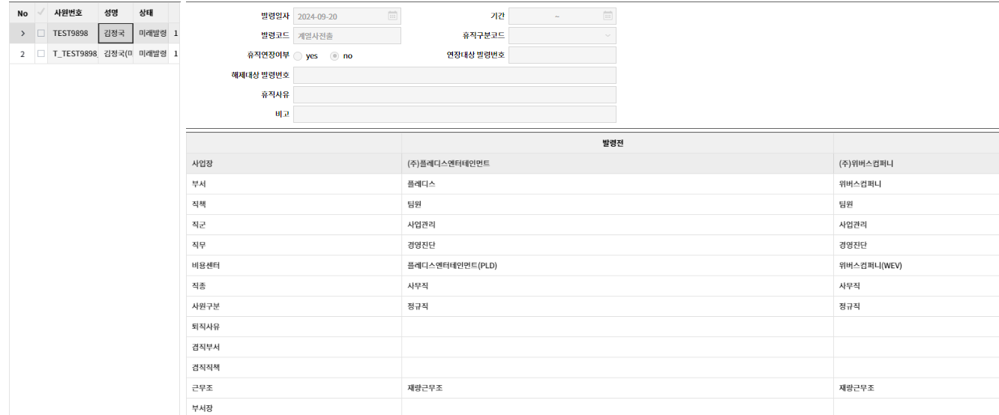
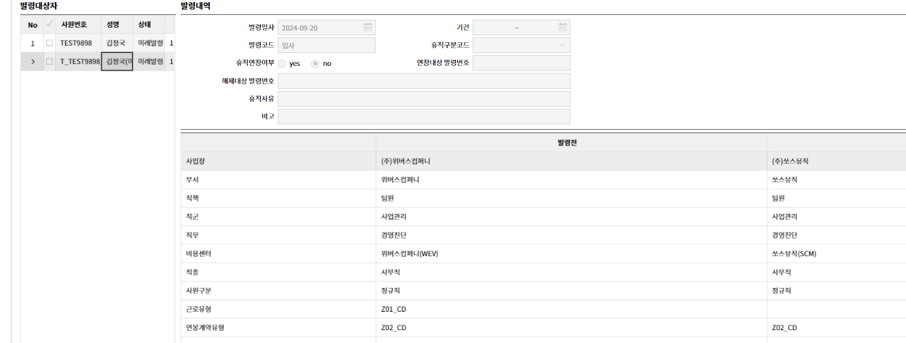
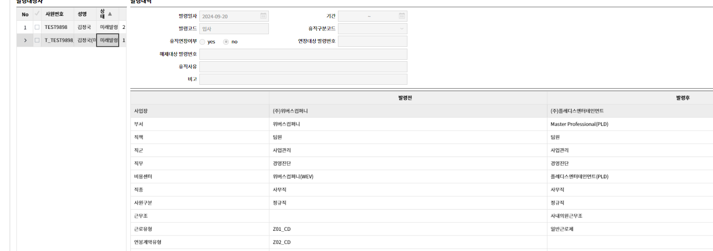
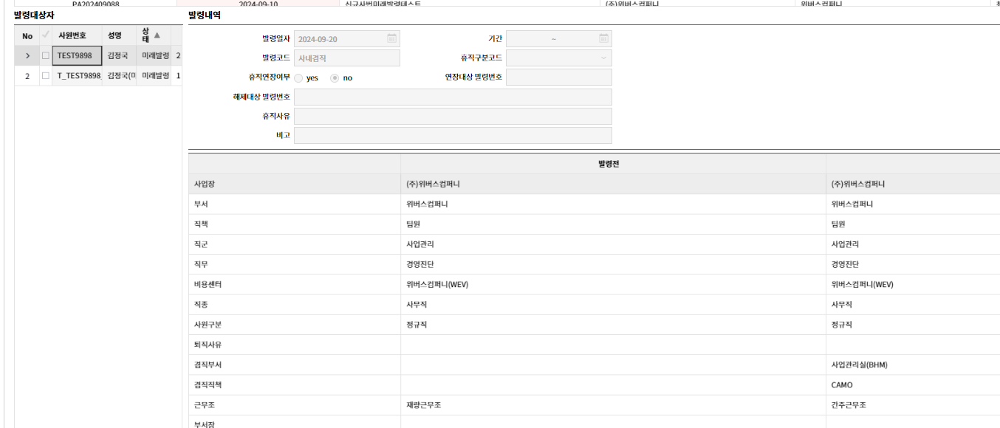

    

<details>
<summary>java</summary>

    ```java
    package com.douzone.comet.service.hr.pamcom.z20313;
    
    import java.io.BufferedReader;
    import java.io.DataOutputStream;
    import java.io.InputStreamReader;
    import java.net.HttpURLConnection;
    import java.net.URL;
    import java.text.SimpleDateFormat;
    import java.time.LocalDate;
    import java.time.format.DateTimeFormatter;
    import java.util.ArrayList;
    import java.util.Arrays;
    import java.util.Calendar;
    import java.util.Collections;
    import java.util.Comparator;
    import java.util.Date;
    import java.util.HashMap;
    import java.util.HashSet;
    import java.util.List;
    import java.util.Map;
    import java.util.Objects;
    import java.util.Optional;
    import java.util.UUID;
    import java.util.function.Function;
    import java.util.regex.Matcher;
    import java.util.regex.Pattern;
    import java.util.stream.Collectors;
    
    import org.apache.commons.collections.MapUtils;
    import org.json.simple.JSONObject;
    import org.json.simple.parser.JSONParser;
    import org.springframework.beans.BeanUtils;
    import org.springframework.beans.factory.annotation.Autowired;
    import org.springframework.transaction.annotation.Transactional;
    
    import com.douzone.comet.component.eap.OrgChartManage;
    import com.douzone.comet.components.DzCometService;
    import com.douzone.comet.jdbc.mybatis.DzMybatisSupport;
    import com.douzone.comet.service.hr.common.HrCommonService;
    import com.douzone.comet.service.hr.common.models.HrConfigMst;
    import com.douzone.comet.service.hr.common.utils.HrConvertUtil;
    import com.douzone.comet.service.hr.common.utils.HrNHSendAPIUtil;
    import com.douzone.comet.service.hr.common.z20313.OdmCommon_Z20313Service;
    import com.douzone.comet.service.hr.pamcom.z20313.models.Pamcom00200Cancellation;
    import com.douzone.comet.service.hr.pamcom.z20313.models.Pamcom00200_SendAPIModel_NH;
    import com.douzone.comet.service.hr.pamcom.z20313.models.Pamcom00200_auth;
    import com.douzone.comet.service.hr.pamcom.z20313.models.Pamcom00200_club;
    import com.douzone.comet.service.hr.pamcom.z20313.models.Pamcom00200_config;
    import com.douzone.comet.service.hr.pamcom.z20313.models.Pamcom00200_cost_dist;
    import com.douzone.comet.service.hr.pamcom.z20313.models.Pamcom00200_emp;
    import com.douzone.comet.service.hr.pamcom.z20313.models.Pamcom00200_emplist;
    import com.douzone.comet.service.hr.pamcom.z20313.models.Pamcom00200_gnfdDcCd;
    import com.douzone.comet.service.hr.pamcom.z20313.models.Pamcom00200_historyParam;
    import com.douzone.comet.service.hr.pamcom.z20313.models.Pamcom00200_huanall_dept;
    import com.douzone.comet.service.hr.pamcom.z20313.models.Pamcom00200_huanall_enter;
    import com.douzone.comet.service.hr.pamcom.z20313.models.Pamcom00200_huanall_pay_step;
    import com.douzone.comet.service.hr.pamcom.z20313.models.Pamcom00200_list_anreal;
    import com.douzone.comet.service.hr.pamcom.z20313.models.Pamcom00200_listcode;
    import com.douzone.comet.service.hr.pamcom.z20313.models.Pamcom00200_listcode_aft;
    import com.douzone.comet.service.hr.pamcom.z20313.models.Pamcom00200_listcode_bef;
    import com.douzone.comet.service.hr.pamcom.z20313.models.Pamcom00200_listd;
    import com.douzone.comet.service.hr.pamcom.z20313.models.Pamcom00200_listm;
    import com.douzone.comet.service.hr.pamcom.z20313.models.Pamcom00200_listsd2;
    import com.douzone.comet.service.hr.pamcom.z20313.models.Pamcom00200_salary;
    import com.douzone.comet.service.hr.pamcom.z20313.models.Pamcom00200_selectExcelData;
    import com.douzone.comet.service.hr.pamcom.z20313.models.Pamcom00200_templist;
    import com.douzone.comet.service.hr.pamcom.z20313.models.Pamcom00200_userinfo;
    import com.douzone.comet.service.util.DateUtil;
    import com.douzone.comet.service.util.StringUtil;
    import com.douzone.comet.service.util.WhoColumnsUtil;
    import com.douzone.comet.service.util.auth.AuthTable;
    import com.douzone.comet.service.util.auth.AuthUtil;
    import com.douzone.comet.service.util.data.CompanyMasterDataProvider;
    import com.douzone.comet.service.util.data.models.SingleObject;
    import com.douzone.comet.service.util.exception.DzExceptionWrapper;
    import com.douzone.comet.service.util.localize.LocalizeUtil;
    import com.douzone.comet.service.util.log.TableHistoryLogger;
    import com.douzone.comet.service.util.log.TableHistoryLogger.TableHistoryEventFlag;
    import com.douzone.comet.service.util.mybatis.MyBatisUtil;
    import com.douzone.comet.util.dews.version.DewsVersionUtils;
    import com.douzone.gpd.components.exception.DzApplicationRuntimeException;
    import com.douzone.gpd.core.DzGlobalVariable;
    import com.douzone.gpd.jdbc.core.DbProvider;
    import com.douzone.gpd.jdbc.core.MapperType;
    import com.douzone.gpd.jdbc.objects.SqlPack;
    import com.douzone.gpd.jdbc.transaction.DbTransaction;
    import com.douzone.gpd.restful.annotation.DzApi;
    import com.douzone.gpd.restful.annotation.DzApiService;
    import com.douzone.gpd.restful.annotation.DzParam;
    import com.douzone.gpd.restful.enums.CometModule;
    import com.douzone.gpd.restful.enums.DzParamType;
    import com.douzone.gpd.restful.enums.DzRequestMethod;
    import com.douzone.gpd.restful.model.DzGridModel;
    import com.douzone.gpd.smtp.model.MailAddress;
    import com.douzone.gpd.smtp.model.MailSetting;
    import com.douzone.gpd.smtp.model.MailSetting.MailSettingBuilder;
    import com.douzone.gpd.util.Convert;
    import com.fasterxml.jackson.core.type.TypeReference;
    import com.fasterxml.jackson.databind.ObjectMapper;
    import com.google.common.reflect.Parameter;
    
    import Altibase.jdbc.driver.util.StringUtils;  
    
    /**  
     * @FileName : Pamcom00200Service_Z20313
     * @Date : 2020.09.28\  
     * @작성자 : 주희정
     * @변경이력 :
     * @프로그램 설명 : 인사발령등록
     */
    @DzApiService(value = "Pamcom00200Service_Z20313", module = CometModule.HR, desc = "인사관리-발령관리-인사발령등록", version = "1.0.20240909.01")
    public class Pamcom00200Service_Z20313 extends DzCometService {
    	  
    	@Autowired
    	OdmCommon_Z20313Service odmCommon;
    	
    	@Autowired
    	WhoColumnsUtil wcu;
    
    	@Autowired
    	AuthUtil au;  
    
    	@Autowired
    	HrConvertUtil hcu;	
    	
    	@Autowired
    	HrCommonService hcs;
        
    	@Autowired
    	CompanyMasterDataProvider cmdp;
    
    	@Autowired
    	TableHistoryLogger _tableHistoryLogger;  
    
    	@Autowired
    	LocalizeUtil _localize;
      
    	@Autowired
    	OrgChartManage orgchartmanage;
    
    	@Autowired
    	private DewsVersionUtils dewsVersionUtils;
    	
    
    	@Autowired
    	private DzMybatisSupport mybatisSupport;
    
    	@DzApi(url = "/pamcom00200_paystepConfig", desc = "인사발령등록_사용자정보", httpMethod = DzRequestMethod.GET)
    	public List<Map<String, Object>> pamcom00200_paystepConfig() throws Exception {
    		   List<Map<String, Object>> config = new ArrayList<Map<String, Object>>();
    		try {
    
    			HashMap<String, Object> parameters = new HashMap<String, Object>();
    			parameters.put("P_COMPANY_CD", this.getCompanyCode());
    			parameters.put("P_LANG_CD", this.getLanguage().toUpperCase());
    
    			String sqlText = MyBatisUtil.getId(this.getClass(), "Pamcom00200_Z20313.paystepConfig",true);
    
    			SqlPack so = new SqlPack();
    			so.setStoreProcedure(false);
    			so.setMapperType(MapperType.MyBatis);
    			so.getInParameters().putAll(parameters);
    			so.setSqlText(sqlText);
    
    			config = this.queryForList(so);
    
    
    
    		} catch (DzApplicationRuntimeException e) {
    			throw e;
    		} catch (Exception e) {
    			throw e;  
    		}
    		return config;
      
    	}
    	
    	@DzApi(url = "/pamcom00200_config", desc = "인사발령등록_환경설정", httpMethod = DzRequestMethod.GET)
    	public List<Map<String, Object>> pamcom00200_config() throws Exception {
    		List<Map<String, Object>> config = new ArrayList<Map<String, Object>>();
    		try {
    			HashMap<String, Object> parameters = new HashMap<String, Object>();
    			parameters.put("P_COMPANY_CD", this.getCompanyCode());
    			parameters.put("P_LANG_CD", this.getLanguage().toUpperCase());
    
    			String sqlText = MyBatisUtil.getId(this.getClass(), "Pamcom00200_Z20313.configData",true);
    
    			SqlPack so = new SqlPack();
    			so.setStoreProcedure(false);
    			so.setMapperType(MapperType.MyBatis);
    			so.getInParameters().putAll(parameters);
    			so.setSqlText(sqlText);
    
    			config = this.queryForList(so);
    		} catch (DzApplicationRuntimeException e) {
    			throw e;
    		} catch (Exception e) {
    			throw e;  
    		}
    		return config;
    	}
    
    	@DzApi(url = "/pamcom00200_paystepList", desc = "인사발령등록_사용자정보", httpMethod = DzRequestMethod.GET)
    	public List<Map<String, Object>> pamcom00200_paystepList(
    			@DzParam(key = "rvers_ym", desc = "귀속년월", paramType = DzParamType.QueryString) String rvers_ym,
    			@DzParam(key = "grp_jknd_cd", desc = "그룹직종코드", paramType = DzParamType.QueryString) String grp_jknd_cd,
    			@DzParam(key = "pstn_cd", desc = "직급코드", paramType = DzParamType.QueryString) String pstn_cd,
    			@DzParam(key = "keyword", desc = "검색어", paramType = DzParamType.QueryString) String keyword)
    			throws Exception {
    		List<Map<String, Object>> config = new ArrayList<Map<String, Object>>();
    		try {
    
    
    
    			HashMap<String, Object> parameters = new HashMap<String, Object>();
    			parameters.put("P_COMPANY_CD", this.getCompanyCode());
    			parameters.put("P_RVERS_YM", rvers_ym);
    			parameters.put("P_GRP_JKND_CD", grp_jknd_cd);
    			parameters.put("P_PSTN_CD", pstn_cd);
    			parameters.put("P_KEYWORD", keyword);
    
    			String sqlText = MyBatisUtil.getId(this.getClass(), "Pamcom00200_Z20313.paystepList",true);
    
    			SqlPack so = new SqlPack();
    			so.setStoreProcedure(false);
    			so.setMapperType(MapperType.MyBatis);
    			so.getInParameters().putAll(parameters);
    			so.setSqlText(sqlText);
    
    			config = this.queryForList(so);
    
    		} catch (DzApplicationRuntimeException e) {
    			throw e;
    		} catch (Exception e) {
    			throw e;
    		}
    		return config;
    
    	}
    	@DzApi(url = "/pamcom00200_userinfo", desc = "인사발령등록_사용자정보", httpMethod = DzRequestMethod.GET)
    	public Pamcom00200_userinfo pamcom00200_userinfo() throws Exception {
    		Pamcom00200_userinfo info = new Pamcom00200_userinfo();
    		List<Pamcom00200_templist> url = new ArrayList<Pamcom00200_templist>();
    		HashMap<String, Object> parameters = new HashMap<String, Object>();
    
    		String sqlText = "";
    		SqlPack so = new SqlPack();
    		so.setStoreProcedure(false);
    		so.setMapperType(MapperType.MyBatis);
    
    		info.setCompany_cd(this.getCompanyCode());
    		parameters.put("P_COMPANY_CD", this.getCompanyCode());
    
    		if (this.getBizareaCode() == null || this.getBizareaCode().equals("") || this.getDeptName() == null) {
    			if (this.getBizareaCode() == null) {
    				logger.info(StringUtil.Format("BizArea is null"));
    			} else if (this.getBizareaCode().equals("")) {
    				logger.info(StringUtil.Format("BizArea is empty"));
    			}
    
    			parameters.put("P_LANG_CD", this.getLanguage().toUpperCase());
    			parameters.put("P_DEPT_CD", this.getDeptCode());
    
    			List<Pamcom00200_templist> ds = new ArrayList<Pamcom00200_templist>();
    			sqlText = MyBatisUtil.getId(this.getClass(), "Pamcom00200_Z20313.templist",true);
    
    			so.getInParameters().putAll(parameters);
    			so.setSqlText(sqlText);
    
    			ds = this.queryForModel(so, Pamcom00200_templist.class);
    			if (ds.size() > 0) {
    				info.setBizarea_cd(ds.get(0).tmp_value1);
    				info.setBizarea_nm(ds.get(0).tmp_value2);
    				info.setDept_nm(ds.get(0).tmp_value3);
    			}
    		} else {
    			info.setBizarea_cd(this.getBizareaCode());
    			info.setBizarea_nm(this.getBizareaName());
    			info.setDept_nm(this.getDeptName());
    		}
    
    		info.setDept_cd(this.getDeptCode());
    		info.setUser_id(this.getUserId());
    		info.setUser_nm(this.getUserName());
    		info.setEmp_no(this.getEmpCode());
    
    		sqlText = MyBatisUtil.getId(this.getClass(), "Pamcom00200_Z20313.getUrl",true);
    
    		so.getInParameters().putAll(parameters);
    		so.setSqlText(sqlText);
    
    		url = this.queryForModel(so, Pamcom00200_templist.class);
    
    		if (url.size() > 0) {
    			info.setUrl_nm(url.get(0).getUrl_nm());
    		}
    
    		return info;
    	}
    
    	@DzApi(url = "/pamcom00200_listm", desc = "인사발령등록 마스터 조회", httpMethod = DzRequestMethod.GET)
    	public List<Pamcom00200_listm> pamcom00200_listm(
    			@DzParam(key = "gnfd_lke_no", desc = "발령호수", paramType = DzParamType.QueryString) String gnfd_lke_no,
    			@DzParam(key = "bizarea_cd", desc = "사업장", paramType = DzParamType.QueryString) String bizarea_cd,
    			@DzParam(key = "keyword", desc = "검색어", paramType = DzParamType.QueryString) String keyword)
    			throws Exception {
    
    		List<Pamcom00200_listm> ds = new ArrayList<Pamcom00200_listm>();
    		try {
    			// 파라미터 준비
    			HashMap<String, Object> parameters = new HashMap<String, Object>();
    			auth_bizDept(parameters, "", bizarea_cd, "", "");  
    			parameters.put("P_DEPT_CD_PIPE", new ArrayList<String>());
    			parameters.put("P_GNFD_LKE_NO", gnfd_lke_no);
    			parameters.put("P_KEYWORD", keyword);
    
    			SqlPack so = new SqlPack();
    			so.setStoreProcedure(false);  
    
    			String qry = MyBatisUtil.getId(this.getClass(), "Pamcom00200_Z20313.insertm_applist",true);
    			so.setSqlText(qry);
    			so.setMapperType(MapperType.MyBatis);
    			so.getInParameters().putAll(parameters);
    			this.update(so); // 조회 전 HR_HUAN_MST의 내용을 HR_HUANAPP_LIST 테이블에 옮겨준다
    
    			parameters.put("P_DRS_CODE", this.getDrsCode());
    			// 쿼리 준비
    			String selectSql = MyBatisUtil.getId(this.getClass(), "Pamcom00200_Z20313.listm",true);
    
    			logger.info(StringUtil.Format("Pamcom00200_Z20313.uery:"));
    			logger.info(StringUtil.Format(selectSql));
    
    			so.setMapperType(MapperType.MyBatis);
    			so.getInParameters().putAll(parameters);
    			so.setSqlText(selectSql);
    
    			ds = this.queryForModel(so, Pamcom00200_listm.class);
    
    			for (Pamcom00200_listm item : ds) {
    				item.set_uid(UUID.randomUUID().toString());
    			}
    		} catch (DzApplicationRuntimeException e) {
    			throw e;
    
    		} catch (Exception e) {
    			throw e;
    		}
    		return ds;
    	}
    
    	@DzApi(url = "/pamcom00200_listd", desc = "인사발령등록 디테일 조회", httpMethod = DzRequestMethod.GET)
    	public List<Pamcom00200_listd> pamcom00200_listd(
    			@DzParam(key = "gnfd_lke_no", desc = "발령호수", paramType = DzParamType.QueryString) String gnfd_lke_no,
    			@DzParam(key = "empsearch", desc = "검색어", paramType = DzParamType.QueryString) String empsearch)
    			throws Exception {
    
    		List<Pamcom00200_listd> ds = new ArrayList<Pamcom00200_listd>();
    		try {
    			// 파라미터 준비
    			HashMap<String, Object> parameters = new HashMap<String, Object>();
    			parameters.put("P_COMPANY_CD", this.getCompanyCode());
    			parameters.put("P_LANG_CD", this.getLanguage().toUpperCase());
    			parameters.put("P_GNFD_LKE_NO", gnfd_lke_no);
    			parameters.put("P_TODAY", LocalDate.now().toString().replaceAll("-", ""));
    			parameters.put("P_EMP_KEY", empsearch);
    			parameters.put("P_DRS_CODE", this.getDrsCode());
    
    			String sqlText = MyBatisUtil.getId(this.getClass(), "Pamcom00200_Z20313.listd",true);
    			SqlPack so = new SqlPack();
    			so.setStoreProcedure(false);
    			so.setMapperType(MapperType.MyBatis);
    			so.getInParameters().putAll(parameters);
    			so.setSqlText(sqlText);
    
    			ds = this.queryForModel(so, Pamcom00200_listd.class);
    
    			for (Pamcom00200_listd item : ds) {
    				item.set_uid(UUID.randomUUID().toString());
    			}
    		} catch (DzApplicationRuntimeException e) {
    			throw e;
    
    		} catch (Exception e) {
    			throw e;
    		}
    		return ds;
    	}
    
    	@DzApi(url = "/pamcom00200_listsd", desc = "발령내역조회", httpMethod = DzRequestMethod.GET)
    	public List<Pamcom00200_listsd2> pamcom00200_listsd2(
    			@DzParam(key = "gnfd_lke_no", desc = "발령호수", paramType = DzParamType.QueryString) String gnfd_lke_no,
    			@DzParam(key = "emp_no", desc = "사원번호", paramType = DzParamType.QueryString) String emp_no,
    			@DzParam(key = "gnfd_cd", desc = "발령코드", paramType = DzParamType.QueryString) String gnfd_cd,
    			@DzParam(key = "gnfd_dt", desc = "발령일", paramType = DzParamType.QueryString) String gnfd_dt,
    			@DzParam(key = "to_slst_cd", desc = "변경호봉", paramType = DzParamType.QueryString) String to_slst_cd,
    			@DzParam(key = "mltplc_std_dt", desc = "변경승호예정일", paramType = DzParamType.QueryString) String mltplc_std_dt)
    			throws Exception {
    		List<Pamcom00200_listsd2> ds = new ArrayList<Pamcom00200_listsd2>();
    		SqlPack sqlPack = new SqlPack();
    		String drsCode = this.getDrsCode();
    		// Mapiing Table 값 불러오기
    		try {
    			boolean empty_data = false;
    
    			if (gnfd_lke_no.equals("no")) {
    				return ds;
    			} 
    
    			if (!empty_data) {
    				HashMap<String, Object> parameters = new HashMap<String, Object>();
    
    				parameters.put("P_COMPANY_CD", this.getCompanyCode());
    				parameters.put("P_LANG_CD", this.getLanguage().toUpperCase());
    				parameters.put("P_GNFD_LKE_NO", gnfd_lke_no);
    				parameters.put("P_EMP_NO", emp_no);
    				parameters.put("P_GNFD_CD", gnfd_cd);
    
    				sqlPack = createSqlPack("tmpValue2", parameters);
    				List<Pamcom00200_templist> tds = new ArrayList<Pamcom00200_templist>();
    				tds = this.queryForModel(sqlPack, Pamcom00200_templist.class);
    
    				if (tds.size() == 0)
    					empty_data = true;
    			}
      
    			DateTimeFormatter dtf = DateTimeFormatter.ofPattern("yyyyMMdd");
    			LocalDate ld = LocalDate.now();
    			String V_COM051 = "1";
    			List<HrConfigMst> configMstDataList = hcs.getConfigMstData("COM051");
    			if(configMstDataList.size() > 0 && configMstDataList.get(0).getChar_cd_val_dc() != null && !configMstDataList.get(0).getChar_cd_val_dc().equals("")) {
    				V_COM051 = configMstDataList.get(0).getChar_cd_val_dc();
    			}
    
    			
    		
    			
    			HashMap<String, Object> parameters = new HashMap<String, Object>();
    			parameters.put("P_LANG_CD", this.getLanguage().toUpperCase());
    			parameters.put("P_DRS_CODE", drsCode);
    			parameters.put("P_MENU_CD", this.getRequestedPageId().toUpperCase());
    			parameters.put("P_COM051", V_COM051);
    			parameters.put("P_GNFD_LKE_NO", gnfd_lke_no);
    			parameters.put("P_TODAY", dtf.format(ld));
    			parameters.put("P_COMPANY_CD", this.getCompanyCode());
    			parameters.put("P_EMP_NO", emp_no);
    			parameters.put("P_GNFD_CD", gnfd_cd);
    			parameters.put("P_GNFD_DT", gnfd_dt);
    			parameters.put("P_TO_SLST_CD", to_slst_cd);
    			parameters.put("P_MLTPLC_STD_DT", mltplc_std_dt);
    
    			sqlPack = createSqlPack("future_check_SDTL_EXIST", parameters);
    			String futureExistSdtl  = this.queryForObject(sqlPack).toString();  
    			  
    			// 미래발령일때도 empty_data에 못타서 그렇다
    			if (empty_data && futureExistSdtl.equals("N")) {
    				// 빈 데이터 필요 - HR_HUAN_SDTL 테이블에 데이터가 존재하지 않으므로 사용되는 발령코드 기준으로
    				// 데이터를 생성하여 리턴한다
    
    				
    				// 해당 발령견이 없을때 
    				sqlPack = createSqlPack("future_check_GNFD_ST_TP", parameters);
    				String hasFuture  = this.queryForObject(sqlPack).toString();  
    				
    
    				
    				
    				if (gnfd_dt.compareTo(dtf.format(ld)) > 0 
    						&& hasFuture.equals("Y")) {
    				
    					parameters.put("P_FLAG", "future");
    					sqlPack = createSqlPack("listsd_future", parameters);
    				}else {
    			 		sqlPack = createSqlPack("listsd_empty3", parameters);  
    
    				}
    				
    				// 발령날짜가 미래면서, 미래발령인 내역이 있는 사람들만
    				
    				
    				
    			} else {
    				// 이미 존재하는 데이터이므로 이 데이터를 바탕으로 리턴시킨다
    				parameters.put("P_GNFD_LKE_NO", gnfd_lke_no);
    				parameters.put("P_COMPANY_CD", this.getCompanyCode());
    				parameters.put("P_EMP_NO", emp_no);
    				parameters.put("P_GNFD_CD", gnfd_cd);
    				parameters.put("P_LANG_CD", this.getLanguage().toUpperCase());
    
    
    				sqlPack = createSqlPack("listsd", parameters);
    			}
    
    			ds = this.queryForModel(sqlPack, Pamcom00200_listsd2.class);
    
    
    		} catch (DzApplicationRuntimeException e) {
    			throw e;
    
    		} catch (Exception e) {
    			throw e;
    		}
    		return ds;
    	}
    
    	private Map<String, Object> getIndexOfH02(List<Pamcom00200_listsd2> ds) {
    		Map<String, Object> h02Map = new HashMap<String, Object>();
    		for (int i = 0; i < ds.size(); i++) {
    			if ("H02".equals(ds.get(i).getGnfd_dc_cd())) {
    				h02Map.put("hasH02", true);
    				h02Map.put("index", i);
    			}
    		}
    		return h02Map;
    	}
    
    	private void deptOrderChangeInHuanList(int indexOfH02, List<Pamcom00200_listsd2> ds) {
    		Pamcom00200_listsd2 temp;
    		for (int i = 0; i < ds.size(); i++) {
    			if ("Z12".equals(ds.get(i).getGnfd_dc_cd()) || "Z13".equals(ds.get(i).getGnfd_dc_cd())) {
    				temp = ds.get(i);
    				ds.remove(i);
    				ds.add(indexOfH02, temp);
    				indexOfH02++;
    			}
    		}
    	}
    
    	/*
    	 * 사용안 하는 함수로 파악되어 주석처리 22.06.22 문제 생길 시, 주석해제요망. 문제가 없다면 추후 삭제 요망.
    	 */
    //	@DzApi(url = "/pamcom00200_user_list", desc = "사원ID로 유저ID 추출", httpMethod = DzRequestMethod.GET)
    //	public List<Pamcom00200_ciUserMstList> pamcom00200_user_list(
    //			@DzParam(key = "emp_no", desc = "사원번호", paramType = DzParamType.QueryString) String emp_no)
    //			throws Exception {
    //		List<Pamcom00200_ciUserMstList> items = new ArrayList<Pamcom00200_ciUserMstList>();
    //		try {
    //			HashMap<String, Object> parameters = new HashMap<String, Object>();
    //
    //			parameters.put("P_COMPANY_CD", this.getCompanyCode());
    //			parameters.put("P_EMP_NO", emp_no);
    //
    //			String sqlText = MyBatisUtil.getId(this.getClass(), "Pamcom00200_Z20313.ciUserMstList");
    //			SqlPack so = new SqlPack();
    //			so.setStoreProcedure(false);
    //			so.setMapperType(MapperType.MyBatis);
    //			so.getInParameters().putAll(parameters);
    //			so.setSqlText(sqlText);
    //
    //			items = this.queryForModel(so, Pamcom00200_ciUserMstList.class);
    //		} catch (Exception e) {
    //			throw e;
    //		}
    //		return items;
    //	}
    
    	@DzApi(url = "/pamcom00200_emplist", desc = "발령자추가 사원리스트 도움", httpMethod = DzRequestMethod.POST)
    	public List<Pamcom00200_emplist> pamcom00200_emplist(
    			@DzParam(key = "bizarea_cd", desc = "사업장", paramType = DzParamType.Body) String bizarea_cd,
    			@DzParam(key = "dept_cd", desc = "부서", paramType = DzParamType.Body) String dept_cd,
    			@DzParam(key = "posi_cd", desc = "직위", paramType = DzParamType.Body) String posi_cd,
    			@DzParam(key = "pstn_cd", desc = "직급", paramType = DzParamType.Body) String pstn_cd,
    			@DzParam(key = "start_dt", desc = "입사시작일", paramType = DzParamType.Body) String start_dt,
    			@DzParam(key = "end_dt", desc = "입사종료일", paramType = DzParamType.Body) String end_dt,
    			@DzParam(key = "ogrp_cd", desc = "직군", paramType = DzParamType.Body) String ogrp_cd,
    			@DzParam(key = "emp_tp", desc = "사원구분", paramType = DzParamType.Body) String emp_tp,
    			@DzParam(key = "hlof_fg_cd", desc = "재직구분", paramType = DzParamType.Body) String hlof_fg_cd,
    			@DzParam(key = "empy_tp_cd", desc = "고용구분", paramType = DzParamType.Body) String empy_tp_cd,
    			@DzParam(key = "kor_nm", desc = "사원명", paramType = DzParamType.Body) String kor_nm)
    //			@DzParam(key = "emp_kwd", desc = "", paramType = DzParamType.Body) String emp_kwd
    			throws Exception {
    
    		List<Pamcom00200_emplist> ds = new ArrayList<Pamcom00200_emplist>();
    		try {
    			Date ld = new Date();
    			SimpleDateFormat fm = new SimpleDateFormat("yyyyMMdd");
    			// 파라미터 준비
    			HashMap<String, Object> parameters = new HashMap<String, Object>();
    			auth_bizDept(parameters, "", bizarea_cd, dept_cd, "");
    			parameters.put("P_DRS_CODE", this.getDrsCode());
    			parameters.put("P_DEPT_CD", dept_cd);
    			parameters.put("P_TODAY", fm.format(ld));  
    			parameters.put("P_POSI_CD", hcu.getMultiParam(posi_cd));
    			parameters.put("P_PSTN_CD", hcu.getMultiParam(pstn_cd));
    			parameters.put("P_START_DT", start_dt);
    			parameters.put("P_END_DT", end_dt);
    			parameters.put("P_OGRP_CD", hcu.getMultiParam(ogrp_cd));
    			parameters.put("P_EMP_TP", hcu.getMultiParam(emp_tp));
    			parameters.put("P_HLOF_FG_CD", hlof_fg_cd);
    			parameters.put("P_EMPY_TP_CD", empy_tp_cd);
    //			parameters.put("P_EMP_KWD", emp_kwd);
    			if (kor_nm != null && kor_nm != "") {
    				parameters.put("P_KOR_NM", kor_nm.replace("_", "#_"));
    			} else {
    				parameters.put("P_KOR_NM", kor_nm);
    			}
    
    			// 쿼리 준비
    			String selectSql = MyBatisUtil.getId(this.getClass(), "Pamcom00200_Z20313.emplist",true);
    
    			logger.info(StringUtil.Format("Pamcom00200_Z20313.emplist query:"));
    			logger.info(StringUtil.Format(selectSql));
    
    			SqlPack so = new SqlPack();
    			so.setStoreProcedure(false);
    			so.setMapperType(MapperType.MyBatis);
    			so.getInParameters().putAll(parameters);
    			so.setSqlText(selectSql);
    			ds = this.queryForModel(so, Pamcom00200_emplist.class);
    		} catch (DzApplicationRuntimeException e) {
    			throw e;
    
    		} catch (Exception e) {
    			throw e;
    		}
    		return ds;
    	}
    
    	@DzApi(url = "/pamcom00200_listcode_bef", desc = "서브디테일 발령전 코드목록 조회", httpMethod = DzRequestMethod.GET)
    	public List<Pamcom00200_listcode_bef> pamcom00200_listcode_bef(
    			@DzParam(key = "gnfd_dc_cd", desc = "발령내역코드", paramType = DzParamType.QueryString) String gnfd_dc_cd)
    			throws Exception {
    
    		List<Pamcom00200_listcode_bef> ds = new ArrayList<Pamcom00200_listcode_bef>();
    
    		try {
    			List<Pamcom00200_listcode> ods = new ArrayList<Pamcom00200_listcode>();
    			ods = pamcom00200_listcode(gnfd_dc_cd);
    
    			for (Pamcom00200_listcode item : ods) {
    				Pamcom00200_listcode_bef bef = new Pamcom00200_listcode_bef();
    				bef.setCd_befcode(item.getHr_cd());
    				bef.setNm_befcode(item.getHr_cd_nm());
    				ds.add(bef);
    			}
    		} catch (DzApplicationRuntimeException e) {
    			throw e;
    
    		} catch (Exception e) {
    			throw e;
    		}
    		return ds;
    	}
    
    	@DzApi(url = "/pamcom00200_listcode_aft", desc = "서브디테일 발령후 코드목록 조회", httpMethod = DzRequestMethod.GET)
    	public List<Pamcom00200_listcode_aft> pamcom00200_listcode_aft(
    			@DzParam(key = "gnfd_dc_cd", desc = "발령내역코드", paramType = DzParamType.QueryString) String gnfd_dc_cd)
    			throws Exception {
    
    		List<Pamcom00200_listcode_aft> ds = new ArrayList<Pamcom00200_listcode_aft>();
    
    		try {
    			List<Pamcom00200_listcode> ods = new ArrayList<Pamcom00200_listcode>();
    			ods = pamcom00200_listcode(gnfd_dc_cd);
    
    			for (Pamcom00200_listcode item : ods) {
    				Pamcom00200_listcode_aft aft = new Pamcom00200_listcode_aft();
    				aft.setCd_aftcode(item.getHr_cd());
    				aft.setNm_aftcode(item.getHr_cd_nm());
    				ds.add(aft);
    			}
    		} catch (DzApplicationRuntimeException e) {
    			throw e;
    
    		} catch (Exception e) {
    			throw e;
    		}
    		return ds;
    	}
    
    	@DzApi(url = "/pamcom00200_listcode_pi_bef", desc = "발령전 서브디테일 호봉코드목록 조회", httpMethod = DzRequestMethod.GET)
    	public List<Pamcom00200_listcode_bef> pamcom00200_listcode_pi_bef(
    			@DzParam(key = "emp_no", desc = "사원번호", paramType = DzParamType.QueryString) String emp_no,
    			@DzParam(key = "pstn_cd", desc = "직급코드", paramType = DzParamType.QueryString) String pstn_cd,
    			@DzParam(key = "posi_cd", desc = "직위코드", paramType = DzParamType.QueryString) String posi_cd,
    			@DzParam(key = "jknd_cd", desc = "직종코드", paramType = DzParamType.QueryString) String jknd_cd,
    			@DzParam(key = "duty_cd", desc = "직무코드", paramType = DzParamType.QueryString) String duty_cd,
    			@DzParam(key = "odty_cd", desc = "직책코드", paramType = DzParamType.QueryString) String odty_cd)
    			throws Exception {
    
    		List<Pamcom00200_listcode_bef> ds = new ArrayList<Pamcom00200_listcode_bef>();
    
    		try {
    			List<Pamcom00200_listcode> ods = new ArrayList<Pamcom00200_listcode>();
    			ods = pamcom00200_listcode_pi(emp_no, pstn_cd, posi_cd, jknd_cd, duty_cd, odty_cd);
    
    			for (Pamcom00200_listcode item : ods) {
    				Pamcom00200_listcode_bef bef = new Pamcom00200_listcode_bef();
    				bef.setCd_befcode(item.getHr_cd());
    				bef.setNm_befcode(item.getHr_cd_nm());
    				ds.add(bef);
    			}
    		} catch (DzApplicationRuntimeException e) {
    			throw e;
    
    		} catch (Exception e) {
    			throw e;
    		}
    		return ds;
    	}
    
    	@DzApi(url = "/pamcom00200_listcode_pi_aft", desc = "발령후 서브디테일 호봉코드목록 조회", httpMethod = DzRequestMethod.GET)
    	public List<Pamcom00200_listcode_aft> pamcom00200_listcode_pi_aft(
    			@DzParam(key = "emp_no", desc = "사원번호", paramType = DzParamType.QueryString) String emp_no,
    			@DzParam(key = "pstn_cd", desc = "직급코드", paramType = DzParamType.QueryString) String pstn_cd,
    			@DzParam(key = "posi_cd", desc = "직위코드", paramType = DzParamType.QueryString) String posi_cd,
    			@DzParam(key = "jknd_cd", desc = "직종코드", paramType = DzParamType.QueryString) String jknd_cd,
    			@DzParam(key = "duty_cd", desc = "직무코드", paramType = DzParamType.QueryString) String duty_cd,
    			@DzParam(key = "odty_cd", desc = "직책코드", paramType = DzParamType.QueryString) String odty_cd)
    			throws Exception {
    
    		List<Pamcom00200_listcode_aft> ds = new ArrayList<Pamcom00200_listcode_aft>();
    
    		try {
    			List<Pamcom00200_listcode> ods = new ArrayList<Pamcom00200_listcode>();
    			ods = pamcom00200_listcode_pi(emp_no, pstn_cd, posi_cd, jknd_cd, duty_cd, odty_cd);
    
    			for (Pamcom00200_listcode item : ods) {
    				Pamcom00200_listcode_aft aft = new Pamcom00200_listcode_aft();
    				aft.setCd_aftcode(item.getHr_cd());
    				aft.setNm_aftcode(item.getHr_cd_nm());
    				ds.add(aft);
    			}
    		} catch (DzApplicationRuntimeException e) {
    			throw e;
    
    		} catch (Exception e) {
    			throw e;
    		}
    		return ds;
    	}
    
    	@DzApi(url = "/pamcom00200_listcode_pi", desc = "서브디테일 호봉코드목록 조회", httpMethod = DzRequestMethod.GET)
    	public List<Pamcom00200_listcode> pamcom00200_listcode_pi(
    			@DzParam(key = "emp_no", desc = "사원번호", paramType = DzParamType.QueryString) String emp_no,
    			@DzParam(key = "pstn_cd", desc = "직급코드", paramType = DzParamType.QueryString) String pstn_cd,
    			@DzParam(key = "posi_cd", desc = "직위코드", paramType = DzParamType.QueryString) String posi_cd,
    			@DzParam(key = "jknd_cd", desc = "직종코드", paramType = DzParamType.QueryString) String jknd_cd,
    			@DzParam(key = "duty_cd", desc = "직무코드", paramType = DzParamType.QueryString) String duty_cd,
    			@DzParam(key = "odty_cd", desc = "직책코드", paramType = DzParamType.QueryString) String odty_cd)
    			throws Exception {
    		List<Pamcom00200_listcode> ds = new ArrayList<Pamcom00200_listcode>();
    
    		try {
    			Date ld = new Date();
    			SimpleDateFormat fm = new SimpleDateFormat("yyyyMMdd");
    
    			String today = fm.format(ld);
    
    			HashMap<String, Object> parameters = new HashMap<String, Object>();
    			parameters.put("P_COMPANY_CD", this.getCompanyCode());
    			parameters.put("P_EMP_NO", emp_no);
    			parameters.put("P_TODAY", today);
    			parameters.put("P_PSTN_CD", pstn_cd);
    			parameters.put("P_POSI_CD", posi_cd);
    			parameters.put("P_JKND_CD", jknd_cd);
    			parameters.put("P_DUTY_CD", duty_cd);
    			parameters.put("P_ODTY_CD", odty_cd);
    
    			String qry = MyBatisUtil.getId(this.getClass(), "Pamcom00200_Z20313.listcode_paystepinfo",true);
    
    			// 쿼리 준비
    			logger.info(StringUtil.Format("Pamcom00200_Z20313.listcode_paystepinfo query:"));
    			logger.info(StringUtil.Format(qry));
    
    			SqlPack so = new SqlPack();
    			so.setStoreProcedure(false);
    			so.setMapperType(MapperType.MyBatis);
    			so.getInParameters().putAll(parameters);
    			so.setSqlText(qry);
    			ds = this.queryForModel(so, Pamcom00200_listcode.class);
    		} catch (DzApplicationRuntimeException e) {
    			throw e;
    
    		} catch (Exception e) {
    			throw e;
    		}
    		return ds;
    	}
    
    	@DzApi(url = "/pamcom00200_listcode", desc = "서브디테일 코드목록 조회", httpMethod = DzRequestMethod.GET)
    	public List<Pamcom00200_listcode> pamcom00200_listcode(
    			@DzParam(key = "gnfd_dc_cd", desc = "발령내역코드", paramType = DzParamType.QueryString) String gnfd_dc_cd)
    			throws Exception {
    
    		List<Pamcom00200_listcode> ds = new ArrayList<Pamcom00200_listcode>();
    		try {
    			Date ld = new Date();
    			SimpleDateFormat fm = new SimpleDateFormat("yyyyMMdd");
    
    			String today = "", qry = "", sqlFile = "";
    			today = fm.format(ld);// dtf.format(ld);
    
    			HashMap<String, Object> parameters = new HashMap<String, Object>();
    			switch (gnfd_dc_cd) {
    			case "H01":
    				sqlFile = "Pamcom00200_Z20313.listcode_bizarea";
    				parameters.put("P_COMPANY_CD", this.getCompanyCode());
    				break;
    			case "H02":
    			case "H14": // 겸직부서명
    			case "H15": // 겸직직책
    				sqlFile = "Pamcom00200_Z20313.listcode_codedtl";
    				parameters.put("P_COMPANY_CD", this.getCompanyCode());
    				parameters.put("P_FIELD_CD", "P00980");
    			case "H17":
    				sqlFile = "Pamcom00200_Z20313.listcode_hrcodebase";
    				parameters.put("P_COMPANY_CD", this.getCompanyCode());
    				parameters.put("P_MENU_CD", "34");
    				break;
    			case "H18":
    			case "H20":
    				sqlFile = "Pamcom00200_Z20313.listcode_dept";
    				parameters.put("P_COMPANY_CD", this.getCompanyCode());
    				parameters.put("P_TODAY", today);
    				break;
    			case "H03":
    				sqlFile = "Pamcom00200_Z20313.listcode_codedtl";
    				parameters.put("P_COMPANY_CD", this.getCompanyCode());
    				parameters.put("P_FIELD_CD", "P00640");
    				break;
    			case "H04":
    				sqlFile = "Pamcom00200_Z20313.listcode_codedtl";
    				parameters.put("P_COMPANY_CD", this.getCompanyCode());
    				parameters.put("P_FIELD_CD", "P00980");
    				break;
    			case "H05":
    				sqlFile = "Pamcom00200_Z20313.listcode_codedtl";
    				parameters.put("P_COMPANY_CD", this.getCompanyCode());
    				parameters.put("P_FIELD_CD", "P00650");
    				break;
    			case "H06": // 사용되지 않음
    				sqlFile = "Pamcom00200_Z20313.listcode_codedtl";
    				parameters.put("P_COMPANY_CD", this.getCompanyCode());
    				parameters.put("P_FIELD_CD", "P00190");
    				break;
    			case "H07":
    				sqlFile = "Pamcom00200_Z20313.listcode_codedtl";
    				parameters.put("P_COMPANY_CD", this.getCompanyCode());
    				parameters.put("P_FIELD_CD", "P00660");
    				break;
    			case "H08":
    				sqlFile = "Pamcom00200_Z20313.listcode_codedtl";
    				parameters.put("P_COMPANY_CD", this.getCompanyCode());
    				parameters.put("P_FIELD_CD", "P00920");
    				break;
    			case "H09":
    				sqlFile = "Pamcom00200_Z20313.listcode_cc";
    				parameters.put("P_COMPANY_CD", this.getCompanyCode());
    				parameters.put("P_TODAY", today);
    				break;
    			case "H10":
    				sqlFile = "Pamcom00200_Z20313.listcode_codedtl";
    				parameters.put("P_COMPANY_CD", this.getCompanyCode());
    				parameters.put("P_FIELD_CD", "P00990");
    				break;
    			case "H11":
    				sqlFile = "Pamcom00200_Z20313.listcode_codedtl";
    				parameters.put("P_COMPANY_CD", this.getCompanyCode());
    				parameters.put("P_FIELD_CD", "P00220");
    				break;
    			case "H12":
    				sqlFile = "Pamcom00200_Z20313.listcode_codedtl";
    				parameters.put("P_COMPANY_CD", this.getCompanyCode());
    				parameters.put("P_FIELD_CD", "P01100");
    				break;
    			case "H13":
    				sqlFile = "Pamcom00200_Z20313.listcode_project";
    				parameters.put("P_COMPANY_CD", this.getCompanyCode());
    				break;
    			case "H19":
    				sqlFile = "Pamcom00200_Z20313.listcode_taxarea";
    				parameters.put("P_COMPANY_CD", this.getCompanyCode());
    				break;
    			case "H21":
    				sqlFile = "Pamcom00200_Z20313.listcode_codedtl";
    				parameters.put("P_COMPANY_CD", this.getCompanyCode());
    				parameters.put("P_FIELD_CD", "P00750");
    			case "H90":
    				sqlFile = "Pamcom00200_Z20313.listcode_codedtl";
    				parameters.put("P_COMPANY_CD", this.getCompanyCode());
    				parameters.put("P_FIELD_CD", "P01430");
    				break;
    			case "H91":
    				sqlFile = "Pamcom00200_Z20313.listcode_codedtl";
    				parameters.put("P_COMPANY_CD", this.getCompanyCode());
    				parameters.put("P_FIELD_CD", "P01440");
    				break;
    			case "H92":
    				sqlFile = "Pamcom00200_Z20313.listcode_codedtl";
    				parameters.put("P_COMPANY_CD", this.getCompanyCode());
    				parameters.put("P_FIELD_CD", "P01450");
    				break;
    			default:
    				sqlFile = "";
    				break;
    			}
    
    			// 쿼리 준비
    			qry = MyBatisUtil.getId(this.getClass(), sqlFile);
    
    			// 쿼리 준비
    			logger.info(StringUtil.Format("Pamcom00200_Z20313.listcode query:"));
    			logger.info(StringUtil.Format(qry));
    
    			SqlPack so = new SqlPack();
    			so.setStoreProcedure(false);
    			so.setMapperType(MapperType.MyBatis);
    			so.getInParameters().putAll(parameters);
    
    			so.setSqlText(qry);
    			ds = this.queryForModel(so, Pamcom00200_listcode.class);
    		} catch (DzApplicationRuntimeException e) {
    			throw e;
    
    		} catch (Exception e) {
    			throw e;
    		}
    		return ds;
    	}
    
    	/*
    	 * search_dt_enter_from = ""; search_dt_enter_to = ""; search_bizarea = "";
    	 * search_dept = ""; search_dt_probat_from = ""; search_dt_probat_to = "";
    	 * search_cd_emp = ""; search_cd_join = ""; search_dt_an_from = "";
    	 * search_dt_an_to
    	 */
    	@DzApi(url = "/pamcom00200_enterall_list", desc = "일괄입사입력 조회", httpMethod = DzRequestMethod.GET)
    	public List<Pamcom00200_huanall_enter> pamcom00200_enterall_list(
    			@DzParam(key = "gnfd_lke_no", desc = "발령호수", paramType = DzParamType.QueryString) String gnfd_lke_no,
    			@DzParam(key = "dt_enter_from", desc = "입사일자_FROM", paramType = DzParamType.QueryString) String dt_enter_from,
    			@DzParam(key = "dt_enter_to", desc = "입사일자_TO", paramType = DzParamType.QueryString) String dt_enter_to,
    			@DzParam(key = "bizarea_cd", desc = "사업장", paramType = DzParamType.QueryString) String bizarea_cd,
    			@DzParam(key = "dept_cd", desc = "부서", paramType = DzParamType.QueryString) String dept_cd,
    			@DzParam(key = "dt_probat_from", desc = "수습종료일_FROM", paramType = DzParamType.QueryString) String dt_probat_from,
    			@DzParam(key = "dt_probat_to", desc = "수습종료일자_TO", paramType = DzParamType.QueryString) String dt_probat_to,
    			@DzParam(key = "empy_tp_cd", desc = "채용구분", paramType = DzParamType.QueryString) String empy_tp_cd,
    			@DzParam(key = "jnco_fg_cd", desc = "입사구분", paramType = DzParamType.QueryString) String jnco_fg_cd,
    			@DzParam(key = "gnfd_dt", desc = "발령일자", paramType = DzParamType.QueryString) String gnfd_dt,
    			@DzParam(key = "gnfd_cd", desc = "발령코드", paramType = DzParamType.QueryString) String gnfd_cd)
    			throws Exception {
    
    		List<Pamcom00200_huanall_enter> ds = new ArrayList<Pamcom00200_huanall_enter>();
    		try {
    			HashMap<String, Object> parameters = new HashMap<String, Object>();
    
    			auth_bizDept(parameters, "", bizarea_cd, dept_cd, "");
    			parameters.put("P_GNFD_LKE_NO", gnfd_lke_no);
    			parameters.put("P_GNFD_CD", gnfd_cd);
    			parameters.put("P_GNFD_DT", gnfd_dt);
    			parameters.put("P_DT_ENTER_FROM", dt_enter_from);
    			parameters.put("P_DT_ENTER_TO", dt_enter_to);
    			parameters.put("P_DT_PROBAT_FROM", dt_probat_from);
    			parameters.put("P_DT_PROBAT_TO", dt_probat_to);
    			parameters.put("P_EMPY_TP_CD", Arrays.asList(empy_tp_cd.split("\\|")));
    			parameters.put("P_JNCO_FG_CD", Arrays.asList(jnco_fg_cd.split("\\|")));
    
    			// 쿼리 준비
    			String selectSql = MyBatisUtil.getId(this.getClass(), "Pamcom00200_Z20313.list_huanall_enter",true);
    
    			SqlPack so = new SqlPack();
    			so.setStoreProcedure(false);
    			so.setMapperType(MapperType.MyBatis);
    			so.getInParameters().putAll(parameters);
    			so.setSqlText(selectSql);
    			ds = this.queryForModel(so, Pamcom00200_huanall_enter.class);
    
    			for (Pamcom00200_huanall_enter item : ds) {
    				item.set_uid(UUID.randomUUID().toString());
    			}
    		} catch (DzApplicationRuntimeException e) {
    			throw e;
    
    		} catch (Exception e) {
    			throw e;
    		}
    		return ds;
    	}
    
    	@Transactional
    	@DzApi(url = "/pamcom00200_save2", desc = "인사발령자료등록-저장", httpMethod = DzRequestMethod.POST)
    	public List<Pamcom00200_templist> pamcom00200_save2(
    			@DzParam(key = "HrSearchNoan", desc = "발령년월", paramType = DzParamType.Body) String HrSearchNoan,
    			@DzParam(key = "HrAnMasterGridDataSource", desc = "", paramType = DzParamType.Body) DzGridModel<Pamcom00200_listm> HrAnMasterGridDataSource,
    			@DzParam(key = "HrAnLeftSubGridDataSource", desc = "발령대상자 데이터소스", paramType = DzParamType.Body) DzGridModel<Pamcom00200_listd> HrAnLeftSubGridDataSource,
    			@DzParam(key = "HrAnRightSubGridDataSource", desc = "발령내역 데이터소스", paramType = DzParamType.Body) DzGridModel<Pamcom00200_listsd2> HrAnRightSubGridDataSource)
    			throws Exception {  
    
    		logger.info(StringUtil.Format("Pamcom00200_Z20313.save2 function start"));
    
    		List<Pamcom00200_templist> result = new ArrayList<Pamcom00200_templist>();
      
    		try {    
    
    			// Transaction으로 인한 키 문제가 발생할 수 있으므로 미리 pk를 정의한다
    			HashMap<String, String> pk_map = new HashMap<String, String>();
    
    			List<Pamcom00200_listm> addedm = HrAnMasterGridDataSource.getAdded();
    			List<Pamcom00200_listm> updatedm = HrAnMasterGridDataSource.getUpdated();
    			List<Pamcom00200_listm> deletedm = HrAnMasterGridDataSource.getDeleted();
    
    			List<Pamcom00200_listd> addedd = HrAnLeftSubGridDataSource.getAdded();
    			List<Pamcom00200_listd> updatedd = HrAnLeftSubGridDataSource.getUpdated();
    			List<Pamcom00200_listd> deletedd = HrAnLeftSubGridDataSource.getDeleted();
    
    			if (addedm != null) {
    				/* 화면에서 입력한 순서대로 채번하기위해 sort를 해준다. */
    				List<Pamcom00200_listm> sortAddedm = addedm.stream()
    						.sorted(Comparator.comparing(p -> p.getGnfd_lke_no())).collect(Collectors.toList());
    				String today = LocalDate.now().toString().replaceAll("-", "");
    				for (Pamcom00200_listm item : sortAddedm) {
    					String oldKey = item.getGnfd_lke_no();
    					String newKey = pamcom00200_genPk(today);
    
    					pk_map.put(oldKey, newKey);
    
    					Pamcom00200_templist tl = new Pamcom00200_templist();
    					tl.tmp_value1 = oldKey;
    					tl.tmp_value2 = newKey;
    					result.add(tl);
    				}
    			}
    
    			if (addedm != null) {
    				for (Pamcom00200_listm item : addedm) {
    					HashMap<String, Object> parameters = new HashMap<String, Object>();
    
    					// pk 생성 과정에서 이미 ROW가 삽입되어 있으므로 INSERT 대신 UPDATE를 사용한다
    					parameters.put("P_COMPANY_CD", this.getCompanyCode());
    					parameters.put("P_GNFD_LKE_NO", pk_map.get(item.getGnfd_lke_no()));
    
    					parameters.put("P_GNFD_TITL_NM", item.getGnfd_titl_nm());
    					parameters.put("P_WRT_DT", DateUtil.ParseDateString(item.getWrt_dt()));
    					parameters.put("P_BIZAREA_CD", item.getBizarea_cd());
    					parameters.put("P_DEPT_CD", item.getDept_cd());
    					parameters.put("P_WRT_NM", item.getWrt_nm());
    					parameters.put("P_GNFD_CMD_EMP_NM", item.getGnfd_cmd_emp_nm());
    					parameters.put("P_GWDOCU_NO", item.getGwdocu_no());
    					parameters.put("P_GWAPRVLST_CD", item.getGwaprvlst_cd());
    					/*
    					 * 2020.08.18 동서발전전용 해당 컬럼은 화면에서 동서발전 drsCode 걸려있으므로 값이 있을때에만 호수 자동채번되도록 쿼리에서 처리
    					 */
    					parameters.put("P_GNFD_KND_CD", item.getGnfd_knd_cd());
    					wcu.settingWhoColumn(parameters);
    
    					String sqlText = MyBatisUtil.getId(this.getClass(), "Pamcom00200_Z20313.updatem",true);
    					SqlPack so = new SqlPack();
    					so.setStoreProcedure(false);
    					so.setMapperType(MapperType.MyBatis);
    					so.getInParameters().putAll(parameters);
    					so.setSqlText(sqlText);
    					logger.info(StringUtil.Format("Pamcom00200_Z20313.updatem",true));
    					logger.info(StringUtil.Format(sqlText));
    					this.update(so);
    				}
    
    				HashMap<String, Object> parameters = new HashMap<String, Object>();
    				parameters.put("P_COMPANY_CD", this.getCompanyCode());
    
    				String qry = MyBatisUtil.getId(this.getClass(), "Pamcom00200_Z20313.insertm_applist",true);
    
    				SqlPack so = new SqlPack();
    				so.setStoreProcedure(false);
    				so.setMapperType(MapperType.MyBatis);
    				so.getInParameters().putAll(parameters);
    				so.setSqlText(qry);
    				this.update(so); // HR_HUAN_MST의 내용을 HR_HUANAPP_LIST 테이블에 옮겨준다
    			}
    			if (updatedm != null) {
    				for (Pamcom00200_listm item : updatedm) {
    					HashMap<String, Object> parameters = new HashMap<String, Object>();
    
    					parameters.put("P_COMPANY_CD", this.getCompanyCode());
    					parameters.put("P_GNFD_LKE_NO", item.getGnfd_lke_no());
    
    					parameters.put("P_GNFD_TITL_NM", item.getGnfd_titl_nm());
    					parameters.put("P_WRT_DT", DateUtil.ParseDateString(item.getWrt_dt()));
    					parameters.put("P_BIZAREA_CD", item.getBizarea_cd());
    					parameters.put("P_DEPT_CD", item.getDept_cd());
    					parameters.put("P_WRT_NM", item.getWrt_nm());
    					parameters.put("P_GNFD_CMD_EMP_NM", item.getGnfd_cmd_emp_nm());
    					parameters.put("P_GWDOCU_NO", item.getGwdocu_no());
    					parameters.put("P_GWAPRVLST_CD", item.getGwaprvlst_cd());
    					parameters.put("P_GNFD_KND_CD", item.getGnfd_knd_cd());
    					wcu.settingWhoColumn(parameters);
    
    					String sqlText = MyBatisUtil.getId(this.getClass(), "Pamcom00200_Z20313.updatem",true);
    					SqlPack so = new SqlPack();
    					so.setStoreProcedure(false);
    					so.setMapperType(MapperType.MyBatis);
    					so.getInParameters().putAll(parameters);
    					so.setSqlText(sqlText);
    					logger.info(StringUtil.Format("Pamcom00200_Z20313.updatem_2",true));
    					logger.info(StringUtil.Format(sqlText));
    					this.update(so);
    
    					parameters.put("P_REQ_FG", "");
    					wcu.settingWhoColumn(parameters);
    					// 아래 두 항목은 변경될 일이 없으나 만일에 대비해서 업데이트되지 않도록 한다
    					parameters.put("P_GWDOCU_NO", "");
    					parameters.put("P_GWAPRVLST_CD", "");
    
    					sqlText = MyBatisUtil.getId(this.getClass(), "Pamcom00200_Z20313.update_huanapplist",true);
    					logger.info(StringUtil.Format("Pamcom00200_Z20313.update_applist"));
    					logger.info(StringUtil.Format(sqlText));
    					so.setMapperType(MapperType.MyBatis);
    					so.getInParameters().putAll(parameters);
    					so.setSqlText(sqlText);
    					this.update(so);
    				}
    			}
    			if (deletedm != null) {
    				for (Pamcom00200_listm item : deletedm) {
    					HashMap<String, Object> parameters = new HashMap<String, Object>();
    
    					parameters.put("P_COMPANY_CD", this.getCompanyCode());
    					parameters.put("P_GNFD_LKE_NO", item.getGnfd_lke_no());
    
    					String sqlText = MyBatisUtil.getId(this.getClass(), "Pamcom00200_Z20313.deletem",true);
    					SqlPack so = new SqlPack();
    					so.setStoreProcedure(false);
    					so.setMapperType(MapperType.MyBatis);
    					so.getInParameters().putAll(parameters);
    					so.setSqlText(sqlText);
    					logger.info(StringUtil.Format("Pamcom00200_Z20313.deletem",true));
    					logger.info(StringUtil.Format(sqlText));
    					this.update(so);
    
    					parameters.put("P_EMP_NO", "");
    					parameters.put("P_GNFD_CD", "");
    					sqlText = MyBatisUtil.getId(this.getClass(), "Pamcom00200_Z20313.deleted",true);
    					so.setMapperType(MapperType.MyBatis);
    					so.getInParameters().putAll(parameters);
    					so.setSqlText(sqlText);
    					logger.info(StringUtil.Format("Pamcom00200_Z20313.deleted"));
    					logger.info(StringUtil.Format(sqlText));
    					this.update(so);
    
    					parameters.put("P_GNFD_DC_CD", "");
    					sqlText = MyBatisUtil.getId(this.getClass(), "Pamcom00200_Z20313.deletesd",true);
    					so.setMapperType(MapperType.MyBatis);
    					so.getInParameters().putAll(parameters);
    					so.setSqlText(sqlText);
    					logger.info(StringUtil.Format("Pamcom00200_Z20313.deletesd"));
    					logger.info(StringUtil.Format(sqlText));
    					this.update(so);
    
    					parameters.put("P_REQ_FG", "");
    					sqlText = MyBatisUtil.getId(this.getClass(), "Pamcom00200_Z20313.delete_huanapplist",true);
    					logger.info(StringUtil.Format("Pamcom00200_Z20313.delete_applist"));
    					logger.info(StringUtil.Format(sqlText));
    					so.setMapperType(MapperType.MyBatis);
    					so.getInParameters().putAll(parameters);
    					so.setSqlText(sqlText);
    					this.update(so);
    				}
    			}  
    
    			if (addedd != null) {
    				List<HashMap<String, Object>> checkList = new ArrayList<>();
    				for (Pamcom00200_listd item : addedd) {
    					HashMap<String, Object> checkMap = new HashMap<String, Object>();
    					HashMap<String, Object> parameters = new HashMap<String, Object>();
    
    					// pk 생성 과정에서 이미 ROW가 삽입되어 있으므로 INSERT 대신 UPDATE를 사용한다
    
    					parameters.put("P_COMPANY_CD", this.getCompanyCode());
    					String no_an = item.getGnfd_lke_no();
    
    					if (pk_map.containsKey(item.getGnfd_lke_no()))
    						no_an = pk_map.get(item.getGnfd_lke_no());
    
    					checkMap.put("P_COMPANY_CD", this.getCompanyCode());
    					checkMap.put("P_GNFD_LKE_NO", no_an);
    					checkMap.put("P_EMP_NO", item.getEmp_no());
    					checkMap.put("P_GNFD_CD", item.getGnfd_cd());
    
    					checkList.add(checkMap);
    
    					parameters.put("P_GNFD_LKE_NO", no_an);
    					parameters.put("P_EMP_NO", item.getEmp_no());
    					parameters.put("P_GNFD_CD", item.getGnfd_cd());
    					parameters.put("P_JNCO_DT", item.getJnco_dt());
    					parameters.put("P_LAYOFF_TERM_START_DT", item.getLayoff_term_start_dt());
    					parameters.put("P_LAYOFF_TERM_END_DT", item.getLayoff_term_end_dt());
    					parameters.put("P_LAYOFF_REASON_DC", item.getLayoff_reason_dc());
    					parameters.put("P_GNFD_REASON_CD", item.getGnfd_reason_cd());
    					parameters.put("P_UGRD_STD_DT", item.getUgrd_std_dt());
    					parameters.put("P_MLTPLC_STD_DT", item.getMltplc_std_dt());
    					parameters.put("P_PAYMEPEC_YN", item.getPaymepec_yn());
    					parameters.put("P_RETR_TERM_CALC_YN", item.getRetr_term_calc_yn());
    					parameters.put("P_GNFD_ST_TP", item.getGnfd_st_tp());
    					parameters.put("P_GNFD_LAST_CNFM_YN", item.getGnfd_last_cnfm_yn());
    					parameters.put("P_GNFD_DT", item.getGnfd_dt());
    					parameters.put("P_GNFD_CMD_EMP_NM", this.getUserName());
    					parameters.put("P_GNFDD1_DC", item.getGnfdd1_dc());
    					parameters.put("P_GNFDD2_DC", item.getGnfdd2_dc());
    					parameters.put("P_GNFDD3_DC", item.getGnfdd3_dc());
    					parameters.put("P_LAYOFF_XTSN_YN", item.getLayoff_xtsn_yn());
    					parameters.put("P_STATUS_CD", item.getStatus_cd());
    					parameters.put("P_SECT_CD", item.getSect_cd());
    
    					parameters.put("P_BIZAREA_CD", "");
    					parameters.put("P_DEPT_CD", "");
    					parameters.put("P_POSI_CD", "");
    					parameters.put("P_ODTY_CD", "");
    					parameters.put("P_PSTN_CD", "");
    					parameters.put("P_SLST_CD", "");
    					parameters.put("P_OGRP_CD", "");
    					parameters.put("P_DUTY_CD", "");
    					parameters.put("P_CC_CD", "");
    					parameters.put("P_EMP_TP", "");
    					parameters.put("P_PJT_CD", "");
    					parameters.put("P_JKND_CD", "");
    					parameters.put("P_CTS_DEPT_CD", "");
    					parameters.put("P_EMPY_TP_CD", "");
    					parameters.put("P_TKG_CD", "");
    
    					parameters.put("P_LAYOFF_FG_CD", item.getLayoff_fg_cd());
    
    					parameters.put("P_USERDEF1_CD", "");
    					parameters.put("P_USERDEF2_CD", "");
    					parameters.put("P_USERDEF3_CD", "");
    					parameters.put("P_END_DT", "");
    
    					parameters.put("P_RMK_DC", item.getRmk_dc());
    					wcu.settingWhoColumn(parameters);
    
    					String sqlText = MyBatisUtil.getId(this.getClass(), "Pamcom00200_Z20313.insertd",true);
    					SqlPack so = new SqlPack();
    					so.setStoreProcedure(false);
    					so.setMapperType(MapperType.MyBatis);
    					so.getInParameters().putAll(parameters);
    					so.setSqlText(sqlText);
    					this.update(so);
    
    					// 새로운 발령대상자가 추가되었으므로 default 데이터를 세팅해준다
     					initHuanSdtl(no_an, item.getEmp_no(), item.getGnfd_cd(), item.getTo_slst_cd(),
    							item.getGnfd_dt());
    
    					insertHuanList(item, no_an);
    
    					// 디폴트 데이터로 HR_HUAN_DTL 테이블을 채워준다
    					update_Huandtl_default(item, no_an);
    					
    					// 일괄호봉발령과 같이 수정되었으나 그리드가 updated 상태가 아닌 경우를 위해 update_DTLfromSDTL
    					parameters.put("P_H06", true); // H06(호봉)을 update 
    					// 다른 일괄발령이 일괄호봉발령과 같은 로직으로 돌릴때 변경되는 코드 필요함 => 안할 시 문제점 : hr_huan_dtl 테이블에 발령후 코드가 저장되지 않음
    					sqlText = MyBatisUtil.getId(this.getClass(), "Pamcom00200_Z20313.update_DTLfromSDTL",true);
    
    					so.setMapperType(MapperType.MyBatis);
    					so.getInParameters().putAll(parameters);
    					so.setSqlText(sqlText);
    					logger.info(StringUtil.Format("Pamcom00200_Z20313.update_DTLfromSDTL"));
    					logger.info(StringUtil.Format(sqlText));
    					this.update(so);
    					
    					
    					// 발령대상자 집계
    					sqlText = MyBatisUtil.getId(this.getClass(), "Pamcom00200_Z20313.updated_gnfd_cmd_emp_nm",true);
    					so.setSqlText(sqlText);
    					this.update(so);
    
    					// 겸직/보직해제발령번호 존재하면 HR_HUANCLER_HST에 insert
    					if ("33".equals(item.getGnfd_cd_mapping()) || "29".equals(item.getGnfd_cd_mapping())
    							|| "21".equals(item.getGnfd_cd_mapping()) || "28".equals(item.getGnfd_cd_mapping())) {
    						insert_huancler(item, parameters);
    					}
    
    					if ("14".equals(item.getGnfd_cd_mapping())) {
    						setHuanClerHstbyLOA(item, parameters);
    					}
    				}
    				// 가스기술공사 - 직급, 사원구분 매핑 확인
    				if ("10062".equals(this.getDrsCode()) && addedd.size() != 0) {
    					if (!canSavePstnCodeAndEmpType(checkList)) {
    						throw new DzApplicationRuntimeException(
    								_localize.get("선택한 직급에 해당하는 사원구분 값이 아닙니다.", "M0023694"));
    					}
    				}
    			}
    			if (updatedd != null) {
    				for (Pamcom00200_listd item : updatedd) {
    					HashMap<String, Object> parameters = new HashMap<String, Object>();
    
    					String no_an = item.getGnfd_lke_no();
    
    					if (pk_map.containsKey(item.getGnfd_lke_no()))
    						no_an = pk_map.get(item.getGnfd_lke_no());
    
    					parameters.put("P_COMPANY_CD", this.getCompanyCode());
    					parameters.put("P_GNFD_LKE_NO", no_an);
    					parameters.put("P_EMP_NO", item.getEmp_no());
    					parameters.put("P_GNFD_CD", item.getGnfd_cd());
    
    					String qry = MyBatisUtil.getId(this.getClass(), "Pamcom00200_Z20313.getCdancode",true);
    					SqlPack so = new SqlPack();
    					so.setStoreProcedure(false);
    					so.setMapperType(MapperType.MyBatis);
    					so.getInParameters().putAll(parameters);
    					so.setSqlText(qry);
    					List<Pamcom00200_templist> tds = new ArrayList<Pamcom00200_templist>();
    					tds = this.queryForModel(so, Pamcom00200_templist.class);
    
    					String sqlText = "";
    
    					if (tds.size() == 0) {
    						// update인 경우 dtl테이블에서 기존 ancode를 찾을 수 없는 경우는 콤보박스에서
    						// 발령코드를 변경한 경우이므로
    						HashMap<String, Object> del_params = new HashMap<String, Object>();
    
    						del_params.put("P_COMPANY_CD", this.getCompanyCode());
    						del_params.put("P_GNFD_LKE_NO", no_an);
    						del_params.put("P_EMP_NO", item.getEmp_no());
    						del_params.put("P_GNFD_CD", "");
    						del_params.put("P_GNFD_DC_CD", "");
    
    						// SDTL 테이블의 해당 해당 사원코드에 해당하는 발령코드 정보를 모두 삭제하고
    						sqlText = MyBatisUtil.getId(this.getClass(), "Pamcom00200_Z20313.deletesd",true);
    						so.setMapperType(MapperType.MyBatis);
    						so.getInParameters().putAll(del_params);
    						so.setSqlText(sqlText);
    						this.update(so);
    
    						// SDTL 테이블을 초기화한다
    						initHuanSdtl(no_an, item.getEmp_no(), item.getGnfd_cd(), null, null);
    					}
    
    					parameters.put("P_LAYOFF_TERM_START_DT", item.getLayoff_term_start_dt());
    					parameters.put("P_LAYOFF_TERM_END_DT", item.getLayoff_term_end_dt());
    					parameters.put("P_LAYOFF_REASON_DC", item.getLayoff_reason_dc());
    					parameters.put("P_GNFD_REASON_CD", item.getGnfd_reason_cd());
    					parameters.put("P_UGRD_STD_DT", item.getUgrd_std_dt());
    					parameters.put("P_MLTPLC_STD_DT", item.getMltplc_std_dt());
    					parameters.put("P_PAYMEPEC_YN", item.getPaymepec_yn());
    					parameters.put("P_RETR_TERM_CALC_YN", item.getRetr_term_calc_yn());
    					parameters.put("P_GNFD_ST_TP", item.getGnfd_st_tp());
    					parameters.put("P_GNFD_LAST_CNFM_YN", item.getGnfd_last_cnfm_yn());
    					parameters.put("P_GNFD_DT", item.getGnfd_dt());
    					parameters.put("P_TKG_CD", item.getTkg_cd());
    					parameters.put("P_LAYOFF_FG_CD", item.getLayoff_fg_cd());
    					parameters.put("P_RMK_DC", item.getRmk_dc());
    					parameters.put("P_GNFDD1_DC", item.getGnfdd1_dc());
    					parameters.put("P_GNFDD2_DC", item.getGnfdd2_dc());
    					parameters.put("P_GNFDD3_DC", item.getGnfdd3_dc());
    					parameters.put("P_LAYOFF_XTSN_YN", item.getLayoff_xtsn_yn());
    					wcu.settingWhoColumn(parameters);
    
    					if (tds.size() == 0) {
    						// 변경된 발령코드를 업데이트한다
    						sqlText = MyBatisUtil.getId(this.getClass(), "Pamcom00200_Z20313.updated2",true);
    					} else
    						sqlText = MyBatisUtil.getId(this.getClass(), "Pamcom00200_Z20313.updated",true);
    
    					so.setMapperType(MapperType.MyBatis);
    					so.getInParameters().putAll(parameters);
    					so.setSqlText(sqlText);
    					this.update(so);
    					
    					// 발령대상자 집계
    					sqlText = MyBatisUtil.getId(this.getClass(), "Pamcom00200_Z20313.updated_gnfd_cmd_emp_nm",true);
    					so.setSqlText(sqlText);
    					this.update(so);
    
    					// 겸직발령 & 해제대상발령번호 삭제
    					if ("28".equals(item.getGnfd_cd_mapping()) && "".equals(item.getGnfd_lke_appnt_no())) {
    						parameters.put("P_GNFD_CD", item.getGnfd_cd());
    						so.getInParameters().putAll(parameters);
    						sqlText = MyBatisUtil.getId(this.getClass(), "Pamcom00200_Z20313.delete_huancler",true);
    						so.setSqlText(sqlText);
    						this.update(so);
    					}
    
    					// 겸직/보직해제발령번호 존재하면 HR_HUANCLER_HST에 insert
    					// 세종전용(20215) 발령코드(부재/부재종료) 추가 (M20240117584)
    					if ("33".equals(item.getGnfd_cd_mapping()) || "29".equals(item.getGnfd_cd_mapping())
    							|| "21".equals(item.getGnfd_cd_mapping()) || "28".equals(item.getGnfd_cd_mapping())
    							||  (this.getDrsCode().equals("20215") && "Z14".equals(item.getGnfd_cd_mapping())   )
    							) {
    						insert_huancler(item, parameters);
    					}
      
    					if ("14".equals(item.getGnfd_cd_mapping()) || (this.getDrsCode().equals("20215") && "Z14".equals(item.getGnfd_cd_mapping()))) {
    						setHuanClerHstbyLOA(item, parameters);
    					}
    
    					// 동서발전) 발령적용후 휴직구분코드 변경이 가능함.
    					if (this.getDrsCode().equals("10005")) {
    						sqlText = MyBatisUtil.getId(this.getClass(), "Pamcom00200_Z20313.update_hrHuanLoaHst",true);
    						so.setSqlText(sqlText);
    						this.update(so);
    					}
    				}
    			}
    			if (deletedd != null) {
    				for (Pamcom00200_listd item : deletedd) {
    					HashMap<String, Object> parameters = new HashMap<String, Object>();
    
    					parameters.put("P_COMPANY_CD", this.getCompanyCode());
    					parameters.put("P_GNFD_LKE_NO", item.getGnfd_lke_no());
    					parameters.put("P_EMP_NO", item.getEmp_no());
    					parameters.put("P_GNFD_CD", ""); // 해당 사원코드의 모든 데이터 삭제
    
    					String sqlText = MyBatisUtil.getId(this.getClass(), "Pamcom00200_Z20313.deleted",true);
    					SqlPack so = new SqlPack();
    					so.setStoreProcedure(false);
    					so.setMapperType(MapperType.MyBatis);
    					so.getInParameters().putAll(parameters);
    					so.setSqlText(sqlText);
    					logger.info(StringUtil.Format("Pamcom00200_Z20313.deleted",true));
    					logger.info(StringUtil.Format(sqlText));
    					this.update(so);
    
    					parameters.put("P_GNFD_DC_CD", "");
    					sqlText = MyBatisUtil.getId(this.getClass(), "Pamcom00200_Z20313.deletesd",true);
    					so.setMapperType(MapperType.MyBatis);
    					so.getInParameters().putAll(parameters);
    					so.setSqlText(sqlText);
    					logger.info(StringUtil.Format("Pamcom00200_Z20313.deletesd",true));
    					logger.info(StringUtil.Format(sqlText));
    					this.update(so);
      
    					deleteHuanList(item);
    					
    					// 발령대상자 집계
    					sqlText = MyBatisUtil.getId(this.getClass(), "Pamcom00200_Z20313.updated_gnfd_cmd_emp_nm",true);
    					so.setSqlText(sqlText);
    					this.update(so);
    
    
    					// 겸직/보직해제발령번호 존재하면 HR_HUANCLER_HST에 delete
    					// 세종전용(20215) 발령코드(부재/부재종료) 추가 (M20240117584)
    
    					if ("33".equals(item.getGnfd_cd_mapping()) || "29".equals(item.getGnfd_cd_mapping())
    							|| "21".equals(item.getGnfd_cd_mapping()) || "28".equals(item.getGnfd_cd_mapping()) 
    							|| (this.getDrsCode().equals("20215") && "Z14".equals(item.getGnfd_cd_mapping()))) {
    						
    						parameters.put("P_GNFD_CD", item.getGnfd_cd());
    						so.getInParameters().putAll(parameters);
    						sqlText = MyBatisUtil.getId(this.getClass(), "Pamcom00200_Z20313.delete_huancler",true);
    						so.setSqlText(sqlText);
    						this.update(so);
    					}
    				}
    			}
    			
    
    			
    			
    
    			List<Pamcom00200_listsd2> updatedsd = HrAnRightSubGridDataSource.getUpdated();
    			if (updatedsd != null) {
    				List<HashMap<String, Object>> checkList = new ArrayList<>();
    				for (Pamcom00200_listsd2 item : updatedsd) {
    
    					String no_an = item.getGnfd_lke_no();
    					if (pk_map.containsKey(no_an))
    						no_an = pk_map.get(no_an);
    
    					String sqlText = "";
    					SqlPack so = new SqlPack();
    					so.setStoreProcedure(false);
    
    					HashMap<String, Object> checkMap = new HashMap<String, Object>();
    					HashMap<String, Object> parameters = new HashMap<String, Object>();
    
    					parameters.put("P_COMPANY_CD", this.getCompanyCode());
    					parameters.put("P_GNFD_LKE_NO", no_an);
    					parameters.put("P_EMP_NO", item.getEmp_no());
    					parameters.put("P_GNFD_CD", item.getGnfd_cd());
    					parameters.put("P_GNFD_DC_CD", item.getGnfd_dc_cd());
    
    					checkMap.put("P_COMPANY_CD", this.getCompanyCode());
    					checkMap.put("P_GNFD_LKE_NO", no_an);
    					checkMap.put("P_EMP_NO", item.getEmp_no());
    					checkMap.put("P_GNFD_CD", item.getGnfd_cd());
    
    					checkList.add(checkMap);
    
    					sqlText = MyBatisUtil.getId(this.getClass(), "Pamcom00200_Z20313.getcheck_sdtl",true);
    					List<Pamcom00200_templist> tds = new ArrayList<Pamcom00200_templist>();
    					so.setMapperType(MapperType.MyBatis);
    					so.getInParameters().putAll(parameters);
    					so.setSqlText(sqlText);
    					tds = this.queryForModel(so, Pamcom00200_templist.class);
    
    					if (tds.size() == 0) {
    						initHuanSdtl(no_an, item.getEmp_no(), item.getGnfd_cd(), null, null);
    					}
    
    					/************************* 20200814 시작 ***************************/
    					/*
    					 * Pamcom00200_Z20313.update_DTLfromSDTL 아래 쿼리 update 칠때 sdtl에는 없는값(null 값)일때에도 dtl
    					 * 테이블에 update를 쳐주는 현상 방지 기존 소스에 최대한 영향 주지 않기 위해 변수들 재설정
    					 */
    
    					HashMap<String, Object> tempParameters = new HashMap<String, Object>();
    
    					tempParameters.put("P_COMPANY_CD", this.getCompanyCode());
    					tempParameters.put("P_GNFD_LKE_NO", no_an);
    					tempParameters.put("P_EMP_NO", item.getEmp_no());
    					tempParameters.put("P_GNFD_CD", item.getGnfd_cd());
    
    					String tempSqlText = MyBatisUtil.getId(this.getClass(), "Pamcom00200_Z20313.getCheckSdtlTemp",true);
    					SqlPack tempSo = new SqlPack();
    					List<Pamcom00200_templist> tempDataList = new ArrayList<Pamcom00200_templist>();
    					tempSo.setMapperType(MapperType.MyBatis);
    					tempSo.getInParameters().putAll(parameters);
    					tempSo.setSqlText(tempSqlText);
    					tempDataList = this.queryForModel(tempSo, Pamcom00200_templist.class);
    
    					// 디폴트 셋팅
    					parameters.put("P_H01", false);
    					parameters.put("P_H02", false);
    					parameters.put("P_H03", false);
    					parameters.put("P_H05", false);
    					parameters.put("P_H05", false);
    					parameters.put("P_H06", false);
    					parameters.put("P_H07", false);
    					parameters.put("P_H08", false);
    					parameters.put("P_H09", false);
    					parameters.put("P_H10", false);
    					parameters.put("P_H11", false);
    					parameters.put("P_H13", false);
    					parameters.put("P_H14", false);
    					parameters.put("P_H17", false);
    					parameters.put("P_H25", false);
    					parameters.put("P_H26", false);
    					parameters.put("P_H90", false);
    					parameters.put("P_H91", false);
    					parameters.put("P_H92", false);
    
    					if (tempDataList.size() != 0) {
    						for (int i = 0; i < tempDataList.size(); i++) {
    							if (tempDataList.get(i).getTmp_value5().toString().equals("H01")) {
    								parameters.put("P_H01", true);
    							} else if (tempDataList.get(i).getTmp_value5().toString().equals("H02")) {
    								parameters.put("P_H02", true);
    							} else if (tempDataList.get(i).getTmp_value5().toString().equals("H03")) {
    								parameters.put("P_H03", true);
    							} else if (tempDataList.get(i).getTmp_value5().toString().equals("H04")) {
    								parameters.put("P_H04", true);
    							} else if (tempDataList.get(i).getTmp_value5().toString().equals("H05")) {
    								parameters.put("P_H05", true);
    							} else if (tempDataList.get(i).getTmp_value5().toString().equals("H06")) {
    								parameters.put("P_H06", true);
    							} else if (tempDataList.get(i).getTmp_value5().toString().equals("H07")) {
    								parameters.put("P_H07", true);
    							} else if (tempDataList.get(i).getTmp_value5().toString().equals("H08")) {
    								parameters.put("P_H08", true);
    							} else if (tempDataList.get(i).getTmp_value5().toString().equals("H09")) {
    								parameters.put("P_H09", true);
    							} else if (tempDataList.get(i).getTmp_value5().toString().equals("H10")) {
    								parameters.put("P_H10", true);
    							} else if (tempDataList.get(i).getTmp_value5().toString().equals("H11")) {
    								parameters.put("P_H11", true);
    							} else if (tempDataList.get(i).getTmp_value5().toString().equals("H13")) {
    								parameters.put("P_H13", true);
    							} else if (tempDataList.get(i).getTmp_value5().toString().equals("H14")) {
    								parameters.put("P_H14", true);
    							} else if (tempDataList.get(i).getTmp_value5().toString().equals("H17")) {
    								parameters.put("P_H17", true);
    							} else if (tempDataList.get(i).getTmp_value5().toString().equals("H25")) {
    								parameters.put("P_H25", true);
    							} else if (tempDataList.get(i).getTmp_value5().toString().equals("H26")) {
    								parameters.put("P_H26", true);
    							} else if (tempDataList.get(i).getTmp_value5().toString().equals("H90")) {
    								parameters.put("P_H90", true);
    							} else if (tempDataList.get(i).getTmp_value5().toString().equals("H91")) {
    								parameters.put("P_H91", true);
    							} else if (tempDataList.get(i).getTmp_value5().toString().equals("H92")) {
    								parameters.put("P_H92", true);
    							}
    						}
    					}
    
    					/************************* 20200814 끝 ***************************/
    
    					// 겸직부서, 겸직직책 발령전값 저장하지않음 2020.06.04 D20200604039
    					if ("H14".equals(item.getGnfd_dc_cd()) || "H15".equals(item.getGnfd_dc_cd())) {
    						parameters.put("P_GNFD_BEF_DC_DC", "");
    					} else {
    						parameters.put("P_GNFD_BEF_DC_DC", item.getCd_befcode());
    					}
    
    					parameters.put("P_GNFD_NEXT_DC_DC", item.getCd_aftcode());
    
    					parameters.put("P_STTC_AGGR_YN", "N");
    					parameters.put("P_GNFD_SEQ_DC", item.getGnfd_seq_dc()); // 권한그룹
    																			// 사용자ID
    																			// 저장을
    																			// 위해
    																			// 임시
    																			// 사용.
    																			// 추후
    																			// 컬럼
    																			// 추가해야
    																			// 함
    					wcu.settingWhoColumn(parameters);
    
    					sqlText = MyBatisUtil.getId(this.getClass(), "Pamcom00200_Z20313.listsd_upsert",true);
    
    					so.setMapperType(MapperType.MyBatis);
    					so.getInParameters().putAll(parameters);
    					so.setSqlText(sqlText);
    					logger.info(StringUtil.Format("Pamcom00200_Z20313.listsd_upsert",true));
    					logger.info(StringUtil.Format(sqlText));
    					this.update(so);
    
    
    					sqlText = MyBatisUtil.getId(this.getClass(), "Pamcom00200_Z20313.update_DTLfromSDTL",true);
    
    					so.setMapperType(MapperType.MyBatis);
    					so.getInParameters().putAll(parameters);
    					so.setSqlText(sqlText);
    					logger.info(StringUtil.Format("Pamcom00200_Z20313.update_DTLfromSDTL",true));
    					logger.info(StringUtil.Format(sqlText));
    					this.update(so);
    				}
    				// 가스기술공사 - 직급, 사원구분 매핑 확인
    				if ("10062".equals(this.getDrsCode()) && updatedsd.size() != 0) {
    					if (!canSavePstnCodeAndEmpType(checkList)) {
    						throw new DzApplicationRuntimeException(
    								_localize.get("선택한 직급에 해당하는 사원구분 값이 아닙니다.", "M0023694"));
    					}
    				}
    			} 
    
    		} catch (DzApplicationRuntimeException e) {
    			logger.info(StringUtil.Format(e.toString()));
    			throw e;
    		} catch (Exception e) {
    			logger.info(StringUtil.Format(e.toString()));
    			throw e;
    		}
    		return result;
    	}
    
    	private MailSetting buildSetting() {
    		String host = DzGlobalVariable.get("mail.host");
    		String port = DzGlobalVariable.get("mail.port");
    		String securityType = DzGlobalVariable.get("mail.security.type");
    		String user = DzGlobalVariable.get("mail.user");
    		String password = DzGlobalVariable.get("mail.password");
    		String sender = DzGlobalVariable.get("mail.sender.address");
    		String senderName = DzGlobalVariable.get("mail.sender.name");
    		MailAddress address = null;
    		if (sender != null && !sender.isEmpty()) {
    			address = new MailAddress(sender, senderName);
    		}
    
    		MailSetting setting = (new MailSettingBuilder(host, port, user, password)).setFrom(address)
    				.setSecurityType(securityType).build();
    		return setting; 
    	}
    
    	@DzApi(url = "/pamcom00200_cdanrel", desc = "연관발령코드조회", httpMethod = DzRequestMethod.GET)
    	public List<Pamcom00200_templist> pamcom00200_cdanrel() throws Exception {
    
    		List<Pamcom00200_templist> ds = new ArrayList<Pamcom00200_templist>();
    		try {
    			// 파라미터 준비
    			HashMap<String, Object> parameters = new HashMap<String, Object>();
    			parameters.put("P_COMPANY_CD", this.getCompanyCode());
    
    			String sqlText = MyBatisUtil.getId(this.getClass(), "Pamcom00200_Z20313.read_ancode_mapping",true);
    			SqlPack so = new SqlPack();
    			so.setStoreProcedure(false);
    			so.setMapperType(MapperType.MyBatis);
    			so.getInParameters().putAll(parameters);
    			so.setSqlText(sqlText);
    
    			ds = this.queryForModel(so, Pamcom00200_templist.class);
    		} catch (DzApplicationRuntimeException e) {
    			throw e;
    
    		} catch (Exception e) {
    			throw e;
    		}
    		return ds;
    	}
    
    	@DzApi(url = "/pamcom00200_list_anreal", desc = "연관발령코드조회", httpMethod = DzRequestMethod.GET)
    	public List<Pamcom00200_list_anreal> pamcom00200_list_anreal(
    			@DzParam(key = "gnfd_cd", desc = "마스터 발령코드", paramType = DzParamType.QueryString) String gnfd_cd)
    			throws Exception {
    
    		List<Pamcom00200_list_anreal> ds = new ArrayList<Pamcom00200_list_anreal>();
    		try {
    			// 파라미터 준비
    			HashMap<String, Object> parameters = new HashMap<String, Object>();
    			parameters.put("P_COMPANY_CD", this.getCompanyCode());
    			parameters.put("P_LANG_CD", this.getLanguage().toUpperCase());
    			parameters.put("P_GNFD_CD", gnfd_cd);
    
    			String sqlText = MyBatisUtil.getId(this.getClass(), "Pamcom00200_Z20313.list_anreal",true);
    			SqlPack so = new SqlPack();
    			so.setStoreProcedure(false);
    			so.setMapperType(MapperType.MyBatis);
    			so.getInParameters().putAll(parameters);
    			so.setSqlText(sqlText);
    
    			ds = this.queryForModel(so, Pamcom00200_list_anreal.class);
    		} catch (DzApplicationRuntimeException e) {
    			throw e;
    
    		} catch (Exception e) {
    			throw e;
    		}
    		return ds;
    	}
    
    	@DzApi(url = "/pamcom00200_get_gempNo_check", desc = "발령적용 > 다른 회사에 같은 gemp_no 체크.", httpMethod = DzRequestMethod.POST)
    	public List<String> pamcom00200_get_gempNo_check(
    			@DzParam(key = "emplist", desc = "", paramType = DzParamType.Body) String emplist) throws Exception {
    
    		try {
    			List<Map<String, Object>> list = new ArrayList<Map<String, Object>>();
    			List<String> result = new ArrayList<String>();
    			HashMap<String, Object> parameters = new HashMap<String, Object>();
    
    			parameters.put("P_COMPANY_CD", this.getCompanyCode());
    			parameters.put("P_EMP_NO_LIST", emplist.split("\\|"));
    
    			/* 같은 GEMP_NO로 다른 회사에 사원이 존재하는지 여부 파악. PIMS : P20220616033 */
    			list = this.queryForList(createSqlPack("get_gemp_no_diff_company", parameters));
    			if (list.size() > 0) {
    				result = list.stream().map(item -> item.get("GEMP_NO").toString()).collect(Collectors.toList());
    			}
    
    			return result;
    		} catch (Exception e) {
    			throw e;
    		}
    	}
    
    	@Transactional
    	@DzApi(url = "/pamcom00200_update_ci_user_mst_end_dt", desc = "발령적용>계정종료도움창>end_dt 업데이트", httpMethod = DzRequestMethod.POST)
    	public void pamcom00200_update_ci_user_mst_end_dt(
    			@DzParam(key = "data", desc = "", paramType = DzParamType.Body) List<Map<String, Object>> data)
    			throws Exception {
    
    		try {
    			HashMap<String, Object> parameters = new HashMap<String, Object>();
    			for (Map<String, Object> item : data) {
    				parameters.put("P_END_DT", StringUtil.getLocaleTimeString(item.get("RETR_DT").toString(), "yyyyMMdd"));
    				parameters.put("P_GEMP_NO", item.get("GEMP_NO"));
    
    				this.update(createSqlPack("update_ci_user_mst", parameters));
    			}
    		} catch (Exception e) {
    			throw e;
    		}  
    	}
    
    	@Transactional
    	@DzApi(url = "/pamcom00200_checkuser", desc = "발령대상자검사", httpMethod = DzRequestMethod.POST)
    	public List<HashMap<String, Object>> pamcom00200_checkuser(
    			@DzParam(key = "emplist", desc = "", paramType = DzParamType.Body) List<Pamcom00200_listd> emplist)
    					throws Exception {
    
    						try {
    							SqlPack sqlPack = new SqlPack();
    
    							List<HashMap<String, Object>> resultList = new ArrayList<>();
    							HashMap<String, Object> parameters = new HashMap<String, Object>();
    							
    							parameters.put("P_COMPANY_CD", this.getCompanyCode());
    							sqlPack = createSqlPack("get_ctrl_vr", parameters);
    							String result = this.queryForObject(sqlPack).toString();
    							
    							if(result.equals("Y")) {
    								for (Pamcom00200_listd item : emplist) {
    									
    									parameters.put("P_GEMP_NO", item.getGemp_no());
    									sqlPack = createSqlPack("check_user_id", parameters);
    									HashMap<String, Object> resultMap = (HashMap<String, Object>) this.queryForMap(sqlPack);
    									//만약의 list의 길이가 0이면 해당 사원의 이름, 사원번호, 그룹번호를 hashMap으로 담는다.
    									 
    									// 결과 hashMap의 길이가 0보다 크면 hashMap 결과를 return 하고 아니면 로직을 진행시킨다.
    									if(resultMap == null) {
    										  HashMap<String, Object> unknownList = new HashMap<>();
    										 unknownList.put("EMP_NO", item.getEmp_no());
    										 unknownList.put("GEMP_NO", item.getGemp_no());
    										 unknownList.put("KOR_NM", item.getKor_nm());
    										 resultList.add(unknownList);
    									}
    								}
    								System.out.println(resultList);
    							}			
    							return resultList;
    						} catch (Exception e) {
    							throw e;
    						}
    					}
    	
    	@DzApi(url = "/pamcom00200_checkTkgEmp", desc = "발령대상자검사", httpMethod = DzRequestMethod.POST)
    	public List<HashMap<String, Object>> pamcom00200_checkTkgEmp(
    			@DzParam(key = "emplist", desc = "발령대상자", paramType = DzParamType.Body) List<Pamcom00200_listd> emplist,
    			@DzParam(key = "gnfd_dt", desc = "발령일자", paramType = DzParamType.Body) String gnfd_dt
    			)
    					throws Exception {
    						try {
    							SqlPack sqlPack = new SqlPack();
    							List<HashMap<String, Object>> resultList = new ArrayList<>();
    							HashMap<String, Object> parameters = new HashMap<String, Object>();
    							for (Pamcom00200_listd item : emplist) {
    								
    								parameters.put("P_COMPANY_CD", this.getCompanyCode());
    								parameters.put("P_GEMP_NO", item.getGemp_no());
    								parameters.put("P_GNFD_DT", gnfd_dt);
    								sqlPack = createSqlPack("check_tkg_emp", parameters);
    								HashMap<String, Object> resultMap = (HashMap<String, Object>) this.queryForMap(sqlPack);
    								 
    								// 결과 hashMap의 길이가 0보다 크면 hashMap 결과를 return 하고 아니면 로직을 진행시킨다.
    								if(resultMap != null) {
    									 resultList.add(resultMap);
    								}
    							}
    							return resultList;
    						} catch (Exception e) {
    							throw e;
    						}
    					}
    	
    	
    	
    	  
    	@Transactional
    	@DzApi(url = "/pamcom00200_expenaccept", desc = "발령적용", httpMethod = DzRequestMethod.POST)
    	public boolean pamcom00200_expenaccept(
    			@DzParam(key = "emplist", desc = "", paramType = DzParamType.Body) List<Pamcom00200_listd> emplist)
    			throws Exception {
    
    		try {
    			return pamcom00200_expenaccept(emplist, this.getCompanyCode(), this.getUserId()); // 발령적용
    		}     catch (DzApplicationRuntimeException e) {
                logger.error(e.getMessage());
                throw e;
            }
            catch (Exception e) {
                logger.error(e.getMessage());
                throw DzExceptionWrapper.getDzApplicationRuntimeException(e, DbProvider.MARIADB);
            }
    	}
    	
    	@Transactional
    	@DzApi(url = "/pamcom00200_expenaccept_tkg", desc = "발령적용(근태전용)", httpMethod = DzRequestMethod.POST)
    	public boolean pamcom00200_expenaccept_tkg(
    			@DzParam(key="applicationJson", paramType=DzParamType.Body, desc="그룹웨어 json 데이터") String applicationJson
    
    			)
    			throws Exception {
    
    		try {
    			
    			System.out.println(applicationJson);
    	        ObjectMapper objectMapper = new ObjectMapper();
    	        List<Pamcom00200_listd> requestDataList = objectMapper.readValue(applicationJson, new TypeReference<List<Pamcom00200_listd>>() {});
    		        
    			  
    			return 	pamcom00200_expenaccept(requestDataList, requestDataList.get(0).getCompany_cd(), requestDataList.get(0).getEmp_no()); // 발령적용
    		}     catch (DzApplicationRuntimeException e) {
                logger.error(e.getMessage());
                throw e;
            }
            catch (Exception e) {
                logger.error(e.getMessage());
                throw DzExceptionWrapper.getDzApplicationRuntimeException(e, DbProvider.MARIADB);
            }
    	}
    	
    	@Transactional
    	@DzApi(url = "/pamcom00200_expenunaccept_tkg", desc = "발령취소(근태전용)", httpMethod = DzRequestMethod.POST)
    	public boolean pamcom00200_expenunaccept_tkg(
    			@DzParam(key="applicationJson", paramType=DzParamType.Body, desc="그룹웨어 json 데이터") String applicationJson
    
    			)
    			throws Exception {
    
    		try {
    			
    			System.out.println(applicationJson);
    	        ObjectMapper objectMapper = new ObjectMapper();
    	        List<Pamcom00200_listd> requestDataList = objectMapper.readValue(applicationJson, new TypeReference<List<Pamcom00200_listd>>() {});
    			
    
    		        
    		        return pamcom00200_expenunaccept(requestDataList, requestDataList.get(0).getCompany_cd(), requestDataList.get(0).getEmp_no());
    		} catch (Exception e) {
    			throw e;
    		}
    	}
    	
    	
    	private void updateHuanAuth(Pamcom00200_listd item, String cd_company, String userId, String flag  ) throws Exception {
    	
    		DbTransaction transaction = null;
    try {
    	transaction = this.beginTransaction();
    
    		logger.info(StringUtil.Format("발령 권한 로직 시작"));
    
    		SqlPack sqlPack = new SqlPack();
    		HashMap<String, Object> parameters = new HashMap<String, Object>();
    		List<Map<String, Object>> list = new ArrayList<Map<String, Object>>();
    
    		parameters.put("P_COMPANY_CD" , cd_company);
    		parameters.put("P_GNFD_DT",item.getGnfd_dt());  // 발령시작일
    		parameters.put("P_EMP_NO",item.getEmp_no()); // 발령대상자
    		parameters.put("P_GNFD_LKE_NO",item.getGnfd_lke_no()); // 발령호수
    		parameters.put("P_GNFD_CD",item.getGnfd_cd()); // 발령내역코드
    		parameters.put("P_INSERT_ID", userId);
    		parameters.put("P_INSERT_IP",this.getRemoteHost());
    		parameters.put("P_UPDATE_ID",userId);
    		parameters.put("P_UPDATE_IP",this.getRemoteHost()); 
    		parameters.put("P_FLAG", flag);
    		// 여기서 FLAG(발령적용/발령취소) 코드를 넣어주자
    				
    		list = this.queryForList(createSqlPack("get_huan_sdtl", parameters));
    
    		for (Map<String, Object> map : list) {
    			String GNFD_DC_CD = (String) map.get("GNFD_DC_CD");
    			if (GNFD_DC_CD == null) {
    			    GNFD_DC_CD = "";
    			}  
    
    			String GNFD_NEXT_DC_DC = (String) map.get("GNFD_NEXT_DC_DC");
    			if (GNFD_NEXT_DC_DC == null) {
    			    GNFD_NEXT_DC_DC = "";
    			}
    
    			String GNFD_BEF_DC_DC = (String) map.get("GNFD_BEF_DC_DC");
    			if (GNFD_BEF_DC_DC == null) {
    			    GNFD_BEF_DC_DC = "";
    			} 
    		    
    		    if (!GNFD_NEXT_DC_DC.equals(GNFD_BEF_DC_DC)) {
    
    //		    H01. 사업장
    
    		    if (GNFD_DC_CD.equals("H01")) {
    				parameters.put("P_GNFD_DC_CD","H01" ); 
    				parameters.put("P_AUTHTBL_NM" ,"MA_BIZAREA_MST");
    
    				sqlPack = createSqlPack("delete_huan_auth", parameters);
    				this.update(sqlPack); 
    
    				if ((flag.equals("cancel") && !GNFD_BEF_DC_DC.equals("") ) || (flag.equals("apply")&& !GNFD_NEXT_DC_DC.equals(""))) {
    					sqlPack = createSqlPack("insert_huan_auth", parameters);
    					this.update(sqlPack);
    				} 
    		    }  
    //		    H02. 부서  
    
    			else if (GNFD_DC_CD.equals("H02")) {
    				parameters.put("P_GNFD_DC_CD", "H02");
    				parameters.put("P_AUTHTBL_NM", "MA_DEPT_MST");
    
    				sqlPack = createSqlPack("delete_huan_auth", parameters);
    				this.update(sqlPack);
    				if ((flag.equals("cancel") && !GNFD_BEF_DC_DC.equals("") ) || (flag.equals("apply")&& !GNFD_NEXT_DC_DC.equals(""))) {
    					sqlPack = createSqlPack("insert_huan_auth", parameters);
    					this.update(sqlPack);
    				}
    			}
    		    //H09. 비용센터
    
    		    else if (GNFD_DC_CD.equals("H09")) {
    				parameters.put("P_GNFD_DC_CD","H09" ); 
    				parameters.put("P_AUTHTBL_NM" ,"MA_CC_MST");
    				
    				sqlPack = createSqlPack("delete_huan_auth", parameters);
    				this.update(sqlPack); 
    
    				if ((flag.equals("cancel") && !GNFD_BEF_DC_DC.equals("") ) || (flag.equals("apply")&& !GNFD_NEXT_DC_DC.equals(""))) {
    					sqlPack = createSqlPack("insert_huan_auth", parameters);
    					this.update(sqlPack);
    				}   
    		    }
    		    //H13. 프로젝트
    		    else if (GNFD_DC_CD.equals("H13")) {
    				parameters.put("P_GNFD_DC_CD","H13" ); 
    				parameters.put("P_AUTHTBL_NM" ,"PS_PROJ_MST");
    				
    				sqlPack = createSqlPack("delete_huan_auth", parameters);
    				this.update(sqlPack);
    
    				if ((flag.equals("cancel") && !GNFD_BEF_DC_DC.equals("") ) || (flag.equals("apply")&& !GNFD_NEXT_DC_DC.equals(""))) {
    					sqlPack = createSqlPack("insert_huan_auth", parameters);
    										this.update(sqlPack);
    				}
    		    }
    		    
    		    }
    		}
    
    
    
    		
    		transaction.commit();
    
        }catch (DzApplicationRuntimeException e) {
    		if (transaction != null) {
    			transaction.rollback();
    		}
    		throw e;
    	} catch (Exception e) {
    		if (transaction != null) {
    			transaction.rollback();
    		}
    		throw e;
    	}
    		
    	}
    	
      
    	@Transactional
    	public boolean pamcom00200_expenaccept(List<Pamcom00200_listd> emplist, String cd_company, String userId) // 발령적용
    			throws Exception {
    
    		logger.info(StringUtil.Format("Pamcom00200_Z20313.expenaccept function start"));
    
    		try {
    			SqlPack sqlPack = new SqlPack();
      
    			if (emplist != null) {
    				HashMap<String, String> huanConfig = new HashMap<String, String>();
    				HashMap<String, String> mapAncode = new HashMap<String, String>();
    				List<Map<String, Object>> tkgList = new ArrayList<>();  
    
    				for (Pamcom00200_listd item : emplist) {
    					HashMap<String, Object> tkgCheckParams = new HashMap<String, Object>();
    					
    
    					String kor_nm = item.getKor_nm();
    					String gnfd_lke_no = item.getGnfd_lke_no();
    					String emp_no = item.getEmp_no();
    					String gnfd_cd = item.getGnfd_cd();
    					
    					tkgCheckParams.put("P_COMPANY_CD", cd_company);
    					tkgCheckParams.put("P_EMP_NO", emp_no);
    					tkgCheckParams.put("P_GNFD_LKE_NO", gnfd_lke_no);
    					tkgCheckParams.put("P_GNFD_CD", gnfd_cd);
    					
    					sqlPack = createSqlPack("check_tkgProcess_YN2", tkgCheckParams);
    					String tkgCheckYn = this.queryForObject(sqlPack).toString();  
    
    					if(tkgCheckYn.equals("N")) {
    						throw new DzApplicationRuntimeException("발령호수 : "+gnfd_lke_no+"\n"+kor_nm+"("+emp_no+")"+"의 근무조와 근무유형이 \n 누락되었습니다. \n 데이터를 확인해주세요");
    								
    					}
    				}
    
    				
    				
    //				List<Map<String, Object>> resultList = new ArrayList<>(); 
    				// 발령관련 설정값 
    				getHuanConfig(huanConfig, cd_company);
    				getMappingAnCode(mapAncode, cd_company);  
    
    				for (Pamcom00200_listd item : emplist) {
    					settingGemp_no(item); // gemp_no 가 null 인 경우, gemp_no setting
    					if ((!isLeaveOfAbsenceWithReinstatementOption2(item, huanConfig)) && isLeaveOfAbsenceWithReinstatement(item)) {
    						// 복직발령 후 휴직발령 
    						String gnfd_cd = item.getGnfd_cd();
    						Pamcom00200_listd reinstatementItem = new Pamcom00200_listd();
    						BeanUtils.copyProperties(item, reinstatementItem);
    
    						reinstatementItem.setGnfd_cd_mapping("21");
    						reinstatementItem.setTwice_huan_fg(true);
    						mapAncode.put(gnfd_cd, "21");
    						expenaccept(reinstatementItem, huanConfig, mapAncode, cd_company, userId, tkgList); // 복직발령
    
    						mapAncode.put(gnfd_cd, "14");  
    					}
    
    					// 발령메인
    					expenaccept(item, huanConfig, mapAncode, cd_company, userId, tkgList);
       
     
    					// 발령적용시 권한 변경
    
    					HashMap<String, Object> parameters = new HashMap<String, Object>();
    					parameters.put("P_COMPANY_CD", cd_company != null ? cd_company : this.getCompanyCode());
    					sqlPack = createSqlPack("get_ctrl_vr", parameters);
    					
    					String result = this.queryForObject(sqlPack).toString();
    					
    					if(result.equals("Y")) {
    						updateHuanAuth(item, cd_company, userId, "apply");
    					}
    					
    				}
    				// 근무조 근로유형 항목이 있을때만 근무조 호출 수정 (20240902)
    					 //[하이브]근무조호출로직_발령적용
    					hybeTkgProcess(tkgList,  "apply");	
    				
    			}
    
    		} catch (Exception e) {
                throw new DzApplicationRuntimeException(e);
    		}
    		return true;
    	}
    	
    	public void hybeTkgProcess (List<Map<String, Object>> tkgList , String flag ) throws Exception {
    		
    		try {
    			if (tkgList != null && tkgList.size() > 0) {
    				 if ("apply".equals(flag)) {
    				        odmCommon.save_HR_TKGEMP_MST_Z20313(tkgList, null);
    				    } else {
    				        odmCommon.save_HR_TKGEMP_MST_Z20313(null, tkgList);
    				    }
    			        odmCommon.update_OFFDAILY_EMP_INFO(tkgList);
    
    			}
    		} catch (Exception e) {
                throw new DzApplicationRuntimeException(e);
    		}
    		
    		 }
    	
    
    	public boolean isLeaveOfAbsenceWithReinstatement(Pamcom00200_listd item) {
    		// 휴직발령이면서 해제대상 발령번호를 갖고있을때(복직)
    		return "14".equals(item.getGnfd_cd_mapping()) && item.getGnfd_lke_appnt_no() != null;
    
    	}
    	
    	public boolean isLeaveOfAbsenceWithReinstatementOption2(Pamcom00200_listd item, HashMap<String, String> huanConfig) {
    		// 휴직발령이면서 휴직연장여부 Y HR_CONFIG_MST.CONFIG_CD = COM050가 2
    		return "14".equals(item.getGnfd_cd_mapping()) && item.getGnfd_lke_xtsn_no() != null && "2".equals(huanConfig.get("COM050"));
    
    	}
    	
    	public boolean AbsenceOrderWithTermination (Pamcom00200_listd item) {
    		// 부재발령/부재종료발령
    		return "Z13".equals(item.getGnfd_cd_mapping()) && item.getGnfd_lke_appnt_no() != null;
    
    	}
    
    		@Transactional
    	public void expenaccept(Pamcom00200_listd item, HashMap<String, String> huanConfig,
    			HashMap<String, String> mapAncode, String cd_company, String userId , List<Map<String, Object>> tkgList) throws Exception {
    		SqlPack sqlPack = new SqlPack();
    
    		try {  
    			// 발령코드가 매핑된 정보가 없으면 처리하지 않는다
    			if (!mapAncode.containsKey(item.getGnfd_cd())) {
    				return;
    			}
    			  
    
    			String dt_an = item.getGnfd_dt();
    			Date ld = new Date();
    			SimpleDateFormat fm = new SimpleDateFormat("yyyyMMdd");
    			String today = fm.format(ld);
    			String mapping_ancode = mapAncode.get(item.getGnfd_cd());
    			
    			String tp_an = "2";  
    			
    			// 하이브미래발령
    			if (dt_an.compareTo(today) > 0) {
    				// 하이브 전용 미래발령 로직
    				FutureHuanHYBE(item, cd_company, "expenaccept");
    
    				
    				tp_an = "4";
    				if ("14".equals(mapping_ancode)) {
    					inserthuanloa(item, mapAncode, cd_company, userId, tp_an);  
    				}
    			} else {
    				saveHuanexpenAcceptEmpmst(item, huanConfig, mapAncode, cd_company, userId, tp_an);
    			}
      
    			String gnfdDate = item.getGnfd_dt().toString();
    			Map<String, Object> tkgData = new HashMap<>();
    			HashMap<String, Object> parameters = new HashMap<String, Object>();
      
    			parameters.put("P_COMPANY_CD", cd_company);
    			parameters.put("P_GNFD_LKE_NO", item.getGnfd_lke_no());
    			parameters.put("P_EMP_NO", item.getEmp_no());
    			parameters.put("P_GNFD_ST_TP", tp_an);
    			parameters.put("P_RVERS_YY", item.getGnfd_dt().substring(0, 4));
    			parameters.put("P_RVERS_YM", item.getGnfd_dt().substring(0, 6));
    			parameters.put("P_GNFD_CD", item.getGnfd_cd());
    			parameters.put("P_GNFD_DT", gnfdDate);
    			parameters.put("P_BIZAREA_CD", item.getBizarea_cd());
    			parameters.put("P_DEPT_CD", item.getDept_cd());
    			parameters.put("P_GEMP_NO", item.getGemp_no());
    			parameters.put("P_MAPPING_TYPE", item.getGnfd_cd_mapping());
                                                       
    
    			parameters.put("P_INSERT_ID",this.getUserId());        // 입력자
    
    			setUserInfo(userId, parameters);
    
    			SqlPack so = new SqlPack();
    
    			sqlPack = createSqlPack("updated_status", parameters);
    			this.update(sqlPack);
    
    			// 보직해제발령
    			if ("33".equals(item.getGnfd_cd_mapping())) {
    				updateHuancapHst(item, item.getGnfd_lke_no(), item.getDept_cd(), userId, item.getGnfd_cd());
    			} else if ("18".equals(item.getGnfd_cd_mapping())) {
    				// 미래발령인 경우에는 부서장 반영 로직 돌지 않음X
    				if (!tp_an.equals("4")) {
    					updateHuancapHst_18(item, "retr", userId);
    				}
       
    			}    
    			
    			String deptHeadFlag = Optional.ofNullable(item.getH18_value()).orElse("");
    			// 부서장 = 'Y' 일 경우에만 다음 테이블에 저장
    			  
    			//미래발령일때는 돌지 않음
    			if (!(dt_an.compareTo(today) > 0)) {
    			if ("Y".equals(deptHeadFlag)) {
    				// 보직발령일 경우 보직테이블에 데이터 추가
    				if ("32".equals(item.getGnfd_cd_mapping())) {
    					initHuancapHst(item, item.getGnfd_lke_no(), userId, item.getGnfd_cd(), item.getGnfd_cd_mapping());
    					updateDeptMaster(item, item.getDept_cd(), userId, item.getGnfd_dt());
    				}
    			} else { // 부서장 null인경우도 테이블에 쌓이도록 수정 2020.06.04
    				if ("32".equals(item.getGnfd_cd_mapping())) {
    					initHuancapHst(item, item.getGnfd_lke_no(), userId, item.getGnfd_cd(), item.getGnfd_cd_mapping());
    				}
    			}
    			}
    
    			/*
    			 * [복직발령/파견해제발령] 로직 가장 마지막 휴직/파견 발령 찾아서 기간 종료일 = (복직/파견해제 발령일자) -1 UPDATE
    			 * 
    			 * 2020.09.07 복직발령 로직 삭제
    			 */
    			if ("30".equals(item.getGnfd_cd_mapping())) {
    				// 파견복귀 경우 파견발령의 기간 end_dt UPDATE
    				parameters.put("P_COMPANY_CD", cd_company);
    				parameters.put("P_EMP_NO", item.getEmp_no());
    				parameters.put("P_GNFD_DT", item.getGnfd_dt());
    				parameters.put("P_BF_GNFD_CD", "16");
    
    				setUserInfo(userId, parameters);
    
    				sqlPack = createSqlPack("update_layoff_end_dt", parameters);
    				this.update(sqlPack);
    			}
    
    			
    			
    
    			if ("1".equals(huanConfig.get("COM040"))) { // [인사환경설정] 근태인사정보반영 항목이 1(사용)이면
    				updateHrData(parameters); // 인사자료수정 로직 실행
    			}
    
    			if (useWorkFlow(cd_company)) {
    				Map<String, String> huanDtlMp = getEmpMst(parameters);
    
    				String bizarea_cd = huanDtlMp.get("BIZAREA_CD");
    				String dept_cd = huanDtlMp.get("DEPT_CD");
    				String emp_no = huanDtlMp.get("EMP_NO");
    
    				if (this.getDbProvider() != null && !"TIBERO".equals(this.getDbProvider().toString())) {
    					orgchartmanage.updateEmpOrgChart(cd_company, bizarea_cd, dept_cd, emp_no);
    				}
    			}    
    			
    			if(!parameters.get("P_EMP_NO").toString().contains("T1_")) {
    				  
    
    				// 미래발령일 때는 로직 실행 안함
    				// [하이브] 전용 발령적용 로직
    				// 하이브 전용 근무조 호출
    				if (!tp_an.equals("4")) {
    				    // 하이브 발령 프로세스 호출
    				    HybeHuanProcess(item, parameters);
    				}  
    
    				// 근무조 정보 조회
    				sqlPack = createSqlPack("get_tkg_empInfo", parameters);
    				HashMap<String, Object> resultMap = (HashMap<String, Object>) this.queryForMap(sqlPack);
    
    				// 근무조 처리 여부 확인
    				sqlPack = createSqlPack("check_tkgProcess_YN", parameters);
    				String tkgCheckYn = this.queryForObject(sqlPack).toString();  
    
    				// 발령 코드가 전입(37) 또는 전출(38)인 경우 신규 사원 번호 사용
    				if ("37".equals(item.getGnfd_cd_mapping()) || "38".equals(item.getGnfd_cd_mapping())) {
    				    tkgData.put("EMP_NO", parameters.get("P_NEW_EMP_NO"));  
    				} else {
    				    tkgData.put("EMP_NO", resultMap.get("EMP_NO"));  
    				}
    
    				// 휴직 또는 복직 발령인 경우 미래발령과 상관없이 호출, 
    				// 그렇지 않으면 미래발령 시 근무조 호출 안함
    				if (Arrays.asList("14", "21").contains(item.getGnfd_cd_mapping()) || !tp_an.equals("4")) {
    				    // 미래발령 제외, 휴직/복직은 무조건 호출
    				    if (tkgCheckYn.equals("Y")) {
    				        // 근무조 데이터 세팅
    				        tkgData.put("COMPANY_CD", item.getCompany_cd());
    				        tkgData.put("GEMP_NO", resultMap.get("GEMP_NO"));
    				        tkgData.put("START_DT", item.getGnfd_dt());
    				        tkgData.put("P_EMP_NO", resultMap.get("GEMP_NO"));
    				        tkgData.put("P_GEMP_NO", resultMap.get("GEMP_NO"));
    				        tkgData.put("P_COMPANY_CD", item.getCompany_cd());
    				        tkgData.put("P_START_DT", item.getGnfd_dt());
    				        tkgData.put("BIZAREA_CD", resultMap.get("BIZAREA_CD"));
    				        tkgData.put("DEPT_CD", resultMap.get("DEPT_CD"));
    				        tkgData.put("ODTY_CD", resultMap.get("ODTY_CD"));
    				        tkgData.put("LABOR_TP_CD", resultMap.get("LABOR_TP_CD"));
    				        tkgData.put("LABOR_TP_CD_BEF", resultMap.get("LABOR_TP_CD_BEF"));
    				        tkgData.put("TKG_CD", resultMap.get("TKG_CD")); // 수정 필요
    				        tkgData.put("TKG_CD_BEF", resultMap.get("TKG_CD_BEF"));
    				        tkgData.put("RMK_DC", "인사발령호수_" + item.gnfd_lke_no); // 수정 필요
    				        tkgList.add(tkgData);  // 근무조 리스트에 추가
    				    }
    				}
    
    				
    				
    			}
    		} catch (Exception e) {
    			throw e;    
    		}
    	} 
    
    	private void updateHrData(HashMap<String, Object> parameters) throws Exception {
    		boolean isChangeBizarea = false;
    		boolean isChangeDeptOrTKG = false; // 부서, 근무조 변경여부
    
    		List<Pamcom00200_listsd2> huanDetailList = getHuanDetailDataList(parameters, "H01");
    
    		for (Pamcom00200_listsd2 detailData : huanDetailList) {
    			isChangeBizarea = isChangeHuanData(detailData);
    		}
    
    		// 사업장이 변경되지 않았을때에만 로직 실행
    		if (!isChangeBizarea) {
    			SqlPack sqlPack = new SqlPack();
    			String configCode = "COM040";
    			String changeChkItems = ""; // 발령전/후 비교할 항목들
    
    			List<Pamcom00200_config> additionalItems = getAdditionalItems(configCode);
    			changeChkItems = getChangeCheckItems(additionalItems);
    
    			if ("".equals(changeChkItems)) {
    				return;
    			} else {
    				huanDetailList = getHuanDetailDataList(parameters, changeChkItems);
    			}
    
    			// [인사환경설정] 근태인사정보반영 추가항목에서 체크된 항목이 하나라도 변경되었으면 인사자료수정 로직 실행
    			for (Pamcom00200_listsd2 detailData : huanDetailList) {
    				isChangeDeptOrTKG = isChangeHuanData(detailData);
    
    				if (isChangeDeptOrTKG) {
    					String start_dt = parameters.get("P_GNFD_DT").toString();
    
    					sqlPack = createSqlPack("get_update_hr_data", parameters); // 현재 사원정보 및 발령정보
    					List<Pamcom00200_emp> updateHrDataList = this.queryForModel(sqlPack, Pamcom00200_emp.class);
    
    					sqlPack = createSqlPack("get_update_loa_data", parameters); // 휴직 발령 정보
    					List<Pamcom00200_emp> updateLoaDataList = this.queryForModel(sqlPack, Pamcom00200_emp.class);
    
    					updateHrData(updateHrDataList, updateLoaDataList, start_dt);
    					break;
    				}
    			}
    		}
    	}
    
    	private void updateHrData(List<Pamcom00200_emp> updateHrDataList, List<Pamcom00200_emp> updateLoaDataList,
    			String start_dt) throws Exception {
    
    		SqlPack sqlPack = new SqlPack();
    		String close_dt = "99991231";
    
    		for (Pamcom00200_emp data : updateHrDataList) {
    			if ("1".equals(data.getGubun())) {
    				// 왜 시작일자 수정 없이 종료일을 시작일자 -1 하는지 의문이지만, 일단 인사자료수정 api 그대로
    				close_dt = DateUtil.getDateAdd("D", -1, data.getGnfd_dt());
    			} else {
    				start_dt = DateUtil.getDateAdd("D", 1, close_dt);
    			}
    
    			HashMap<String, Object> updateHrDataMap = setUpdateHrDataParameters(data, start_dt, close_dt);
    
    			sqlPack = createSqlPack("update_offDaily", updateHrDataMap);
    			this.update(sqlPack);
    		}
    
    		for (Pamcom00200_emp data : updateLoaDataList) {
    			HashMap<String, Object> updateHrLoaDataMap = setUpdateHrLoaDataParameters(data, start_dt, close_dt);
    
    			sqlPack = createSqlPack("update_loa_offDaily", updateHrLoaDataMap);
    			this.update(sqlPack);
    		}
    	}
    
    	private HashMap<String, Object> setUpdateHrDataParameters(Pamcom00200_emp hrData, String start_dt, String end_dt)
    			throws Exception {
    		HashMap<String, Object> hrDataMap = new HashMap<String, Object>();
    		String emp_no = hrData.getEmp_no();
    		String bizarea_cd = hrData.getBizarea_cd();
    		String dept_cd = hrData.getDept_cd();
    		String emp_tp = hrData.getEmp_tp();
    		String tkg_cd = hrData.getTkg_cd();
    		String posi_cd = hrData.getPosi_cd();
    		String odty_cd = hrData.getOdty_cd();
    		String pstn_cd = hrData.getPstn_cd();
    		String cc_cd = hrData.getCc_cd();
    		String pjt_cd = hrData.getPjt_cd();
    
    		hrDataMap.put("P_COMPANY_CD", this.getCompanyCode());
    		hrDataMap.put("P_EMP_NO", hrData.getEmp_no());
    		hrDataMap.put("P_START_DT", start_dt);
    		hrDataMap.put("P_END_DT", end_dt);
    		hrDataMap.put("P_GNFD_DT", hrData.getGnfd_dt());
    		hrDataMap.put("P_BIZAREA_CD", getHuanEmpData(emp_no, start_dt, "H01", bizarea_cd));
    		hrDataMap.put("P_DEPT_CD", getHuanEmpData(emp_no, start_dt, "H02", dept_cd));
    		hrDataMap.put("P_POSI_CD", getHuanEmpData(emp_no, start_dt, "H03", posi_cd));
    		hrDataMap.put("P_ODTY_CD", getHuanEmpData(emp_no, start_dt, "H04", odty_cd));
    		hrDataMap.put("P_PSTN_CD", getHuanEmpData(emp_no, start_dt, "H05", pstn_cd));
    		hrDataMap.put("P_CC_CD", getHuanEmpData(emp_no, start_dt, "H09", cc_cd));
    		hrDataMap.put("P_EMP_TP", getHuanEmpData(emp_no, start_dt, "H11", emp_tp));
    		hrDataMap.put("P_PJT_CD", getHuanEmpData(emp_no, start_dt, "H13", pjt_cd));
    		hrDataMap.put("P_TKG_CD", getHuanEmpData(emp_no, start_dt, "H17", tkg_cd));
    
    		return hrDataMap;
    	}
    
    	private HashMap<String, Object> setUpdateHrLoaDataParameters(Pamcom00200_emp hrLoaData, String start_dt,
    			String end_dt) throws Exception {
    		HashMap<String, Object> hrLoaDataMap = new HashMap<String, Object>();
    
    		String emp_no = nullToBlank(hrLoaData.getEmp_no());
    		String jnco_dt = nullToBlank(hrLoaData.getJnco_dt());
    		String retr_dt = nullToBlank(hrLoaData.getRetr_dt());
    
    		hrLoaDataMap.put("P_COMPANY_CD", this.getCompanyCode());
    		hrLoaDataMap.put("P_EMP_NO", emp_no);
    		hrLoaDataMap.put("P_START_DT", start_dt);
    		hrLoaDataMap.put("P_END_DT", end_dt);
    		hrLoaDataMap.put("P_JNCO_DT", jnco_dt);
    		hrLoaDataMap.put("P_RETR_DT", retr_dt);
    
    		return hrLoaDataMap;
    	}
    
    	private String getHuanEmpData(String emp_no, String gnfd_dt, String gnfd_dc_cd, String temp) throws Exception {
    		SqlPack sqlPack = new SqlPack();
    		String result = temp;
    
    		HashMap<String, Object> parameters = new HashMap<String, Object>();
    		parameters.put("P_COMPANY_CD", this.getCompanyCode());
    		parameters.put("P_EMP_NO", emp_no);
    		parameters.put("P_GNFD_DT", gnfd_dt);
    		parameters.put("P_GNFD_DC_CD", gnfd_dc_cd);
    
    		sqlPack = createSqlPack("getHuanEmpNext", parameters);
    		List<Map<String, Object>> dt = this.queryForList(sqlPack);
    
    		if (dt != null && dt.size() > 0) {
    			result = nullToBlank(dt.get(0).get("GNFD_BEF_DC_DC"));
    		} else {
    			sqlPack = createSqlPack("getHuanEmpBef", parameters);
    			dt = this.queryForList(sqlPack);
    
    			if (dt != null && dt.size() > 0) {
    				result = nullToBlank(dt.get(0).get("GNFD_NEXT_DC_DC"));
    			}
    		}
    		return result;
    	}
    
    	public String nullToBlank(Object obj) {
    		return obj == null ? "" : obj.toString();
    	}
    
    	// [인사환경설정]근태인사정보반영-추가항목 리스트 가져오기
    	private List<Pamcom00200_config> getAdditionalItems(String configCode) throws Exception {
    		SqlPack sqlPack = new SqlPack();
    		List<Pamcom00200_config> getAdditionalItems = new ArrayList<>();
    
    		HashMap<String, Object> parameters = new HashMap<String, Object>();
    		parameters.put("P_COMPANY_CD", this.getCompanyCode());
    		parameters.put("P_CONFIG_CD", configCode);
    
    		sqlPack = createSqlPack("get_additional_items", parameters);
    		getAdditionalItems = this.queryForModel(sqlPack, Pamcom00200_config.class);
    
    		return getAdditionalItems;
    	}
    
    	// [인사환경설정]근태인사정보반영-추가항목 사용여부 'Y'인 항목 가져오기
    	private String getChangeCheckItems(List<Pamcom00200_config> additionalItems) {
    		String changeChkItems = "";
    		for (Pamcom00200_config config : additionalItems) {
    			if ("Y".equals(config.getSetup_data1_dc())) {
    				if ("1".equals(config.getMcls_cd())) {
    					changeChkItems = changeChkItems.concat("H02|");
    				} else if ("2".equals(config.getMcls_cd())) {
    					changeChkItems = changeChkItems.concat("H17|");
    				}
    			}
    		}
    		return changeChkItems;
    	}
    
    	private boolean isChangeHuanData(Pamcom00200_listsd2 detailData) {
    		if (detailData.getCd_aftcode().equals(detailData.getCd_befcode())) {
    			return false;
    		} else {
    			return true;
    		}
    	}
    
    	private List<Pamcom00200_listsd2> getHuanDetailDataList(HashMap<String, Object> parameters, String mcls_cd)
    			throws Exception {
    		SqlPack sqlPack = new SqlPack();
    		List<Pamcom00200_listsd2> huanDetailDataList = new ArrayList<>();
    
    		parameters.put("P_HUAN_DTL_MCLS_CD", Arrays.asList(mcls_cd.split("\\|")));
    		parameters.put("P_HUAN_DTL_MCLS_DC", null);
    
    		sqlPack = createSqlPack("get_huan_detailData", parameters);
    		huanDetailDataList = this.queryForModel(sqlPack, Pamcom00200_listsd2.class);
    
    		return huanDetailDataList;
    	}
    
    	private List<Pamcom00200_listsd2> getHuanDetailDataList(HashMap<String, Object> parameters, String mcls_cd,
    			String mcls_dc) throws Exception {
    		SqlPack sqlPack = new SqlPack();
    		List<Pamcom00200_listsd2> huanDetailDataList = new ArrayList<>();
    
    		parameters.put("P_HUAN_DTL_MCLS_CD", Arrays.asList(mcls_cd.split("\\|")));
    		parameters.put("P_HUAN_DTL_MCLS_DC", Arrays.asList(mcls_dc.split("\\|")));
    
    		sqlPack = createSqlPack("get_huan_detailData", parameters);
    		huanDetailDataList = this.queryForModel(sqlPack, Pamcom00200_listsd2.class);
    
    		return huanDetailDataList;
    	}
    
    	private boolean isChangePositionOrSalaryStep(List<Pamcom00200_listsd2> detailDataList) {
    		for (Pamcom00200_listsd2 detailData : detailDataList) {
    			if (!detailData.getCd_aftcode().equals(detailData.getCd_befcode())) {
    				return true; // 직급 혹은 호봉의 발령 전후 내역이 다르면
    			}
    		}
    		return false;
    	}
    
    	private List<Pamcom00200_salary> getSalaryMap(HashMap<String, Object> parameters, String positionCode,
    			String SalaryStepCode) throws Exception {
    		SqlPack sqlPack = new SqlPack();
    		List<Pamcom00200_salary> salaryMap = new ArrayList<>();
    
    		parameters.put("P_PSTN_CD", positionCode);
    		parameters.put("P_SLST_CD", SalaryStepCode);
    
    		sqlPack = createSqlPack("get_salary_by_pstnAndSlstCode", parameters);
    
    		return this.queryForModel(sqlPack, Pamcom00200_salary.class);
    	}
    
    	private void updatePayFixTable(List<Pamcom00200_salary> salaryList, String gnfdDate,
    			HashMap<String, Object> parameters) throws Exception {
    		if (salaryList.size() != 0) {
    			SqlPack sqlPack = new SqlPack();
    			Map<String, Object> leftGnfdPayfixDataMap = new HashMap<String, Object>();
    			Map<String, Object> rightGnfdPayfixDataMap = new HashMap<String, Object>();
    
    			for (Pamcom00200_salary salary : salaryList) {
    				if (salary.getAprp_wage_cd() == null) {
    					continue;
    				}
    
    				parameters.put("P_APRP_WAGE_CD", salary.getAprp_wage_cd());
    				parameters.put("P_APRP_WAGE_AMT", salary.getSlst_dc_amt());
    
    				sqlPack = createSqlPack("get_max_lessThanGnfdDate_payfix_data", parameters);
    				// 책정임금테이블의 시작일자가 발령일자보다 작은 값중 가장 큰 값의 데이터 가져오기
    				leftGnfdPayfixDataMap = this.queryForMap(sqlPack);
    
    				sqlPack = createSqlPack("get_min_biggerThanGnfdDate_payfix_data", parameters);
    				// 책정임금테이블의 시작일자가 발령일자보다 크거나 같은 값중 가장 작은 값의 데이터 가져오기
    				rightGnfdPayfixDataMap = this.queryForMap(sqlPack);
    
    				int gnfd_dt = Integer.parseInt(gnfdDate); // 발령일자
    				String gnfd_dt_str = gnfdDate;
    
    				if (leftGnfdPayfixDataMap != null) {
    					SimpleDateFormat format = new SimpleDateFormat("yyyyMMdd");
    					Calendar chgEndDate = Calendar.getInstance();
    					int leftEndDate = Integer.parseInt(leftGnfdPayfixDataMap.get("CONT_END_DT").toString()); // start_dt가
    																												// 발령일보다
    																												// 작을때
    																												// end_dt
    					String leftStartDate_str = leftGnfdPayfixDataMap.get("CONT_START_DT").toString();
    					String leftEndDate_str = leftGnfdPayfixDataMap.get("CONT_END_DT").toString();
    					String rightStartDate_str = rightGnfdPayfixDataMap.get("CONT_START_DT").toString();
    					String salaryAmt = leftGnfdPayfixDataMap.get("APRP_WAGE_AMT").toString();
    					parameters.put("P_SALARY_AMT", salaryAmt);
    
    					if (gnfd_dt > leftEndDate) { // 발령일자가 left.end_dt보다 크면
    						// 발령일자부터 ~ coalesce(min.start_dt,9999.12.31)까지 insert
    						parameters.put("P_CONT_START_DT", gnfd_dt_str);
    						parameters.put("P_CONT_END_DT", rightStartDate_str);
    
    						insertSalary(parameters);
    
    					} else if (gnfd_dt == leftEndDate) {
    						// 찾은데이터의 end_dt를 발령일자 -1로 업데이트
    						// 발령일자부터 coalesce(min.start_dt,9999.12.31) insert
    						parameters.put("P_CONT_START_DT", leftStartDate_str);
    						parameters.put("P_CONT_END_DT", leftEndDate_str);
    
    						chgEndDate.setTime(format.parse(leftEndDate_str));
    						chgEndDate.add(Calendar.DATE, -1);
    
    						parameters.put("P_CONT_CHNG_END_DT", chgEndDate);
    
    						updatePayFixContEndDate(parameters);
    
    						parameters.put("P_CONT_START_DT", gnfd_dt_str);
    						parameters.put("P_CONT_END_DT", rightStartDate_str);
    
    						insertSalary(parameters);
    
    					} else if (gnfd_dt < leftEndDate) {// 발령일자가 left.end_dt보다 작으면
    						// 찾은데이터의 end_dt를 발령일자 -1로 업데이트
    						// 발령일자부터 변수에 담긴 end_dt까지 insert
    						parameters.put("P_CONT_START_DT", leftStartDate_str);
    						parameters.put("P_CONT_END_DT", leftEndDate_str);
    
    						chgEndDate.setTime(format.parse(gnfd_dt_str));
    						chgEndDate.add(Calendar.DATE, -1);
    						parameters.put("P_CONT_CHNG_END_DT", format.format(chgEndDate.getTime())); // 발령일자 -1
    
    						updatePayFixContEndDate(parameters);
    
    						parameters.put("P_CONT_START_DT", gnfd_dt_str); // 발령일자
    						parameters.put("P_CONT_END_DT", leftEndDate_str);
    
    						insertSalary(parameters);
    					}
    				} else {
    					SimpleDateFormat format = new SimpleDateFormat("yyyyMMdd");
    					Calendar chgEndDate = Calendar.getInstance();
    					String salaryAmt = rightGnfdPayfixDataMap.get("APRP_WAGE_AMT").toString();
    					parameters.put("P_SALARY_AMT", salaryAmt);
    
    					if ("99991231".equals(rightGnfdPayfixDataMap.get("CONT_START_DT").toString())
    							&& rightGnfdPayfixDataMap.get("CONT_END_DT") == null) { // 발령일자보다 큰 책정임금 데이터가 없을 때
    
    						// 발령일자 ~ 9999.12.31 insert
    						parameters.put("P_CONT_START_DT", gnfd_dt_str);
    						parameters.put("P_CONT_END_DT", "99991231");
    
    						insertSalary(parameters);
    						continue;
    					}
    
    					int rightStartDate = Integer.parseInt(rightGnfdPayfixDataMap.get("CONT_START_DT").toString()); // start_dt가
    																													// 발령일보다
    																													// 클때
    																													// start_dt
    					String rightStartDate_str = rightGnfdPayfixDataMap.get("CONT_START_DT").toString();
    					String rightEndDate_str = rightGnfdPayfixDataMap.get("CONT_END_DT").toString();
    
    					if (rightStartDate == gnfd_dt) { // 발령일자와 right.start_dt가 같을때
    						// 해당 책정임금 데이터 책정임금 업데이트
    						parameters.put("P_CONT_START_DT", gnfd_dt_str);
    						parameters.put("P_CONT_END_DT", rightEndDate_str);
    
    						updateWageAmt(parameters);
    					} else if (rightStartDate > gnfd_dt) { // right.start_dt가 발령일자보다 클 때
    						// 발령일 ~ right.start_dt-1 까지 insert
    
    						chgEndDate.setTime(format.parse(rightStartDate_str));
    						chgEndDate.add(Calendar.DATE, -1);
    
    						parameters.put("P_CONT_START_DT", gnfd_dt_str);
    						parameters.put("P_CONT_END_DT", format.format(chgEndDate.getTime()));
    
    						insertSalary(parameters);
    					}
    
    				}
    
    			}
    		}
    	}
    
    	private void updateWageAmt(HashMap<String, Object> parameters) throws Exception {
    		SqlPack sqlPack = new SqlPack();
    
    		sqlPack = createSqlPack("updateWageAmt", parameters);
    		this.update(sqlPack);
    	}
    
    	private void updatePayFixContEndDate(HashMap<String, Object> parameters) throws Exception {
    		SqlPack sqlPack = new SqlPack();
    
    		sqlPack = createSqlPack("updatePayFixContEndDate", parameters);
    		this.update(sqlPack);
    
    		insertSalaryHistory("2", parameters);
    	}
    
    	private void insertSalary(HashMap<String, Object> parameters) throws Exception {
    		SqlPack sqlPack = new SqlPack();
    
    		sqlPack = createSqlPack("insertSalary", parameters);
    		this.update(sqlPack);
    
    		insertSalaryHistory("1", parameters);
    	}
    
    	private void insertSalaryHistory(String work_tp, HashMap<String, Object> parameters) throws Exception {
    		SqlPack sqlPack = new SqlPack();
    		String temp = "";
    		parameters.put("P_WORK_TP", work_tp); // 1 : 삽입, 2 : 수정, 3: 삭제
    
    		if ("2".equals(work_tp)) {
    			parameters.put("P_CONT_END_DT", parameters.get("P_CONT_CHNG_END_DT"));
    			temp = parameters.get("P_APRP_WAGE_AMT").toString();
    			parameters.put("P_APRP_WAGE_AMT", parameters.get("P_SALARY_AMT"));
    		}
    		sqlPack = createSqlPack("insertSalaryHistory", parameters);
    		this.update(sqlPack);
    
    		if (!"".equals(temp)) {
    			parameters.put("P_APRP_WAGE_AMT", temp);
    		}
    	}
    
    	private void restorePayFixTable(HashMap<String, Object> parameters) throws Exception {
    
    		List<Map<String, Object>> payHistory = getPayHistory(parameters); // get history
    
    		for (Map<String, Object> history : payHistory) {
    			if ("1".equals(history.get("WRK_TP"))) { // insert history
    				parameters.put("P_CONT_START_DT", history.get("CONT_START_DT"));
    				parameters.put("P_CONT_END_DT", history.get("CONT_END_DT"));
    
    				updateSalary(1, parameters);
    				insertSalaryHistory("3", parameters);
    			} else if ("2".equals(history.get("WRK_TP"))) { // update history
    				parameters.put("P_CONT_START_DT", history.get("CONT_START_DT"));
    				parameters.put("P_CONT_END_DT", history.get("CONT_END_DT"));
    
    				updateSalary(2, parameters);
    
    				SqlPack sqlPack = createSqlPack("get_payfix_data_by_StartDate", parameters);
    				Map<String, Object> payfixData = this.queryForMap(sqlPack);
    
    				parameters.put("P_CONT_START_DT", payfixData.get("CONT_START_DT"));
    				parameters.put("P_CONT_CHNG_END_DT", payfixData.get("CONT_END_DT"));
    				parameters.put("P_SALARY_AMT", payfixData.get("APRP_WAGE_AMT"));
    				insertSalaryHistory("2", parameters);
    			}
    		}
    	}
    
    	private List<Map<String, Object>> getPayHistory(HashMap<String, Object> parameters) throws Exception {
    		SqlPack sqlPack = new SqlPack();
    		List<Map<String, Object>> payHistory = new ArrayList<>();
    
    		parameters.put("P_FG_TP", "1");
    		parameters.put("P_MCLS_DC", parameters.get("P_GNFD_LKE_NO").toString());
    
    		sqlPack = createSqlPack("getPayHistory", parameters);
    		payHistory = this.queryForList(sqlPack);
    
    		return payHistory.size() > 0 ? payHistory : (List<Map<String, Object>>) Collections.EMPTY_LIST;
    	}
    
    	private void updateSalary(int updateFlag, HashMap<String, Object> parameters) throws Exception {
    		SqlPack sqlPack = new SqlPack();
    		String queryId = updateFlag == 1 ? "deleteSalary" : "updateSalary";
    
    		sqlPack = createSqlPack(queryId, parameters);
    		this.update(sqlPack);
    	}
    
    	private void updateRfltYn(String rflt_yn, HashMap<String, Object> parameters) throws Exception {
    		SqlPack sqlPack = new SqlPack();
    		parameters.put("P_RFLT_YN", rflt_yn);
    
    		sqlPack = createSqlPack("updated_rflt_yn", parameters);
    		this.update(sqlPack);
    	}
    
    	private boolean isReturnApply(Map<String, Object> socialInsuranceInfo) {
    		if ("21".equals(socialInsuranceInfo.get("HUAN_TP_RE"))) { // 복직 발령일때
    			return true;
    		}
    		return false;
    	}
    
    	private boolean isTimeOffAndSocialInsuranceDeducation(Map<String, Object> socialInsuranceInfo) {
    		if ("14".equals(socialInsuranceInfo.get("HUAN_TP_OFF")) && "Y".equals(socialInsuranceInfo.get("SC_INSR_YN"))) { // 휴직
    																														// 발령이고
    																														// 사회보험공제여부
    																														// 'Y'일때
    			return true;
    		}
    		return false;
    	}
    
    	private String getTimeOffCode(String gnfd_lke_appnt_no, HashMap<String, Object> parameters) throws Exception {
    		SqlPack sqlPack = new SqlPack();
    
    		String releaseTargetNo = gnfd_lke_appnt_no.split("\\[T\\]")[1];
    		parameters.put("P_REL_TGT_NO", releaseTargetNo);
    
    		sqlPack = createSqlPack("get_timeOff_gnfd_cd", parameters);
    		String timeOffCode = this.queryForMap(sqlPack).get("GNFD_CD").toString();
    
    		return timeOffCode;
    	}
    
    	private void updateSocialInsuranceDeducataion(String socialInsuranceDeducataionFlag,
    			HashMap<String, Object> parameters) throws Exception {
    		SqlPack sqlPack = new SqlPack();
    		try {
    			parameters.put("P_HLTHINS_INS_CD", socialInsuranceDeducataionFlag);
    			parameters.put("P_NPNCRRENNC_CD", socialInsuranceDeducataionFlag);
    
    			sqlPack = createSqlPack("update_socialInsurance_deducataion", parameters);
    			this.update(sqlPack);
    		} catch (Exception e) {
    			throw e;
    		}
    	}
    
    	private boolean isChangeOverTimeType(Pamcom00200_listsd2 detailData) {
    		if ("Z10".equals(detailData.getGnfd_dc_cd()) && !Optional.ofNullable(detailData.getCd_befcode()).orElse("")
    				.equals(Optional.ofNullable(detailData.getCd_aftcode()).orElse(""))) { // 초과근무유형이고, 발령전 발령후 데이터 다를 때
    			return true;
    		}
    		return false;
    	}
    
    	@Transactional
    	private void insertOverTimeData(Pamcom00200_listsd2 detailData, HashMap<String, Object> parameters)
    			throws Exception {
    		SqlPack sqlPack = new SqlPack();
    		Map<String, Object> overtmEmpMst = new HashMap<String, Object>();
    		List<Map<String, Object>> overTimeBndsDetailDatas = new ArrayList<>();
    
    		try {
    			sqlPack = createSqlPack("get_overtm_emp_mst", parameters);
    			overtmEmpMst = this.queryForMap(sqlPack);
    
    			if (overtmEmpMst != null) {
    				parameters.put("P_CD_BEFCODE", detailData.getCd_befcode());
    				parameters.put("P_CD_AFTCODE", detailData.getCd_aftcode());
    
    				sqlPack = createSqlPack("update_overtm_emp_mst_z10062", parameters);
    				this.update(sqlPack);
    
    				sqlPack = createSqlPack("insert_overtm_emp_hst", parameters);
    				this.update(sqlPack);
    
    				sqlPack = createSqlPack("get_overtmbnds_dtl_data", parameters);
    				overTimeBndsDetailDatas = this.queryForList(sqlPack);
    
    				for (Map<String, Object> data : overTimeBndsDetailDatas) {
    					parameters.put("P_DNL_CD", data.get("DNL_CD"));
    					parameters.put("P_MM_BNDS_TM", data.get("MM_BNDS_TM"));
    					parameters.put("P_FHYR_BNDS_TM", data.get("FHYR_BNDS_TM"));
    					parameters.put("P_SHYR_BNDS_TM", data.get("SHYR_BNDS_TM"));
    					parameters.put("P_YY_BNDS_TM", data.get("YY_BNDS_TM"));
    
    					sqlPack = createSqlPack("insert_overtm_emp_dtl", parameters);
    					this.update(sqlPack);
    				}
    
    			}
    		} catch (Exception e) {
    			throw e;
    		}
    	}
    
    	@Transactional
    	private void deleteOverTimeData(Pamcom00200_listsd2 detailData, HashMap<String, Object> parameters)
    			throws Exception {
    		SqlPack sqlPack = new SqlPack();
    		Map<String, Object> overtmEmpMst = new HashMap<String, Object>();
    		List<Map<String, Object>> overTimeBndsDetailDatas = new ArrayList<>();
    		try {
    			sqlPack = createSqlPack("get_overtm_emp_mst", parameters);
    			overtmEmpMst = this.queryForMap(sqlPack);
    
    			if (overtmEmpMst != null) {
    				parameters.put("P_CD_AFTCODE", detailData.getCd_aftcode());
    
    				rollbackOvertimeEmpMstData(parameters);
    
    				sqlPack = createSqlPack("get_overtmbnds_dtl_data", parameters);
    				overTimeBndsDetailDatas = this.queryForList(sqlPack);
    
    				for (Map<String, Object> data : overTimeBndsDetailDatas) {
    					parameters.put("P_DNL_CD", data.get("DNL_CD"));
    
    					sqlPack = createSqlPack("delete_overtmEmp_dtl_data", parameters);
    					this.update(sqlPack);
    				}
    			}
    
    		} catch (Exception e) {
    			throw e;
    		}
    	}
    
    	private void rollbackOvertimeEmpMstData(HashMap<String, Object> parameters) throws Exception {
    		SqlPack sqlPack = new SqlPack();
    
    		sqlPack = createSqlPack("delete_overtm_emp_hst", parameters); // 히스토리테이블 마지막 데이터(발령적용시 쌓인 row) 삭제
    		this.update(sqlPack);
    		/*
    		 * 초과근무 메뉴에서 작업시 히스토리 테이블에 row가 쌓일 수 있지만, 메뉴단에서 매년 초에 데이터 한번 쌓고, 그 이후에 직접 초과근무
    		 * 데이터를 작업 할 일 없기 때문에 히스토리테이블의 마지막 값으로 hr_overtm_emp_mst_z100062 테이블 원상복구 하도록 협의
    		 */
    		Map<String, Object> historyData = new HashMap<String, Object>();
    		sqlPack = createSqlPack("get_overtm_emp_hst", parameters);
    		historyData = this.queryForMap(sqlPack);
    
    		HashMap<String, Object> rbparam = new HashMap<String, Object>();
    		rbparam.put("P_COMPANY_CD", parameters.get("P_COMPANY_CD"));
    		rbparam.put("P_RVERS_YY", parameters.get("P_RVERS_YY"));
    		rbparam.put("P_EMP_NO", parameters.get("P_EMP_NO"));
    		rbparam.put("P_GNFD_DT", historyData.get("CHGE_DT"));
    		rbparam.put("P_CD_BEFCODE", historyData.get("GNFD_NEXT_DC_DC"));
    
    		sqlPack = createSqlPack("rollback_overtm_emp_mst_z10062", rbparam);
    		this.update(sqlPack);
    	}
    
    	private void setUserInfo(String userId, HashMap<String, Object> parameters) throws Exception {
    		if (userId.equals("JOB")) {
    			parameters.put("P_INSERT_ID", "JOB");
    			parameters.put("P_INSERT_IP", "");
    			parameters.put("P_UPDATE_ID", "JOB");
    			parameters.put("P_UPDATE_IP", "");
    		} else {
    			wcu.settingWhoColumn(parameters);
    		}
    	}
    
    
    
    	private Map<String, Object> setNHIFDefaultValue(Map<String, Object> map, String[] keys) {
    		for (String key : keys) {
    			if (map.get(key) == null) {
    				map.put(key, "");
    			}
    		}
    
    		return map;
    	}
    
    	public String addEmailContent(String ori, Pamcom00200_listd item) {
    		String temp = "";
    
    		temp = "<br/>[" + item.getEmp_no() + "] " + item.getKor_nm() + " " + item.getDept_nm();
    		ori += temp;
    
    		return ori;
    	}
    
    	@Transactional
    	@DzApi(url = "/pamcom00200_save_huanall_enter", desc = "일괄입사발령적용", httpMethod = DzRequestMethod.POST)
    	public boolean pamcom00200_save_huanall_enter(
    			@DzParam(key = "emplist", desc = "", paramType = DzParamType.Body) List<Pamcom00200_listd> emplist)
    			throws Exception {
    		logger.info(StringUtil.Format("Pamcom00200_Z20313.save_huanall_enter function start"));
    
    		try {
    			for (Pamcom00200_listd item : emplist) {
    				HashMap<String, Object> parameters = new HashMap<String, Object>();
    
    				parameters.put("P_COMPANY_CD", this.getCompanyCode());
    
    				parameters.put("P_GNFD_LKE_NO", item.getGnfd_lke_no());
    				parameters.put("P_EMP_NO", item.getEmp_no());
    				parameters.put("P_GNFD_CD", item.getGnfd_cd());
    				parameters.put("P_LAYOFF_TERM_START_DT", "");
    				parameters.put("P_LAYOFF_TERM_END_DT", "");
    				parameters.put("P_LAYOFF_REASON_DC", item.getLayoff_reason_dc());
    				parameters.put("P_PAYMEPEC_YN", "N");
    				parameters.put("P_RETR_TERM_CALC_YN", "N");
    				parameters.put("P_GNFD_ST_TP", item.getGnfd_st_tp());
    				parameters.put("P_GNFD_LAST_CNFM_YN", item.getGnfd_last_cnfm_yn());
    				parameters.put("P_GNFD_DT", item.getGnfd_dt());
    				parameters.put("P_GNFD_CMD_EMP_NM", this.getUserName());
    
    				parameters.put("P_BIZAREA_CD", "");
    				parameters.put("P_DEPT_CD", "");
    				parameters.put("P_POSI_CD", "");
    				parameters.put("P_ODTY_CD", "");
    				parameters.put("P_PSTN_CD", "");
    				parameters.put("P_SLST_CD", "");
    				parameters.put("P_OGRP_CD", "");
    				parameters.put("P_DUTY_CD", "");
    				parameters.put("P_CC_CD", "");
    				parameters.put("P_EMP_TP", "");
    				parameters.put("P_PJT_CD", "");
    				parameters.put("P_JKND_CD", "");
    				parameters.put("P_CTS_DEPT_CD", "");
    				parameters.put("P_EMPY_TP_CD", "");
    				parameters.put("P_TKG_CD", "");
    
    				parameters.put("P_LAYOFF_FG_CD", item.getLayoff_fg_cd());
    
    				parameters.put("P_USERDEF1_CD", "");
    				parameters.put("P_USERDEF2_CD", "");
    				parameters.put("P_USERDEF3_CD", "");
    				parameters.put("P_END_DT", "");
    
    				parameters.put("P_RMK_DC", "");
    				wcu.settingWhoColumn(parameters);
    
    				String sqlText = MyBatisUtil.getId(this.getClass(), "Pamcom00200_Z20313.insertd",true);
    				SqlPack so = new SqlPack();
    				so.setStoreProcedure(false);
    				so.setMapperType(MapperType.MyBatis);
    				so.getInParameters().putAll(parameters);
    				so.setSqlText(sqlText);
    				logger.info(StringUtil.Format("Pamcom00200_Z20313.insertd(huanall_enter)"));
    				logger.info(StringUtil.Format(sqlText));
    				this.update(so);
    
    				// 새로운 발령대상자가 추가되었으므로 default 데이터를 세팅해준다
    				initHuanSdtl(item.getGnfd_lke_no(), item.getEmp_no(), item.getGnfd_cd(), null, null);
    				insertHuanList(item, item.getGnfd_lke_no());
    
    				// 디폴트 데이터로 HR_HUAN_DTL 테이블을 채워준다
    				update_Huandtl_default(item, item.getGnfd_lke_no());
    			}
    		} catch (Exception e) {
    			throw e;
    		}
    		return true;
    	}
    
    	@DzApi(url = "/pamcom00200_mapping_list", desc = "발령코드 매핑 메소드", httpMethod = DzRequestMethod.GET)
    	public List<Pamcom00200_templist> pamcom00200_mapping_list() throws Exception {
    		List<Pamcom00200_templist> items = new ArrayList<Pamcom00200_templist>();
    		try {
    			HashMap<String, Object> parameters = new HashMap<String, Object>();
    			parameters.put("P_COMPANY_CD", this.getCompanyCode());
    			String sqlText = MyBatisUtil.getId(this.getClass(), "Pamcom00200_Z20313.read_ancode_mapping",true);
    			SqlPack so = new SqlPack();
    			so.setStoreProcedure(false);
    			so.setMapperType(MapperType.MyBatis);
    			so.getInParameters().putAll(parameters);
    			so.setSqlText(sqlText);
    
    			items = this.queryForModel(so, Pamcom00200_templist.class);
    
    		} catch (Exception e) {
    			throw e;
    		}
    		return items;
    	}
    
    	@DzApi(url = "/pamcom00200_reverse_mapping", desc = "발령코드 매핑 메소드", httpMethod = DzRequestMethod.GET)
    	public List<Pamcom00200_templist> pamcom00200_reverse_mapping(
    			@DzParam(key = "mapping_code", desc = "매핑코드", paramType = DzParamType.QueryString) String mapping_code,
    			@DzParam(key = "ctrl_cd", desc = "발령코드", paramType = DzParamType.QueryString) String ctrl_cd)
    			throws Exception {
    		List<Pamcom00200_templist> items = new ArrayList<Pamcom00200_templist>();
    		try {
    			HashMap<String, Object> parameters = new HashMap<String, Object>();
    			parameters.put("P_COMPANY_CD", this.getCompanyCode());
    			parameters.put("P_LANG_CD", this.getLanguage().toUpperCase());
    			parameters.put("P_MAPPING_CODE", mapping_code);
    			parameters.put("P_CTRL_CD", ctrl_cd);
    
    			String sqlText = MyBatisUtil.getId(this.getClass(), "Pamcom00200_Z20313.read_reverse_mapping",true);
    			SqlPack so = new SqlPack();
    			so.setStoreProcedure(false);
    			so.setMapperType(MapperType.MyBatis);
    			so.getInParameters().putAll(parameters);
    
    			so.setSqlText(sqlText);
    
    			items = this.queryForModel(so, Pamcom00200_templist.class);
    		} catch (Exception e) {
    			throw e;
    		}
    		return items;
    	}
    
    	@DzApi(url = "/pamcom00200_calcellation_list_search", desc = "발령해제 도움창 조회", httpMethod = DzRequestMethod.GET)
    	public List<Pamcom00200Cancellation> pamcom00200_calcellation_list_search(
    			@DzParam(key = "mapping_code", desc = "매핑코드  28 : (겸직발령) , 35 : 겸직발령(계열사), 32 : (보직발령), 14 : (휴직발령)", paramType = DzParamType.QueryString) String mapping_code,
    			@DzParam(key = "emp_no", desc = "사원번호", paramType = DzParamType.QueryString) String emp_no,
    			@DzParam(key = "gnfd_cd", desc = "발령코드", paramType = DzParamType.QueryString) String gnfd_cd,
    			@DzParam(key = "gnfd_dt", desc = "발령일자", paramType = DzParamType.QueryString) String gnfd_dt,
    			@DzParam(key = "gnfd_lke_no", desc = "발령번호", paramType = DzParamType.QueryString) String gnfd_lke_no,
    			@DzParam(key = "gnfd_st_tp", desc = "발령상태", paramType = DzParamType.QueryString) String gnfd_st_tp)
    			throws Exception {
    		List<Pamcom00200Cancellation> items = new ArrayList<Pamcom00200Cancellation>();
    		SqlPack sqlPack = new SqlPack();
    		try {
    			HashMap<String, Object> parameters = new HashMap<String, Object>();
    			parameters.put("P_COMPANY_CD", this.getCompanyCode());
    			parameters.put("P_LANG_CD", this.getLanguage().toUpperCase());
    			parameters.put("P_EMP_NO", emp_no);
    			parameters.put("P_GNFD_CD", gnfd_cd);
    			parameters.put("P_GNFD_DT", gnfd_dt);
    			parameters.put("P_GNFD_LKE_NO", gnfd_lke_no);
    			parameters.put("P_GNFD_ST_TP", gnfd_st_tp);
    
    			// 겸직발령
    			if (mapping_code.equals("28") || mapping_code.equals("35")) {
    				sqlPack = createSqlPack("calcellation_list_28_search", parameters);
    				items = this.queryForModel(sqlPack, Pamcom00200Cancellation.class);
    
    				// 부서장 유무 세팅
    				setIsDeptHead(items, parameters);
    			}
    			// 보직발령
    			else if (mapping_code.equals("32")) {
    				sqlPack = createSqlPack("calcellation_list_32_search", parameters);
    				items = this.queryForModel(sqlPack, Pamcom00200Cancellation.class);
    			}
    			// 휴직발령
    			else if (mapping_code.equals("14") || mapping_code.equals("Z13") ) {
    				sqlPack = createSqlPack("calcellation_list_14_search", parameters);
    				items = this.queryForModel(sqlPack, Pamcom00200Cancellation.class);
    			}
    
    		} catch (Exception e) {
    			throw e;
    		}
    		return items;
    	}
    
    	private List<Pamcom00200Cancellation> setIsDeptHead(List<Pamcom00200Cancellation> cancellationData,
    			HashMap<String, Object> parameters) throws Exception { // 부서장 유무 세팅
    
    		SqlPack sqlPack = new SqlPack();
    
    		for (Pamcom00200Cancellation data : cancellationData) {
    			parameters.put("P_GNFD_LKE_NO", data.getGnfd_lke_appnt_no());
    
    			sqlPack = createSqlPack("get_deptHead_yn", parameters);
    			Map<String, Object> map = this.queryForMap(sqlPack);
    
    			data.setDept_head_yn(map.get("DEPT_HEAD_YN").toString());
    		}
    		return cancellationData;
    	}
    
    	/**
    	 *
    	 * @Method Name : pamcom00200_list_anreal
    	 * @작성일 : 2017. 11. 13.
    	 * @작성자 : 조은성
    	 * @변경이력 :
    	 * @Method 설명 : 일괄호봉발령 대상자명단
    	 * @param cd_ancode
    	 * @return
    	 * @throws Exception
    	 */
    	@Transactional
    	@DzApi(url = "/pamcom00200_list_pay_step", desc = "일괄호봉발령", httpMethod = DzRequestMethod.POST)
    	public List<Pamcom00200_huanall_pay_step> pamcom00200_list_pay_step(
    			@DzParam(key = "gnfd_lke_no", desc = "발령번호", paramType = DzParamType.Body) String gnfd_lke_no,
    			@DzParam(key = "gnfd_cd", desc = "발령코드", paramType = DzParamType.Body) String gnfd_cd,
    			@DzParam(key = "gnfd_dt", desc = "발령일자", paramType = DzParamType.Body) String gnfd_dt,
    			@DzParam(key = "date1", desc = "기준일자", paramType = DzParamType.Body) String date1,
    			@DzParam(key = "basic_dt_from", desc = "입사일자 from", paramType = DzParamType.Body) String basic_dt_from,
    			@DzParam(key = "basic_dt_to", desc = "입사일자 to", paramType = DzParamType.Body) String basic_dt_to,
    			@DzParam(key = "dt_enter_from", desc = "입사일자 from", paramType = DzParamType.Body) String dt_enter_from,
    			@DzParam(key = "dt_enter_to", desc = "입사일자 to", paramType = DzParamType.Body) String dt_enter_to,
    			@DzParam(key = "bizarea_cd", desc = "사업장", paramType = DzParamType.Body) String bizarea_cd,
    			@DzParam(key = "pstn_cd", desc = "직급코드", paramType = DzParamType.Body) String pstn_cd,
    			@DzParam(key = "slst_cd", desc = "호봉코드", paramType = DzParamType.Body) String slst_cd,
    			@DzParam(key = "emp_tp", desc = "사원구분", paramType = DzParamType.Body) String emp_tp,
    			@DzParam(key = "slst_vn", desc = "변경호봉구간", paramType = DzParamType.Body) String slst_vn,
    			@DzParam(key = "grp_jknd_cd", desc = "직종코드", paramType = DzParamType.Body) String grp_jknd_cd,
    			@DzParam(key = "paystepConfig", desc = "직종코드", paramType = DzParamType.Body) String paystepConfig,
    			@DzParam(key = "mcls_cd", desc = "직종코드", paramType = DzParamType.Body) String mcls_cd,
    			@DzParam(key = "exclu_emp", desc = "사원제외(징계대상자인 사원제외)", paramType = DzParamType.Body) String exclu_emp,
    			@DzParam(key = "hlof_fg_cd", desc = "재직구분", paramType = DzParamType.Body) String hlof_fg_cd,
    			@DzParam(key = "mltplc_std_dt", desc = "변경승호일", paramType = DzParamType.Body) String mltplc_std_dt)
    			throws Exception {
    		List<Pamcom00200_huanall_pay_step> ds = new ArrayList<Pamcom00200_huanall_pay_step>();
    		List<Pamcom00200_huanall_pay_step> exclList = new ArrayList<Pamcom00200_huanall_pay_step>();
    		try {
    			// 파라미터 준비
    			HashMap<String, Object> parameters = new HashMap<String, Object>();
    			parameters.put("P_COMPANY_CD", this.getCompanyCode());
    			parameters.put("P_GNFD_LKE_NO", gnfd_lke_no);
    			parameters.put("P_GNFD_CD", gnfd_cd);
    			parameters.put("P_GNFD_DT", StringUtil.getLocaleTimeString(gnfd_dt, "yyyyMMdd"));
    			parameters.put("P_DATE1", date1); // 미사용
    			parameters.put("P_BASIC_DT_FROM", basic_dt_from); // 승급호봉기준일
    			parameters.put("P_BASIC_DT", basic_dt_to); // 승급호봉기준일
    			parameters.put("P_DT_ENTER_FROM", dt_enter_from);
    			parameters.put("P_DT_ENTER_TO", dt_enter_to);
    			parameters.put("P_BIZAREA_CD", Arrays.asList(bizarea_cd.split("\\|")));
    			parameters.put("P_PSTN_CD", Arrays.asList(pstn_cd.split("\\|")));
    			parameters.put("P_EMP_TP", Arrays.asList(emp_tp.split("\\|")));
    			parameters.put("P_SLST_CD", slst_cd); // 미사용
    			parameters.put("P_SLST_VN", Convert.toInteger(slst_vn, 0));
    			parameters.put("P_GNFD_YM", gnfd_dt.substring(0, 6));
    			parameters.put("P_BIZAREA_CD_LENGTH", bizarea_cd == null ? 0 : bizarea_cd.trim().length());
    			parameters.put("P_EMP_TP_LENGTH", emp_tp == null ? 0 : emp_tp.trim().length());
    			parameters.put("P_GRP_JKND_CD", hcu.getMultiParam(grp_jknd_cd));
    			parameters.put("P_PAYSTEP_CONFIG", paystepConfig);
    			parameters.put("P_MCLS_CD", mcls_cd);
    			parameters.put("P_MLTPLC_STD_DT", StringUtil.getLocaleTimeString(mltplc_std_dt, "yyyyMMdd"));
    			parameters.put("P_EXCLU_EMP", exclu_emp); // 사원제외(징계대상자인 사원제외)
    			parameters.put("P_HLOF_FG_CD", Arrays.asList(hlof_fg_cd.split("\\|")));
    
    			String sqlText = "";
    			SqlPack so = new SqlPack();
    			so.setStoreProcedure(false);
    			so.setMapperType(MapperType.MyBatis);
    
    			/*
    			 * 징계내역등록된 사원을 발령제외대상자에 insert하는 작업 -> 체크박스로 통제 2020.06.04
    			 */
    			if (exclu_emp.equals("Y")) { // 사원제외(징계대상자인 사원제외) 체크박스에 체크되어 있으면
    				sqlText = MyBatisUtil.getId(this.getClass(), "Pamcom00200_Z20313.huanexcluList",true); // 발령제외대상자 조회(징계대상자 사원 조회)
    				so.getInParameters().putAll(parameters);
    				so.setSqlText(sqlText);
    				exclList = this.queryForModel(so, Pamcom00200_huanall_pay_step.class);
    
    				HashMap<String, Object> param = new HashMap<String, Object>();
    				param.put("P_COMPANY_CD", this.getCompanyCode());
    				param.put("P_LANG_CD", this.getLanguage().toUpperCase());
    				param.put("P_GNFD_LKE_NO", gnfd_lke_no);
    				param.put("P_GNFD_CD", gnfd_cd);
    				param.put("P_GNFD_DT", gnfd_dt);
    				param.put("P_USER_ID", this.getUserId());
    
    				if (exclList.size() > 0) {
    					for (Pamcom00200_huanall_pay_step item : exclList) {
    						param.put("P_EMP_NO", item.getEmp_no());
    						param.put("P_MCLS1_CD", item.getMcls1_cd()); // 직급코드
    						param.put("P_MNGD1_NM", item.getMngd1_nm()); // 호봉코드
    						param.put("P_MCLS2_CD", item.getMcls2_cd());
    						param.put("P_MNGD2_NM", item.getMngd2_nm());
    
    						if (item.getExc_emp_no() != null) {
    							sqlText = MyBatisUtil.getId(this.getClass(), "Pamcom00200_Z20313.update_huanexcl",true);
    						} else {
    							sqlText = MyBatisUtil.getId(this.getClass(), "Pamcom00200_Z20313.insert_huanexcl",true);
    						}
    						so.getInParameters().putAll(param);
    						so.setSqlText(sqlText);
    						this.update(so);
    					}
    				}
    			}
    
    			sqlText = MyBatisUtil.getId(this.getClass(), "Pamcom00200_Z20313.list_pay_step_new",true);
    			so.getInParameters().putAll(parameters);
    			so.setSqlText(sqlText);
    
    			ds = this.queryForModel(so, Pamcom00200_huanall_pay_step.class);
    
    			for (Pamcom00200_huanall_pay_step item : ds) {
    				item.set_uid(UUID.randomUUID().toString());
    			}
    		} catch (DzApplicationRuntimeException e) {
    			throw e;
    		}
    		return ds;
    	}
    
    	/**
    	 *
    	 * @Method Name : pamcom00200_save_huanall_enter
    	 * @작성일 : 2017. 11. 14.
    	 * @작성자 : 조은성
    	 * @변경이력 : 최초작성
    	 * @Method 설명 : 일괄호봉발령 대상자 등록
    	 * @param emplist
    	 * @return
    	 * @throws Exception
    	 */
    	@Transactional
    	@DzApi(url = "/pamcom00200_save_pay_step", desc = "일괄입사발령적용", httpMethod = DzRequestMethod.POST)
    	public boolean pamcom00200_save_pay_step(
    			@DzParam(key = "emplist", desc = "", paramType = DzParamType.Body) List<Pamcom00200_listd> emplist)
    			throws Exception {
    
    		logger.info(StringUtil.Format("Pamcom00200_Z20313.save_huanall_enter function start"));
    
    		try {
    			for (Pamcom00200_listd item : emplist) {
    				HashMap<String, Object> parameters = new HashMap<String, Object>();
    
    				parameters.put("P_COMPANY_CD", this.getCompanyCode());
    
    				parameters.put("P_GNFD_LKE_NO", item.getGnfd_lke_no());
    				parameters.put("P_EMP_NO", item.getEmp_no());
    				parameters.put("P_GNFD_CD", item.getGnfd_cd());
    				parameters.put("P_LAYOFF_TERM_START_DT", "");
    				parameters.put("P_LAYOFF_TERM_END_DT", "");
    				parameters.put("P_LAYOFF_REASON_DC", item.getLayoff_reason_dc());
    				parameters.put("P_PAYMEPEC_YN", "N");
    				parameters.put("P_RETR_TERM_CALC_YN", "N");
    				parameters.put("P_GNFD_ST_TP", item.getGnfd_st_tp());
    				parameters.put("P_GNFD_LAST_CNFM_YN", item.getGnfd_last_cnfm_yn());
    				parameters.put("P_GNFD_DT", item.getGnfd_dt());
    				parameters.put("P_GNFD_CMD_EMP_NM", this.getUserName());
    
    				parameters.put("P_BIZAREA_CD", item.getBizarea_cd());
    				parameters.put("P_DEPT_CD", item.getDept_cd());
    				parameters.put("P_POSI_CD", "");
    				parameters.put("P_ODTY_CD", "");
    				parameters.put("P_PSTN_CD", "");
    				parameters.put("P_SLST_CD", "");
    				parameters.put("P_OGRP_CD", "");
    				parameters.put("P_DUTY_CD", "");
    				parameters.put("P_CC_CD", "");
    				parameters.put("P_EMP_TP", "");
    				parameters.put("P_PJT_CD", "");
    				parameters.put("P_JKND_CD", "");
    				parameters.put("P_CTS_DEPT_CD", "");
    				parameters.put("P_EMPY_TP_CD", "");
    				parameters.put("P_TKG_CD", "");
    
    				parameters.put("P_LAYOFF_FG_CD", item.getLayoff_fg_cd());
    
    				parameters.put("P_USERDEF1_CD", "");
    				parameters.put("P_USERDEF2_CD", "");
    				parameters.put("P_USERDEF3_CD", "");
    				parameters.put("P_END_DT", "");
    
    				parameters.put("P_RMK_DC", "");
    				wcu.settingWhoColumn(parameters);
    
    				String sqlText = MyBatisUtil.getId(this.getClass(), "Pamcom00200_Z20313.insertd",true);
    				SqlPack so = new SqlPack();
    				so.setStoreProcedure(false);
    				so.setMapperType(MapperType.MyBatis);
    				so.getInParameters().putAll(parameters);
    
    				so.setSqlText(sqlText);
    				logger.info(StringUtil.Format("Pamcom00200_Z20313.insertd"));
    				logger.info(StringUtil.Format(sqlText));
    				this.update(so);
    
    				// 새로운 발령대상자가 추가되었으므로 default 데이터를 세팅해준다
    				initHuanSdtl(item.getGnfd_lke_no(), item.getEmp_no(), item.getGnfd_cd(), null, null);
    				insertHuanList(item, item.getGnfd_lke_no());
    
    				// 디폴트 데이터로 HR_HUAN_DTL 테이블을 채워준다
    				update_Huandtl_default(item, item.getGnfd_lke_no());
    			}
    
    		} catch (Exception e) {
    			throw e;
    		}
    		return true;
    	}
    
    	@DzApi(url = "/pamcom00200_extnoUnitCd", desc = "자동채번등록_발령호수번호_채번단위 조회", httpMethod = DzRequestMethod.GET)
    	public List<Map<String, Object>> pamcom00200_extnoUnitCd() throws Exception {
    		List<Map<String, Object>> config = new ArrayList<Map<String, Object>>();
    		try {
    
    			HashMap<String, Object> parameters = new HashMap<String, Object>();
    			parameters.put("P_COMPANY_CD", this.getCompanyCode());
    
    			String sqlText = MyBatisUtil.getId(this.getClass(), "Pamcom00200_Z20313.check_docuCtrl",true);
    
    			SqlPack so = new SqlPack();
    			so.setStoreProcedure(false);
    			so.setMapperType(MapperType.MyBatis);
    			so.getInParameters().putAll(parameters);
    			so.setSqlText(sqlText);
    
    			config = this.queryForList(so);
    
    		} catch (DzApplicationRuntimeException e) {
    			throw e;
    		} catch (Exception e) {
    			throw e;
    		}
    		return config;
    
    	}
    
    	@DzApi(url = "/pamcom00200_getGnfdReasonCode_X10005", desc = "인사발령등록_동서발전 전용 발령사유코드/네임 가져오기", httpMethod = DzRequestMethod.GET)
    	public List<Map<String, Object>> pamcom00200_getGnfdReasonCode_X10005(
    			@DzParam(key = "gnfd_cd", desc = "발령코드", paramType = DzParamType.QueryString) String gnfd_cd)
    			throws Exception {
    		List<Map<String, Object>> result = new ArrayList<Map<String, Object>>();
    		try {
    
    			HashMap<String, Object> parameters = new HashMap<String, Object>();
    			parameters.put("P_COMPANY_CD", this.getCompanyCode());
    			parameters.put("P_LANG_CD", this.getLanguage().toUpperCase());
    			parameters.put("P_FLAG_CD", gnfd_cd);
    
    			String sqlText = MyBatisUtil.getId(this.getClass(), "Pamcom00200_Z20313.getGnfdReasonCode_X10005",true);
    
    			SqlPack so = new SqlPack();
    			so.setStoreProcedure(false);
    			so.setMapperType(MapperType.MyBatis);
    			so.getInParameters().putAll(parameters);
    			so.setSqlText(sqlText);
    
    			result = this.queryForList(so);
    
    		} catch (DzApplicationRuntimeException e) {
    			throw e;
    		} catch (Exception e) {
    			throw e;
    		}
    		return result;
    
    	}
    
    	@Transactional
    	private String pamcom00200_genPk(String searchNoan) throws Exception {
    
    		String newKey = "";
    		String sqlText = "";
    		SqlPack so = new SqlPack();
    		so.setStoreProcedure(false);
    		so.setMapperType(MapperType.MyBatis);
    		HashMap<String, Object> parameters = new HashMap<String, Object>();
    		Map<String, Object> chkCtrl = new HashMap<String, Object>();
    		parameters.put("P_COMPANY_CD", this.getCompanyCode());
    
    		try {
    			sqlText = MyBatisUtil.getId(this.getClass(), "Pamcom00200_Z20313.check_docuCtrl",true);
    			so.getInParameters().putAll(parameters);
    			so.setSqlText(sqlText);
    			chkCtrl = this.queryForMap(so);
    
    			if (chkCtrl != null) {
    				newKey = cmdp.getSequenceNo(this.getCompanyCode(), "HR", "13", searchNoan);
    
    				parameters.put("P_GNFD_LKE_NO", newKey);
    				wcu.settingWhoColumn(parameters);
    				sqlText = MyBatisUtil.getId(this.getClass(), "Pamcom00200_Z20313.insert_pk",true);
    				logger.info(StringUtil.Format("************** insert pk **************"));
    				logger.info(StringUtil.Format(sqlText));
    				so.getInParameters().putAll(parameters);
    				so.setSqlText(sqlText);
    				this.update(so);
    			} else {
    				_localize.setInit("KR", this.getLanguage().toUpperCase());
    				String msg = _localize.get("자동채번등록 메뉴에서 통합채번적용 버튼을 통해\\n발령호수 채번규칙을 생성해 주시기 바랍니다.", "M0018851");
    
    				throw new DzApplicationRuntimeException(msg);
    			}
    
    		} catch (DzApplicationRuntimeException e) {
    			throw e;
    
    		} catch (Exception e) {
    			throw e;
    		}
    
    		return newKey;
    	}
    
    	private void insert_huancler(Pamcom00200_listd item, Map<String, Object> parameters) throws Exception {
    		if (item.getGnfd_lke_appnt_no() != null && !"".equals(item.getGnfd_lke_appnt_no())) {
    			String[] arr = item.getGnfd_lke_appnt_no().split("\\|");
    			parameters.put("P_GNFD_YN", "N");
    
    			SqlPack so = new SqlPack();
    			so.setStoreProcedure(false);
    			so.setMapperType(MapperType.MyBatis);
    			String sqlText = MyBatisUtil.getId(this.getClass(), "Pamcom00200_Z20313.delete_huancler",true);
    			so.getInParameters().putAll(parameters);
    			so.setSqlText(sqlText);
    			this.update(so);
    
    			for (String appoint : arr) {
    				String[] temp = appoint.split("\\[T]");
    				// temp[0] : 종료일, temp[1] : 발령호수
    
    				// 해제할 대상 발령호수
    				parameters.put("P_END_DT", temp[0]);
    				parameters.put("P_GNFD_LKE_CLER_NO", temp[1]);
    
    				// 복직발령 (21) 의 경우에는 아래 데이터가 존재하지않음
    				if (!"21".equals(item.getGnfd_cd_mapping()) && !"14".equals(item.getGnfd_cd_mapping())
    						&& !"Z14".equals(item.getGnfd_cd_mapping())
    						) {
    					parameters.put("P_CTS_DEPT_CD", temp[2]);
    					parameters.put("P_ODTY_CD", temp[3]);
    				}
    
    				sqlText = MyBatisUtil.getId(this.getClass(), "Pamcom00200_Z20313.insert_huancler",true);
    				so.getInParameters().putAll(parameters);
    				so.setSqlText(sqlText);
    				this.update(so);
    			}
    		}
    	}
    
    	// 휴직발령 관련 HR_HUANCLER_HST 데이터 INSERT
    	private void setHuanClerHstbyLOA(Pamcom00200_listd item, HashMap<String, Object> parameters) throws Exception {
    		SqlPack sqlPack = new SqlPack();
    
    		parameters.put("P_GNFD_YN", "N");
    
    		sqlPack = createSqlPack("delete_huancler", parameters);
    		this.update(sqlPack);
    
    		/*
    		 * HR_HUANCLER_HST : GNFD_LKE_NO GNFD_LKE_CLER_NO END_DT READ_FG 휴직연장발령 현재발령호수번호
    		 * 이전휴직발령호수번호 연장종료일 1 해제대상발령(복직후휴직)현재발령호수번호 이전휴직발령호수번호 복직후휴직종료일 NULL
    		 */
    
    		if ("Y".equals(item.getLayoff_xtsn_yn())) {
    
    			String[] arr = item.getGnfd_lke_xtsn_no().split("\\|");
    			parameters.put("P_READ_FG_CD", "1");
    
    			insertHuanClerHstbyLOA(arr, parameters);
    			updateLayoffDate(arr, parameters);
    
    		} else if (item.getGnfd_lke_appnt_no() != null) { // 해제대상발령번호가 있을때
    			String[] arr = item.getGnfd_lke_appnt_no().split("\\|");
    			parameters.put("P_READ_FG_CD", null);
    
    			insertHuanClerHstbyLOA(arr, parameters);
    			// updateLayoffDate(arr, parameters);
    		}
    	}
    
    	private void insertHuanClerHstbyLOA(String[] bef_huan_info, HashMap<String, Object> parameters) throws Exception {
    		SqlPack sqlPack = new SqlPack();
    
    		for (String appoint : bef_huan_info) {
    			String[] temp = appoint.split("\\[T]"); // temp[0] : 종료일, temp[1] : 이전휴직발령호수
    
    			parameters.put("P_END_DT", temp[0]);
    			parameters.put("P_GNFD_LKE_CLER_NO", temp[1]);
    
    			sqlPack = createSqlPack("insert_huancler", parameters);
    			this.update(sqlPack);
    		}
    	}
    
    	private void updateLayoffDate(String[] arr, HashMap<String, Object> parameters) throws Exception {
    		SqlPack sqlPack = new SqlPack();
    
    		for (String appoint : arr) {
    			String[] temp = appoint.split("\\[T]");
    			parameters.put("P_LAYOFF_TERM_END_DT", temp[0]);
    			sqlPack = createSqlPack("update_layoff_end_dt2", parameters);
    
    			this.update(sqlPack);
    		}
    	}
    
    	private void update_huancler(Pamcom00200_listd item, Map<String, Object> parameters, String gnfdYn)
    			throws Exception {
    		parameters.put("P_GNFD_YN", gnfdYn);
    
    		SqlPack so = new SqlPack();
    		so.setStoreProcedure(false);
    		so.setMapperType(MapperType.MyBatis);
    		so.getInParameters().putAll(parameters);
    		String sqlText = MyBatisUtil.getId(this.getClass(), "Pamcom00200_Z20313.update_huancler",true);
    		so.setSqlText(sqlText);
    		this.update(so);
    	}
    
    	private void initHuanSdtl(String no_an, String no_emp, String cd_ancode, String to_slst_cd, String mltplc_std_dt)
    			throws Exception {
    		HashMap<String, Object> parameter_sd = new HashMap<String, Object>();
    
    		parameter_sd.put("P_COMPANY_CD", this.getCompanyCode());
    		parameter_sd.put("P_GNFD_LKE_NO", no_an);
    		parameter_sd.put("P_EMP_NO", no_emp);
    		parameter_sd.put("P_GNFD_CD", cd_ancode); // 발령코드가 다른 데이터는 모두 삭제
    		parameter_sd.put("P_DRS_CODE", dewsVersionUtils.getLicenseCode().toString());
    
    		String sqlText = MyBatisUtil.getId(this.getClass(), "Pamcom00200_Z20313.deletesd_filter",true);
    		SqlPack so = new SqlPack();
    		so.setStoreProcedure(false);
    		so.setMapperType(MapperType.MyBatis);
    		so.getInParameters().putAll(parameter_sd);
    		so.setSqlText(sqlText);
    		this.update(so);
    
    		SimpleDateFormat fm = new SimpleDateFormat("yyyyMMdd");
    		Date ld = new Date();
    		String today = fm.format(ld);
    		parameter_sd.put("P_TODAY", today);
    		parameter_sd.put("P_TO_SLST_CD", to_slst_cd);
    		parameter_sd.put("P_MLTPLC_STD_DT", mltplc_std_dt);
    		wcu.settingWhoColumn(parameter_sd);
    		//!!! 하이브 미래발령 미래발령 대상자들의 SDTL의 기본값을 세팅해주는곳
    		sqlText = MyBatisUtil.getId(this.getClass(), "Pamcom00200_Z20313.setdefaultdata_sd",true); // HR_HUAN_SDTL 테이블에 INSERT
    		so.setMapperType(MapperType.MyBatis);
    		so.getInParameters().putAll(parameter_sd);
    		so.setSqlText(sqlText);  
    		this.update(so);
    	}
    
    	private void insertHuanList(Pamcom00200_listd item, String no_an) throws Exception {
    		HashMap<String, Object> parameters = new HashMap<String, Object>();
    
    		parameters.put("P_COMPANY_CD", this.getCompanyCode());
    		parameters.put("P_GNFD_LKE_NO", no_an);
    		parameters.put("P_EMP_NO", item.getEmp_no());
    		parameters.put("P_GNFD_CD", item.getGnfd_cd());
    		parameters.put("P_TRGTP_SLTN_FG", "ADD");
    		parameters.put("P_EXCLD_YN", "2");
    		parameters.put("P_RMK_DC", item.getRmk_dc());
    		parameters.put("P_GNFD_ST_YN", "1");
    		wcu.settingWhoColumn(parameters);
    
    		String sqlText = MyBatisUtil.getId(this.getClass(), "Pamcom00200_Z20313.insert_huanlist",true);
    		SqlPack so = new SqlPack();
    		so.setStoreProcedure(false);
    		so.setMapperType(MapperType.MyBatis);
    		so.getInParameters().putAll(parameters);
    		so.setSqlText(sqlText);
    		this.update(so);
    	}
    
    	// 보직발령 데이터 메소드
    	private void initHuancapHst(Pamcom00200_listd item, String no_an, String userId, String cd_ancode,
    			String mapping_code) throws Exception {
    		SqlPack sqlPack = new SqlPack();
    		HashMap<String, Object> parameter = new HashMap<String, Object>();
    
    		parameter.put("P_COMPANY_CD", item.getCompany_cd());
    		parameter.put("P_GNFD_LKE_NO", no_an);
    		parameter.put("P_EMP_NO", item.getEmp_no());
    		parameter.put("P_GNFD_CD", cd_ancode); // 발령코드가 다른 데이터는 모두 삭제
    		if (userId.equals("JOB")) {
    			parameter.put("P_INSERT_ID", "JOB");
    			parameter.put("P_INSERT_IP", "");
    			parameter.put("P_UPDATE_ID", "JOB");
    			parameter.put("P_UPDATE_IP", "");
    		} else {
    			wcu.settingWhoColumn(parameter);
    		}
    
    		// 겸직발령일 경우
    		if (mapping_code.equals("28") || mapping_code.equals("35")) {
    			insertHuancapHst("concurrent", parameter);
    		}
    
    		// 보직발령일 경우
    		if (mapping_code.equals("32")) {
    			if ("10143".equals(this.getDrsCode())) {
    				parameter.put("P_MCLS_CD", "H18");
    				sqlPack = createSqlPack("get_use_yn", parameter);
    				Map<String, Object> h18mp = this.queryForMap(sqlPack);
    
    				if (h18mp != null) {
    					if ("Y".equals(h18mp.get("USE_YN")) && "Y".equals(h18mp.get("MCLS_DC"))) {
    						insertHuancapHst("assignment", parameter);
    					}
    				}
    			} else {
    				insertHuancapHst("assignment", parameter);
    			}
    		}
    	}
    
    	private void insertHuancapHst(String huanFlag, HashMap<String, Object> parameters) throws Exception {
    		SqlPack sqlPack = new SqlPack();
    		String checkHuanCap = "";
    		String insertHuanCap = "";
    
    		if ("concurrent".equals(huanFlag)) { // 겸직발령
    			checkHuanCap = "huancap_chk2";
    			insertHuanCap = "insert_huancap2";
    		} else if ("assignment".equals(huanFlag)) { // 보직발령
    			checkHuanCap = "huancap_chk";
    			insertHuanCap = "insert_huancap";
    		}
    
    		// 자료있을경우 삭제 추가
    		sqlPack = createSqlPack(checkHuanCap, parameters);
    		List<Map<String, Object>> dt = this.queryForList(sqlPack);
    
    		if (dt != null && dt.size() > 0) {
    			parameters.put("P_START_DT", dt.get(0).get("START_DT").toString());
    			parameters.put("P_DEPT_CD", dt.get(0).get("DEPT_CD").toString());
    
    			sqlPack = createSqlPack("insert_d_huancap", parameters);
    			this.update(sqlPack);
    		}
    
    		sqlPack = createSqlPack(insertHuanCap, parameters);
    		this.update(sqlPack);
    
    	}
    
    	// 보직발령해제 데이터 메소드
    	private void updateHuancapHst(Pamcom00200_listd item, String no_an, String cd_dept, String no_emp, String cd_ancode)
    			throws Exception {
    		if (item.getGnfd_lke_appnt_no() == null) {
    			return;
    		}
    		String[] arr = item.getGnfd_lke_appnt_no().split("\\|");
    		HashMap<String, String> cancelList = new HashMap<String, String>();
    		List<SingleObject> deptCd = new ArrayList<SingleObject>();
    
    		for (String appoint : arr) {
    			String[] temp = appoint.split("\\[T]");
    			// temp[0] : 종료일, temp[1] : 발령호수
    			cancelList.put(temp[1], temp[0]);
    		}
    
    		HashMap<String, Object> params = new HashMap<String, Object>();
    		String sqlText = null;
    		SqlPack so = new SqlPack();
    		so.setStoreProcedure(false);
    
    		for (Map.Entry<String, String> entry : cancelList.entrySet()) {
    			String appntNo = entry.getKey();
    			String endDate = entry.getValue();
    
    			params.clear();
    			params.put("P_COMPANY_CD", item.getCompany_cd());
    			params.put("P_EMP_NO", item.getEmp_no());
    			params.put("P_GNFD_LKE_APPNT_NO", appntNo);
    			params.put("P_END_DT", endDate);
    			params.put("P_GNFD_LKE_CLER_NO", item.getGnfd_lke_no());
    
    			setUserInfo(no_emp, params);
    
    			sqlText = MyBatisUtil.getId(this.getClass(), "Pamcom00200_Z20313.huancap_hst_detp_cd_search",true);
    			so.setMapperType(MapperType.MyBatis);
    			so.getInParameters().putAll(params);
    			so.setSqlText(sqlText);
    			deptCd = this.queryForModel(so, SingleObject.class);
    
    			params.put("P_DEPT_CD", deptCd.get(0).getScala());
    
    			// 종료일, 발령해제호수 반영
    			sqlText = MyBatisUtil.getId(this.getClass(), "Pamcom00200_Z20313.huancap_hst_update",true);
    			so.setMapperType(MapperType.MyBatis);
    			so.getInParameters().putAll(params);
    			so.setSqlText(sqlText);
    			this.update(so);
    
    			// 부서장일 경우 반영로직 추가
    			sqlText = MyBatisUtil.getId(this.getClass(), "Pamcom00200_Z20313.huancap_dept_mst_hod_no_delete",true);
    			so.setMapperType(MapperType.MyBatis);
    			so.getInParameters().putAll(params);
    			so.setSqlText(sqlText);
    			this.update(so);
    
    			update_huancler(item, params, "Y");
    
    		}
    
    	}
    
    	// 퇴직발령 데이터 메소드
    	private void updateHuancapHst_18(Pamcom00200_listd item, String mode, String userId) throws Exception {
    
    		HashMap<String, Object> params = new HashMap<String, Object>();
    		String sqlText = null;
    		SqlPack so = new SqlPack();
    		so.setStoreProcedure(false);
    		so.setMapperType(MapperType.MyBatis);
    
    		params.put("P_COMPANY_CD", item.getCompany_cd());
    		params.put("P_EMP_NO", item.getEmp_no());
    
    		setUserInfo(userId, params);
    
    		params.put("P_HOD_NO", "retr".equals(mode) ? null : item.getEmp_no());
    		params.put("P_GNFD_LKE_NO", "retr".equals(mode) ? null : item.getGnfd_lke_no());
    		sqlText = MyBatisUtil.getId(this.getClass(), "Pamcom00200_Z20313.update_deptmst_retr",true);
    		so.getInParameters().putAll(params);
    		so.setSqlText(sqlText);
    		this.update(so);
    
    		params.put("P_GNFD_DT", "retr".equals(mode) ? item.getGnfd_dt() : null);
    		params.put("P_GNFD_LKE_CLER_NO", "retr".equals(mode) ? item.getGnfd_lke_no() : null);
    		sqlText = MyBatisUtil.getId(this.getClass(), "Pamcom00200_Z20313.update_huancaphst_retr",true);
    		so.getInParameters().putAll(params);
    		so.setSqlText(sqlText);
    		this.update(so);
    
    		// 겸직발령
    		sqlText = MyBatisUtil.getId(this.getClass(), "Pamcom00200_Z20313.update_huanconhst_retr",true);
    		so.setSqlText(sqlText);
    		this.update(so);
    
    	}
    
    	// 징계내역등록 테이블에 UPDATE 메소드
    	private void updateHrHudiscipList(Pamcom00200_listd item, String cd_company, String userId, String mode)
    			throws Exception {
    		HashMap<String, Object> params = new HashMap<String, Object>();
    		String sqlText = null;
    		SqlPack so = new SqlPack();
    		so.setStoreProcedure(false);
    		so.setMapperType(MapperType.MyBatis);
    
    		String dt_an = item.getGnfd_dt();
    		Date ld = new Date();
    		SimpleDateFormat fm = new SimpleDateFormat("yyyyMMdd");
    		String today = fm.format(ld);
    
    		params.put("P_COMPANY_CD", cd_company);
    		params.put("P_GNFD_LKE_NO", item.getGnfd_lke_no());
    		params.put("P_EMP_NO", item.getEmp_no());
    		params.put("P_GNFD_CD", item.getGnfd_cd());
    
    		setUserInfo(userId, params);
    
    		/*
    		 * 먼저 미래발령인지 아닌지 체크 1. 미래발령이라면 userId가 JOB일 경우만 insert시킨다. 2. 미래발령이 아니라면 그냥
    		 * insert시킨다.
    		 */
    
    		if ("insert".equals(mode)) {
    
    			Integer result = mybatisSupport
    					.selectOne(MyBatisUtil.getId(this.getClass(), "Pamcom00200_Z20313.chk_hr_hudiscip_list",true), params);
    
    			if (result == 0) {
    				// 미래발령
    				if (!(dt_an.compareTo(today) > 0) || (!(dt_an.compareTo(today) > 0) && userId.equals("JOB"))) {
    
    					sqlText = MyBatisUtil.getId(this.getClass(), "Pamcom00200_Z20313.insert_hr_hudiscip_list",true); // 징계내역등록 테이블에
    																											// INSERT
    					so.getInParameters().putAll(params);
    					so.setSqlText(sqlText);
    					this.update(so);
    				}
    			}
    
    		} else if ("delete".equals(mode)) {
    			sqlText = MyBatisUtil.getId(this.getClass(), "Pamcom00200_Z20313.delete_hr_hudiscip_list",true); // 징계내역등록 테이블에 DELETE
    			so.getInParameters().putAll(params);
    			so.setSqlText(sqlText);
    			this.update(so);
    		}
    
    	}
    
    	// 겸직해제발령 데이터 메소드
    	private void updateDeptMaster(Pamcom00200_listd item, String cd_dept, String userId, String dt_an)
    			throws Exception {
    		HashMap<String, Object> parameter = new HashMap<String, Object>();
    		List<SingleObject> befHodNo = new ArrayList<SingleObject>();
    		String sqlText = null;
    		SqlPack so = new SqlPack();
    		so.setStoreProcedure(false);
    
    		parameter.put("P_COMPANY_CD", item.getCompany_cd());
    		parameter.put("P_DEPT_CD", item.getDept_cd());
    		parameter.put("P_GNFD_DT", dt_an);
    		parameter.put("P_GNFD_CD", item.getGnfd_cd());
    		parameter.put("P_HOD_NO", item.getEmp_no());
    		if (userId.equals("JOB")) {
    			parameter.put("P_INSERT_ID", "JOB");
    			parameter.put("P_INSERT_IP", "");
    			parameter.put("P_UPDATE_ID", "JOB");
    			parameter.put("P_UPDATE_IP", "");
    		} else {
    			wcu.settingWhoColumn(parameter);
    		}
    		parameter.put("P_EMP_NO", item.getEmp_no());
    		parameter.put("P_GNFD_LKE_APPNT_NO", item.getGnfd_lke_no());
    
    		sqlText = MyBatisUtil.getId(this.getClass(), "Pamcom00200_Z20313.huancap_dept_mst_hod_no_search",true);
    		so.setMapperType(MapperType.MyBatis);
    		so.getInParameters().putAll(parameter);
    		so.setSqlText(sqlText);
    		befHodNo = this.queryForModel(so, SingleObject.class);
    		if (befHodNo.size() == 0) {
    			parameter.put("P_BEF_HOD_NO", "");
    		} else {
    			parameter.put("P_BEF_HOD_NO", befHodNo.get(0).getScala());
    		}
    
    		sqlText = MyBatisUtil.getId(this.getClass(), "Pamcom00200_Z20313.update_deptMaster",true);
    		so.setMapperType(MapperType.MyBatis);
    		so.getInParameters().putAll(parameter);
    		so.setSqlText(sqlText);
    		this.update(so);
    
    		sqlText = MyBatisUtil.getId(this.getClass(), "Pamcom00200_Z20313.huancap_hst_bef_hod_no_update",true);
    		so.setMapperType(MapperType.MyBatis);
    		so.getInParameters().putAll(parameter);
    		so.setSqlText(sqlText);
    		this.update(so);
    	}
    
    	private void deleteHuanList(Pamcom00200_listd item) throws Exception {
    		HashMap<String, Object> parameters = new HashMap<String, Object>();
    
    		parameters.put("P_COMPANY_CD", this.getCompanyCode());
    		parameters.put("P_GNFD_LKE_NO", item.getGnfd_lke_no());
    		parameters.put("P_EMP_NO", item.getEmp_no());
    		parameters.put("P_GNFD_CD", item.getGnfd_cd());
    
    		String sqlText = MyBatisUtil.getId(this.getClass(), "Pamcom00200_Z20313.delete_huanlist",true);
    		SqlPack so = new SqlPack();
    		so.setStoreProcedure(false);
    		so.setMapperType(MapperType.MyBatis);
    		so.getInParameters().putAll(parameters);
    		so.setSqlText(sqlText);
    		this.update(so);
    	}
    
    	// 인사발령 관련 인사환경설정값들
    	private void getHuanConfig(HashMap<String, String> huanConfig, String cd_company) throws Exception {
    		SqlPack sqlPack = new SqlPack();
    		List<Pamcom00200_config> configList = new ArrayList<>();
    		String configCodes = "COM040|COM050|"; // 인사환경 항목 늘어날때 해당 변수에 CONFIG_CD 추가 (구분자 '|')
    
    		HashMap<String, Object> parameters = new HashMap<String, Object>();
    		parameters.put("P_COMPANY_CD", cd_company);
    		parameters.put("P_CONFIG_CODES", Arrays.asList(configCodes.split("\\|")));
    
    		sqlPack = createSqlPack("get_huan_config", parameters);
    		configList = this.queryForModel(sqlPack, Pamcom00200_config.class);
    
    		for (Pamcom00200_config config : configList) {
    			huanConfig.put(config.getConfig_cd(), config.getChar_cd_val_dc());
    		}
    	}
    
    	private void getMappingAnCode(HashMap<String, String> mapAncode, String cd_company) throws Exception {
    		HashMap<String, Object> parameters = new HashMap<String, Object>();
    		parameters.put("P_COMPANY_CD", cd_company);
    
    		String sqlText = MyBatisUtil.getId(this.getClass(), "Pamcom00200_Z20313.read_ancode_mapping",true);
    		SqlPack so = new SqlPack();
    		so.setStoreProcedure(false);
    		so.setMapperType(MapperType.MyBatis);
    		so.getInParameters().putAll(parameters);
    		so.setSqlText(sqlText);
    
    		List<Pamcom00200_templist> ds = new ArrayList<Pamcom00200_templist>();
    		ds = this.queryForModel(so, Pamcom00200_templist.class);
    
    		for (int idx = 0; idx < ds.size(); idx++) {
    			mapAncode.put(ds.get(idx).tmp_value1, ds.get(idx).tmp_value2);
    		}
    	}
    
    	private void settingGemp_no(Pamcom00200_listd item) throws Exception {
    		HashMap<String, Object> parameters = new HashMap<String, Object>();
    		parameters.put("P_COMPANY_CD", item.getCompany_cd());
    		parameters.put("P_EMP_NO", item.getEmp_no());
    
    		String gemp_no = (String) this.queryForObject(createSqlPack("get_gemp_no", parameters));
    
    		item.setGemp_no(gemp_no);
    	}
    
    	private void saveHuanexpenAcceptEmpmst(Pamcom00200_listd item, HashMap<String, String> huanConfig,
    			HashMap<String, String> mapAncode, String cd_company, String userId, String tp_an) throws Exception {
    		/*
    		 * UPDATE HR_EMP_MST SET DT_RETIRE = NVL({@P_DT_RETIRE}, DT_RETIRE), CD_INCOM =
    		 * NVL({@P_CD_INCOM}, CD_INCOM), DT_LASTBAN = NVL({@P_DT_LASTBAN}, DT_LASTBAN),
    		 * DT_LASTRAN = NVL({@P_DT_LASTRAN}, DT_LASTRAN), DTS_UPDATE = {@P_DTS_UPDATE},
    		 * ID_UPDATE = {@P_ID_UPDATE} DTS_UPDATE = {@P_DTS_UPDATE}, ID_UPDATE =
    		 * {@P_ID_UPDATE} WHERE CD_COMPANY = {@P_CD_COMPANY} AND NO_EMP = {@P_NO_EMP}
    		 */
    		SqlPack sqlPack = new SqlPack();
    		String mapping_ancode = mapAncode.get(item.getGnfd_cd());
    		String sqlText = "";
    		String drsCode = this.getDrsCode();
    
    		HashMap<String, Object> params = new HashMap<String, Object>();
    
    		params.put("P_COMPANY_CD", cd_company); 
    		params.put("P_EMP_NO", item.getEmp_no());
    		params.put("P_GNFD_LKE_NO", item.getGnfd_lke_no());
    		params.put("P_RETR_DT", "");
    		params.put("P_HLOF_FG_CD", "");
    		params.put("P_LAST_MLTPLC_DT", "");
    		params.put("P_LAST_UGRD_DT", "");
    		wcu.settingWhoColumn(params);
    
    		setUserInfo(userId, params);
    		
    		if ("18".equals(mapping_ancode)) {
    			// 퇴직발령 [하이브 발령 적용]
    			params.put("P_GNFD_DT", item.getGnfd_dt());
    			params.put("P_RETR_DT", item.getGnfd_dt()); // 퇴직일자를 발령일자로
    			params.put("P_HLOF_FG_CD", "3"); // 재직구분을 퇴직으로
    			params.put("P_RETR_FLAG", "APPLY"); // 퇴직FLAG
    //			[하이브전용 퇴직_근무조 update]   
    			this.update(createSqlPack("update_TKGEMP_MST_RETIRE", params));
    
    			
    			sqlText = MyBatisUtil.getId(this.getClass(), "Pamcom00200_Z20313.update_emp_accept",true);
    			/*
    			 * 같은 gemp_no로 다른 계정이 존재하지 않는 사람인 경우에만 update. 즉, 종료접속계정 도움창에 뜨지 않은 사람인 경우 별도로
    			 * update 태움.
    			 */
    			// 하이브 전용 유저 퇴직일 update
    			this.update(createSqlPack("update_ci_user_mst_notExist", params));
    		} else if ("12".equals(mapping_ancode)) {
    			// 승급발령
    			params.put("P_LAST_UGRD_DT", item.getGnfd_dt());
    
    			sqlText = MyBatisUtil.getId(this.getClass(), "Pamcom00200_Z20313.update_emp_accept",true);
    		} else if ("13".equals(mapping_ancode)) {
    			// 호봉발령
    			params.put("P_LAST_MLTPLC_DT", item.getGnfd_dt());
    
    			sqlText = MyBatisUtil.getId(this.getClass(), "Pamcom00200_Z20313.update_emp_accept",true);
    		} else if ("26".equals(mapping_ancode)) {
    			if ("10062".equals(drsCode)) {
    				sqlText = MyBatisUtil.getId(this.getClass(), "Pamcom00200_Z20313.update_emp_accept_x10062",true);
    				/*
    				 * 2020.08.19 정기승진(26) : 승호예정일 정기승급(27) : 승급예정일 / 승호예정일
    				 */
    				params.put("P_LAST_UGRD_DT", item.getGnfd_dt());
    
    				sqlPack = createSqlPack("get_kgt25", params);
    				Map<String, Object> kgt25mp = this.queryForMap(sqlPack);
    
    				if (kgt25mp == null) {
    					sqlPack = createSqlPack("insert_kgt25", params);
    					this.update(sqlPack);
    				} else {
    					sqlPack = createSqlPack("update_kgt25", params);
    					this.update(sqlPack);
    				}
    			} else {
    				params.put("P_LAST_UGRD_DT", item.getGnfd_dt());
    				params.put("P_LAST_MLTPLC_DT", item.getGnfd_dt());
    
    				sqlText = MyBatisUtil.getId(this.getClass(), "Pamcom00200_Z20313.update_emp_accept",true);
    				/*
    				 * 2020.08.19 정기승진(26) : 승급예정일 /승호예정일 정기승급(27) : 승호예정일
    				 */
    			}
    
    		} else if ("27".equals(mapping_ancode)) {
    			if ("10062".equals(drsCode)) {
    				params.put("P_LAST_UGRD_DT", item.getGnfd_dt());
    			}
    
    			sqlText = MyBatisUtil.getId(this.getClass(), "Pamcom00200_Z20313.update_emp_accept",true);
    		} else if ("14".equals(mapping_ancode)) {
    			// 휴직발령 - WHERE조건에 DT_RETIRE 조건 추가
    			params.put("P_HLOF_FG_CD", "2"); // 재직구분을 휴직으로
    			sqlText = MyBatisUtil.getId(this.getClass(), "Pamcom00200_Z20313.update_emp_accept2",true);
    
    			inserthuanloa(item, mapAncode, cd_company, userId, tp_an);
    		}
    		else if ("Z13".equals(mapping_ancode)) {
    			// 휴직발령 - WHERE조건에 DT_RETIRE 조건 추가
    //			params.put("P_HLOF_FG_CD", "2"); // 재직구분을 휴직으로
    			sqlText = MyBatisUtil.getId(this.getClass(), "Pamcom00200_Z20313.update_emp_accept2",true);
    
    			inserthuanloa(item, mapAncode, cd_company, userId, tp_an);
    		}
    		
    		else if ("21".equals(mapping_ancode)) { // 17 -> 21로 변경 복직발령(아마도 코드가
    													// 변경된거 같음)
    			// 복직발령 - WHERE조건에 DT_RETIRE 조건 추가
    			params.put("P_HLOF_FG_CD", "1"); // 재직구분을 재직으로
    
    			sqlText = MyBatisUtil.getId(this.getClass(), "Pamcom00200_Z20313.update_emp_accept2",true);
    
    			updatethuanloa(item, mapAncode, cd_company, userId);
    			reinstateUpdateHuandtl(item, cd_company, userId, "1");
    
    		}
    		else if ("Z14".equals(mapping_ancode)) { 
    			// 복직발령 - WHERE조건에 DT_RETIRE 조건 추가
    //			params.put("P_HLOF_FG_CD", "1"); // 재직구분을 재직으로
    			
    			sqlText = MyBatisUtil.getId(this.getClass(), "Pamcom00200_Z20313.update_emp_accept2",true);
    			
    			updatethuanloa(item, mapAncode, cd_company, userId);
    			reinstateUpdateHuandtl(item, cd_company, userId, "1");
    			
    			}
    		
    		else if ("28".equals(mapping_ancode) && item.getGnfd_lke_appnt_no() != null) {
    			Pamcom00200_listd releaseData = setConcurrentPositionReleaseData(item);
    
    			updatehuancon(releaseData, cd_company, userId); // 겸직해제발령
    			inserthuancon(item, cd_company, userId); // 겸직발령
    		} else if ("28".equals(mapping_ancode) || "35".equals(mapping_ancode)) {
    			// 겸직발령 : H14~16
    			inserthuancon(item, cd_company, userId);
    		} else if ("29".equals(mapping_ancode)) {
    			// 겸직해제발령
    			updatehuancon(item, cd_company, userId);
    		}
    
    		// tableHistory 생성
    		String[] pk = { "GEMP_NO" };
    		TableHistoryEventFlag historyFlag = TableHistoryLogger.TableHistoryEventFlag.UPDATE;
    		List<Pamcom00200_listd> items = new ArrayList<Pamcom00200_listd>();
    		items.add(item);
    		if ("JOB".equals(userId)) {
    			_tableHistoryLogger.insertTableHistoryLog(historyFlag, "HR_EMP_MST", pk, items,
    					item.getCompany_cd().toString(), "PAMCOM00200", null);
    		} else {
    			_tableHistoryLogger.insertTableHistoryLog(historyFlag, "HR_EMP_MST", pk, items);
    		}
    
    		logger.info(StringUtil.Format("발령 적용 : " + mapping_ancode));
    		if (sqlText != "") {
    			SqlPack so = new SqlPack();
    			so.setStoreProcedure(false);
    			so.setMapperType(MapperType.MyBatis);
    			so.getInParameters().putAll(params);
    			so.setSqlText(sqlText);
    
    			logger.info(StringUtil.Format(sqlText));
    			this.update(so);
    		}
    
    		
    		if (!("37".equals(item.getGnfd_cd_mapping()) || "38".equals(item.getGnfd_cd_mapping()))) {
    
    		updateempmst(item, cd_company, userId);
    		updateempinfo(item, cd_company, userId);
    		updateempSdtl(item, cd_company, userId, "aft", dewsVersionUtils.getLicenseCode().toString());
    		update_deptmst1(item, cd_company, userId);
    		update_deptmst2(item, cd_company, userId);
    		}
    	}
    
    	private void inserthuanloa(Pamcom00200_listd item, HashMap<String, String> mapAncode, String cd_company,
    			String userId, String tp_an) throws Exception {
    		String mapping_ancode = mapAncode.get(item.getGnfd_cd());
    		String tp_loa = "";
    		int rt_loa_pay = 0;
    		boolean isReinstatementOption2 = false;
    		HashMap<String, String> huanConfig = new HashMap<String, String>();
    		getHuanConfig(huanConfig, cd_company);
    		isReinstatementOption2 = isLeaveOfAbsenceWithReinstatementOption2(item, huanConfig);
    		
    		if (!"17".equals(mapping_ancode)) {
    			tp_loa = item.getLayoff_fg_cd();
    		}
      
    		HashMap<String, Object> params = new HashMap<String, Object>();
    
    		params.put("P_COMPANY_CD", cd_company);
    		params.put("P_EMP_NO", item.getEmp_no());
    		params.put("P_GNFD_LKE_NO", item.getGnfd_lke_no());
    		params.put("P_GNFD_CD", item.getGnfd_cd());
    		params.put("P_GNFD_DT", item.getGnfd_dt());
    
    		List<Pamcom00200_templist> tds = new ArrayList<Pamcom00200_templist>();
    		String sqlText = MyBatisUtil.getId(this.getClass(), "Pamcom00200_Z20313.huandtl_read",true);
    		SqlPack so = new SqlPack();
    		so.setStoreProcedure(false);
    		so.setMapperType(MapperType.MyBatis);
    		so.getInParameters().putAll(params);
    
    		so.setSqlText(sqlText);
    		logger.info(StringUtil.Format("inserthuanloa"));
    		logger.info(StringUtil.Format(sqlText));
    		tds = this.queryForModel(so, Pamcom00200_templist.class);
    
    		if (item.getLayoff_term_start_dt() == null || item.getLayoff_term_start_dt().equals("")) {
    			params.put("P_LAYOFF_TERM_START_DT", item.getGnfd_dt());
    		} else {
    			params.put("P_LAYOFF_TERM_START_DT", item.getLayoff_term_start_dt());
    		}
    		params.put("P_LAYOFF_TERM_END_DT", item.getLayoff_term_end_dt());
    		params.put("P_LAYOFF_TP", tp_loa);
    		params.put("P_LAYOFF_WGS_RT", rt_loa_pay);
    
    		for (int idx = 0; idx < tds.size(); idx++) {
    			params.put("P_BIZAREA_CD", tds.get(idx).tmp_value1);
    			params.put("P_DEPT_CD", tds.get(idx).tmp_value2);
    			params.put("P_POSI_CD", tds.get(idx).tmp_value3);
    			params.put("P_PSTN_CD", tds.get(idx).tmp_value4);
    		}
    
    		params.put("P_LAYOFF_REASON_DC", item.getLayoff_reason_dc());
    		params.put("P_GNFD_REASON_CD", item.getGnfd_reason_cd());
    		params.put("P_RMK_DC", item.getRmk_dc());
    		params.put("P_GNFD_LKE_LAYOFF_NO", item.getGnfd_lke_no());
    		params.put("P_GNFD_LKE_RAPT_NO", "");
    
    		if (item.getGnfd_lke_xtsn_no() != null) { // 휴직연장 발령
    			String[] arr = item.getGnfd_lke_xtsn_no().split(("\\[T]"));
    			params.put("P_GNFD_LKE_XTSN_NO", arr[1]);
    			params.put("P_LAYOFF_TERM_END_DT", arr[0]);
    
    			params.put("P_GNFD_ST_TP_BEF", tp_an);
    			
    			if(isReinstatementOption2) {
    				update_huandtl_reinstatement_option2(params);
    			}
    			else
    				update_huandtl_ext_absence(params, false); // 휴직연장 발령 적용시 기존 휴직 발령 hr_huan_dtl update
    
    			SqlPack sqlPack = new SqlPack();
    
    			sqlPack = createSqlPack("get_aft_huan_data", params);
    			Map<String, Object> aftHuanData = this.queryForMap(sqlPack);
    
    			params.put("P_BIZAREA_CD", aftHuanData.get("BIZAREA_CD"));
    			params.put("P_DEPT_CD", aftHuanData.get("DEPT_CD"));
    			params.put("P_POSI_CD", aftHuanData.get("POSI_CD"));
    			params.put("P_PSTN_CD", aftHuanData.get("PSTN_CD"));
    		}
    
    		setUserInfo(userId, params);
    
    		params.put("P_GNFD_ST_TP", tp_an);
    
    		if(isReinstatementOption2)
    			sqlText = MyBatisUtil.getId(this.getClass(), "Pamcom00200_Z20313.huanloa_upsert_reinstatement_option2",true);
    		else
    			sqlText = MyBatisUtil.getId(this.getClass(), "Pamcom00200_Z20313.huanloa_upsert",true);
    
    		if (item.getGnfd_lke_appnt_no() != null) {
    			String[] arr = item.getGnfd_lke_appnt_no().split(("\\[T]"));
      
    			if ("14".equals(item.getGnfd_cd_mapping())) {
    				sqlText = MyBatisUtil.getId(this.getClass(), "Pamcom00200_Z20313.huanloa_insert",true);
    			} else if ("21".equals(item.getGnfd_cd_mapping())) {
    				params.put("P_GNFD_LKE_LAYOFF_NO", arr[1]);
    				params.put("P_GNFD_LKE_RAPT_NO", item.getGnfd_lke_no());
    				params.put("P_LAYOFF_TERM_END_DT", arr[0]);
    				sqlText = MyBatisUtil.getId(this.getClass(), "Pamcom00200_Z20313.huanloa_update",true);
    			}
    		}
    
    		so.setMapperType(MapperType.MyBatis);
    		so.getInParameters().putAll(params);
    		so.setSqlText(sqlText);
    		logger.info(StringUtil.Format("huanloa_upsert"));
    		logger.info(StringUtil.Format(sqlText));
    		this.update(so);
    		
    		if(isReinstatementOption2)
    			this.insert_huan_reinstatement_option2(params);
    	}
    	
    	private void update_huandtl_reinstatement_option2(HashMap<String, Object> params) throws Exception {
    		SqlPack sqlPack = new SqlPack();
    		sqlPack = createSqlPack("update_huansdtl_reinstatement_option2", params);
    		this.update(sqlPack);
    		
    		sqlPack = createSqlPack("update_huandtl_reinstatement_option2", params);
    		this.update(sqlPack);
    	}
    	
    	private void insert_huan_reinstatement_option2(HashMap<String, Object> parameters) throws Exception {
    		HashMap<String, Object> params =new HashMap<String, Object>(parameters);
    		String today = LocalDate.now().toString().replaceAll("-", "");
    		String new_gnfd_lke_no = pamcom00200_genPk(today);
    		SqlPack sqlPack = new SqlPack();
    		
    		params.put("P_NEW_GNFD_LKE_NO", new_gnfd_lke_no);
    		
    		sqlPack = createSqlPack("insert_huan_sdtl_reinstatement_option2", params);
    		this.update(sqlPack);
    		
    		sqlPack = createSqlPack("insert_huan_dtl_reinstatement_option2", params);
    		this.update(sqlPack);
    		
    //		sqlPack = createSqlPack("update_huanloa_hst_reinstatement_option2", params);
    //		this.update(sqlPack);
    		
    		sqlPack = createSqlPack("insert_huanloa_hst_reinstatement_option2", params);
    		this.update(sqlPack);
    		
    		sqlPack = createSqlPack("update_huan_mst_reinstatement_option2", params);
    		this.update(sqlPack);
    	}
    
    	private void update_huandtl_ext_absence(HashMap<String, Object> params, boolean isCancel) throws Exception {
    		SqlPack sqlPack = new SqlPack();
    
    		if (isCancel) {
    			params.put("P_GNFD_ST_TP", "2");
    			params.put("P_CTRL_EXCLD_YN", null);
    		} else {
    			params.put("P_GNFD_ST_TP", "3");
    			params.put("P_CTRL_EXCLD_YN", "Y");
    		}
    
    		sqlPack = createSqlPack("update_huandtl_ext_absence", params);
    		this.update(sqlPack);
    	}
    
    	private void updatethuanloa(Pamcom00200_listd item, HashMap<String, String> mapAncode, String cd_company,
    			String userId) throws Exception {
    		HashMap<String, Object> params = new HashMap<String, Object>();
    		
    
    		String endDt = item.getGnfd_lke_appnt_no() == null || "".equals(item.getGnfd_lke_appnt_no()) ? ""
    				: item.getGnfd_lke_appnt_no().split("\\[T]")[0];
    		String gnfdLkeAppntNo = item.getGnfd_lke_appnt_no() == null || "".equals(item.getGnfd_lke_appnt_no()) ? ""
    				: item.getGnfd_lke_appnt_no().split("\\[T]")[1];
    
    		params.put("P_COMPANY_CD", cd_company);
    		params.put("P_EMP_NO", item.getEmp_no());
    		params.put("P_GNFD_CD", item.getGnfd_cd());
    		params.put("P_LAYOFF_TERM_START_DT", item.getLayoff_term_start_dt());
    		params.put("P_LAYOFF_TERM_END_DT", endDt);
    		params.put("P_LAYOFF_TP", item.getLayoff_fg_cd());
    		params.put("P_LAYOFF_WGS_RT", 0);
    
    		params.put("P_BIZAREA_CD", item.getBizarea_cd());
    		params.put("P_DEPT_CD", item.getDept_cd());
    		params.put("P_POSI_CD", "");
    		params.put("P_PSTN_CD", "");
    
    		params.put("P_LAYOFF_REASON_DC", item.getLayoff_reason_dc());
    		params.put("P_GNFD_REASON_CD", item.getGnfd_reason_cd());
    		params.put("P_RMK_DC", item.getRmk_dc());
    		params.put("P_GNFD_LKE_LAYOFF_NO", gnfdLkeAppntNo);
    		params.put("P_GNFD_LKE_RAPT_NO", item.getGnfd_lke_no());
    		params.put("P_IS_TWICE_HUAN", item.isTwice_huan_fg());
    
    		setUserInfo(userId, params);
    
    		String sqlText = MyBatisUtil.getId(this.getClass(), "Pamcom00200_Z20313.huanloa_update2",true);
    		SqlPack so = new SqlPack();
    		so.setStoreProcedure(false);
    		so.setMapperType(MapperType.MyBatis);
    		so.getInParameters().putAll(params);
    
    		so.setSqlText(sqlText);
    		logger.info(StringUtil.Format("huanloa_update2"));
    		logger.info(StringUtil.Format(sqlText));
    		this.update(so);
    	}
    
    	private void updateHuanLoa2(Pamcom00200_listd item, String cd_company) throws Exception {
    		SqlPack sqlPack = new SqlPack();
    		HashMap<String, Object> params = new HashMap<String, Object>();
    
    		String[] arr = item.getGnfd_lke_appnt_no().split(("\\[T]"));
    
    		params.put("P_COMPANY_CD", cd_company);
    		params.put("P_EMP_NO", item.getEmp_no());
    		params.put("P_GNFD_CD", item.getGnfd_cd());
    		params.put("P_LAYOFF_TERM_START_DT", item.getLayoff_term_start_dt());
    		params.put("P_LAYOFF_TERM_END_DT", arr[0]);
    		params.put("P_GNFD_LKE_RAPT_NO", item.getGnfd_lke_no());
    
    		sqlPack = createSqlPack("huanloa_update", params);
    		this.update(sqlPack);
    	}
    
    	private List<Pamcom00200_club> getClubInfoData(HashMap<String, Object> parameters) throws Exception {
    		SqlPack sqlPack = new SqlPack();
    		List<Pamcom00200_club> clubData = new ArrayList<Pamcom00200_club>();
    
    		String sqlText = MyBatisUtil.getId(this.getClass(), "Pamcom00200_Z20313.get_club_member_list",true);
    		SqlPack so = new SqlPack();
    		so.setStoreProcedure(false);
    		so.setMapperType(MapperType.MyBatis);
    		so.getInParameters().putAll(parameters);
    		so.setSqlText(sqlText);
    
    		// sqlPack = createSqlPack("get_club_member_list", parameters);
    		clubData = this.queryForModel(so, Pamcom00200_club.class);
    
    		return clubData;
    	}
    
    	private void updateClubInfo(String mapping_ancode, HashMap<String, Object> parameters) throws Exception {
    		SqlPack sqlPack = new SqlPack();
    		String standardDate = "";
    		List<Pamcom00200_club> clubData = getClubInfoData(parameters);
    
    		if ("14".equals(mapping_ancode)) {
    			standardDate = parameters.get("P_LAYOFF_TERM_START_DT").toString();
    			updateClubInfo(clubData, standardDate, 1, parameters);
    
    		} else if ("18".equals(mapping_ancode)) {
    			standardDate = parameters.get("P_GNFD_DT").toString();
    			updateClubInfo(clubData, standardDate, 10, parameters);
    
    		} else {
    			sqlPack = createSqlPack("get_sdtl_H01", parameters);
    			Map<String, Object> sdtlInfo = this.queryForMap(sqlPack);
    
    			// SDTL의 발령전사업장내역 <> 발령후사업장내역이 다를 때
    			if (!sdtlInfo.get("GNFD_BEF_DC_DC").equals(sdtlInfo.get("GNFD_NEXT_DC_DC"))) {
    				standardDate = parameters.get("P_GNFD_DT").toString();
    
    				/* 발령전 사업장 코드에 해당하는, 동호회만 update M20220614081 */
    				parameters.put("P_BIZAREA_CD_BEF", sdtlInfo.get("GNFD_BEF_DC_DC"));
    				updateClubInfo(clubData, standardDate, 1, parameters);
    			}
    		}
    	}
    
    	private void updateClubInfo(List<Pamcom00200_club> clubData, String standardDate, int standardDay,
    			HashMap<String, Object> parameters) throws Exception {
    		SqlPack sqlPack = new SqlPack();
    
    		String date = standardDate.substring(6, 8);
    		int day = Integer.parseInt(date);
    		int drotDD; // 탈퇴일
    
    		for (Pamcom00200_club data : clubData) {
    			drotDD = data.getDrot_dd();
    
    			if (day <= standardDay) {
    				parameters.put("P_DROT_DT", standardDate);
    				parameters.put("P_PAYAPPLC_END_YM", standardDate.substring(0, 6));
    			} else {
    				if (drotDD == 0) { // 탈퇴일자가 없는경우
    					parameters.put("P_PAYAPPLC_END_YM", DateUtil.getDateAdd("M", 1, standardDate).substring(0, 6)); // 발령일자
    																													// 차월
    				} else if (drotDD < 11) {
    					parameters.put("P_PAYAPPLC_END_YM", standardDate.substring(0, 6)); // 발령일자 당월
    				} else {
    					parameters.put("P_PAYAPPLC_END_YM", DateUtil.getDateAdd("M", 1, standardDate).substring(0, 6));
    				}
    			}
    
    			sqlPack = createSqlPack("update_clubmember_info", parameters);
    			this.update(sqlPack);
    		}
    
    	}
    
    	private void cancelClubInfoUpdate(String mapping_ancode, HashMap<String, Object> parameters) throws Exception {
    
    		SqlPack sqlPack = new SqlPack();
    		String standardDate = "";
    		List<Pamcom00200_club> clubData = getClubInfoData(parameters);
    
    		if ("14".equals(mapping_ancode)) {
    			standardDate = parameters.get("P_LAYOFF_TERM_START_DT").toString();
    			cancelClubInfoUpdate(clubData, standardDate, 1, parameters);
    
    		} else if ("18".equals(mapping_ancode)) {
    			parameters.put("P_PAYAPPLC_END_YM", "Y");
    			sqlPack = createSqlPack("cancel_update_clubmember_info", parameters);
    			this.update(sqlPack);
    
    		} else {
    			sqlPack = createSqlPack("get_sdtl_H01", parameters);
    			Map<String, Object> sdtlInfo = this.queryForMap(sqlPack);
    
    			// SDTL의 발령전사업장내역 <> 발령후사업장내역이 다를 때
    			if (!sdtlInfo.get("GNFD_BEF_DC_DC").equals(sdtlInfo.get("GNFD_NEXT_DC_DC"))) {
    				standardDate = parameters.get("P_GNFD_DT").toString();
    
    				/* 발령전 사업장 코드에 해당하는, 동호회만 update M20220614081 */
    				parameters.put("P_BIZAREA_CD_BEF", sdtlInfo.get("GNFD_BEF_DC_DC")); // 발령 전 사업장 코드.
    				cancelClubInfoUpdate(clubData, standardDate, 1, parameters);
    			}
    		}
    	}
    
    	private void cancelClubInfoUpdate(List<Pamcom00200_club> clubData, String standardDate, int standardDay,
    			HashMap<String, Object> parameters) throws Exception {
    		SqlPack sqlPack = new SqlPack();
    
    		String date = standardDate.substring(6, 8);
    		int day = Integer.parseInt(date);
    		int drotDD; // 탈퇴일
    
    		for (Pamcom00200_club data : clubData) {
    			drotDD = data.getDrot_dd();
    
    			if (day <= standardDay) {
    				parameters.put("P_DROT_DT", "Y");
    				parameters.put("P_PAYAPPLC_END_YM", "Y");
    			} else {
    				/* 발령취소 시, 탈퇴일자에 상관없이 급여적용종료년월은 update 되도록 수정. M20220621216 */
    //				if(drotDD == 0) {	// 탈퇴일자가 없는경우
    //					parameters.put("P_PAYAPPLC_END_YM", "Y");
    //				}
    				parameters.put("P_PAYAPPLC_END_YM", "Y");
    			}
    
    			sqlPack = createSqlPack("cancel_update_clubmember_info", parameters);
    			this.update(sqlPack);
    		}
    	}
    
    	/* 복직발령/복직발령취소 시 대상휴직발령 huan_dtl update method */
    	private void reinstateUpdateHuandtl(Pamcom00200_listd item, String cd_company, String userId, String hlof_fg_cd)
    			throws Exception {
    		HashMap<String, Object> params = new HashMap<String, Object>();
    
    		String endDt = item.getGnfd_lke_appnt_no() == null || "".equals(item.getGnfd_lke_appnt_no()) ? ""
    				: item.getGnfd_lke_appnt_no().split("\\[T]")[0];
    		String gnfdLkeAppntNo = item.getGnfd_lke_appnt_no() == null || "".equals(item.getGnfd_lke_appnt_no()) ? ""
    				: item.getGnfd_lke_appnt_no().split("\\[T]")[1];
    
    		params.put("P_COMPANY_CD", cd_company);
    		params.put("P_EMP_NO", item.getEmp_no());
    		params.put("P_GNFD_LKE_NO", gnfdLkeAppntNo);
    		params.put("P_GNFD_LKE_RAPT_NO", item.getGnfd_lke_no());
    
    		/*
    		 * 재직구분 [ 재직 (1) ] : 복직발령 발령적용 재직구분 [ 휴직 (2) ] : 복직발령 발령취소
    		 */
    		params.put("P_LAYOFF_TERM_END_DT", "2".equals(hlof_fg_cd) ? "" : endDt);
    
    		setUserInfo(userId, params);
    
    		String sqlText = MyBatisUtil.getId(this.getClass(), "Pamcom00200_Z20313.updated2",true);
    		SqlPack so = new SqlPack();
    		so.setStoreProcedure(false);
    		so.setMapperType(MapperType.MyBatis);
    		so.getInParameters().putAll(params);
    		so.setSqlText(sqlText);
    		logger.info(StringUtil.Format("huandtl_updated"));
    		logger.info(StringUtil.Format(sqlText));
    		this.update(so);
    	}
    
    	private Pamcom00200_listd setConcurrentPositionReleaseData(Pamcom00200_listd item) throws Exception { // 겸직해제발령 데이터
    																											// 세팅
    		SqlPack sqlPack = new SqlPack();
    
    		HashMap<String, Object> releaseParam = new HashMap<String, Object>();
    		releaseParam.put("P_COMPANY_CD", item.getCompany_cd());
    		releaseParam.put("P_LANG_CD", this.getLanguage().toUpperCase());
    		releaseParam.put("P_GNFD_LKE_NO", item.getGnfd_lke_appnt_no().split("\\[T]")[1]);
    		releaseParam.put("P_TODAY", LocalDate.now().toString().replaceAll("-", ""));
    		releaseParam.put("P_EMP_KEY", item.getEmp_no());
    
    		sqlPack = createSqlPack("listd", releaseParam);
    		List<Pamcom00200_listd> releaseItems = this.queryForModel(sqlPack, Pamcom00200_listd.class);
    
    		releaseItems.get(0).setGnfd_lke_appnt_no(item.getGnfd_lke_appnt_no());
    		releaseItems.get(0).setGnfd_lke_no(item.getGnfd_lke_no());
    
    		return releaseItems.get(0);
    	}
    
    	private void inserthuancon(Pamcom00200_listd item, String cd_company, String userId) throws Exception {
    		List<SingleObject> headOfDept = new ArrayList<SingleObject>();
    		HashMap<String, Object> params = new HashMap<String, Object>();
    		String sqlText = null;
    		SqlPack so = new SqlPack();
    		so.setStoreProcedure(false);
    
    		String cts_dept_pipe = item.getCts_dept_cd();
    
    		params.put("P_COMPANY_CD", cd_company);
    		params.put("P_EMP_NO", item.getEmp_no());
    		params.put("P_GNFD_CD", item.getGnfd_cd());
    		params.put("P_GNFD_LKE_NO", item.getGnfd_lke_no());
    
    		params.put("P_GNFD_DT", item.getGnfd_dt());
    		params.put("P_GNFD_ST_YN", "0");
    		params.put("P_LAYOFF_REASON_DC", "");
    		params.put("P_PAYMEPEC_YN", null);
    
    		params.put("P_RETR_TERM_CALC_YN", "");
    		params.put("P_GNFD_ST_TP", "");
    		params.put("P_GNFD_LAST_CNFM_YN", "");
    
    		sqlText = MyBatisUtil.getId(this.getClass(), "Pamcom00200_Z20313.huan_sdtl_head_of_the_department_search",true);
    		so.setMapperType(MapperType.MyBatis);
    		so.getInParameters().putAll(params);
    		so.setSqlText(sqlText);
    		headOfDept = this.queryForModel(so, SingleObject.class);
    
    		params.put("P_GNFD_ST_YN", headOfDept.size() == 0 ? "N" : headOfDept.get(0).getScala());
    
    		setUserInfo(userId, params);
    
    		int line_sq = 1;
    		for (String cts_dept : cts_dept_pipe.split("\\|")) {
    //			params.put("P_LINE_SQ", line_sq);
    			params.put("P_CTS_DEPT_CD", cts_dept);
    
    			sqlText = MyBatisUtil.getId(this.getClass(), "Pamcom00200_Z20313.insert_huancon",true);
    			so.setMapperType(MapperType.MyBatis);
    			so.getInParameters().putAll(params);
    			so.setSqlText(sqlText);
    			this.update(so);
    
    			/*
    			 * 2019.12.16 [ M20191216125 ] 겸직발령시 겸직부서2를 넣고 발령대상자에 추가 했다가 삭제한 경우 기존에 삭제했는데
    			 * 발령전에 겸직부서2로 적용한 내역이 나오고 있습니다. -> EMP_SDTL에 저장후 새로 내역불러올때에 가져오는 로직 =>>
    			 * EMP_SDTL 저장 로직 제거
    			 */
    //			sqlText = MyBatisUtil.getId(this.getClass(), "Pamcom00200_Z20313.insert_empsdtl");
    //			so.getInParameters().putAll(params);
    //			so.setSqlText(sqlText);
    //			this.update(so);
    
    //			sqlText = MyBatisUtil.getId(this.getClass(), "Pamcom00200_Z20313.update_empsdtl");
    //			so.getInParameters().putAll(params);
    //			so.setSqlText(sqlText);
    //			this.update(so); 
    
    			line_sq++;
    		}
    
    		// tableHistory에 저장할 정보 조회 (방금 HR_HUANCON_HST에 INSERT한 데이터)
    		List<Pamcom00200_historyParam> hstItems = new ArrayList<Pamcom00200_historyParam>();
    		String hstSqlText = MyBatisUtil.getId(Pamcom00200_historyParam.class, "Pamcom00200_Z20313.getHuanConApplyParam",true);
    		SqlPack hstSo = new SqlPack();
    		hstSo.setStoreProcedure(false);
    		hstSo.setMapperType(MapperType.MyBatis);
    		hstSo.getInParameters().putAll(params);
    		hstSo.setSqlText(hstSqlText);
    		hstItems = this.queryForModel(hstSo, Pamcom00200_historyParam.class);
    		// tableHistory 생성
    		if (!userId.equals("JOB")) {
    			String[] pk = { "EMP_NO", "CTS_DEPT_CD", "START_DT" };
    			_tableHistoryLogger.insertTableHistoryLog(TableHistoryLogger.TableHistoryEventFlag.INSERT, "HR_HUANCON_HST",
    					pk, hstItems);
    			logger.info(sqlText);
    		}
    		String tempGnfdStYn = params.get("P_GNFD_ST_YN") == null ? "N" : params.get("P_GNFD_ST_YN").toString();
    
    		if ("Y".equals(tempGnfdStYn)) {
    			List<SingleObject> oldHodNo = new ArrayList<SingleObject>();
    			sqlText = MyBatisUtil.getId(this.getClass(), "Pamcom00200_Z20313.dept_mst_hod_no_search",true);
    			so.setMapperType(MapperType.MyBatis);
    			so.getInParameters().putAll(params);
    			so.setSqlText(sqlText);
    			oldHodNo = this.queryForModel(so, SingleObject.class);
    			params.put("P_BEF_HOD_NO", oldHodNo.get(0).getScala());
    
    			sqlText = MyBatisUtil.getId(this.getClass(), "Pamcom00200_Z20313.dept_mst_hod_no_update",true);
    			so.setMapperType(MapperType.MyBatis);
    			so.getInParameters().putAll(params);
    			so.setSqlText(sqlText);
    			this.update(so);
    
    			sqlText = MyBatisUtil.getId(this.getClass(), "Pamcom00200_Z20313.huancap_hst_insert",true);
    			so.setMapperType(MapperType.MyBatis);
    			so.getInParameters().putAll(params);
    			so.setSqlText(sqlText);
    			this.update(so);
    		}
    
    	}
    
    	private void updatehuancon(Pamcom00200_listd item, String cd_company, String userId) throws Exception {
    		if (item.getGnfd_lke_appnt_no() == null) {
    			return;
    		}
    		String[] arr = item.getGnfd_lke_appnt_no().split("\\|");
    		HashMap<String, String> cancelList = new HashMap<String, String>();
    
    		for (String appoint : arr) {
    			String[] temp = appoint.split("\\[T]");
    			// temp[0] : 종료일, temp[1] : 발령호수
    			cancelList.put(temp[1], temp[0]);
    		}
    
    		HashMap<String, Object> params = new HashMap<String, Object>();
    		List<SingleObject> deptLeaderYN = new ArrayList<SingleObject>();
    		String sqlText = null;
    		SqlPack so = new SqlPack();
    		so.setStoreProcedure(false);
    
    		for (Map.Entry<String, String> entry : cancelList.entrySet()) {
    			String appntNo = entry.getKey();
    			String endDate = entry.getValue();
    
    			params.clear();
    			params.put("P_COMPANY_CD", cd_company);
    			params.put("P_EMP_NO", item.getEmp_no());
    			params.put("P_GNFD_LKE_APPNT_NO", appntNo);
    			params.put("P_END_DT", endDate);
    			params.put("P_GNFD_LKE_CLER_NO", item.getGnfd_lke_no());
    			params.put("P_GNFD_CD", item.getGnfd_cd());
    
    			setUserInfo(userId, params);
    
    			// 종료일, 발령해제호수 반영
    			sqlText = MyBatisUtil.getId(this.getClass(), "Pamcom00200_Z20313.huancon_hst_update",true);
    			so.setMapperType(MapperType.MyBatis);
    			so.getInParameters().putAll(params);
    			so.setSqlText(sqlText);
    			this.update(so);
    
    			// HR_HUANCLER_HST 에 발령확인 업데이트
    			update_huancler(item, params, "Y");
    
    			// tableHistory에 저장할 정보 조회 (방금 HR_HUANCON_HST에 INSERT한 데이터)
    			List<Pamcom00200_historyParam> hstItems = new ArrayList<Pamcom00200_historyParam>();
    			String hstSqlText = MyBatisUtil.getId(Pamcom00200_historyParam.class,
    					"Pamcom00200_Z20313.getHuanConReleaseApplyParam",true);
    			SqlPack hstSo = new SqlPack();
    			hstSo.setStoreProcedure(false);
    			hstSo.setMapperType(MapperType.MyBatis);
    			hstSo.getInParameters().putAll(params);
    			hstSo.setSqlText(hstSqlText);
    			hstItems = this.queryForModel(hstSo, Pamcom00200_historyParam.class);
    			// tableHistory 생성
    			if (!userId.equals("JOB")) {
    				String[] pk = { "EMP_NO", "CTS_DEPT_CD", "START_DT" };
    				_tableHistoryLogger.insertTableHistoryLog(TableHistoryLogger.TableHistoryEventFlag.UPDATE,
    						"HR_HUANCON_HST", pk, hstItems);
    				logger.info(sqlText);
    			}
    
    			// 부서장일 경우 반영로직 추가
    			sqlText = MyBatisUtil.getId(this.getClass(), "Pamcom00200_Z20313.huancon_hst_dept_leader_yn_search",true);
    			so.setMapperType(MapperType.MyBatis);
    			so.getInParameters().putAll(params);
    			so.setSqlText(sqlText);
    			deptLeaderYN = this.queryForModel(so, SingleObject.class);
    
    			if (deptLeaderYN.get(0).getScala() != null && deptLeaderYN.get(0).getScala().equals("Y")) {
    				// 보직발령 테이블 반영
    				sqlText = MyBatisUtil.getId(this.getClass(), "Pamcom00200_Z20313.huancap_hst_update",true);
    				so.setMapperType(MapperType.MyBatis);
    				so.getInParameters().putAll(params);
    				so.setSqlText(sqlText);
    				this.update(so);
    
    				// 부서장인경우 MA_DEPT_MST 지워주기
    				sqlText = MyBatisUtil.getId(this.getClass(), "Pamcom00200_Z20313.huancon_dept_mst_hod_no_null_update",true);
    				so.setMapperType(MapperType.MyBatis);
    				so.getInParameters().putAll(params);
    				so.setSqlText(sqlText);
    				this.update(so);
    			}
    
    
    		}
    	}
    
    	private void updateempmst(Pamcom00200_listd item, String cd_company, String userId) throws Exception {
    		HashMap<String, Object> params = new HashMap<String, Object>();
    
    		params.put("P_COMPANY_CD", cd_company);
    		params.put("P_EMP_NO", item.getEmp_no());
    		params.put("P_GNFD_LKE_NO", item.getGnfd_lke_no());
    
    		// 동서발전) 근무계획정보 사용되는 파라미터 2021.06.23
    		params.put("P_BIZAREA_CD", item.getBizarea_cd());
    		params.put("P_GNFD_DT", item.getGnfd_dt());
    
    		setUserInfo(userId, params);
    
    		String sqlText = MyBatisUtil.getId(this.getClass(), "Pamcom00200_Z20313.update_empmst",true);
    		SqlPack so = new SqlPack();
    		so.setStoreProcedure(false);
    		so.setMapperType(MapperType.MyBatis);
    		so.getInParameters().putAll(params);
    		so.setSqlText(sqlText);
    		logger.info(StringUtil.Format("update_empmst"));
    		logger.info(StringUtil.Format(sqlText));
    		this.update(so);
    
    		update_ci_emp_mst(item.getEmp_no(), cd_company, userId);
    
    		// 동서발전) 근무계획정보 update/insert 2021.06.23
    		if ("10005".equals(dewsVersionUtils.getLicenseCode().toString())) {
    			sqlText = MyBatisUtil.getId(this.getClass(), "Pamcom00200_Z20313.update_bwrkPlan",true);
    			so.setSqlText(sqlText);
    			this.update(so);
    
    			sqlText = MyBatisUtil.getId(this.getClass(), "Pamcom00200_Z20313.insert_bwrkPlan",true);
    			so.setSqlText(sqlText);
    			this.update(so);
    
    			// 동서발전) 개인별직무이력 update/insert 2021.07.08
    			sqlText = MyBatisUtil.getId(this.getClass(), "Pamcom00200_Z20313.update_jobpriv_hst2",true);
    			so.setSqlText(sqlText);
    			this.update(so);
    
    			sqlText = MyBatisUtil.getId(this.getClass(), "Pamcom00200_Z20313.insert_jobpriv_hst2",true);
    			so.setSqlText(sqlText);
    			this.update(so);
    		}
    	}
    
    	private void updateempSdtl(Pamcom00200_listd item, String cd_company, String userId, String gnfdSt, String drsCode)
    			throws Exception {
    		HashMap<String, Object> params = new HashMap<String, Object>();
    		List<Pamcom00200_listsd2> sdtlData = new ArrayList<Pamcom00200_listsd2>();
    
    		params.put("P_COMPANY_CD", cd_company);
    		params.put("P_EMP_NO", item.getEmp_no());
    		params.put("P_GNFD_LKE_NO", item.getGnfd_lke_no());
    		params.put("P_GNFD_ST", gnfdSt); // update시 발령전/발령후 ?값 가져올지 결정하기위해
    
    		setUserInfo(userId, params);
    
    		String sqlText = "";
    		SqlPack so = new SqlPack();
    		so.setStoreProcedure(false);
    		so.setMapperType(MapperType.MyBatis);
    		so.getInParameters().putAll(params);
    		sqlText = MyBatisUtil.getId(this.getClass(), "Pamcom00200_Z20313.list_updateEmpSdtl_codeBase",true);
    		so.setSqlText(sqlText);
    		sdtlData = this.queryForModel(so, Pamcom00200_listsd2.class);
     
    		// 기준항목
    		if (sdtlData.size() > 0) {
    			for (Pamcom00200_listsd2 sdtlItem : sdtlData) {
    				params.put("P_GNFD_DC_CD", sdtlItem.getGnfd_dc_cd());
    				params.put("P_MCLS_DC", sdtlItem.getMcls_cd());
    				params.put("P_DRS_CODE", this.getDrsCode()); 
    				so.getInParameters().putAll(params);
    				
    				// (M20230313227) 중복되는 mcls_cd가 있는지 검사 => 없으면 insert 후 update, 있으면 update만
    				Integer cnt_mcls_cd = mybatisSupport
    						.selectOne(MyBatisUtil.getId(this.getClass(), "Pamcom00200_Z20313.count_mcls_cd",true), params);
    				
    				if (cnt_mcls_cd == 0) {
    					if ("aft".equals(gnfdSt)) {
    						sqlText = MyBatisUtil.getId(this.getClass(), "Pamcom00200_Z20313.insert_empsdtl",true);
    						so.setSqlText(sqlText);
    						this.update(so);
    					}
    				}
    
    				// if(sdtlItem.getGnfd_dc_cd().equals("Z20")&& sdtlItem.getGnfd_dc_cd().equals("Z20") ) {
    					
    				// }
    				
    				sqlText = MyBatisUtil.getId(this.getClass(), "Pamcom00200_Z20313.update_empsdtl",true);
    				so.setSqlText(sqlText);
    				this.update(so);
    			}
    		}  
    
    		// 2020.08.18 (더존비즈온전용) 근무지 HR_EMP_SDTL UPDATE
    		// 2020.11.11 (동서발전전용) 원직군
    
    		if ("10005".equals(drsCode)) {
    
    			params.put("P_MCLS_DC", null);
    			params.put("P_GNFD_DC_CD", drsCode != null && drsCode.equals("10005") ? "Z02" : null);
    			params.put("P_DRS_CODE", this.getDrsCode()); 
    
    			so.getInParameters().putAll(params);
    
    			if ("aft".equals(gnfdSt)) {
    				sqlText = MyBatisUtil.getId(this.getClass(), "Pamcom00200_Z20313.insert_empsdtl",true);
    				so.setSqlText(sqlText);
    				this.update(so);
    			}
    
    			sqlText = MyBatisUtil.getId(this.getClass(), "Pamcom00200_Z20313.update_empsdtl",true);
    			so.setSqlText(sqlText);
    			this.update(so);
    		} 
    		else if ("BIZON".equals(drsCode)) {
    			SqlPack sqlPack = new SqlPack();
    //			sqlPack = createSqlPack("selectUseYn", params);
    //			String useYn = this.queryForMap(sqlPack).get("useYn").toString();
    
    			params.put("P_MCLS_DC", null);
    			params.put("P_GNFD_DC_CD", "B999");
    			params.put("P_DRS_CODE", this.getDrsCode()); 
    
    			so.getInParameters().putAll(params);
    			
    			if ("aft".equals(gnfdSt)) {
    				sqlText = MyBatisUtil.getId(this.getClass(), "Pamcom00200_Z20313.insert_empsdtl",true);
    				so.setSqlText(sqlText);
    				this.update(so);
    			} 
    				sqlText = MyBatisUtil.getId(this.getClass(), "Pamcom00200_Z20313.update_empsdtl",true);
    				so.setSqlText(sqlText);
    				this.update(so);			
    		}
    	}
    
    	private void updateempinfo(Pamcom00200_listd item, String cd_company, String userId) throws Exception {
    		HashMap<String, Object> params = new HashMap<String, Object>();
    
    		params.put("P_COMPANY_CD", cd_company);
    		params.put("P_EMP_NO", item.getEmp_no());
    		params.put("P_GNFD_LKE_NO", item.getGnfd_lke_no());
    		params.put("P_DRS_CODE", this.getDrsCode());
    
    		if ("10012".equals(dewsVersionUtils.getLicenseCode().toString())) {
    			/*
    			 * 2020.08.19 승급발령(12) : 승급예정일 승호발령(13) : 승호예정일 정기승진(26) : 승급예정일 /승호예정일 정기승급(27)
    			 * : 승호예정일
    			 */
    			if ("13".equals(item.getGnfd_cd_mapping()) || "27".equals(item.getGnfd_cd_mapping())) {
    				params.put("P_MLTPLC_STD_DT", item.getMltplc_std_dt());
    			} else if ("12".equals(item.getGnfd_cd_mapping())) {
    				params.put("P_UGRD_STD_DT", item.getUgrd_std_dt());
    			} else if ("26".equals(item.getGnfd_cd_mapping())) {
    				params.put("P_MLTPLC_STD_DT", item.getMltplc_std_dt());
    				params.put("P_UGRD_STD_DT", item.getUgrd_std_dt());
    			}
    		} else if ("10057".equals(dewsVersionUtils.getLicenseCode().toString())) {
    			/*  
    			 * 2020.11.17 동방 sdtl 'Z03'(승호예정일)
    			 */
    			params.put("P_MLTPLC_STD_DT", item.getMltplc_std_dt());
    		}
    
    		setUserInfo(userId, params);
    
    		String sqlText = MyBatisUtil.getId(this.getClass(), "Pamcom00200_Z20313.update_empinfo",true);
    		SqlPack so = new SqlPack();
    		so.setStoreProcedure(false);
    		so.setMapperType(MapperType.MyBatis);
    		so.getInParameters().putAll(params);
    		so.setSqlText(sqlText);
    		logger.info(StringUtil.Format("update_empinfo"));
    		logger.info(StringUtil.Format(sqlText));
    		this.update(so);
    	}
    
    	private void updateJobprivHst(Pamcom00200_listd item, String cd_company, String userId, String doType)
    			throws Exception {
    		HashMap<String, Object> params = new HashMap<>();
    		params.put("P_COMPANY_CD", cd_company);
    		params.put("P_EMP_NO", item.getEmp_no());
    		params.put("P_GNFD_LKE_NO", item.getGnfd_lke_no());
    		params.put("P_GNFD_DT", item.getGnfd_dt());
    		params.put("P_TYPE", doType); // Accept : 발령적용 , UnAccept : 발령취소
    
    		setUserInfo(userId, params);
    
    		String sqlText = MyBatisUtil.getId(this.getClass(), "Pamcom00200_Z20313.update_jobPrivHst",true);
    		SqlPack so = new SqlPack();
    		so.setStoreProcedure(false);
    		so.setMapperType(MapperType.MyBatis);
    		so.getInParameters().putAll(params);
    		so.setSqlText(sqlText);
    		this.update(so);
    	}
    
    	private void update_deptmst1(Pamcom00200_listd item, String cd_company, String userId) throws Exception {
    		// 부서장 반영
    		HashMap<String, Object> params = new HashMap<String, Object>();
    
    		params.put("P_COMPANY_CD", cd_company);
    		params.put("P_EMP_NO", item.getEmp_no());
    		params.put("P_GNFD_LKE_NO", item.getGnfd_lke_no());
    		params.put("P_GNFD_DT", item.getGnfd_dt());
    
    		setUserInfo(userId, params);
    
    		String sqlText = MyBatisUtil.getId(this.getClass(), "Pamcom00200_Z20313.update_deptmst1",true);
    		SqlPack so = new SqlPack();
    		so.setStoreProcedure(false);
    		so.setMapperType(MapperType.MyBatis);
    		so.getInParameters().putAll(params);
    		so.setSqlText(sqlText);
    		logger.info(StringUtil.Format("update_deptmst1"));
    		logger.info(StringUtil.Format(sqlText));
    		this.update(so);
    	}
    
    	private void update_deptmst2(Pamcom00200_listd item, String cd_company, String userId) throws Exception {
    		// 부서장 반영(공란 적용)- 과거 부서장
    		HashMap<String, Object> params = new HashMap<String, Object>();
    
    		params.put("P_COMPANY_CD", cd_company);
    		params.put("P_EMP_NO", item.getEmp_no());
    		params.put("P_GNFD_LKE_NO", item.getGnfd_lke_no());
    		params.put("P_GNFD_DT", item.getGnfd_dt());
    
    		setUserInfo(userId, params);
    
    		String sqlText = MyBatisUtil.getId(this.getClass(), "Pamcom00200_Z20313.update_deptmst2",true);
    		SqlPack so = new SqlPack();
    		so.setStoreProcedure(false);
    		so.setMapperType(MapperType.MyBatis);
    		so.getInParameters().putAll(params);
    		so.setSqlText(sqlText);
    		logger.info(StringUtil.Format("update_deptmst2"));
    		logger.info(StringUtil.Format(sqlText));
    		this.update(so);
    	}
    
    	@Transactional
    	@DzApi(url = "/pamcom00200_expenunaccept", desc = "발령취소", httpMethod = DzRequestMethod.POST)
    	public boolean pamcom00200_expenunaccept(
    			@DzParam(key = "emplist", desc = "", paramType = DzParamType.Body) List<Pamcom00200_listd> emplist)
    			throws Exception {
    		try {
    			return pamcom00200_expenunaccept(emplist, this.getCompanyCode(), this.getUserId()); // 발령취소
    		} catch (Exception e) {
    			throw e;
    		}
    	}
    
    	@Transactional
    	public boolean pamcom00200_expenunaccept(List<Pamcom00200_listd> emplist, String cd_company, String userId) // 발령취소
    			throws Exception {
    		try {
    			SqlPack sqlPack = new SqlPack();
    
    			
    			
    			if (emplist != null) {
    				HashMap<String, String> huanConfig = new HashMap<String, String>();
    				HashMap<String, String> mapAncode = new HashMap<String, String>();
    				List<Map<String, Object>> tkgList = new ArrayList<>();  
    				List<Map<String, Object>> resultList = null;
    				String checkYn = "";
    
    				getHuanConfig(huanConfig, cd_company);	
    				getMappingAnCode(mapAncode, cd_company);
    
    	  	
    				for (Pamcom00200_listd item : emplist) {
    					expenunaccept(item, huanConfig, mapAncode, cd_company, userId,tkgList);
    
    					if (isLeaveOfAbsenceWithReinstatement(item)) {
    						// 복직발령 후 휴직발령 취소할때는 역순으로 휴직발령 취소 후 복직발령 취소
    						String gnfd_cd = item.getGnfd_cd();
    						Pamcom00200_listd reinstatement = new Pamcom00200_listd();
    						BeanUtils.copyProperties(item, reinstatement);
    
    						reinstatement.setGnfd_cd_mapping("21");
    						reinstatement.setTwice_huan_fg(true);
    						mapAncode.put(gnfd_cd, "21");
    
    						expenunaccept(reinstatement, huanConfig, mapAncode, cd_company, userId,tkgList);
    
    					}
    										
    					
    					
    					// 발령취소시 이전 권한으로 변경
    					HashMap<String, Object> parameters = new HashMap<String, Object>();
    					parameters.put("P_COMPANY_CD", cd_company);
    					sqlPack = createSqlPack("get_ctrl_vr", parameters);
    					String result = this.queryForObject(sqlPack).toString();
    					
    					if(result.equals("Y")) {
    						updateHuanAuth(item, cd_company, userId, "cancel");
    
    					}
    					
    					
    				}
    				 //[하이브]근무조호출로직_발령취소
    				hybeTkgProcess(tkgList,  "cancel");
    
    				
    
    				
    			}
    
    		} catch (Exception e) {
    			throw e;
    		}
    		return true;
    	}
    
    	// 발령취소
    	@Transactional
    	private void expenunaccept(Pamcom00200_listd item, HashMap<String, String> huanConfig,
    			HashMap<String, String> mapAncode, String cd_company, String userId , List<Map<String, Object>> tkgList) throws Exception {
    		SqlPack sqlPack = new SqlPack();
    		try {
    			// 발령코드가 매핑된 정보가 없으면 처리하지 않는다
    			if (!mapAncode.containsKey(item.getGnfd_cd())) {
    				return;
    			}
    
    			String tp_an = item.getGnfd_st_tp();  
    			String gnfdDate = item.getGnfd_dt();
    
    			if (tp_an.equals("4")) {
    				FutureHuanHYBE(item, cd_company, "expenunaccept");
    				if ("14".equals(item.getGnfd_cd_mapping()) ||(this.getDrsCode().equals("20215") && "Z13".equals(item.getGnfd_cd_mapping()) )) {
    					delete_huanloa(item, cd_company, userId);
    				}
    			} else
    				saveHuanexpenUnAcceptEmpmst(item, huanConfig, mapAncode, cd_company, userId);
    
    			HashMap<String, Object> parameters = new HashMap<String, Object>();
    			Map<String, Object> tkgData = new HashMap<>();
    
    			parameters.put("P_COMPANY_CD", cd_company);
    			parameters.put("P_GNFD_LKE_NO", item.getGnfd_lke_no());
    			parameters.put("P_EMP_NO", item.getEmp_no());
    			parameters.put("P_GNFD_ST_TP", "3");
    			parameters.put("P_GNFD_CD", item.getGnfd_cd());  
    			parameters.put("P_GNFD_DT", item.getGnfd_dt());
    			parameters.put("P_RVERS_YY", item.getGnfd_dt().substring(0, 4));
    			parameters.put("P_DEPT_CD", item.getDept_cd());
    			parameters.put("P_GEMP_NO", item.getGemp_no());
    			parameters.put("P_NEW_EMP_NO", item.getRmk3_dc());
    
    			wcu.settingWhoColumn(parameters);
    
    			String sqlText = MyBatisUtil.getId(this.getClass(), "Pamcom00200_Z20313.updated_status",true);
    			SqlPack so = new SqlPack();
    			so.setStoreProcedure(false);
    			so.setMapperType(MapperType.MyBatis);
    			so.getInParameters().putAll(parameters);
    			so.setSqlText(sqlText);
    			if (item.isTwice_huan_fg()) {
    
    			} else {
    				this.update(so);
    			}
    			
    			
    			
    			
    			// 보직해제발령
    			if ("33".equals(item.getGnfd_cd_mapping())) {
    				updateCancelHuancapHst(item, item.getGnfd_lke_no(), item.getDept_cd(), item.getEmp_no(),
    						item.getGnfd_cd(), cd_company);
    			}
    			// 퇴직발령
    			else if ("18".equals(item.getGnfd_cd_mapping())) { 
    				updateHuancapHst_18(item, "cancel", userId);
    			}
    
    
    			// 부서장 = 'Y' 일 경우에만 다음 테이블에 저장
    			if ("Y".equals(item.getH18_value())) {
    				// 보직발령일 경우 보직테이블에 데이터 추가
    				if ("32".equals(item.getGnfd_cd_mapping())) {
    					deleteDeptMaster(item, cd_company);
    					deleteHuancapHst(item.getGnfd_lke_no(), item.getEmp_no(), item.getGnfd_cd(), item.getGnfd_dt(),
    							item.getDept_cd(), cd_company);
    				}
    			} else { // 부서장 null인경우도 테이블에 쌓이도록 수정 2020.06.04
    				if ("32".equals(item.getGnfd_cd_mapping())) {
    					deleteHuancapHst(item.getGnfd_lke_no(), item.getEmp_no(), item.getGnfd_cd(), item.getGnfd_dt(),
    							item.getDept_cd(), cd_company);
    				}
    			}
    
    			// GNFD_CD=229(환직) 발령적용시 (가스기술공사) HR_PAYPEAK_MST 데이터 delete
    
    			
    
    			if (useWorkFlow(cd_company)) {
    				Map<String, String> huanDtlMp = getEmpMst(parameters);
    
    				String bizarea_cd = huanDtlMp.get("BIZAREA_CD");
    				String dept_cd = huanDtlMp.get("DEPT_CD");
    				String emp_no = huanDtlMp.get("EMP_NO");
    
    
    				if (this.getDbProvider() != null && !"TIBERO".equals(this.getDbProvider().toString())) {
    					orgchartmanage.updateEmpOrgChart(cd_company, bizarea_cd, dept_cd, emp_no);
    				}
    			}
    			
    			if(!parameters.get("P_EMP_NO").toString().contains("T1_")) {
    			
    			
    			//[하이브] 발령취소 로직  
    			// 미래발령일때 돌지 않음
    			if (!tp_an.equals("4")) {
    				HybeHuanCancelProcess(item, parameters);
    			}
    			    
    			// 하이브 전용 근무조 호출
    			sqlPack = createSqlPack("get_tkg_empInfo", parameters);
    			HashMap<String, Object> resultMap = (HashMap<String, Object>) this.queryForMap(sqlPack);
    		
    			
    			sqlPack = createSqlPack("check_tkgProcess_YN", parameters);
    			String tkgCheckYn = this.queryForObject(sqlPack).toString();  
    			
    
    			if ("37".equals(item.getGnfd_cd_mapping()) || "38".equals(item.getGnfd_cd_mapping())) {
    				tkgData.put("EMP_NO", item.getRmk3_dc());  
    			}else {
    				tkgData.put("EMP_NO", resultMap.get("EMP_NO"));  
    					
    			}
    			
    			
    			
    			// 휴직/복직만 미래발령 상관없이 호출 나머지는 미래발령시 근무조 호출 x
    			if (Arrays.asList("14", "21").contains(item.getGnfd_cd_mapping()) || !tp_an.equals("4")	) {
    
    			if(tkgCheckYn.equals("Y")) {
    	        tkgData.put("COMPANY_CD", item.getCompany_cd());
    	        tkgData.put("GEMP_NO",resultMap.get("GEMP_NO") );
    	        tkgData.put("START_DT", item.getGnfd_dt());  
    	        tkgData.put("P_GEMP_NO",resultMap.get("GEMP_NO") );
    	        tkgData.put("P_COMPANY_CD", item.getCompany_cd());
    	        tkgData.put("P_START_DT", item.getGnfd_dt());
    	        
    	        tkgData.put("BIZAREA_CD", resultMap.get("BIZAREA_CD"));
    	        tkgData.put("DEPT_CD", resultMap.get("DEPT_CD"));
    	        tkgData.put("ODTY_CD", resultMap.get("ODTY_CD"));
    	        tkgData.put("LABOR_TP_CD", resultMap.get("LABOR_TP_CD"));
    	        tkgData.put("RMK_DC", "인사발령호수_" + item.gnfd_lke_no); // 수정요망
    			tkgList.add(tkgData);
    			}
    			}
    			}
    		} catch (Exception e) {
    			throw e;
    		}
    	}
    
    	private void deleteDeptMaster(Pamcom00200_listd item, String cd_company) throws Exception {
    		List<SingleObject> befHodNo = new ArrayList<SingleObject>();
    		HashMap<String, Object> parameters = new HashMap<String, Object>();
    		String sqlText = null;
    		SqlPack so = new SqlPack();
    		so.setStoreProcedure(false);
    
    		parameters.put("P_COMPANY_CD", cd_company);
    		parameters.put("P_EMP_NO", item.getEmp_no());
    		parameters.put("P_START_DT", item.getGnfd_dt());
    		parameters.put("P_GNFD_CD", item.getGnfd_cd());
    		parameters.put("P_GNFD_LKE_NO", item.getGnfd_lke_no());
    		parameters.put("P_GNFD_DT", item.getGnfd_dt());
    		parameters.put("P_DEPT_CD", item.getDept_cd());
    
    		sqlText = MyBatisUtil.getId(this.getClass(), "Pamcom00200_Z20313.huancap_hst_bef_hod_no_search",true);
    		so.setMapperType(MapperType.MyBatis);
    		so.getInParameters().putAll(parameters);
    		so.setSqlText(sqlText);
    		befHodNo = this.queryForModel(so, SingleObject.class);
    
    		if (befHodNo.size() == 0) {
    			parameters.put("P_HOD_NO", "");
    		} else {
    			parameters.put("P_HOD_NO", befHodNo.get(0).getScala() == null ? "" : befHodNo.get(0).getScala());
    		}
    
    		wcu.settingWhoColumn(parameters);
    
    		sqlText = MyBatisUtil.getId(this.getClass(), "Pamcom00200_Z20313.huancap_dept_mst_bef_no_update",true);
    		so.setMapperType(MapperType.MyBatis);
    		so.getInParameters().putAll(parameters);
    		so.setSqlText(sqlText);
    		this.update(so);
    	}
    
    	private void updateCancelHuancapHst(Pamcom00200_listd item, String gnfd_lke_no, String dept_cd, String emp_no,
    			String gnfd_cd, String cd_company) throws Exception {
    		String sqlText = null;
    		SqlPack so = new SqlPack();
    		so.setStoreProcedure(false);
    
    		List<SingleObject> empNo = new ArrayList<SingleObject>();
    		HashMap<String, Object> params = new HashMap<String, Object>();
    		params.put("P_COMPANY_CD", cd_company);
    		params.put("P_EMP_NO", item.getEmp_no());
    		params.put("P_GNFD_LKE_CLER_NO", item.getGnfd_lke_no());
    
    		update_huancler(item, params, "N");
    
    		sqlText = MyBatisUtil.getId(this.getClass(), "Pamcom00200_Z20313.huancap_hst_rollback_search",true);
    		so.setMapperType(MapperType.MyBatis);
    		so.getInParameters().putAll(params);
    		so.setSqlText(sqlText);
    		List<Map<String, Object>> dt = this.queryForList(so);
    
    		for (int idx = 0; idx < dt.size(); idx++) {
    			params.put("P_END_DT", "");
    			params.put("P_GNFD_LKE_CLER_NO", "");
    			params.put("P_GNFD_CD", dt.get(idx).get("GNFD_CD"));
    			params.put("P_DEPT_CD", dt.get(idx).get("DEPT_CD"));
    			params.put("P_START_DT", dt.get(idx).get("START_DT"));
    			wcu.settingWhoColumn(params);
    			// 이전 부서장 로직 추가
    
    			sqlText = MyBatisUtil.getId(this.getClass(), "Pamcom00200_Z20313.huancap_hst_emp_no_search",true);
    			so.setMapperType(MapperType.MyBatis);
    			so.getInParameters().putAll(params);
    			so.setSqlText(sqlText);
    			empNo = this.queryForModel(so, SingleObject.class);
    			params.put("P_HOD_NO", empNo.get(0).getScala());
    
    			sqlText = MyBatisUtil.getId(this.getClass(), "Pamcom00200_Z20313.huancap_dept_mst_rollback_update",true);
    			so.setMapperType(MapperType.MyBatis);
    			so.getInParameters().putAll(params);
    			so.setSqlText(sqlText);
    			this.update(so);
    
    			sqlText = MyBatisUtil.getId(this.getClass(), "Pamcom00200_Z20313.huancap_hst_rollback_update",true);
    			so.setMapperType(MapperType.MyBatis);
    			so.getInParameters().putAll(params);
    			so.setSqlText(sqlText);
    			this.update(so);
    
    			// 부서장 여부 해제 로직 추가
    		}
    
    	}
    
    	private void deleteHuancapHst(String gnfd_lke_no, String emp_no, String gnfd_cd, String gnfd_dt, String dept_cd,
    			String cd_company) throws Exception {
    		try {
    			HashMap<String, Object> params = new HashMap<String, Object>();
    
    			params.put("P_COMPANY_CD", cd_company);
    			params.put("P_EMP_NO", emp_no);
    			params.put("P_GNFD_DT", gnfd_dt);
    			params.put("P_GNFD_CD", gnfd_cd);
    			params.put("P_GNFD_LKE_NO", gnfd_lke_no);
    			params.put("P_DEPT_CD", dept_cd);
    
    			String sqlText = MyBatisUtil.getId(this.getClass(), "Pamcom00200_Z20313.huancap_hst_32_delete",true);
    			SqlPack so = new SqlPack();
    			so.setStoreProcedure(false);
    			so.setMapperType(MapperType.MyBatis);
    			so.getInParameters().putAll(params);
    
    			so.setSqlText(sqlText);
    			this.update(so);
    
    		} catch (Exception e) {
    			throw e;
    		}
    	}
     
    	private void saveHuanexpenUnAcceptEmpmst(Pamcom00200_listd item, HashMap<String, String> huanConfig,
    			HashMap<String, String> mapAncode, String cd_company, String userId) throws Exception {
    
    		String mapping_ancode = mapAncode.get(item.getGnfd_cd());
    		SqlPack sqlPack = new SqlPack();
    		String sqlText = "";
    		String drsCode = this.getDrsCode();   
    
    		HashMap<String, Object> params = new HashMap<String, Object>();
    
    		params.put("P_COMPANY_CD", cd_company);
    		params.put("P_EMP_NO", item.getEmp_no());
    		params.put("P_GNFD_LKE_NO", item.getGnfd_lke_no());
    		params.put("P_RETR_DT", "");
    		params.put("P_HLOF_FG_CD", "");
    		params.put("P_LAST_MLTPLC_DT", "");
    		params.put("P_LAST_UGRD_DT", "");
    
    		wcu.settingWhoColumn(params);
    
    		
    //		[하이브 발령취소]
    		if ("18".equals(mapping_ancode)) {
    			// 퇴직발령
    			params.put("P_RETR_DT", ""); // 퇴직일자를 공백으로
    			params.put("P_HLOF_FG_CD", "1"); // 재직구분을 재직으로
    			params.put("P_RETR_FLAG", "CANCEL"); // 퇴직FLAG 
    
    			// [하이브전용 퇴직_근무조 update] 
    			this.update(createSqlPack("update_TKGEMP_MST_RETIRE", params));
    
    			sqlText = MyBatisUtil.getId(this.getClass(), "Pamcom00200_Z20313.update_emp_accept18",true); // 퇴직일자
    			//[하이브 퇴직일자]
    			// 발령취소시 퇴직일자 update 시켜주는거
    			params.put("P_GEMP_NO", item.getGemp_no());
    			this.update(createSqlPack("update_ci_user_mst_cancel", params));
    		} else if ("13".equals(mapping_ancode)) {
    			// 호봉발령, 정기승급발령
    
    			// 2020.08.19 해당 발령번호는 제외
    			params.put("P_GNFD_LKE_NO", item.getGnfd_lke_no());
    
    			sqlText = MyBatisUtil.getId(this.getClass(), "Pamcom00200_Z20313.update_emp_accept13",true);
    		} else if ("26".equals(mapping_ancode)) {
    			if ("10062".equals(drsCode)) {
    				params.put("P_GNFD_LKE_NO", item.getGnfd_lke_no());
    
    				sqlPack = createSqlPack("cancel_update_kgt25", params);
    				this.update(sqlPack);
    			} else {
    				// 정기승진발령(26)
    				update_empmst_unaccept(item, cd_company, userId, drsCode);
    
    				// 2020.08.19 해당 발령번호는 제외
    				params.put("P_GNFD_LKE_NO", item.getGnfd_lke_no());
    
    				sqlText = MyBatisUtil.getId(this.getClass(), "Pamcom00200_Z20313.update_emp_accept13",true);
    			}
    		} else if ("12".equals(mapping_ancode)) {
    			// 승급발령
    			update_empmst_unaccept(item, cd_company, userId, drsCode);
    		} else if ("27".equals(mapping_ancode)) {
    			if ("10062".equals(drsCode)) {
    				update_empmst_unaccept(item, cd_company, userId, drsCode);
    
    				params.put("P_GNFD_LKE_NO", item.getGnfd_lke_no());
    			} else {
    				// 2020.08.19 해당 발령번호는 제외  
    				params.put("P_GNFD_LKE_NO", item.getGnfd_lke_no());
    
    				sqlText = MyBatisUtil.getId(this.getClass(), "Pamcom00200_Z20313.update_emp_accept13",true);
    			}
    		} else if ("14".equals(mapping_ancode)    ||  (this.getDrsCode().equals("20215") && "Z13".equals(mapping_ancode))     ) {
    			// 휴직발령 - WHERE조건에 DT_RETIRE 조건 추가
    			if (item.getGnfd_lke_xtsn_no() != null) {
    				params.put("P_HLOF_FG_CD", "2"); // 연장발령취소시 재직구분 휴직 유지
    			} else {
    				params.put("P_HLOF_FG_CD", "1"); // 재직구분을 재직으로
    			}
    			sqlText = MyBatisUtil.getId(this.getClass(), "Pamcom00200_Z20313.update_emp_accept2",true);
    			delete_huanloa(item, cd_company, userId);
    		} else if ("21".equals(mapping_ancode) || "Z14".equals(mapping_ancode)) {
    			// 복직발령 - WHERE조건에 DT_RETIRE 조건 추가
    			if(!(this.getDrsCode().equals("20215") && "Z14".equals(mapping_ancode)))
    				params.put("P_HLOF_FG_CD", "2"); 
    
    			sqlText = MyBatisUtil.getId(this.getClass(), "Pamcom00200_Z20313.update_emp_accept2",true);
    			reinstateUpdateHuandtl(item, cd_company, userId, "2");
    			update_huanloa3(item, cd_company, userId);
    
    		} else if ("28".equals(mapping_ancode) && item.getGnfd_lke_appnt_no() != null) {
    			delete_huancon(item, cd_company, userId);
    			Pamcom00200_listd rollbackData = setRollBackData(item);
    			update_huancon2(rollbackData, cd_company, userId);
    		} else if ("28".equals(mapping_ancode) || "35".equals(mapping_ancode)) {
    			// 겸직발령 : H14~16
    			delete_huancon(item, cd_company, userId);
    		} else if ("29".equals(mapping_ancode)) {
    			// 겸직해제발령
    			update_huancon2(item, cd_company, userId);
    		} else if ("16".equals(mapping_ancode)) {
    			// 파견부서발령
    		}
    
    		if (!("37".equals(item.getGnfd_cd_mapping()) || "38".equals(item.getGnfd_cd_mapping()))) {
    		updateempmst2(item, cd_company, userId);
    		updateempinfo2(item, cd_company, userId);
    		updateempSdtl(item, cd_company, userId, "bef", dewsVersionUtils.getLicenseCode().toString());
    		}
    
    		// tableHistory 생성
    		String[] pk = { "GEMP_NO" };
    		TableHistoryEventFlag historyFlag = TableHistoryLogger.TableHistoryEventFlag.UPDATE;
    		List<Pamcom00200_listd> items = new ArrayList<Pamcom00200_listd>();
    		items.add(item);
    		if ("JOB".equals(userId)) {
    			_tableHistoryLogger.insertTableHistoryLog(historyFlag, "HR_EMP_MST", pk, items,
    					item.getCompany_cd().toString(), "PAMCOM00200", "");
    		} else {
    			_tableHistoryLogger.insertTableHistoryLog(historyFlag, "HR_EMP_MST", pk, items);
    		}
    
    		logger.info(StringUtil.Format("발령 취소 : " + mapping_ancode));
    		if (sqlText != "") {
    			SqlPack so = new SqlPack();
    			so.setStoreProcedure(false);
    			so.setMapperType(MapperType.MyBatis);
    			so.getInParameters().putAll(params);
    			so.setSqlText(sqlText);
    
    			logger.info(StringUtil.Format(sqlText));
    			this.update(so);
    		}
    
    		if (!("37".equals(item.getGnfd_cd_mapping()) || "38".equals(item.getGnfd_cd_mapping()))) {
    
    		update_deptmst3(item, cd_company, userId);
    		// 부서의 이전 부서장 update 쳐주는 로직 향후에 넣어줘야 한다.
    		update_deptmst4(item, cd_company, userId);
    		}
    		}
    
    	private void update_empmst_unaccept(Pamcom00200_listd item, String cd_company, String userId, String drsCode)
    			throws Exception {
    		HashMap<String, Object> params = new HashMap<String, Object>();
    		String sqlText;
    		params.put("P_COMPANY_CD", cd_company);
    		params.put("P_EMP_NO", item.getEmp_no());
    		params.put("P_GNFD_DT", item.getGnfd_dt());
    		params.put("P_GNFD_LKE_NO", item.getGnfd_lke_no());
    
    		wcu.settingWhoColumn(params);
    
    		sqlText = MyBatisUtil.getId(this.getClass(), "Pamcom00200_Z20313.update_empmst_unaccept",true);
    
    		SqlPack so = new SqlPack();
    		so.setStoreProcedure(false);
    		so.setMapperType(MapperType.MyBatis);
    		so.getInParameters().putAll(params);
    
    		so.setSqlText(sqlText);
    		logger.info(StringUtil.Format("update_empmst_unaccept"));
    		logger.info(StringUtil.Format(sqlText));
    		this.update(so);
    	}
    
    	private void delete_huanloa(Pamcom00200_listd item, String cd_company, String userId) throws Exception {
    		SqlPack sqlPack = new SqlPack();
    		HashMap<String, Object> params = new HashMap<String, Object>();
    
    		params.put("P_COMPANY_CD", cd_company);
    		params.put("P_EMP_NO", item.getEmp_no());
    		params.put("P_GNFD_ST_TP", item.getGnfd_st_tp());
    		if (item.getLayoff_term_start_dt() == null || item.getLayoff_term_start_dt().equals("")) {
    			params.put("P_START_DT", item.getGnfd_dt());
    		} else {
    			params.put("P_START_DT", item.getLayoff_term_start_dt());
    		}
    		params.put("P_GNFD_CD", item.getGnfd_cd());
    		params.put("P_GNFD_LKE_LAYOFF_NO", item.getGnfd_lke_no());
    
    		/* 발령 취소 시에는 gnfd_lke_xtsn_no (휴직연장발령번호) == null 로 넘어옴. */
    		if (item.getGnfd_lke_xtsn_no() != null) {
    			String[] arr = item.getGnfd_lke_xtsn_no().split("\\|");
    
    			for (String appoint : arr) {
    				String[] temp = appoint.split("\\[T]");
    
    				params.put("P_GNFD_LKE_XTSN_NO", temp[1]);
    				params.put("P_BEF_GNFD_LKE_LAYOFF_NO", temp[1]);
    
    				params.put("P_GNFD_ST_TP_BEF", item.getGnfd_st_tp());
    				update_huandtl_ext_absence(params, true); // 휴직연장발령 취소시 기존 휴직 발령 hr_huan_dtl update
    			}
    			sqlPack = createSqlPack("get_bef_loa_data", params);
    			Map<String, Object> beforeHuanData = this.queryForMap(sqlPack);
    
    			if (beforeHuanData != null) {
    				params.put("P_BEF_LAYOFF_TP", beforeHuanData.get("LAYOFF_TP"));
    				params.put("P_BEF_BIZAREA_CD", beforeHuanData.get("BIZAREA_CD"));
    				params.put("P_BEF_DEPT_CD", beforeHuanData.get("DEPT_CD"));
    				params.put("P_BEF_POSI_CD", beforeHuanData.get("POSI_CD"));
    				params.put("P_BEF_PSTN_CD", beforeHuanData.get("PSTN_CD"));
    				params.put("P_LAYOFF_TERM_END_DT", beforeHuanData.get("LAYOFF_TERM_END_DT"));
    			}
    
    			params.put("P_GNFD_LKE_XTSN_NO", null);
    			sqlPack = createSqlPack("huanloa_update4", params);
    			this.update(sqlPack);
    		}
    		/*
    		 * mapping_cd 가 무조건 "14" 로 넘어오기 때문에 해당 if문은 탈 수가 없는 로직.. 쓰레기 로직인 거 같음.
    		 */
    		else if ("21".equals(item.getGnfd_cd_mapping()) && item.getGnfd_lke_appnt_no() != null) {
    			String[] arr = item.getGnfd_lke_appnt_no().split("\\[T]");
    
    			params.put("P_GNFD_LKE_RAPT_NO", null);
    			params.put("P_GNFD_LKE_LAYOFF_NO", arr[1]);
    
    			sqlPack = createSqlPack("huanloa_update", params);
    			this.update(sqlPack);
    		} else {
    			wcu.settingWhoColumn(params);
    
    			logger.info(StringUtil.Format("delete_huanloa"));
    
    			sqlPack = createSqlPack("delete_huanloa", params);
    			this.update(sqlPack);
    		}
    
    	}
    
    	// 복직발령 취소시 발령호수_복직번호가 발령호수_휴직번호인 자료의 종료일, 발령호수복직번호를 ''으로 업데이트하는듯
    	/* 2020.09.07 복직발령 발령취소 */
    	private void update_huanloa3(Pamcom00200_listd item, String cd_company, String userId) throws Exception {
    		HashMap<String, Object> params = new HashMap<String, Object>();
    
    		params.put("P_COMPANY_CD", cd_company);
    		params.put("P_EMP_NO", item.getEmp_no());
    		String endDt = item.getGnfd_lke_appnt_no() == null || "".equals(item.getGnfd_lke_appnt_no()) ? ""
    				: item.getGnfd_lke_appnt_no().split("\\[T]")[0];
    		String gnfdLkeAppntNo = item.getGnfd_lke_appnt_no() == null || "".equals(item.getGnfd_lke_appnt_no()) ? ""
    				: item.getGnfd_lke_appnt_no().split("\\[T]")[1];
    		params.put("P_LAYOFF_TERM_END_DT", endDt);
    		params.put("P_GNFD_LKE_LAYOFF_NO", gnfdLkeAppntNo);
    		params.put("P_GNFD_LKE_RAPT_NO", item.getGnfd_lke_no());
    
    		setUserInfo(userId, params);
    
    		wcu.settingWhoColumn(params);
    
    		String sqlText = MyBatisUtil.getId(this.getClass(), "Pamcom00200_Z20313.huanloa_update3",true);
    		SqlPack so = new SqlPack();
    		so.setStoreProcedure(false);
    		so.setMapperType(MapperType.MyBatis);
    		so.getInParameters().putAll(params);
    		so.setSqlText(sqlText);
    		logger.info(StringUtil.Format("update_huanloa3"));
    		logger.info(StringUtil.Format(sqlText));
    		this.update(so);
    	}
    
    	private Pamcom00200_listd setRollBackData(Pamcom00200_listd item) throws Exception { // 겸직해제발령취소 데이터 세팅
    		SqlPack sqlPack = new SqlPack();
    
    		HashMap<String, Object> param = new HashMap<String, Object>();
    		param.put("P_COMPANY_CD", item.getCompany_cd());
    		param.put("P_LANG_CD", this.getLanguage().toUpperCase());
    		param.put("P_GNFD_LKE_NO", item.getGnfd_lke_appnt_no().split("\\[T]")[1]);
    		param.put("P_TODAY", LocalDate.now().toString().replaceAll("-", ""));
    		param.put("P_EMP_KEY", item.getEmp_no());
    
    		sqlPack = createSqlPack("listd", param);
    		List<Pamcom00200_listd> rollbackDatas = this.queryForModel(sqlPack, Pamcom00200_listd.class);
    
    		rollbackDatas.get(0).setGnfd_lke_no(rollbackDatas.get(0).getCon_gnfd_lke_cler_no());
    		return rollbackDatas.get(0);
    	}
    
    	private void delete_huancon(Pamcom00200_listd item, String cd_company, String userId) throws Exception {
    		HashMap<String, Object> params = new HashMap<String, Object>();
    		List<SingleObject> headOfDept = new ArrayList<SingleObject>();
    
    		params.put("P_COMPANY_CD", cd_company);
    		params.put("P_EMP_NO", item.getEmp_no());
    		params.put("P_GNFD_DT", item.getGnfd_dt());
    		params.put("P_GNFD_CD", item.getGnfd_cd());
    		params.put("P_GNFD_LKE_NO", item.getGnfd_lke_no());
    		wcu.settingWhoColumn(params);
    
    		// tableHistory에 저장할 정보 조회 (HR_HUANCON_HST에 DELETE하기 전에 데이터 복사)
    		List<Pamcom00200_historyParam> hstItems = new ArrayList<Pamcom00200_historyParam>();
    		String hstSqlText = MyBatisUtil.getId(Pamcom00200_historyParam.class, "Pamcom00200_Z20313.getHuanConCancelParam",true);
    		SqlPack hstSo = new SqlPack();
    		hstSo.setStoreProcedure(false);
    		hstSo.setMapperType(MapperType.MyBatis);
    		hstSo.getInParameters().putAll(params);
    		hstSo.setSqlText(hstSqlText);
    		hstItems = this.queryForModel(hstSo, Pamcom00200_historyParam.class);
    
    		String sqlText = MyBatisUtil.getId(this.getClass(), "Pamcom00200_Z20313.delete_huancon",true);
    		SqlPack so = new SqlPack();
    		so.setStoreProcedure(false);
    		so.setMapperType(MapperType.MyBatis);
    		so.getInParameters().putAll(params);
    		so.setSqlText(sqlText);
    		this.update(so);
    
    		// tableHistory 생성
    		if (!userId.equals("JOB")) {
    			String[] pk = { "EMP_NO", "CTS_DEPT_CD", "START_DT" };
    			_tableHistoryLogger.insertTableHistoryLog(TableHistoryLogger.TableHistoryEventFlag.DELETE, "HR_HUANCON_HST",
    					pk, hstItems);
    			logger.info(sqlText);
    		}
    
    		String hodSqlText = MyBatisUtil.getId(this.getClass(), "Pamcom00200_Z20313.huan_sdtl_head_of_the_department_search",true);
    		SqlPack hodSo = new SqlPack();
    		hodSo.setStoreProcedure(false);
    		hodSo.setMapperType(MapperType.MyBatis);
    		hodSo.getInParameters().putAll(params);
    		hodSo.setSqlText(hodSqlText);
    		headOfDept = this.queryForModel(hodSo, SingleObject.class);
    
    		// 부서장여부 체크 후 진행
    		if (headOfDept.size() > 0) {
    			if (String.valueOf(headOfDept.get(0).getScala()).equals("Y")) {
    				List<SingleObject> befHodNo = new ArrayList<SingleObject>();
    				sqlText = MyBatisUtil.getId(this.getClass(), "Pamcom00200_Z20313.huancap_hst_bef_hod_no_search",true);
    				so.getInParameters().putAll(params);
    				so.setSqlText(sqlText);
    				befHodNo = this.queryForModel(so, SingleObject.class);
    
    				params.put("P_HOD_NO", befHodNo.get(0).getScala());
    				sqlText = MyBatisUtil.getId(this.getClass(), "Pamcom00200_Z20313.dept_mst_hod_no_rollback_update",true);
    				so.getInParameters().putAll(params);
    				so.setSqlText(sqlText);
    				this.update(so);
    
    				sqlText = MyBatisUtil.getId(this.getClass(), "Pamcom00200_Z20313.huancap_hst_delete",true);
    				so.getInParameters().putAll(params);
    				so.setSqlText(sqlText);
    				this.update(so);
    			}
    		}
    	}
    
    	private void update_huancon2(Pamcom00200_listd item, String cd_company, String userId) throws Exception {
    		String sqlText = null;
    		SqlPack so = new SqlPack();
    		so.setStoreProcedure(false);
    
    		HashMap<String, Object> params = new HashMap<String, Object>();
    		params.put("P_COMPANY_CD", cd_company);
    		params.put("P_EMP_NO", item.getEmp_no());
    		params.put("P_GNFD_LKE_CLER_NO", item.getGnfd_lke_no());
    		params.put("P_GNFD_CD", item.getGnfd_cd());
    		wcu.settingWhoColumn(params);
    
    		sqlText = MyBatisUtil.getId(this.getClass(), "Pamcom00200_Z20313.huancon_hst_rollback_search",true);
    		so.setMapperType(MapperType.MyBatis);
    		so.getInParameters().putAll(params);
    		so.setSqlText(sqlText);
    
    		List<Map<String, Object>> dt = this.queryForList(so);
    
    		for (int idx = 0; idx < dt.size(); idx++) {
    
    			update_huancler(item, params, "N");
    
    			// 부서장일 경우 MA_DEPT_MST 복구
    			if ("Y".equals(dt.get(idx).get("GNFD_ST_YN"))) {
    				sqlText = MyBatisUtil.getId(this.getClass(), "Pamcom00200_Z20313.huancon_dept_mst_hod_no_rollback_update",true);
    				so.setMapperType(MapperType.MyBatis);
    				so.getInParameters().putAll(params);
    				so.setSqlText(sqlText);
    				this.update(so);
    			}
    
    			params.put("P_END_DT", "");
    			params.put("P_GNFD_LKE_CLER_NO", "");
    			params.put("P_CTS_DEPT_CD", dt.get(idx).get("CTS_DEPT_CD"));
    			params.put("P_DEPT_CD", dt.get(idx).get("CTS_DEPT_CD"));
    			params.put("P_START_DT", dt.get(idx).get("START_DT"));
    			wcu.settingWhoColumn(params);
    
    			// 겸직발령테이블 보구
    			sqlText = MyBatisUtil.getId(this.getClass(), "Pamcom00200_Z20313.huancon_hst_rollback_update",true);
    			so.setMapperType(MapperType.MyBatis);
    			so.getInParameters().putAll(params);
    			so.setSqlText(sqlText);
    			this.update(so);
    
    			// 보직발령테이블 복구
    			sqlText = MyBatisUtil.getId(this.getClass(), "Pamcom00200_Z20313.huancap_hst_rollback_mini_update",true);
    			so.setMapperType(MapperType.MyBatis);
    			so.getInParameters().putAll(params);
    			so.setSqlText(sqlText);
    			this.update(so);
    
    			// tableHistory에 저장할 정보 조회 (방금 HR_HUANCON_HST에 UPDATE한 데이터)
    			List<Pamcom00200_historyParam> hstItems = new ArrayList<Pamcom00200_historyParam>();
    			String hstSqlText = MyBatisUtil.getId(Pamcom00200_historyParam.class,
    					"Pamcom00200_Z20313.getHuanConReleaseCancelParam",true);
    			SqlPack hstSo = new SqlPack();
    			hstSo.setStoreProcedure(false);
    			hstSo.setMapperType(MapperType.MyBatis);
    			hstSo.getInParameters().putAll(params);
    			hstSo.setSqlText(hstSqlText);
    			hstItems = this.queryForModel(hstSo, Pamcom00200_historyParam.class);
    			// tableHistory 생성
    			if (!userId.equals("JOB")) {
    				String[] pk = { "EMP_NO", "CTS_DEPT_CD", "START_DT" };
    				_tableHistoryLogger.insertTableHistoryLog(TableHistoryLogger.TableHistoryEventFlag.UPDATE,
    						"HR_HUANCON_HST", pk, hstItems);
    				logger.info(sqlText);
    			}
    		}
    
    		if ("13003".equals(item.getGnfd_cd())) {
    			// 퇴직발령
    			params.put("P_RETR_DT", ""); // 퇴직일자를 발령일자-1 로
    			params.put("P_HLOF_FG_CD", "1"); // 재직구분을 퇴직
    
    			sqlText = MyBatisUtil.getId(this.getClass(), "Pamcom00200_Z20313.update_emp_accept",true);
    			so.getInParameters().putAll(params);
    			so.setSqlText(sqlText);
    			this.update(so);
    		}
    
    	}
    
    	private void updateempmst2(Pamcom00200_listd item, String cd_company, String userId) throws Exception {
    		HashMap<String, Object> params = new HashMap<String, Object>();
    
    		params.put("P_COMPANY_CD", cd_company);
    		params.put("P_EMP_NO", item.getEmp_no());
    		params.put("P_GNFD_LKE_NO", item.getGnfd_lke_no());
    
    		setUserInfo(userId, params);
    
    		String sqlText = MyBatisUtil.getId(this.getClass(), "Pamcom00200_Z20313.update_empmst2",true);
    		SqlPack so = new SqlPack();
    		so.setStoreProcedure(false);
    		so.setMapperType(MapperType.MyBatis);
    		so.getInParameters().putAll(params);
    		so.setSqlText(sqlText);
    		logger.info(StringUtil.Format("update_empmst2"));
    		logger.info(StringUtil.Format(sqlText));
    		this.update(so);
    
    		update_ci_emp_mst(item.getEmp_no(), cd_company, userId);
    	}
    
    	private void updateempinfo2(Pamcom00200_listd item, String cd_company, String userId) throws Exception {
    		HashMap<String, Object> params = new HashMap<String, Object>();
    
    		params.put("P_COMPANY_CD", cd_company);
    		params.put("P_EMP_NO", item.getEmp_no());
    		params.put("P_GNFD_LKE_NO", item.getGnfd_lke_no());
    		if ("10012".equals(dewsVersionUtils.getLicenseCode().toString())) {
    			/*
    			 * 2020.08.19 승급발령(12) : 승급예정일 승호발령(13) : 승호예정일 정기승진(26) : 승급예정일 /승호예정일 /최종승호일
    			 * /최종승급일 정기승급(27) : 승호예정일 /최종승호일
    			 */
    			if ("13".equals(item.getGnfd_cd_mapping()) || "27".equals(item.getGnfd_cd_mapping())) {
    				params.put("P_MLTPLC_STD_DT", "");
    			} else if ("12".equals(item.getGnfd_cd_mapping())) {
    				params.put("P_UGRD_STD_DT", "");
    			} else if ("26".equals(item.getGnfd_cd_mapping())) {
    				params.put("P_MLTPLC_STD_DT", "");
    				params.put("P_UGRD_STD_DT", "");
    			}
    		}  
    		/*
    		 * 2020.11.17 동방 / hr_huan_sdtl 'Z03'(승호예정일) 의 경우 gnfd_bef_dc_dc로 update 하기위해...
    		 */
    		params.put("P_DRS_CODE", dewsVersionUtils.getLicenseCode().toString());
    
    		setUserInfo(userId, params);
    
    		String sqlText = MyBatisUtil.getId(this.getClass(), "Pamcom00200_Z20313.update_empinfo2",true); // '사원인사디테일' 발령전 내역으로 update
    
    		SqlPack so = new SqlPack();
    		so.setStoreProcedure(false);
    		so.setMapperType(MapperType.MyBatis);
    		so.getInParameters().putAll(params);
    		so.setSqlText(sqlText);
    		logger.info(StringUtil.Format("update_empinfo2"));
    		logger.info(StringUtil.Format(sqlText));
    		this.update(so);
    	}  
    
    	private void update_deptmst3(Pamcom00200_listd item, String cd_company, String userId) throws Exception {
    		// 부서장 반영
    		HashMap<String, Object> params = new HashMap<String, Object>();
    
    		params.put("P_COMPANY_CD", cd_company);
    		params.put("P_EMP_NO", item.getEmp_no());
    		params.put("P_GNFD_LKE_NO", item.getGnfd_lke_no());
    		params.put("P_GNFD_DT", item.getGnfd_dt());
    
    		setUserInfo(userId, params);
    
    		String sqlText = MyBatisUtil.getId(this.getClass(), "Pamcom00200_Z20313.update_deptmst3",true);
    		SqlPack so = new SqlPack();
    		so.setStoreProcedure(false);
    		so.setMapperType(MapperType.MyBatis);
    		so.getInParameters().putAll(params);
    		so.setSqlText(sqlText);
    		logger.info(StringUtil.Format("update_deptmst3"));
    		logger.info(StringUtil.Format(sqlText));
    		this.update(so);
    	}
    
    	private void update_deptmst4(Pamcom00200_listd item, String cd_company, String userId) throws Exception {
    		// 부서장 반영(공란 적용)- 과거 부서장
    		HashMap<String, Object> params = new HashMap<String, Object>();
    
    		params.put("P_COMPANY_CD", cd_company);
    		params.put("P_EMP_NO", item.getEmp_no());
    		params.put("P_GNFD_LKE_NO", item.getGnfd_lke_no());
    		params.put("P_GNFD_DT", item.getGnfd_dt());
    
    		setUserInfo(userId, params);
    
    		String sqlText = MyBatisUtil.getId(this.getClass(), "Pamcom00200_Z20313.update_deptmst4",true);
    		SqlPack so = new SqlPack();
    		so.setStoreProcedure(false);
    		so.setMapperType(MapperType.MyBatis);
    		so.getInParameters().putAll(params);
    		so.setSqlText(sqlText);
    		logger.info(StringUtil.Format("update_deptmst4"));
    		logger.info(StringUtil.Format(sqlText));
    		this.update(so);
    	}
    
    	private void update_Huandtl_default(Pamcom00200_listd item, String no_an) throws Exception {
    		HashMap<String, Object> parameters = new HashMap<String, Object>();
    
    		parameters.put("P_COMPANY_CD", this.getCompanyCode());
    		parameters.put("P_GNFD_LKE_NO", no_an);
    		parameters.put("P_EMP_NO", item.getEmp_no());
    		parameters.put("P_GNFD_CD", item.getGnfd_cd());
    		wcu.settingWhoColumn(parameters);
    
    		String sqlText = MyBatisUtil.getId(this.getClass(), "Pamcom00200_Z20313.update_huandtl_from_empmst",true);
    		SqlPack so = new SqlPack();
    		so.setStoreProcedure(false);
    		so.setMapperType(MapperType.MyBatis);
    		so.getInParameters().putAll(parameters);
    		so.setSqlText(sqlText);
    		logger.info(StringUtil.Format("update_huandtl_from_empmst"));
    		logger.info(StringUtil.Format(sqlText));
    		this.update(so);
    
    		sqlText = MyBatisUtil.getId(this.getClass(), "Pamcom00200_Z20313.update_huandtl_from_empinfo",true);
    		so.setMapperType(MapperType.MyBatis);
    		so.getInParameters().putAll(parameters);
    		so.setSqlText(sqlText);
    		logger.info(StringUtil.Format("update_huandtl_from_empinfo"));
    		logger.info(StringUtil.Format(sqlText));
    		this.update(so);
    	}
    
    	private void update_ci_emp_mst(String no_emp, String cd_company, String userId) throws Exception {
    		HashMap<String, Object> parameters = new HashMap<String, Object>();
    
    		parameters.put("P_COMPANY_CD", cd_company);
    		parameters.put("P_EMP_NO", no_emp);
    
    		setUserInfo(userId, parameters);
    
    		String sqlText = MyBatisUtil.getId(this.getClass(), "Pamcom00200_Z20313.update_ciempmst",true);
    		SqlPack so = new SqlPack();
    		so.setStoreProcedure(false);
    		so.setMapperType(MapperType.MyBatis);
    		so.getInParameters().putAll(parameters);
    		so.setSqlText(sqlText);
    		logger.info(StringUtil.Format("Pamcom00200_Z20313.update_ciempmst"));
    		logger.info(StringUtil.Format(sqlText));
    		this.update(so);
    	}
    
    	private boolean isNonAssignmentRelease(String gnfdCode) throws Exception {
    		String gnfdType = getGnfdType(gnfdCode);
    		return Arrays.asList("Z06", "Z08").contains(gnfdType);
    	}
    
    	private String getGnfdType(String gnfdCode) throws Exception {
    		SqlPack sqlPack = new SqlPack();
    
    		HashMap<String, Object> parameters = new HashMap<String, Object>();
    		parameters.put("P_COMPANY_CD", this.getCompanyCode());
    		parameters.put("P_GNFD_CD", gnfdCode);
    
    		sqlPack = createSqlPack("get_gnfdType", parameters);
    		String gnfdType = this.queryForMap(sqlPack).get("MCLS_DC").toString();
    
    		return gnfdType;
    	}
    
    	private void updateEndDate(String gnfd_dt, HashMap<String, Object> parameters) throws Exception {
    		SqlPack sqlPack = new SqlPack();
    
    		/*
    		 * 22.06.03 BEGIN 쿼리로 바꾸면서 주석처리해놓음. P20220516020수정. 추후 문제 생길 경우 해당 로직으로 바꿀예정. 문제
    		 * 없을 경우 해당 로직 삭제 요망.
    		 * ↓↓↓↓↓↓↓↓↓↓↓↓↓↓↓↓↓↓↓↓↓↓↓↓↓↓↓↓↓↓↓↓↓↓↓↓↓↓↓↓↓↓↓↓↓↓↓↓↓↓↓↓↓↓↓↓↓↓↓↓↓↓↓↓↓↓↓↓
    		 */
    //		String latest_gnfd_lke_no = getLatestNonAssignmentGnfdLkeNo(parameters);
    //		
    //		if(!"".equals(latest_gnfd_lke_no)) {
    //			parameters.put("P_LATEST_GNFD_LKE_NO", latest_gnfd_lke_no);
    //			parameters.put("P_LAYOFF_TERM_END_DT_10062", gnfd_dt);
    //			
    //			sqlPack = createSqlPack("update_endDate", parameters);
    //			this.update(sqlPack);		
    //		}
    		/* ↑↑↑↑↑↑↑↑↑↑↑↑↑↑↑↑↑↑↑↑↑↑↑↑↑↑↑↑↑↑↑↑↑↑↑↑↑↑↑↑↑↑↑↑↑↑↑↑↑↑↑↑↑↑↑↑↑↑↑↑↑↑↑↑↑ */
    		parameters.put("P_LAYOFF_TERM_END_DT_10062", gnfd_dt);
    		sqlPack = createSqlPack("hr_huan_dtl_endDt_update_x10062", parameters);
    		this.update(sqlPack);
    	}
    
    //	private String getLatestNonAssignmentGnfdLkeNo(HashMap<String, Object> parameters) throws Exception {
    //		SqlPack sqlPack = new SqlPack();
    //		String latest_gnfd_lke_no = "";
    //		Map<String, Object> map = new HashMap<String, Object>();
    //		
    //		sqlPack = createSqlPack("get_latest_nonAssignment_gnfd_lke_no", parameters);
    //		map = this.queryForMap(sqlPack);
    //		
    //		if(map != null) {
    //			latest_gnfd_lke_no = map.get("GNFD_LKE_NO").toString();
    //		}
    //		return latest_gnfd_lke_no;
    //	}
    
    	@Transactional
    	@DzApi(url = "/pamcom00200_updateAthz", desc = "결재상신코드 인사발령등록 테이블에 업데이트 로직", httpMethod = DzRequestMethod.POST)
    	public boolean pamcom00200_updateAthz(
    			@DzParam(key = "selectedRow", desc = "", paramType = DzParamType.Body) List<Pamcom00200_listm> selectedRow,
    			@DzParam(key = "athz_rpts_cd", desc = "", paramType = DzParamType.Body) String athz_rpts_cd,
    			@DzParam(key = "mode", desc = "", paramType = DzParamType.Body) String mode) throws Exception {
    		try {
    			SqlPack so = new SqlPack();
    			so.setStoreProcedure(false);
    			so.setMapperType(MapperType.MyBatis);
    			HashMap<String, Object> parameters = new HashMap<String, Object>();
    			parameters.put("P_COMPANY_CD", this.getCompanyCode());
    			parameters.put("P_GWDOCU_NO", athz_rpts_cd);
    			parameters.put("P_GWAPRVLST_CD", "apply".equals(mode) ? "2" : "6");
    
    			Pamcom00200_listm item = new Pamcom00200_listm();
    			item = selectedRow.get(0);
    
    			parameters.put("P_GNFD_LKE_NO", item.getGnfd_lke_no());
    
    			String qry = MyBatisUtil.getId(this.getClass(), "Pamcom00200_Z20313.update_huanapplist",true);
    			wcu.settingWhoColumn(parameters);
    			so.getInParameters().putAll(parameters);
    			so.setSqlText(qry);
    			this.update(so);
    
    			parameters.put("P_WRT_DT", StringUtil.getLocaleTimeString(item.getWrt_dt(), "yyyyMMdd"));
    			parameters.put("P_GNFD_TITL_NM", item.getGnfd_titl_nm());
    			parameters.put("P_BIZAREA_CD", item.getBizarea_cd());
    			parameters.put("P_DEPT_CD", item.getDept_cd());
    			parameters.put("P_WRT_NM", item.getWrt_nm());
    			parameters.put("P_GNFD_CMD_EMP_NM", item.getGnfd_cmd_emp_nm());
    
    			qry = MyBatisUtil.getId(this.getClass(), "Pamcom00200_Z20313.updatem",true);
    			so.getInParameters().putAll(parameters);
    			so.setSqlText(qry);
    			this.update(so);
    
    		} catch (DzApplicationRuntimeException e) {
    			throw e;
    		} catch (Exception e) {
    			throw e;
    		}
    
    		return true;
    	}
    
    	@DzApi(url = "/pamcom00200_listpop3", desc = "일괄부서발령도움", httpMethod = DzRequestMethod.GET)
    	public List<Pamcom00200_huanall_dept> pamcom00200_listpop3() throws Exception {
    
    		List<Pamcom00200_huanall_dept> ds = new ArrayList<Pamcom00200_huanall_dept>();
    		return ds;
    	}
    
    	@Transactional
    	@DzApi(url = "/pamcom00200_listpop3_save", desc = "일괄부서발령자목록", httpMethod = DzRequestMethod.POST)
    	public boolean pamcom00200_listpop3_save(
    			@DzParam(key = "HrAnDeptAll", desc = "", paramType = DzParamType.Body) List<Pamcom00200_huanall_dept> HrAnDeptAll)
    			throws Exception {
    
    		logger.info(StringUtil.Format("Pamcom00200_Z20313.listpop3_save function start"));
    
    		try {
    			String cd_ancode = "", dt_an = "", no_an = "", empsearch = "";
    			for (Pamcom00200_huanall_dept dept_item : HrAnDeptAll) {
    				cd_ancode = dept_item.getGnfd_cd();
    				dt_an = dept_item.getGnfd_dt();
    				no_an = dept_item.getGnfd_lke_no();
    
    				break;
    			}
    
    			SqlPack so = new SqlPack();
    			so.setStoreProcedure(false);
    
    			for (Pamcom00200_huanall_dept dept_item : HrAnDeptAll) {
    				HashMap<String, Object> params = new HashMap<String, Object>();
    
    				params.put("P_COMPANY_CD", this.getCompanyCode());
    				params.put("P_GNFD_LKE_NO", no_an);
    				params.put("P_GNFD_CD", cd_ancode);
    				params.put("P_GNFD_DT", dt_an);
    				params.put("P_GNFD_CMD_EMP_NM", this.getUserName());
    				params.put("P_DEPT_CD", dept_item.getCd_dept1());
    				params.put("P_BIZAREA_CD", dept_item.getCd_bizarea1());
    				wcu.settingWhoColumn(params);
    
    				String sqlText = MyBatisUtil.getId(this.getClass(), "Pamcom00200_Z20313.insert_listpop3",true);
    
    				so.setMapperType(MapperType.MyBatis);
    				so.getInParameters().putAll(params);
    				so.setSqlText(sqlText);
    				logger.info(StringUtil.Format("Pamcom00200_Z20313.insert_listpop3"));
    				logger.info(StringUtil.Format(sqlText));
    				this.update(so);
    			}
    
    			List<Pamcom00200_listd> pamcom00200_listd = pamcom00200_listd(no_an, empsearch);
    			for (Pamcom00200_listd item : pamcom00200_listd) {
    				String bizarea = item.getBizarea_cd();
    				String dept = item.getDept_cd();
    
    				for (Pamcom00200_huanall_dept dept_item : HrAnDeptAll) {
    					if (bizarea.equals(dept_item.getCd_bizarea1()) && dept.equals(dept_item.getCd_dept1())
    							&& cd_ancode.equals(item.getGnfd_cd())) {
    						initHuanSdtl(no_an, item.getEmp_no(), cd_ancode, null, null);
    						insertHuanList(item, no_an);
    						// 디폴트 데이터로 HR_HUAN_DTL 테이블을 채워준다
    						update_Huandtl_default(item, no_an);
    
    						HashMap<String, Object> params = new HashMap<String, Object>();
    						params.put("P_COMPANY_CD", this.getCompanyCode());
    						params.put("P_GNFD_LKE_NO", no_an);
    						params.put("P_EMP_NO", item.getEmp_no());
    						params.put("P_GNFD_CD", cd_ancode);
    						params.put("P_CD_BIZAREA2", dept_item.getCd_bizarea2());
    						params.put("P_CD_DEPT2", dept_item.getCd_dept2());
    
    						String sqlText = MyBatisUtil.getId(this.getClass(), "Pamcom00200_Z20313.updated_pop3",true);
    						so.setMapperType(MapperType.MyBatis);
    						so.getInParameters().putAll(params);
    						so.setSqlText(sqlText);
    						this.update(so);
    					}
    				}
    			}
    
    			for (Pamcom00200_huanall_dept dept_item : HrAnDeptAll) {
    				update_Huansdtl_deptall(no_an, cd_ancode, dept_item.getCd_bizarea1(), dept_item.getCd_dept1(),
    						dept_item.getCd_bizarea2(), dept_item.getCd_dept2());
    			}
    
    			return true;
    		} catch (Exception e) {
    			throw e;
    		}
    	}
    
    	@DzApi(url = "/pamcom00200_check_befHuan", desc = "인사발령등록-완료되지않은 발령건 존재할 경우", httpMethod = DzRequestMethod.POST)
    	public List<Pamcom00200_listd> pamcom00200_check_befHuan(
    			@DzParam(key = "HrAnLeftSubGridDataSource", desc = "발령대상자 데이터소스", paramType = DzParamType.Body) DzGridModel<Pamcom00200_listd> HrAnLeftSubGridDataSource,
    			@DzParam(key = "HrAnRightSubGridDataSource", desc = "발령내역 데이터소스", paramType = DzParamType.Body) DzGridModel<Pamcom00200_listsd2> HrAnRightSubGridDataSource)
    			throws Exception {
    		List<Pamcom00200_listd> items = new ArrayList<Pamcom00200_listd>();
    		List<Pamcom00200_listd> result = new ArrayList<Pamcom00200_listd>();
    
    		List<Pamcom00200_listd> addedd = HrAnLeftSubGridDataSource.getAdded();
    		List<Pamcom00200_listd> updatedd = HrAnLeftSubGridDataSource.getUpdated();
    		List<Pamcom00200_listsd2> updatesd = HrAnRightSubGridDataSource.getUpdated();
    
    		HashMap<String, Object> parameters = new HashMap<String, Object>();
    		parameters.put("P_COMPANY_CD", this.getCompanyCode());
    		parameters.put("P_LANG_CD", this.getLanguage().toUpperCase());
    
    		String sqlText = MyBatisUtil.getId(this.getClass(), "Pamcom00200_Z20313.check_bef_huan",true);
    		SqlPack so = new SqlPack();
    		so.setStoreProcedure(false);
    		so.setMapperType(MapperType.MyBatis);
    		so.setSqlText(sqlText);
    
    		if (addedd.size() > 0) {
    			for (Pamcom00200_listd item : addedd) {
    				parameters.put("P_GNFD_LKE_NO", item.getGnfd_lke_no());
    				parameters.put("P_EMP_NO", item.getEmp_no());
    				so.getInParameters().putAll(parameters);
    				items = this.queryForModel(so, Pamcom00200_listd.class);
    
    				if (items.size() > 0) {
    					result.addAll(items);
    				}
    			}
    		}
    
    		if (updatedd.size() > 0) {
    			for (Pamcom00200_listd item : updatedd) {
    				parameters.put("P_GNFD_LKE_NO", item.getGnfd_lke_no());
    				parameters.put("P_EMP_NO", item.getEmp_no());
    				so.getInParameters().putAll(parameters);
    				items = this.queryForModel(so, Pamcom00200_listd.class);
    
    				if (items.size() > 0) {
    					result.addAll(items);
    				}
    			}
    		}
    
    		if (updatesd.size() > 0) {
    			for (Pamcom00200_listsd2 item : updatesd) {
    				parameters.put("P_GNFD_LKE_NO", item.getGnfd_lke_no());
    				parameters.put("P_EMP_NO", item.getEmp_no());
    				so.getInParameters().putAll(parameters);
    				items = this.queryForModel(so, Pamcom00200_listd.class);
    
    				if (items.size() > 0) {
    					result.addAll(items);
    				}
    			}
    		}
    		HashSet<Pamcom00200_listd> temp = new HashSet<Pamcom00200_listd>(result);
    		result = new ArrayList<Pamcom00200_listd>(temp);
    
    		return result;
    	}
    
    	@DzApi(url = "/pamcom00200_check_befDeptHuan", desc = "인사발령등록-일괄부서발령-완료되지않은 발령건 존재할 경우", httpMethod = DzRequestMethod.POST)
    	public List<Pamcom00200_listd> pamcom00200_check_befDeptHuan(
    			@DzParam(key = "HrAnDeptAll", desc = "", paramType = DzParamType.Body) List<Pamcom00200_huanall_dept> HrAnDeptAll)
    			throws Exception {
    		List<Pamcom00200_listd> deptHuanList = new ArrayList<Pamcom00200_listd>();
    		List<Pamcom00200_listd> items = new ArrayList<Pamcom00200_listd>();
    		List<Pamcom00200_listd> result = new ArrayList<Pamcom00200_listd>();
    		
    		String sqlText = MyBatisUtil.getId(this.getClass(), "Pamcom00200_Z20313.list_dept_huan",true);
    		SqlPack so = new SqlPack();
    		so.setStoreProcedure(false);
    		so.setMapperType(MapperType.MyBatis);
    		so.setSqlText(sqlText);
    		
    		HashMap<String, Object> parameters = new HashMap<String, Object>();
    		parameters.put("P_COMPANY_CD", this.getCompanyCode());
    		parameters.put("P_LANG_CD", this.getLanguage().toUpperCase());
    		
    		// 일괄부서발령 대상자부터 조회
    		for (Pamcom00200_huanall_dept item : HrAnDeptAll) {
    			List<Pamcom00200_listd> deptHuanItems = new ArrayList<Pamcom00200_listd>();
    			parameters.put("P_GNFD_LKE_NO", item.getGnfd_lke_no());
    			parameters.put("P_DEPT_CD", item.getCd_dept1());
    			parameters.put("P_BIZAREA_CD", item.getCd_bizarea1());
    			so.getInParameters().putAll(parameters);
    			deptHuanItems = this.queryForModel(so, Pamcom00200_listd.class);
    			
    			if (deptHuanItems.size() > 0) {
    				deptHuanList.addAll(deptHuanItems);
    			}
    		}
    		
    		// 해당 대상자의 완료되지 않은 발령건 검사
    		sqlText = MyBatisUtil.getId(this.getClass(), "Pamcom00200_Z20313.check_bef_huan",true);
    		so.setStoreProcedure(false);
    		so.setMapperType(MapperType.MyBatis);
    		so.setSqlText(sqlText);
    
    		if (deptHuanList.size() > 0) {
    			for (Pamcom00200_listd item : deptHuanList) {
    				parameters.put("P_GNFD_LKE_NO", item.getGnfd_lke_no());
    				parameters.put("P_EMP_NO", item.getEmp_no());
    				so.getInParameters().putAll(parameters);
    				items = this.queryForModel(so, Pamcom00200_listd.class);
    
    				if (items.size() > 0) {
    					result.addAll(items);
    				}
    			}
    		}
    
    		HashSet<Pamcom00200_listd> temp = new HashSet<Pamcom00200_listd>(result);
    		result = new ArrayList<Pamcom00200_listd>(temp);
    
    		return result;
    	}
    
    	@DzApi(url = "/pamcom00200_precheck_befHuan", desc = "인사발령등록-대상자업로드-완료되지않은 발령건 존재할 경우", httpMethod = DzRequestMethod.POST)
    	public List<Pamcom00200_listd> pamcom00200_precheck_befHuan(
    			@DzParam(key = "gnfd_lke_no", desc = "발령호수", paramType = DzParamType.Body) String gnfd_lke_no,
    			@DzParam(key = "emp_no", desc = "엑셀 업로드 데이터 중 사번", paramType = DzParamType.Body) String emp_no)
    			throws Exception {
    		List<Pamcom00200_listd> result = new ArrayList<Pamcom00200_listd>();
    
    		HashMap<String, Object> parameters = new HashMap<String, Object>();
    		parameters.put("P_COMPANY_CD", this.getCompanyCode());
    		parameters.put("P_LANG_CD", this.getLanguage().toUpperCase());
    		parameters.put("P_GNFD_LKE_NO", gnfd_lke_no);
    		parameters.put("P_EMP_NO", emp_no);
    
    		String sqlText = MyBatisUtil.getId(this.getClass(), "Pamcom00200_Z20313.check_bef_huan",true);
    		SqlPack so = new SqlPack();
    		so.setStoreProcedure(false);
    		so.setMapperType(MapperType.MyBatis);
    		so.setSqlText(sqlText);
    		so.getInParameters().putAll(parameters);
    		result = this.queryForModel(so, Pamcom00200_listd.class);
    
    		return result;
    	}
    
    	@DzApi(url = "/pamcom00200_check_aftHuan", desc = "인사발령등록-발령취소 대상 이후 발령,미래발령 건이 존재하는 경우", httpMethod = DzRequestMethod.POST)
    	public List<Pamcom00200_listd> pamcom00200_check_aftHuan(
    			@DzParam(key = "HrAnLeftSubGridDataSource", desc = "발령대상자 데이터소스", paramType = DzParamType.Body) List<Pamcom00200_listd> HrAnLeftSubGridDataSource)
    			throws Exception {
    		try {
    			List<Pamcom00200_listd> items = new ArrayList<Pamcom00200_listd>();
    
    			HashMap<String, Object> parameters = new HashMap<String, Object>();
    			parameters.put("P_COMPANY_CD", this.getCompanyCode());
    			parameters.put("P_LANG_CD", this.getLanguage().toUpperCase());
    
    			String sqlText = MyBatisUtil.getId(this.getClass(), "Pamcom00200_Z20313.check_aft_huan",true);
    			SqlPack so = new SqlPack();
    			so.setStoreProcedure(false);
    			so.setMapperType(MapperType.MyBatis);
    			so.setSqlText(sqlText);
    
    			if (HrAnLeftSubGridDataSource.size() > 0) {
    				for (Pamcom00200_listd item : HrAnLeftSubGridDataSource) {
    					parameters.put("P_GNFD_DT", item.getGnfd_dt());
    					parameters.put("P_EMP_NO", item.getEmp_no());
    					so.getInParameters().putAll(parameters);
    					items = this.queryForModel(so, Pamcom00200_listd.class);
    				}
    			}
    
    			return items;
    		} catch (Exception e) {
    			throw e;
    		}
    	}
    
    	@DzApi(url = "/pamcom00200_check_aftHuan2", desc = "인사발령등록-발령일자 이후 발령상태구분 없이 발령건있는 경우 통제", httpMethod = DzRequestMethod.POST)
    	public List<Pamcom00200_listd> pamcom00200_check_aftHuan2(
    			@DzParam(key = "HrAnLeftSubGridDataSource", desc = "발령대상자 데이터소스", paramType = DzParamType.Body) List<Pamcom00200_listd> HrAnLeftSubGridDataSource)
    			throws Exception {
    		SqlPack sqlPack = new SqlPack();
    		try {
    			List<Pamcom00200_listd> items = new ArrayList<Pamcom00200_listd>();
    
    			HashMap<String, Object> parameters = new HashMap<String, Object>();
    			parameters.put("P_COMPANY_CD", this.getCompanyCode());
    			parameters.put("P_LANG_CD", this.getLanguage().toUpperCase());
    
    			if (HrAnLeftSubGridDataSource.size() > 0) {
    				for (Pamcom00200_listd item : HrAnLeftSubGridDataSource) {
    					parameters.put("P_GNFD_DT", item.getGnfd_dt());
    					parameters.put("P_EMP_NO", item.getEmp_no());
    
    					sqlPack = createSqlPack("check_aft_huan2", parameters);
    					items = this.queryForModel(sqlPack, Pamcom00200_listd.class);
    				}
    			}
    
    			return items;
    		} catch (Exception e) {
    			throw e;
    		}
    	}
    
    	@DzApi(url = "/pamcom00200_list_cost_dist", desc = "인사발령등록-비용배분 popup 조회", httpMethod = DzRequestMethod.POST)
    	public List<Pamcom00200_cost_dist> pamcom00200_list_cost_dist(
    			@DzParam(key = "emp_no", desc = "사원번호", paramType = DzParamType.Body) String emp_no) throws Exception {
    		try {
    			List<Pamcom00200_cost_dist> items = new ArrayList<Pamcom00200_cost_dist>();
    
    			HashMap<String, Object> parameters = new HashMap<String, Object>();
    			parameters.put("P_COMPANY_CD", this.getCompanyCode());
    			parameters.put("P_EMP_NO", emp_no);
    			parameters.put("P_TODAY", LocalDate.now().toString().replaceAll("-", ""));
    			parameters.put("P_LANG_CD", this.getLanguage().toUpperCase());
    
    			String sqlText = MyBatisUtil.getId(this.getClass(), "Pamcom00200_Z20313.list_cost_dist",true);
    			SqlPack so = new SqlPack();
    			so.setStoreProcedure(false);
    			so.setMapperType(MapperType.MyBatis);
    			so.getInParameters().putAll(parameters);
    			so.setSqlText(sqlText);
    			items = this.queryForModel(so, Pamcom00200_cost_dist.class);
    
    			return items;
    		} catch (Exception e) {
    			throw e;
    		}
    	}
    
    	@DzApi(url = "/pamcom00200_save_cost_dist", desc = "인사발령등록-비용배분 popup CRUD", httpMethod = DzRequestMethod.POST)
    	public void pamcom00200_save_cost_dist(
    			@DzParam(key = "saveDs", desc = "저장 데이터", paramType = DzParamType.Body) DzGridModel<Pamcom00200_cost_dist> saveDs)
    			throws Exception {
    		try {
    			List<Pamcom00200_cost_dist> addedData = saveDs.getAdded();
    			List<Pamcom00200_cost_dist> updatedData = saveDs.getUpdated();
    			List<Pamcom00200_cost_dist> deletedData = saveDs.getDeleted();
    
    			String sqlText = "";
    			SqlPack so = new SqlPack();
    			so.setStoreProcedure(false);
    			so.setMapperType(MapperType.MyBatis);
    			so.setSqlText(sqlText);
    
    			Function<Pamcom00200_cost_dist, HashMap<String, Object>> getParameter = (item) -> {
    				HashMap<String, Object> parameters = new HashMap<String, Object>();
    				parameters.put("P_COMPANY_CD", this.getCompanyCode());
    				parameters.put("P_TODAY", LocalDate.now().toString().replaceAll("-", ""));
    				parameters.put("P_LANG_CD", this.getLanguage().toUpperCase());
    
    				parameters.put("P_EMP_NO", item.getEmp_no());
    				parameters.put("P_START_DT", StringUtil.getLocaleTimeString(item.getStart_dt(), "yyyyMMdd"));
    				parameters.put("P_CC_CD", item.getCc_cd());
    				parameters.put("P_SQ_NO", item.getSq_no());
    
    				parameters.put("P_END_DT", StringUtil.getLocaleTimeString(item.getEnd_dt(), "yyyyMMdd"));
    				parameters.put("P_DIST_RT", item.getDist_rt());
    
    				return parameters;
    			};
    
    			if (deletedData.size() > 0) {
    				sqlText = MyBatisUtil.getId(this.getClass(), "Pamcom00200_Z20313.delete_cost_dist",true);
    				so.setSqlText(sqlText);
    
    				for (Pamcom00200_cost_dist item : deletedData) {
    					so.getInParameters().putAll(getParameter.apply(item));
    					this.update(so);
    				}
    			}
    
    			if (addedData.size() > 0) {
    				sqlText = MyBatisUtil.getId(this.getClass(), "Pamcom00200_Z20313.insert_cost_dist",true);
    				so.setSqlText(sqlText);
    
    				for (Pamcom00200_cost_dist item : addedData) {
    					so.getInParameters().putAll(getParameter.apply(item));
    					this.update(so);
    				}
    			}
    
    			if (updatedData.size() > 0) {
    				sqlText = MyBatisUtil.getId(this.getClass(), "Pamcom00200_Z20313.update_cost_dist",true);
    				so.setSqlText(sqlText);
    
    				for (Pamcom00200_cost_dist item : updatedData) {
    					so.getInParameters().putAll(getParameter.apply(item));
    					this.update(so);
    				}
    			}
    
    		} catch (Exception e) {
    			throw e;
    		}
    	}
    
    	private void update_Huansdtl_deptall(String no_an, String cd_ancode, String cd_bizarea1, String cd_dept1,
    			String cd_bizarea2, String cd_dept2) throws Exception {
    		HashMap<String, Object> parameters = new HashMap<String, Object>();
    		parameters.put("P_COMPANY_CD", this.getCompanyCode());
    		parameters.put("P_GNFD_NEXT_DC_DC", cd_bizarea2);
    		parameters.put("P_GNFD_LKE_NO", no_an);
    		parameters.put("P_GNFD_CD", cd_ancode);
    		parameters.put("P_GNFD_DC_CD", "H01");
    		parameters.put("P_BIZAREA_CD", cd_bizarea1);
    		parameters.put("P_DEPT_CD", cd_dept1);
    
    		String sqlText = MyBatisUtil.getId(this.getClass(), "Pamcom00200_Z20313.save_listpop3",true);
    		SqlPack so = new SqlPack();
    		so.setStoreProcedure(false);
    		so.setMapperType(MapperType.MyBatis);
    		so.getInParameters().putAll(parameters);
    
    		so.setSqlText(sqlText);
    		this.update(so);
    
    		parameters.put("P_GNFD_NEXT_DC_DC", cd_dept2);
    		parameters.put("P_GNFD_DC_CD", "H02");
    		sqlText = MyBatisUtil.getId(this.getClass(), "Pamcom00200_Z20313.save_listpop3",true);
    		so.setMapperType(MapperType.MyBatis);
    		so.getInParameters().putAll(parameters);
    		so.setSqlText(sqlText);
    		this.update(so);
    	}
    
    	private List<Pamcom00200_SendAPIModel_NH> getSendAPIDataList(List<Pamcom00200_listd> emplist, String cd_company)
    			throws Exception {
    
    		List<String> gnfdLkeNoList = new ArrayList<>();
    		List<String> empNoList = new ArrayList<>();
    		List<String> gnfdCdList = new ArrayList<>();
    
    		for (Pamcom00200_listd item : emplist) {
    			gnfdLkeNoList.add(item.getGnfd_lke_no());
    			empNoList.add(item.getEmp_no());
    			gnfdCdList.add(item.getGnfd_cd());
    		}
    
    		try {
    			SqlPack so = new SqlPack();
    			so.setStoreProcedure(false);
    
    			HashMap<String, Object> parameters = new HashMap<String, Object>();
    			parameters.put("P_COMPANY_CD", cd_company);
    			parameters.put("P_GNFD_LKE_NO", gnfdLkeNoList);
    			parameters.put("P_EMP_NO", empNoList);
    			parameters.put("P_GNFD_CD", gnfdCdList);
    
    			String sqlText = MyBatisUtil.getId(this.getClass(), "Pamcom00200_Z20313.select_sendAPI_list",true);
    			so.setSqlText(sqlText);
    			so.getInParameters().putAll(parameters);
    			so.setMapperType(MapperType.MyBatis);
    
    			return this.queryForModel(so, Pamcom00200_SendAPIModel_NH.class);
    		} catch (DzApplicationRuntimeException e) {
    			throw e;
    		} catch (Exception e) {
    			throw e;
    		}
    	}
    
    	// 농협 API 송신
    	private String sendAPI(Pamcom00200_SendAPIModel_NH sendAPIData) throws Exception {
    
    		try {
    			String responseMsg = "";
    
    			String gnfdDt = getBeforeAppointmentDt(sendAPIData.getPidfldnbr(), sendAPIData.getGztflddat());
    			gnfdDt = gnfdDt.equals("NULL") ? null : gnfdDt;
    
    			sendAPIData.setReqFgCd("HM3");
    			sendAPIData.setBrhfldcde("CM030001");
    			sendAPIData.setOldfldbrh("CM030001");
    			sendAPIData.setGztfldcde(StringUtils.isEmpty(sendAPIData.getGztfldcde()) ? sendAPIData.getGztfldcde()
    					: "GE0" + sendAPIData.getGztfldcde());
    			sendAPIData.setRnkfldrnk(StringUtils.isEmpty(sendAPIData.getRnkfldrnk()) ? sendAPIData.getRnkfldrnk()
    					: "GE0" + sendAPIData.getRnkfldrnk());
    			sendAPIData.setPosfldpos(StringUtils.isEmpty(sendAPIData.getPosfldpos()) ? sendAPIData.getPosfldpos()
    					: "GE0" + sendAPIData.getPosfldpos());
    			sendAPIData.setOldfldrnk(StringUtils.isEmpty(sendAPIData.getOldfldrnk()) ? sendAPIData.getOldfldrnk()
    					: "GE0" + sendAPIData.getOldfldrnk());
    			sendAPIData.setOldcuschr(StringUtils.isEmpty(sendAPIData.getOldcuschr()) ? sendAPIData.getOldcuschr()
    					: "GE0" + sendAPIData.getOldcuschr());
    			sendAPIData.setOldrnkdat(gnfdDt);
    			sendAPIData.setOlddptdat(gnfdDt);
    			sendAPIData.setRgtflddtm(sendAPIData.getRgtflddtm().replaceAll("[^0-9]", ""));
    			sendAPIData.setUpdflddtm(sendAPIData.getUpdflddtm().replaceAll("[^0-9]", ""));
    
    			HrNHSendAPIUtil<Pamcom00200_SendAPIModel_NH> hrNHSendAPIUtil = new HrNHSendAPIUtil<>(sendAPIData,
    					sendAPIData.getReqFgCd());
    			Map<String, String> responseMap = hrNHSendAPIUtil.getResponseMap();
    			if ("N".equals(responseMap.get("result"))) {
    				responseMsg = responseMap.get("msg");
    			}
    			return responseMsg;
    
    		} catch (Exception e) {
    			throw e;
    		}
    	}
    	
    	
    	
    
    	private String getBeforeAppointmentDt(String empNo, String gnfdDt) throws Exception {
    
    		try {
    			SqlPack so = new SqlPack();
    			so.setStoreProcedure(false);
    
    			HashMap<String, Object> parameters = new HashMap<String, Object>();
    			parameters.put("P_EMP_NO", empNo);
    			parameters.put("P_GNFD_DT", gnfdDt);
    
    			String sqlText = MyBatisUtil.getId(this.getClass(), "Pamcom00200_Z20313.select_before_gnfd_dt",true);
    			so.setSqlText(sqlText);
    			so.getInParameters().putAll(parameters);
    			so.setMapperType(MapperType.MyBatis);
    
    			return this.queryForObject(so).toString();
    		} catch (DzApplicationRuntimeException e) {
    			throw e;
    		} catch (Exception e) {
    			throw e;
    		}
    	}
    
    	public void auth_bizDept(HashMap<String, Object> parameters, String company, String biz, String dept, String empNo)
    			throws Exception {
    		try {
    			String authBizareaList = "", authDeptList = "", authEmpList = "";
    
    			if (biz.equals("")) {
    				authBizareaList = au.getAuthListNew(this.getCompanyCode(), this.getUserId(), this.getGrantAuthority(),
    						AuthTable.MA_BIZAREA_MST, "", "");
    				authBizareaList = (authBizareaList.equals("DETAIL_AUTH_NOT_USED")) ? "" : authBizareaList;
    
    				parameters.put("P_BIZAREA_CD_PIPE",
    						"S".equals(this.getGrantAuthority()) ? Arrays.asList(biz.split("\\|"))
    								: Arrays.asList(authBizareaList.split("\\|")));
    			} else {
    				parameters.put("P_BIZAREA_CD_PIPE", Arrays.asList(biz.split("\\|")));
    			}
    
    			if (dept.equals("")) {
    				authDeptList = au.getAuthListNew(this.getCompanyCode(), this.getUserId(), this.getGrantAuthority(),
    						AuthTable.MA_DEPT_MST, "", "");
    				authDeptList = (authDeptList.equals("DETAIL_AUTH_NOT_USED")) ? "" : authDeptList;
    
    				parameters.put("P_DEPT_CD_PIPE", "S".equals(this.getGrantAuthority()) ? Arrays.asList(dept.split("\\|"))
    						: Arrays.asList(authDeptList.split("\\|")));
    			} else {
    				parameters.put("P_DEPT_CD_PIPE", Arrays.asList(dept.split("\\|")));
    			}
    
    			if (empNo.equals("") && "E".equals(this.getGrantAuthority())) {
    				authEmpList = au.getAuthListNew(this.getCompanyCode(), this.getUserId(), this.getGrantAuthority(),
    						AuthTable.HR_EMP_MST, "", this.getGroupCode());
    				authEmpList = (authEmpList.equals("DETAIL_AUTH_NOT_USED")) ? "" : authEmpList;
    
    				parameters.put("P_EMP_NO_PIPE", Arrays.asList(authEmpList.split("\\|")));
    			} else {
    				parameters.put("P_EMP_NO_PIPE", Arrays.asList																																(empNo.split("\\|")));
    			}
    
    			parameters.put("P_COMPANY_CD", company.equals("") ? this.getCompanyCode() : company);
    			parameters.put("P_LANG_CD", this.getLanguage().toUpperCase());
    
    		} catch (Exception e) {
    			throw new DzApplicationRuntimeException(e);
    		}
    	}
    
    	@DzApi(url = "/pamcom00200_getLoginUserAuth", desc = "로그인유저 사용자권한 조회", httpMethod = DzRequestMethod.GET)
    	public String pamcom00200_getLoginUserAuth() throws Exception {
    		String result = "";
    		List<Pamcom00200_auth> authCheckList = new ArrayList<Pamcom00200_auth>();
    		Pamcom00200_auth userAuth = new Pamcom00200_auth();
    		try {
    			HashMap<String, Object> parameters = new HashMap<String, Object>();
    			parameters.put("P_COMPANY_CD", this.getCompanyCode());
    			parameters.put("P_USER_ID", this.getUserId());
    			parameters.put("P_MENU_CD", "PAMCOM00200");
    
    			// 통합그룹권한을 사용
    			if (DzGlobalVariable.tryGetBoolean("application.role.integration.use")) {
    				parameters.put("P_MENUGRP_CD", "");
    			}
    			// 통합그룹권한을 사용안함
    			else {
    				parameters.put("P_MENUGRP_CD", this.getGroupCode());
    			}
    
    			// System.out.println("getGroupCode =>" + this.getGroupCode());
    
    			SqlPack so = new SqlPack();
    			so.setMapperType(MapperType.MyBatis);
    			so.setStoreProcedure(false);
    			String sqlText = MyBatisUtil.getId(this.getClass(), "Pamcom00200_Z20313.check_permission",true);
    			so.getInParameters().putAll(parameters);
    			so.setSqlText(sqlText);
    
    			authCheckList = this.queryForModel(so, Pamcom00200_auth.class);
    			if (0 < authCheckList.size()) {
    				userAuth = authCheckList.get(0);
    			}
    
    			result = userAuth.getGrant_fg();
    		} catch (DzApplicationRuntimeException e) {
    			throw e;
    		} catch (Exception e) {
    			throw e;
    		}
    		return result;
    	}
    
    	@DzApi(url = "/pamcom00200_huancd_pop", desc = "인사발령등록-가스전용 발령코드 popup 조회", httpMethod = DzRequestMethod.GET)
    	public List<Pamcom00200_list_anreal> pamcom00200_huancd_pop(
    			@DzParam(key = "use_yn", desc = "사용 여부", paramType = DzParamType.QueryString) String use_yn,
    			@DzParam(key = "keyword", desc = "코드명 검색 키워드", paramType = DzParamType.QueryString) String keyword)
    			throws Exception {
    		try {
    			List<Pamcom00200_list_anreal> items = new ArrayList<Pamcom00200_list_anreal>();
    
    			HashMap<String, Object> parameters = new HashMap<String, Object>();
    			parameters.put("P_COMPANY_CD", this.getCompanyCode());
    			parameters.put("P_LANG_CD", this.getLanguage().toUpperCase());
    			parameters.put("P_MCLS_CD", "Z11");
    			parameters.put("P_MCLS_DC", "Y");
    
    			parameters.put("P_USE_YN", use_yn);
    			parameters.put("P_KEYWORD", keyword);
    
    			String sqlText = MyBatisUtil.getId(this.getClass(), "Pamcom00200_Z20313.get_huancd_list_x10062");
    			SqlPack so = new SqlPack();
    			so.setStoreProcedure(false);
    			so.setMapperType(MapperType.MyBatis);
    			so.getInParameters().putAll(parameters);
    			so.setSqlText(sqlText);
    			items = this.queryForModel(so, Pamcom00200_list_anreal.class);
    
    			return items;
    		} catch (Exception e) {
    			throw e;
    		}
    	}
    
    	@DzApi(url = "/pamcom00200_get00220Data", desc = "인사발령등록-사원구분명 조회", httpMethod = DzRequestMethod.POST)
    	public List<Map<String, Object>> pamcom00200_get00220Data(
    			@DzParam(key = "sysdef_cd", desc = "사원구분코드", paramType = DzParamType.Body) String sysdef_cd,
    			@DzParam(key = "today", desc = "현재날짜", paramType = DzParamType.Body) String today) throws Exception {
    		SqlPack sqlPack = new SqlPack();
    		List<Map<String, Object>> empClsMap = new ArrayList<Map<String, Object>>();
    		try {
    			HashMap<String, Object> parameters = new HashMap<String, Object>();
    			parameters.put("P_COMPANY_CD", this.getCompanyCode());
    			parameters.put("P_SYSDEF_CD", sysdef_cd);
    			parameters.put("P_TODAY", today);
    
    			sqlPack = createSqlPack("get_emp_cls_nm", parameters);
    			empClsMap = this.queryForList(sqlPack);
    
    		} catch (Exception e) {
    			throw e;
    		}
    		return empClsMap;
    	}
    
    	@DzApi(url = "/pamcom00200_check_emp_exist", desc = "인사발령등록_사용자정보", httpMethod = DzRequestMethod.GET)
    	public void pamcom00200_check_emp_exist() throws Exception {
    		int count = 0;
    		try {
    
    			HashMap<String, Object> parameters = new HashMap<String, Object>();
    			parameters.put("P_COMPANY_CD", this.getCompanyCode());
    			parameters.put("P_GEMP_NO", this.getGEmpCode());
    
    			String sqlText = MyBatisUtil.getId(this.getClass(), "Pamcom00200_Z20313.check_emp_exist",true);
    
    			SqlPack so = new SqlPack();
    			so.setStoreProcedure(false);
    			so.setMapperType(MapperType.MyBatis);
    			so.getInParameters().putAll(parameters);
    			so.setSqlText(sqlText);
    
    			count = (int) this.queryForObject(so);
    			
    			if (count == 0) {
    			    throw new DzApplicationRuntimeException("발령등록 자의 사원정보가 없습니다.\n" + "외부사원등록 또는 사원등록을 통해 사원을 등록하시기 바랍니다.");
    			}
    
    		} catch (DzApplicationRuntimeException e) {
    			throw e;
    		} catch (Exception e) {
    			throw e;
    		}
    
    	}
    
    	public boolean canSavePstnCodeAndEmpType(List<HashMap<String, Object>> checkList) throws Exception {
    		SqlPack sqlPack = new SqlPack();
    		try {
    			Map<String, String> pstnCodeMap = getPstnCodeMap(); // 직급별 사원구분 맵
    
    			for (HashMap<String, Object> parameters : checkList) {
    				List<Pamcom00200_listsd2> huanBeforeAfter = new ArrayList<>(); // 발령전후내역
    
    				sqlPack = createSqlPack("get_huan_before_after_data", parameters);
    				huanBeforeAfter = this.queryForModel(sqlPack, Pamcom00200_listsd2.class);
    
    				if (hasPstnCodeAndEmpType(huanBeforeAfter)) {
    					return isCorrectPstnCodeAndEmpType(huanBeforeAfter, pstnCodeMap);
    				}
    			}
    
    		} catch (Exception e) {
    			throw e;
    		}
    		return true;
    	}
    
    	private Map<String, String> getPstnCodeMap() throws Exception {
    		SqlPack sqlPack = new SqlPack();
    
    		List<Map<String, Object>> pstnCodeInfoList = new ArrayList<Map<String, Object>>();
    		Map<String, String> pstnCodeMap = new HashMap<String, String>(); // 직급, 사원구분 매핑
    		HashMap<String, Object> parameters = new HashMap<String, Object>();
    
    		parameters.put("P_COMPANY_CD", this.getCompanyCode());
    		parameters.put("P_DRS_CD", this.getDrsCode());
    		parameters.put("P_LANG_CD", this.getLanguage().toUpperCase());
    		parameters.put("P_TODAY", LocalDate.now().toString().replaceAll("-", ""));
    
    		sqlPack = createSqlPack("get_pstn_cd_info", parameters);
    		pstnCodeInfoList = this.queryForList(sqlPack);
    
    		for (Map<String, Object> pstnCodeInfo : pstnCodeInfoList) {
    			pstnCodeMap.put(pstnCodeInfo.get("SYSDEF_CD").toString(), pstnCodeInfo.get("REL_FLAG_2_CD").toString());
    		}
    
    		return pstnCodeMap;
    	}
    
    	private boolean hasPstnCodeAndEmpType(List<Pamcom00200_listsd2> huanBeforeAfter) {
    		boolean hasPstnCode = false, hasEmpType = false; // H05, H11
    
    		for (Pamcom00200_listsd2 huanInfo : huanBeforeAfter) {
    			if ("H05".equals(huanInfo.getGnfd_dc_cd())) {
    				hasPstnCode = true;
    			} else if ("H11".equals(huanInfo.getGnfd_dc_cd())) {
    				hasEmpType = true;
    			}
    		}
    		return hasPstnCode && hasEmpType;
    	}
    
    	private boolean isCorrectPstnCodeAndEmpType(List<Pamcom00200_listsd2> huanBeforeAfter,
    			Map<String, String> pstnCodeMap) {
    		String pstnCode = "";
    		String empType = "";
    
    		for (Pamcom00200_listsd2 huanInfo : huanBeforeAfter) { // 발령후 직급, 사원구분 세팅
    			if ("H05".equals(huanInfo.getGnfd_dc_cd())) {
    				pstnCode = huanInfo.getCd_aftcode();
    			} else if ("H11".equals(huanInfo.getGnfd_dc_cd())) {
    				empType = huanInfo.getCd_aftcode();
    				break;
    			}
    		}
    
    		if (empType.equals(pstnCodeMap.get(pstnCode))) {
    			return true;
    		}
    		return false;
    	}
    
    	@DzApi(url = "/pamcom00200_is_saved_gnfd_lke_no", desc = "저장된 발령호수인지 확인", httpMethod = DzRequestMethod.GET)
    	public boolean pamcom00200_is_saved_gnfd_lke_no(
    			@DzParam(key = "gnfd_lke_no", desc = "사원번호", paramType = DzParamType.QueryString) String gnfd_lke_no)
    			throws Exception {
    		SqlPack sqlPack = new SqlPack();
    		Map<String, Object> map = new HashMap<String, Object>();
    		boolean isSave = false;
    		try {
    			HashMap<String, Object> parameters = new HashMap<String, Object>();
    			parameters.put("P_COMPANY_CD", this.getCompanyCode());
    			parameters.put("P_GNFD_LKE_NO", gnfd_lke_no);
    
    			sqlPack = createSqlPack("search_gnfd_lke_no", parameters);
    			map = this.queryForMap(sqlPack);
    
    			if (map.get("GNFD_LKE_NO") != null) {
    				isSave = true;
    			}
    		} catch (DzApplicationRuntimeException e) {
    			throw e;
    
    		} catch (Exception e) {
    			throw e;
    		}
    		return isSave;
    	}
    
    	private String getGnfd_lke_data(String raw_gnfd_lke_no, String flag) {
    		String returnStr = "";
    		String[] arr = raw_gnfd_lke_no.split("\\|");
    		for (String appoint : arr) {
    			String[] temp = appoint.split("\\[T]");
    			if ("gnfd_lke_no".equals(flag)) {
    				returnStr = temp[1];
    			} else {
    				returnStr = temp[0];
    			}
    		}
    		return returnStr;
    	}
    
    	@DzApi(url = "/pamcom00200_get_config", desc = "환경설정 항목코드", httpMethod = DzRequestMethod.GET)
    	public List<Pamcom00200_config> pamcom00200_get_config(
    			@DzParam(key = "config_cd", desc = "환경설정 코드", paramType = DzParamType.QueryString) String config_cd)
    			throws Exception {
    		SqlPack sqlPack = new SqlPack();
    		List<Pamcom00200_config> configList = new ArrayList<>();
    		try {
    			HashMap<String, Object> parameters = new HashMap<String, Object>();
    			parameters.put("P_COMPANY_CD", this.getCompanyCode());
    			parameters.put("P_CONFIG_CD", config_cd);
    
    			sqlPack = createSqlPack("get_huan_config", parameters);
    			configList = this.queryForModel(sqlPack, Pamcom00200_config.class);
    		} catch (DzApplicationRuntimeException e) {
    			throw e;
    
    		} catch (Exception e) {
    			throw e;
    		}
    		return configList;
    	}
    
    	@DzApi(url = "/pamcom00200_get_list_gnfd_dc_cd", desc = "발령코드에 따른 발령내역", httpMethod = DzRequestMethod.GET)
    	public List<Pamcom00200_gnfdDcCd> pamcom00200_get_list_gnfd_dc_cd(
    			@DzParam(key = "gnfd_cd", desc = "발령코드", paramType = DzParamType.QueryString) String gnfd_cd)
    			throws Exception {
    		SqlPack sqlPack = new SqlPack();
    		List<Pamcom00200_gnfdDcCd> gnfdDcCdList = new ArrayList<>();
    		try {
    			HashMap<String, Object> parameters = new HashMap<String, Object>();
    			parameters.put("P_COMPANY_CD", this.getCompanyCode());
    			parameters.put("P_GNFD_CD", gnfd_cd);
    
    			sqlPack = createSqlPack("list_gnfd_dc_cd", parameters);
    			gnfdDcCdList = this.queryForModel(sqlPack, Pamcom00200_gnfdDcCd.class);
    		} catch (DzApplicationRuntimeException e) {
    			throw e;
    
    		} catch (Exception e) {
    			throw e;
    		}
    		return gnfdDcCdList;
    	}
    
    	@DzApi(url = "/pamcom00200_selectExcelData", desc = "", httpMethod = DzRequestMethod.POST)
    	public List<Pamcom00200_selectExcelData> selectExcelData(
    			@DzParam(key = "empList", desc = "사원구분코드", paramType = DzParamType.Body) List<Pamcom00200_selectExcelData> empList)
    			throws Exception {
    
    		List<Pamcom00200_selectExcelData> rtnList = new ArrayList<>();
    		ArrayList addList = new ArrayList<>();
    		try {
    			// list
    			ArrayList empNo = new ArrayList();
    			HashMap<String, Object> parameters = new HashMap<String, Object>();
    			parameters.put("P_COMPANY_CD", this.getCompanyCode());
    			for (int i = 0; i < empList.size(); i++) {
    				empNo.add(empList.get(i).getEmp_no());
    			}
    
    			parameters.put("P_EMP_NO", empNo);
    
    			String sqlText = MyBatisUtil.getId(this.getClass(), "Pamcom00200_Z20313.selectExcelData",true);
    			SqlPack so = new SqlPack();
    			so.setStoreProcedure(false);
    			so.setMapperType(MapperType.MyBatis);
    			so.getInParameters().putAll(parameters);
    			so.setSqlText(sqlText);
    			rtnList = this.queryForModel(so, Pamcom00200_selectExcelData.class);
    
    //				List<Pamcom00200_selectExcelData> rtnAddList = empList.stream().filter(item -> item.getEmp_no() != null).collect(Collectors.toList());
    			for (int i = 0; i < empList.size(); i++) {
    				for (int j = 0; j < rtnList.size(); j++) {
    					if (empList.get(i).getEmp_no().equals(rtnList.get(j).getEmp_no())) {
    						empList.get(i).setKor_nm(rtnList.get(j).getKor_nm());
    						empList.get(i).setCompany_cd(rtnList.get(j).getCompany_cd());
    					}
    				}
    			}
    		} catch (Exception e) {
    			throw e;
    		}
    		return empList;
    
    	}
    	
    	
    	@DzApi(url = "/get_LABOR_CONT_CD", desc = "근로계약유형", httpMethod = DzRequestMethod.GET)
    	public List<Map<String, Object>>  get_LABOR_CONT_CD(
    			@DzParam(key = "bizarea_cd", desc = "사업장코드", paramType = DzParamType.QueryString) String bizarea_cd,
    			@DzParam(key = "labor_tp_cd", desc = "근로유형", paramType = DzParamType.QueryString) String labor_tp_cd,
    			@DzParam(key = "emp_tp", desc = "근로유형", paramType = DzParamType.QueryString) String emp_tp
    
    	) throws Exception {
    		List<Map<String, Object>> items = new ArrayList<Map<String, Object>>();
    		try {
    
    			HashMap<String, Object> parameters = new HashMap<String, Object>();
    
    			parameters.put("P_COMPANY_CD", this.getCompanyCode());
    			parameters.put("P_BIZAREA_CD", bizarea_cd);
    			parameters.put("P_LABOR_TP_CD", labor_tp_cd);
    			parameters.put("P_EMP_TP", emp_tp);
    
    			SqlPack sqlPack = createSqlPack("get_LABOR_CONT_CD", parameters);
    			items = this.queryForList(sqlPack);
    			
    
    		} catch (Exception e) {
    			throw new DzApplicationRuntimeException(e);
    		}
    		return items;
    
    	}
    	
    	
    	
    	
    	@DzApi(url = "/get_ANICCONT_CD", desc = "연봉계약유형조회", httpMethod = DzRequestMethod.GET)
    	public List<Map<String, Object>>  get_ANICCONT_CD(
    			@DzParam(key = "bizarea_cd", desc = "사업장코드", paramType = DzParamType.QueryString) String bizarea_cd,
    			@DzParam(key = "labor_tp_cd", desc = "근로유형", paramType = DzParamType.QueryString) String labor_tp_cd,
    			@DzParam(key = "emp_tp", desc = "근로유형", paramType = DzParamType.QueryString) String emp_tp,
    			@DzParam(key = "labor_cont_cd", desc = "근로계약유형", paramType = DzParamType.QueryString) String labor_cont_cd
    
    	) throws Exception {
    		List<Map<String, Object>> items = new ArrayList<Map<String, Object>>();
    		try {
    
    			HashMap<String, Object> parameters = new HashMap<String, Object>();
    
    			parameters.put("P_COMPANY_CD", this.getCompanyCode());
    			parameters.put("P_BIZAREA_CD", bizarea_cd);
    			parameters.put("P_LABOR_TP_CD", labor_tp_cd);
    			parameters.put("P_EMP_TP", emp_tp);
    			parameters.put("P_LABOR_CONT_CD", labor_cont_cd);
    
    			SqlPack sqlPack = createSqlPack("get_ANICCONT_CD", parameters);
    			items = this.queryForList(sqlPack);
    			
    
    		} catch (Exception e) {
    			throw new DzApplicationRuntimeException(e);
    		}
    		return items;
      
    	}
    	
    	// 하이브 미래발령 전용 로직
    	private void FutureHuanHYBE(Pamcom00200_listd item , String cd_company, String flag) throws Exception {
    		
    		SqlPack sqlPack = new SqlPack();
    		HashMap<String, Object> parameters = new HashMap<String, Object>();
    
    		parameters.put("P_COMPANY_CD" ,cd_company);
    		parameters.put("P_EMP_NO"     ,item.getEmp_no());
    		parameters.put("P_GNFD_LKE_NO",item.getGnfd_lke_no());
    		parameters.put("P_GNFD_DT"    ,item.getGnfd_dt());
    		parameters.put("P_KOR_NM",item.getKor_nm());
    
    		parameters.put("P_FLAG", flag);
    		
    		// 발령적용일때    
    		  
    		if(flag.equals("expenaccept")) {
    			
    			sqlPack = createSqlPack("future_update_HUAN_DTL", parameters);
    			this.update(sqlPack);
    			
    			sqlPack = createSqlPack("future_check_GNFD_REASON_CD", parameters);
    			String update_sdtl_yn = this.queryForObject(sqlPack).toString();  
    			
    			if(update_sdtl_yn.equals("Y")) {
    				sqlPack = createSqlPack("future_update_HUAN_SDTL", parameters);
    				this.update(sqlPack);
    			}
    
    			//신규사번을 따주는 미래발령일경우 임시사번 insert 
    			//겸직(28) 파견(16)	전입(37)전출(38)
    			if (Arrays.asList("37", "38", "16", "28").contains(item.getGnfd_cd_mapping())) {
    			    // 코드 실행
    			
    				
    				parameters.put("P_TMP_EMP_NO", "T1_"+item.getEmp_no());
    
    				sqlPack = createSqlPack("insert_future_temp_emp", parameters);
    				this.update(sqlPack);
    			}
    			
    			
    			
    		}else {//발령취소일때 expenunaccept
    			  
    			// 가장 발령호수 최고값  
    			sqlPack = createSqlPack("future_check_max_GNFD_REASON_CD", parameters);
    			String max_sq_no_yn = this.queryForObject(sqlPack).toString();  
    			
    			//
    			sqlPack = createSqlPack("future_check_GNFD_ST_TP_cancel", parameters);
    			String saveValidation  = this.queryForObject(sqlPack).toString();  
    			// 대기건이나 취소건이 있을때 예외처리 해주기
    			
    			if(max_sq_no_yn.equals("N")) {
    				throw new DzApplicationRuntimeException("현재 발령보다 발령순서가 높은 미래발령 건이 있습니다.\n 발령순서가 가장 높은 발령부터 취소 처리 바랍니다. ");
    			}
    			
    			if(saveValidation.equals("N")) {
    				throw new DzApplicationRuntimeException("취소/대기 상태인 발령이 있습니다. \n 삭제 후 발령취소 처리 바랍니다 ");
    			}
    			
    			sqlPack = createSqlPack("future_update_HUAN_DTL", parameters);
    			this.update(sqlPack);
    			
    			
    			// 발령취소시 해당 테이블을 삭제
    			if (Arrays.asList("37", "38", "16", "28").contains(item.getGnfd_cd_mapping())) {
    			    // 코드 실행
    				
    				parameters.put("P_TMP_EMP_NO", "T1_"+item.getEmp_no());
    
    				sqlPack = createSqlPack("delete_future_temp_emp", parameters);
    				this.update(sqlPack);
    				
    				
    //			
    			}  
    		}  
    		
    	}
    	public void deleteFutureTempEmp(String empNo , HashMap<String, Object> parameters, SqlPack sqlPack) throws Exception {
    
    		parameters.put("P_TMP_EMP_NO", "T1_"+empNo);
    
    
    		sqlPack = createSqlPack("delete_future_huan_dtl_temp_emp", parameters);
    		this.update(sqlPack);
    		
    		sqlPack = createSqlPack("delete_future_huan_sdtl_temp_emp", parameters);
    		this.update(sqlPack);
    		
    		sqlPack = createSqlPack("delete_future_temp_emp2", parameters);
    		this.update(sqlPack);
    		
    	}
    	
    	
    	
    	
    	
    	// 미래발령 -> 실제 발령적용시 또 다른 미래발령의 임시 사원 데이터 update 로직
    	public void futureUpdateTempEmpProcess (String flag ,String new_emp_no, Pamcom00200_listd item ,HashMap<String, Object> parameters ) throws Exception {
    		
    
    		SqlPack sqlPack = new SqlPack();
      
    		// 발령적용시
    		if(flag.equals("apply")) {
    			
    		// 임시테이블
    
    		sqlPack = createSqlPack("future_check_huan_temp_emp_exist", parameters);
    		String tempHuanExists = this.queryForObject(sqlPack).toString();
    		
    		// 원사원 발령시에만 돌아가야됨
    		// temp사번 출신일때는 돌아가면 안됨
    		
    		if(tempHuanExists.equals("Y")) {
    			parameters.put("P_EMP_NO", item.getEmp_no());
    			parameters.put("P_NEW_EMP_NO", new_emp_no);
    			
    			sqlPack = createSqlPack("future_tempEmp_update_EMP_TEMP", parameters);
    			this.update(sqlPack);
    			
    			sqlPack = createSqlPack("future_tempEmp_update_HUAN_DTL", parameters);
    			this.update(sqlPack);
    			
    			sqlPack = createSqlPack("future_tempEmp_update_HUAN_SDTL", parameters);
    			this.update(sqlPack);
    			
    			// 기본 발령만 돌아가면 된다.
    		}else {
    		
    		}
    		
    		
    		//발령취소시에 연관되는 TEMP 데이터 전부 삭제
    		}
    		else {
    			deleteFutureTempEmp(item.getEmp_no(), parameters, sqlPack);
    		}
    		
    	  
    	}
    	
    	
    	public void HybeHuanProcess (Pamcom00200_listd item ,HashMap<String, Object> parameters ) throws Exception {
    		SqlPack sqlPack = new SqlPack();
    		/*하이브 전용 로직*/
    		sqlPack = createSqlPack("check_ci_user", parameters);
    		String userExists = this.queryForObject(sqlPack).toString();  
    		
    		// 겸직발령 발령적용
    	if ("28".equals(item.getGnfd_cd_mapping())) {
    			//1.신규사번채번
    			String new_emp_no = getEmpNoFromRule(item.getCompany_cd() ,item.getEmp_tp(), "1", "", "", "", "",
    					StringUtil.getLocaleTimeString(item.getJnco_dt(), "yyyyMMdd"), item.getBizarea_cd());	// 채번 규칙 적용
    			
    			
    			parameters.put("P_NEW_EMP_NO", new_emp_no);
    
    			System.out.println("NEW_EMP_NO : "+ new_emp_no);
    		  
    			
    			sqlPack = createSqlPack("gnfd_28_insert_HR_EMP_MST", parameters);
    			this.update(sqlPack);
    			
    			sqlPack = createSqlPack("gnfd_28_insert_HR_EMPINFO_DTL", parameters);
    			this.update(sqlPack);
    			
    			sqlPack = createSqlPack("gnfd_28_insert_HR_EMP_SDTL", parameters);
    			this.update(sqlPack);
    		
    			sqlPack = createSqlPack("gnfd_28_update_HR_HUAN_DTL", parameters);
    			this.update(sqlPack);
    			
    			// 권한 추가  
    			parameters.put("P_WRK_FG", "I");
    			
    			if(userExists.equals("Y")) {
    				sqlPack = createSqlPack("gnfd_28_insert_MA_USERAUTH_MST", parameters);
    				this.update(sqlPack);
    
    				sqlPack = createSqlPack("gnfd_28_insert_MA_USERAUTH_HST", parameters);
    				this.update(sqlPack);
    			}
    			
    				futureUpdateTempEmpProcess("apply", new_emp_no , item, parameters);
    			}
    			
    		
    		// 겸직해제 발령적용
    		if ("29".equals(item.getGnfd_cd_mapping())) {
    			String[] temp = item.getGnfd_lke_appnt_no().split("\\[T]");
    			parameters.put("P_GNFD_LKE_NO", temp[1]);
    			
    			
    			sqlPack = createSqlPack("get_EMP_NO_FROM_RMK3_DC", parameters);
    			Map<String, Object> HuanEmpno= this.queryForMap(sqlPack);
    			
    			String EMP_NO = (String) HuanEmpno.get("EMP_NO");  
    			
    
    			
    			System.out.println(EMP_NO);
    			
    			// 퇴직처리 , 그 외 테이블 삭제
    			parameters.put("P_NEW_EMP_NO", EMP_NO);
    			
    			sqlPack = createSqlPack("update_RETR_HR_EMP_MST_new_emp", parameters);
    			this.update(sqlPack);
    			
    			
    			parameters.put("P_WRK_FG", "D");
    			
    			if(userExists.equals("Y")) {
    				
    				sqlPack = createSqlPack("gnfd_28_insert_MA_USERAUTH_HST", parameters);
    				this.update(sqlPack);
    				
    				sqlPack = createSqlPack("gnfd_28_delete_MA_USERAUTH_MST", parameters);
    				this.update(sqlPack);
    				
    			}
    			
    			
    			// 권한 삭제 해주기
    			parameters.put("P_GNFD_LKE_NO", item.getGnfd_lke_no());
    		}  
    		// 파견발령
    		if ("16".equals(item.getGnfd_cd_mapping())) {
    			//1.신규사번채번
    			
    			String new_emp_no = getEmpNoFromRule(item.getCompany_cd(), item.getEmp_tp(), "1", "", "", "", "",
    					StringUtil.getLocaleTimeString(item.getJnco_dt(), "yyyyMMdd"), item.getBizarea_cd());	// 채번 규칙 적용
    			
    			
    			parameters.put("P_NEW_EMP_NO", new_emp_no);
    
    			System.out.println("NEW_EMP_NO : "+ new_emp_no);
    			
    		
    			
    			sqlPack = createSqlPack("gnfd_30_insert_HR_EMP_MST", parameters);
    			this.update(sqlPack);
    			
    			sqlPack = createSqlPack("gnfd_28_insert_HR_EMPINFO_DTL", parameters);
    			this.update(sqlPack);
    			
    			sqlPack = createSqlPack("gnfd_30_insert_HR_EMP_SDTL", parameters);
    			this.update(sqlPack);
    		
    			sqlPack = createSqlPack("gnfd_28_update_HR_HUAN_DTL", parameters);
    			this.update(sqlPack);
    			  
    			// 권한 추가
    			parameters.put("P_WRK_FG", "I");
    			
    			if(userExists.equals("Y")) {
    
    				sqlPack = createSqlPack("gnfd_insert_MA_USERAUTH_MST", parameters);
    				this.update(sqlPack);
    
    				sqlPack = createSqlPack("gnfd_insert_MA_USERAUTH_HST", parameters);
    				this.update(sqlPack);
    			
    			}
    			
    			futureUpdateTempEmpProcess("apply", new_emp_no , item, parameters);
    				
    				
    					}      
    		// 파견해제 발령
    	if ("30".equals(item.getGnfd_cd_mapping())) {
    		//1.신규사번채번
    		
    		sqlPack = createSqlPack("get_gnfd_30_emp_no", parameters);
    
    		 List<Map<String, Object>> list = this.queryForList(sqlPack);
    		 
    		 String GNFD_LKE_NO = (String)list.get(0).get("GNFD_LKE_NO"); 
    		 String NEW_EMP_NO = (String)list.get(0).get("NEW_EMP_NO"); 
    			
    		 
    		parameters.put("P_NEW_EMP_NO", NEW_EMP_NO);
    		
    		
    		sqlPack = createSqlPack("update_RETR_HR_EMP_MST_new_emp", parameters);
    		this.update(sqlPack);
    		
    		parameters.put("P_WRK_FG", "D");
    		parameters.put("P_EMP_NO", item.getEmp_no());
    		parameters.put("P_GNFD_LKE_NO", GNFD_LKE_NO);
    		
    		if(userExists.equals("Y")) {
    			
    			sqlPack = createSqlPack("gnfd_30_insert_MA_USERAUTH_HST", parameters);
    			this.update(sqlPack);
    			
    			sqlPack = createSqlPack("gnfd_30_delete_MA_USERAUTH_MST", parameters);
    			this.update(sqlPack);
    			
    		}
    		
    		// 권한 삭제 해주기
    		parameters.put("P_GNFD_LKE_NO", item.getGnfd_lke_no());
    	}  
    	
    		
    		// 부서이동 / 보임발령 // 보임해제
    					
    		if ("11".equals(item.getGnfd_cd_mapping()) || "32".equals(item.getGnfd_cd_mapping())
    				|| "33".equals(item.getGnfd_cd_mapping())
    				
    				
    				) {
    			
    			if(userExists.equals("Y")) {
    			
    			
    		//1.현재기준 세부권한이력 INSERT(D)
    			
    			sqlPack = createSqlPack("gnfd_11_insert_MA_USERAUTH_HST_D_bef", parameters);
    			this.update(sqlPack);
    			
    		//2.현재 권한 전부 삭제
    			
    			 
    			sqlPack = createSqlPack("delete_all_MA_USERAUTH_MST", parameters);
    			this.update(sqlPack);
    			
    	
    		//1. 발령후 기준 세부권한 이력  next / I
    			
    			sqlPack = createSqlPack("gnfd_11_insert_MA_USERAUTH_HST_I_next", parameters);
    			this.update(sqlPack);
    			
    			
    		//2. 발령후 기준 세부권한 INSERT
    			
    			sqlPack = createSqlPack("gnfd_11_insert_MA_USERAUTH_MST_next", parameters);
    				this.update(sqlPack);
    			}
    			
    		}
    		
    		// 전적발령 적용
    		if ("37".equals(item.getGnfd_cd_mapping()) || "38".equals(item.getGnfd_cd_mapping())) {
    			
    			String new_emp_no = getEmpNoFromRule(item.getCompany_cd() , item.getEmp_tp(), "1", "", "", "", "",
    					StringUtil.getLocaleTimeString(item.getJnco_dt(), "yyyyMMdd"), item.getBizarea_cd());	// 채번 규칙 적용
    			parameters.put("P_NEW_EMP_NO", new_emp_no);
    			
    			sqlPack = createSqlPack("gnfd_37_insert_HR_EMP_MST", parameters);
    			this.update(sqlPack);
    			
    			sqlPack = createSqlPack("gnfd_37_insert_HR_EMPINFO_DTL", parameters);
    			this.update(sqlPack);
    			
    			sqlPack = createSqlPack("gnfd_37_insert_HR_EMP_SDTL", parameters);
    			this.update(sqlPack);
    		
    			sqlPack = createSqlPack("gnfd_28_update_HR_HUAN_DTL", parameters);
    			this.update(sqlPack);
    			
    			sqlPack = createSqlPack("update_dept_mst_hod_no_hybe", parameters);
    			this.update(sqlPack);
    
    			  
    			// 권한 추가
    	
    			parameters.put("P_EMP_NO", item.getEmp_no());
    			sqlPack = createSqlPack("update_RETR_HR_EMP_MST_emp", parameters);
    			this.update(sqlPack);
    			
    			if(userExists.equals("Y")) {
    
    			
    			sqlPack = createSqlPack("gnfd_11_insert_MA_USERAUTH_HST_D_bef", parameters);
    			this.update(sqlPack);
    			
    		//2.현재 권한 전부 삭제  
    			
    			sqlPack = createSqlPack("gnfd_11_delete_MA_USERAUTH_MST_bef", parameters);
    			this.update(sqlPack);
    			
    	
    		//1. 발령후 기준 세부권한 이력  next / I
    			
    			sqlPack = createSqlPack("gnfd_11_insert_MA_USERAUTH_HST_I_next", parameters);
    			this.update(sqlPack);
    			
    		//2. 발령후 기준 세부권한 INSERT
    			
    			sqlPack = createSqlPack("gnfd_11_insert_MA_USERAUTH_MST_next", parameters);
    				this.update(sqlPack);
    				
    				
    			}
    			
    			// 전적발령시
    			
    			// 이발령은 언제돌아야 하나 미래발령이 심플잡을 통해서 
    				futureUpdateTempEmpProcess("apply", new_emp_no , item, parameters);
    		}
    		
    		// 새로 채번된 사번의 해당하는 임시 테이블의 상태값을 발령으로 변경
    		sqlPack = createSqlPack("future_tempEmp_update_EMP_TEMP2", parameters);
    		this.update(sqlPack);
    
    	}
    
    
    	
    	
    	
    	public void HybeHuanCancelProcess (Pamcom00200_listd item ,HashMap<String, Object> parameters ) throws Exception {
    		SqlPack sqlPack = new SqlPack();
    
    		// 하이브 발령취소 로직 시작
    		
    		sqlPack = createSqlPack("check_ci_user", parameters);
    		String userExists = this.queryForObject(sqlPack).toString();
    		
    		// 겸직발령 발령취소
    		if ("28".equals(item.getGnfd_cd_mapping())) {
    			// 겸직사번
    			
    			parameters.put("P_NEW_EMP_NO", item.getRmk3_dc());
    
    			
    			sqlPack = createSqlPack("delete_HR_EMP_SDTL", parameters);
    			this.update(sqlPack);
    			
    			sqlPack = createSqlPack("delete_HR_EMPINFO_DTL", parameters);
    			this.update(sqlPack);
    			
    			sqlPack = createSqlPack("delete_HR_EMP_MST", parameters);
    			this.update(sqlPack);
    			
    			sqlPack = createSqlPack("reset_HR_HUAN_DTL_RMK3_DC", parameters);
    			this.update(sqlPack);
    			
    			/*권한 로직 발령취소*/
    			parameters.put("P_WRK_FG", "D");
    			
    			
    			if(userExists.equals("Y")) {
    
    			sqlPack = createSqlPack("gnfd_28_insert_MA_USERAUTH_HST", parameters);
    			this.update(sqlPack);
    			
    			sqlPack = createSqlPack("gnfd_28_delete_MA_USERAUTH_MST", parameters);
    			this.update(sqlPack);
    			}			
    			
    			futureUpdateTempEmpProcess("cancel", "", item, parameters);
    
    		}
    		
    		// 겸직해제 발령취소
    		if ("29".equals(item.getGnfd_cd_mapping())) {
    			String[] temp = item.getGnfd_lke_appnt_no().split("\\[T]");
    			parameters.put("P_GNFD_LKE_NO", temp[1]);
    			
    			
    			sqlPack = createSqlPack("get_EMP_NO_FROM_RMK3_DC", parameters);
    			Map<String, Object> HuanEmpno= this.queryForMap(sqlPack);
    			
    			String EMP_NO = (String) HuanEmpno.get("EMP_NO");  
    			
    			parameters.put("P_NEW_EMP_NO", EMP_NO);
    			
    			sqlPack = createSqlPack("update_RETR_HR_EMP_MST_CANCEL_new_emp", parameters);
    			this.update(sqlPack);
    			
    			
    			parameters.put("P_WRK_FG", "I");
    			
    			if(userExists.equals("Y")) {
    
    			sqlPack = createSqlPack("gnfd_28_insert_MA_USERAUTH_HST", parameters);
    			this.update(sqlPack);
    			
    			sqlPack = createSqlPack("gnfd_28_insert_MA_USERAUTH_MST", parameters);
    			this.update(sqlPack);
    			}			
    			
    			
    			parameters.put("P_GNFD_LKE_NO", item.getGnfd_lke_no());
    		}
    		
    		// 파견발령 취소
    		
    		if ("16".equals(item.getGnfd_cd_mapping())) {
    			//1.신규사번채번
    			
    			
    			parameters.put("P_NEW_EMP_NO", item.getRmk3_dc());
    
    			
    			sqlPack = createSqlPack("delete_HR_EMP_SDTL", parameters);
    			this.update(sqlPack);
    			
    			sqlPack = createSqlPack("delete_HR_EMPINFO_DTL", parameters);
    			this.update(sqlPack);
    			
    			sqlPack = createSqlPack("delete_HR_EMP_MST", parameters);
    			this.update(sqlPack);
    			
    			sqlPack = createSqlPack("reset_HR_HUAN_DTL_RMK3_DC", parameters);
    			this.update(sqlPack);
    			
    			/*권한 로직 발령취소*/
    			parameters.put("P_WRK_FG", "D");
    			
    			if(userExists.equals("Y")) {
    
    			sqlPack = createSqlPack("gnfd_insert_MA_USERAUTH_HST", parameters);
    			this.update(sqlPack);
    			
    			sqlPack = createSqlPack("gnfd_delete_MA_USERAUTH_MST", parameters);
    			this.update(sqlPack);
    			
    			}	
    			
    			futureUpdateTempEmpProcess("cancel", "" , item, parameters);
    
    			
    		}  
    		
    		// 파견해제 발령취소
    			if ("30".equals(item.getGnfd_cd_mapping())) {
    				
    				sqlPack = createSqlPack("get_gnfd_30_emp_no", parameters);
    				 List<Map<String, Object>> list = this.queryForList(sqlPack);
    				 String GNFD_LKE_NO = (String)list.get(0).get("GNFD_LKE_NO"); 
    				 String NEW_EMP_NO = (String)list.get(0).get("NEW_EMP_NO"); 
    				
    				parameters.put("P_NEW_EMP_NO", NEW_EMP_NO);
    				parameters.put("P_EMP_NO", item.getEmp_no());
    				parameters.put("P_GNFD_LKE_NO", GNFD_LKE_NO);
    				sqlPack = createSqlPack("update_RETR_HR_EMP_MST_CANCEL_new_emp", parameters);
    				this.update(sqlPack);
    				  
    				parameters.put("P_WRK_FG", "I");
    
    				if(userExists.equals("Y")) {
    				
    				sqlPack = createSqlPack("gnfd_insert_MA_USERAUTH_HST", parameters);
    				this.update(sqlPack);
    				
    				sqlPack = createSqlPack("gnfd_insert_MA_USERAUTH_MST", parameters);
    				this.update(sqlPack);
    
    				}
    			}
    			
    		
    		// 부서이동 / 보임발령 / 보임해제 발령취소
    		if ("11".equals(item.getGnfd_cd_mapping()) || "32".equals(item.getGnfd_cd_mapping())
    				|| "33".equals(item.getGnfd_cd_mapping())
    				) {
    			if(userExists.equals("Y")) {
    			
    		//1.발령후 세부권한이력 INSERT(D)
    			
    			sqlPack = createSqlPack("gnfd_11_insert_MA_USERAUTH_HST_D_next", parameters);
    			this.update(sqlPack);
    			
    		//2.발령후 권한 전부 삭제
    			sqlPack = createSqlPack("delete_all_MA_USERAUTH_MST", parameters);
    			this.update(sqlPack);
    			
    		//3. 발령 전 기준 세부권한 히스토리 
    			sqlPack = createSqlPack("gnfd_11_insert_MA_USERAUTH_HST_I_bef", parameters);
    			this.update(sqlPack);
    			
    		//4. 발령전 기준 세부권한 INSERT 
    			sqlPack = createSqlPack("gnfd_11_insert_MA_USERAUTH_MST_bef", parameters);
    				this.update(sqlPack);
    			}
    		}
    		
    		
    		  
    		
    			// 전적발령 취소 
    		
    		if ("37".equals(item.getGnfd_cd_mapping()) || "38".equals(item.getGnfd_cd_mapping())) {
    			
    			
    			parameters.put("P_NEW_EMP_NO", item.getRmk3_dc());
    
    			
    			sqlPack = createSqlPack("delete_HR_EMP_SDTL", parameters);
    			this.update(sqlPack);
    			
    			sqlPack = createSqlPack("delete_HR_EMPINFO_DTL", parameters);
    			this.update(sqlPack);
    			
    			sqlPack = createSqlPack("delete_HR_EMP_MST", parameters);
    			this.update(sqlPack);
    			
    			sqlPack = createSqlPack("reset_HR_HUAN_DTL_RMK3_DC", parameters);
    			this.update(sqlPack);
    						
    			sqlPack = createSqlPack("update_RETR_HR_EMP_MST_CANCEL_emp", parameters);
    			this.update(sqlPack);
    			
    			sqlPack = createSqlPack("update_dept_mst_hod_no_rollback_hybe", parameters);
    			this.update(sqlPack);
    			
    			if(userExists.equals("Y")) {
    			
    			sqlPack = createSqlPack("gnfd_11_insert_MA_USERAUTH_HST_D_next", parameters);
    			this.update(sqlPack);
    			
    		//2.발령후 권한 전부 삭제
    			sqlPack = createSqlPack("gnfd_11_delete_MA_USERAUTH_MST_next", parameters);
    			this.update(sqlPack);
    			
    		//3. 발령 전 기준 세부권한 히스토리 
    			sqlPack = createSqlPack("gnfd_11_insert_MA_USERAUTH_HST_I_bef", parameters);
    			this.update(sqlPack);
    			
    		//4. 발령전 기준 세부권한 INSERT 
    			sqlPack = createSqlPack("gnfd_11_insert_MA_USERAUTH_MST_bef", parameters);
    				this.update(sqlPack);
    			}
    		
    			
    			futureUpdateTempEmpProcess("cancel", "" , item, parameters);
    
    			
    		}  
    		
    		
    	}
    	
    	
    	
    	 
    	 
    	 
    	 private String getEmpNoFromRule(String company_cd, String emp_tp, String emp_cd, String sex_cd,  String nation_cd, String ogrp_cd, 
    				String seri_cd, String Jnco_dt, String bizarea_cd) throws Exception {
    		StringBuilder sb = new StringBuilder();  
    
    		HashMap<String, Object> parameters = new HashMap<String, Object>();
    
    		// 상용직1,일용직2
    		parameters.put("P_COMPANY_CD", company_cd);
    		parameters.put("P_EMPY_SHAPE_CD", emp_cd);  // 고용구분(1:사원등록 메뉴(상용직), 2:일용직사원등록 메뉴(일용직))
    		parameters.put("P_EMP_TP", emp_tp); 
    		parameters.put("P_SEX_CD", sex_cd); 
    		parameters.put("P_NATION_CD", nation_cd); 
    		parameters.put("P_OGRP_CD", ogrp_cd);
    		parameters.put("P_SERI_CD", seri_cd);
    		parameters.put("P_BIZAREA_CD", bizarea_cd);
    		
    		int diffFormatCnt = 0;
    
    //			String query = QueryGenerator.get(this.getClass(), "pamphm00100_numbering.sql", parameters);
    		String query = MyBatisUtil.getId(this.getClass(), "Pamcom00200_Z20313.numberingRules",true);
    		SqlPack so = new SqlPack();
    		so.setMapperType(MapperType.MyBatis);
    		so.setStoreProcedure(false);
    		so.setSqlText(query);
    		so.getInParameters().putAll(parameters);
    		logger.debug(query);
    		List<Map<String, Object>> ruleMapList = this.queryForList(so);
    		if(ruleMapList != null && ruleMapList.size() > 0) {
    			String dcNumbering = ruleMapList.get(0).get("EXTNO_RULE_DC").toString();
    			int maxNum = Integer.parseInt(ruleMapList.get(0).get("START_NO").toString());
    			int seqenceSize = 0;
    			LocalDate numberingTime = LocalDate.of(Integer.parseInt(Jnco_dt.substring(0, 4)), Integer.parseInt(Jnco_dt.substring(4, 6)), Integer.parseInt(Jnco_dt.substring(6, 8)));
    
    			for(String format : dcNumbering.split("\\|")) {
    				if(format.equals("YY")) {
    //					sb.append(new SimpleDateFormat("yy").format(new Date()));
    					sb.append(numberingTime.format(DateTimeFormatter.ofPattern("yy")));
    				} else if(format.equals("YYY")) {
    					// 관련핌스 : M20211202190
    					sb.append(numberingTime.format(DateTimeFormatter.ofPattern("yyyy")).substring(1, 4));
    				} else if(format.equals("YYYY")) {
    //					sb.append(new SimpleDateFormat("yyyy").format(new Date()));
    					sb.append(numberingTime.format(DateTimeFormatter.ofPattern("yyyy")));
    				} else if(format.equals("MM")) {
    //					sb.append(new SimpleDateFormat("MM").format(new Date()));
    					sb.append(numberingTime.format(DateTimeFormatter.ofPattern("MM")));
    				} else if(format.equals("DD")) {
    //					sb.append(new SimpleDateFormat("dd").format(new Date()));
    					sb.append(numberingTime.format(DateTimeFormatter.ofPattern("dd")));
    				} else {
    					Matcher matcher = Pattern.compile("(^[\\#]*$)").matcher(format);
    					if(matcher.matches()) {
    						seqenceSize = format.length();
    					} else { // format에 "#" 이외의 문자가 들어간 경우(예: "-")
    						sb.append(format);
    						diffFormatCnt++; // 사원번호가 숫자로만 되어있지 않음
    					}
    				}
    			}
    			
    			if (seqenceSize < 1) {
    				throw new DzApplicationRuntimeException(_localize.get("조합 문자 단위가 '|' 로 구분되지 않았습니다.", "M0020130"));
    			}
    
    			// 상용직1,일용직2
    			parameters.put("P_COMPANY_CD", company_cd);
    			parameters.put("P_EMP_NO_LIKE", sb.toString().concat("%"));
    			parameters.put("P_EMP_NO_LENGTH", seqenceSize + sb.length());				
    			parameters.put("P_IS_NUMBER_ONLY", (sb.toString().length() == 0) ? "Y" : "N");
    			parameters.put("P_DIFF_FORMAT_CNT", (diffFormatCnt == 0) ? "Y" : "N"); // 사원번호가 숫자로만 이루어진 경우 'Y'
    			
    			query = MyBatisUtil.getId(this.getClass(), "Pamcom00200_Z20313.check_empNo_length",true);
    			
    			so.getInParameters().putAll(parameters);
    			so.setSqlText(query);
    			List<Map<String, Object>> lengthMapList = this.queryForList(so);
    			if(lengthMapList != null && lengthMapList.size() > 0) {
    				String empNo = lengthMapList.get(0).get("EMP_NO").toString(); 
    					maxNum = Integer.parseInt(empNo.substring(empNo.length() - seqenceSize, empNo.length())) + 1;					
    			}
    			sb.append(String.format("%0" + seqenceSize + "d", maxNum));
    		}
    		return sb.toString();
    	}
    	 
    		@DzApi(url = "/get_TKG_CD", desc = "근무조조회", httpMethod = DzRequestMethod.GET)
    		public List<Map<String, Object>>  get_TKG_CD(
    				@DzParam(key = "labor_tp_cd", desc = "근로유형", paramType = DzParamType.QueryString) String labor_tp_cd,
    				@DzParam(key = "odty_cd", desc = "직책", paramType = DzParamType.QueryString) String odty_cd,
    				@DzParam(key = "bizarea_cd", desc = "사업장", paramType = DzParamType.QueryString) String bizarea_cd
    
    		) throws Exception {
    			List<Map<String, Object>> items = new ArrayList<Map<String, Object>>();
    			try {
    
    				HashMap<String, Object> parameters = new HashMap<String, Object>();
    
    				parameters.put("P_COMPANY_CD", this.getCompanyCode());
    				parameters.put("P_BIZAREA_CD", bizarea_cd);
    				parameters.put("P_LABOR_TP_CD", labor_tp_cd);
    				parameters.put("P_ODTY_CD", odty_cd);
    
    				SqlPack sqlPack = createSqlPack("get_TKG_CD", parameters);
    				items = this.queryForList(sqlPack);
    				
    
    			} catch (Exception e) {
    				throw new DzApplicationRuntimeException(e);
    			}
    			return items;
    
    		}
    	 
    	 
    
    	private boolean useWorkFlow(String company_cd) throws Exception {
    		SqlPack sqlPack = new SqlPack();
    		Map<String, Object> configMap = new HashMap<String, Object>();
    		try {
    			HashMap<String, Object> parameters = new HashMap<String, Object>();
    			parameters.put("P_COMPANY_CD", company_cd);
    
    			sqlPack = createSqlPack("get_workFlow_flag", parameters);
    			configMap = this.queryForMap(sqlPack);
    
    			return "Y".equals(configMap.get("USE_YN").toString());
    		} catch (DzApplicationRuntimeException e) {
    			throw e;
    		} catch (Exception e) {
    			throw e;
    		}
    	}
    
    	private Map<String, String> getEmpMst(HashMap<String, Object> parameters) throws Exception {
    		SqlPack sqlPack = new SqlPack();
    		String bizarea_cd = "";
    		String dept_cd = "";
    		String emp_no = parameters.get("P_EMP_NO").toString();
    
    		Map<String, String> empMstMp = new HashMap<String, String>();
    
    		sqlPack = createSqlPack("get_emp_mst", parameters);
    		List<Map<String, Object>> emp_mst = this.queryForList(sqlPack);
    
    		for (Map<String, Object> em : emp_mst) {
    			bizarea_cd = Optional.ofNullable(em.get("BIZAREA_CD")).orElse("").toString();
    			dept_cd = Optional.ofNullable(em.get("DEPT_CD")).orElse("").toString();
    		}
    
    		empMstMp.put("EMP_NO", emp_no);
    		empMstMp.put("BIZAREA_CD", bizarea_cd);
    		empMstMp.put("DEPT_CD", dept_cd);
    
    		return empMstMp;
    	}
    	
        public  boolean isFuture(String date) {
            try {
                // 현재 날짜 가져오기
                Date currentDate = new Date();
                SimpleDateFormat formatter = new SimpleDateFormat("yyyyMMdd");
    
                // 현재 날짜를 "yyyyMMdd" 포맷으로 변환
                String today = formatter.format(currentDate);
    
                // 입력받은 날짜와 현재 날짜 비교
                return date.compareTo(today) > 0; // 미래 날짜면 true, 아니면 false
            } catch (Exception e) {
                e.printStackTrace();
                return false; // 오류 발생 시 기본적으로 false 반환
            }
        }
        
    	private SqlPack createSqlPack(String sqlId, HashMap<String, Object> parameters) {
    		SqlPack sqlPack = new SqlPack();
    		sqlPack.setSqlText(MyBatisUtil.getId(this.getClass(), "Pamcom00200_Z20313." + sqlId ,true));
    		sqlPack.setMapperType(MapperType.MyBatis);
    		sqlPack.setStoreProcedure(false);
    		sqlPack.getInParameters().putAll(parameters);
    
    		return sqlPack;
    	}
    }
    ```


</details>

<details>
<summary>xml</summary>

    ```java
    <?xml version="1.0" encoding="UTF-8"?>
    <!DOCTYPE mapper PUBLIC "-//mybatis.org//DTD Mapper 3.0//EN" "http://mybatis.org/dtd/mybatis-3-mapper.dtd">
    <mapper namespace="com.douzone.comet.service.hr.pamcom.z20313.Pamcom00200_Z20313">
    
    
    
     	<delete id="delete_future_temp_emp" parameterType="hashmap">
    	
    			DELETE FROM HR_EMP_MST_TMP_Z20313    
    			WHERE COMPANY_CD =#{P_COMPANY_CD}
    			AND EMP_NO = #{P_TMP_EMP_NO}    
    	
    	</delete>      
    	
    	<delete id="delete_future_temp_emp2" parameterType="hashmap">
    	
    			DELETE FROM HR_EMP_MST_TMP_Z20313    
    			WHERE COMPANY_CD =#{P_COMPANY_CD}
    			AND EMP_NO = (
    			    SELECT EMP_NO
    			    FROM HR_EMP_MST_TMP_Z20313
    			    WHERE COMPANY_CD = #{P_COMPANY_CD}  
    			    AND TMP_EMP_NO = #{P_TMP_EMP_NO}
    				)	
    	</delete>   
    	
    	<delete id="delete_future_huan_dtl_temp_emp" parameterType="hashmap">
    	
    			DELETE FROM HR_HUAN_DTL 
    			WHERE COMPANY_CD = #{P_COMPANY_CD}
    			AND (EMP_NO, GNFD_LKE_NO) = (
    			    SELECT EMP_NO, GNFD_LKE_NO
    			    FROM HR_EMP_MST_TMP_Z20313
    			    WHERE COMPANY_CD = #{P_COMPANY_CD}  
    			    AND TMP_EMP_NO = #{P_TMP_EMP_NO}
    				)
    	
    	</delete>   
    	
    	<delete id="delete_future_huan_sdtl_temp_emp" parameterType="hashmap">
    	
    				DELETE FROM HR_HUAN_SDTL 
    				WHERE COMPANY_CD = #{P_COMPANY_CD}
    				AND (EMP_NO, GNFD_LKE_NO) = (
    				    SELECT EMP_NO, GNFD_LKE_NO
    				    FROM HR_EMP_MST_TMP_Z20313
    				    WHERE COMPANY_CD = #{P_COMPANY_CD}
    				    AND TMP_EMP_NO = #{P_TMP_EMP_NO}
    					)
    	</delete>  
        
      
    
     	<insert id="insert_future_temp_emp" parameterType="hashmap">
    			INSERT INTO HR_EMP_MST_TMP_Z20313
    			(  
    			COMPANY_CD, EMP_NO, TMP_EMP_NO, KOR_NM, GNFD_LKE_NO,
    			GNFD_ST_TP,  EMPY_TP_CD, HLOF_FG_CD, BIZAREA_CD, DEPT_CD, ODTY_CD, 
    			OGRP_CD, DUTY_CD, JKND_CD, EMP_TP, 
    			CC_CD, RETR_REASON_CD, CTS_DEPT_CD, CTS_ODTY_CD, 
    			TKG_CD, HOD_NO, DSPC_DEPT_CD, SERI_CD, 
    			LABOR_TP_CD, ANICCONT_CD, DSPC_YN, CTS_YN, 
    			 LABOR_CONT_CD, PAY_YN, SUP_EMP_NO, 
    			SECTOR_CD, ASGNR_EMP_NO, REENTY_YN, HC_YN, 
    			RPT_EMP_NO, WT_ENDDUE_DT, WT_END_DT, CONT_START_DT, CONT_END_DT
    			
    			)
    			WITH 
    			EMPLOYEE AS (
    			    SELECT 
    					 EMP_NO,
    			         COMPANY_CD,  -- 회사코드
    			         KOR_NM AS HOD_NO,  -- 부서장이름
    			         DEPT_CD, -- 부서
    			         BIZAREA_CD, -- 사업장
    			         LAST_MLTPLC_DT,  -- 최종승호일
    			         LAST_UGRD_DT,  -- 최종승급일
    			         APNTC_EXPY_DT,  -- 수습만료일
    			         EMPY_TP_CD AS EMPY_TP_CD,  -- 사원구분
    			         HLOF_FG_CD,  -- 고용유형코드
    			         JNCO_DT,  -- 입사일
    			         POSI_CD, -- 직위코드   
    					 ODTY_CD, -- 직책코드 
    					 PSTN_CD, -- 직급코드 
    					 OGRP_CD, -- 직군코드 
    					 DUTY_CD, -- 직무코드 
    					 JKND_CD, -- 직종코드 
    					 EMP_TP,  -- 사원유형 
    					 SERI_CD,  -- 직렬코드
    					 TKG_CD
    			    FROM HR_EMP_MST
    			    WHERE COMPANY_CD = #{P_COMPANY_CD}
    			    AND EMP_NO = #{P_EMP_NO}
    			),
    			EMP_INFO AS (
    			    SELECT 
    			    	COMPANY_CD,
    			        EMP_NO,
    			        PJT_CD, -- 프로젝트 코드
    			        CC_CD, -- 비용센타
    			        RETR_REASON_CD
    			    FROM HR_EMPINFO_DTL 
    			    WHERE COMPANY_CD = #{P_COMPANY_CD}
    			    AND EMP_NO = #{P_EMP_NO}
    			),
    			HUAN_DTL AS (
    			    SELECT 
    			    	COMPANY_CD,
    			        GNFD_LKE_NO,  -- 발령호수
    			        EMP_NO,  -- 사원번호
    			        GNFD_ST_TP  -- 발령상태
    			    FROM HR_HUAN_DTL
    			    WHERE COMPANY_CD =#{P_COMPANY_CD}
    			    AND EMP_NO =#{P_EMP_NO}
    			    AND GNFD_LKE_NO =#{P_GNFD_LKE_NO}
    			),
    			
    			EMP_SDTL AS (
    				SELECT EMP_NO,
    				COMPANY_CD,
    			    MAX(CASE WHEN MCLS_CD = 'PAY001' THEN MNG_DC END) AS ANICCONT_CD,  -- 연봉계약유형
    			    MAX(CASE WHEN MCLS_CD = 'EMP014' THEN MNG_DC END) AS DSPC_YN,  -- 파견여부
    			    MAX(CASE WHEN MCLS_CD = 'EMP015' THEN MNG_DC END) AS CTS_YN,  -- 겸직구분
    			    MAX(CASE WHEN MCLS_CD = 'EMP018' THEN MNG_DC END) AS POSITION_TP,  -- 소속구분
    			    MAX(CASE WHEN MCLS_CD = 'EMP031' THEN MNG_DC END) AS LABOR_CONT_CD,  -- 근로계약유형
    			    MAX(CASE WHEN MCLS_CD = 'EMP017' THEN MNG_DC END) AS SUP_EMP_NO,  -- 직속직책자ID
    			    MAX(CASE WHEN MCLS_CD = 'EMP009' THEN MNG_DC END) AS SECTOR_CD,  -- Sector
    			    MAX(CASE WHEN MCLS_CD = 'EMP010' THEN MNG_DC END) AS ASGNR_EMP_NO,  -- 담당리더
    			    MAX(CASE WHEN MCLS_CD = 'EMP031' THEN MNG_DC END) AS LABOR_TP_CD,  -- 근로유형
    			    MAX(CASE WHEN MCLS_CD = 'EMP032' THEN MNG_DC END) AS REENTY_YN,  -- 재입사여부
    			    MAX(CASE WHEN MCLS_CD = 'EMP033' THEN MNG_DC END) AS HC_YN,  -- HC
    			    MAX(CASE WHEN MCLS_CD = 'EMP034' THEN MNG_DC END) AS RPT_EMP_NO,  -- 리포팅직속직책자ID
    			    MAX(CASE WHEN MCLS_CD = 'WT002' THEN MNG_DC END) AS WT_ENDDUE_DT,  -- WT종료예정일
    			    MAX(CASE WHEN MCLS_CD = 'WT003' THEN MNG_DC END) AS WT_END_DT,  -- WT종료일
    			    MAX(CASE WHEN MCLS_CD = 'WT004' THEN MNG_DC END) AS WT_YN,  -- WT진행상태
    			    MAX(CASE WHEN MCLS_CD = 'EMP029' THEN MNG_DC END) AS CONT_START_DT,  -- 계약시작일
    			    MAX(CASE WHEN MCLS_CD = 'EMP008' THEN MNG_DC END) AS CONT_END_DT  -- 계약종료일
    			FROM HR_EMP_SDTL
    			WHERE COMPANY_CD = #{P_COMPANY_CD}
    			AND EMP_NO = #{P_EMP_NO}
    			AND MCLS_CD IN ('EMP013', 'PAY001', 'EMP014', 'EMP015', 'EMP018', 'EMP031', 'EMP017', 
    			                'EMP009', 'EMP010', 'EMP032', 'EMP033', 'EMP034', 'WT001', 'WT002', 
    			                'WT003', 'WT004', 'EMP029', 'EMP008')
    			                )
    			                
    			,
    			HUAN_SDTL AS (
    			SELECT 
    				EMP_NO,
    				COMPANY_CD,
    				
    			    MAX(CASE WHEN GNFD_DC_CD = 'H01' THEN GNFD_NEXT_DC_DC END) AS BIZAREA_CD,  -- 사업장
    			    MAX(CASE WHEN GNFD_DC_CD = 'H02' THEN GNFD_NEXT_DC_DC END) AS DEPT_CD,  -- 부서
    			    MAX(CASE WHEN GNFD_DC_CD = 'H04' THEN GNFD_NEXT_DC_DC END) AS ODTY_CD,  -- 직책
    			    MAX(CASE WHEN GNFD_DC_CD = 'H07' THEN GNFD_NEXT_DC_DC END) AS OGRP_CD,  -- 직군
    			    MAX(CASE WHEN GNFD_DC_CD = 'H08' THEN GNFD_NEXT_DC_DC END) AS DUTY_CD,  -- 직무
    			    MAX(CASE WHEN GNFD_DC_CD = 'H09' THEN GNFD_NEXT_DC_DC END) AS CC_CD,  -- 비용센터
    			    MAX(CASE WHEN GNFD_DC_CD = 'H10' THEN GNFD_NEXT_DC_DC END) AS JKND_CD,  -- 직종
    			    MAX(CASE WHEN GNFD_DC_CD = 'H11' THEN GNFD_NEXT_DC_DC END) AS EMP_TP,  -- 사원구분
    			    MAX(CASE WHEN GNFD_DC_CD = 'H12' THEN GNFD_NEXT_DC_DC END) AS RETR_REASON_CD,  -- 퇴직사유
    			    MAX(CASE WHEN GNFD_DC_CD = 'H14' THEN GNFD_NEXT_DC_DC END) AS CTS_DEPT_CD,  -- 겸직부서
    			    MAX(CASE WHEN GNFD_DC_CD = 'H15' THEN GNFD_NEXT_DC_DC END) AS CTS_ODTY_CD,  -- 겸직직책
    			    MAX(CASE WHEN GNFD_DC_CD = 'H17' THEN GNFD_NEXT_DC_DC END) AS TKG_CD,  -- 근무조
    			    MAX(CASE WHEN GNFD_DC_CD = 'H18' THEN GNFD_NEXT_DC_DC END) AS HOD_NO,  -- 부서장
    			    MAX(CASE WHEN GNFD_DC_CD = 'H20' THEN GNFD_NEXT_DC_DC END) AS DSPC_DEPT_CD,  -- 파견부서
    			    MAX(CASE WHEN GNFD_DC_CD = 'H26' THEN GNFD_NEXT_DC_DC END) AS SERI_CD,  -- 직렬
    			    MAX(CASE WHEN GNFD_DC_CD = 'Z01' THEN GNFD_NEXT_DC_DC END) AS LABOR_TP_CD,  -- 근로유형
    			    MAX(CASE WHEN GNFD_DC_CD = 'Z02' THEN GNFD_NEXT_DC_DC END) AS ANICCONT_CD,  -- 연봉계약유형
    			    MAX(CASE WHEN GNFD_DC_CD = 'Z03' THEN GNFD_NEXT_DC_DC END) AS DSPC_YN,  -- 파견여부
    			    MAX(CASE WHEN GNFD_DC_CD = 'Z04' THEN GNFD_NEXT_DC_DC END) AS CTS_YN,  -- 겸직여부
    			    MAX(CASE WHEN GNFD_DC_CD = 'Z05' THEN GNFD_NEXT_DC_DC END) AS 근로유형,  -- 근로유형구분
    			    MAX(CASE WHEN GNFD_DC_CD = 'Z06' THEN GNFD_NEXT_DC_DC END) AS LABOR_CONT_CD,  -- 근로계약유형
    			    MAX(CASE WHEN GNFD_DC_CD = 'Z08' THEN GNFD_NEXT_DC_DC END) AS SUP_EMP_NO,  -- 직속직책자
    			    MAX(CASE WHEN GNFD_DC_CD = 'Z09' THEN GNFD_NEXT_DC_DC END) AS SECTOR_CD,  -- Sector
    			    MAX(CASE WHEN GNFD_DC_CD = 'Z10' THEN GNFD_NEXT_DC_DC END) AS ASGNR_EMP_NO,  -- 담당리더
    			    MAX(CASE WHEN GNFD_DC_CD = 'Z11' THEN GNFD_NEXT_DC_DC END) AS REENTY_YN,  -- 재입사여부
    			    MAX(CASE WHEN GNFD_DC_CD = 'Z12' THEN GNFD_NEXT_DC_DC END) AS HC_YN,  -- HC
    			    MAX(CASE WHEN GNFD_DC_CD = 'Z13' THEN GNFD_NEXT_DC_DC END) AS RPT_EMP_NO,  -- 리포팅직속직책자ID
    			    MAX(CASE WHEN GNFD_DC_CD = 'Z14' THEN GNFD_NEXT_DC_DC END) AS WT_YN,  -- WT진행상태
    			    MAX(CASE WHEN GNFD_DC_CD = 'Z15' THEN GNFD_NEXT_DC_DC END) AS WT_ENDDUE_DT,  -- WT종료예정일
    			    MAX(CASE WHEN GNFD_DC_CD = 'Z16' THEN GNFD_NEXT_DC_DC END) AS WT_END_DT,  -- WT실제종료일
    			    MAX(CASE WHEN GNFD_DC_CD = 'Z17' THEN GNFD_NEXT_DC_DC END) AS PAY_YN,  -- 급여지급여부
    			    MAX(CASE WHEN GNFD_DC_CD = 'Z98' THEN GNFD_NEXT_DC_DC END) AS CONT_START_DT,  -- 계약시작일
    			    MAX(CASE WHEN GNFD_DC_CD = 'Z99' THEN GNFD_NEXT_DC_DC END) AS CONT_END_DT  -- 계약종료일
    			FROM HR_HUAN_SDTL
    			WHERE 
    			COMPANY_CD = #{P_COMPANY_CD}
    			AND EMP_NO = #{P_EMP_NO}
    			AND GNFD_LKE_NO = #{P_GNFD_LKE_NO}
    			)
    			
    			SELECT
    			    EMPLOYEE.COMPANY_CD,
    			    #{P_TMP_EMP_NO} AS EMP_NO,  
    			    #{P_TMP_EMP_NO} AS TMP_EMP_NO,
    			    CONCAT(#{P_KOR_NM},'(미래)') AS KOR_NM,
    			    HUAN_DTL.GNFD_LKE_NO,
    			    '4',
    			    EMPLOYEE.HLOF_FG_CD,
    			    EMPLOYEE.EMPY_TP_CD,
    			    COALESCE(HUAN_SDTL.BIZAREA_CD, EMPLOYEE.BIZAREA_CD) AS BIZAREA_CD,  -- 사업장
    			    COALESCE(HUAN_SDTL.DEPT_CD, EMPLOYEE.DEPT_CD) AS DEPT_CD,  -- 부서
    			    COALESCE(HUAN_SDTL.ODTY_CD, EMPLOYEE.ODTY_CD) AS ODTY_CD,  -- 직책
    			    COALESCE(HUAN_SDTL.OGRP_CD, EMPLOYEE.OGRP_CD) AS OGRP_CD,  -- 직군
    			    COALESCE(HUAN_SDTL.DUTY_CD, EMPLOYEE.DUTY_CD) AS DUTY_CD,  -- 직무
    			    COALESCE(HUAN_SDTL.JKND_CD, EMPLOYEE.JKND_CD) AS JKND_CD,  -- 직종
    			    COALESCE(HUAN_SDTL.EMP_TP, EMPLOYEE.EMP_TP) AS EMP_TP,  -- 사원구분
    			    COALESCE(HUAN_SDTL.CC_CD, EMP_INFO.CC_CD) AS CC_CD,  -- 비용센터
    			    COALESCE(HUAN_SDTL.RETR_REASON_CD, EMP_INFO.RETR_REASON_CD) AS RETR_REASON_CD,  -- 퇴직사유
    			    COALESCE(HUAN_SDTL.CTS_DEPT_CD, '?') AS CTS_DEPT_CD,  -- 겸직부서 (수정필요)
    			    COALESCE(HUAN_SDTL.CTS_ODTY_CD, '?') AS CTS_ODTY_CD,  -- 겸직직책 (수정필요)
    			    COALESCE(HUAN_SDTL.TKG_CD, EMPLOYEE.TKG_CD) AS TKG_CD,  -- 근무조
    			    COALESCE(HUAN_SDTL.HOD_NO, '?') AS HOD_NO,  -- 부서장(수정필요)
    			    COALESCE(HUAN_SDTL.DSPC_DEPT_CD, '?') AS DSPC_DEPT_CD,  -- 파견부서 (수정필요)
    			    COALESCE(HUAN_SDTL.SERI_CD, EMPLOYEE.SERI_CD) AS SERI_CD,  -- 직렬
    			    COALESCE(HUAN_SDTL.LABOR_TP_CD, EMP_SDTL.LABOR_TP_CD) AS LABOR_TP_CD,  -- 근로유형
    			    COALESCE(HUAN_SDTL.ANICCONT_CD, EMP_SDTL.ANICCONT_CD) AS ANICCONT_CD,  -- 연봉계약유형
    			    COALESCE(HUAN_SDTL.DSPC_YN, EMP_SDTL.DSPC_YN) AS DSPC_YN,  -- 파견여부
    			    COALESCE(HUAN_SDTL.CTS_YN, EMP_SDTL.CTS_YN) AS CTS_YN,  -- 겸직여부
    			--     COALESCE(HUAN_SDTL.EMPY_TP_CD, EMPLOYEE.EMPY_TP_CD) AS EMPY_TP_CD,  -- 고용형태구분(컬럼없음)
    			    COALESCE(HUAN_SDTL.LABOR_CONT_CD, EMP_SDTL.LABOR_CONT_CD) AS LABOR_CONT_CD,  -- 근로계약유형
    			    COALESCE(HUAN_SDTL.PAY_YN, '?') AS PAY_YN,  -- 급여지급여부
    			    COALESCE(HUAN_SDTL.SUP_EMP_NO, EMP_SDTL.SUP_EMP_NO) AS SUP_EMP_NO,  -- 직속직책자
    			    COALESCE(HUAN_SDTL.SECTOR_CD, EMP_SDTL.SECTOR_CD) AS SECTOR_CD,  -- Sector
    			    COALESCE(HUAN_SDTL.ASGNR_EMP_NO, EMP_SDTL.ASGNR_EMP_NO) AS ASGNR_EMP_NO,  -- 담당리더
    			    COALESCE(HUAN_SDTL.REENTY_YN, EMP_SDTL.REENTY_YN) AS REENTY_YN,  -- 재입사여부
    			    COALESCE(HUAN_SDTL.HC_YN, EMP_SDTL.HC_YN) AS HC_YN,  -- HC
    			    COALESCE(HUAN_SDTL.RPT_EMP_NO, EMP_SDTL.RPT_EMP_NO) AS RPT_EMP_NO,  -- 리포팅직속직책자ID
    			    COALESCE(HUAN_SDTL.WT_ENDDUE_DT, EMP_SDTL.WT_ENDDUE_DT) AS WT_ENDDUE_DT,  -- WT종료예정일
    			    COALESCE(HUAN_SDTL.WT_END_DT, EMP_SDTL.WT_END_DT) AS WT_END_DT,  -- WT실제종료일
    			    COALESCE(HUAN_SDTL.CONT_START_DT, EMP_SDTL.CONT_START_DT) AS CONT_START_DT,  -- 계약시작일
    			    COALESCE(HUAN_SDTL.CONT_END_DT, EMP_SDTL.CONT_END_DT) AS CONT_END_DT  -- 계약종료일
    			FROM HUAN_SDTL
    			LEFT JOIN EMPLOYEE 
    			ON EMPLOYEE.COMPANY_CD = HUAN_SDTL.COMPANY_CD
    			AND EMPLOYEE.EMP_NO = HUAN_SDTL.EMP_NO
    			LEFT JOIN EMP_SDTL ON EMP_SDTL.COMPANY_CD = HUAN_SDTL.COMPANY_CD
    			AND EMPLOYEE.EMP_NO = HUAN_SDTL.EMP_NO
    			LEFT JOIN EMP_INFO ON EMP_INFO.COMPANY_CD = HUAN_SDTL.COMPANY_CD
    			AND EMPLOYEE.EMP_NO = HUAN_SDTL.EMP_NO
    			LEFT JOIN HUAN_DTL ON HUAN_DTL.COMPANY_CD = HUAN_SDTL.COMPANY_CD
    			AND HUAN_DTL.EMP_NO = HUAN_SDTL.EMP_NO
    
    
    
    
    	</insert>
    
    
    <select id="listsd_future" parameterType="hashmap" resultType="com.douzone.comet.service.hr.pamcom.z20313.models.Pamcom00200_listsd2">
    		WITH MC_HR AS ( SELECT FN_COALESCE(MCS.SYSDEF_NM, MC.SYSDEF_NM) AS SYSDEF_NM,
    							   MC.SYSDEF_CD,
    							   MC.FIELD_CD,
    							   MC.FLAG_CD,
    							   MC.END_DT
    					      FROM MA_CODEDTL MC
    				   			   LEFT OUTER JOIN MA_CODEDTL_SDTL MCS
    					   		   ON MC.COMPANY_CD = MCS.COMPANY_CD
    					   		   AND MC.MODULE_CD = MCS.MODULE_CD
    					   		   AND MC.FIELD_CD = MCS.FIELD_CD
    					   		   AND MC.SYSDEF_CD = MCS.SYSDEF_CD
    					   		   AND MCS.LANG_CD = #{P_LANG_CD}
    					     WHERE MC.MODULE_CD = 'HR'
    					  	   AND MC.COMPANY_CD = #{P_COMPANY_CD}
    					  	   AND MC.FIELD_CD IN ('P00640', 'P00980', 'P00650', 'P00660', 'P00920',
    				  	   						   'P00990', 'P00220', 'P01100', 'P00010',
    				  	   						   'P01430', 'P01440', 'P01450', 'ZA40_10005', 'ZA10_10005',
    				  	   						   'P00730', 'P01740', 'P00310')
    			   		 ),
    	   		 	WITH_HUAN_TEMP AS (
    		 			  SELECT GNFD_LKE_NO , EMP_NO
    					  FROM HR_HUAN_DTL
    					  WHERE COMPANY_CD =#{P_COMPANY_CD}
    		             AND EMP_NO = #{P_EMP_NO}
    		             AND GNFD_ST_TP = '4'
    				  	AND GNFD_REASON_CD = (
    					  SELECT MAX(GNFD_REASON_CD)
                            FROM HR_HUAN_DTL
                            WHERE COMPANY_CD = #{P_COMPANY_CD}
                              AND EMP_NO = #{P_EMP_NO}
                              AND GNFD_ST_TP = '4')
    					),
    			   		 
    			   	TEMP_DEPT AS (
    			   			SELECT MDM.DEPT_CD,
    			   				   FN_COALESCE(MDL.DEPT_NM, MDM.DEPT_NM) AS DEPT_NM,
    			   				   MDM.DEPT_START_DT,
    			   				   MDM.DEPT_END_DT,
    			   				   MDM.COMPANY_CD,
    			   				   MDM.HOD_NO
    			   			  FROM MA_DEPT_MST MDM
    			   			  	   LEFT OUTER JOIN MA_DEPT_LDTL MDL
    			   			  	   ON MDM.COMPANY_CD = MDL.COMPANY_CD
    			   			  	   AND MDM.DEPT_CD = MDL.DEPT_CD
    			   			  	   AND MDM.DEPT_START_DT = MDL.DEPT_START_DT
    			   			  	   AND MDL.LANG_CD = #{P_LANG_CD}
    			   			 WHERE MDM.COMPANY_CD = #{P_COMPANY_CD}
    			   		),
    			   	CODEBASE AS (
    			   			SELECT HCM.MENU_CD,
    			   				   HCM.HR_CD,
    			   				   FN_COALESCE(HCL.HR_CD_NM, HCM.HR_CD_NM) AS HR_CD_NM,
    			   				   HCM.COMPANY_CD
    			   			  FROM HR_CODEBASE_MST HCM
    			   			  	   LEFT OUTER JOIN HR_CODEBASE_LDTL HCL
    			   			  	   ON HCM.COMPANY_CD = HCL.COMPANY_CD
    			   			  	   AND HCM.MENU_CD = HCL.MENU_CD
    			   			  	   AND HCM.HR_CD = HCL.HR_CD
    			   			  	   AND HCL.LANG_CD = #{P_LANG_CD}
    			   			 WHERE HCM.COMPANY_CD = #{P_COMPANY_CD} 
    			   			   AND HCM.MENU_CD = '34'
    			   		)
    			SELECT	HHS.GNFD_LKE_NO,
    					HHS.EMP_NO,
    					HEM.KOR_NM,	
    					CT.MCLS_CD,
    					HCI.MCLS_TP AS TYPE_TP,
    					CMM.MCLS_TP,
    					HHS.GNFD_CD,
    					HCD.MCLS_CD AS GNFD_DC_CD,
    					CASE WHEN HCI.MCLS_TP = '2' THEN  COALESCE(HCIL.SETUP_NM,HCI.SETUP_NM,NULL) 
    	   					 ELSE CT.MCLS_NM END SETUP_NM,
    					HHS.GNFD_NEXT_DC_DC CD_BEFCODE,
    	 				CASE HCD.MCLS_CD
    						WHEN 'H01' THEN (SELECT FN_COALESCE(MBL.BIZAREA_NM, MBM.BIZAREA_NM) AS BIZAREA_NM 
    										   FROM MA_BIZAREA_MST MBM
    										   		LEFT OUTER JOIN MA_BIZAREA_LDTL MBL
    										   		ON MBM.COMPANY_CD = MBL.COMPANY_CD
    										   		AND MBM.BIZAREA_CD = MBL.BIZAREA_CD
    										   		AND MBL.LANG_CD = #{P_LANG_CD}
    										  WHERE MBM.COMPANY_CD = HHS.COMPANY_CD AND MBM.BIZAREA_CD = HHS.GNFD_NEXT_DC_DC)        -- 사업장명
    						WHEN 'H02' THEN       -- 부서명
    							( SELECT DM.DEPT_NM
    							    FROM TEMP_DEPT DM
    							   WHERE HHS.GNFD_NEXT_DC_DC = DM.DEPT_CD
    							     AND HHD.GNFD_DT BETWEEN DM.DEPT_START_DT AND FN_COALESCE(DM.DEPT_END_DT, '99991231'))
    						WHEN 'H03' THEN (SELECT SYSDEF_NM FROM MC_HR WHERE SYSDEF_CD = HHS.GNFD_NEXT_DC_DC AND FIELD_CD = 'P00640' AND FN_COALESCE(END_DT, '99991231') >= HHD.GNFD_DT)        -- 직위명
    						WHEN 'H04' THEN (SELECT SYSDEF_NM FROM MC_HR WHERE SYSDEF_CD = HHS.GNFD_NEXT_DC_DC AND FIELD_CD = 'P00980' AND FN_COALESCE(END_DT, '99991231') >= HHD.GNFD_DT)        -- 직책명
    						WHEN 'H05' THEN (SELECT SYSDEF_NM FROM MC_HR WHERE SYSDEF_CD = HHS.GNFD_NEXT_DC_DC AND FIELD_CD = 'P00650' AND FN_COALESCE(END_DT, '99991231') >= HHD.GNFD_DT)        -- 직급명
    						WHEN 'H06' THEN HHS.GNFD_NEXT_DC_DC        -- 호봉명
    						WHEN 'H07' THEN (SELECT SYSDEF_NM FROM MC_HR WHERE SYSDEF_CD = HHS.GNFD_NEXT_DC_DC AND FIELD_CD = 'P00660' AND FN_COALESCE(END_DT, '99991231') >= HHD.GNFD_DT)        -- 직군명
    						WHEN 'H08' THEN (SELECT SYSDEF_NM FROM MC_HR WHERE SYSDEF_CD = HHS.GNFD_NEXT_DC_DC AND FIELD_CD = 'P00920' AND FN_COALESCE(END_DT, '99991231') >= HHD.GNFD_DT)        -- 직무명
    						WHEN 'H09' THEN (SELECT FN_COALESCE(MCD.CC_NM, MCM.CC_NM) 
    										   FROM MA_CC_MST MCM 
    										   		LEFT OUTER JOIN MA_CCLANG_DTL MCD
    										   		ON MCM.COMPANY_CD = MCD.COMPANY_CD
    										   		AND MCM.CC_CD = MCD.CC_CD
    										   		AND MCM.START_DT = MCD.START_DT
    										   		AND MCD.LANG_CD = #{P_LANG_CD}
    										  WHERE MCM.COMPANY_CD = HHS.COMPANY_CD AND MCM.CC_CD = HHS.GNFD_NEXT_DC_DC 
    										    AND HHD.GNFD_DT BETWEEN MCM.START_DT AND FN_COALESCE(END_DT, '99991231'))            -- 비용센터명
    						WHEN 'H10' THEN (SELECT SYSDEF_NM FROM MC_HR WHERE SYSDEF_CD = HHS.GNFD_NEXT_DC_DC AND FIELD_CD = 'P00990' AND FN_COALESCE(END_DT, '99991231') >= HHD.GNFD_DT)        -- 직종명
    						WHEN 'H11' THEN (SELECT SYSDEF_NM FROM MC_HR WHERE SYSDEF_CD = HHS.GNFD_NEXT_DC_DC AND FIELD_CD = 'P00220')        -- 사원구분
    						WHEN 'H12' THEN (SELECT SYSDEF_NM FROM MC_HR WHERE SYSDEF_CD = HHS.GNFD_NEXT_DC_DC AND FIELD_CD = 'P01100')        -- 퇴직사유
    						WHEN 'H13' THEN (SELECT FN_COALESCE(PPS.PJT_NM, PPM.PJT_NM) 
    										   FROM PS_PROJ_MST PPM
    										   		LEFT OUTER JOIN PS_PROJ_SDTL PPS
    										   		ON PPM.COMPANY_CD = PPS.COMPANY_CD
    										   		AND PPM.PJT_NO = PPS.PJT_NO
    										   		AND PPS.LANG_CD = #{P_LANG_CD}
    										  WHERE PPM.COMPANY_CD = HHS.COMPANY_CD AND PPM.PJT_NO = HHS.GNFD_NEXT_DC_DC )        -- 프로젝트
    						WHEN 'H14' THEN (SELECT DEPT_NM FROM TEMP_DEPT WHERE COMPANY_CD = HHS.COMPANY_CD AND DEPT_CD = HHS.GNFD_NEXT_DC_DC AND DEPT_START_DT <![CDATA[<=]]> HHD.GNFD_DT AND (DEPT_END_DT >= HHD.GNFD_DT OR FN_COALESCE(DEPT_END_DT, NULL) IS NULL) )   -- 겸직부서명
    						WHEN 'H15' THEN (SELECT SYSDEF_NM FROM MC_HR WHERE SYSDEF_CD = HHS.GNFD_NEXT_DC_DC AND FIELD_CD = 'P00980' AND FN_COALESCE(END_DT, '99991231') >= HHD.GNFD_DT)            -- 겸직직책
    						WHEN 'H16' THEN (SELECT SYSDEF_NM FROM MC_HR WHERE SYSDEF_CD = HHS.GNFD_NEXT_DC_DC AND FIELD_CD = 'P01100' AND FLAG_CD = HHD.GNFD_CD
    																			AND FN_COALESCE(END_DT, '99991231') >= HHD.GNFD_DT)            -- 발령사유
    	                    WHEN 'H17' THEN (SELECT HR_CD_NM FROM CODEBASE WHERE HR_CD = HHS.GNFD_NEXT_DC_DC)        -- 근무조
    						WHEN 'H18' THEN ( CASE HHS.GNFD_NEXT_DC_DC WHEN 'Y' THEN 'Yes' WHEN 'N' THEN 'No' END)   -- 부서장
    						WHEN 'H19' THEN (SELECT LOCTAX_APLCNTAR_NM FROM HR_TAXAREA_INFO WHERE COMPANY_CD = HHS.COMPANY_CD AND LOCTAX_APLCNTAR_CD = HHS.GNFD_NEXT_DC_DC)    -- 지방세신고지
    						WHEN 'H20' THEN             -- 부서명
    							( SELECT DM.DEPT_NM
    							    FROM TEMP_DEPT DM
    							   WHERE HHS.GNFD_NEXT_DC_DC = DM.DEPT_CD
    							     AND HHD.GNFD_DT BETWEEN DM.DEPT_START_DT AND FN_COALESCE(DM.DEPT_END_DT, '99991231'))
    						WHEN 'H21' THEN HHS.GNFD_NEXT_DC_DC    -- 최종승호일
    						WHEN 'H22' THEN HHS.GNFD_NEXT_DC_DC    -- 최종승급일
    						WHEN 'H23' THEN HHS.GNFD_NEXT_DC_DC    -- 승호예정일
    						WHEN 'H24' THEN HHS.GNFD_NEXT_DC_DC    -- 승급예정일
    						WHEN 'H25' THEN HHS.GNFD_NEXT_DC_DC    -- 수습종료일
    						WHEN 'H26' THEN (SELECT SYSDEF_NM FROM MC_HR WHERE SYSDEF_CD = HHS.GNFD_NEXT_DC_DC AND FIELD_CD = 'P01740' AND FN_COALESCE(END_DT, '99991231') >= HHD.GNFD_DT)         -- 직렬명
    						WHEN 'HZ2' THEN (SELECT SYSDEF_NM FROM MC_HR WHERE SYSDEF_CD = HHS.GNFD_NEXT_DC_DC AND FIELD_CD = 'ZA40_10005' AND FN_COALESCE(END_DT, '99991231') >= HHD.GNFD_DT)     -- 소속직위표시구분
    						ELSE FN_COALESCE((SELECT CMD.MNGD_NM
    											FROM CI_MNG_DTL CMD
    										   WHERE CMD.MODULE_CD = 'HR'
    											AND  FN_COALESCE(CMD.END_DT, '99991231') > HHD.GNFD_DT
    											 AND CMD.MCLS_CD = CT.MCLS_CD
    											 AND CMD.MNGD_DTL_CD = HHS.GNFD_NEXT_DC_DC ), HHS.GNFD_NEXT_DC_DC)
    					END NM_BEFCODE,
    					NULL CD_AFTCODE,
    	 				CASE HCD.MCLS_CD
    						WHEN 'H01' THEN (SELECT FN_COALESCE(MBL.BIZAREA_NM, MBM.BIZAREA_NM) AS BIZAREA_NM 
    										   FROM MA_BIZAREA_MST MBM
    										   		LEFT OUTER JOIN MA_BIZAREA_LDTL MBL
    										   		ON MBM.COMPANY_CD = MBL.COMPANY_CD
    										   		AND MBM.BIZAREA_CD = MBL.BIZAREA_CD
    										   		AND MBL.LANG_CD = #{P_LANG_CD}
    										  WHERE MBM.COMPANY_CD = HHS.COMPANY_CD AND MBM.BIZAREA_CD = HHS.GNFD_NEXT_DC_DC)        -- 사업장명
    						WHEN 'H02' THEN       -- 부서명
    							( SELECT DM.DEPT_NM
    							    FROM TEMP_DEPT DM
    							   WHERE HHS.GNFD_NEXT_DC_DC = DM.DEPT_CD
    							     AND HHD.GNFD_DT BETWEEN DM.DEPT_START_DT AND FN_COALESCE(DM.DEPT_END_DT, '99991231'))
    						WHEN 'H03' THEN (SELECT SYSDEF_NM FROM MC_HR WHERE SYSDEF_CD = HHS.GNFD_NEXT_DC_DC AND FIELD_CD = 'P00640' AND FN_COALESCE(END_DT, '99991231') >= HHD.GNFD_DT)        -- 직위명
    						WHEN 'H04' THEN (SELECT SYSDEF_NM FROM MC_HR WHERE SYSDEF_CD = HHS.GNFD_NEXT_DC_DC AND FIELD_CD = 'P00980' AND FN_COALESCE(END_DT, '99991231') >= HHD.GNFD_DT)        -- 직책명
    						WHEN 'H05' THEN (SELECT SYSDEF_NM FROM MC_HR WHERE SYSDEF_CD = HHS.GNFD_NEXT_DC_DC AND FIELD_CD = 'P00650' AND FN_COALESCE(END_DT, '99991231') >= HHD.GNFD_DT)        -- 직급명
    						WHEN 'H06' THEN HHS.GNFD_NEXT_DC_DC        -- 호봉명
    						WHEN 'H07' THEN (SELECT SYSDEF_NM FROM MC_HR WHERE SYSDEF_CD = HHS.GNFD_NEXT_DC_DC AND FIELD_CD = 'P00660' AND FN_COALESCE(END_DT, '99991231') >= HHD.GNFD_DT)        -- 직군명
    						WHEN 'H08' THEN (SELECT SYSDEF_NM FROM MC_HR WHERE SYSDEF_CD = HHS.GNFD_NEXT_DC_DC AND FIELD_CD = 'P00920' AND FN_COALESCE(END_DT, '99991231') >= HHD.GNFD_DT)        -- 직무명
    						WHEN 'H09' THEN (SELECT FN_COALESCE(MCD.CC_NM, MCM.CC_NM) 
    										   FROM MA_CC_MST MCM 
    										   		LEFT OUTER JOIN MA_CCLANG_DTL MCD
    										   		ON MCM.COMPANY_CD = MCD.COMPANY_CD
    										   		AND MCM.CC_CD = MCD.CC_CD
    										   		AND MCM.START_DT = MCD.START_DT
    										   		AND MCD.LANG_CD = #{P_LANG_CD}
    										  WHERE MCM.COMPANY_CD = HHS.COMPANY_CD AND MCM.CC_CD = HHS.GNFD_NEXT_DC_DC 
    										    AND HHD.GNFD_DT BETWEEN MCM.START_DT AND FN_COALESCE(END_DT, '99991231'))            -- 비용센터명
    						WHEN 'H10' THEN (SELECT SYSDEF_NM FROM MC_HR WHERE SYSDEF_CD = HHS.GNFD_NEXT_DC_DC AND FIELD_CD = 'P00990' AND FN_COALESCE(END_DT, '99991231') >= HHD.GNFD_DT)        -- 직종명
    						WHEN 'H11' THEN (SELECT SYSDEF_NM FROM MC_HR WHERE SYSDEF_CD = HHS.GNFD_NEXT_DC_DC AND FIELD_CD = 'P00220')        -- 사원구분
    						WHEN 'H12' THEN (SELECT SYSDEF_NM FROM MC_HR WHERE SYSDEF_CD = HHS.GNFD_NEXT_DC_DC AND FIELD_CD = 'P01100')        -- 퇴직사유
    						WHEN 'H13' THEN (SELECT FN_COALESCE(PPS.PJT_NM, PPM.PJT_NM) 
    										   FROM PS_PROJ_MST PPM
    										   		LEFT OUTER JOIN PS_PROJ_SDTL PPS
    										   		ON PPM.COMPANY_CD = PPS.COMPANY_CD
    										   		AND PPM.PJT_NO = PPS.PJT_NO
    										   		AND PPS.LANG_CD = #{P_LANG_CD}
    										  WHERE PPM.COMPANY_CD = HHS.COMPANY_CD AND PPM.PJT_NO = HHS.GNFD_NEXT_DC_DC )        -- 프로젝트
    						WHEN 'H14' THEN (SELECT DEPT_NM FROM TEMP_DEPT WHERE COMPANY_CD = HHS.COMPANY_CD AND DEPT_CD = HHS.GNFD_NEXT_DC_DC AND DEPT_START_DT <![CDATA[<=]]> HHD.GNFD_DT AND (DEPT_END_DT >= HHD.GNFD_DT OR FN_COALESCE(DEPT_END_DT, NULL) IS NULL) )   -- 겸직부서명
    						WHEN 'H15' THEN (SELECT SYSDEF_NM FROM MC_HR WHERE SYSDEF_CD = HHS.GNFD_NEXT_DC_DC AND FIELD_CD = 'P00980' AND FN_COALESCE(END_DT, '99991231') >= HHD.GNFD_DT)            -- 겸직직책
    						WHEN 'H16' THEN (SELECT SYSDEF_NM FROM MC_HR WHERE SYSDEF_CD = HHS.GNFD_NEXT_DC_DC AND FIELD_CD = 'P01100' AND FLAG_CD = HHD.GNFD_CD
    																			AND FN_COALESCE(END_DT, '99991231') >= HHD.GNFD_DT)            -- 발령사유
    	                    WHEN 'H17' THEN (SELECT HR_CD_NM FROM CODEBASE WHERE HR_CD = HHS.GNFD_NEXT_DC_DC)        -- 근무조
    						WHEN 'H18' THEN ( CASE HHS.GNFD_NEXT_DC_DC WHEN 'Y' THEN 'Yes' WHEN 'N' THEN 'No' END)   -- 부서장
    						WHEN 'H19' THEN (SELECT LOCTAX_APLCNTAR_NM FROM HR_TAXAREA_INFO WHERE COMPANY_CD = HHS.COMPANY_CD AND LOCTAX_APLCNTAR_CD = HHS.GNFD_NEXT_DC_DC)    -- 지방세신고지
    						WHEN 'H20' THEN             -- 부서명
    							( SELECT DM.DEPT_NM
    							    FROM TEMP_DEPT DM
    							   WHERE HHS.GNFD_NEXT_DC_DC = DM.DEPT_CD
    							     AND HHD.GNFD_DT BETWEEN DM.DEPT_START_DT AND FN_COALESCE(DM.DEPT_END_DT, '99991231'))
    						WHEN 'H21' THEN HHS.GNFD_NEXT_DC_DC    -- 최종승호일
    						WHEN 'H22' THEN HHS.GNFD_NEXT_DC_DC    -- 최종승급일
    						WHEN 'H23' THEN HHS.GNFD_NEXT_DC_DC    -- 승호예정일
    						WHEN 'H24' THEN HHS.GNFD_NEXT_DC_DC    -- 승급예정일
    						WHEN 'H25' THEN HHS.GNFD_NEXT_DC_DC    -- 수습종료일
    						WHEN 'H26' THEN (SELECT SYSDEF_NM FROM MC_HR WHERE SYSDEF_CD = HHS.GNFD_NEXT_DC_DC AND FIELD_CD = 'P01740' AND FN_COALESCE(END_DT, '99991231') >= HHD.GNFD_DT)         -- 직렬명
    						WHEN 'HZ2' THEN (SELECT SYSDEF_NM FROM MC_HR WHERE SYSDEF_CD = HHS.GNFD_NEXT_DC_DC AND FIELD_CD = 'ZA40_10005' AND FN_COALESCE(END_DT, '99991231') >= HHD.GNFD_DT)     -- 소속직위표시구분
    						ELSE FN_COALESCE((SELECT CMD.MNGD_NM
    											FROM CI_MNG_DTL CMD
    										   WHERE CMD.MODULE_CD = 'HR'
    											AND  FN_COALESCE(CMD.END_DT, '99991231') > HHD.GNFD_DT
    											 AND CMD.MCLS_CD = CT.MCLS_CD
    											 AND CMD.MNGD_DTL_CD = HHS.GNFD_NEXT_DC_DC ), HHS.GNFD_NEXT_DC_DC)
    					END NM_AFTCODE,
    					HHS.GNFD_SEQ_DC
    			  FROM	HR_CODEBASE_DTL HCD
    					LEFT OUTER JOIN HR_HUAN_SDTL HHS
    					ON HHS.COMPANY_CD = HCD.COMPANY_CD
    					AND HHS.GNFD_LKE_NO = (SELECT GNFD_LKE_NO FROM WITH_HUAN_TEMP)
    					AND HHS.EMP_NO = (SELECT EMP_NO FROM WITH_HUAN_TEMP)
    					AND HHS.GNFD_CD = HCD.HR_CD
    					AND HHS.GNFD_DC_CD = HCD.MCLS_CD
    					INNER JOIN HR_EMP_MST HEM
    					ON HEM.COMPANY_CD = HCD.COMPANY_CD  
    					AND HEM.EMP_NO = HHS.EMP_NO
    					INNER JOIN HR_CODEBASE_INFO HCI
    					ON HCI.COMPANY_CD = HCD.COMPANY_CD
    					AND HCI.MENU_CD  = HCD.MENU_CD
    					AND HCI.MCLS_CD = HCD.MCLS_CD
    			      	LEFT OUTER JOIN HR_CODEINFO_LDTL HCIL
    		      		ON HCI.MCLS_CD =HCIL.MCLS_CD 
    		      		AND HCIL.LANG_CD =#{P_LANG_CD}
    		      		AND HCI.COMPANY_CD = HCIL.COMPANY_CD 
    					LEFT OUTER JOIN CI_TBDEF CT
    					ON CT.MENU_CD = HCI.COMM_CD 
    					AND HCD.MCLS_DC = CT.MCLS_CD
    					LEFT OUTER JOIN CI_MNG_MST CMM
    					ON CMM.MODULE_CD = 'HR'
    					AND CMM.MCLS_CD = CT.MCLS_CD
    					INNER JOIN HR_HUAN_DTL HHD
    					ON HHD.COMPANY_CD = HHS.COMPANY_CD
    					AND HHD.GNFD_LKE_NO = HHS.GNFD_LKE_NO
    					AND HHD.EMP_NO = HHS.EMP_NO
    					AND HHD.GNFD_CD = HHS.GNFD_CD
    			 WHERE	HCD.COMPANY_CD = #{P_COMPANY_CD}
    			   AND	HCD.MENU_CD = '11'
    			   AND 1 = CASE WHEN HCI.MCLS_TP = '2' AND HCD.MCLS_DC = 'Y' THEN 1
    					 	    WHEN HCI.MCLS_TP != '2' AND HCD.MCLS_DC IS NOT NULL THEN 1 
    					 	    ELSE 0 END
    			   AND	HCD.USE_YN = 'Y'
     			   AND FN_COALESCE(CMM.END_DT, '99991231') > HHD.GNFD_DT 
    	</select>
    
    
    
    	<update id="future_update_HUAN_SDTL" parameterType="hashmap">
    		UPDATE HR_HUAN_SDTL AS t2 -- 대상 - BEF
    		LEFT JOIN HR_HUAN_SDTL AS t1 -- 기준  -NEXT
    		    ON t2.EMP_NO = t1.EMP_NO 
    		    AND t2.COMPANY_CD = t1.COMPANY_CD 
    		    AND t1.GNFD_LKE_NO = (
    		    	SELECT GNFD_LKE_NO 
    		    	FROM  HR_HUAN_DTL
    		    	WHERE COMPANY_CD =#{P_COMPANY_CD}
    		    	AND EMP_NO = #{P_EMP_NO}
    		    	AND GNFD_ST_TP = '4'
    		    	AND GNFD_REASON_CD = (SELECT (GNFD_REASON_CD -1)
    		    						FROM HR_HUAN_DTL
    		    						WHERE COMPANY_CD=#{P_COMPANY_CD}
    		    						AND EMP_NO= #{P_EMP_NO}
    		    						AND GNFD_LKE_NO = #{P_GNFD_LKE_NO})
    		    ) -- MAX 발령값을 가져와줘야 함
    		    AND t2.GNFD_LKE_NO = #{P_GNFD_LKE_NO} 
    		    AND t2.GNFD_DC_CD = t1.GNFD_DC_CD 
    		LEFT JOIN 
    		(
    		 WITH MC_HR AS ( SELECT FN_COALESCE(MCS.SYSDEF_NM, MC.SYSDEF_NM) AS SYSDEF_NM,
    									   MC.SYSDEF_CD,
    									   MC.FIELD_CD,
    									   MC.FLAG_CD,
    									   MC.END_DT
    							      FROM MA_CODEDTL MC
    						   			   LEFT OUTER JOIN MA_CODEDTL_SDTL MCS
    							   		   ON MC.COMPANY_CD = MCS.COMPANY_CD
    							   		   AND MC.MODULE_CD = MCS.MODULE_CD
    							   		   AND MC.FIELD_CD = MCS.FIELD_CD
    							   		   AND MC.SYSDEF_CD = MCS.SYSDEF_CD
    							   		   AND MCS.LANG_CD = 'KO'
    							     WHERE MC.MODULE_CD = 'HR'
    							  	   AND MC.COMPANY_CD = #{P_COMPANY_CD}
    							  	   AND MC.FIELD_CD IN ('P00640', 'P00980', 'P00650', 'P00660', 'P00920',
    						  	   						   'P00990','P00220', 'P01100', 'P00010',
    						  	   						   'P01430', 'P01440', 'P01450', 'P00730', 'P01740', 'P00310')
    					   		 ),
    					   	TEMP_DEPT AS (
    					   			SELECT MDM.DEPT_CD,
    					   				   FN_COALESCE(MDL.DEPT_NM, MDM.DEPT_NM) AS DEPT_NM,
    					   				   MDM.DEPT_START_DT,
    					   				   MAX(MDM.DEPT_START_DT) OVER (PARTITION BY MDM.DEPT_CD) AS MAX_DEPT_START_DT,
    					   				   MDM.DEPT_END_DT,
    					   				   MDM.COMPANY_CD,
    					   				   MDM.HOD_NO
    					   			  FROM MA_DEPT_MST MDM
    					   			  	   LEFT OUTER JOIN MA_DEPT_LDTL MDL
    					   			  	   ON MDM.COMPANY_CD = MDL.COMPANY_CD
    					   			  	   AND MDM.DEPT_CD = MDL.DEPT_CD
    					   			  	   AND MDM.DEPT_START_DT = MDL.DEPT_START_DT
    					   			  	   AND MDL.LANG_CD = 'KO'
    					   			 WHERE MDM.COMPANY_CD = #{P_COMPANY_CD}
    					   			   AND MDM.DEPT_START_DT   <![CDATA[<=]]> #{P_GNFD_DT}
    					   		),
    					   		TEMP_TKG_LABOR AS (
    							    SELECT
    							        TKGM.TKG_CD ,
    							        FN_COALESCE(HCL.HR_CD_NM, HCM.HR_CD_NM) AS  TKG_NM,
    							        TKGM.LABOR_TP_CD,
    							        LABOR.MNGD_NM LABOR_NM	
    							        
    							        
    							        
    							    FROM HR_EMP_MST HEM
    							    LEFT OUTER JOIN HR_TKGEMP_MST_Z20313 TKGM
    							    ON TKGM.COMPANY_CD = HEM.COMPANY_CD
    							    AND TKGM.GEMP_NO = HEM.GEMP_NO
    							    AND #{P_GNFD_DT} BETWEEN TKGM.START_DT AND TKGM.END_DT
    							    LEFT OUTER JOIN CI_MNG_DTL LABOR
    							    ON LABOR.MODULE_CD ='HR'
    							    AND LABOR.MCLS_CD ='EMP013'
    							    AND LABOR.MNGD_DTL_CD = TKGM.LABOR_TP_CD
    							    LEFT OUTER JOIN HR_CODEBASE_MST HCM
    							    ON HCM.COMPANY_CD = #{P_COMPANY_CD}
    							    AND HCM.MENU_CD ='34'
    							    AND HR_CD = TKGM.TKG_CD
    							     LEFT OUTER JOIN HR_CODEBASE_LDTL HCL
    				   			  	   ON HCM.COMPANY_CD = HCL.COMPANY_CD
    				   			  	   AND HCM.MENU_CD = HCL.MENU_CD
    				   			  	   AND HCM.HR_CD = HCL.HR_CD
    				   			  	   AND HCL.LANG_CD = 'KO'
    							    WHERE HEM.COMPANY_CD = #{P_COMPANY_CD}
    							    AND HEM.EMP_NO = #{P_EMP_NO}
    							),
    					   		
    					   	CODEBASE AS (
    					   			SELECT HCM.MENU_CD,
    					   				   HCM.HR_CD,
    					   				   FN_COALESCE(HCL.HR_CD_NM, HCM.HR_CD_NM) AS HR_CD_NM,
    					   				   HCM.COMPANY_CD
    					   			  FROM HR_CODEBASE_MST HCM
    					   			  	   LEFT OUTER JOIN HR_CODEBASE_LDTL HCL
    					   			  	   ON HCM.COMPANY_CD = HCL.COMPANY_CD
    					   			  	   AND HCM.MENU_CD = HCL.MENU_CD
    					   			  	   AND HCM.HR_CD = HCL.HR_CD
    					   			  	   AND HCL.LANG_CD = 'KO'
    					   			 WHERE HCM.COMPANY_CD = #{P_COMPANY_CD} 
    					   			   AND HCM.MENU_CD = '34'
    					   		)	   	
    					SELECT	EM.COMPANY_CD,
    							EM.EMP_NO,
    							CT.MCLS_CD,
    							CI.MCLS_TP AS TYPE_TP,
    							CMM.MCLS_TP,
    							CM.HR_CD AS GNFD_CD,-- 발령코드
    							CD.MCLS_CD  AS GNFD_DC_CD,-- 발령내역코드
    							CASE WHEN CI.MCLS_TP = '2' THEN CI.SETUP_NM
    			   					 ELSE CT.MCLS_NM END SETUP_NM, -- 발령내역명
    							CASE CD.MCLS_CD
    								WHEN 'H01' THEN EM.BIZAREA_CD -- 사업장코드
    								WHEN 'H02' THEN EM.DEPT_CD -- 부서코드
    								WHEN 'H03' THEN EM.POSI_CD -- 직위코드
    								WHEN 'H04' THEN EM.ODTY_CD -- 직책코드
    								WHEN 'H05' THEN EM.PSTN_CD -- 직급코드
    								WHEN 'H06' THEN EM.SLST_CD -- 호봉코드
    								WHEN 'H07' THEN EM.OGRP_CD -- 직군코드
    								WHEN 'H08' THEN EM.DUTY_CD -- 직무코드
    								WHEN 'H09' THEN EID.CC_CD -- 비용센터코드
    								WHEN 'H10' THEN EM.JKND_CD -- 직종코드
    								WHEN 'H11' THEN EM.EMP_TP -- 사원구분코드
    								WHEN 'H12' THEN EID.RETR_REASON_CD -- 퇴직사유코드
    								WHEN 'H13' THEN EID.PJT_CD -- 프로젝트명
    								WHEN 'H14' THEN DM1.CTS_DEPT_CD -- 겸직부서코드
    								WHEN 'H17' THEN (SELECT TKG_CD FROM TEMP_TKG_LABOR) -- 근무조코드
    								WHEN 'H20' THEN BF_DEPT.DEPT_CD -- 파견부서
    								WHEN 'H21' THEN EM.LAST_MLTPLC_DT  -- 최종승호일
    								WHEN 'H22' THEN EM.LAST_UGRD_DT    -- 최종승급일
    								WHEN 'H23' THEN EID.MLTPLC_STD_DT   -- 승호예정일
    								WHEN 'H24' THEN EID.UGRD_STD_DT     -- 승급예정일
    								WHEN 'H25' THEN EM.APNTC_EXPY_DT    -- 수습종료일
    								WHEN 'H26' THEN MC11.SYSDEF_NM         -- 직렬명
    							    WHEN 'Z01' THEN (SELECT LABOR_TP_CD FROM TEMP_TKG_LABOR) -- 근로유형
    								ELSE (SELECT MAXX.MNG_DC 
    										FROM (SELECT MCLS_CD, MNG_DC , LINE_SQ , MAX(LINE_SQ) OVER (PARTITION BY MCLS_CD) AS MAX_LINE_SQ
    												FROM HR_EMP_SDTL 
    											   WHERE COMPANY_CD = #{P_COMPANY_CD} AND EMP_NO = #{P_EMP_NO}) MAXX
    									   WHERE MAXX.LINE_SQ = MAXX.MAX_LINE_SQ
    									 	 AND CT.MCLS_CD = MAXX.MCLS_CD
    								     )
    							END CD_BEFCODE
    					  FROM	(SELECT *
    					  		   FROM HR_CODEBASE_DTL
    					  		  WHERE COMPANY_CD = #{P_COMPANY_CD}
    							    AND	MENU_CD = '11'
    							    AND	USE_YN = 'Y'
    							    -- AND MCLS_DC = 'Y' -- 속성값
    							    AND	HR_CD = '107' ) CD
    							INNER JOIN HR_CODEBASE_INFO CI
    							ON CD.COMPANY_CD = CI.COMPANY_CD
    							AND CD.MENU_CD = CI.MENU_CD
    							AND CD.USE_YN = CI.USE_YN
    							-- AND CI.MCLS_TP = '2'
    							AND CI.MCLS_TP IN ('2', '6', '7', '8')
    							AND 1 = CASE WHEN CI.MCLS_TP = '2' AND CD.MCLS_DC = 'Y' THEN 1
    									 	 WHEN CI.MCLS_TP != '2' AND CD.MCLS_DC IS NOT NULL THEN 1 
    									 	 ELSE 0 END 	-- '2'일 경우는 'Y'건 , 기준정보항목('6', '7', '8')은 데이터있는 건
    							AND CD.MCLS_CD = CI.MCLS_CD
    							INNER JOIN HR_CODEBASE_MST CM
    							ON CD.COMPANY_CD = CM.COMPANY_CD
    							AND CD.HR_CD = CM.HR_CD
    							AND CD.HR_DTL_CD = CM.HR_DTL_CD
    							AND CD.USE_YN = CM.USE_YN
    							AND CM.MENU_CD = CI.MENU_CD
    							LEFT OUTER JOIN CI_TBDEF CT
    							ON CT.MENU_CD = CI.COMM_CD 
    							AND CD.MCLS_DC = CT.MCLS_CD
    							LEFT OUTER JOIN CI_MNG_MST CMM
    							ON CMM.MODULE_CD = 'HR'
    							AND CMM.MCLS_CD = CT.MCLS_CD
    							INNER JOIN HR_EMP_MST EM
    							ON CM.COMPANY_CD = EM.COMPANY_CD
    							LEFT JOIN ( SELECT DD.*
    										  FROM TEMP_DEPT DD
    										 WHERE DD.DEPT_START_DT = DD.MAX_DEPT_START_DT) DM
    							ON CM.COMPANY_CD = DM.COMPANY_CD
    							AND EM.DEPT_CD = DM.DEPT_CD
    							LEFT JOIN MA_BIZAREA_MST BM
    							ON CM.COMPANY_CD = BM.COMPANY_CD
    							AND EM.BIZAREA_CD = BM.BIZAREA_CD
    							LEFT OUTER JOIN MA_BIZAREA_LDTL MBL
    							ON CM.COMPANY_CD = MBL.COMPANY_CD
    							AND BM.BIZAREA_CD = MBL.BIZAREA_CD
    							AND MBL.LANG_CD = 'KO'
    							LEFT JOIN MC_HR MC1
    							ON EM.POSI_CD = MC1.SYSDEF_CD
    							AND MC1.FIELD_CD = 'P00640'
    							LEFT JOIN MC_HR MC2
    							ON EM.ODTY_CD = MC2.SYSDEF_CD
    							AND MC2.FIELD_CD = 'P00980'
    							LEFT JOIN MC_HR MC3
    							ON EM.PSTN_CD = MC3.SYSDEF_CD
    							AND MC3.FIELD_CD = 'P00650'
    							LEFT JOIN MC_HR MC5
    							ON EM.OGRP_CD = MC5.SYSDEF_CD
    							AND MC5.FIELD_CD = 'P00660'
    							LEFT JOIN MC_HR MC6
    							ON EM.DUTY_CD = MC6.SYSDEF_CD
    							AND MC6.FIELD_CD = 'P00920'
    							LEFT JOIN HR_EMPINFO_DTL EID
    							ON CM.COMPANY_CD = EID.COMPANY_CD
    							AND EM.EMP_NO = EID.EMP_NO
    							LEFT JOIN (  SELECT	CC.COMPANY_CD,
    												CC.CC_CD,
    												FN_COALESCE(MCD.CC_NM, CC.CC_NM) AS CC_NM
    										  FROM	(SELECT	COMPANY_CD,
    														CC_CD,
    														CC_NM,
    														START_DT,
    														MAX(START_DT) OVER (PARTITION BY CC_CD) AS MAX_START_DT
    												   FROM	MA_CC_MST
    												  WHERE	COMPANY_CD = #{P_COMPANY_CD}
    												    AND START_DT <![CDATA[<=]]> #{P_GNFD_DT} ) CC
    												LEFT OUTER JOIN MA_CCLANG_DTL MCD
    												ON CC.COMPANY_CD = MCD.COMPANY_CD
    												AND CC.CC_CD = MCD.CC_CD
    												AND CC.START_DT = MCD.START_DT
    												AND MCD.LANG_CD = 'KO'
    										  WHERE CC.START_DT = CC.MAX_START_DT ) CCM
    							ON EID.COMPANY_CD = CCM.COMPANY_CD
    							AND EID.CC_CD = CCM.CC_CD
    							LEFT JOIN MC_HR MC7
    							ON EM.JKND_CD = MC7.SYSDEF_CD
    							AND MC7.FIELD_CD = 'P00990'
    							LEFT JOIN MC_HR MC8
    							ON EM.EMP_TP = MC8.SYSDEF_CD
    							AND MC8.FIELD_CD = 'P00220'
    							LEFT JOIN MC_HR MC9
    								ON EID.RETR_REASON_CD = MC9.SYSDEF_CD
    								AND MC9.FIELD_CD = 'P01100'
    							LEFT JOIN MC_HR MC10
    								ON EID.HIRE_FG_CD = MC10.SYSDEF_CD
    								AND MC10.FIELD_CD = 'P00730'
    							LEFT JOIN MC_HR MC11
    							ON EM.SERI_CD = MC11.SYSDEF_CD -- 직렬코드
    							AND MC11.FIELD_CD = 'P01740'
    							LEFT JOIN PS_PROJ_MST PM
    							ON CM.COMPANY_CD = PM.COMPANY_CD
    							AND EID.PJT_CD = PM.PJT_NO
    							 
    							 
    							LEFT JOIN HR_EMP_SDTL ES1
    							ON CM.COMPANY_CD = ES1.COMPANY_CD
    							AND EM.EMP_NO = ES1.EMP_NO
    							AND ES1.MCLS_CD = '002'
    							AND ES1.LINE_SQ = 1
    							LEFT OUTER JOIN ( SELECT	MAX(HHH.START_DT) AS START_DT,
    														HHH.COMPANY_CD,
    														HHH.CTS_DEPT_CD,
    														HHH.ODTY_CD AS CTS_ODTY_CD,
    														MC.SYSDEF_NM AS CTS_ODTY_NM,
    														HHH.EMP_NO,
    														MDM.DEPT_NM,
    														'Y' AS FLAG,
    														'Yes' AS FLAG2
    												FROM	HR_HUANCON_HST HHH
    														LEFT OUTER JOIN TEMP_DEPT MDM
    														ON HHH.COMPANY_CD = MDM.COMPANY_CD
    														AND HHH.CTS_DEPT_CD = MDM.DEPT_CD
    														AND DATE_FORMAT(NOW(), '%Y%m%d') BETWEEN MDM.DEPT_START_DT AND MDM.DEPT_END_DT
    														LEFT OUTER JOIN MC_HR MC
    														ON MC.FIELD_CD = 'P00980'
    														AND MC.SYSDEF_CD = HHH.ODTY_CD
    											   WHERE	HHH.COMPANY_CD = #{P_COMPANY_CD}
    												 AND	HHH.EMP_NO = #{P_EMP_NO}
    												 AND	FN_COALESCE(HHH.GNFD_LKE_CLER_NO, NULL) IS NULL
    											   GROUP	BY HHH.START_DT,
    														HHH.COMPANY_CD,
    														HHH.CTS_DEPT_CD,
    														HHH.ODTY_CD,
    														MC.SYSDEF_NM,
    														MDM.DEPT_NM,
    														HHH.EMP_NO ) DM1
    							ON CM.COMPANY_CD = DM1.COMPANY_CD
    							AND EM.EMP_NO = DM1.EMP_NO
    							AND ES1.MNGD_CD = DM1.CTS_DEPT_CD
    							 
    							LEFT JOIN CODEBASE CM1
    							ON CM1.HR_CD = EM.TKG_CD
    							LEFT JOIN ( SELECT	DD.*
    										  FROM	TEMP_DEPT DD
    										 WHERE DD.DEPT_START_DT = DD.MAX_DEPT_START_DT) DM4
    							ON CM.COMPANY_CD = DM4.COMPANY_CD
    							AND DM4.HOD_NO = EM.EMP_NO
    							AND DM4.DEPT_CD = EM.DEPT_CD
    							LEFT JOIN HR_EMP_SDTL ES4
    							ON CM.COMPANY_CD = ES4.COMPANY_CD
    							AND EM.EMP_NO = ES4.EMP_NO
    							AND ES4.MCLS_CD = '001'
    							AND ES4.LINE_SQ = 1
    							 
    									 
    							LEFT JOIN(		SELECT  COMPANY_CD,
    													 EMP_NO,
    													 DEPT_CD
    											 FROM( 
    													SELECT	D.COMPANY_CD,
    															D.GNFD_LKE_NO,
    															D.EMP_NO,
    															S.GNFD_NEXT_DC_DC AS DEPT_CD
    													FROM	HR_HUAN_DTL D
    															INNER JOIN HR_HUAN_SDTL S
    															ON S.COMPANY_CD = D.COMPANY_CD
    															AND S.GNFD_LKE_NO = D.GNFD_LKE_NO
    															AND S.EMP_NO = D.EMP_NO
    															AND S.GNFD_DC_CD = 'H20'
    															AND S.GNFD_CD IN ( SELECT	B.HR_CD
    																				FROM	HR_CODEBASE_DTL B
    																			   WHERE	S.COMPANY_CD = B.COMPANY_CD
    																				 AND	B.MENU_CD = '11'
    																				 AND	B.MCLS_CD = 'H00'
    																				 AND	B.MCLS_DC IN ('16','30') 
    																			) 
    												   WHERE	D.COMPANY_CD = #{P_COMPANY_CD}
    												     AND	GNFD_ST_TP = '2'
    												     AND	D.EMP_NO = #{P_EMP_NO}
    													 AND 	GNFD_DT = (SELECT max(GNFD_DT)
    																         FROM HR_HUAN_DTL 
    																         WHERE COMPANY_CD = #{P_COMPANY_CD}
    																         AND EMP_NO =#{P_EMP_NO}
    																         AND GNFD_ST_TP = '2'
    																         AND GNFD_CD IN (
    																	         	SELECT	B.HR_CD
    																				FROM	HR_CODEBASE_DTL B
    																			   WHERE	B.COMPANY_CD = #{P_COMPANY_CD}
    																				 AND	B.MENU_CD = '11'
    																				 AND	B.MCLS_CD = 'H00'
    																				 AND	B.MCLS_DC IN ('16','30')
    																	     )
    																	)
    													ORDER BY GNFD_LKE_NO desc
    											) T 
    											limit 1
    										) BF_DEPT
    							ON CM.COMPANY_CD = BF_DEPT.COMPANY_CD
    							AND EM.EMP_NO = BF_DEPT.EMP_NO
    										 
    								 
    							
    							LEFT OUTER JOIN ( SELECT DD.*
    												FROM TEMP_DEPT DD
    											   WHERE DD.DEPT_START_DT = DD.MAX_DEPT_START_DT) DM5
    							ON CM.COMPANY_CD = DM5.COMPANY_CD
    							AND BF_DEPT.DEPT_CD = DM5.DEPT_CD
    					 WHERE  EM.EMP_NO = #{P_EMP_NO}
    						  AND FN_COALESCE(CMM.END_DT, '99991231') > DATE_FORMAT(NOW(), '%Y%m%d')
    			         ORDER BY CD.MCLS_CD
    		
    		)
    		AS HEM_DEFAULT
    		ON T2.EMP_NO = HEM_DEFAULT.EMP_NO
    		AND T2.COMPANY_CD = HEM_DEFAULT.COMPANY_CD
    		AND T2.GNFD_DC_CD = HEM_DEFAULT.GNFD_DC_CD
    		SET t2.GNFD_BEF_DC_DC = CASE 
    		   WHEN t2.GNFD_DC_CD = 'H01' THEN COALESCE(t1.GNFD_NEXT_DC_DC,  HEM_DEFAULT.CD_BEFCODE)
    			WHEN t2.GNFD_DC_CD = 'H02' THEN COALESCE(t1.GNFD_NEXT_DC_DC, HEM_DEFAULT.CD_BEFCODE)
    			WHEN t2.GNFD_DC_CD = 'H04' THEN COALESCE(t1.GNFD_NEXT_DC_DC, HEM_DEFAULT.CD_BEFCODE)
    			WHEN t2.GNFD_DC_CD = 'H07' THEN COALESCE(t1.GNFD_NEXT_DC_DC, HEM_DEFAULT.CD_BEFCODE)
    			WHEN t2.GNFD_DC_CD = 'H08' THEN COALESCE(t1.GNFD_NEXT_DC_DC, HEM_DEFAULT.CD_BEFCODE)
    			WHEN t2.GNFD_DC_CD = 'H09' THEN COALESCE(t1.GNFD_NEXT_DC_DC, HEM_DEFAULT.CD_BEFCODE)
    			WHEN t2.GNFD_DC_CD = 'H10' THEN COALESCE(t1.GNFD_NEXT_DC_DC, HEM_DEFAULT.CD_BEFCODE)
    			WHEN t2.GNFD_DC_CD = 'H11' THEN COALESCE(t1.GNFD_NEXT_DC_DC, HEM_DEFAULT.CD_BEFCODE)
    			WHEN t2.GNFD_DC_CD = 'H12' THEN COALESCE(t1.GNFD_NEXT_DC_DC, HEM_DEFAULT.CD_BEFCODE)
    			WHEN t2.GNFD_DC_CD = 'H14' THEN COALESCE(t1.GNFD_NEXT_DC_DC, HEM_DEFAULT.CD_BEFCODE)
    			WHEN t2.GNFD_DC_CD = 'H15' THEN COALESCE(t1.GNFD_NEXT_DC_DC, HEM_DEFAULT.CD_BEFCODE)
    			WHEN t2.GNFD_DC_CD = 'H17' THEN COALESCE(t1.GNFD_NEXT_DC_DC, HEM_DEFAULT.CD_BEFCODE)
    			WHEN t2.GNFD_DC_CD = 'H18' THEN COALESCE(t1.GNFD_NEXT_DC_DC, HEM_DEFAULT.CD_BEFCODE)
    			WHEN t2.GNFD_DC_CD = 'H20' THEN COALESCE(t1.GNFD_NEXT_DC_DC, HEM_DEFAULT.CD_BEFCODE)
    			WHEN t2.GNFD_DC_CD = 'H26' THEN COALESCE(t1.GNFD_NEXT_DC_DC, HEM_DEFAULT.CD_BEFCODE)
    			WHEN t2.GNFD_DC_CD = 'Z01' THEN COALESCE(t1.GNFD_NEXT_DC_DC, HEM_DEFAULT.CD_BEFCODE)
    			WHEN t2.GNFD_DC_CD = 'Z02' THEN COALESCE(t1.GNFD_NEXT_DC_DC, HEM_DEFAULT.CD_BEFCODE)
    			WHEN t2.GNFD_DC_CD = 'Z03' THEN COALESCE(t1.GNFD_NEXT_DC_DC, HEM_DEFAULT.CD_BEFCODE)
    			WHEN t2.GNFD_DC_CD = 'Z04' THEN COALESCE(t1.GNFD_NEXT_DC_DC, HEM_DEFAULT.CD_BEFCODE)
    			WHEN t2.GNFD_DC_CD = 'Z05' THEN COALESCE(t1.GNFD_NEXT_DC_DC, HEM_DEFAULT.CD_BEFCODE)
    			WHEN t2.GNFD_DC_CD = 'Z06' THEN COALESCE(t1.GNFD_NEXT_DC_DC, HEM_DEFAULT.CD_BEFCODE)
    			WHEN t2.GNFD_DC_CD = 'Z08' THEN COALESCE(t1.GNFD_NEXT_DC_DC, HEM_DEFAULT.CD_BEFCODE)
    			WHEN t2.GNFD_DC_CD = 'Z09' THEN COALESCE(t1.GNFD_NEXT_DC_DC, HEM_DEFAULT.CD_BEFCODE)
    			WHEN t2.GNFD_DC_CD = 'Z10' THEN COALESCE(t1.GNFD_NEXT_DC_DC, HEM_DEFAULT.CD_BEFCODE)
    			WHEN t2.GNFD_DC_CD = 'Z11' THEN COALESCE(t1.GNFD_NEXT_DC_DC, HEM_DEFAULT.CD_BEFCODE)
    			WHEN t2.GNFD_DC_CD = 'Z12' THEN COALESCE(t1.GNFD_NEXT_DC_DC, HEM_DEFAULT.CD_BEFCODE)
    			WHEN t2.GNFD_DC_CD = 'Z13' THEN COALESCE(t1.GNFD_NEXT_DC_DC, HEM_DEFAULT.CD_BEFCODE)
    			WHEN t2.GNFD_DC_CD = 'Z14' THEN COALESCE(t1.GNFD_NEXT_DC_DC, HEM_DEFAULT.CD_BEFCODE)
    			WHEN t2.GNFD_DC_CD = 'Z15' THEN COALESCE(t1.GNFD_NEXT_DC_DC, HEM_DEFAULT.CD_BEFCODE)
    			WHEN t2.GNFD_DC_CD = 'Z16' THEN COALESCE(t1.GNFD_NEXT_DC_DC, HEM_DEFAULT.CD_BEFCODE)
    			WHEN t2.GNFD_DC_CD = 'Z17' THEN COALESCE(t1.GNFD_NEXT_DC_DC, HEM_DEFAULT.CD_BEFCODE)
    			WHEN t2.GNFD_DC_CD = 'Z98' THEN COALESCE(t1.GNFD_NEXT_DC_DC, HEM_DEFAULT.CD_BEFCODE)
    			WHEN t2.GNFD_DC_CD = 'Z99' THEN COALESCE(t1.GNFD_NEXT_DC_DC, HEM_DEFAULT.CD_BEFCODE)
    		
    		    ELSE t2.GNFD_BEF_DC_DC -- 기본적으로 값을 유지
    		END
    		WHERE t2.GNFD_LKE_NO = #{P_GNFD_LKE_NO} -- 대상
    		AND t2.EMP_NO = #{P_EMP_NO}
    		
    		
    
    	</update>
    
    <!-- 하이브 전용 미래발령 로직 -->
    
    	<update id="future_update_HUAN_DTL" parameterType="hashmap">
        UPDATE HR_HUAN_DTL
        SET
            GNFD_REASON_CD = 
            <choose>
                <when test='P_FLAG != null and P_FLAG.equals("expenaccept") == true'>
                    (
                        SELECT COALESCE(
                            (SELECT MAX(GNFD_REASON_CD) + 1
                             FROM HR_HUAN_DTL
                             WHERE COMPANY_CD = #{P_COMPANY_CD}
                               AND EMP_NO = #{P_EMP_NO}
                               AND GNFD_ST_TP = '4'
                             GROUP BY COMPANY_CD, EMP_NO), 1)
                    )
                </when>
                <otherwise>
                    NULL
                </otherwise>
            </choose>,
            UPDATE_DTS = FN_TODATE(#{P_CM_SYSDATE}),
            UPDATE_IP = #{P_UPDATE_IP},
            UPDATE_ID = #{P_UPDATE_ID}
        WHERE
            COMPANY_CD = #{P_COMPANY_CD}
            AND EMP_NO = #{P_EMP_NO}
            AND GNFD_LKE_NO = #{P_GNFD_LKE_NO}
    </update>
    
    	
    	<select  id="future_check_max_GNFD_REASON_CD" parameterType="hashmap" resultType="String">
    	
        	  WITH TEMP AS (
    		    SELECT MAX(GNFD_REASON_CD) AS MAX_REASON_CD
    		    FROM HR_HUAN_DTL
    		    WHERE COMPANY_CD = #{P_COMPANY_CD}
    		    AND EMP_NO = #{P_EMP_NO}
                AND GNFD_ST_TP = '4'
    		    
    			)
    
    		SELECT 
    		CASE 
    			WHEN GNFD_REASON_CD = (SELECT MAX_REASON_CD FROM TEMP) THEN 'Y'
    			ELSE 'N'
    		END RESULT
             FROM HR_HUAN_DTL
             WHERE COMPANY_CD = #{P_COMPANY_CD}
               AND EMP_NO = #{P_EMP_NO}
           	  AND GNFD_LKE_NO = #{P_GNFD_LKE_NO}      
               AND GNFD_ST_TP = '4'
    	  
    	</select>
    	
    	<select  id="future_check_huan_temp_emp_exist" parameterType="hashmap" resultType="String">
    	
       		  SELECT 
        	CASE 
           	 WHEN EXISTS (  
                SELECT *
    			FROM HR_EMP_MST_TMP_Z20313 HEMTZ
    			WHERE TMP_EMP_NO = CONCAT('T1_',#{P_EMP_NO})
    			AND GNFD_ST_TP = '4'
    			AND COMPANY_CD = #{P_COMPANY_CD}
    			AND NOT EXISTS (
    			SELECT 1  
    			   FROM HR_EMP_MST_TMP_Z20313
    			   WHERE COMPANY_CD =#{P_COMPANY_CD}
    			   AND EMP_NO = #{P_EMP_NO}
    			)
            ) THEN 'Y'
            ELSE 'N'  
        END AS RESULT
    	
    	</select>  
    	
    	<update id="future_tempEmp_update_EMP_TEMP2" parameterType="hashmap">
    		UPDATE HR_EMP_MST_TMP_Z20313
    		SET GNFD_ST_TP = '2'
    		WHERE COMPANY_CD =#{P_COMPANY_CD}
    		AND EMP_NO = #{P_EMP_NO}  
    		AND GNFD_ST_TP = '1'
    	</update>
    	
    	<update id="future_tempEmp_update_EMP_TEMP" parameterType="hashmap">
    		UPDATE HR_EMP_MST_TMP_Z20313
    		SET EMP_NO = #{P_NEW_EMP_NO},
    			GNFD_ST_TP = '1'
    		WHERE COMPANY_CD =#{P_COMPANY_CD}
    		AND TMP_EMP_NO = CONCAT('T1_',#{P_EMP_NO})  
    		AND GNFD_ST_TP = '4'
    	</update>
    	
    	<update id="future_tempEmp_update_HUAN_DTL" parameterType="hashmap">
    		UPDATE HR_HUAN_DTL
    		SET EMP_NO = #{P_NEW_EMP_NO}
    		WHERE COMPANY_CD =#{P_COMPANY_CD}
    		AND GNFD_LKE_NO = (
    		SELECT GNFD_LKE_NO
    					FROM HR_EMP_MST_TMP_Z20313 HEMTZ
    					WHERE TMP_EMP_NO = CONCAT('T1_',#{P_EMP_NO})  
    					AND GNFD_ST_TP = '1'
    					AND COMPANY_CD = #{P_COMPANY_CD})
    		AND EMP_NO = CONCAT('T1_',#{P_EMP_NO})
    	</update>
    	
    	<update id="future_tempEmp_update_HUAN_SDTL" parameterType="hashmap">
    		UPDATE HR_HUAN_SDTL
    		SET EMP_NO = #{P_NEW_EMP_NO}
    		WHERE COMPANY_CD =#{P_COMPANY_CD}
    		AND GNFD_LKE_NO = (
    		SELECT GNFD_LKE_NO
    					FROM HR_EMP_MST_TMP_Z20313 HEMTZ
    					WHERE TMP_EMP_NO = CONCAT('T1_',#{P_EMP_NO})
    					AND GNFD_ST_TP = '1'
    					AND COMPANY_CD = #{P_COMPANY_CD})
    		AND EMP_NO = CONCAT('T1_',#{P_EMP_NO})
    		
    					
    	</update>
    	
    	
    	
    	<select  id="future_check_SDTL_EXIST" parameterType="hashmap" resultType="String">
    	
       	  SELECT 
        	CASE 
           	 WHEN EXISTS (
                SELECT 1
     			  FROM HR_HUAN_SDTL
     			  WHERE GNFD_LKE_NO=#{P_GNFD_LKE_NO}
     			  AND EMP_NO =#{P_EMP_NO}
     			  AND COMPANY_CD =#{P_COMPANY_CD}
            ) THEN 'Y'
            ELSE 'N'
        END AS RESULT
    	
    	</select>
    	
    		<select  id="future_check_GNFD_ST_TP" parameterType="hashmap" resultType="String">
    	
       	  SELECT 
        	CASE 
           	 WHEN EXISTS (
                SELECT 1 
                FROM HR_HUAN_DTL
                WHERE COMPANY_CD = #{P_COMPANY_CD}
                AND EMP_NO = #{P_EMP_NO}
                AND GNFD_ST_TP = '4'
            ) THEN 'Y'
            ELSE 'N'
        END AS RESULT
    	
    	</select>
    	
    		<select  id="future_check_GNFD_ST_TP_cancel" parameterType="hashmap" resultType="String">
    	
       	  SELECT 
        	CASE 
           	 WHEN EXISTS (
                SELECT 1 
                FROM HR_HUAN_DTL
                WHERE COMPANY_CD = #{P_COMPANY_CD}
                AND EMP_NO = #{P_EMP_NO}
                AND GNFD_ST_TP IN (1, 3)
            ) THEN 'N'
            ELSE 'Y'
        END AS RESULT
    	
    	</select>
    	
    	<select  id="future_check_GNFD_REASON_CD" parameterType="hashmap" resultType="String">
    	
        SELECT 
        	CASE 
           	 WHEN EXISTS (
               SELECT GNFD_REASON_CD
               FROM HR_HUAN_DTL
               WHERE COMPANY_CD = #{P_COMPANY_CD}
               AND EMP_NO = #{P_EMP_NO}
    <!--            AND GNFD_ST_TP = '4'
     -->
                AND GNFD_LKE_NO = #{P_GNFD_LKE_NO}
               AND  GNFD_REASON_CD > 1
            ) THEN 'Y'
            ELSE 'N'
        END AS RESULT     
    	
    	</select>
    
    
    
    
    
    
    
    
    
    
    
    
    <select id="check_ci_user" parameterType="hashmap" resultType="String">
    		SELECT 
        CASE 
            WHEN EXISTS (
                SELECT 1
                FROM CI_USER_MST CUM
                WHERE GEMP_NO = #{P_GEMP_NO}
            ) THEN 'Y'
            ELSE 'N'
        END AS RESULT
    	</select>
    
    <!-- 발령대상건 근무조 validation -->
    	<select id="check_tkgProcess_YN2" parameterType="hashmap" resultType="String">
    			WITH TEMP AS (
    	    SELECT
    	        EMP_NO,
    	        COUNT(*) AS COUNT,
    	        GNFD_DC_CD,
    	        MAX(CASE
    	            WHEN GNFD_DC_CD = 'Z01'
    	            AND GNFD_NEXT_DC_DC IS NOT NULL
    	            AND TRIM(GNFD_NEXT_DC_DC)  <![CDATA[<>]]> ''
    	            AND EXISTS (
    	                SELECT 1
    	                FROM HR_CODEBASE_DTL
    	                WHERE COMPANY_CD = #{P_COMPANY_CD}
    	                AND HR_CD = #{P_GNFD_CD} -- 파라미터로 HR_CD 받음
    	                AND MCLS_CD = 'Z01'
    	                AND USE_YN = 'Y'
    	            ) THEN 'Y'
    	            ELSE 'N'
    	        END) AS Z01_FLAG,
    	        MAX(CASE
    	            WHEN GNFD_DC_CD = 'H17'
    	            AND GNFD_NEXT_DC_DC IS NOT NULL
    	            AND TRIM(GNFD_NEXT_DC_DC) <![CDATA[<>]]> ''
    	            AND EXISTS (
    	                SELECT 1
    	                FROM HR_CODEBASE_DTL
    	                WHERE COMPANY_CD = #{P_COMPANY_CD}
    	                AND HR_CD = #{P_GNFD_CD} -- 파라미터로 HR_CD 받음
    	                AND MCLS_CD = 'H17'
    	                AND USE_YN = 'Y'
    	            ) THEN 'Y'
    	            ELSE 'N'
    	        END) AS H17_FLAG
    	    FROM
    	        HR_HUAN_SDTL
    	    WHERE
    	        COMPANY_CD = #{P_COMPANY_CD}
    	        AND EMP_NO = #{P_EMP_NO}
    	        AND GNFD_LKE_NO = #{P_GNFD_LKE_NO}
    	        AND GNFD_DC_CD IN ('Z01', 'H17')
    	    GROUP BY
    	        EMP_NO
    	)
    	SELECT
    	    CASE 
    	        WHEN COUNT IS NULL THEN 'Y' -- 데이터가 없을 경우 TKG_FLAG는 'Y'
    	        WHEN COUNT ='1' THEN 'Y' -- 1개만 있을때도 TKG_FLAG는 'Y'
    	        ELSE 
    	            CASE
    	                WHEN COUNT = 2 
    	                     AND Z01_FLAG = 'Y'
    	                     AND H17_FLAG = 'Y' THEN 'Y'
    	                WHEN EXISTS (
    	                    SELECT 1 
    	                    FROM HR_CODEBASE_DTL 
    	                    WHERE COMPANY_CD = #{P_COMPANY_CD} 
    	                    AND HR_CD = #{P_GNFD_CD} 
    	                    AND MCLS_CD IN ('Z01', 'H17')
    	                    AND USE_YN = 'N'
    	                ) THEN 'Y' -- USE_YN이 'N'일 경우 무조건 'Y'
    	                ELSE 'N'
    	            END
    	    END AS TKG_FLAG
    	FROM (
    	    SELECT * FROM TEMP
    	    UNION ALL  
    	    SELECT NULL, NULL, NULL, NULL, NULL
    	    WHERE NOT EXISTS (SELECT 1 FROM TEMP)
    	) AS FINAL_RESULT
    </select>
    
    
    
    	<select id="check_tkgProcess_YN" parameterType="hashmap" resultType="String">
    				SELECT 
    		    CASE 
    		        WHEN EXISTS (
    		            SELECT 1
    		            FROM HR_CODEBASE_DTL
    		            WHERE COMPANY_CD = #{P_COMPANY_CD}
    		            AND HR_CD = #{P_GNFD_CD}
    		            AND MCLS_CD IN ('Z01', 'H17')
    		            AND USE_YN = 'N'
    		        ) THEN 'N'  -- USE_YN이 'N'인 경우 무조건 'Y' 반환
    		        ELSE
    		            CASE 
    		                WHEN COUNT(DISTINCT GNFD_DC_CD) = 2 THEN 'Y'
    		                ELSE 'N'
    		            END
    		    END AS RESULT
    		FROM HR_HUAN_SDTL 
    		WHERE COMPANY_CD = #{P_COMPANY_CD}
    		AND GNFD_LKE_NO = #{P_GNFD_LKE_NO}
    		AND EMP_NO = #{P_EMP_NO}
    		AND GNFD_DC_CD IN ('Z01', 'H17')
    	</select>
    
     	<insert id="gnfd_37_insert_HR_EMP_SDTL" parameterType="hashmap">
    				
    		INSERT INTO HR_EMP_SDTL 
    		(
    		COMPANY_CD, EMP_NO, LINE_SQ, MCLS_CD, DATA_FG,
    		MNGD_CD, MNGD_NM, MNG_AMT, MNG_DC ,
    		INSERT_ID,	INSERT_IP, INSERT_MCADDR_NM, INSERT_DTS, UPDATE_ID,
    		UPDATE_IP, UPDATE_MCADDR_NM, UPDATE_DTS
    		
    		)
    	  
    		WITH HUAN
    		     AS (SELECT COMPANY_CD,
    		                EMP_NO,
    		                GNFD_DC_CD,
    		                GNFD_NEXT_DC_DC
    		         FROM   HR_HUAN_SDTL HHS
    		         WHERE  COMPANY_CD = #{P_COMPANY_CD}
    		                AND EMP_NO = #{P_EMP_NO}
    		                AND GNFD_LKE_NO = #{P_GNFD_LKE_NO}
    		                AND GNFD_DC_CD IN ( 'Z01', 'Z02', 'Z03', 'Z04',
    		                                    'Z05', 'Z06', 'Z17', 'Z08',
    		                                    'Z09', 'Z10', 'Z11', 'Z12',
    		                                    'Z13', 'Z14', 'Z15', 'Z16',
    		                                    'Z17', 'Z98', 'Z99' ))
    			,
    			MCLS_LIST AS (
    			    SELECT 'EMP013' AS MCLS_CD UNION ALL
    			    SELECT 'PAY001' UNION ALL
    			    SELECT 'EMP014' UNION ALL
    			    SELECT 'EMP015' UNION ALL
    			    SELECT 'EMP018' UNION ALL
    			    SELECT 'EMP031' UNION ALL
    			    SELECT 'EMP035' UNION ALL
    			    SELECT 'EMP017' UNION ALL
    			    SELECT 'EMP009' UNION ALL
    			    SELECT 'EMP010' UNION ALL
    			    SELECT 'EMP032' UNION ALL
    			    SELECT 'EMP033' UNION ALL
    			    SELECT 'EMP034' UNION ALL
    			    SELECT 'WT004' UNION ALL
    			    SELECT 'WT002' UNION ALL
    			    SELECT 'WT003' UNION ALL
    			    SELECT 'EMP029' UNION ALL
    			    SELECT 'EMP008'
    			)
    		 SELECT DISTINCT
    		 
    		#{P_COMPANY_CD},#{P_NEW_EMP_NO}, '1', MCLS.MCLS_CD, HED.DATA_FG,
    		HED.MNGD_CD, HED.MNGD_NM, HED.MNG_AMT, 
               COALESCE(
               CASE MCLS.MCLS_CD
                   WHEN 'EMP013' THEN (SELECT GNFD_NEXT_DC_DC FROM HUAN WHERE HUAN.GNFD_DC_CD = 'Z01')
                   WHEN 'PAY001' THEN (SELECT GNFD_NEXT_DC_DC FROM HUAN WHERE HUAN.GNFD_DC_CD = 'Z02')
                   WHEN 'EMP014' THEN (SELECT GNFD_NEXT_DC_DC FROM HUAN WHERE HUAN.GNFD_DC_CD = 'Z03')
                   WHEN 'EMP015' THEN (SELECT GNFD_NEXT_DC_DC FROM HUAN WHERE HUAN.GNFD_DC_CD = 'Z04')
                   WHEN 'EMP018' THEN (SELECT GNFD_NEXT_DC_DC FROM HUAN WHERE HUAN.GNFD_DC_CD = 'Z05')
                   WHEN 'EMP031' THEN (SELECT GNFD_NEXT_DC_DC FROM HUAN WHERE HUAN.GNFD_DC_CD = 'Z06')
                   WHEN 'EMP035' THEN (SELECT GNFD_NEXT_DC_DC FROM HUAN WHERE HUAN.GNFD_DC_CD = 'Z07')
                   WHEN 'EMP017' THEN (SELECT GNFD_NEXT_DC_DC FROM HUAN WHERE HUAN.GNFD_DC_CD = 'Z08')
                   WHEN 'EMP009' THEN (SELECT GNFD_NEXT_DC_DC FROM HUAN WHERE HUAN.GNFD_DC_CD = 'Z09')
                   WHEN 'EMP010' THEN (SELECT GNFD_NEXT_DC_DC FROM HUAN WHERE HUAN.GNFD_DC_CD = 'Z10')
                   WHEN 'EMP032' THEN (SELECT GNFD_NEXT_DC_DC FROM HUAN WHERE HUAN.GNFD_DC_CD = 'Z11')
                   WHEN 'EMP033' THEN (SELECT GNFD_NEXT_DC_DC FROM HUAN WHERE HUAN.GNFD_DC_CD = 'Z12')
                   WHEN 'EMP034' THEN (SELECT GNFD_NEXT_DC_DC FROM HUAN WHERE HUAN.GNFD_DC_CD = 'Z13')
                   WHEN 'WT004'  THEN (SELECT GNFD_NEXT_DC_DC FROM HUAN WHERE HUAN.GNFD_DC_CD = 'Z14')
                   WHEN 'WT002'  THEN (SELECT GNFD_NEXT_DC_DC FROM HUAN WHERE HUAN.GNFD_DC_CD = 'Z15')
                   WHEN 'WT003'  THEN (SELECT GNFD_NEXT_DC_DC FROM HUAN WHERE HUAN.GNFD_DC_CD = 'Z16')
                   WHEN 'EMP029' THEN (SELECT GNFD_NEXT_DC_DC FROM HUAN WHERE HUAN.GNFD_DC_CD = 'Z98')
                   WHEN 'EMP008' THEN (SELECT GNFD_NEXT_DC_DC FROM HUAN WHERE HUAN.GNFD_DC_CD = 'Z99')
                   ELSE NULL
               END,
               HED.MNG_DC
           ) AS MNG_DC,
    		   		 
    			HED.INSERT_ID,
    			HED.INSERT_IP, HED.INSERT_MCADDR_NM, HED.INSERT_DTS, HED.UPDATE_ID,
    			HED.UPDATE_IP, HED.UPDATE_MCADDR_NM, HED.UPDATE_DTS
    			
    			FROM MCLS_LIST MCLS
    			LEFT JOIN HR_EMP_SDTL HED 
    			ON HED.MCLS_CD = MCLS.MCLS_CD
    			AND HED.COMPANY_CD =#{P_COMPANY_CD}
    			AND HED.EMP_NO =#{P_EMP_NO}
    			LEFT JOIN HUAN HU
    			ON HED.EMP_NO = HU.EMP_NO
    			AND HED.COMPANY_CD = HU.COMPANY_CD
    			ORDER BY MCLS.MCLS_CD
    						
    		
    		
    		 
    	  </insert>
    
     <update id="update_dept_mst_hod_no_rollback_hybe" parameterType="hashmap">
    		                      
              UPDATE MA_DEPT_MST MDM
    		   SET	HOD_NO = '',
    		   		UPDATE_DTS = FN_TODATE(#{P_CM_SYSDATE}),
    				UPDATE_IP = #{P_UPDATE_IP},
    		        UPDATE_ID = #{P_UPDATE_ID}
    		  WHERE	DEPT_START_DT = ( SELECT MAX(DEPT_START_DT) AS DEPT_START_DT
    		                       		FROM MA_DEPT_MST MDM2
    		                           WHERE MDM2.COMPANY_CD = MDM.COMPANY_CD
    		                             AND MDM2.BIZAREA_CD = MDM.BIZAREA_CD
    		                             AND MDM2.DEPT_CD = MDM.DEPT_CD )
    		   AND	COMPANY_CD = #{P_COMPANY_CD}
    		   AND	DEPT_CD = (SELECT HHS.GNFD_NEXT_DC_DC
    		                     FROM HR_HUAN_SDTL HHS
    		                     WHERE HHS.COMPANY_CD = #{P_COMPANY_CD}
    		                      AND HHS.GNFD_LKE_NO = #{P_GNFD_LKE_NO}
    		                      AND HHS.GNFD_CD = #{P_GNFD_CD}
    		                      AND HHS.EMP_NO = #{P_EMP_NO}
    		                      AND HHS.GNFD_DC_CD = 'H02')
    	</update>
    	
    	 <update id="update_dept_mst_hod_no_hybe" parameterType="hashmap">
    		                      
              UPDATE MA_DEPT_MST MDM
    		   SET	HOD_NO = #{P_NEW_EMP_NO},
    		   		UPDATE_DTS = FN_TODATE(#{P_CM_SYSDATE}),
    				UPDATE_IP = #{P_UPDATE_IP},
    		        UPDATE_ID = #{P_UPDATE_ID}
    		  WHERE	DEPT_START_DT = ( SELECT MAX(DEPT_START_DT) AS DEPT_START_DT
    		                       		FROM MA_DEPT_MST MDM2
    		                           WHERE MDM2.COMPANY_CD = MDM.COMPANY_CD
    		                             AND MDM2.BIZAREA_CD = MDM.BIZAREA_CD
    		                             AND MDM2.DEPT_CD = MDM.DEPT_CD )
    		   AND	COMPANY_CD = #{P_COMPANY_CD}
    		   AND	DEPT_CD = (SELECT HHS.GNFD_NEXT_DC_DC
    		                     FROM HR_HUAN_SDTL HHS
    		                     WHERE HHS.COMPANY_CD = #{P_COMPANY_CD}
    		                      AND HHS.GNFD_LKE_NO = #{P_GNFD_LKE_NO}
    		                      AND HHS.GNFD_CD = #{P_GNFD_CD}
    		                      AND HHS.EMP_NO = #{P_EMP_NO}
    		                      AND HHS.GNFD_DC_CD = 'H02')
                AND EXISTS (
            SELECT 1
            FROM HR_HUAN_SDTL HHS
              WHERE HHS.COMPANY_CD = #{P_COMPANY_CD}
              AND HHS.GNFD_LKE_NO = #{P_GNFD_LKE_NO}
              AND HHS.GNFD_CD = #{P_GNFD_CD}
              AND HHS.EMP_NO = #{P_EMP_NO}
              AND HHS.GNFD_DC_CD = 'H18'
              AND HHS.GNFD_NEXT_DC_DC = 'Y'
      	  )
    		                      
    		                      
    	</update>
    
    
    
    	<update id="update_TKGEMP_MST_RETIRE" parameterType="hashmap">
    	UPDATE HR_TKGEMP_MST_Z20313
    	SET 
    	<choose>
    	<when test='P_RETR_FLAG != null and P_RETR_FLAG.equals("APPLY")==true'>
    	END_DT = #{P_RETR_DT},
    	</when>
    	<otherwise>
    	END_DT = '29991231' ,
    	</otherwise>
    	</choose>
    	
    	UPDATE_ID = #{P_UPDATE_ID},
    	UPDATE_IP = #{P_UPDATE_IP},
    	UPDATE_DTS = now()	
    	WHERE 
    	COMPANY_CD = #{P_COMPANY_CD}
    	AND GEMP_NO = (
            SELECT GEMP_NO
            FROM HR_EMP_MST
            WHERE COMPANY_CD = #{P_COMPANY_CD}
            AND EMP_NO = #{P_EMP_NO}
        )
        AND START_DT = (
            SELECT
                MAX(START_DT)
            FROM
                HR_TKGEMP_MST_Z20313
            WHERE
                COMPANY_CD = #{P_COMPANY_CD}
                AND GEMP_NO = (
                    SELECT GEMP_NO
                    FROM HR_EMP_MST
                    WHERE COMPANY_CD = #{P_COMPANY_CD}
                    AND EMP_NO = #{P_EMP_NO}
                )
        )
    	
    
    	</update>
    
    
    
    <select id="get_tkg_empInfo" parameterType="hashmap" resultType="hashmap">
    				WITH TKG_CTE AS (
    		    SELECT
    		        GNFD_NEXT_DC_DC AS TKG_CD,
    		        GNFD_BEF_DC_DC AS TKG_CD_BEF
    		        
    		    FROM
    		        HR_HUAN_SDTL HHS
    		    WHERE
    		        COMPANY_CD = #{P_COMPANY_CD}
    		        AND EMP_NO = #{P_EMP_NO}
    		        AND GNFD_LKE_NO = #{P_GNFD_LKE_NO}
    		        AND GNFD_DC_CD = 'H17'
    		),
    		LABOR_TP_CTE AS (
    		    SELECT
    		        GNFD_NEXT_DC_DC AS LABOR_TP_CD,
    		        GNFD_BEF_DC_DC AS LABOR_TP_CD_BEF
    		
    		    FROM
    		        HR_HUAN_SDTL HHS
    		    WHERE
    		        COMPANY_CD = #{P_COMPANY_CD}
    		        AND EMP_NO = #{P_EMP_NO}
    		        AND GNFD_LKE_NO = #{P_GNFD_LKE_NO}
    		        AND GNFD_DC_CD = 'Z01'
    		)
    		SELECT 
    		    HEM.COMPANY_CD,
    		    HEM.EMP_NO,
    		    HEM.GEMP_NO,
    		    (SELECT TKG_CD FROM TKG_CTE) AS TKG_CD,
    		    (SELECT TKG_CD_BEF FROM TKG_CTE) AS TKG_CD_BEF,
    		    (SELECT LABOR_TP_CD FROM LABOR_TP_CTE) AS LABOR_TP_CD,
    		    (SELECT LABOR_TP_CD_BEF FROM LABOR_TP_CTE) AS LABOR_TP_CD_BEF,
    		    #{P_GNFD_DT} AS START_DT,
    		    HEM.BIZAREA_CD,
    		    HEM.DEPT_CD,
    		    HEM.ODTY_CD
    		FROM
    		    HR_EMP_MST HEM
    		LEFT JOIN HR_EMP_SDTL HES_LABOR_TP
    		    ON HEM.COMPANY_CD = HES_LABOR_TP.COMPANY_CD
    		    AND HEM.EMP_NO = HES_LABOR_TP.EMP_NO
    		    AND HES_LABOR_TP.MCLS_CD = 'EMP013'
    		WHERE
    		    HEM.COMPANY_CD = #{P_COMPANY_CD}
    		    AND HEM.EMP_NO = #{P_EMP_NO}
    	</select>
    	
    	<select id="get_tkg_FLAG" parameterType="hashmap" resultType="hashmap">
    		
    		SELECT
    	    GNFD_DC_CD,
    	    COALESCE(NULLIF(GNFD_BEF_DC_DC, ''), NULL) AS GNFD_BEF_DC_DC,
    	    COALESCE(NULLIF(GNFD_NEXT_DC_DC, ''), NULL) AS GNFD_NEXT_DC_DC
    		FROM HR_HUAN_SDTL HHS
    		WHERE COMPANY_CD = #{P_COMPANY_CD}
    		AND GNFD_LKE_NO = #{P_GNFD_LKE_NO}
    		AND EMP_NO = #{P_EMP_NO}
    		AND GNFD_DC_CD IN ('Z01', 'H17')
    		ORDER BY GNFD_DC_CD DESC
    		
    	</select>
    	
    	<select id="get_tkg_labor" parameterType="hashmap" resultType="hashmap">
    		
    	
    		SELECT  HEM.EMP_NO, HEM.KOR_NM, HEM.TKG_CD, HES.MNG_DC
    				FROM HR_EMP_MST HEM
    				LEFT JOIN HR_EMP_SDTL HES
    				ON HEM.COMPANY_CD = HES.COMPANY_CD
    				AND HEM.EMP_NO = HES.EMP_NO
    				AND HES.MCLS_CD ='EMP013'
    				WHERE 
    				HEM.COMPANY_CD = #{P_COMPANY_CD}
    				AND HEM.EMP_NO=#{P_EMP_NO}
    		
    	</select>
    
    	<!-- 하이브 부서발령  -->
    	  
    	
     	<insert id="gnfd_11_insert_MA_USERAUTH_HST_D_bef" parameterType="hashmap">
    	INSERT INTO MA_USERAUTH_HST -- 히스토리
    (
       				 COMPANY_CD,
    				USER_ID,
    				AUTHTBL_NM,  
    				AUTHASGN_CD,
    				UP_AUTH_CD,
    				WRK_FG,  
    				WRK_DTS,
    				WRKM_ID
    )	
    
    WITH HOD_CHECK AS (
           SELECT HHD.EMP_NO  ,MDM.DEPT_CD , MDM.HOD_NO ,
            CASE
                WHEN HHD.EMP_NO = MDM.HOD_NO THEN 'Y'
                ELSE 'N'
            END AS HOD_YN
        FROM
            HR_HUAN_DTL HHD
        LEFT JOIN MA_DEPT_MST MDM
            ON HHD.COMPANY_CD = MDM.COMPANY_CD
             AND HHD.EMP_NO = MDM.HOD_NO 
        WHERE
            HHD.COMPANY_CD =#{P_COMPANY_CD}
            AND HHD.GNFD_LKE_NO = #{P_GNFD_LKE_NO}
            AND HHD.EMP_NO = #{P_EMP_NO}
    ),
    HUAN_TABLE AS (SELECT 
    	EMP_NO,
        COMPANY_CD, 
        GNFD_DC_CD, 
        GNFD_BEF_DC_DC, 
        GNFD_NEXT_DC_DC,
        CASE GNFD_DC_CD 
            WHEN 'H01' THEN COMPANY_CD 
            WHEN 'H02' THEN 
            (SELECT BIZAREA_CD 
    						 FROM MA_DEPT_MST MDM 
    						 WHERE COMPANY_CD =HHS.COMPANY_CD
    						 AND DEPT_CD =HHS.GNFD_BEF_DC_DC
    						 AND DEPT_START_DT = 
    						 (
    								SELECT
    								MAX(DEPT_START_DT)
    								FROM
    								MA_DEPT_MST
    								WHERE
    								COMPANY_CD = MDM.COMPANY_CD
    								AND DEPT_CD = HHS.GNFD_BEF_DC_DC)
    						 
    						 )
            ELSE NULL 
        END AS UP_GNFD_BEF_DC_DC,
        
        CASE GNFD_DC_CD 
            WHEN 'H01' THEN COMPANY_CD
            WHEN 'H02' THEN 
            (SELECT BIZAREA_CD 
    						 FROM MA_DEPT_MST MDM 
    						 WHERE COMPANY_CD =HHS.COMPANY_CD
    						 AND DEPT_CD =HHS.GNFD_NEXT_DC_DC
    						 AND DEPT_START_DT = 
    						 (
    								SELECT
    								MAX(DEPT_START_DT)
    								FROM
    								MA_DEPT_MST
    								WHERE
    								COMPANY_CD = MDM.COMPANY_CD
    								AND DEPT_CD = HHS.GNFD_NEXT_DC_DC)
    						 
    						 )
            ELSE NULL 
        END AS UP_GNFD_NEXT_DC_DC,
        (SELECT USER_ID FROM CI_USER_MST WHERE GEMP_NO = #{P_GEMP_NO}) AS USER_ID
    FROM 
        HR_HUAN_SDTL HHS 
    WHERE 
        COMPANY_CD =#{P_COMPANY_CD}
        AND GNFD_LKE_NO = #{P_GNFD_LKE_NO}
        AND EMP_NO = #{P_EMP_NO}
        AND GNFD_DC_CD IN ('H01', 'H02')
    )
    
    
    SELECT DISTINCT 
    * FROM (
    
    SELECT 
        HT.COMPANY_CD AS COMPANY_CD,
    		HT.USER_ID AS USER_ID, 
    		CASE GNFD_DC_CD 
            WHEN 'H01' THEN 'MA_BIZAREA_MST'
            WHEN 'H02' THEN 'MA_DEPT_MST'
            ELSE NULL 
        END AS AUTHTBL_NM ,
        CASE GNFD_DC_CD 
            WHEN 'H01' THEN HT.GNFD_BEF_DC_DC
            WHEN 'H02' THEN 
                CASE 
    		            WHEN HC.HOD_YN = 'N' THEN HT.GNFD_BEF_DC_DC 
    		            WHEN HC.HOD_YN = 'Y' THEN 
    		                CASE 
    		                    WHEN MDM.DEPT_CD IS NULL THEN HT.GNFD_BEF_DC_DC
    		                    WHEN MDM.DEPT_CD IS NOT NULL THEN MDM.DEPT_CD
    		                END
    		            ELSE NULL
    		        END
                
    	        ELSE HT.GNFD_BEF_DC_DC 
        END AS AUTHASGN_CD ,
        HT.UP_GNFD_BEF_DC_DC,
        'D' AS WRK_FG,
    	NOW()AS WRK_DTS,
    	#{P_INSERT_ID} WRKM_ID
    FROM HUAN_TABLE HT
    LEFT JOIN MA_DEPT_MST MDM
    ON MDM.COMPANY_CD =#{P_COMPANY_CD}
    AND MDM.UP_DEPT_CD = HT.GNFD_BEF_DC_DC
    INNER JOIN HOD_CHECK HC
    ON HT.EMP_NO = HC.EMP_NO
    UNION ALL -- 자기자신
    SELECT
     		HT2.COMPANY_CD AS COMPANY_CD,
    		HT2.USER_ID AS USER_ID, 
    		CASE GNFD_DC_CD 
            WHEN 'H01' THEN 'MA_BIZAREA_MST'
            WHEN 'H02' THEN 'MA_DEPT_MST'
            ELSE NULL 
        END AS AUTHTBL_NM ,
    	HT2.GNFD_BEF_DC_DC AS AUTHASGN_CD ,
    	HT2.UP_GNFD_BEF_DC_DC,
         'D'  AS WRK_FG,
    	  NOW()AS WRK_DTS,
    	  #{P_INSERT_ID} WRKM_ID
    
    
    
    FROM HUAN_TABLE HT2
    
    
    )TEMP
    
    			
    	
    	</insert>
    
      
    
    
    	<insert id="gnfd_11_insert_MA_USERAUTH_HST_I_next" parameterType="hashmap">
    		INSERT INTO MA_USERAUTH_HST -- 히스토리
    (
       				 COMPANY_CD,
    				USER_ID,
    				AUTHTBL_NM,
    				AUTHASGN_CD,
    				UP_AUTH_CD,
    				WRK_FG,
    				WRK_DTS,
    				WRKM_ID
    )	
    
    
    WITH HOD_CHECK AS (
           SELECT HHD.EMP_NO ,
           MDM.DEPT_CD , MDM.HOD_NO ,
            CASE
                WHEN HHD.EMP_NO = MDM.HOD_NO THEN 'Y'
                ELSE 'N'
            END AS HOD_YN
        FROM
            HR_HUAN_DTL HHD
        LEFT JOIN MA_DEPT_MST MDM
            ON HHD.COMPANY_CD = MDM.COMPANY_CD
            AND HHD.EMP_NO = MDM.HOD_NO 
            
        WHERE
            HHD.COMPANY_CD =#{P_COMPANY_CD}
            AND HHD.GNFD_LKE_NO = #{P_GNFD_LKE_NO}
            AND HHD.EMP_NO = #{P_EMP_NO}
    ),
    HUAN_TABLE AS (SELECT 
    	EMP_NO,
        COMPANY_CD, 
        GNFD_DC_CD,   
        GNFD_BEF_DC_DC, 
        GNFD_NEXT_DC_DC,
        CASE GNFD_DC_CD 
            WHEN 'H01' THEN COMPANY_CD 
              WHEN 'H02' THEN 
            (SELECT BIZAREA_CD 
    						 FROM MA_DEPT_MST MDM 
    						 WHERE COMPANY_CD =HHS.COMPANY_CD
    						 AND DEPT_CD =HHS.GNFD_BEF_DC_DC
    						 AND DEPT_START_DT = 
    						 (
    								SELECT
    								MAX(DEPT_START_DT)
    								FROM
    								MA_DEPT_MST
    								WHERE
    								COMPANY_CD = MDM.COMPANY_CD
    								AND DEPT_CD = HHS.GNFD_BEF_DC_DC)
    						   
    						 ) 
            ELSE NULL  
        END AS UP_GNFD_BEF_DC_DC,
        
        CASE GNFD_DC_CD 
            WHEN 'H01' THEN COMPANY_CD
            WHEN 'H02' THEN (SELECT BIZAREA_CD 
    						 FROM MA_DEPT_MST MDM 
    						 WHERE COMPANY_CD =HHS.COMPANY_CD
    						 AND DEPT_CD =HHS.GNFD_NEXT_DC_DC
    						 AND DEPT_START_DT = 
    						 (
    								SELECT
    								MAX(DEPT_START_DT)
    								FROM
    								MA_DEPT_MST
    								WHERE
    								COMPANY_CD = MDM.COMPANY_CD
    								AND DEPT_CD = HHS.GNFD_NEXT_DC_DC)
    								) 
    						 
    	
            ELSE NULL 
        END AS UP_GNFD_NEXT_DC_DC,
        (SELECT USER_ID FROM CI_USER_MST WHERE GEMP_NO = #{P_GEMP_NO}) AS USER_ID
    FROM 
        HR_HUAN_SDTL HHS 
    WHERE 
        COMPANY_CD =#{P_COMPANY_CD}
        AND GNFD_LKE_NO = #{P_GNFD_LKE_NO}
        AND EMP_NO = #{P_EMP_NO}
        AND GNFD_DC_CD IN ('H01', 'H02')
    )
    
    
    SELECT DISTINCT 
    * FROM (
    
    SELECT 
        HT.COMPANY_CD AS COMPANY_CD,
    		HT.USER_ID AS USER_ID, 
    		CASE GNFD_DC_CD 
            WHEN 'H01' THEN 'MA_BIZAREA_MST'
            WHEN 'H02' THEN 'MA_DEPT_MST'
            ELSE NULL 
        END AS AUTHTBL_NM ,
        CASE GNFD_DC_CD 
            WHEN 'H01' THEN HT.GNFD_NEXT_DC_DC
            WHEN 'H02' THEN 
                CASE 
                    WHEN HC.HOD_YN = 'N' THEN HT.GNFD_NEXT_DC_DC 
          		    WHEN HC.HOD_YN = 'Y' THEN 
    		                CASE 
    		                    WHEN MDM.DEPT_CD IS NULL THEN HT.GNFD_NEXT_DC_DC
    		                    WHEN MDM.DEPT_CD IS NOT NULL THEN MDM.DEPT_CD
    		                    END
    		                    ELSE NULL
               		 END
    	    	    ELSE NULL 
        END AS AUTHASGN_CD ,
        HT.UP_GNFD_NEXT_DC_DC,
        'I'  AS WRK_FG,
    	NOW()AS WRK_DTS,
    	#{P_INSERT_ID} WRKM_ID
    FROM HUAN_TABLE HT
    LEFT JOIN MA_DEPT_MST MDM
    ON MDM.COMPANY_CD =#{P_COMPANY_CD}
    AND MDM.UP_DEPT_CD = HT.GNFD_NEXT_DC_DC
    INNER JOIN HOD_CHECK HC
    ON HT.EMP_NO = HC.EMP_NO
    UNION ALL -- 자기자신
    SELECT
     		HT2.COMPANY_CD AS COMPANY_CD,
    		HT2.USER_ID AS USER_ID, 
    		CASE GNFD_DC_CD 
            WHEN 'H01' THEN 'MA_BIZAREA_MST'
            WHEN 'H02' THEN 'MA_DEPT_MST'
            
            ELSE NULL 
        END AS AUTHTBL_NM ,
    	HT2.GNFD_NEXT_DC_DC AS AUTHASGN_CD ,
    	HT2.UP_GNFD_NEXT_DC_DC,
          'I'  AS WRK_FG,
    	  NOW()AS WRK_DTS,
    	  #{P_INSERT_ID} WRKM_ID
    
    
    
    FROM HUAN_TABLE HT2
    
    
    )TEMP
    	 
    	 </insert>
    
    
    
    	 <insert id="gnfd_11_insert_MA_USERAUTH_MST_next" parameterType="hashmap">
    
    				INSERT INTO MA_USERAUTH_MST -- 히스토리
    		(
    						COMPANY_CD,
    						USER_ID,
    						AUTHTBL_NM,
    						AUTHASGN_CD,
    						UP_AUTH_CD,
    						TOP_AUTH_CD
    		)	
    
    		WITH HOD_CHECK AS (
    			   SELECT HHD.EMP_NO ,
    			   MDM.DEPT_CD , MDM.HOD_NO ,
    				CASE
    					WHEN HHD.EMP_NO = MDM.HOD_NO THEN 'Y'
    					ELSE 'N'
    				END AS HOD_YN
    			FROM
    				HR_HUAN_DTL HHD
    			LEFT JOIN MA_DEPT_MST MDM
    				ON HHD.COMPANY_CD = MDM.COMPANY_CD
    				AND HHD.EMP_NO = MDM.HOD_NO 
    			WHERE
    				HHD.COMPANY_CD =#{P_COMPANY_CD}
    				AND HHD.GNFD_LKE_NO = #{P_GNFD_LKE_NO}
    				AND HHD.EMP_NO = #{P_EMP_NO}
    		),
    		HUAN_TABLE AS (SELECT 
    			EMP_NO,
    			COMPANY_CD, 
    			GNFD_DC_CD, 
    			GNFD_BEF_DC_DC, 
    			GNFD_NEXT_DC_DC,
    			CASE GNFD_DC_CD 
    				WHEN 'H01' THEN COMPANY_CD 
    				WHEN 'H02' THEN 
    				(SELECT BIZAREA_CD 
    								 FROM MA_DEPT_MST MDM 
    								 WHERE COMPANY_CD =HHS.COMPANY_CD
    								 AND DEPT_CD =HHS.GNFD_BEF_DC_DC
    								 AND DEPT_START_DT = 
    						 (
    								SELECT
    								MAX(DEPT_START_DT)
    								FROM
    								MA_DEPT_MST
    								WHERE
    								COMPANY_CD = MDM.COMPANY_CD
    								AND DEPT_CD = HHS.GNFD_BEF_DC_DC)
    								 
    								 
    								 
    								 
    								 )
    				ELSE NULL 
    			END AS UP_GNFD_BEF_DC_DC,
    			
    			CASE GNFD_DC_CD 
    				WHEN 'H01' THEN COMPANY_CD
    				WHEN 'H02' THEN (SELECT BIZAREA_CD 
    								 FROM MA_DEPT_MST MDM 
    								 WHERE COMPANY_CD =HHS.COMPANY_CD
    								 AND DEPT_CD =HHS.GNFD_NEXT_DC_DC
    								 AND DEPT_START_DT = 
    						 (
    								SELECT
    								MAX(DEPT_START_DT)
    								FROM
    								MA_DEPT_MST
    								WHERE
    								COMPANY_CD = MDM.COMPANY_CD
    								AND DEPT_CD = HHS.GNFD_NEXT_DC_DC)
    								 )
    				
    				ELSE NULL 
    			END AS UP_GNFD_NEXT_DC_DC,
    			(SELECT USER_ID FROM CI_USER_MST WHERE GEMP_NO = #{P_GEMP_NO}) AS USER_ID
    		FROM 
    			HR_HUAN_SDTL HHS 
    		WHERE 
    			COMPANY_CD =#{P_COMPANY_CD}
    			AND GNFD_LKE_NO = #{P_GNFD_LKE_NO}
    			AND EMP_NO = #{P_EMP_NO}
    			AND GNFD_DC_CD IN ('H01', 'H02')
    		)
    
    
    		SELECT DISTINCT 
    		* FROM (
    
    		SELECT 
    			HT.COMPANY_CD AS COMPANY_CD,
    				HT.USER_ID AS USER_ID, 
    				CASE GNFD_DC_CD 
    				WHEN 'H01' THEN 'MA_BIZAREA_MST'
    				WHEN 'H02' THEN 'MA_DEPT_MST'
    				ELSE NULL 
    			END AS AUTHTBL_NM ,
    			CASE GNFD_DC_CD 
    			    WHEN 'H01' THEN HT.GNFD_NEXT_DC_DC
    			    WHEN 'H02' THEN 
    			        CASE 
    			            WHEN HC.HOD_YN = 'N' THEN HT.GNFD_NEXT_DC_DC 
    			            WHEN HC.HOD_YN = 'Y' THEN
    			                CASE 
    			                    WHEN MDM.DEPT_CD IS NULL THEN HT.GNFD_NEXT_DC_DC
    			                    WHEN MDM.DEPT_CD IS NOT NULL THEN MDM.DEPT_CD
    			                END
    			            ELSE NULL
    			        END
    			    ELSE NULL 
    			END AS AUTHASGN_CD,
    			HT.UP_GNFD_NEXT_DC_DC  AS UP_AUTH_CD ,
    			'*' TOP_AUTH_CD
    		   
    		FROM HUAN_TABLE HT
    		LEFT JOIN MA_DEPT_MST MDM
    		ON MDM.COMPANY_CD =#{P_COMPANY_CD}
    		AND MDM.UP_DEPT_CD = HT.GNFD_NEXT_DC_DC
    		INNER JOIN HOD_CHECK HC
    		ON HT.EMP_NO = HC.EMP_NO
    		AND NOT EXISTS (
    		SELECT DISTINCT  AUTHTBL_NM, AUTHASGN_CD
    		FROM MA_USERAUTH_MST MUM
    		INNER JOIN HUAN_TABLE MT
    		ON MUM.COMPANY_CD = MT.COMPANY_CD
    		AND MUM.USER_ID = MT.USER_ID
    		AND MUM.AUTHTBL_NM IN ( 'MA_DEPT_MST' ,'MA_BIZAREA_MST') 
    		)
    		
    		
    		UNION ALL -- 자기자신
    		SELECT
    				HT2.COMPANY_CD AS COMPANY_CD,
    				HT2.USER_ID AS USER_ID, 
    				CASE GNFD_DC_CD 
    				WHEN 'H01' THEN 'MA_BIZAREA_MST'
    				WHEN 'H02' THEN 'MA_DEPT_MST'
    				
    				ELSE NULL 
    			END AS AUTHTBL_NM ,
    			HT2.GNFD_NEXT_DC_DC AS AUTHASGN_CD ,
    			HT2.UP_GNFD_NEXT_DC_DC AS UP_AUTH_CD ,
    			'*' TOP_AUTH_CD
    
    
    
    		FROM HUAN_TABLE HT2
    		WHERE GNFD_DC_CD ='H02'
    		
    		AND NOT EXISTS (
    		SELECT DISTINCT  AUTHTBL_NM, AUTHASGN_CD
    		FROM MA_USERAUTH_MST MUM
    		INNER JOIN HUAN_TABLE MT
    		ON MUM.COMPANY_CD = MT.COMPANY_CD
    		AND MUM.USER_ID = MT.USER_ID
    		AND MUM.AUTHTBL_NM = 'MA_DEPT_MST'
    		AND MUM.AUTHASGN_CD = MT.GNFD_NEXT_DC_DC
    		)
    
    		)TEMP
    
    	</insert>	   
    	
    	
    	 <insert id="gnfd_11_insert_MA_USERAUTH_MST_bef" parameterType="hashmap">
    		INSERT INTO MA_USERAUTH_MST -- 히스토리
    		(
    						COMPANY_CD,
    						USER_ID,
    						AUTHTBL_NM,
    						AUTHASGN_CD,
    						UP_AUTH_CD,
    						TOP_AUTH_CD
    		)	
      
    		WITH HOD_CHECK AS (
    			   SELECT HHD.EMP_NO ,
    			   MDM.DEPT_CD , MDM.HOD_NO ,
    				CASE
    					WHEN HHD.EMP_NO = MDM.HOD_NO THEN 'Y'
    					ELSE 'N'
    				END AS HOD_YN
    			FROM
    				HR_HUAN_DTL HHD
    			LEFT JOIN MA_DEPT_MST MDM
    				ON HHD.COMPANY_CD = MDM.COMPANY_CD
    				AND HHD.EMP_NO = MDM.HOD_NO
    			WHERE
    				HHD.COMPANY_CD =#{P_COMPANY_CD}
    				AND HHD.GNFD_LKE_NO = #{P_GNFD_LKE_NO}
    				AND HHD.EMP_NO = #{P_EMP_NO}
    		),
    		HUAN_TABLE AS (SELECT 
    			EMP_NO,
    			COMPANY_CD, 
    			GNFD_DC_CD, 
    			GNFD_BEF_DC_DC, 
    			GNFD_NEXT_DC_DC,
    			CASE GNFD_DC_CD 
    				WHEN 'H01' THEN COMPANY_CD 
    				WHEN 'H02' THEN 
    				(SELECT BIZAREA_CD 
    								 FROM MA_DEPT_MST MDM 
    								 WHERE COMPANY_CD =HHS.COMPANY_CD
    								 AND DEPT_CD =HHS.GNFD_BEF_DC_DC
    								 AND DEPT_START_DT = 
    						       (
    								SELECT
    								MAX(DEPT_START_DT)
    								FROM
    								MA_DEPT_MST
    								WHERE
    								COMPANY_CD = MDM.COMPANY_CD
    								AND DEPT_CD = HHS.GNFD_BEF_DC_DC)
    								
    								
    								 )
    				ELSE NULL 
    			END AS UP_GNFD_BEF_DC_DC,
    			
    			CASE GNFD_DC_CD 
    				WHEN 'H01' THEN COMPANY_CD
    				WHEN 'H02' THEN (SELECT BIZAREA_CD 
    								 FROM MA_DEPT_MST MDM 
    								 WHERE COMPANY_CD =HHS.COMPANY_CD
    								 AND DEPT_CD =HHS.GNFD_NEXT_DC_DC
    								 	 AND DEPT_START_DT = 
    						       (
    								SELECT
    								MAX(DEPT_START_DT)
    								FROM
    								MA_DEPT_MST
    								WHERE
    								COMPANY_CD = MDM.COMPANY_CD
    								AND DEPT_CD = HHS.GNFD_NEXT_DC_DC)
    								 
    								 )
    				
    				ELSE NULL 
    			END AS UP_GNFD_NEXT_DC_DC,
    			(SELECT USER_ID FROM CI_USER_MST WHERE GEMP_NO = #{P_GEMP_NO}) AS USER_ID
    		FROM 
    			HR_HUAN_SDTL HHS 
    		WHERE 
    			COMPANY_CD =#{P_COMPANY_CD}
    			AND GNFD_LKE_NO = #{P_GNFD_LKE_NO}
    			AND EMP_NO = #{P_EMP_NO}
    			AND GNFD_DC_CD IN ('H01', 'H02')
    		)
    
    
    		SELECT DISTINCT 
    		* FROM (
    		SELECT 
    			HT.COMPANY_CD AS COMPANY_CD,
    				HT.USER_ID AS USER_ID, 
    				CASE GNFD_DC_CD 
    				WHEN 'H01' THEN 'MA_BIZAREA_MST'
    				WHEN 'H02' THEN 'MA_DEPT_MST'
    				ELSE NULL 
    			END AS AUTHTBL_NM ,
    			CASE GNFD_DC_CD 
    				WHEN 'H01' THEN HT.GNFD_BEF_DC_DC
    				WHEN 'H02' THEN 
    					CASE 
    						WHEN HC.HOD_YN = 'N' THEN HT.GNFD_BEF_DC_DC 
    						WHEN HC.HOD_YN = 'Y' THEN 
    		                CASE 
    		                    WHEN MDM.DEPT_CD IS NULL THEN HT.GNFD_BEF_DC_DC
    		                    WHEN MDM.DEPT_CD IS NOT NULL THEN MDM.DEPT_CD
    		                END
    		            ELSE NULL
                      END
    			    ELSE NULL 
    			END AS AUTHASGN_CD ,
    			HT.UP_GNFD_BEF_DC_DC  AS UP_AUTH_CD ,
    			'*' TOP_AUTH_CD
    		FROM HUAN_TABLE HT
    		LEFT JOIN MA_DEPT_MST MDM
    		ON MDM.COMPANY_CD =#{P_COMPANY_CD}
    		AND MDM.UP_DEPT_CD = HT.GNFD_BEF_DC_DC
    		INNER JOIN HOD_CHECK HC
    		ON HT.EMP_NO = HC.EMP_NO
    		
    		AND NOT EXISTS (
    		SELECT DISTINCT  AUTHTBL_NM, AUTHASGN_CD
    		FROM MA_USERAUTH_MST MUM
    		INNER JOIN HUAN_TABLE MT
    		ON MUM.COMPANY_CD = MT.COMPANY_CD
    		AND MUM.USER_ID = MT.USER_ID
    		AND MUM.AUTHTBL_NM IN ( 'MA_DEPT_MST' ,'MA_BIZAREA_MST') 
    		)
    		
    		UNION ALL -- 자기자신
    		SELECT
    				HT2.COMPANY_CD AS COMPANY_CD,
    				HT2.USER_ID AS USER_ID, 
    				CASE GNFD_DC_CD 
    				WHEN 'H01' THEN 'MA_BIZAREA_MST'
    				WHEN 'H02' THEN 'MA_DEPT_MST'
    				
    				ELSE NULL 
    			END AS AUTHTBL_NM ,
    			HT2.GNFD_BEF_DC_DC AS AUTHASGN_CD ,
    			HT2.UP_GNFD_BEF_DC_DC AS UP_AUTH_CD ,
    			'*' TOP_AUTH_CD
    		FROM HUAN_TABLE HT2
    		WHERE GNFD_DC_CD ='H02'
    		AND NOT EXISTS (
    		SELECT DISTINCT  AUTHTBL_NM, AUTHASGN_CD
    		FROM MA_USERAUTH_MST MUM
    		INNER JOIN HUAN_TABLE MT
    		ON MUM.COMPANY_CD = MT.COMPANY_CD
    		AND MUM.USER_ID = MT.USER_ID
    		AND MUM.AUTHTBL_NM = 'MA_DEPT_MST'
    		AND MUM.AUTHASGN_CD = MT.GNFD_BEF_DC_DC
    		)
    		)TEMP
    	</insert>	 
    	
    	<delete id="delete_all_MA_USERAUTH_MST" parameterType="hashmap">
    	DELETE
    	FROM MA_USERAUTH_MST
    	WHERE COMPANY_CD =#{P_COMPANY_CD}
    	AND USER_ID = (SELECT USER_ID FROM CI_USER_MST WHERE GEMP_NO =#{P_GEMP_NO})
    	  
    	</delete>
    	
    	
    	
    	 <delete id="gnfd_11_delete_MA_USERAUTH_MST_bef" parameterType="hashmap">
    	DELETE FROM MA_USERAUTH_MST 
    WHERE COMPANY_CD =#{P_COMPANY_CD}
    AND USER_ID = (SELECT USER_ID FROM CI_USER_MST WHERE GEMP_NO =#{P_GEMP_NO})
    AND AUTHASGN_CD  IN (
    WITH HOD_CHECK AS (
        SELECT 
            HHD.EMP_NO,
            MDM.DEPT_CD,
            MDM.HOD_NO,
            CASE
                WHEN HHD.EMP_NO = MDM.HOD_NO THEN 'Y'
                ELSE 'N'
            END AS HOD_YN
        FROM
            HR_HUAN_DTL HHD
        LEFT JOIN MA_DEPT_MST MDM
            ON HHD.COMPANY_CD = MDM.COMPANY_CD
            AND HHD.EMP_NO = MDM.HOD_NO 
        WHERE
            HHD.COMPANY_CD =#{P_COMPANY_CD}
            AND HHD.GNFD_LKE_NO = #{P_GNFD_LKE_NO}
            AND HHD.EMP_NO = #{P_EMP_NO}
    ),
    HUAN_TABLE AS (
        SELECT 
            EMP_NO,
            COMPANY_CD,
            GNFD_DC_CD,
            GNFD_BEF_DC_DC,
            GNFD_NEXT_DC_DC,
            CASE GNFD_DC_CD 
                WHEN 'H01' THEN COMPANY_CD 
                WHEN 'H02' THEN 
                    (SELECT BIZAREA_CD 
                     FROM MA_DEPT_MST MDM 
                     WHERE COMPANY_CD = HHS.COMPANY_CD
                     AND DEPT_CD = HHS.GNFD_BEF_DC_DC
                    	 AND DEPT_START_DT = 
    						       (
    								SELECT
    								MAX(DEPT_START_DT)
    								FROM
    								MA_DEPT_MST
    								WHERE
    								COMPANY_CD = MDM.COMPANY_CD
    								AND DEPT_CD = HHS.GNFD_BEF_DC_DC)
                     
                     )
                ELSE NULL 
            END AS UP_GNFD_BEF_DC_DC,
            CASE GNFD_DC_CD 
                WHEN 'H01' THEN COMPANY_CD
                WHEN 'H02' THEN 
                    (SELECT BIZAREA_CD 
                     FROM MA_DEPT_MST MDM 
                     WHERE COMPANY_CD = HHS.COMPANY_CD
                     AND DEPT_CD = HHS.GNFD_NEXT_DC_DC
                     AND DEPT_START_DT = 
    						       (
    								SELECT
    								MAX(DEPT_START_DT)
    								FROM
    								MA_DEPT_MST
    								WHERE
    								COMPANY_CD = MDM.COMPANY_CD
    								AND DEPT_CD = HHS.GNFD_NEXT_DC_DC)
                     
                     )
                ELSE NULL 
            END AS UP_GNFD_NEXT_DC_DC,
            (SELECT USER_ID FROM CI_USER_MST WHERE GEMP_NO = #{P_GEMP_NO}) AS USER_ID
        FROM 
            HR_HUAN_SDTL HHS 
        WHERE 
            COMPANY_CD =#{P_COMPANY_CD}
            AND GNFD_LKE_NO = #{P_GNFD_LKE_NO}
            AND EMP_NO = #{P_EMP_NO}
            AND GNFD_DC_CD IN ('H01', 'H02')
    )
    
    SELECT DISTINCT AUTHASGN_CD
        FROM (
            SELECT 
                CASE GNFD_DC_CD 
                    WHEN 'H01' THEN HT.GNFD_BEF_DC_DC
                    WHEN 'H02' THEN 
                        CASE 
                            WHEN HC.HOD_YN = 'N' THEN HT.GNFD_BEF_DC_DC 
                             WHEN HC.HOD_YN = 'Y' THEN 
    		                CASE 
    		                    WHEN MDM.DEPT_CD IS NULL THEN HT.GNFD_BEF_DC_DC
    		                    WHEN MDM.DEPT_CD IS NOT NULL THEN MDM.DEPT_CD
    		                END
    		            ELSE NULL
                        END
                    ELSE NULL 
                END AS AUTHASGN_CD 
            FROM HUAN_TABLE HT
            LEFT JOIN MA_DEPT_MST MDM
                ON MDM.COMPANY_CD =#{P_COMPANY_CD}
                AND MDM.UP_DEPT_CD = HT.GNFD_BEF_DC_DC
            INNER JOIN HOD_CHECK HC
                ON HT.EMP_NO = HC.EMP_NO
            UNION ALL
            SELECT HT2.GNFD_BEF_DC_DC AS AUTHASGN_CD
            FROM HUAN_TABLE HT2
        ) TEMP
    
        ) 
    		</delete>
    	
    	
    	
    	 <delete id="gnfd_11_delete_MA_USERAUTH_MST_next" parameterType="hashmap">
    		DELETE FROM MA_USERAUTH_MST 
    		WHERE COMPANY_CD =#{P_COMPANY_CD}
    		AND USER_ID = (SELECT USER_ID FROM CI_USER_MST WHERE GEMP_NO =#{P_GEMP_NO}) 
    		AND AUTHASGN_CD  IN (
    		WITH HOD_CHECK AS (
    			SELECT 
    				HHD.EMP_NO,
    				MDM.DEPT_CD,
    				MDM.HOD_NO,
    				CASE
    					WHEN HHD.EMP_NO = MDM.HOD_NO THEN 'Y'
    					ELSE 'N'
    				END AS HOD_YN
    			FROM
    				HR_HUAN_DTL HHD
    			LEFT JOIN MA_DEPT_MST MDM
    				ON HHD.COMPANY_CD = MDM.COMPANY_CD
    				 AND HHD.EMP_NO = MDM.HOD_NO 
    				
    			WHERE
    				HHD.COMPANY_CD =#{P_COMPANY_CD}
    				AND HHD.GNFD_LKE_NO = #{P_GNFD_LKE_NO}
    				AND HHD.EMP_NO = #{P_EMP_NO}
    		),
    		HUAN_TABLE AS (
    			SELECT 
    				EMP_NO,
    				COMPANY_CD,
    				GNFD_DC_CD,
    				GNFD_BEF_DC_DC,
    				GNFD_NEXT_DC_DC,
    				CASE GNFD_DC_CD 
    					WHEN 'H01' THEN COMPANY_CD 
    					WHEN 'H02' THEN 
    						(SELECT BIZAREA_CD 
    						 FROM MA_DEPT_MST MDM 
    						 WHERE COMPANY_CD = HHS.COMPANY_CD
    						 AND DEPT_CD = HHS.GNFD_BEF_DC_DC
    						  AND DEPT_START_DT = 
    						       (
    								SELECT
    								MAX(DEPT_START_DT)
    								FROM
    								MA_DEPT_MST
    								WHERE
    								COMPANY_CD = MDM.COMPANY_CD
    								AND DEPT_CD = HHS.GNFD_BEF_DC_DC)
    						 )
    					ELSE NULL 
    				END AS UP_GNFD_BEF_DC_DC,
    				CASE GNFD_DC_CD 
    					WHEN 'H01' THEN COMPANY_CD
    					WHEN 'H02' THEN 
    						(SELECT BIZAREA_CD 
    						 FROM MA_DEPT_MST MDM 
    						 WHERE COMPANY_CD = HHS.COMPANY_CD
    						 AND DEPT_CD = HHS.GNFD_NEXT_DC_DC
    						  AND DEPT_START_DT = 
    						       (
    								SELECT
    								MAX(DEPT_START_DT)
    								FROM
    								MA_DEPT_MST
    								WHERE
    								COMPANY_CD = MDM.COMPANY_CD
    								AND DEPT_CD = HHS.GNFD_NEXT_DC_DC)
    						 )
    					ELSE NULL 
    				END AS UP_GNFD_NEXT_DC_DC,
    				(SELECT USER_ID FROM CI_USER_MST WHERE GEMP_NO = #{P_GEMP_NO}) AS USER_ID
    			FROM 
    				HR_HUAN_SDTL HHS 
    			WHERE 
    				COMPANY_CD =#{P_COMPANY_CD}
    				AND GNFD_LKE_NO = #{P_GNFD_LKE_NO}
    				AND EMP_NO = #{P_EMP_NO}
    				AND GNFD_DC_CD IN ('H01', 'H02')
    		)
    
    		SELECT DISTINCT AUTHASGN_CD
    			FROM (
    				SELECT 
    					CASE GNFD_DC_CD 
    						WHEN 'H01' THEN HT.GNFD_NEXT_DC_DC
    						WHEN 'H02' THEN 
    			        	CASE 
    			            WHEN HC.HOD_YN = 'N' THEN HT.GNFD_NEXT_DC_DC 
    			            WHEN HC.HOD_YN = 'Y' THEN
    			                CASE 
    			                    WHEN MDM.DEPT_CD IS NULL THEN HT.GNFD_NEXT_DC_DC
    			                    WHEN MDM.DEPT_CD IS NOT NULL THEN MDM.DEPT_CD
    			                END
    					            ELSE NULL
    					        END
    					    ELSE NULL 
    					END AS AUTHASGN_CD
    				FROM HUAN_TABLE HT
    				LEFT JOIN MA_DEPT_MST MDM
    					ON MDM.COMPANY_CD =#{P_COMPANY_CD}
    					AND MDM.UP_DEPT_CD = HT.GNFD_NEXT_DC_DC
    				INNER JOIN HOD_CHECK HC
    					ON HT.EMP_NO = HC.EMP_NO
    				UNION ALL
    				SELECT HT2.GNFD_NEXT_DC_DC AS AUTHASGN_CD
    				FROM HUAN_TABLE HT2
    			) TEMP
    
    			) 
    		</delete>
    	
    		 <!-- 부서이동 발령 로직  -->
    	  
    	  
    	 <insert id="gnfd_11_insert_MA_USERAUTH_HST_I_bef" parameterType="hashmap">
    	INSERT INTO MA_USERAUTH_HST -- 히스토리
    	(
    			 COMPANY_CD,
    			USER_ID,
    			AUTHTBL_NM,
    			AUTHASGN_CD,
    			UP_AUTH_CD,
    			WRK_FG,
    			WRK_DTS,
    			WRKM_ID
    	)	
    	
    	WITH HOD_CHECK AS (
    	       SELECT HHD.EMP_NO ,
    	       MDM.DEPT_CD , MDM.HOD_NO ,
    	        CASE
    	            WHEN HHD.EMP_NO = MDM.HOD_NO THEN 'Y'
    	            ELSE 'N'
    	        END AS HOD_YN
    	    FROM
    	        HR_HUAN_DTL HHD
    	    LEFT JOIN MA_DEPT_MST MDM
    	        ON HHD.COMPANY_CD = MDM.COMPANY_CD
        		AND HHD.EMP_NO = MDM.HOD_NO 
    	        
    	    WHERE
    	        HHD.COMPANY_CD = #{P_COMPANY_CD}
    	        AND HHD.GNFD_LKE_NO =#{P_GNFD_LKE_NO}
    	        AND HHD.EMP_NO = #{P_EMP_NO}
    	),
    	HUAN_TABLE AS (SELECT 
    		EMP_NO,
    	    COMPANY_CD, 
    	    GNFD_DC_CD, 
    	    GNFD_BEF_DC_DC, 
    	    GNFD_NEXT_DC_DC,
    	    CASE GNFD_DC_CD 
    	        WHEN 'H01' THEN COMPANY_CD 
    	        WHEN 'H02' THEN 
    	        (SELECT BIZAREA_CD 
    							 FROM MA_DEPT_MST MDM 
    							 WHERE COMPANY_CD =HHS.COMPANY_CD
    							 AND DEPT_CD =HHS.GNFD_BEF_DC_DC
    							  AND DEPT_START_DT = 
    						       (
    								SELECT
    								MAX(DEPT_START_DT)
    								FROM
    								MA_DEPT_MST
    								WHERE
    								COMPANY_CD = MDM.COMPANY_CD
    								AND DEPT_CD = HHS.GNFD_BEF_DC_DC)
    							 
    							 )
    	        ELSE NULL 
    	    END AS UP_GNFD_BEF_DC_DC,
    	    
    	    CASE GNFD_DC_CD 
    	        WHEN 'H01' THEN COMPANY_CD
    	        WHEN 'H02' THEN (SELECT BIZAREA_CD 
    							 FROM MA_DEPT_MST MDM 
    							 WHERE COMPANY_CD =HHS.COMPANY_CD
    							 AND DEPT_CD =HHS.GNFD_NEXT_DC_DC
    							  AND DEPT_START_DT = 
    						       (
    								SELECT
    								MAX(DEPT_START_DT)
    								FROM
    								MA_DEPT_MST
    								WHERE
    								COMPANY_CD = MDM.COMPANY_CD
    								AND DEPT_CD = HHS.GNFD_NEXT_DC_DC)
    							 
    							 )
    	        
    	        ELSE NULL 
    	    END AS UP_GNFD_NEXT_DC_DC,
    	    (SELECT USER_ID FROM CI_USER_MST WHERE GEMP_NO = #{P_GEMP_NO}) AS USER_ID
    	FROM 
    	    HR_HUAN_SDTL HHS 
    	WHERE 
    	    COMPANY_CD = #{P_COMPANY_CD}
    	    AND GNFD_LKE_NO =#{P_GNFD_LKE_NO}
    	    AND EMP_NO = #{P_EMP_NO}
    	    AND GNFD_DC_CD IN ('H01', 'H02')
    	)
    	
    	
    	SELECT DISTINCT 
    	* FROM (
    	
    	SELECT 
    	    HT.COMPANY_CD AS COMPANY_CD,
    			HT.USER_ID AS USER_ID, 
    			CASE GNFD_DC_CD 
    	        WHEN 'H01' THEN 'MA_BIZAREA_MST'
    	        WHEN 'H02' THEN 'MA_DEPT_MST'
    	        ELSE NULL 
    	    END AS AUTHTBL_NM ,
    	    CASE GNFD_DC_CD 
    	        WHEN 'H01' THEN HT.GNFD_BEF_DC_DC
    	        WHEN 'H02' THEN 
    			        CASE 
    			            WHEN HC.HOD_YN = 'N' THEN HT.GNFD_BEF_DC_DC 
    			            WHEN HC.HOD_YN = 'Y' THEN
    			                CASE 
    			                    WHEN MDM.DEPT_CD IS NULL THEN HT.GNFD_BEF_DC_DC
    			                    WHEN MDM.DEPT_CD IS NOT NULL THEN MDM.DEPT_CD
    			                END
    			            ELSE NULL
    			        END
    			    ELSE NULL 
    	    END AS AUTHASGN_CD ,
    	    HT.UP_GNFD_BEF_DC_DC,
    	    'I'  AS WRK_FG,
    		NOW()AS WRK_DTS,
    		#{P_INSERT_ID} WRKM_ID
    	FROM HUAN_TABLE HT
    	LEFT JOIN MA_DEPT_MST MDM
    	ON MDM.COMPANY_CD = #{P_COMPANY_CD}
    	AND MDM.UP_DEPT_CD = HT.GNFD_BEF_DC_DC
    	INNER JOIN HOD_CHECK HC
    	ON HT.EMP_NO = HC.EMP_NO
    	UNION ALL -- 자기자신
    	SELECT
    	 		HT2.COMPANY_CD AS COMPANY_CD,
    			HT2.USER_ID AS USER_ID, 
    			CASE GNFD_DC_CD 
    	        WHEN 'H01' THEN 'MA_BIZAREA_MST'
    	        WHEN 'H02' THEN 'MA_DEPT_MST'
    	        
    	        ELSE NULL 
    	    END AS AUTHTBL_NM ,
    		HT2.GNFD_BEF_DC_DC AS AUTHASGN_CD ,
    		HT2.UP_GNFD_BEF_DC_DC,
    	      'I'  AS WRK_FG,
    		  NOW()AS WRK_DTS,
    		  #{P_INSERT_ID} WRKM_ID
    	
    	
    	
    	FROM HUAN_TABLE HT2
    	
    	
    	)TEMP
    	
    	
    	</insert>
    
    	
    	<insert id="gnfd_11_insert_MA_USERAUTH_HST_D_next" parameterType="hashmap">
    
    		INSERT INTO MA_USERAUTH_HST -- 히스토리
    		(
    		   				 COMPANY_CD,
    						USER_ID,
    						AUTHTBL_NM,
    						AUTHASGN_CD,
    						UP_AUTH_CD,
    						WRK_FG,
    						WRK_DTS,
    						WRKM_ID
    		)	
    		
    		WITH HOD_CHECK AS (
    		       SELECT HHD.EMP_NO ,MDM.DEPT_CD , MDM.HOD_NO ,
    		        CASE
    		            WHEN HHD.EMP_NO = MDM.HOD_NO THEN 'Y'
    		            ELSE 'N'
    		        END AS HOD_YN
    		    FROM
    		        HR_HUAN_DTL HHD
    		    LEFT JOIN MA_DEPT_MST MDM
    		        ON HHD.COMPANY_CD = MDM.COMPANY_CD
          				 AND HHD.EMP_NO = MDM.HOD_NO 
    		        
    		    WHERE
    		        HHD.COMPANY_CD = #{P_COMPANY_CD}
    		        AND HHD.GNFD_LKE_NO =#{P_GNFD_LKE_NO}
    		        AND HHD.EMP_NO = #{P_EMP_NO}
    		),
    		HUAN_TABLE AS (SELECT 
    			EMP_NO,
    		    COMPANY_CD, 
    		    GNFD_DC_CD, 
    		    GNFD_BEF_DC_DC, 
    		    GNFD_NEXT_DC_DC,
    		    CASE GNFD_DC_CD 
    		        WHEN 'H01' THEN COMPANY_CD 
    		        WHEN 'H02' THEN 
    		        (SELECT BIZAREA_CD 
    								 FROM MA_DEPT_MST MDM 
    								 WHERE COMPANY_CD =HHS.COMPANY_CD
    								 AND DEPT_CD =HHS.GNFD_NEXT_DC_DC
    								  AND DEPT_START_DT = 
    						       (
    								SELECT
    								MAX(DEPT_START_DT)
    								FROM
    								MA_DEPT_MST
    								WHERE
    								COMPANY_CD = MDM.COMPANY_CD
    								AND DEPT_CD = HHS.GNFD_NEXT_DC_DC)
    								 
    								 )
    		        ELSE NULL 
    		    END AS UP_GNFD_BEF_DC_DC,
    		    
    		    CASE GNFD_DC_CD 
    		        WHEN 'H01' THEN COMPANY_CD
    		        WHEN 'H02' THEN (SELECT BIZAREA_CD 
    								 FROM MA_DEPT_MST MDM 
    								 WHERE COMPANY_CD =HHS.COMPANY_CD
    								 AND DEPT_CD =HHS.GNFD_NEXT_DC_DC
    								  AND DEPT_START_DT = 
    						       (
    								SELECT
    								MAX(DEPT_START_DT)
    								FROM
    								MA_DEPT_MST
    								WHERE
    								COMPANY_CD = MDM.COMPANY_CD
    								AND DEPT_CD = HHS.GNFD_NEXT_DC_DC)
    								 )
    		        
    		        ELSE NULL 
    		    END AS UP_GNFD_NEXT_DC_DC,
    		    (SELECT USER_ID FROM CI_USER_MST WHERE GEMP_NO = #{P_GEMP_NO}) AS USER_ID
    		FROM 
    		    HR_HUAN_SDTL HHS 
    		WHERE 
    		    COMPANY_CD = #{P_COMPANY_CD}
    		    AND GNFD_LKE_NO =#{P_GNFD_LKE_NO}
    		    AND EMP_NO = #{P_EMP_NO}
    		    AND GNFD_DC_CD IN ('H01', 'H02')
    		)
    		
    		
    		SELECT DISTINCT 
    		* FROM (
    		
    		SELECT 
    		    HT.COMPANY_CD AS COMPANY_CD,
    				HT.USER_ID AS USER_ID, 
    				CASE GNFD_DC_CD 
    		        WHEN 'H01' THEN 'MA_BIZAREA_MST'
    		        WHEN 'H02' THEN 'MA_DEPT_MST'
    		        ELSE NULL 
    		    END AS AUTHTBL_NM ,
    		    CASE GNFD_DC_CD 
    		        WHEN 'H01' THEN HT.GNFD_NEXT_DC_DC
    		        WHEN 'H02' THEN 
    			        CASE 
    			            WHEN HC.HOD_YN = 'N' THEN HT.GNFD_NEXT_DC_DC 
    			            WHEN HC.HOD_YN = 'Y' THEN
    			                CASE 
    			                    WHEN MDM.DEPT_CD IS NULL THEN HT.GNFD_NEXT_DC_DC
    			                    WHEN MDM.DEPT_CD IS NOT NULL THEN MDM.DEPT_CD
    			                END
    			            ELSE NULL
    			        END
    			    ELSE NULL 
    		    END AS AUTHASGN_CD ,
    		    HT.UP_GNFD_NEXT_DC_DC,
    		    'D'  AS WRK_FG,
    			NOW()AS WRK_DTS,
    			#{P_INSERT_ID} WRKM_ID
    		FROM HUAN_TABLE HT
    		LEFT JOIN MA_DEPT_MST MDM
    		ON MDM.COMPANY_CD = #{P_COMPANY_CD}
    		AND MDM.UP_DEPT_CD = HT.GNFD_NEXT_DC_DC
    		INNER JOIN HOD_CHECK HC
    		ON HT.EMP_NO = HC.EMP_NO
    		UNION ALL -- 자기자신
    		SELECT
    		 		HT2.COMPANY_CD AS COMPANY_CD,
    				HT2.USER_ID AS USER_ID, 
    				CASE GNFD_DC_CD 
    		        WHEN 'H01' THEN 'MA_BIZAREA_MST'
    		        WHEN 'H02' THEN 'MA_DEPT_MST'
    		        ELSE NULL 
    		    END AS AUTHTBL_NM ,
    			HT2.GNFD_NEXT_DC_DC AS AUTHASGN_CD ,
    			HT2.UP_GNFD_NEXT_DC_DC,
    		      'D'  AS WRK_FG,
    			  NOW()AS WRK_DTS,
    			  #{P_INSERT_ID} WRKM_ID
    			
    		FROM HUAN_TABLE HT2
    			
    		)TEMP
    		
    	</insert>
    	
    	<!-- 부서이동 끝 -->
    	
    	
    	
    	
    	
    	
    	
    	
    	
    	
    	
    	
    	
    	
    	
    	
    
    	
    
    	<select id="get_gemp_no" parameterType="hashMap" resultType="string">
    		SELECT GEMP_NO
    		FROM HR_EMP_MST
    		WHERE COMPANY_CD = #{P_COMPANY_CD}
    			AND EMP_NO = #{P_EMP_NO}
    	</select>
    	<update id="update_deptmst3" parameterType="hashmap">
    		UPDATE	MA_DEPT_MST D
    		   SET	UPDATE_ID = #{P_UPDATE_ID},
    		   		UPDATE_IP = #{P_UPDATE_IP},
    				UPDATE_DTS = FN_TODATE(#{P_CM_SYSDATE}),  
    				HOD_NO
    				=
    				FN_COALESCE((SELECT	T.EMP_NO
    							FROM	( SELECT	COMPANY_CD,
    												EMP_NO,
    												MAX(CASE GNFD_DC_CD WHEN 'H18' THEN CASE WHEN GNFD_BEF_DC_DC = '' THEN NULL ELSE GNFD_BEF_DC_DC END END) CD_DEPT_MNG
    										FROM	HR_HUAN_SDTL
    									   WHERE	COMPANY_CD = #{P_COMPANY_CD}
    										 AND	GNFD_LKE_NO = #{P_GNFD_LKE_NO}
    										 AND	EMP_NO = #{P_EMP_NO}  
    									   GROUP	BY COMPANY_CD,
    												EMP_NO ) T
    						   WHERE	T.COMPANY_CD = #{P_COMPANY_CD} 
    						   AND T.CD_DEPT_MNG ='Y'), D.HOD_NO)
    		 WHERE	EXISTS ( SELECT	1
    						   FROM	( SELECT	COMPANY_CD,
    											EMP_NO,
    											MAX(CASE GNFD_DC_CD WHEN 'H18' THEN CASE WHEN GNFD_BEF_DC_DC = '' THEN NULL ELSE GNFD_BEF_DC_DC END END) CD_DEPT_MNG
    									FROM	HR_HUAN_SDTL
    								   WHERE	COMPANY_CD = #{P_COMPANY_CD}
    									 AND	GNFD_LKE_NO = #{P_GNFD_LKE_NO}
    									 AND	EMP_NO = #{P_EMP_NO}
    								   GROUP	BY COMPANY_CD,
    											EMP_NO ) T
    						  WHERE	T.COMPANY_CD = D.COMPANY_CD
    							AND	T.CD_DEPT_MNG = D.DEPT_CD )
    		   AND	D.COMPANY_CD = #{P_COMPANY_CD}
    		   AND	D.DEPT_START_DT <![CDATA[<=]]> #{P_GNFD_DT}
    		   AND	(#{P_GNFD_DT} <![CDATA[<=]]> D.DEPT_END_DT OR FN_COALESCE(D.DEPT_END_DT, NULL) IS NULL)
    	</update>
    	
    	<update id="update_deptmst4" parameterType="hashmap">
    		UPDATE	MA_DEPT_MST D  
    		   SET	UPDATE_ID = #{P_UPDATE_ID},
    		   		UPDATE_IP = #{P_UPDATE_IP},
    				UPDATE_DTS = FN_TODATE(#{P_CM_SYSDATE}),
    				HOD_NO = 
    				FN_COALESCE((SELECT	T.CD_DEPT_MNG  -- 추후에 이부분을 수정해야함 이전 부서의 부서장 가져오기
    							FROM	( SELECT	COMPANY_CD,
    												EMP_NO,
    												MAX(CASE GNFD_DC_CD WHEN 'H18' THEN FN_COALESCE(GNFD_NEXT_DC_DC,' ') END) CD_DEPT_MNG
    										FROM	HR_HUAN_SDTL
    									   WHERE	COMPANY_CD = #{P_COMPANY_CD}
    										 AND	GNFD_LKE_NO = #{P_GNFD_LKE_NO}
    										 AND	EMP_NO = #{P_EMP_NO}
    									   GROUP	BY COMPANY_CD,
    												EMP_NO ) T
    						   WHERE	T.COMPANY_CD = #{P_COMPANY_CD} 
    						   AND T.CD_DEPT_MNG ='Y'), D.HOD_NO)
    		 WHERE	EXISTS ( SELECT	1
    						   FROM	( SELECT	COMPANY_CD,
    											EMP_NO,
    											MAX(CASE GNFD_DC_CD WHEN 'H02' THEN FN_COALESCE(GNFD_NEXT_DC_DC,' ') END) CD_DEPT_MNG
    									FROM	HR_HUAN_SDTL
    								   WHERE	COMPANY_CD = #{P_COMPANY_CD}
    									 AND	GNFD_LKE_NO = #{P_GNFD_LKE_NO}
    									 AND	EMP_NO = #{P_EMP_NO}
    								   GROUP	BY COMPANY_CD,
    											EMP_NO ) T
    						  WHERE	T.COMPANY_CD = D.COMPANY_CD
    							AND	T.CD_DEPT_MNG = D.DEPT_CD )
    		   AND	D.COMPANY_CD = #{P_COMPANY_CD}
    		   AND	D.DEPT_START_DT <![CDATA[<=]]> #{P_GNFD_DT}
    		   AND	(#{P_GNFD_DT} <![CDATA[<=]]> D.DEPT_END_DT OR FN_COALESCE(D.DEPT_END_DT, NULL) IS NULL)
    	</update>
    
    	<update id="update_empinfo2" parameterType="hashmap">
    		<choose>
    			<when test='DbProviderGroup.equals("1")'>
    				<choose>
    					<when test='DbProvider.equals("MARIADB")'>
    		UPDATE	HR_EMPINFO_DTL E INNER JOIN ( SELECT	
    													T.COMPANY_CD AS COMPANY_CD,
    													T.EMP_NO AS EMP_NO,
    													T.CC_CD AS CC_CD,
    													T.PJT_CD AS PJT_CD,
    													T.MLTPLC_STD_DT AS MLTPLC_STD_DT,
    													T.UGRD_STD_DT AS UGRD_STD_DT
    												FROM	( SELECT	COMPANY_CD,
    																	EMP_NO,
    																	MAX(CASE GNFD_DC_CD WHEN 'H09' THEN CASE WHEN GNFD_BEF_DC_DC = '' THEN '' 
    																								   ELSE GNFD_BEF_DC_DC  -- 발령전내역내역
    																								   END 
    																						ELSE (
    																							  SELECT CC_CD
    																							  FROM HR_EMPINFO_DTL
    																							  WHERE COMPANY_CD = #{P_COMPANY_CD}
    																								AND EMP_NO = #{P_EMP_NO}
    																							)
    																	END) CC_CD,-- 비용센터 코드
    																	MAX(CASE GNFD_DC_CD WHEN 'H12' THEN CASE WHEN GNFD_BEF_DC_DC = '' THEN '' ELSE GNFD_BEF_DC_DC END END) RETR_REASON_CD,
    																	MAX(CASE GNFD_DC_CD WHEN 'H13' THEN CASE WHEN GNFD_BEF_DC_DC = '' THEN '' ELSE GNFD_BEF_DC_DC END END) PJT_CD,
    																	MAX(CASE GNFD_DC_CD WHEN 'H23' THEN CASE WHEN GNFD_BEF_DC_DC = '' THEN '' ELSE GNFD_BEF_DC_DC END END) MLTPLC_STD_DT,
    																	MAX(CASE GNFD_DC_CD WHEN 'H24' THEN CASE WHEN GNFD_BEF_DC_DC = '' THEN '' ELSE GNFD_BEF_DC_DC END END) UGRD_STD_DT
    															FROM	HR_HUAN_SDTL
    														   WHERE	COMPANY_CD = #{P_COMPANY_CD}
    															 AND	GNFD_LKE_NO = #{P_GNFD_LKE_NO}
    															 AND	EMP_NO = #{P_EMP_NO}
    														   GROUP	BY COMPANY_CD, EMP_NO ) T ) INV ON INV.COMPANY_CD = E.COMPANY_CD AND INV.EMP_NO  = E.EMP_NO
    		   SET	E.CC_CD  = INV.CC_CD, 
    				E.RETR_REASON_CD = '',
    				E.PJT_CD = E.PJT_CD = INV.PJT_CD, 
    				E.MLTPLC_STD_DT =INV.MLTPLC_STD_DT,
    				E.UGRD_STD_DT =INV.UGRD_STD_DT,
    				E.UPDATE_ID = #{P_UPDATE_ID},
    				E.UPDATE_IP = #{P_UPDATE_IP},
    				E.UPDATE_DTS = FN_TODATE(#{P_CM_SYSDATE})
    		 WHERE	EXISTS ( SELECT	1
    						   FROM	( SELECT	COMPANY_CD,
    											EMP_NO
    									FROM	HR_HUAN_SDTL
    								   WHERE	COMPANY_CD = #{P_COMPANY_CD}
    									 AND	GNFD_LKE_NO = #{P_GNFD_LKE_NO}
    									 AND	EMP_NO = #{P_EMP_NO}
    								   GROUP	BY COMPANY_CD,
    											EMP_NO ) T
    						  WHERE	T.COMPANY_CD = E.COMPANY_CD
    							AND	T.EMP_NO = E.EMP_NO )
    		   AND	E.COMPANY_CD = #{P_COMPANY_CD}
    		   AND	E.EMP_NO = #{P_EMP_NO}
    					</when>
    					<otherwise>
    		UPDATE	HR_EMPINFO_DTL E
    		   SET	( CC_CD,
    				RETR_REASON_CD,
    				PJT_CD,
    				MLTPLC_STD_DT,
    				<if test='P_DRS_CODE != null and P_DRS_CODE.equals("20091")==true'>
    				HIRE_FG_CD, -- 채용구분코드
    				</if>
    				UGRD_STD_DT,
    				UPDATE_ID,
    				UPDATE_IP,
    				UPDATE_DTS )
    				=
    				( SELECT	
    							FN_COALESCE(T.CC_CD, E.CC_CD),
    							FN_COALESCE(T.RETR_REASON_CD, E.RETR_REASON_CD),
    							FN_COALESCE(T.PJT_CD, E.PJT_CD),
    							FN_COALESCE(T.MLTPLC_STD_DT, E.MLTPLC_STD_DT),
    							<if test='P_DRS_CODE != null and P_DRS_CODE.equals("20091")==true'>
    							T.HIRE_FG_CD, -- 채용구분코드
    							</if>
    							FN_COALESCE(T.UGRD_STD_DT, E.UGRD_STD_DT),
    							
    							#{P_UPDATE_ID},
    							#{P_UPDATE_IP},
    							FN_TODATE(#{P_CM_SYSDATE})
    					FROM	( SELECT	COMPANY_CD,
    										EMP_NO,
    											MAX(CASE GNFD_DC_CD WHEN 'H09' THEN CASE WHEN GNFD_BEF_DC_DC = '' THEN '' ELSE GNFD_BEF_DC_DC END  END) CC_CD,-- 비용센터 코드	
    											MAX(CASE GNFD_DC_CD WHEN 'H12' THEN CASE WHEN GNFD_BEF_DC_DC = '' THEN '' ELSE GNFD_BEF_DC_DC END END) RETR_REASON_CD, -- 퇴직사유
    											MAX(CASE GNFD_DC_CD WHEN 'H24' THEN CASE WHEN GNFD_BEF_DC_DC = '' THEN '' ELSE GNFD_BEF_DC_DC END END) UGRD_STD_DT, -- 승급예정일
    										    MAX(CASE GNFD_DC_CD WHEN 'H13' THEN CASE WHEN GNFD_BEF_DC_DC = '' THEN '' ELSE GNFD_BEF_DC_DC END END) PJT_CD -- 프로젝트
    										<choose>
    											<when test='P_DRS_CODE != null and P_DRS_CODE.equals("10057")==true'>
    											,MAX(CASE GNFD_DC_CD WHEN 'Z03' THEN GNFD_BEF_DC_DC END) AS MLTPLC_STD_DT
    											</when>
    											<otherwise>
    											,MAX(CASE GNFD_DC_CD WHEN 'H23' THEN CASE WHEN GNFD_BEF_DC_DC = '' THEN '' ELSE GNFD_BEF_DC_DC END END) MLTPLC_STD_DT
    											</otherwise>
    										</choose>
    										<if test='P_DRS_CODE != null and P_DRS_CODE.equals("20091")==true'>
    										,MAX(CASE GNFD_DC_CD WHEN 'Z16' THEN CASE WHEN GNFD_BEF_DC_DC = '' THEN '' ELSE GNFD_BEF_DC_DC END END) HIRE_FG_CD
    										</if>
    										
    								FROM	HR_HUAN_SDTL
    							   WHERE	COMPANY_CD = #{P_COMPANY_CD}
    								 AND	GNFD_LKE_NO = #{P_GNFD_LKE_NO}
    								 AND	EMP_NO = #{P_EMP_NO}
    							   GROUP	BY COMPANY_CD,
    										EMP_NO ) T
    				   WHERE	T.COMPANY_CD = E.COMPANY_CD
    					 AND	T.EMP_NO  = E.EMP_NO )
    		 WHERE	EXISTS ( SELECT	1
    						   FROM	( SELECT	COMPANY_CD,
    											EMP_NO
    									FROM	HR_HUAN_SDTL
    								   WHERE	COMPANY_CD = #{P_COMPANY_CD}
    									 AND	GNFD_LKE_NO = #{P_GNFD_LKE_NO}
    									 AND	EMP_NO = #{P_EMP_NO}
    								   GROUP	BY COMPANY_CD,
    											EMP_NO ) T
    						  WHERE	T.COMPANY_CD = E.COMPANY_CD
    							AND	T.EMP_NO = E.EMP_NO )
    		   AND	E.COMPANY_CD = #{P_COMPANY_CD}
    		   AND	E.EMP_NO = #{P_EMP_NO}
    					</otherwise>
    				</choose>
    			</when>
    			<when test='DbProviderGroup.equals("2")'>
    			</when>
    		</choose>
    	</update>
    
    	<update id="update_empmst2" parameterType="hashmap">
    		<choose>
    			<when test='DbProviderGroup.equals("1")'>
    				<choose>
    					<when test='DbProvider.equals("MARIADB")'>
    		UPDATE	HR_EMP_MST E INNER JOIN
    		( SELECT	T.COMPANY_CD,
    					T.EMP_NO, 
    					T.BIZAREA_CD,
    					T.DEPT_CD,
    					T.POSI_CD,
    					T.ODTY_CD,
    					T.PSTN_CD,
    					T.SLST_CD,
    					T.OGRP_CD,
    					T.DUTY_CD,
    					T.EMP_TP,
    					T.TKG_CD,
    					T.LAST_MLTPLC_DT,
    					T.LAST_UGRD_DT,
    					T.JKND_CD,
    					T.APNTC_EXPY_DT,
    					T.SERI_CD
    			FROM	( SELECT	COMPANY_CD,
    								EMP_NO,
    								MAX(CASE GNFD_DC_CD WHEN 'H01' THEN CASE WHEN GNFD_BEF_DC_DC = '' THEN '' ELSE GNFD_BEF_DC_DC END END) BIZAREA_CD,
    								MAX(CASE GNFD_DC_CD WHEN 'H02' THEN CASE WHEN GNFD_BEF_DC_DC = '' THEN '' ELSE GNFD_BEF_DC_DC END END) DEPT_CD,
    								MAX(CASE GNFD_DC_CD WHEN 'H03' THEN CASE WHEN GNFD_BEF_DC_DC = '' THEN '' ELSE GNFD_BEF_DC_DC END END) POSI_CD,
    								MAX(CASE GNFD_DC_CD WHEN 'H04' THEN CASE WHEN GNFD_BEF_DC_DC = '' THEN '' ELSE GNFD_BEF_DC_DC END END) ODTY_CD,
    								MAX(CASE GNFD_DC_CD WHEN 'H05' THEN CASE WHEN GNFD_BEF_DC_DC = '' THEN '' ELSE GNFD_BEF_DC_DC END END) PSTN_CD,
    								MAX(CASE GNFD_DC_CD WHEN 'H06' THEN CASE WHEN GNFD_BEF_DC_DC = '' THEN '' ELSE GNFD_BEF_DC_DC END END) SLST_CD,
    								MAX(CASE GNFD_DC_CD WHEN 'H07' THEN CASE WHEN GNFD_BEF_DC_DC = '' THEN '' ELSE GNFD_BEF_DC_DC END END) OGRP_CD,
    								MAX(CASE GNFD_DC_CD WHEN 'H08' THEN CASE WHEN GNFD_BEF_DC_DC = '' THEN '' ELSE GNFD_BEF_DC_DC END END) DUTY_CD,
    								MAX(CASE GNFD_DC_CD WHEN 'H10' THEN CASE WHEN GNFD_BEF_DC_DC = '' THEN '' ELSE GNFD_BEF_DC_DC END END) JKND_CD,
    								MAX(CASE GNFD_DC_CD WHEN 'H11' THEN CASE WHEN GNFD_BEF_DC_DC = '' THEN '' ELSE GNFD_BEF_DC_DC END END) EMP_TP,
    								MAX(CASE GNFD_DC_CD WHEN 'H17' THEN CASE WHEN GNFD_BEF_DC_DC = '' THEN '' ELSE GNFD_BEF_DC_DC END END) TKG_CD,
    								MAX(CASE GNFD_DC_CD WHEN 'H21' THEN CASE WHEN GNFD_BEF_DC_DC = '' THEN '' ELSE GNFD_BEF_DC_DC END END) LAST_MLTPLC_DT,
    								MAX(CASE GNFD_DC_CD WHEN 'H22' THEN CASE WHEN GNFD_BEF_DC_DC = '' THEN '' ELSE GNFD_BEF_DC_DC END END) LAST_UGRD_DT,
    								MAX(CASE GNFD_DC_CD WHEN 'H25' THEN CASE WHEN GNFD_BEF_DC_DC = '' THEN '' ELSE GNFD_BEF_DC_DC END END) APNTC_EXPY_DT,
    								MAX(CASE GNFD_DC_CD WHEN 'H26' THEN CASE WHEN GNFD_BEF_DC_DC = '' THEN '' ELSE GNFD_BEF_DC_DC END END) SERI_CD
    						FROM	HR_HUAN_SDTL
    					   WHERE	COMPANY_CD = #{P_COMPANY_CD}
    						 AND	GNFD_LKE_NO = #{P_GNFD_LKE_NO}
    						 AND	EMP_NO = #{P_EMP_NO}
    					   GROUP	BY COMPANY_CD,
    								EMP_NO ) T
    		    WHERE	T.COMPANY_CD = #{P_COMPANY_CD}
    			  AND	T.EMP_NO  = #{P_EMP_NO} ) INV ON INV.COMPANY_CD = E.COMPANY_CD AND INV.EMP_NO = E.EMP_NO
    		   SET	E.BIZAREA_CD = INV.BIZAREA_CD,
    			  E.DEPT_CD = INV.DEPT_CD,
    				    E.POSI_CD = INV.POSI_CD,
    				    E.ODTY_CD = INV.ODTY_CD,
    				    E.PSTN_CD = INV.PSTN_CD,
    				    E.SLST_CD = INV.SLST_CD,
    				    E.OGRP_CD = INV.OGRP_CD,
    				    E.DUTY_CD = INV.DUTY_CD,  
    				    E.JKND_CD = INV.JKND_CD,
    				    E.EMP_TP = INV.EMP_TP,
    				    E.TKG_CD = INV.TKG_CD,
    				    E.LAST_MLTPLC_DT = INV.LAST_MLTPLC_DT,
    				    E.LAST_UGRD_DT = INV.LAST_UGRD_DT,
    				    E.APNTC_EXPY_DT = INV.APNTC_EXPY_DT,
    				    E.SERI_CD = INV.SERI_CD,
    				E.UPDATE_ID = #{P_UPDATE_ID},
    				E.UPDATE_IP = #{P_UPDATE_IP},
    				E.UPDATE_DTS = FN_TODATE(#{P_CM_SYSDATE})
    		 WHERE	EXISTS ( SELECT	1
    						   FROM	( SELECT	COMPANY_CD,
    											EMP_NO
    									FROM	HR_HUAN_SDTL
    								   WHERE	COMPANY_CD = #{P_COMPANY_CD}
    									 AND	GNFD_LKE_NO = #{P_GNFD_LKE_NO}
    									 AND	EMP_NO = #{P_EMP_NO}
    								   GROUP	BY COMPANY_CD,
    											EMP_NO ) T
    						  WHERE	T.COMPANY_CD = E.COMPANY_CD
    							AND	T.EMP_NO = E.EMP_NO )
    		   AND	E.COMPANY_CD = #{P_COMPANY_CD}
    		   AND	E.EMP_NO = #{P_EMP_NO}
    					</when>
    					<otherwise>
    		UPDATE	HR_EMP_MST E
    		   SET	( BIZAREA_CD,
    				DEPT_CD,
    				POSI_CD,
    				ODTY_CD,
    				PSTN_CD,
    				SLST_CD,
    				OGRP_CD,
    				DUTY_CD,
    				EMP_TP,
    				JKND_CD,
    				TKG_CD,
    				LAST_MLTPLC_DT,
    				LAST_UGRD_DT,
    				APNTC_EXPY_DT,
    			    SERI_CD,
      				STATUS_CD,
    				UPDATE_ID,
    				UPDATE_IP,
    				UPDATE_DTS )
    				=
    				( SELECT	CASE WHEN T.BIZAREA_CD = 'null' THEN NULL ELSE FN_COALESCE(T.BIZAREA_CD, E.BIZAREA_CD) END,
    							CASE WHEN T.DEPT_CD = 'null' THEN NULL ELSE FN_COALESCE(T.DEPT_CD, E.DEPT_CD) END,
    							CASE WHEN T.POSI_CD = 'null' THEN NULL ELSE FN_COALESCE(T.POSI_CD, E.POSI_CD) END,
    							CASE WHEN T.ODTY_CD = 'null' THEN NULL ELSE FN_COALESCE(T.ODTY_CD, E.ODTY_CD) END,
    							CASE WHEN T.PSTN_CD = 'null' THEN NULL ELSE FN_COALESCE(T.PSTN_CD, E.PSTN_CD) END,
    							CASE WHEN T.SLST_CD = 'null' THEN NULL ELSE FN_COALESCE(T.SLST_CD, E.SLST_CD) END,
    							CASE WHEN T.OGRP_CD = 'null' THEN NULL ELSE FN_COALESCE(T.OGRP_CD, E.OGRP_CD) END,
    							CASE WHEN T.DUTY_CD = 'null' THEN NULL ELSE FN_COALESCE(T.DUTY_CD, E.DUTY_CD) END,
    							CASE WHEN T.EMP_TP = 'null' THEN NULL ELSE FN_COALESCE(T.EMP_TP, E.EMP_TP) END,
    							CASE WHEN T.JKND_CD = 'null' THEN NULL ELSE FN_COALESCE(T.JKND_CD, E.JKND_CD) END,
    							CASE WHEN T.TKG_CD = 'null' THEN NULL ELSE FN_COALESCE(T.TKG_CD, E.TKG_CD) END,
    							CASE WHEN T.LAST_MLTPLC_DT = 'null' THEN NULL ELSE FN_COALESCE(T.LAST_MLTPLC_DT, E.LAST_MLTPLC_DT) END,
    							CASE WHEN T.LAST_UGRD_DT = 'null' THEN NULL ELSE FN_COALESCE(T.LAST_UGRD_DT, E.LAST_UGRD_DT) END,
    							CASE WHEN T.APNTC_EXPY_DT = 'null' THEN NULL ELSE FN_COALESCE(T.APNTC_EXPY_DT, E.APNTC_EXPY_DT) END,
    							CASE WHEN T.SERI_CD = 'null' THEN NULL ELSE FN_COALESCE(T.SERI_CD, E.SERI_CD) END,
    							CASE WHEN T.STATUS_CD = 'null' THEN NULL ELSE FN_COALESCE(T.STATUS_CD, E.STATUS_CD) END,
    							#{P_UPDATE_ID},
    							#{P_UPDATE_IP},
    							FN_TODATE(#{P_CM_SYSDATE})
    					FROM	( SELECT	COMPANY_CD,
    										EMP_NO,
    										MAX(CASE GNFD_DC_CD WHEN 'H01' THEN CASE WHEN FN_COALESCE(GNFD_BEF_DC_DC, NULL) IS NULL THEN 'null' ELSE GNFD_BEF_DC_DC END END) BIZAREA_CD,
    										MAX(CASE GNFD_DC_CD WHEN 'H02' THEN CASE WHEN FN_COALESCE(GNFD_BEF_DC_DC, NULL) IS NULL THEN 'null' ELSE GNFD_BEF_DC_DC END END) DEPT_CD,
    										MAX(CASE GNFD_DC_CD WHEN 'H03' THEN CASE WHEN FN_COALESCE(GNFD_BEF_DC_DC, NULL) IS NULL THEN 'null' ELSE GNFD_BEF_DC_DC END END) POSI_CD,
    										MAX(CASE GNFD_DC_CD WHEN 'H04' THEN CASE WHEN FN_COALESCE(GNFD_BEF_DC_DC, NULL) IS NULL THEN 'null' ELSE GNFD_BEF_DC_DC END END) ODTY_CD,
    										MAX(CASE GNFD_DC_CD WHEN 'H05' THEN CASE WHEN FN_COALESCE(GNFD_BEF_DC_DC, NULL) IS NULL THEN 'null' ELSE GNFD_BEF_DC_DC END END) PSTN_CD,
    										MAX(CASE GNFD_DC_CD WHEN 'H06' THEN CASE WHEN FN_COALESCE(GNFD_BEF_DC_DC, NULL) IS NULL THEN 'null' ELSE GNFD_BEF_DC_DC END END) SLST_CD,
    										MAX(CASE GNFD_DC_CD WHEN 'H07' THEN CASE WHEN FN_COALESCE(GNFD_BEF_DC_DC, NULL) IS NULL THEN 'null' ELSE GNFD_BEF_DC_DC END END) OGRP_CD,
    										MAX(CASE GNFD_DC_CD WHEN 'H08' THEN CASE WHEN FN_COALESCE(GNFD_BEF_DC_DC, NULL) IS NULL THEN 'null' ELSE GNFD_BEF_DC_DC END END) DUTY_CD,
    										MAX(CASE GNFD_DC_CD WHEN 'H10' THEN CASE WHEN FN_COALESCE(GNFD_BEF_DC_DC, NULL) IS NULL THEN 'null' ELSE GNFD_BEF_DC_DC END END) JKND_CD,
    										MAX(CASE GNFD_DC_CD WHEN 'H11' THEN CASE WHEN FN_COALESCE(GNFD_BEF_DC_DC, NULL) IS NULL THEN 'null' ELSE GNFD_BEF_DC_DC END END) EMP_TP,
    										MAX(CASE GNFD_DC_CD WHEN 'H17' THEN CASE WHEN FN_COALESCE(GNFD_BEF_DC_DC, NULL) IS NULL THEN 'null' ELSE GNFD_BEF_DC_DC END END) TKG_CD,
    										MAX(CASE GNFD_DC_CD WHEN 'H21' THEN CASE WHEN FN_COALESCE(GNFD_BEF_DC_DC, NULL) IS NULL THEN 'null' ELSE GNFD_BEF_DC_DC END END) LAST_MLTPLC_DT,
    										MAX(CASE GNFD_DC_CD WHEN 'H22' THEN CASE WHEN FN_COALESCE(GNFD_BEF_DC_DC, NULL) IS NULL THEN 'null' ELSE GNFD_BEF_DC_DC END END) LAST_UGRD_DT,
    										MAX(CASE GNFD_DC_CD WHEN 'H25' THEN CASE WHEN FN_COALESCE(GNFD_BEF_DC_DC, NULL) IS NULL THEN 'null' ELSE GNFD_BEF_DC_DC END END) APNTC_EXPY_DT,
    										MAX(CASE GNFD_DC_CD WHEN 'H26' THEN CASE WHEN FN_COALESCE(GNFD_BEF_DC_DC, NULL) IS NULL THEN 'null' ELSE GNFD_BEF_DC_DC END END) SERI_CD,
    										MAX(CASE GNFD_DC_CD WHEN 'Z18' THEN CASE WHEN FN_COALESCE(GNFD_BEF_DC_DC, NULL) IS NULL THEN 'null' ELSE GNFD_BEF_DC_DC END END) STATUS_CD
    								
    								FROM	HR_HUAN_SDTL
    							   WHERE	COMPANY_CD = #{P_COMPANY_CD}
    								 AND	GNFD_LKE_NO = #{P_GNFD_LKE_NO}
    								 AND	EMP_NO = #{P_EMP_NO}
    							   GROUP	BY COMPANY_CD,
    										EMP_NO ) T
    				   WHERE	T.COMPANY_CD = E.COMPANY_CD
    					 AND	T.EMP_NO  = E.EMP_NO )
    		 WHERE	EXISTS ( SELECT	1
    						   FROM ( SELECT	COMPANY_CD,
    											EMP_NO
    									FROM	HR_HUAN_SDTL
    								   WHERE	COMPANY_CD = #{P_COMPANY_CD}
    									 AND	GNFD_LKE_NO = #{P_GNFD_LKE_NO}
    									 AND	EMP_NO = #{P_EMP_NO}
    								   GROUP	BY COMPANY_CD,
    											EMP_NO ) T
    						  WHERE	T.COMPANY_CD = E.COMPANY_CD
    							AND	T.EMP_NO = E.EMP_NO )
    		   AND	E.COMPANY_CD = #{P_COMPANY_CD}
    		   AND	E.EMP_NO = #{P_EMP_NO}
    		   			</otherwise>
    				</choose>
    			</when>
    			<when test='DbProviderGroup.equals("2")'>
    			</when>
    		</choose>
    		   
    	</update>
    
    	<delete id="delete_huancon" parameterType="hashmap">
    		DELETE FROM	HR_HUANCON_HST
    			  WHERE	COMPANY_CD = #{P_COMPANY_CD}
    				AND	EMP_NO = #{P_EMP_NO}
    				AND	START_DT = #{P_GNFD_DT}
    				AND	CTS_DEPT_CD IN ( SELECT	GNFD_NEXT_DC_DC
    									   FROM	HR_HUAN_SDTL HHD
    									  WHERE	HHD.COMPANY_CD = #{P_COMPANY_CD}
    										AND	HHD.EMP_NO = #{P_EMP_NO}
    										AND	HHD.GNFD_LKE_NO = #{P_GNFD_LKE_NO}
    										AND	HHD.GNFD_CD = #{P_GNFD_CD}
    										AND	HHD.GNFD_DC_CD IN ('H14') )
    	</delete>
    
    	<select id="getHuanConCancelParam" parameterType="hashmap" resultType="com.douzone.comet.service.hr.pamcom.z20313.models.Pamcom00200_historyParam">
    		SELECT  COMPANY_CD,
    				EMP_NO,
    				CTS_DEPT_CD,
    				START_DT
    		FROM HR_HUANCON_HST
    		WHERE   COMPANY_CD = #{P_COMPANY_CD}
    			AND     EMP_NO = #{P_EMP_NO}
    			AND     START_DT = #{P_GNFD_DT}
    			AND     CTS_DEPT_CD IN (
    		      SELECT  GNFD_NEXT_DC_DC
    		         FROM    HR_HUAN_SDTL HHD
    		         WHERE   HHD.COMPANY_CD = #{P_COMPANY_CD}
    		         AND     HHD.EMP_NO = #{P_EMP_NO}
    		         AND     HHD.GNFD_LKE_NO = #{P_GNFD_LKE_NO}
    		         AND     HHD.GNFD_CD = #{P_GNFD_CD}
    		         AND     HHD.GNFD_DC_CD IN ('H14')
    		   )
    	</select>
    
    	<select id="getHuanConApplyParam" parameterType="hashmap" resultType="com.douzone.comet.service.hr.pamcom.z20313.models.Pamcom00200_historyParam">
    		SELECT	#{P_COMPANY_CD} AS COMPANY_CD,
    				#{P_EMP_NO} AS EMP_NO,
    		        MAX(HHD.GNFD_DT) AS START_DT,
    		        MAX(CASE WHEN HHS.GNFD_DC_CD = 'H14' THEN HHS.GNFD_NEXT_DC_DC END) AS CTS_DEPT_CD
    		FROM    HR_HUAN_SDTL HHS
    		LEFT OUTER JOIN HR_HUAN_DTL HHD
    		ON HHS.COMPANY_CD = HHD.COMPANY_CD
    		AND HHS.GNFD_LKE_NO = HHD.GNFD_LKE_NO
    		AND HHS.EMP_NO = HHD.EMP_NO
    		AND HHS.GNFD_CD = HHD.GNFD_CD
    		WHERE HHS.COMPANY_CD = #{P_COMPANY_CD}
    		AND HHS.GNFD_LKE_NO = #{P_GNFD_LKE_NO}
    		AND HHS.GNFD_CD = #{P_GNFD_CD}
    		AND HHS.EMP_NO = #{P_EMP_NO}
    	</select>
    
    	<insert id="insert_huancon" parameterType="hashmap">
    		INSERT INTO HR_HUANCON_HST (
    					COMPANY_CD,
    					EMP_NO,
    					START_DT,
    					END_DT,
    					BIZAREA_CD,
    					CTS_DEPT_CD,
    					POSI_CD,
    					ODTY_CD,
    					DUTY_CD,
    					PSTN_CD,
    					GNFD_ST_YN,
    					GNFD_LKE_APPNT_NO,
    					INSERT_ID,
    					INSERT_IP,
    					INSERT_DTS, 
    					UPDATE_ID,
    					UPDATE_IP,
    					UPDATE_DTS
    					)
    			 SELECT	#{P_COMPANY_CD} AS COMPANY_CD,
    					#{P_EMP_NO} AS EMP_NO,
    					MAX(HHD.GNFD_DT) AS START_DT,
    					NULL AS END_DT,
    					MAX(CASE WHEN HHS.GNFD_DC_CD = 'H01' THEN HHS.GNFD_NEXT_DC_DC END) AS BIZAREA_CD,
    					#{P_CTS_DEPT_CD},
    					MAX(CASE WHEN HHS.GNFD_DC_CD = 'H03' THEN HHS.GNFD_NEXT_DC_DC END) AS POSI_CD,
    					MAX(CASE WHEN HHS.GNFD_DC_CD = 'H15' THEN HHS.GNFD_NEXT_DC_DC END) AS ODTY_CD,
    					MAX(CASE WHEN HHS.GNFD_DC_CD = 'H08' THEN HHS.GNFD_NEXT_DC_DC END) AS DUTY_CD,
    					MAX(CASE WHEN HHS.GNFD_DC_CD = 'H05' THEN HHS.GNFD_NEXT_DC_DC END) AS PSTN_CD,
    					#{P_GNFD_ST_YN} AS GNFD_ST_YN,	-- 부서장여부
    					#{P_GNFD_LKE_NO} AS GNFD_LKE_APPNT_NO,
    					#{P_INSERT_ID} AS INSERT_ID,
    					#{P_INSERT_IP} AS INSERT_IP,
    					FN_TODATE(#{P_CM_SYSDATE}) AS INSERT_DTS, 
    					#{P_UPDATE_ID} AS UPDATE_ID,
    					#{P_UPDATE_IP} AS UPDATE_IP,
    					FN_TODATE(#{P_CM_SYSDATE}) AS UPDATE_DTS
    			   FROM	HR_HUAN_SDTL HHS
    					LEFT OUTER JOIN HR_HUAN_DTL HHD
    					ON HHS.COMPANY_CD = HHD.COMPANY_CD
    					AND HHS.GNFD_LKE_NO = HHD.GNFD_LKE_NO
    					AND HHS.EMP_NO = HHD.EMP_NO
    					AND HHS.GNFD_CD = HHD.GNFD_CD
    			  WHERE	HHS.COMPANY_CD = #{P_COMPANY_CD}
    				AND	HHS.GNFD_LKE_NO = #{P_GNFD_LKE_NO}
    				AND	HHS.GNFD_CD = #{P_GNFD_CD}
    				AND	HHS.EMP_NO = #{P_EMP_NO}
    	</insert>
    	
    	<select id="count_mcls_cd" parameterType="hashmap" resultType="int">
    		SELECT COUNT(*) 
    		  FROM HR_EMP_SDTL HES
    		 WHERE HES.COMPANY_CD = #{P_COMPANY_CD}
    		   AND HES.EMP_NO = #{P_EMP_NO}
    		   AND HES.MCLS_CD = #{P_MCLS_DC}
    	</select>
    	
    	<insert id="insert_empsdtl" parameterType="hashmap">
    		INSERT INTO HR_EMP_SDTL (
    					COMPANY_CD,
    					EMP_NO,
    					MCLS_CD,
    					DATA_FG,
    					LINE_SQ,
    					MNG_DC,
    					INSERT_ID,
    					INSERT_IP,
    					INSERT_DTS, 
    					UPDATE_ID,
    					UPDATE_IP,
    					UPDATE_DTS
    					)
    			 SELECT	#{P_COMPANY_CD} AS COMPANY_CD,
    					#{P_EMP_NO} AS EMP_NO,
    					CASE HHS.GNFD_DC_CD WHEN 'B999' THEN 'BIZON01'	
    			    	ELSE #{P_MCLS_DC} END AS MCLS_CD,
    					CMM.TYPE_FG DATA_FG,
    					
    					
    			<choose>
    				<when test="P_DRS_CODE != null and  P_DRS_CODE.equals('20171') or P_DRS_CODE.equals('20172')">
    					'1' AS LINE_SQ,						 	   
    		 	  </when>
    				<otherwise>
    				CONCAT((SELECT COALESCE(MAX(LINE_SQ), 0) + 1
    						      FROM HR_EMP_SDTL
    		   				     WHERE COMPANY_CD = #{P_COMPANY_CD}
    						 	   AND EMP_NO = #{P_EMP_NO}), '') AS LINE_SQ,
    				</otherwise>
    				</choose>
    					HHS.GNFD_NEXT_DC_DC,
    					#{P_INSERT_ID} AS INSERT_ID,
    					#{P_INSERT_IP} AS INSERT_IP,
    					FN_TODATE(#{P_CM_SYSDATE}) AS INSERT_DTS, 
    					#{P_UPDATE_ID} AS UPDATE_ID,
    					#{P_UPDATE_IP} AS UPDATE_IP,
    					FN_TODATE(#{P_CM_SYSDATE}) AS UPDATE_DTS
    			   FROM	HR_HUAN_SDTL HHS
    			   LEFT JOIN CI_MNG_MST CMM
    			     ON CMM.MODULE_CD = 'HR'
    			    AND CMM.MCLS_CD = 
    				    CASE HHS.GNFD_DC_CD 
    				    	WHEN 'B999' THEN 'BIZON01'
    
    			    	ELSE #{P_MCLS_DC} END
    			  WHERE	HHS.EMP_NO IS NOT NULL
    			  	AND HHS.COMPANY_CD = #{P_COMPANY_CD}
    		   		AND HHS.EMP_NO = #{P_EMP_NO}
    		   		AND HHS.GNFD_LKE_NO = #{P_GNFD_LKE_NO}
      				AND HHS.GNFD_DC_CD = #{P_GNFD_DC_CD}
    
    	</insert>
    	
    	<update id="update_empsdtl" parameterType="hashmap">
    		UPDATE	HR_EMP_SDTL
    		   SET	MNG_DC = (
    		<choose>
    			<when test='P_GNFD_ST != null and P_GNFD_ST.equals("aft")'>
    		   				   SELECT GNFD_NEXT_DC_DC
    			</when>
    			<otherwise>
    		   				   SELECT GNFD_BEF_DC_DC
    			</otherwise>
    		
    		</choose>
    		   					 FROM HR_HUAN_SDTL
    					   		WHERE COMPANY_CD = #{P_COMPANY_CD}
    					   		  AND EMP_NO = #{P_EMP_NO}
    					   		  AND GNFD_LKE_NO = #{P_GNFD_LKE_NO}
    					   		  AND GNFD_DC_CD = #{P_GNFD_DC_CD} ),
    				UPDATE_DTS = FN_TODATE(#{P_CM_SYSDATE}),
    				UPDATE_IP = #{P_UPDATE_IP},
    				UPDATE_ID = #{P_UPDATE_ID}
    		 WHERE	COMPANY_CD = #{P_COMPANY_CD}
    		   AND	EMP_NO = #{P_EMP_NO}
    		   <!-- AND  LINE_SQ = (SELECT MAX(LINE_SQ)
    		   					 FROM HR_EMP_SDTL
    		   					WHERE COMPANY_CD = #{P_COMPANY_CD}
    		   					  AND EMP_NO = #{P_EMP_NO}
    		   					  AND MCLS_CD = CASE #{P_GNFD_DC_CD} WHEN 'B999' THEN 'BIZON01'
    		   					  									<if test='P_DRS_CODE != null and P_DRS_CODE.equals("10005")'>
    		   					  									 WHEN 'Z02' THEN 'EWPA9'
    		   					  									</if> /*P20230331039 동서발전 'Z02' 관련 전용로직 삭제*/
    														ELSE #{P_MCLS_DC} END ) /*중복된 mcls_cd가 없도록 저장할 것이기 때문에 조건 삭제*/ -->
    		  AND MCLS_CD = CASE #{P_GNFD_DC_CD} WHEN 'B999' THEN 'BIZON01'
    						  				<!-- <if test='P_DRS_CODE != null and P_DRS_CODE.equals("10005")'>
    					 		            	 WHEN 'Z02'  THEN 'EWPA9'
    					 		            </if> -->
    	 		            ELSE #{P_MCLS_DC} END
    	</update>
    
    	<select id="huan_sdtl_head_of_the_department_search" parameterType="hashmap" resultType="hashmap">
    		SELECT	GNFD_NEXT_DC_DC AS SCALA
    		  FROM	HR_HUAN_SDTL
    		 WHERE	COMPANY_CD = #{P_COMPANY_CD}
    		   AND	EMP_NO = #{P_EMP_NO}
    		   AND	GNFD_LKE_NO = #{P_GNFD_LKE_NO}
    		   AND	GNFD_DC_CD = 'H18'
    	</select>
    	
    	<select id="search_gnfd_lke_no" parameterType="hashmap" resultType="hashmap">
    		SELECT MAX(GNFD_LKE_NO) GNFD_LKE_NO 
    	    FROM HR_HUAN_MST 
    	    WHERE COMPANY_CD = #{P_COMPANY_CD}
    	    AND GNFD_LKE_NO = #{P_GNFD_LKE_NO}
    	</select>
    
    	<update id="update_huanapplist" parameterType="hashmap">
    		UPDATE	HR_HUANAPP_LIST
    		   SET	WRT_DT = FN_COALESCE(#{P_WRT_DT}, WRT_DT),
    				GNFD_TITL_NM = FN_COALESCE(#{P_GNFD_TITL_NM}, GNFD_TITL_NM),
    				BIZAREA_CD = FN_COALESCE(#{P_BIZAREA_CD}, BIZAREA_CD),
    				DEPT_CD = FN_COALESCE(#{P_DEPT_CD}, DEPT_CD),
    				WRT_NM = FN_COALESCE(#{P_WRT_NM}, WRT_NM),
    				GNFD_CMD_EMP_NM = FN_COALESCE(#{P_GNFD_CMD_EMP_NM}, GNFD_CMD_EMP_NM),
    				GWDOCU_NO = FN_COALESCE(#{P_GWDOCU_NO}, GWDOCU_NO),
    				GWAPRVLST_CD = FN_COALESCE(#{P_GWAPRVLST_CD}, GWAPRVLST_CD),
    				UPDATE_DTS = FN_TODATE(#{P_CM_SYSDATE}),
    				UPDATE_IP = #{P_UPDATE_IP},
    				UPDATE_ID = #{P_UPDATE_ID}
    		 WHERE	COMPANY_CD = #{P_COMPANY_CD}
    		   AND	GNFD_LKE_NO = #{P_GNFD_LKE_NO}
    		   AND	(REQ_FG = #{P_REQ_FG} OR FN_COALESCE(#{P_REQ_FG}, ' ') IN ('', ' '))
    	</update>
    
    	<delete id="delete_huanapplist" parameterType="hashmap">
    		DELETE FROM	HR_HUANAPP_LIST
    			  WHERE	COMPANY_CD = #{P_COMPANY_CD}
    				AND	GNFD_LKE_NO = #{P_GNFD_LKE_NO}
    				AND	(REQ_FG = #{P_REQ_FG} OR #{P_REQ_FG} = ' ' OR #{P_REQ_FG} IS NULL)
    	</delete>
    
    	<update id="updatem" parameterType="hashmap">
    		UPDATE	HR_HUAN_MST
    		   SET	GNFD_TITL_NM = #{P_GNFD_TITL_NM},
    				WRT_DT = #{P_WRT_DT},
    			<if test='P_GNFD_KND_CD != null and P_GNFD_KND_CD.equals("")==false'>
    				GNFD_KND_CD = #{P_GNFD_KND_CD},
    				LKE_NO = (SELECT COALESCE(MAX(TO_NUMBER(LKE_NO)), 0) + 1
    						    FROM HR_HUAN_MST
    						   WHERE COMPANY_CD = #{P_COMPANY_CD}
    						     AND SUBSTR(WRT_DT, 1, 4) = SUBSTR(#{P_WRT_DT}, 1, 4)
    						     AND BIZAREA_CD = #{P_BIZAREA_CD}
    						     AND GNFD_KND_CD = #{P_GNFD_KND_CD} ),
    			</if>
    				BIZAREA_CD = #{P_BIZAREA_CD},
    				DEPT_CD = #{P_DEPT_CD},
    				WRT_NM = #{P_WRT_NM},
    				GNFD_CMD_EMP_NM = #{P_GNFD_CMD_EMP_NM},
    				GWDOCU_NO = #{P_GWDOCU_NO},
    				GWAPRVLST_CD = #{P_GWAPRVLST_CD},
    				UPDATE_DTS = FN_TODATE(#{P_CM_SYSDATE}),
    				UPDATE_IP = #{P_UPDATE_IP},
    				UPDATE_ID = #{P_UPDATE_ID}
    		 WHERE	COMPANY_CD = #{P_COMPANY_CD}
    		   AND	GNFD_LKE_NO = #{P_GNFD_LKE_NO}
    	</update>
    
    
    	<update id="updated_pop3" parameterType="hashmap">
    		UPDATE	HR_HUAN_DTL
    		   SET	BIZAREA_CD = #{P_CD_BIZAREA2},
    				DEPT_CD = #{P_CD_DEPT2}
    		 WHERE	COMPANY_CD = #{P_COMPANY_CD}
    		   AND	GNFD_LKE_NO = #{P_GNFD_LKE_NO}
    		   AND	EMP_NO = #{P_EMP_NO}
    		   AND	GNFD_CD = #{P_GNFD_CD}
    	</update>
    
    	<update id="save_listpop3" parameterType="hashmap">
    		UPDATE	HR_HUAN_SDTL
    		   SET	GNFD_NEXT_DC_DC = #{P_GNFD_NEXT_DC_DC}
    		 WHERE	COMPANY_CD = #{P_COMPANY_CD}
    		   AND	GNFD_LKE_NO = #{P_GNFD_LKE_NO}
    		   AND	GNFD_CD = #{P_GNFD_CD}
    		   AND	GNFD_DC_CD = #{P_GNFD_DC_CD}
    		   AND	EMP_NO IN ( SELECT	EMP_NO
    							  FROM	HR_EMP_MST
    							 WHERE	COMPANY_CD = #{P_COMPANY_CD}
    							   AND	DEPT_CD = #{P_DEPT_CD}
    							   AND	BIZAREA_CD = #{P_BIZAREA_CD}
    							   AND  EMPY_TP_CD != 'E' )
    	</update>
    
    
    	<insert id="insert_listpop3" parameterType="hashmap">
    		INSERT INTO	HR_HUAN_DTL (
    					COMPANY_CD,
    					GNFD_LKE_NO,
    					EMP_NO,
    					GNFD_CD,
    					GNFD_ST_TP,
    					GNFD_DT,
    					GNFD_CMD_EMP_NM,
    					BIZAREA_CD,
    					DEPT_CD,
    					INSERT_DTS,
    					INSERT_ID,
    					INSERT_IP,
    					UPDATE_DTS,
    					UPDATE_ID,
    					UPDATE_IP )
    			 SELECT	#{P_COMPANY_CD},
    					#{P_GNFD_LKE_NO},
    					EMP_NO,
    					#{P_GNFD_CD},
    					'1',
    					#{P_GNFD_DT},
    					#{P_GNFD_CMD_EMP_NM},
    					BIZAREA_CD,
    					DEPT_CD,
    					FN_TODATE(#{P_CM_SYSDATE}) INSERT_DTS,
    					#{P_INSERT_ID} INSERT_ID,
    					#{P_INSERT_IP},
    					FN_TODATE(#{P_CM_SYSDATE}) UPDATE_DTS,
    					#{P_UPDATE_ID} UPDATE_ID,
    					#{P_UPDATE_IP}
    			   FROM	HR_EMP_MST
    			  WHERE	COMPANY_CD = #{P_COMPANY_CD}
    				AND	DEPT_CD = #{P_DEPT_CD}
    				AND	BIZAREA_CD = #{P_BIZAREA_CD}
    				AND HLOF_FG_CD != '3'
    				AND EMPY_TP_CD != 'E'
    	</insert>
    	
    	<select id="list_dept_huan" parameterType="hashmap" resultType="com.douzone.comet.service.hr.pamcom.z20313.models.Pamcom00200_listd">
    		 SELECT #{P_GNFD_LKE_NO} GNFD_LKE_NO,
    				EMP_NO
    		   FROM	HR_EMP_MST
    		  WHERE	COMPANY_CD = #{P_COMPANY_CD}
    			AND	DEPT_CD = #{P_DEPT_CD}
    			AND	BIZAREA_CD = #{P_BIZAREA_CD}
    			AND HLOF_FG_CD != '3'
    			AND EMPY_TP_CD != 'E'
    	</select>
    
    	<select id="list_anreal" parameterType="hashmap" resultType="com.douzone.comet.service.hr.pamcom.z20313.models.Pamcom00200_list_anreal">
    		SELECT	CM.HR_CD,
    				FN_COALESCE(HCL.HR_CD_NM, CM.HR_CD_NM) AS HR_CD_NM
    		  FROM	HR_CODEBASE_MST CM
    				INNER JOIN HR_CODEBASE_DTL CD
    				ON CM.COMPANY_CD = CD.COMPANY_CD
    				AND CM.MENU_CD = CD.MENU_CD
    				AND CM.HR_CD = CD.HR_CD
    				LEFT OUTER JOIN HR_CODEBASE_LDTL HCL
    				ON CM.COMPANY_CD = HCL.COMPANY_CD 
    				AND CD.MENU_CD = HCL.MENU_CD
    				AND CD.HR_CD = HCL.HR_CD
    				AND HCL.LANG_CD = #{P_LANG_CD}
    		 WHERE	CM.COMPANY_CD = #{P_COMPANY_CD}
    		   AND	CM.MENU_CD = '11'
    		   AND	CM.USE_YN = 'Y'
    		   AND	CD.MCLS_CD = 'H00'
    		   AND	CD.MCLS_DC = #{P_GNFD_CD}
    		 ORDER  BY CM.SORT_SQ, CM.HR_CD
    	</select>
    	
    	<delete id="delete_huanlist" parameterType="hashmap">
    		DELETE FROM	HR_HUAN_LIST
    			  WHERE	COMPANY_CD = #{P_COMPANY_CD}
    				AND	GNFD_LKE_NO = #{P_GNFD_LKE_NO}
    				AND	EMP_NO = #{P_EMP_NO}
    				AND	GNFD_CD = #{P_GNFD_CD}
    	</delete>
    	
    	
    	<delete id="deletem" parameterType="hashmap">
    		DELETE FROM	HR_HUAN_MST
    			  WHERE	COMPANY_CD = #{P_COMPANY_CD}
    			    AND	GNFD_LKE_NO = #{P_GNFD_LKE_NO}
    	</delete>
    
    	<delete id="deleted" parameterType="hashmap">
    		DELETE FROM HR_HUAN_DTL
    			  WHERE	COMPANY_CD = #{P_COMPANY_CD}
    				AND	GNFD_LKE_NO = #{P_GNFD_LKE_NO}
    				AND	(EMP_NO = #{P_EMP_NO} OR #{P_EMP_NO} IS NULL OR #{P_EMP_NO} = ' ')
    				AND	(GNFD_CD = #{P_GNFD_CD} OR #{P_GNFD_CD} IS NULL OR #{P_GNFD_CD} = ' ')
    	</delete>
    
    	<select id="list_huanall_enter" parameterType="hashmap" resultType="com.douzone.comet.service.hr.pamcom.z20313.models.Pamcom00200_huanall_enter">
    		SELECT	#{P_GNFD_LKE_NO} GNFD_LKE_NO,
    				EM.EMP_NO,
    				EM.KOR_NM,
    				#{P_GNFD_CD} GNFD_CD,
    				FN_COALESCE(HCL.HR_CD_NM, HCBM.HR_CD_NM) AS GNFD_NM,
    				#{P_GNFD_DT} GNFD_DT,
    				EM.BIZAREA_CD,
    				FN_COALESCE(MBL.BIZAREA_NM, BM.BIZAREA_NM) AS BIZAREA_NM,
    				EM.DEPT_CD,
    				FN_COALESCE(MDL.DEPT_NM, DM.DEPT_NM) AS DEPT_NM,
    				EM.JNCO_DT,
    				EM.APNTC_EXPY_DT
    	  	  FROM	HR_EMP_MST EM
    				INNER JOIN HR_EMPINFO_DTL ED
    				ON EM.COMPANY_CD = ED.COMPANY_CD
    				AND EM.EMP_NO = ED.EMP_NO
    				LEFT JOIN MA_BIZAREA_MST BM
    				ON EM.COMPANY_CD = BM.COMPANY_CD
    				AND EM.BIZAREA_CD = BM.BIZAREA_CD
    				LEFT OUTER JOIN MA_BIZAREA_LDTL MBL
    				ON EM.COMPANY_CD = MBL.COMPANY_CD
    				AND BM.BIZAREA_CD = MBL.BIZAREA_CD
    				AND MBL.LANG_CD = #{P_LANG_CD}
    				LEFT JOIN ( SELECT	MDM.COMPANY_CD,
    									MDM.BIZAREA_CD,
    									MDM.DEPT_CD,
    									MDM.DEPT_NM,
    									MDM.CC_CD,
    									MDM.DEPT_START_DT
    							  FROM	MA_DEPT_MST MDM
    							 WHERE	DEPT_START_DT = ( SELECT	MAX(DEPT_START_DT) AS DEPT_START_DT
    														FROM	MA_DEPT_MST MDM2
    													   WHERE	MDM2.COMPANY_CD = MDM.COMPANY_CD
    														 AND	MDM2.BIZAREA_CD = MDM.BIZAREA_CD
    														 AND	MDM2.DEPT_CD = MDM.DEPT_CD ) ) DM
    				ON EM.COMPANY_CD = DM.COMPANY_CD
    				AND	EM.BIZAREA_CD = DM.BIZAREA_CD
    				AND EM.DEPT_CD = DM.DEPT_CD
    				LEFT OUTER JOIN MA_DEPT_LDTL MDL
    				ON EM.COMPANY_CD = MDL.COMPANY_CD
    				AND DM.DEPT_CD = MDL.DEPT_CD
    				AND DM.DEPT_START_DT = MDL.DEPT_START_DT
    				AND MDL.LANG_CD = #{P_LANG_CD}
    		     	LEFT OUTER JOIN HR_CODEBASE_MST HCBM
    		     	ON HCBM.COMPANY_CD = EM.COMPANY_CD
    		     	AND HCBM.MENU_CD = '11'
    		     	AND HCBM.USE_YN = 'Y'
    		     	AND HCBM.HR_CD = #{P_GNFD_CD}
    		     	LEFT OUTER JOIN HR_CODEBASE_LDTL HCL
    		     	ON EM.COMPANY_CD = HCL.COMPANY_CD
    		     	AND HCL.MENU_CD = HCBM.MENU_CD
    		     	AND HCL.HR_CD = HCBM.HR_CD
    		     	AND HCL.LANG_CD = #{P_LANG_CD}
    		 WHERE	EM.COMPANY_CD = #{P_COMPANY_CD}
    		   AND  EM.EMPY_TP_CD != 'E'
    		 <if test='P_BIZAREA_CD_PIPE.size() > 0 and P_BIZAREA_CD_PIPE[0].equals("")==false'>
       			AND (EM.BIZAREA_CD IN
    		   	<trim suffixOverrides = " OR EM.BIZAREA_CD IN ()">
    		   		<foreach collection="P_BIZAREA_CD_PIPE" index="index" item="item" open="(" close=")">
    		   			<if test="index != 0">
    		   				<choose>
    		   					<when test="index % 1000 == 999">) OR EM.BIZAREA_CD IN (</when>
    		   					<otherwise>,</otherwise>
    		   				</choose>
    		   			</if>
    			   		#{item}
    			   	</foreach>
    		   	</trim> )
    		 </if>
    		 <if test='P_DEPT_CD_PIPE.size() > 0 and P_DEPT_CD_PIPE[0].equals("")==false'>
    		   	AND (EM.DEPT_CD IN
    		   	<trim suffixOverrides = " OR EM.DEPT_CD IN ()">
    		   		<foreach collection="P_DEPT_CD_PIPE" index="index" item="item" open="(" close=")">
    		   			<if test="index != 0">
    		   				<choose>
    		   					<when test="index % 1000 == 999">) OR EM.DEPT_CD IN (</when>
    		   					<otherwise>,</otherwise>
    		   				</choose>
    		   			</if>
    			   		#{item}
    			   	</foreach>
    		   	</trim> )
    		 </if>
    		   AND	((EM.JNCO_DT >= #{P_DT_ENTER_FROM} OR FN_COALESCE(#{P_DT_ENTER_FROM}, ' ') IN ('', ' ')) AND (EM.JNCO_DT <![CDATA[<=]]> #{P_DT_ENTER_TO} OR FN_COALESCE(#{P_DT_ENTER_TO}, ' ') IN ('', ' ')))
    		   AND	((EM.APNTC_EXPY_DT >= #{P_DT_PROBAT_FROM} OR FN_COALESCE(#{P_DT_PROBAT_FROM}, ' ') IN ('', ' ')) AND (EM.APNTC_EXPY_DT <![CDATA[<=]]> #{P_DT_PROBAT_TO} OR FN_COALESCE(#{P_DT_PROBAT_TO}, ' ') IN ('', ' ')))
    		   AND	(EM.EMPY_TP_CD IN (<foreach collection="P_EMPY_TP_CD" index="index" item="item" separator=",">#{item}</foreach>) OR FN_COALESCE(<foreach collection="P_EMPY_TP_CD" index="index" item="item" separator=",">#{item}</foreach>, ' ') IN ('', ' '))
    		   AND	(ED.JNCO_FG_CD IN (<foreach collection="P_JNCO_FG_CD" index="index" item="item" separator=",">#{item}</foreach>) OR FN_COALESCE(<foreach collection="P_JNCO_FG_CD" index="index" item="item" separator=",">#{item}</foreach>, ' ') IN ('', ' '))
    		   AND	EM.EMP_NO NOT IN (SELECT EMP_NO FROM HR_HUAN_DTL WHERE COMPANY_CD = #{P_COMPANY_CD} AND GNFD_LKE_NO = #{P_GNFD_LKE_NO})
    	</select>
    
    	<update id="update_hr_payfix_info" parameterType="hashmap">
    		UPDATE HR_PAYFIX_INFO SET
    		<choose>
    		<when test="P_GNFD_DT != null and !P_GNFD_DT.equals('')">
    				CONT_END_DT = #{P_GNFD_DT}
    		</when>
    	    <otherwise>
    	    		CONT_END_DT = '99991231'
    		</otherwise>
    		</choose>
    		
    		WHERE COMPANY_CD =#{P_COMPANY_CD}
    		AND EMP_NO =#{P_EMP_NO}
    		AND CONT_START_DT =(SELECT MAX(CONT_START_DT)
    		FROM HR_PAYFIX_INFO 
    		WHERE COMPANY_CD =#{P_COMPANY_CD}
    		AND EMP_NO =#{P_EMP_NO})
    	</update>
    	
    	
    	
    	<update id="update_emp_accept" parameterType="hashmap">
    		UPDATE	HR_EMP_MST
    		   SET	RETR_DT = FN_COALESCE(#{P_RETR_DT}, RETR_DT),
    				HLOF_FG_CD = FN_COALESCE(#{P_HLOF_FG_CD}, HLOF_FG_CD),
    				LAST_MLTPLC_DT = FN_COALESCE(#{P_LAST_MLTPLC_DT}, LAST_MLTPLC_DT),
    				LAST_UGRD_DT = FN_COALESCE(#{P_LAST_UGRD_DT}, LAST_UGRD_DT),
    				UPDATE_DTS = FN_TODATE(#{P_CM_SYSDATE}),
    				UPDATE_IP = #{P_UPDATE_IP},
    				UPDATE_ID = #{P_UPDATE_ID}
    		 WHERE	COMPANY_CD = #{P_COMPANY_CD}
    		   AND	EMP_NO = #{P_EMP_NO}
    	</update>
    	
    	<update id="update_emp_accept_x10062" parameterType="hashmap">
    		UPDATE	HR_EMP_MST
    		   SET	RETR_DT = FN_COALESCE(#{P_RETR_DT}, RETR_DT),
    				HLOF_FG_CD = FN_COALESCE(#{P_HLOF_FG_CD}, HLOF_FG_CD),
    				UPDATE_DTS = FN_TODATE(#{P_CM_SYSDATE}),
    				UPDATE_IP = #{P_UPDATE_IP},
    				UPDATE_ID = #{P_UPDATE_ID}
    		 WHERE	COMPANY_CD = #{P_COMPANY_CD}
    		   AND	EMP_NO = #{P_EMP_NO}
    	</update>
    
    	<update id="update_emp_accept2" parameterType="hashmap">
    		UPDATE	HR_EMP_MST
    		   SET	RETR_DT = FN_COALESCE(#{P_RETR_DT}, RETR_DT),
    				HLOF_FG_CD = FN_COALESCE(#{P_HLOF_FG_CD}, HLOF_FG_CD),
    				LAST_MLTPLC_DT = FN_COALESCE(#{P_LAST_MLTPLC_DT}, LAST_MLTPLC_DT),
    				LAST_UGRD_DT = FN_COALESCE(#{P_LAST_UGRD_DT}, LAST_UGRD_DT),
    				UPDATE_DTS = FN_TODATE(#{P_CM_SYSDATE}),
    				UPDATE_IP = #{P_UPDATE_IP},
    				UPDATE_ID = #{P_UPDATE_ID}
    		 WHERE	COMPANY_CD = #{P_COMPANY_CD}
    		   AND	EMP_NO = #{P_EMP_NO}
    		   AND	(RETR_DT = '00000000' OR RETR_DT IS NULL OR RETR_DT = ' ')
    	</update>
    	
    	<select id="get_kgt25" parameterType="hashmap" resultType="hashmap">
    		SELECT 1
    		FROM hr_emp_sdtl
    		WHERE COMPANY_CD = #{P_COMPANY_CD}
    		AND LINE_SQ = 1
    		AND EMP_NO = #{P_EMP_NO}
    		AND MCLS_CD = 'KGT25'
    	</select>
    
    	<insert id="insert_kgt25" parameterType="hashmap">
    		INSERT INTO HR_EMP_SDTL 
    		VALUES(
    			  #{P_COMPANY_CD}
    			, #{P_EMP_NO}
    			, 1
    			, 'KGT25'
    			, 'DT'
    			, NULL
    			, NULL
    			, NULL
    			, #{P_LAST_UGRD_DT}
    			, #{P_INSERT_ID}
    			, #{P_INSERT_IP}
    			, NULL
    			, FN_TODATE(#{P_CM_SYSDATE})
    			, #{P_UPDATE_ID}
    			, #{P_UPDATE_IP}
    			, NULL
    			, FN_TODATE(#{P_CM_SYSDATE})
    		)
    	</insert>
    	
    	<update id="update_kgt25" parameterType="hashmap">
    		UPDATE HR_EMP_SDTL 
    		SET MNG_DC = #{P_LAST_UGRD_DT}
    		WHERE COMPANY_CD = #{P_COMPANY_CD}
    		AND LINE_SQ = 1
    		AND EMP_NO = #{P_EMP_NO}
    		AND MCLS_CD = 'KGT25'
    	</update>
    	
    	<delete id="cancel_update_kgt25" parameterType="hashmap">
    		UPDATE HR_EMP_SDTL
    		SET MNG_DC = ( 	 SELECT MAX(GNFD_DT)
    						   FROM	HR_HUAN_DTL
    						  WHERE	COMPANY_CD = #{P_COMPANY_CD}
    							AND	EMP_NO = #{P_EMP_NO}
    							AND	GNFD_LKE_NO = ( SELECT	MAX(GNFD_LKE_NO) GNFD_LKE_NO
    												  FROM	HR_HUAN_DTL HHP
    														INNER JOIN ( SELECT	CM.COMPANY_CD,
    																			CM.HR_CD GNFD_CD,
    																			CD.MCLS_DC GNFD_FG_CD
    																	   FROM	HR_CODEBASE_MST CM
    																			LEFT JOIN HR_CODEBASE_DTL CD
    																			ON CM.COMPANY_CD = CD.COMPANY_CD
    																			AND CM.MENU_CD = CD.MENU_CD
    																			AND CM.HR_CD = CD.HR_CD
    																			AND CM.HR_DTL_CD = CD.HR_DTL_CD
    																	  WHERE CM.COMPANY_CD = #{P_COMPANY_CD}
    																		AND CM.MENU_CD = '11'
    																		AND CM.USE_YN = 'Y'
    																		AND CD.MCLS_CD = 'H00'
    																	  GROUP	BY CM.COMPANY_CD,
    																			CM.HR_CD,
    																			CD.MCLS_DC ) ANCODE
    														ON HHP.COMPANY_CD = ANCODE.COMPANY_CD
    														AND	HHP.GNFD_CD = ANCODE.GNFD_CD
    														AND	HHP.GNFD_ST_TP = '2'
    												 WHERE	HHP.COMPANY_CD = #{P_COMPANY_CD}
    												   AND  HHP.GNFD_LKE_NO != #{P_GNFD_LKE_NO}
    												   AND	HHP.EMP_NO = #{P_EMP_NO}
    												   AND	ANCODE.GNFD_FG_CD = '26' ))
    		WHERE COMPANY_CD = #{P_COMPANY_CD}
    		AND EMP_NO = #{P_EMP_NO}
    		AND MCLS_CD = 'KGT25'
    	</delete>
    
    	<select id="huandtl_read" parameterType="hashmap" resultType="hashmap">
    		SELECT	HEM.BIZAREA_CD TMP_VALUE1,
    				HEM.DEPT_CD TMP_VALUE2,
    				HEM.POSI_CD TMP_VALUE3,
    	    		HEM.PSTN_CD TMP_VALUE4
    		  FROM	HR_HUAN_DTL HHD
    				INNER JOIN HR_EMP_MST HEM
    				ON HHD.COMPANY_CD = HEM.COMPANY_CD
    				AND HHD.EMP_NO = HEM.EMP_NO
    				AND HEM.EMPY_TP_CD != 'E'
    		 WHERE	HHD.COMPANY_CD = #{P_COMPANY_CD}
    		   AND	HHD.GNFD_LKE_NO = #{P_GNFD_LKE_NO}
    		   AND	HHD.EMP_NO = #{P_EMP_NO}
    		   AND	HHD.GNFD_CD = #{P_GNFD_CD}
    	</select>
    	
    	<select id="get_emp_mst" parameterType="hashmap" resultType="hashmap">
    		SELECT	BIZAREA_CD,
    				DEPT_CD 
    		  FROM	HR_EMP_MST
    		 WHERE	COMPANY_CD = #{P_COMPANY_CD}
    		   AND	EMP_NO = #{P_EMP_NO}
    	</select>
    	
    	<update id="huanloa_upsert_reinstatement_option2" parameterType="hashmap">
    	<choose>
    		<when test='DbProviderGroup.equals("1")'>
    			<choose>
    				<when test='DbProvider.equals("MARIADB")'>
    					INSERT INTO HR_HUANLOA_HST(
    							COMPANY_CD,
    							GNFD_CD,
    							EMP_NO,
    							START_DT,
    							END_DT,
    							LAYOFF_TP,
    							LAYOFF_WGS_RT,
    							BIZAREA_CD,
    							DEPT_CD,
    							POSI_CD,
    							PSTN_CD,
    							LAYOFF_REASON_DC,
    							RMK_DC,
    							GNFD_LKE_LAYOFF_NO,
    							GNFD_LKE_RAPT_NO,
    							GNFD_ST_TP,
    							GNFD_LKE_XTSN_NO,
    							INSERT_DTS,
    							INSERT_ID,
    							INSERT_IP,
    							UPDATE_DTS,
    							UPDATE_IP,
    							UPDATE_ID )
    					SELECT
    							#{P_COMPANY_CD},
    							#{P_GNFD_CD},
    							#{P_EMP_NO},
    							#{P_LAYOFF_TERM_START_DT},
    							DATE_FORMAT(DATE_ADD(STR_TO_DATE(#{P_GNFD_DT},'%Y%m%d'),INTERVAL -1 DAY),'%Y%m%d'), -- P_LAYOFF_TERM_END_DT
    							#{P_LAYOFF_TP},
    							#{P_LAYOFF_WGS_RT},
    							#{P_BIZAREA_CD},
    							#{P_DEPT_CD},
    							#{P_POSI_CD},
    							#{P_PSTN_CD},
    							#{P_LAYOFF_REASON_DC},
    							#{P_RMK_DC},
    							#{P_GNFD_LKE_LAYOFF_NO},
    							#{P_GNFD_LKE_NO},  -- P_GNFD_LKE_RAPT_NO
    							(SELECT CASE WHEN #{P_GNFD_ST_TP} = '4' AND CHAR_CD_VAL_DC = '1' THEN #{P_GNFD_ST_TP}
    										 WHEN #{P_GNFD_ST_TP} = '4' AND CHAR_CD_VAL_DC = '2' THEN NULL
    										 ELSE '2'
    									  END
    							   FROM HR_CONFIG_MST
    							  WHERE CONFIG_CD = 'PAY033' 
    							    AND COMPANY_CD = #{P_COMPANY_CD}),
    							#{P_GNFD_LKE_XTSN_NO},
    							FN_TODATE(#{P_CM_SYSDATE}),
    							#{P_INSERT_ID},
    							#{P_INSERT_IP},
    							FN_TODATE(#{P_CM_SYSDATE}),
    							#{P_UPDATE_IP},
    							#{P_UPDATE_ID}
    					FROM DUAL
    					WHERE EXISTS ( /* P20220602020 수정 : 미래발령에 대해서만 옵션을 바라봄. '1'일때 insert. */
    								 	SELECT COMPANY_CD
    								 	FROM HR_CONFIG_MST
    								 	WHERE COMPANY_CD = #{P_COMPANY_CD}
    								 		AND CONFIG_CD = 'PAY033'
    								 		AND CHAR_CD_VAL_DC = '1'
    							 	) OR #{P_GNFD_ST_TP} = '2'
    					ON DUPLICATE KEY
    						UPDATE 
    							END_DT = DATE_FORMAT(DATE_ADD(STR_TO_DATE(#{P_GNFD_DT},'%Y%m%d'),INTERVAL -1 DAY),'%Y%m%d'), -- P_LAYOFF_TERM_END_DT
    							LAYOFF_TP = #{P_LAYOFF_TP},
    							LAYOFF_WGS_RT = #{P_LAYOFF_WGS_RT},
    							BIZAREA_CD = #{P_BIZAREA_CD},
    							DEPT_CD = #{P_DEPT_CD},
    							POSI_CD = #{P_POSI_CD},
    							PSTN_CD = #{P_PSTN_CD},
    							LAYOFF_REASON_DC = #{P_LAYOFF_REASON_DC},
    							RMK_DC = #{P_RMK_DC},
    							GNFD_LKE_LAYOFF_NO = #{P_GNFD_LKE_LAYOFF_NO},
    							GNFD_LKE_RAPT_NO = #{P_GNFD_LKE_NO}, -- P_GNFD_LKE_RAPT_NO
    							GNFD_ST_TP = (SELECT CASE WHEN #{P_GNFD_ST_TP} = '4' AND CHAR_CD_VAL_DC = '1' THEN #{P_GNFD_ST_TP}
    													  WHEN #{P_GNFD_ST_TP} = '4' AND CHAR_CD_VAL_DC = '2' THEN NULL
    													  ELSE '2'
    												  END
    										    FROM HR_CONFIG_MST
    										   WHERE CONFIG_CD = 'PAY033' 
    										     AND COMPANY_CD = #{P_COMPANY_CD}),
    							GNFD_LKE_XTSN_NO = #{P_GNFD_LKE_XTSN_NO},
    							UPDATE_DTS = FN_TODATE(#{P_CM_SYSDATE}),
    							UPDATE_IP = #{P_UPDATE_IP},
    							UPDATE_ID = #{P_UPDATE_ID}
    				</when>
    				<otherwise>
    					MERGE INTO	HR_HUANLOA_HST HHH
    					USING	( /* P20220602020 수정 : 미래발령에 대해서만 옵션을 바라봄. '1'일때 insert. */
    							 	SELECT #{P_COMPANY_CD} AS COMPANY_CD
    							 	FROM DUAL
    							 	WHERE EXISTS (
    								 	SELECT COMPANY_CD
    								 	FROM HR_CONFIG_MST
    								 	WHERE COMPANY_CD = #{P_COMPANY_CD}
    								 		AND CONFIG_CD = 'PAY033'
    								 		AND CHAR_CD_VAL_DC = '1'
    							 	) OR #{P_GNFD_ST_TP} = '2'
    							 ) HCM
    							ON (HHH.COMPANY_CD = HCM.COMPANY_CD
    							AND HHH.GNFD_CD = #{P_GNFD_CD}
    							AND HHH.EMP_NO = #{P_EMP_NO}
    							AND HHH.START_DT = #{P_LAYOFF_TERM_START_DT})
    			  WHEN MATCHED	THEN UPDATE SET
    							END_DT = TO_CHAR(TO_DATE(#{P_GNFD_DT}, 'YYYYMMDD')-1, 'YYYYMMDD'), -- P_LAYOFF_TERM_END_DT
    							LAYOFF_TP = #{P_LAYOFF_TP},
    							LAYOFF_WGS_RT = #{P_LAYOFF_WGS_RT},
    							BIZAREA_CD = #{P_BIZAREA_CD},
    							DEPT_CD = #{P_DEPT_CD},
    							POSI_CD = #{P_POSI_CD},
    							PSTN_CD = #{P_PSTN_CD},
    							LAYOFF_REASON_DC = #{P_LAYOFF_REASON_DC},
    							RMK_DC = #{P_RMK_DC},
    							GNFD_LKE_LAYOFF_NO = #{P_GNFD_LKE_LAYOFF_NO},
    							GNFD_LKE_RAPT_NO = #{P_GNFD_LKE_NO}, -- P_GNFD_LKE_RAPT_NO
    							GNFD_ST_TP = (SELECT CASE WHEN #{P_GNFD_ST_TP} = '4' AND CHAR_CD_VAL_DC = '1' THEN #{P_GNFD_ST_TP}
    													  WHEN #{P_GNFD_ST_TP} = '4' AND CHAR_CD_VAL_DC = '2' THEN NULL
    													  ELSE '2'
    												   END
    										    FROM HR_CONFIG_MST
    										   WHERE CONFIG_CD = 'PAY033' 
    										     AND COMPANY_CD = #{P_COMPANY_CD}),
    							GNFD_LKE_XTSN_NO = #{P_GNFD_LKE_XTSN_NO},		     
    							UPDATE_DTS = FN_TODATE(#{P_CM_SYSDATE}),
    							UPDATE_IP = #{P_UPDATE_IP},
    							UPDATE_ID = #{P_UPDATE_ID}
    		   WHEN NOT MATCHED THEN INSERT (
    							COMPANY_CD,
    							GNFD_CD,
    							EMP_NO,
    							START_DT,
    							END_DT,
    							LAYOFF_TP,
    							LAYOFF_WGS_RT,
    							BIZAREA_CD,
    							DEPT_CD,
    							POSI_CD,
    							PSTN_CD,
    							LAYOFF_REASON_DC,
    							RMK_DC,
    							GNFD_LKE_LAYOFF_NO,
    							GNFD_LKE_RAPT_NO,
    							GNFD_ST_TP,
    							GNFD_LKE_XTSN_NO,
    							INSERT_DTS,
    							INSERT_ID,
    							INSERT_IP,
    							UPDATE_DTS,
    							UPDATE_IP,
    							UPDATE_ID )
    					 VALUES	(
    							#{P_COMPANY_CD},
    							#{P_GNFD_CD},
    							#{P_EMP_NO},
    							#{P_LAYOFF_TERM_START_DT},
    							TO_CHAR(TO_DATE(#{P_GNFD_DT}, 'YYYYMMDD')-1, 'YYYYMMDD'), -- P_LAYOFF_TERM_END_DT
    							#{P_LAYOFF_TP},
    							#{P_LAYOFF_WGS_RT},
    							#{P_BIZAREA_CD},
    							#{P_DEPT_CD},
    							#{P_POSI_CD},
    							#{P_PSTN_CD},
    							#{P_LAYOFF_REASON_DC},
    							#{P_RMK_DC},
    							#{P_GNFD_LKE_LAYOFF_NO},
    							#{P_GNFD_LKE_NO}, -- P_GNFD_LKE_RAPT_NO
    							(SELECT CASE WHEN #{P_GNFD_ST_TP} = '4' AND CHAR_CD_VAL_DC = '1' THEN #{P_GNFD_ST_TP}
    										 WHEN #{P_GNFD_ST_TP} = '4' AND CHAR_CD_VAL_DC = '2' THEN NULL
    										 ELSE '2'
    									  END
    							   FROM HR_CONFIG_MST
    							  WHERE CONFIG_CD = 'PAY033' 
    							    AND COMPANY_CD = #{P_COMPANY_CD}),
    							#{P_GNFD_LKE_XTSN_NO},
    							FN_TODATE(#{P_CM_SYSDATE}),
    							#{P_INSERT_ID},
    							#{P_INSERT_IP},
    							FN_TODATE(#{P_CM_SYSDATE}),
    							#{P_UPDATE_IP},
    							#{P_UPDATE_ID} )
    				</otherwise>
    			</choose>
    		</when>
    		<when test='DbProviderGroup.equals("2")'>
    		</when>
    		<otherwise>
    		</otherwise>
    	</choose>
    		
    	</update>
    	
    	<update id="huanloa_upsert" parameterType="hashmap">
    	<choose>
    		<when test='DbProviderGroup.equals("1")'>
    			<choose>
    				<when test='DbProvider.equals("MARIADB")'>
    					INSERT INTO HR_HUANLOA_HST(
    							COMPANY_CD,
    							GNFD_CD,
    							EMP_NO,
    							START_DT,
    							END_DT,
    							LAYOFF_TP,
    							LAYOFF_WGS_RT,
    							BIZAREA_CD,
    							DEPT_CD,
    							POSI_CD,
    							PSTN_CD,
    							LAYOFF_REASON_DC,
    							RMK_DC,
    							GNFD_LKE_LAYOFF_NO,
    							GNFD_LKE_RAPT_NO,
    							GNFD_ST_TP,
    							GNFD_LKE_XTSN_NO,
    							INSERT_DTS,
    							INSERT_ID,
    							INSERT_IP,
    							UPDATE_DTS,
    							UPDATE_IP,
    							UPDATE_ID )
    					SELECT
    							#{P_COMPANY_CD},
    							#{P_GNFD_CD},
    							#{P_EMP_NO},
    							#{P_LAYOFF_TERM_START_DT},
    							#{P_LAYOFF_TERM_END_DT},
    							#{P_LAYOFF_TP},
    							#{P_LAYOFF_WGS_RT},
    							#{P_BIZAREA_CD},
    							#{P_DEPT_CD},
    							#{P_POSI_CD},
    							#{P_PSTN_CD},
    							#{P_LAYOFF_REASON_DC},
    							#{P_RMK_DC},
    							#{P_GNFD_LKE_LAYOFF_NO},
    							#{P_GNFD_LKE_RAPT_NO},
    							(SELECT CASE WHEN CHAR_CD_VAL_DC = '1' THEN #{P_GNFD_ST_TP}
    										 WHEN CHAR_CD_VAL_DC = '2' THEN NULL
    									  END
    							   FROM HR_CONFIG_MST
    							  WHERE CONFIG_CD = 'PAY033' 
    							    AND COMPANY_CD = #{P_COMPANY_CD}),
    							#{P_GNFD_LKE_XTSN_NO},
    							FN_TODATE(#{P_CM_SYSDATE}),
    							#{P_INSERT_ID},
    							#{P_INSERT_IP},
    							FN_TODATE(#{P_CM_SYSDATE}),
    							#{P_UPDATE_IP},
    							#{P_UPDATE_ID}
    					FROM DUAL
    					WHERE EXISTS ( /* P20220602020 수정 : 미래발령에 대해서만 옵션을 바라봄. '1'일때 insert. */
    								 	SELECT COMPANY_CD
    								 	FROM HR_CONFIG_MST
    								 	WHERE COMPANY_CD = #{P_COMPANY_CD}
    								 		AND CONFIG_CD = 'PAY033'
    								 		AND CHAR_CD_VAL_DC = '1'
    							 	) OR #{P_GNFD_ST_TP} = '2'
    					ON DUPLICATE KEY
    						UPDATE 
    							END_DT = #{P_LAYOFF_TERM_END_DT},
    							LAYOFF_TP = #{P_LAYOFF_TP},
    							LAYOFF_WGS_RT = #{P_LAYOFF_WGS_RT},
    							BIZAREA_CD = #{P_BIZAREA_CD},
    							DEPT_CD = #{P_DEPT_CD},
    							POSI_CD = #{P_POSI_CD},
    							PSTN_CD = #{P_PSTN_CD},
    							LAYOFF_REASON_DC = #{P_LAYOFF_REASON_DC},
    							RMK_DC = #{P_RMK_DC},
    							GNFD_LKE_LAYOFF_NO = #{P_GNFD_LKE_LAYOFF_NO},
    							GNFD_LKE_RAPT_NO = #{P_GNFD_LKE_RAPT_NO},
    							GNFD_ST_TP = (SELECT CASE WHEN CHAR_CD_VAL_DC = '1' THEN #{P_GNFD_ST_TP}
    													  WHEN CHAR_CD_VAL_DC = '2' THEN NULL
    												  END
    										    FROM HR_CONFIG_MST
    										   WHERE CONFIG_CD = 'PAY033' 
    										     AND COMPANY_CD = #{P_COMPANY_CD}),
    							GNFD_LKE_XTSN_NO = #{P_GNFD_LKE_XTSN_NO},
    							UPDATE_DTS = FN_TODATE(#{P_CM_SYSDATE}),
    							UPDATE_IP = #{P_UPDATE_IP},
    							UPDATE_ID = #{P_UPDATE_ID}
    				</when>
    				<otherwise>
    					MERGE INTO	HR_HUANLOA_HST HHH
    					USING	( /* P20220602020 수정 : 미래발령에 대해서만 옵션을 바라봄. '1'일때 insert. */
    							 	SELECT #{P_COMPANY_CD} AS COMPANY_CD
    							 	FROM DUAL
    							 	WHERE EXISTS (
    								 	SELECT COMPANY_CD
    								 	FROM HR_CONFIG_MST
    								 	WHERE COMPANY_CD = #{P_COMPANY_CD}
    								 		AND CONFIG_CD = 'PAY033'
    								 		AND CHAR_CD_VAL_DC = '1'
    							 	) OR #{P_GNFD_ST_TP} = '2'
    							 ) HCM
    							ON (HHH.COMPANY_CD = HCM.COMPANY_CD
    							AND HHH.GNFD_CD = #{P_GNFD_CD}
    							AND HHH.EMP_NO = #{P_EMP_NO}
    							AND HHH.START_DT = #{P_LAYOFF_TERM_START_DT})
    			  WHEN MATCHED	THEN UPDATE SET
    							END_DT = #{P_LAYOFF_TERM_END_DT},
    							LAYOFF_TP = #{P_LAYOFF_TP},
    							LAYOFF_WGS_RT = #{P_LAYOFF_WGS_RT},
    							BIZAREA_CD = #{P_BIZAREA_CD},
    							DEPT_CD = #{P_DEPT_CD},
    							POSI_CD = #{P_POSI_CD},
    							PSTN_CD = #{P_PSTN_CD},
    							LAYOFF_REASON_DC = #{P_LAYOFF_REASON_DC},
    							RMK_DC = #{P_RMK_DC},
    							GNFD_LKE_LAYOFF_NO = #{P_GNFD_LKE_LAYOFF_NO},
    							GNFD_LKE_RAPT_NO = #{P_GNFD_LKE_RAPT_NO},
    							GNFD_ST_TP = (SELECT CASE WHEN CHAR_CD_VAL_DC = '1' THEN #{P_GNFD_ST_TP}
    													  WHEN CHAR_CD_VAL_DC = '2' THEN NULL
    												   END
    										    FROM HR_CONFIG_MST
    										   WHERE CONFIG_CD = 'PAY033' 
    										     AND COMPANY_CD = #{P_COMPANY_CD}),
    							GNFD_LKE_XTSN_NO = #{P_GNFD_LKE_XTSN_NO},		     
    							UPDATE_DTS = FN_TODATE(#{P_CM_SYSDATE}),
    							UPDATE_IP = #{P_UPDATE_IP},
    							UPDATE_ID = #{P_UPDATE_ID}
    		   WHEN NOT MATCHED THEN INSERT (
    							COMPANY_CD,
    							GNFD_CD,
    							EMP_NO,
    							START_DT,
    							END_DT,
    							LAYOFF_TP,
    							LAYOFF_WGS_RT,
    							BIZAREA_CD,
    							DEPT_CD,
    							POSI_CD,
    							PSTN_CD,
    							LAYOFF_REASON_DC,
    							RMK_DC,
    							GNFD_LKE_LAYOFF_NO,
    							GNFD_LKE_RAPT_NO,
    							GNFD_ST_TP,
    							GNFD_LKE_XTSN_NO,
    							INSERT_DTS,
    							INSERT_ID,
    							INSERT_IP,
    							UPDATE_DTS,
    							UPDATE_IP,
    							UPDATE_ID )
    					 VALUES	(
    							#{P_COMPANY_CD},
    							#{P_GNFD_CD},
    							#{P_EMP_NO},
    							#{P_LAYOFF_TERM_START_DT},
    							#{P_LAYOFF_TERM_END_DT},
    							#{P_LAYOFF_TP},
    							#{P_LAYOFF_WGS_RT},
    							#{P_BIZAREA_CD},
    							#{P_DEPT_CD},
    							#{P_POSI_CD},
    							#{P_PSTN_CD},
    							#{P_LAYOFF_REASON_DC},
    							#{P_RMK_DC},
    							#{P_GNFD_LKE_LAYOFF_NO},
    							#{P_GNFD_LKE_RAPT_NO},
    							(SELECT CASE WHEN CHAR_CD_VAL_DC = '1' THEN #{P_GNFD_ST_TP}
    										 WHEN CHAR_CD_VAL_DC = '2' THEN NULL
    									  END
    							   FROM HR_CONFIG_MST
    							  WHERE CONFIG_CD = 'PAY033' 
    							    AND COMPANY_CD = #{P_COMPANY_CD}),
    							#{P_GNFD_LKE_XTSN_NO},
    							FN_TODATE(#{P_CM_SYSDATE}),
    							#{P_INSERT_ID},
    							#{P_INSERT_IP},
    							FN_TODATE(#{P_CM_SYSDATE}),
    							#{P_UPDATE_IP},
    							#{P_UPDATE_ID} )
    				</otherwise>
    			</choose>
    		</when>
    		<when test='DbProviderGroup.equals("2")'>
    		</when>
    		<otherwise>
    		</otherwise>
    	</choose>
    		
    	</update>
    
    	<select id="read_reverse_mapping" parameterType="hashmap" resultType="hashmap">
    		SELECT	CM.HR_CD AS TMP_VALUE1,
    				FN_COALESCE(HCL.HR_CD_NM, CM.HR_CD_NM) AS TMP_VALUE2
    		  FROM	HR_CODEBASE_MST CM
    				LEFT JOIN HR_CODEBASE_DTL CD
    				ON CM.COMPANY_CD = CD.COMPANY_CD
    				AND CM.MENU_CD = CD.MENU_CD
    				AND CM.HR_CD = CD.HR_CD
    				AND CM.HR_DTL_CD = CD.HR_DTL_CD
    				LEFT OUTER JOIN HR_CODEBASE_LDTL HCL
    				ON CM.COMPANY_CD = HCL.COMPANY_CD
    				AND CD.MENU_CD = HCL.MENU_CD
    				AND CD.HR_CD = HCL.HR_CD
    				AND CD.HR_DTL_CD = HCL.HR_DTL_CD
    				AND HCL.LANG_CD = #{P_LANG_CD}
    		 WHERE	CM.COMPANY_CD = #{P_COMPANY_CD}
    		   AND	CM.MENU_CD = '11'
    		   AND	CM.USE_YN = 'Y'
    		   AND	CD.MCLS_CD = 'H00'
    		   AND	CD.MCLS_DC = #{P_MAPPING_CODE}
    		   <if test="P_CTRL_CD != null and !P_CTRL_CD.equals('')">
    		   AND CM.HR_CD = #{P_CTRL_CD}
    		   </if>
    	</select>
    
    	<select id="calcellation_list_28_search" parameterType="hashmap" resultType="hashmap">
    		SELECT	GNFD_LKE_APPNT_NO,
    				HHD.GNFD_CD,
    				( SELECT	CD.MCLS_DC
    					FROM	HR_CODEBASE_MST CM
    							LEFT JOIN HR_CODEBASE_DTL CD
    							ON CM.COMPANY_CD = CD.COMPANY_CD
    							AND CM.MENU_CD = CD.MENU_CD
    							AND CM.HR_CD = CD.HR_CD
    							AND CM.HR_DTL_CD = CD.HR_DTL_CD
    				   WHERE	CM.COMPANY_CD = #{P_COMPANY_CD}
    				     AND	CM.MENU_CD = '11'
    				     AND	CM.USE_YN = 'Y'
    				     AND	CD.MCLS_CD = 'H00'
    				     AND	CM.HR_CD = #{P_GNFD_CD}) AS GNFD_CD_MAPPING,
    				HHH.START_DT,
    				HHCH.END_DT,
    				HHM.GNFD_TITL_NM,
    				HHH.CTS_DEPT_CD,
    				FN_COALESCE(MDL.DEPT_NM, MDM.DEPT_NM) AS CTS_DEPT_NM,
    				HHH.ODTY_CD,
    				MC_ODTY.SYSDEF_NM AS ODTY_NM,
    				HHH.RMK_DC
    		  FROM	HR_HUANCON_HST HHH
    				LEFT JOIN ( SELECT	MDM.COMPANY_CD,
    									MDM.BIZAREA_CD,
    									MDM.DEPT_CD,
    									MDM.DEPT_NM,
    									MDM.CC_CD,
    									MDM.DEPT_START_DT
    							  FROM	MA_DEPT_MST MDM
    							 WHERE	DEPT_START_DT = ( SELECT	MAX(DEPT_START_DT) AS DEPT_START_DT
    														FROM	MA_DEPT_MST MDM2
    													   WHERE	MDM2.COMPANY_CD = MDM.COMPANY_CD														 
    														 AND	MDM2.DEPT_CD = MDM.DEPT_CD ) ) MDM
    				ON HHH.COMPANY_CD = MDM.COMPANY_CD
    				AND HHH.CTS_DEPT_CD = MDM.DEPT_CD
    				LEFT OUTER JOIN MA_DEPT_LDTL MDL
    				ON HHH.COMPANY_CD = MDL.COMPANY_CD
    				AND MDM.DEPT_CD = MDL.DEPT_CD
    				AND MDM.DEPT_START_DT = MDL.DEPT_START_DT
    				AND MDL.LANG_CD = #{P_LANG_CD}
    				LEFT JOIN ( SELECT	*
    							  FROM	HR_HUAN_DTL
    							 WHERE	COMPANY_CD = #{P_COMPANY_CD}
    							   AND	EMP_NO = #{P_EMP_NO}
    							   AND	GNFD_CD = #{P_GNFD_CD}
    							   AND	GNFD_LKE_NO IN ( SELECT	GNFD_LKE_APPNT_NO
    													   FROM	HR_HUANCON_HST
    													  WHERE	COMPANY_CD = #{P_COMPANY_CD}
    														AND	EMP_NO = #{P_EMP_NO}
    													) ) HHD
    				ON HHH.COMPANY_CD = HHD.COMPANY_CD
    				AND HHH.EMP_NO = HHD.EMP_NO
    				AND HHH.GNFD_LKE_APPNT_NO = HHD.GNFD_LKE_NO
    				LEFT JOIN ( SELECT	*
    							  FROM	HR_HUAN_MST
    							 WHERE	COMPANY_CD = #{P_COMPANY_CD}
    							   AND	GNFD_LKE_NO IN ( SELECT	GNFD_LKE_APPNT_NO
    													   FROM	HR_HUANCON_HST
    													  WHERE	COMPANY_CD = #{P_COMPANY_CD}
    														AND	EMP_NO = #{P_EMP_NO}
    													) ) HHM
    				ON HHH.COMPANY_CD = HHM.COMPANY_CD
    				AND HHH.GNFD_LKE_APPNT_NO = HHM.GNFD_LKE_NO
    				LEFT OUTER JOIN (SELECT FN_COALESCE(MCS.SYSDEF_NM, MC.SYSDEF_NM) AS SYSDEF_NM,
    										MC.SYSDEF_CD,
    										MC.COMPANY_CD
    								   FROM MA_CODEDTL MC
    								   		LEFT OUTER JOIN MA_CODEDTL_SDTL MCS
    								   		ON MC.COMPANY_CD = MCS.COMPANY_CD
    								   		AND MC.MODULE_CD = MCS.MODULE_CD
    								   		AND MC.FIELD_CD = MCS.FIELD_CD
    								   		AND MC.SYSDEF_CD = MCS.SYSDEF_CD
    								   		AND MCS.LANG_CD = #{P_LANG_CD}
    								  WHERE MC.MODULE_CD = 'HR'
    								    AND MC.FIELD_CD = 'P00980' ) MC_ODTY
    				ON MC_ODTY.COMPANY_CD = HHH.COMPANY_CD
    				AND MC_ODTY.SYSDEF_CD = HHH.ODTY_CD
    				LEFT OUTER JOIN HR_HUANCLER_HST HHCH
    				ON HHH.COMPANY_CD = HHCH.COMPANY_CD
    				AND HHH.EMP_NO = HHCH.EMP_NO
    				AND HHH.GNFD_LKE_APPNT_NO = HHCH.GNFD_LKE_CLER_NO
    				AND HHCH.GNFD_LKE_NO = #{P_GNFD_LKE_NO}
    		 WHERE	HHH.COMPANY_CD = #{P_COMPANY_CD}
    		   AND	HHH.EMP_NO = #{P_EMP_NO}
    		   <choose>
    			<when test='P_GNFD_ST_TP.equals("2")'>
    		   AND	FN_COALESCE(HHH.GNFD_LKE_CLER_NO, NULL) IS NOT NULL
    			</when>
    			<otherwise>
    		   AND	FN_COALESCE(HHH.GNFD_LKE_CLER_NO, NULL) IS NULL
    			</otherwise>
    		   </choose>
    		   
    	</select>
    	
    	<select id = "get_deptHead_yn" parameterType="hashmap" resultType="hashmap">
    		SELECT	COALESCE(MAX(HHS.GNFD_NEXT_DC_DC), 'N') DEPT_HEAD_YN
    		  FROM	HR_CODEBASE_DTL HCD
    				LEFT OUTER JOIN HR_HUAN_SDTL HHS
    				ON HHS.COMPANY_CD = HCD.COMPANY_CD
    				AND HHS.GNFD_LKE_NO = #{P_GNFD_LKE_NO}
    				AND HHS.EMP_NO = #{P_EMP_NO}
    				AND HHS.GNFD_CD = HCD.HR_CD
    				AND HHS.GNFD_DC_CD = HCD.MCLS_CD
    				INNER JOIN HR_EMP_MST HEM
    				ON HEM.COMPANY_CD = HCD.COMPANY_CD
    				AND HEM.EMP_NO = HHS.EMP_NO
    		 WHERE	HCD.COMPANY_CD = #{P_COMPANY_CD}
    		 AND	GNFD_LKE_NO = #{P_GNFD_LKE_NO}
    	     AND	GNFD_DC_CD = 'H18'
    	     AND	HCD.MENU_CD = '11'
    	     AND	HCD.HR_CD = #{P_GNFD_CD}
    	     AND	HCD.USE_YN = 'Y'
    	</select>
    	
    	<select id="calcellation_list_32_search" parameterType="hashmap" resultType="hashmap">
    		SELECT	HHH.GNFD_LKE_APPNT_NO,
    				HHH.GNFD_CD,
    				( SELECT	CD.MCLS_DC
    					FROM	HR_CODEBASE_MST CM
    							LEFT JOIN HR_CODEBASE_DTL CD
    							ON CM.COMPANY_CD = CD.COMPANY_CD
    							AND CM.MENU_CD = CD.MENU_CD
    							AND CM.HR_CD = CD.HR_CD
    							AND CM.HR_DTL_CD = CD.HR_DTL_CD
    				   WHERE	CM.COMPANY_CD = #{P_COMPANY_CD}
    					 AND	CM.MENU_CD = '11'
    					 AND	CM.USE_YN = 'Y'
    					 AND	CD.MCLS_CD = 'H00'
    					 AND	CM.HR_CD = #{P_GNFD_CD} ) AS GNFD_CD_MAPPING,
    				HHH.START_DT,
    				HHCH.END_DT,
    				HHM.GNFD_TITL_NM,
    				HHH.DEPT_CD AS CTS_DEPT_CD,
    				FN_COALESCE(MDL.DEPT_NM, MDM.DEPT_NM) AS CTS_DEPT_NM,
    				HHH.ODTY_CD,
    				MC_ODTY.SYSDEF_NM AS ODTY_NM,
    				HHH.RMK_DC,
    				HUD.LAYOFF_TERM_START_DT ,
    				HUD.LAYOFF_TERM_END_DT 
    		  FROM	HR_HUANCAP_HST HHH
    				LEFT JOIN ( SELECT	MDM.COMPANY_CD,
    									MDM.BIZAREA_CD,
    									MDM.DEPT_CD,
    									MDM.DEPT_NM,
    									MDM.CC_CD,
    									MDM.DEPT_START_DT
    							  FROM	MA_DEPT_MST MDM
    							 WHERE	DEPT_START_DT = ( SELECT	MAX(DEPT_START_DT) AS DEPT_START_DT
    														FROM	MA_DEPT_MST MDM2
    													   WHERE	MDM2.COMPANY_CD = MDM.COMPANY_CD
    														 AND	MDM2.DEPT_CD = MDM.DEPT_CD ) ) MDM
    				ON HHH.COMPANY_CD = MDM.COMPANY_CD
    				AND	HHH.BIZAREA_CD = MDM.BIZAREA_CD
    				AND HHH.DEPT_CD = MDM.DEPT_CD
    				
    				LEFT OUTER JOIN HR_HUAN_DTL HUD
    				ON HUD.COMPANY_CD =HHH.COMPANY_CD
    				AND HUD.EMP_NO =HHH.EMP_NO 
    				AND HUD.GNFD_CD = HHH.GNFD_CD 
    				AND HUD.GNFD_LKE_NO =HHH.GNFD_LKE_APPNT_NO 
    				LEFT OUTER JOIN MA_DEPT_LDTL MDL
    				ON HHH.COMPANY_CD = MDL.COMPANY_CD
    				AND MDM.DEPT_CD = MDL.DEPT_CD
    				AND MDM.DEPT_START_DT = MDL.DEPT_START_DT
    				AND MDL.LANG_CD = #{P_LANG_CD}
    				LEFT JOIN ( SELECT	*
    							  FROM	HR_HUAN_MST
    							 WHERE	COMPANY_CD = #{P_COMPANY_CD}
    							   AND	GNFD_LKE_NO IN ( SELECT	GNFD_LKE_APPNT_NO
    													   FROM	HR_HUANCAP_HST
    													  WHERE	COMPANY_CD = #{P_COMPANY_CD}
    														AND	EMP_NO = #{P_EMP_NO}
    													 ) ) HHM
    				ON	HHH.COMPANY_CD =  HHM.COMPANY_CD
    				AND	HHH.GNFD_LKE_APPNT_NO = HHM.GNFD_LKE_NO
    				LEFT OUTER JOIN (SELECT FN_COALESCE(MCS.SYSDEF_NM, MC.SYSDEF_NM) AS SYSDEF_NM,
    										MC.SYSDEF_CD,
    										MC.COMPANY_CD
    								   FROM MA_CODEDTL MC
    								   		LEFT OUTER JOIN MA_CODEDTL_SDTL MCS
    								   		ON MC.COMPANY_CD = MCS.COMPANY_CD
    								   		AND MC.MODULE_CD = MCS.MODULE_CD
    								   		AND MC.FIELD_CD = MCS.FIELD_CD
    								   		AND MC.SYSDEF_CD = MCS.SYSDEF_CD
    								   		AND MCS.LANG_CD = #{P_LANG_CD}
    								  WHERE MC.MODULE_CD = 'HR'
    								    AND MC.FIELD_CD = 'P00980' ) MC_ODTY
    				ON MC_ODTY.COMPANY_CD = HHH.COMPANY_CD
    				AND MC_ODTY.SYSDEF_CD = HHH.ODTY_CD
    				LEFT OUTER JOIN HR_HUANCLER_HST HHCH
    				ON HHH.COMPANY_CD = HHCH.COMPANY_CD
    				AND HHH.EMP_NO = HHCH.EMP_NO
    				AND HHH.GNFD_LKE_APPNT_NO = HHCH.GNFD_LKE_CLER_NO
    				AND HHCH.GNFD_LKE_NO = #{P_GNFD_LKE_NO}
    		 WHERE	HHH.COMPANY_CD = #{P_COMPANY_CD}
    		   AND	HHH.EMP_NO = #{P_EMP_NO}
    		   AND	HHH.GNFD_CD = #{P_GNFD_CD}
    		   <choose>
    			<when test='P_GNFD_ST_TP.equals("2")'>
    		   AND	FN_COALESCE(HHH.GNFD_LKE_CLER_NO, NULL) IS NOT NULL
    			</when>
    			<otherwise>
    		   AND	FN_COALESCE(HHH.GNFD_LKE_CLER_NO, NULL) IS NULL
    			</otherwise>
    		   </choose>
    	</select>
    	
    	<select id="calcellation_list_14_search" parameterType="hashmap" resultType="hashmap">
    		SELECT HHH.GNFD_LKE_LAYOFF_NO AS GNFD_LKE_APPNT_NO,
    			   HHH.GNFD_CD,
    			   ( SELECT	CD.MCLS_DC
    					FROM	HR_CODEBASE_MST CM
    							LEFT JOIN HR_CODEBASE_DTL CD
    							ON CM.COMPANY_CD = CD.COMPANY_CD
    							AND CM.MENU_CD = CD.MENU_CD
    							AND CM.HR_CD = CD.HR_CD
    							AND CM.HR_DTL_CD = CD.HR_DTL_CD
    				   WHERE	CM.COMPANY_CD = #{P_COMPANY_CD}
    					 AND	CM.MENU_CD = '11'
    					 AND	CM.USE_YN = 'Y'
    					 AND	CD.MCLS_CD = 'H00'
    					 AND	CM.HR_CD = #{P_GNFD_CD} ) AS GNFD_CD_MAPPING,
    			   HHH.START_DT,
    			   FN_COALESCE(HHCH.END_DT, #{P_GNFD_DT}) AS END_DT,
    			   HHM.GNFD_TITL_NM,
    			   MC_LAYOFF_TP.SYSDEF_NM AS LAYOFF_TP,
    			   HHH.LAYOFF_REASON_DC,
    			   HHH.RMK_DC
    		  FROM HR_HUANLOA_HST HHH 
    			   LEFT OUTER JOIN HR_HUAN_MST HHM
    			   ON HHM.COMPANY_CD = HHH.COMPANY_CD
    			   AND HHM.GNFD_LKE_NO = HHH.GNFD_LKE_LAYOFF_NO
    			   LEFT OUTER JOIN ( SELECT FN_COALESCE(MCS.SYSDEF_NM, MC.SYSDEF_NM) AS SYSDEF_NM,
    										MC.SYSDEF_CD,
    										MC.COMPANY_CD
    								   FROM MA_CODEDTL MC
    								   		LEFT OUTER JOIN MA_CODEDTL_SDTL MCS
    								   		ON MC.COMPANY_CD = MCS.COMPANY_CD
    								   		AND MC.MODULE_CD = MCS.MODULE_CD
    								   		AND MC.FIELD_CD = MCS.FIELD_CD
    								   		AND MC.SYSDEF_CD = MCS.SYSDEF_CD
    								   		AND MCS.LANG_CD = 'KO'
    								  WHERE MC.MODULE_CD = 'HR'
    								    AND MC.FIELD_CD = 'P01333' ) MC_LAYOFF_TP
    				ON MC_LAYOFF_TP.COMPANY_CD = HHH.COMPANY_CD
    				AND MC_LAYOFF_TP.SYSDEF_CD = HHH.LAYOFF_TP
    				LEFT OUTER JOIN HR_HUANCLER_HST HHCH
    				ON HHH.COMPANY_CD = HHCH.COMPANY_CD
    				AND HHH.EMP_NO = HHCH.EMP_NO
    				AND HHH.GNFD_LKE_LAYOFF_NO = HHCH.GNFD_LKE_CLER_NO
    				AND HHCH.GNFD_LKE_NO = #{P_GNFD_LKE_NO}
    		 WHERE HHH.COMPANY_CD = #{P_COMPANY_CD} 
    		   AND HHH.EMP_NO = #{P_EMP_NO}
    		   AND HHH.GNFD_CD = #{P_GNFD_CD}
    		   <choose>
    			<when test='P_GNFD_ST_TP.equals("2")'>
    		   AND FN_COALESCE(HHH.GNFD_LKE_RAPT_NO, NULL) IS NOT NULL
    			</when>
    			<otherwise>
    		   AND FN_COALESCE(HHH.GNFD_LKE_RAPT_NO, NULL) IS NULL
    			</otherwise>
    		   </choose>
    	</select>
    
    	<update id="update_deptmst1" parameterType="hashmap">
    		UPDATE	MA_DEPT_MST D
    		   SET	UPDATE_ID = #{P_UPDATE_ID},
    				UPDATE_IP = #{P_UPDATE_IP},
    				UPDATE_DTS = FN_TODATE(#{P_CM_SYSDATE}),
    				HOD_NO = FN_COALESCE((SELECT	T.EMP_NO
    									 FROM	( SELECT	COMPANY_CD,
    														EMP_NO,
    														MAX(CASE GNFD_DC_CD WHEN 'H18' THEN CASE WHEN GNFD_NEXT_DC_DC = '' THEN NULL ELSE GNFD_NEXT_DC_DC END END) CD_DEPT_MNG
    												FROM	HR_HUAN_SDTL
    											   WHERE	COMPANY_CD = #{P_COMPANY_CD}
    												 AND	GNFD_LKE_NO = #{P_GNFD_LKE_NO}
    												 AND	EMP_NO = #{P_EMP_NO}
    											   GROUP	BY COMPANY_CD, EMP_NO ) T
    									WHERE	T.COMPANY_CD = #{P_COMPANY_CD}
    									         AND T.CD_DEPT_MNG ='Y'
    									 ), D.HOD_NO)
    		 WHERE	EXISTS ( SELECT	1
    						   FROM	( SELECT	COMPANY_CD,
    											EMP_NO,
    											MAX(CASE GNFD_DC_CD WHEN 'H02' THEN CASE WHEN GNFD_NEXT_DC_DC = '' THEN NULL ELSE GNFD_NEXT_DC_DC END END) CD_DEPT_MNG
    									FROM	HR_HUAN_SDTL
    								   WHERE	COMPANY_CD = #{P_COMPANY_CD}
    									 AND	GNFD_LKE_NO = #{P_GNFD_LKE_NO}
    									 AND	EMP_NO = #{P_EMP_NO}
    								   GROUP	BY COMPANY_CD,
    											EMP_NO ) T
    						  WHERE	T.COMPANY_CD = D.COMPANY_CD
    							AND	T.CD_DEPT_MNG = D.DEPT_CD )
    		   AND	D.COMPANY_CD = #{P_COMPANY_CD}
    		   AND	D.DEPT_START_DT <![CDATA[<=]]> #{P_GNFD_DT}
    		   AND	(#{P_GNFD_DT} <![CDATA[<=]]> D.DEPT_END_DT OR FN_COALESCE(D.DEPT_END_DT, NULL) IS NULL )
    	</update>
    
    
    	<update id="update_deptmst2" parameterType="hashmap">
    		UPDATE  MA_DEPT_MST D
    		   SET	UPDATE_ID = #{P_UPDATE_ID},
    				UPDATE_IP = #{P_UPDATE_IP},
    				UPDATE_DTS = FN_TODATE(#{P_CM_SYSDATE}),
    				HOD_NO =
    				( SELECT	''
    					FROM	( SELECT	COMPANY_CD,
    										EMP_NO,
    										MAX(CASE GNFD_DC_CD WHEN 'H18' THEN FN_COALESCE(GNFD_BEF_DC_DC,'') END) CD_DEPT_MNG
    								FROM	HR_HUAN_SDTL
    							   WHERE	COMPANY_CD = #{P_COMPANY_CD}
    								 AND	GNFD_LKE_NO = #{P_GNFD_LKE_NO}
    								 AND	EMP_NO = #{P_EMP_NO}
    							   GROUP	BY COMPANY_CD,
    										EMP_NO ) T
    				   WHERE	T.COMPANY_CD = #{P_COMPANY_CD}
       				   AND T.CD_DEPT_MNG ='Y'
    				    )
    		 WHERE	EXISTS ( SELECT	1
    						   FROM	( SELECT	COMPANY_CD,
    											EMP_NO,
    											MAX(CASE GNFD_DC_CD WHEN 'H18' THEN FN_COALESCE(GNFD_BEF_DC_DC,'') END) CD_DEPT_MNG
    									FROM	HR_HUAN_SDTL
    								   WHERE	COMPANY_CD = #{P_COMPANY_CD}
    									 AND	GNFD_LKE_NO = #{P_GNFD_LKE_NO}
    									 AND	EMP_NO = #{P_EMP_NO}
    								   GROUP	BY COMPANY_CD,
    											EMP_NO ) T
    						  WHERE	T.COMPANY_CD = D.COMPANY_CD
    							AND	T.CD_DEPT_MNG = D.DEPT_CD )
    		   AND	D.COMPANY_CD = #{P_COMPANY_CD}
    		   AND	D.DEPT_START_DT <![CDATA[<=]]> #{P_GNFD_DT}
    		   AND	(#{P_GNFD_DT} <![CDATA[<=]]> D.DEPT_END_DT OR FN_COALESCE(D.DEPT_END_DT, NULL) IS NULL)
    	</update>
    
    
    	<update id="update_empinfo" parameterType="hashmap">
    		<choose>
    			<when test='DbProviderGroup.equals("1")'>
    				<choose>
    					<when test='DbProvider.equals("MARIADB")'>
    		UPDATE	HR_EMPINFO_DTL E INNER JOIN ( SELECT	T.COMPANY_CD,
    														T.EMP_NO,
    														T.CC_CD,
    														T.RETR_REASON_CD,
    														T.PJT_CD,
    														T.MLTPLC_STD_DT,
    														T.UGRD_STD_DT
    												FROM	( SELECT	COMPANY_CD,
    																	EMP_NO,
    																	MAX(CASE GNFD_DC_CD WHEN 'H09' THEN CASE WHEN GNFD_NEXT_DC_DC = '' THEN '' ELSE GNFD_NEXT_DC_DC END END) CC_CD,
    																	MAX(CASE GNFD_DC_CD WHEN 'H12' THEN CASE WHEN GNFD_NEXT_DC_DC = '' THEN '' ELSE GNFD_NEXT_DC_DC END END) RETR_REASON_CD,
    																	MAX(CASE GNFD_DC_CD WHEN 'H13' THEN CASE WHEN GNFD_NEXT_DC_DC = '' THEN '' ELSE GNFD_NEXT_DC_DC END END) PJT_CD,
    																	MAX(CASE GNFD_DC_CD WHEN 'H23' THEN CASE WHEN GNFD_NEXT_DC_DC = '' THEN '' ELSE GNFD_NEXT_DC_DC END END) MLTPLC_STD_DT,
    																	MAX(CASE GNFD_DC_CD WHEN 'H24' THEN CASE WHEN GNFD_NEXT_DC_DC = '' THEN '' ELSE GNFD_NEXT_DC_DC END END) UGRD_STD_DT
    															FROM	HR_HUAN_SDTL
    														   WHERE	COMPANY_CD = #{P_COMPANY_CD}
    															 AND	GNFD_LKE_NO = #{P_GNFD_LKE_NO}
    															 AND	EMP_NO = #{P_EMP_NO}
    														   GROUP	BY COMPANY_CD, EMP_NO ) T ) INV ON INV.COMPANY_CD = E.COMPANY_CD AND INV.EMP_NO  = E.EMP_NO
    		   SET	E.CC_CD = FN_COALESCE(INV.CC_CD, E.CC_CD),
    				E.RETR_REASON_CD = FN_COALESCE(INV.RETR_REASON_CD, E.RETR_REASON_CD),
    				E.PJT_CD = FN_COALESCE(INV.PJT_CD, E.PJT_CD),
    				E.MLTPLC_STD_DT = COALESCE(#{P_MLTPLC_STD_DT}, INV.MLTPLC_STD_DT, E.MLTPLC_STD_DT),
    				E.UGRD_STD_DT = COALESCE(#{P_UGRD_STD_DT}, INV.UGRD_STD_DT, E.UGRD_STD_DT),
    				E.UPDATE_ID = #{P_UPDATE_ID},
    				E.UPDATE_IP = #{P_UPDATE_IP},
    				E.UPDATE_DTS = FN_TODATE(#{P_CM_SYSDATE})
    		 WHERE	EXISTS ( SELECT	1
    						   FROM	( SELECT	COMPANY_CD,
    											EMP_NO
    									FROM	HR_HUAN_SDTL
    								   WHERE	COMPANY_CD = #{P_COMPANY_CD}
    									 AND	GNFD_LKE_NO = #{P_GNFD_LKE_NO}
    									 AND	EMP_NO = #{P_EMP_NO}
    								   GROUP	BY COMPANY_CD,
    											EMP_NO ) T
    						  WHERE	T.COMPANY_CD = E.COMPANY_CD
    							AND	T.EMP_NO = E.EMP_NO )
    		   AND	E.COMPANY_CD = #{P_COMPANY_CD}
    		   AND	E.EMP_NO = #{P_EMP_NO}
    					</when>
    					<otherwise>
    		UPDATE	HR_EMPINFO_DTL E
    		   SET	( CC_CD,
    				RETR_REASON_CD,
    				PJT_CD,
    				MLTPLC_STD_DT,
    				<if test='P_DRS_CODE != null and P_DRS_CODE.equals("20091")==true'>
    				HIRE_FG_CD, -- 채용구분코드
    				</if>
    				UGRD_STD_DT,
    				UPDATE_ID,
    				UPDATE_IP,
    				UPDATE_DTS )
    				=
    				( SELECT	FN_COALESCE(T.CC_CD, E.CC_CD),
    							FN_COALESCE(T.RETR_REASON_CD, E.RETR_REASON_CD),
    							FN_COALESCE(T.PJT_CD, E.PJT_CD),
    							COALESCE(#{P_MLTPLC_STD_DT}, T.MLTPLC_STD_DT, E.MLTPLC_STD_DT),
    							<if test='P_DRS_CODE != null and P_DRS_CODE.equals("20091")==true'>
    							COALESCE(NULL, T.HIRE_FG_CD, E.HIRE_FG_CD), -- 채용구분코드
    							</if>
    							COALESCE(#{P_UGRD_STD_DT}, T.UGRD_STD_DT, E.UGRD_STD_DT),
    							#{P_UPDATE_ID},
    							#{P_UPDATE_IP},
    							FN_TODATE(#{P_CM_SYSDATE})
    					FROM	( SELECT	COMPANY_CD,
    										EMP_NO,
    										MAX(CASE GNFD_DC_CD WHEN 'H09' THEN CASE WHEN GNFD_NEXT_DC_DC = '' THEN '' ELSE GNFD_NEXT_DC_DC END END) CC_CD,
    										MAX(CASE GNFD_DC_CD WHEN 'H12' THEN CASE WHEN GNFD_NEXT_DC_DC = '' THEN '' ELSE GNFD_NEXT_DC_DC END END) RETR_REASON_CD,
    										<choose>
    											<when test='P_DRS_CODE != null and P_DRS_CODE.equals("10057")==true'>
    											MAX(CASE GNFD_DC_CD WHEN 'Z03' THEN GNFD_NEXT_DC_DC END) AS MLTPLC_STD_DT,
    											</when>
    											<otherwise>
    											MAX(CASE GNFD_DC_CD WHEN 'H23' THEN CASE WHEN GNFD_NEXT_DC_DC = '' THEN '' ELSE GNFD_NEXT_DC_DC END END) MLTPLC_STD_DT,
    											</otherwise>
    										</choose>
    										<if test='P_DRS_CODE != null and P_DRS_CODE.equals("20091")==true'>
    										MAX(CASE GNFD_DC_CD WHEN 'Z16' THEN CASE WHEN GNFD_NEXT_DC_DC = '' THEN '' ELSE GNFD_NEXT_DC_DC END END) HIRE_FG_CD,
    										</if>
    										MAX(CASE GNFD_DC_CD WHEN 'H24' THEN CASE WHEN GNFD_NEXT_DC_DC = '' THEN '' ELSE GNFD_NEXT_DC_DC END END) UGRD_STD_DT,
    										MAX(CASE GNFD_DC_CD WHEN 'H13' THEN CASE WHEN GNFD_NEXT_DC_DC = '' THEN '' ELSE GNFD_NEXT_DC_DC END END) PJT_CD
    								FROM	HR_HUAN_SDTL
    							   WHERE	COMPANY_CD = #{P_COMPANY_CD}
    								 AND	GNFD_LKE_NO = #{P_GNFD_LKE_NO}
    								 AND	EMP_NO = #{P_EMP_NO}
    							   GROUP	BY COMPANY_CD,
    										EMP_NO ) T
    				   WHERE	T.COMPANY_CD = E.COMPANY_CD
    					 AND	T.EMP_NO  = E.EMP_NO )
    		 WHERE	EXISTS ( SELECT	1
    						   FROM	( SELECT	COMPANY_CD,
    											EMP_NO
    									FROM	HR_HUAN_SDTL
    								   WHERE	COMPANY_CD = #{P_COMPANY_CD}
    									 AND	GNFD_LKE_NO = #{P_GNFD_LKE_NO}
    									 AND	EMP_NO = #{P_EMP_NO}
    								   GROUP	BY COMPANY_CD,
    											EMP_NO ) T
    						  WHERE	T.COMPANY_CD = E.COMPANY_CD
    							AND	T.EMP_NO = E.EMP_NO )
    		   AND	E.COMPANY_CD = #{P_COMPANY_CD}
    		   AND	E.EMP_NO = #{P_EMP_NO}
    					</otherwise>
    				</choose>
    			</when>
    			<when test='DbProviderGroup.equals("2")'>
    			</when>
    		</choose>
    	</update>
    
    	<update id="update_empmst" parameterType="hashmap">
    	<choose>
    		<when test='DbProviderGroup.equals("1")'>
    			<choose>
    				<when test='DbProvider.equals("MARIADB")'>
    		UPDATE	HR_EMP_MST E INNER JOIN
    		( SELECT	T.COMPANY_CD,
    					T.EMP_NO, 
    					T.BIZAREA_CD,
    					T.DEPT_CD,
    					CASE WHEN T.POSI_CD = '***' THEN '' ELSE T.POSI_CD END POSI_CD,
    					CASE WHEN T.ODTY_CD = '***' THEN '' ELSE T.ODTY_CD END ODTY_CD,
    					CASE WHEN T.PSTN_CD = '***' THEN '' ELSE T.PSTN_CD END PSTN_CD,
    					CASE WHEN T.SLST_CD = '***' THEN '' ELSE T.SLST_CD END SLST_CD,
    					CASE WHEN T.OGRP_CD = '***' THEN '' ELSE T.OGRP_CD END OGRP_CD,
    					CASE WHEN T.DUTY_CD = '***' THEN '' ELSE T.DUTY_CD END DUTY_CD,
    					CASE WHEN T.EMP_TP = '***' THEN '' ELSE T.EMP_TP END EMP_TP,
    					CASE WHEN T.JKND_CD = '***' THEN '' ELSE T.JKND_CD END JKND_CD,
    					CASE WHEN T.TKG_CD = '***' THEN '' ELSE T.TKG_CD END TKG_CD,
    					CASE WHEN T.LAST_MLTPLC_DT = '***' THEN '' ELSE T.LAST_MLTPLC_DT END LAST_MLTPLC_DT,
    					CASE WHEN T.LAST_UGRD_DT = '***' THEN '' ELSE T.LAST_UGRD_DT END LAST_UGRD_DT,
    					CASE WHEN T.APNTC_EXPY_DT = '***' THEN '' ELSE T.APNTC_EXPY_DT END APNTC_EXPY_DT,
    					CASE WHEN T.SERI_CD = '***' THEN '' ELSE T.SERI_CD END SERI_CD
    			FROM	( SELECT	COMPANY_CD,
    								EMP_NO,
    								MAX(CASE GNFD_DC_CD WHEN 'H01' THEN CASE WHEN GNFD_NEXT_DC_DC = '' THEN '' ELSE GNFD_NEXT_DC_DC END END) BIZAREA_CD,
    								MAX(CASE GNFD_DC_CD WHEN 'H02' THEN CASE WHEN GNFD_NEXT_DC_DC = '' THEN '' ELSE GNFD_NEXT_DC_DC END END) DEPT_CD,
    								MAX(CASE GNFD_DC_CD WHEN 'H03' THEN CASE WHEN FN_COALESCE(GNFD_NEXT_DC_DC, ' ') = ' ' THEN '***' ELSE GNFD_NEXT_DC_DC END END) POSI_CD,
    								MAX(CASE GNFD_DC_CD WHEN 'H04' THEN CASE WHEN FN_COALESCE(GNFD_NEXT_DC_DC, ' ') = ' ' THEN '***'  ELSE GNFD_NEXT_DC_DC END END) ODTY_CD,
    								MAX(CASE GNFD_DC_CD WHEN 'H05' THEN CASE WHEN FN_COALESCE(GNFD_NEXT_DC_DC, ' ') = ' ' THEN '***'  ELSE GNFD_NEXT_DC_DC END END) PSTN_CD,
    								MAX(CASE GNFD_DC_CD WHEN 'H06' THEN CASE WHEN FN_COALESCE(GNFD_NEXT_DC_DC, ' ') = ' ' THEN '***'  ELSE GNFD_NEXT_DC_DC END END) SLST_CD,
    								MAX(CASE GNFD_DC_CD WHEN 'H07' THEN CASE WHEN FN_COALESCE(GNFD_NEXT_DC_DC, ' ') = ' ' THEN '***'  ELSE GNFD_NEXT_DC_DC END END) OGRP_CD,
    								MAX(CASE GNFD_DC_CD WHEN 'H08' THEN CASE WHEN FN_COALESCE(GNFD_NEXT_DC_DC, ' ') = ' ' THEN '***'  ELSE GNFD_NEXT_DC_DC END END) DUTY_CD,
    								MAX(CASE GNFD_DC_CD WHEN 'H10' THEN CASE WHEN FN_COALESCE(GNFD_NEXT_DC_DC, ' ') = ' ' THEN '***'  ELSE GNFD_NEXT_DC_DC END END) JKND_CD,
    								MAX(CASE GNFD_DC_CD WHEN 'H11' THEN CASE WHEN FN_COALESCE(GNFD_NEXT_DC_DC, ' ') = ' ' THEN '***'  ELSE GNFD_NEXT_DC_DC END END) EMP_TP,
    								MAX(CASE GNFD_DC_CD WHEN 'H17' THEN CASE WHEN FN_COALESCE(GNFD_NEXT_DC_DC, ' ') = ' ' THEN '***'  ELSE GNFD_NEXT_DC_DC END END) TKG_CD,
    								MAX(CASE GNFD_DC_CD WHEN 'H21' THEN CASE WHEN FN_COALESCE(GNFD_NEXT_DC_DC, ' ') = ' ' THEN '***'  ELSE GNFD_NEXT_DC_DC END END) LAST_MLTPLC_DT,
    								MAX(CASE GNFD_DC_CD WHEN 'H22' THEN CASE WHEN FN_COALESCE(GNFD_NEXT_DC_DC, ' ') = ' ' THEN '***'  ELSE GNFD_NEXT_DC_DC END END) LAST_UGRD_DT,
    								MAX(CASE GNFD_DC_CD WHEN 'H25' THEN CASE WHEN FN_COALESCE(GNFD_NEXT_DC_DC, ' ') = ' ' THEN '***'  ELSE GNFD_NEXT_DC_DC END END) APNTC_EXPY_DT,
    								MAX(CASE GNFD_DC_CD WHEN 'H26' THEN CASE WHEN FN_COALESCE(GNFD_NEXT_DC_DC, ' ') = ' ' THEN '***'  ELSE GNFD_NEXT_DC_DC END END) SERI_CD						
    						FROM	HR_HUAN_SDTL
    					   WHERE	COMPANY_CD = #{P_COMPANY_CD}
    						 AND	GNFD_LKE_NO = #{P_GNFD_LKE_NO}
    						 AND	EMP_NO = #{P_EMP_NO}
    					   GROUP	BY COMPANY_CD,
    								EMP_NO ) T
    		   WHERE	T.COMPANY_CD = #{P_COMPANY_CD}
    			 AND	T.EMP_NO  = #{P_EMP_NO} ) INV ON INV.COMPANY_CD = E.COMPANY_CD AND INV.EMP_NO = E.EMP_NO
    		   SET	E.BIZAREA_CD = INV.BIZAREA_CD,
    				E.DEPT_CD = FN_COALESCE(INV.DEPT_CD, E.DEPT_CD),
    				E.POSI_CD = FN_COALESCE(INV.POSI_CD, E.POSI_CD),
    				E.ODTY_CD = FN_COALESCE(INV.ODTY_CD, E.ODTY_CD),
    				E.PSTN_CD = FN_COALESCE(INV.PSTN_CD, E.PSTN_CD),
    				E.SLST_CD = FN_COALESCE(INV.SLST_CD, E.SLST_CD),
    				E.OGRP_CD = FN_COALESCE(INV.OGRP_CD, E.OGRP_CD),
    				E.DUTY_CD = FN_COALESCE(INV.DUTY_CD, E.DUTY_CD),
    				E.JKND_CD = FN_COALESCE(INV.JKND_CD, E.JKND_CD),
    				E.EMP_TP = FN_COALESCE(INV.EMP_TP, E.EMP_TP),
    				E.TKG_CD = FN_COALESCE(INV.TKG_CD, E.TKG_CD),
    				E.LAST_MLTPLC_DT = FN_COALESCE(INV.LAST_MLTPLC_DT, E.LAST_MLTPLC_DT),
    				E.LAST_UGRD_DT = FN_COALESCE(INV.LAST_UGRD_DT, E.LAST_UGRD_DT),
    				E.APNTC_EXPY_DT = FN_COALESCE(INV.APNTC_EXPY_DT, E.APNTC_EXPY_DT),
    				E.SERI_CD = FN_COALESCE(INV.SERI_CD, E.SERI_CD),
    				E.UPDATE_ID = #{P_UPDATE_ID},
    				E.UPDATE_IP = #{P_UPDATE_IP},
    				E.UPDATE_DTS = FN_TODATE(#{P_CM_SYSDATE})
    		 WHERE	EXISTS ( SELECT	1
    						   FROM	( SELECT	COMPANY_CD,
    											EMP_NO
    									FROM	HR_HUAN_SDTL
    								   WHERE	COMPANY_CD = #{P_COMPANY_CD}
    									 AND	GNFD_LKE_NO = #{P_GNFD_LKE_NO}
    									 AND	EMP_NO = #{P_EMP_NO}
    								   GROUP	BY COMPANY_CD,
    											EMP_NO ) T
    						  WHERE	T.COMPANY_CD = E.COMPANY_CD
    							AND	T.EMP_NO = E.EMP_NO )
    		   AND	E.COMPANY_CD = #{P_COMPANY_CD}
    		   AND	E.EMP_NO = #{P_EMP_NO}
    				</when>
    				<otherwise>
    		UPDATE	HR_EMP_MST E
    		   SET	( BIZAREA_CD,
    				DEPT_CD,
    				POSI_CD,
    				ODTY_CD,
    				PSTN_CD,
    				SLST_CD,
    				OGRP_CD,
    				DUTY_CD,
    				EMP_TP,
    				JKND_CD,
    				TKG_CD,
    				LAST_MLTPLC_DT,
    				LAST_UGRD_DT,
    				APNTC_EXPY_DT,
    				SERI_CD,
    				STATUS_CD,
    				UPDATE_ID,
    				UPDATE_DTS )
    				=
    				( SELECT	FN_COALESCE(T.BIZAREA_CD, E.BIZAREA_CD),
    							FN_COALESCE(T.DEPT_CD, E.DEPT_CD),
    							CASE WHEN T.POSI_CD = '***' THEN '' ELSE FN_COALESCE(T.POSI_CD, E.POSI_CD) END,
    							CASE WHEN T.ODTY_CD = '***' THEN '' ELSE FN_COALESCE(T.ODTY_CD, E.ODTY_CD) END,
    							CASE WHEN T.PSTN_CD = '***' THEN '' ELSE FN_COALESCE(T.PSTN_CD, E.PSTN_CD) END,
    							CASE WHEN T.SLST_CD = '***' THEN '' ELSE FN_COALESCE(T.SLST_CD, E.SLST_CD) END,
    							CASE WHEN T.OGRP_CD = '***' THEN '' ELSE FN_COALESCE(T.OGRP_CD, E.OGRP_CD) END,
    							CASE WHEN T.DUTY_CD = '***' THEN '' ELSE FN_COALESCE(T.DUTY_CD, E.DUTY_CD) END,
    							CASE WHEN T.EMP_TP = '***' THEN '' ELSE FN_COALESCE(T.EMP_TP, E.EMP_TP) END,
    							CASE WHEN T.JKND_CD = '***' THEN '' ELSE FN_COALESCE(T.JKND_CD, E.JKND_CD) END,
    							CASE WHEN T.TKG_CD = '***' THEN '' ELSE FN_COALESCE(T.TKG_CD, E.TKG_CD) END,
    							CASE WHEN T.LAST_MLTPLC_DT = '***' THEN '' ELSE FN_COALESCE(T.LAST_MLTPLC_DT, E.LAST_MLTPLC_DT) END,
    							CASE WHEN T.LAST_UGRD_DT = '***' THEN '' ELSE FN_COALESCE(T.LAST_UGRD_DT, E.LAST_UGRD_DT) END,
    							CASE WHEN T.APNTC_EXPY_DT = '***' THEN '' ELSE FN_COALESCE(T.APNTC_EXPY_DT, E.APNTC_EXPY_DT) END,
    							CASE WHEN T.SERI_CD = '***' THEN '' ELSE FN_COALESCE(T.SERI_CD, E.SERI_CD) END,
    							CASE WHEN T.STATUS_CD = '***' THEN '' ELSE FN_COALESCE(T.STATUS_CD, E.STATUS_CD) END,
    							
    							#{P_UPDATE_ID},
    							FN_TODATE(#{P_CM_SYSDATE})
    					FROM	( SELECT	COMPANY_CD,
    										EMP_NO,
    										MAX(CASE GNFD_DC_CD WHEN 'H01' THEN CASE WHEN GNFD_NEXT_DC_DC = '' THEN '' ELSE GNFD_NEXT_DC_DC END END) BIZAREA_CD,
    										MAX(CASE GNFD_DC_CD WHEN 'H02' THEN CASE WHEN GNFD_NEXT_DC_DC = '' THEN '' ELSE GNFD_NEXT_DC_DC END END) DEPT_CD,
    										MAX(CASE GNFD_DC_CD WHEN 'H03' THEN CASE WHEN FN_COALESCE(GNFD_NEXT_DC_DC, ' ') = ' ' THEN '***' ELSE GNFD_NEXT_DC_DC END END) POSI_CD,
    										MAX(CASE GNFD_DC_CD WHEN 'H04' THEN CASE WHEN FN_COALESCE(GNFD_NEXT_DC_DC, ' ') = ' ' THEN '***'  ELSE GNFD_NEXT_DC_DC END END) ODTY_CD,
    										MAX(CASE GNFD_DC_CD WHEN 'H05' THEN CASE WHEN FN_COALESCE(GNFD_NEXT_DC_DC, ' ') = ' ' THEN '***'  ELSE GNFD_NEXT_DC_DC END END) PSTN_CD,
    										MAX(CASE GNFD_DC_CD WHEN 'H06' THEN CASE WHEN FN_COALESCE(GNFD_NEXT_DC_DC, ' ') = ' ' THEN '***'  ELSE GNFD_NEXT_DC_DC END END) SLST_CD,
    										MAX(CASE GNFD_DC_CD WHEN 'H07' THEN CASE WHEN FN_COALESCE(GNFD_NEXT_DC_DC, ' ') = ' ' THEN '***'  ELSE GNFD_NEXT_DC_DC END END) OGRP_CD,
    										MAX(CASE GNFD_DC_CD WHEN 'H08' THEN CASE WHEN FN_COALESCE(GNFD_NEXT_DC_DC, ' ') = ' ' THEN '***'  ELSE GNFD_NEXT_DC_DC END END) DUTY_CD,
    										MAX(CASE GNFD_DC_CD WHEN 'H10' THEN CASE WHEN FN_COALESCE(GNFD_NEXT_DC_DC, ' ') = ' ' THEN '***'  ELSE GNFD_NEXT_DC_DC END END) JKND_CD,
    										MAX(CASE GNFD_DC_CD WHEN 'H11' THEN CASE WHEN FN_COALESCE(GNFD_NEXT_DC_DC, ' ') = ' ' THEN '***'  ELSE GNFD_NEXT_DC_DC END END) EMP_TP,
    										MAX(CASE GNFD_DC_CD WHEN 'H17' THEN CASE WHEN FN_COALESCE(GNFD_NEXT_DC_DC, ' ') = ' ' THEN '***'  ELSE GNFD_NEXT_DC_DC END END) TKG_CD,
    										MAX(CASE GNFD_DC_CD WHEN 'H21' THEN CASE WHEN FN_COALESCE(GNFD_NEXT_DC_DC, ' ') = ' ' THEN '***'  ELSE GNFD_NEXT_DC_DC END END) LAST_MLTPLC_DT,
    										MAX(CASE GNFD_DC_CD WHEN 'H22' THEN CASE WHEN FN_COALESCE(GNFD_NEXT_DC_DC, ' ') = ' ' THEN '***'  ELSE GNFD_NEXT_DC_DC END END) LAST_UGRD_DT,
    										MAX(CASE GNFD_DC_CD WHEN 'H25' THEN CASE WHEN FN_COALESCE(GNFD_NEXT_DC_DC, ' ') = ' ' THEN '***'  ELSE GNFD_NEXT_DC_DC END END) APNTC_EXPY_DT,
    										MAX(CASE GNFD_DC_CD WHEN 'H26' THEN CASE WHEN FN_COALESCE(GNFD_NEXT_DC_DC, ' ') = ' ' THEN '***'  ELSE GNFD_NEXT_DC_DC END END) SERI_CD,
    										MAX(CASE GNFD_DC_CD WHEN 'Z18' THEN CASE WHEN FN_COALESCE(GNFD_NEXT_DC_DC, ' ') = ' ' THEN '***'  ELSE GNFD_NEXT_DC_DC END END) STATUS_CD
    								
    								FROM	HR_HUAN_SDTL
    							   WHERE	COMPANY_CD = #{P_COMPANY_CD}
    								 AND	GNFD_LKE_NO = #{P_GNFD_LKE_NO}
    								 AND	EMP_NO = #{P_EMP_NO}
    							   GROUP	BY COMPANY_CD,
    										EMP_NO ) T
    				   WHERE	T.COMPANY_CD = E.COMPANY_CD
    					 AND	T.EMP_NO  = E.EMP_NO )
    		 WHERE	EXISTS ( SELECT	1
    						   FROM	( SELECT	COMPANY_CD,
    											EMP_NO
    									FROM	HR_HUAN_SDTL
    								   WHERE	COMPANY_CD = #{P_COMPANY_CD}
    									 AND	GNFD_LKE_NO = #{P_GNFD_LKE_NO}
    									 AND	EMP_NO = #{P_EMP_NO}
    								   GROUP	BY COMPANY_CD,
    											EMP_NO ) T
    						  WHERE	T.COMPANY_CD = E.COMPANY_CD
    							AND	T.EMP_NO = E.EMP_NO )
    		   AND	E.COMPANY_CD = #{P_COMPANY_CD}
    		   AND	E.EMP_NO = #{P_EMP_NO}
    				</otherwise>
    			</choose>
    		</when>
    		<when test='DbProviderGroup.equals("2")'>
    		</when>
    	</choose>
    	</update>
    	
    	<update id="update_ciempmst" parameterType="hashmap">
    		<choose>
    			<when test='DbProviderGroup.equals("1")'>
    				<choose>
    					<when test='DbProvider.equals("MARIADB")'>
    		UPDATE	CI_EMP_MST CEM INNER JOIN ( SELECT	COMPANY_CD,
    													EMP_NO,
    													KOR_NM,
    													ENG_FNM_NM2,
    													CHCRT_NM2,
    													BIZAREA_CD,
    													DEPT_CD,
    													PLANT_CD,
    													WC_CD,
    													EMP_TP,
    													EMPY_TP_CD,
    													POSI_CD,
    													PSTN_CD,
    													SLST_CD,
    													ODTY_CD,
    													DUTY_CD,
    													OGRP_CD,
    													JKND_CD,
    													RES_NO,
    													SEX_CD,
    													GROUPECNY_DT,
    													JNCO_DT,
    													RETR_DT,
    													RETIRESTDR_DT,
    													HLOF_FG_CD,
    													APNTC_EXPY_DT,
    													TKG_CD,
    													LAST_MLTPLC_DT,
    													LAST_UGRD_DT,
    													RMK_DC
    											  FROM	HR_EMP_MST
    											 WHERE	COMPANY_CD = #{P_COMPANY_CD}
    											   AND	EMP_NO = #{P_EMP_NO} ) 
    											   INV ON INV.COMPANY_CD = CEM.COMPANY_CD AND INV.EMP_NO = CEM.EMP_NO
    		   SET	CEM.KOR_NM = INV.KOR_NM,
    				CEM.ENG_FNM_NM2 = INV.ENG_FNM_NM2,
    				CEM.CHCRT_NM2 = INV.CHCRT_NM2,
    				CEM.BIZAREA_CD = INV.BIZAREA_CD,
    				CEM.DEPT_CD = INV.DEPT_CD,
    				CEM.PLANT_CD = INV.PLANT_CD,
    				CEM.WC_CD = INV.WC_CD,
    				CEM.EMP_TP = INV.EMP_TP,
    				CEM.EMPY_TP_CD = INV.EMPY_TP_CD,
    				CEM.POSI_CD = INV.POSI_CD,
    				CEM.PSTN_CD = INV.PSTN_CD,
    				CEM.SLST_CD = INV.SLST_CD,
    				CEM.ODTY_CD = INV.ODTY_CD,
    				CEM.DUTY_CD = INV.DUTY_CD,
    				CEM.OGRP_CD = INV.OGRP_CD,
    				CEM.JKND_CD = INV.JKND_CD,
    				CEM.RES_NO = INV.RES_NO,
    				CEM.SEX_CD = INV.SEX_CD,
    				CEM.GROUPECNY_DT = INV.GROUPECNY_DT,
    				CEM.JNCO_DT = INV.JNCO_DT,
    				CEM.RETR_DT = INV.RETR_DT,
    				CEM.RETIRESTDR_DT = INV.RETIRESTDR_DT,
    				CEM.HLOF_FG_CD = INV.HLOF_FG_CD,
    				CEM.APNTC_EXPY_DT = INV.APNTC_EXPY_DT,
    				CEM.TKG_CD = INV.TKG_CD,
    				CEM.LAST_MLTPLC_DT = INV.LAST_MLTPLC_DT,
    				CEM.LAST_UGRD_DT = INV.LAST_UGRD_DT,
    				CEM.RMK_DC = INV.RMK_DC,
    				CEM.UPDATE_DTS = FN_TODATE(#{P_CM_SYSDATE}),
    				CEM.UPDATE_IP = #{P_UPDATE_IP},
    				CEM.UPDATE_ID = #{P_UPDATE_ID}
    		 WHERE	CEM.COMPANY_CD = #{P_COMPANY_CD}
    		   AND	CEM.EMP_NO = #{P_EMP_NO}
    		   AND	CEM.GEMP_NO = (SELECT GEMP_NO FROM HR_EMP_MST WHERE COMPANY_CD = #{P_COMPANY_CD} AND EMP_NO = #{P_EMP_NO})
    					</when>
    					<otherwise>
    		UPDATE	CI_EMP_MST
    		   SET	( KOR_NM,
    				ENG_FNM_NM2,
    				CHCRT_NM2,
    				BIZAREA_CD,
    				DEPT_CD,
    				PLANT_CD,
    				WC_CD,
    				EMP_TP,
    				EMPY_TP_CD,
    				POSI_CD,
    				PSTN_CD,
    				SLST_CD,
    				ODTY_CD,
    				DUTY_CD,
    				OGRP_CD,
    				JKND_CD,
    				RES_NO,
    				SEX_CD,
    				GROUPECNY_DT,
    				JNCO_DT,
    				RETR_DT,
    				RETIRESTDR_DT,
    				HLOF_FG_CD,
    				APNTC_EXPY_DT,
    				TKG_CD,
    				LAST_MLTPLC_DT,
    				LAST_UGRD_DT,
    				RMK_DC,
    				UPDATE_DTS,
    				UPDATE_ID )
    				=
    				( SELECT	KOR_NM,
    							ENG_FNM_NM2,
    							CHCRT_NM2,
    							BIZAREA_CD,
    							DEPT_CD,
    							PLANT_CD,
    							WC_CD,
    							EMP_TP,
    							EMPY_TP_CD,
    							POSI_CD,
    							PSTN_CD,
    							SLST_CD,
    							ODTY_CD,
    							DUTY_CD,
    							OGRP_CD,
    							JKND_CD,
    							RES_NO,
    							SEX_CD,
    							GROUPECNY_DT,  
    							JNCO_DT,
    							RETR_DT,
    							RETIRESTDR_DT,
    							HLOF_FG_CD,
    							APNTC_EXPY_DT,
    							TKG_CD,
    							LAST_MLTPLC_DT,
    							LAST_UGRD_DT,
    							RMK_DC,
    							FN_TODATE(#{P_CM_SYSDATE}) UPDATE_DTS,
    							#{P_UPDATE_ID} UPDATE_ID
    					FROM	HR_EMP_MST
    				   WHERE	COMPANY_CD = #{P_COMPANY_CD}
    					 AND	EMP_NO = #{P_EMP_NO} )
    		 WHERE	COMPANY_CD = #{P_COMPANY_CD}
    		   AND	EMP_NO = #{P_EMP_NO}
    		   AND	GEMP_NO = (SELECT GEMP_NO FROM HR_EMP_MST WHERE COMPANY_CD = #{P_COMPANY_CD} AND EMP_NO = #{P_EMP_NO})
    					</otherwise>
    				</choose>
    			</when>
    			<when test='DbProviderGroup.equals("2")'>
    			</when>
    		</choose>
    	</update>
    	
    	
    	
    	
    	
    	<update id="updated_gnfd_cmd_emp_nm" parameterType="hashmap">
    	UPDATE HR_HUAN_MST HHM
    	SET GNFD_CMD_EMP_NM = (
    	SELECT 
    	(CASE WHEN COUNT(*) <![CDATA[>]]>  1 THEN (FN_CONCAT(FN_CONCAT(FN_CONCAT(MIN(HEM.KOR_NM),' 외 '), (COUNT(*) -1)), '명')) ELSE MAX(HEM.KOR_NM) END) AS GNFD_CMD_EMP_NM
    	FROM HR_HUAN_DTL HHD
    	LEFT JOIN HR_EMP_MST HEM
    	ON HHD.COMPANY_CD = HEM.COMPANY_CD 
    	AND HHD.EMP_NO = HEM.EMP_NO 
    	WHERE HHD.COMPANY_CD =#{P_COMPANY_CD}
    	AND HHD.GNFD_LKE_NO = #{P_GNFD_LKE_NO}
    	)
    	WHERE HHM.COMPANY_CD =#{P_COMPANY_CD}
    	AND GNFD_LKE_NO = #{P_GNFD_LKE_NO}
    	
    	</update>
    	
    	
      
    	<update id="updated_status" parameterType="hashmap">
    		UPDATE	HR_HUAN_DTL
    		   SET	GNFD_ST_TP = #{P_GNFD_ST_TP},
    		   		CAL_YN = 'N',
    		   		<if test='P_GNFD_ST_TP != null and P_GNFD_ST_TP.equals("3")'>
    		   		CAL_YM = NULL,
    		   		</if>
    				UPDATE_DTS = FN_TODATE(#{P_CM_SYSDATE}),
    				UPDATE_IP = #{P_UPDATE_IP},
    				UPDATE_ID = #{P_UPDATE_ID}  
    		 WHERE	COMPANY_CD = #{P_COMPANY_CD}
    		   AND	GNFD_LKE_NO = #{P_GNFD_LKE_NO}
    		   AND	EMP_NO = #{P_EMP_NO}
    	</update>
    
    	<update id="updated_rflt_yn" parameterType="hashmap">
    		UPDATE	HR_HUAN_DTL
    		   SET	RFLT_YN = #{P_RFLT_YN},
    				UPDATE_DTS = FN_TODATE(#{P_CM_SYSDATE}),
    				UPDATE_IP = #{P_UPDATE_IP},
    				UPDATE_ID = #{P_UPDATE_ID}
    		 WHERE	COMPANY_CD = #{P_COMPANY_CD}
    		   AND	GNFD_LKE_NO = #{P_GNFD_LKE_NO}
    		   AND	EMP_NO = #{P_EMP_NO}
    	</update>  
    	  
    	<update id="update_DTLfromSDTL" parameterType="hashmap">
    		UPDATE	HR_HUAN_DTL HD
    		   SET	
    		   		<if test='P_H01 == true'>
    		   			BIZAREA_CD	= (SELECT GNFD_NEXT_DC_DC FROM HR_HUAN_SDTL WHERE COMPANY_CD = HD.COMPANY_CD AND GNFD_LKE_NO = HD.GNFD_LKE_NO AND EMP_NO = HD.EMP_NO AND GNFD_CD = HD.GNFD_CD AND GNFD_DC_CD = 'H01'),
    		   		</if>
    		   		<if test='P_H02 == true'>
    					DEPT_CD		= (SELECT GNFD_NEXT_DC_DC FROM HR_HUAN_SDTL WHERE COMPANY_CD = HD.COMPANY_CD AND GNFD_LKE_NO = HD.GNFD_LKE_NO AND EMP_NO = HD.EMP_NO AND GNFD_CD = HD.GNFD_CD AND GNFD_DC_CD = 'H02'),
    				</if>
    				<if test='P_H03 == true'>
    					POSI_CD		= (SELECT GNFD_NEXT_DC_DC FROM HR_HUAN_SDTL WHERE COMPANY_CD = HD.COMPANY_CD AND GNFD_LKE_NO = HD.GNFD_LKE_NO AND EMP_NO = HD.EMP_NO AND GNFD_CD = HD.GNFD_CD AND GNFD_DC_CD = 'H03'),
    				</if>
    				<if test='P_H04 == true'>
    					ODTY_CD		= (SELECT GNFD_NEXT_DC_DC FROM HR_HUAN_SDTL WHERE COMPANY_CD = HD.COMPANY_CD AND GNFD_LKE_NO = HD.GNFD_LKE_NO AND EMP_NO = HD.EMP_NO AND GNFD_CD = HD.GNFD_CD AND GNFD_DC_CD = 'H04'),
    				</if>
    				<if test='P_H05 == true'>
    					PSTN_CD		= (SELECT GNFD_NEXT_DC_DC FROM HR_HUAN_SDTL WHERE COMPANY_CD = HD.COMPANY_CD AND GNFD_LKE_NO = HD.GNFD_LKE_NO AND EMP_NO = HD.EMP_NO AND GNFD_CD = HD.GNFD_CD AND GNFD_DC_CD = 'H05'),
    				</if>
    				<if test='P_H06 == true'>
    					SLST_CD		= (SELECT GNFD_NEXT_DC_DC FROM HR_HUAN_SDTL WHERE COMPANY_CD = HD.COMPANY_CD AND GNFD_LKE_NO = HD.GNFD_LKE_NO AND EMP_NO = HD.EMP_NO AND GNFD_CD = HD.GNFD_CD AND GNFD_DC_CD = 'H06'),
    				</if>
    				<if test='P_H07 == true'>
    					OGRP_CD		= (SELECT GNFD_NEXT_DC_DC FROM HR_HUAN_SDTL WHERE COMPANY_CD = HD.COMPANY_CD AND GNFD_LKE_NO = HD.GNFD_LKE_NO AND EMP_NO = HD.EMP_NO AND GNFD_CD = HD.GNFD_CD AND GNFD_DC_CD = 'H07'),
    				</if>
    				<if test='P_H08 == true'>
    					DUTY_CD		= (SELECT GNFD_NEXT_DC_DC FROM HR_HUAN_SDTL WHERE COMPANY_CD = HD.COMPANY_CD AND GNFD_LKE_NO = HD.GNFD_LKE_NO AND EMP_NO = HD.EMP_NO AND GNFD_CD = HD.GNFD_CD AND GNFD_DC_CD = 'H08'),
    				</if>
    				<if test='P_H09 == true'>
    					CC_CD		= (SELECT GNFD_NEXT_DC_DC FROM HR_HUAN_SDTL WHERE COMPANY_CD = HD.COMPANY_CD AND GNFD_LKE_NO = HD.GNFD_LKE_NO AND EMP_NO = HD.EMP_NO AND GNFD_CD = HD.GNFD_CD AND GNFD_DC_CD = 'H09'),
    				</if>
    				<if test='P_H10 == true'>
    					JKND_CD		= (SELECT GNFD_NEXT_DC_DC FROM HR_HUAN_SDTL WHERE COMPANY_CD = HD.COMPANY_CD AND GNFD_LKE_NO = HD.GNFD_LKE_NO AND EMP_NO = HD.EMP_NO AND GNFD_CD = HD.GNFD_CD AND GNFD_DC_CD = 'H10'),
    				</if>
    				<if test='P_H11 == true'>
    					EMP_TP		= (SELECT GNFD_NEXT_DC_DC FROM HR_HUAN_SDTL WHERE COMPANY_CD = HD.COMPANY_CD AND GNFD_LKE_NO = HD.GNFD_LKE_NO AND EMP_NO = HD.EMP_NO AND GNFD_CD = HD.GNFD_CD AND GNFD_DC_CD = 'H11'),
    				</if>
    				<if test='P_H13 == true'>
    					PJT_CD		= (SELECT GNFD_NEXT_DC_DC FROM HR_HUAN_SDTL WHERE COMPANY_CD = HD.COMPANY_CD AND GNFD_LKE_NO = HD.GNFD_LKE_NO AND EMP_NO = HD.EMP_NO AND GNFD_CD = HD.GNFD_CD AND GNFD_DC_CD = 'H13'),
    				</if>
    				<if test='P_H14 == true'>
    					CTS_DEPT_CD	= (SELECT GNFD_NEXT_DC_DC FROM HR_HUAN_SDTL WHERE COMPANY_CD = HD.COMPANY_CD AND GNFD_LKE_NO = HD.GNFD_LKE_NO AND EMP_NO = HD.EMP_NO AND GNFD_CD = HD.GNFD_CD AND GNFD_DC_CD = 'H14'),
    				</if>
    				<if test='P_H17 == true'>
    					TKG_CD		= (SELECT GNFD_NEXT_DC_DC FROM HR_HUAN_SDTL WHERE COMPANY_CD = HD.COMPANY_CD AND GNFD_LKE_NO = HD.GNFD_LKE_NO AND EMP_NO = HD.EMP_NO AND GNFD_CD = HD.GNFD_CD AND GNFD_DC_CD = 'H17'),
    				</if>
    <!-- 				<if test='P_H25 == true'> -->
    <!-- 					APNTC_EXPY_DT	= (SELECT GNFD_NEXT_DC_DC FROM HR_HUAN_SDTL WHERE COMPANY_CD = HD.COMPANY_CD AND GNFD_LKE_NO = HD.GNFD_LKE_NO AND EMP_NO = HD.EMP_NO AND GNFD_CD = HD.GNFD_CD AND GNFD_DC_CD = 'H25'), -->
    <!-- 				</if> -->
    				<if test='P_H26 == true'>
    					SERI_CD		= (SELECT GNFD_NEXT_DC_DC FROM HR_HUAN_SDTL WHERE COMPANY_CD = HD.COMPANY_CD AND GNFD_LKE_NO = HD.GNFD_LKE_NO AND EMP_NO = HD.EMP_NO AND GNFD_CD = HD.GNFD_CD AND GNFD_DC_CD = 'H26'),
    				</if>					
    				<if test='P_H90 == true'>
    					USERDEF1_CD	= (SELECT GNFD_NEXT_DC_DC FROM HR_HUAN_SDTL WHERE COMPANY_CD = HD.COMPANY_CD AND GNFD_LKE_NO = HD.GNFD_LKE_NO AND EMP_NO = HD.EMP_NO AND GNFD_CD = HD.GNFD_CD AND GNFD_DC_CD = 'H90'),
    				</if>
    				<if test='P_H91 == true'>
    					USERDEF2_CD	= (SELECT GNFD_NEXT_DC_DC FROM HR_HUAN_SDTL WHERE COMPANY_CD = HD.COMPANY_CD AND GNFD_LKE_NO = HD.GNFD_LKE_NO AND EMP_NO = HD.EMP_NO AND GNFD_CD = HD.GNFD_CD AND GNFD_DC_CD = 'H91'),
    				</if>
    				<if test='P_H92 == true'>
    					USERDEF3_CD	= (SELECT GNFD_NEXT_DC_DC FROM HR_HUAN_SDTL WHERE COMPANY_CD = HD.COMPANY_CD AND GNFD_LKE_NO = HD.GNFD_LKE_NO AND EMP_NO = HD.EMP_NO AND GNFD_CD = HD.GNFD_CD AND GNFD_DC_CD = 'H92'),
    				</if>
    
    					UPDATE_DTS	= FN_TODATE(#{P_CM_SYSDATE}),
    					UPDATE_ID	= #{P_UPDATE_ID}
    				
    					 WHERE	COMPANY_CD = #{P_COMPANY_CD}
    		  			 AND	EMP_NO = #{P_EMP_NO}
    		  			 AND	GNFD_CD = #{P_GNFD_CD}
    	</update>
    
    
    	<update id="listsd_upsert" parameterType="hashmap">
    	<choose>
    		<when test='DbProviderGroup.equals("1")'>
    			<choose>
    				<when test='DbProvider.equals("MARIADB")'>
    					INSERT INTO HR_HUAN_SDTL (
    								COMPANY_CD,
    								GNFD_LKE_NO,
    								EMP_NO, GNFD_CD,
    								GNFD_DC_CD,
    								GNFD_BEF_DC_DC,
    								GNFD_NEXT_DC_DC,
    								STTC_AGGR_YN,
    								GNFD_SEQ_DC,
    								INSERT_DTS,
    								INSERT_ID,
    								INSERT_IP,
    								UPDATE_DTS,
    								UPDATE_IP,
    								UPDATE_ID )
    						VALUES	(
    								#{P_COMPANY_CD},
    								#{P_GNFD_LKE_NO},
    								#{P_EMP_NO},
    								#{P_GNFD_CD},
    								#{P_GNFD_DC_CD},
    								#{P_GNFD_BEF_DC_DC},
    								#{P_GNFD_NEXT_DC_DC},
    								#{P_STTC_AGGR_YN},
    								#{P_GNFD_SEQ_DC},
    								FN_TODATE(#{P_CM_SYSDATE}),
    								#{P_INSERT_ID},
    								#{P_INSERT_IP},
    								FN_TODATE(#{P_CM_SYSDATE}),
    								#{P_UPDATE_IP},
    								#{P_UPDATE_ID} )
    					ON DUPLICATE KEY
    						UPDATE 
    							GNFD_BEF_DC_DC = FN_COALESCE(#{P_GNFD_BEF_DC_DC}, GNFD_BEF_DC_DC),
    							GNFD_NEXT_DC_DC = #{P_GNFD_NEXT_DC_DC},
    							STTC_AGGR_YN = #{P_STTC_AGGR_YN},
    							GNFD_SEQ_DC = #{P_GNFD_SEQ_DC},
    							UPDATE_DTS = FN_TODATE(#{P_CM_SYSDATE}),
    							UPDATE_IP = #{P_UPDATE_IP},
    							UPDATE_ID = #{P_UPDATE_ID}
    				</when>
    				<otherwise>
    					MERGE INTO	HR_HUAN_SDTL
    						 USING	DUAL
    							ON	(COMPANY_CD = #{P_COMPANY_CD} AND
    								GNFD_LKE_NO = #{P_GNFD_LKE_NO} AND
    								EMP_NO = #{P_EMP_NO} AND
    								GNFD_CD = #{P_GNFD_CD} AND
    								GNFD_DC_CD = #{P_GNFD_DC_CD})
    			 	  WHEN MATCHED	THEN UPDATE
    						   SET	GNFD_BEF_DC_DC = FN_COALESCE(#{P_GNFD_BEF_DC_DC}, GNFD_BEF_DC_DC),
    								GNFD_NEXT_DC_DC = #{P_GNFD_NEXT_DC_DC},
    								STTC_AGGR_YN = #{P_STTC_AGGR_YN},
    								GNFD_SEQ_DC = #{P_GNFD_SEQ_DC},
    								UPDATE_DTS = FN_TODATE(#{P_CM_SYSDATE}),
    								UPDATE_IP = #{P_UPDATE_IP},
    								UPDATE_ID = #{P_UPDATE_ID}
    			  WHEN NOT MATCHED	THEN	INSERT (
    								COMPANY_CD,
    								GNFD_LKE_NO,
    								EMP_NO, GNFD_CD,
    								GNFD_DC_CD,
    								GNFD_BEF_DC_DC,
    								GNFD_NEXT_DC_DC,
    								STTC_AGGR_YN,
    								GNFD_SEQ_DC,
    								INSERT_DTS,
    								INSERT_ID,
    								INSERT_IP,
    								UPDATE_DTS,
    								UPDATE_IP,
    								UPDATE_ID )
    						VALUES	(
    								#{P_COMPANY_CD},
    								#{P_GNFD_LKE_NO},
    								#{P_EMP_NO},
    								#{P_GNFD_CD},
    								#{P_GNFD_DC_CD},
    								#{P_GNFD_BEF_DC_DC},
    								#{P_GNFD_NEXT_DC_DC},
    								#{P_STTC_AGGR_YN},
    								#{P_GNFD_SEQ_DC},
    								FN_TODATE(#{P_CM_SYSDATE}),
    								#{P_INSERT_ID},
    								#{P_INSERT_IP},
    								FN_TODATE(#{P_CM_SYSDATE}),
    								#{P_UPDATE_IP},
    								#{P_UPDATE_ID} )
    				</otherwise>
    			</choose>
    		</when>
    		<when test='DbProviderGroup.equals("2")'>
    		</when>
    		<otherwise>
    		</otherwise>
    	</choose>
    		
    	</update>
    	  
    	<select id="getcheck_sdtl" parameterType="hashmap" resultType="hashmap">
    	SELECT	COMPANY_CD TMP_VALUE1,
    			GNFD_LKE_NO TMP_VALUE2,
    			EMP_NO TMP_VALUE3,
    			GNFD_CD TMP_VALUE4,
    			GNFD_DC_CD TMP_VALUE5,
    			GNFD_BEF_DC_DC TMP_VALUE6,
    			GNFD_NEXT_DC_DC TMP_VALUE7,
    			STTC_AGGR_YN TMP_VALUE8,   
    			GNFD_SEQ_DC TMP_VALUE9
    	  FROM	HR_HUAN_SDTL
    	 WHERE	COMPANY_CD = #{P_COMPANY_CD}
    	   AND	GNFD_LKE_NO = #{P_GNFD_LKE_NO}
    	   AND	EMP_NO = #{P_EMP_NO}
    	   AND	GNFD_CD = #{P_GNFD_CD}
    <!-- 	   AND	(GNFD_DC_CD = #{P_GNFD_DC_CD} OR #{P_GNFD_DC_CD} IS NULL OR #{P_GNFD_DC_CD} = ' ')
     -->	
     </select>
    
    	<select id="getCheckSdtlTemp" parameterType="hashmap" resultType="hashmap">
    		SELECT	COMPANY_CD TMP_VALUE1,
    				GNFD_LKE_NO TMP_VALUE2,
    				EMP_NO TMP_VALUE3,
    				GNFD_CD TMP_VALUE4,
    				GNFD_DC_CD TMP_VALUE5,
    				GNFD_BEF_DC_DC TMP_VALUE6,
    				GNFD_NEXT_DC_DC TMP_VALUE7,
    				STTC_AGGR_YN TMP_VALUE8,
    				GNFD_SEQ_DC TMP_VALUE9
    		
    		FROM	HR_HUAN_SDTL
    		
    		WHERE	COMPANY_CD = #{P_COMPANY_CD}
    		AND		GNFD_LKE_NO = #{P_GNFD_LKE_NO}
    		AND		EMP_NO = #{P_EMP_NO}
    		AND		GNFD_CD = #{P_GNFD_CD}
    		
    		ORDER BY GNFD_DC_CD
    	</select>	
    
    	<update id="updated" parameterType="hashmap">
    		UPDATE	HR_HUAN_DTL
    		   SET	LAYOFF_TERM_START_DT = #{P_LAYOFF_TERM_START_DT},
    				LAYOFF_TERM_END_DT = #{P_LAYOFF_TERM_END_DT},
    				LAYOFF_REASON_DC = #{P_LAYOFF_REASON_DC},
    				UGRD_STD_DT = #{P_UGRD_STD_DT},
    				MLTPLC_STD_DT = #{P_MLTPLC_STD_DT},
    				PAYMEPEC_YN = #{P_PAYMEPEC_YN},
    				RETR_TERM_CALC_YN = #{P_RETR_TERM_CALC_YN},
    				GNFD_ST_TP = #{P_GNFD_ST_TP},
    				GNFD_LAST_CNFM_YN = #{P_GNFD_LAST_CNFM_YN},
    				GNFD_DT = #{P_GNFD_DT},
    				TKG_CD = #{P_TKG_CD},
    				LAYOFF_FG_CD = #{P_LAYOFF_FG_CD},
    				RMK_DC = #{P_RMK_DC},
    				GNFDD1_DC = #{P_GNFDD1_DC},
    				GNFDD2_DC = #{P_GNFDD2_DC},
    				GNFDD3_DC = #{P_GNFDD3_DC},
    				LAYOFF_XTSN_YN = #{P_LAYOFF_XTSN_YN},
    				UPDATE_DTS = FN_TODATE(#{P_CM_SYSDATE}),
    				UPDATE_IP = #{P_UPDATE_IP},
    				UPDATE_ID = #{P_UPDATE_ID}
    		 WHERE	COMPANY_CD = #{P_COMPANY_CD}
    		   AND	GNFD_LKE_NO = #{P_GNFD_LKE_NO}
    		   AND	EMP_NO = #{P_EMP_NO}
    		   AND	GNFD_CD = #{P_GNFD_CD}
    	</update>
    
    	<select id="getCdancode" parameterType="hashmap" resultType="hashmap">
    		SELECT	GNFD_CD TMP_VALUE1
    		  FROM	HR_HUAN_DTL
    		 WHERE	COMPANY_CD = #{P_COMPANY_CD}
    		   AND	GNFD_LKE_NO = #{P_GNFD_LKE_NO}
    		   AND	EMP_NO = #{P_EMP_NO}
    		   AND	(GNFD_CD = #{P_GNFD_CD} OR #{P_GNFD_CD} IS NULL OR #{P_GNFD_CD} = ' ')
    	</select>
    
    	<insert id="insert_pk" parameterType="hashmap">
    		INSERT INTO	HR_HUAN_MST (
    					COMPANY_CD,
    					GNFD_LKE_NO,
    					INSERT_ID,
    					INSERT_IP,
    					INSERT_DTS,
    					UPDATE_ID,
    					UPDATE_IP,
    					UPDATE_DTS )
    			 SELECT	#{P_COMPANY_CD},
    					#{P_GNFD_LKE_NO},
    					#{P_INSERT_ID},
    					#{P_INSERT_IP},
    					FN_TODATE(#{P_CM_SYSDATE}),
    					#{P_UPDATE_ID},
    					#{P_UPDATE_IP},
    					FN_TODATE(#{P_CM_SYSDATE})
    			   FROM	DUAL
    	</insert>
    	
    	<select id="read_pk" parameterType="hashmap" resultType="hashmap">
    		SELECT	GNFD_LKE_NO TMP_VALUE1
    		  FROM	HR_HUAN_MST
    		 WHERE	COMPANY_CD = #{P_COMPANY_CD}
    		   AND	INSERT_ID = #{P_INSERT_ID}
    		   AND  INSERT_IP = #{P_INSERT_IP}
    		   AND	INSERT_DTS = FN_TODATE(#{P_CM_SYSDATE})
    	</select>
    
    	<select id="read_ancode_mapping" parameterType="hashmap" resultType="com.douzone.comet.service.hr.pamcom.z20313.models.Pamcom00200_templist">
    		SELECT	CM.HR_CD TMP_VALUE1,
    				CD.MCLS_DC TMP_VALUE2
    		  FROM	HR_CODEBASE_MST CM
    				LEFT JOIN HR_CODEBASE_DTL CD
    				ON CM.COMPANY_CD = CD.COMPANY_CD
    				AND CM.MENU_CD = CD.MENU_CD
    				AND CM.HR_CD = CD.HR_CD
    				AND CM.HR_DTL_CD = CD.HR_DTL_CD
    				AND CD.MCLS_CD = 'H00'
    		 WHERE	CM.COMPANY_CD = #{P_COMPANY_CD}
    		   AND	CM.MENU_CD = '11'
    		   AND	CM.USE_YN = 'Y'
    	</select>
    
    	<select id="listm" parameterType="hashmap" resultType="com.douzone.comet.service.hr.pamcom.z20313.models.Pamcom00200_listm">
    	WITH HD001 AS (SELECT COUNT(HHD.EMP_NO) AS CNT,
    				 		  HHD.GNFD_LKE_NO,
    				 		  HHD.COMPANY_CD
    				     FROM HR_HUAN_MST HHM
    				     	  INNER JOIN HR_HUAN_DTL HHD
    				     	  ON HHM.COMPANY_CD = HHD.COMPANY_CD
    				     	  AND HHM.GNFD_LKE_NO = HHD.GNFD_LKE_NO
    				    WHERE HHD.COMPANY_CD = #{P_COMPANY_CD}
    			     	  AND HHM.WRT_DT LIKE CONCAT(#{P_GNFD_LKE_NO}, '%')
    					  AND HHD.GNFD_ST_TP = '2'
    				    GROUP BY HHD.COMPANY_CD, HHD.GNFD_LKE_NO
    				  )
    				SELECT 
    				DISTINCT	 
    				HM.COMPANY_CD,
    				HM.GNFD_LKE_NO,
    				HM.WRT_DT,
    				HM.GNFD_KND_CD,
    				HM.LKE_NO,
    				HM.GNFD_TITL_NM,
    				HM.BIZAREA_CD,
    				FN_COALESCE(MBL.BIZAREA_NM, BM.BIZAREA_NM) AS BIZAREA_NM,
    				HM.DEPT_CD,
    				FN_COALESCE(MDL.DEPT_NM, DM.DEPT_NM) AS DEPT_NM,
    				HM.WRT_NM,
    				HM.GNFD_CMD_EMP_NM,
    				HM.GWDOCU_NO,
    				HM.GWAPRVLST_CD,
    				MC1.SYSDEF_NM AS NM_STATUS,
    				HM.INSERT_DTS,
    				HM.INSERT_ID,
    				HM.UPDATE_DTS,
    				HM.UPDATE_ID,
    				FN_COALESCE(HD.HD_CNT, 0) HD_CNT,
    				FN_COALESCE(HD001.CNT, 0) HD001_CNT
    		  FROM	HR_HUAN_MST HM
      		  		LEFT JOIN HR_HUAN_DTL HHD
    		  		ON HM.COMPANY_CD =HHD.COMPANY_CD 
    		  		AND HM.GNFD_LKE_NO =HHD.GNFD_LKE_NO 
    		  		LEFT JOIN HR_EMP_MST HEM
    				ON HHD.COMPANY_CD = HEM.COMPANY_CD 
    				AND HHD.EMP_NO = HEM.EMP_NO 
    		  
    		  
    		  
    				LEFT JOIN MA_BIZAREA_MST BM
    				ON HM.COMPANY_CD = BM.COMPANY_CD
    				AND HM.BIZAREA_CD = BM.BIZAREA_CD
    				LEFT OUTER JOIN MA_BIZAREA_LDTL MBL
    				ON HM.COMPANY_CD = MBL.COMPANY_CD
    				AND BM.BIZAREA_CD = MBL.BIZAREA_CD
    				AND MBL.LANG_CD = #{P_LANG_CD}
    				LEFT OUTER JOIN MA_DEPT_MST DM
    				ON HM.COMPANY_CD = DM.COMPANY_CD
    				AND HM.DEPT_CD = DM.DEPT_CD
    				AND HM.WRT_DT BETWEEN DM.DEPT_START_DT AND COALESCE(DM.DEPT_END_DT, '99991231')
    				LEFT OUTER JOIN MA_DEPT_LDTL MDL
    				ON HM.COMPANY_CD = MDL.COMPANY_CD
    				AND DM.DEPT_CD = MDL.DEPT_CD
    				AND DM.DEPT_START_DT = MDL.DEPT_START_DT
    				AND MDL.LANG_CD = #{P_LANG_CD}
    				LEFT JOIN (SELECT FN_COALESCE(MCS.SYSDEF_NM, MC.SYSDEF_NM) AS SYSDEF_NM,
    										MC.SYSDEF_CD,
    										MC.COMPANY_CD
    								   FROM MA_CODEDTL MC
    								   		LEFT OUTER JOIN MA_CODEDTL_SDTL MCS
    								   		ON MC.COMPANY_CD = MCS.COMPANY_CD
    								   		AND MC.MODULE_CD = MCS.MODULE_CD
    								   		AND MC.FIELD_CD = MCS.FIELD_CD
    								   		AND MC.SYSDEF_CD = MCS.SYSDEF_CD
    								   		AND MCS.LANG_CD = #{P_LANG_CD}
    								  WHERE MC.MODULE_CD = 'MA'
    								    AND MC.FIELD_CD = 'P01300' ) MC1
    				ON HM.COMPANY_CD = MC1.COMPANY_CD
    				AND HM.GWAPRVLST_CD = MC1.SYSDEF_CD
    				LEFT JOIN (	SELECT	COMPANY_CD,
    									GNFD_LKE_NO,
    									COUNT(*) HD_CNT
    							  FROM	HR_HUAN_DTL
    							 GROUP	BY COMPANY_CD,
    									GNFD_LKE_NO ) HD
    				ON HM.COMPANY_CD = HD.COMPANY_CD
    				AND HM.GNFD_LKE_NO = HD.GNFD_LKE_NO
    				LEFT OUTER JOIN HD001
    				ON HM.COMPANY_CD = HD001.COMPANY_CD
    				AND HM.GNFD_LKE_NO = HD001.GNFD_LKE_NO
    		 WHERE	HM.COMPANY_CD = #{P_COMPANY_CD}
    		   AND  HM.WRT_DT LIKE CONCAT(#{P_GNFD_LKE_NO}, '%')
    		   <if test='P_BIZAREA_CD_PIPE.size() > 0 and P_BIZAREA_CD_PIPE[0].equals("")==false'>
    	   			AND (HM.BIZAREA_CD IN
    			   	<trim suffixOverrides = " OR HM.BIZAREA_CD IN ()">
    			   		<foreach collection="P_BIZAREA_CD_PIPE" index="index" item="item" open="(" close=")">
    			   			<if test="index != 0">
    			   				<choose>
    			   					<when test="index % 1000 == 999">) OR HM.BIZAREA_CD IN (</when>
    			   					<otherwise>,</otherwise>
    			   				</choose>
    			   			</if>
    				   		#{item}
    				   	</foreach>
    			   	</trim> )
    			 </if>
    		   AND	(#{P_KEYWORD} IS NULL OR #{P_KEYWORD} = ' ' 
    		   OR UPPER(HM.GNFD_TITL_NM) LIKE CONCAT(CONCAT('%', UPPER(#{P_KEYWORD})), '%') 
    		   OR UPPER(HM.GNFD_LKE_NO) LIKE CONCAT(CONCAT('%', UPPER(#{P_KEYWORD})), '%')
    		   OR UPPER(HEM.KOR_NM) LIKE CONCAT(CONCAT('%', UPPER(#{P_KEYWORD})), '%')
    		   )		 
    		 <choose>
    		 	<when test='P_DRS_CODE != null and P_DRS_CODE.equals("10062")==true'>
    		 		ORDER	BY HM.WRT_DT DESC, HM.GNFD_LKE_NO DESC
    		 	</when>
    		 	
    		 		<when test='P_DRS_CODE != null and P_DRS_CODE.equals("20123")==true'>
    		 		ORDER BY HM.GNFD_LKE_NO ASC
    		 	</when>
    		 	<otherwise>		 		
    		 		ORDER	BY HM.GNFD_LKE_NO DESC
    		 	</otherwise>
    		 </choose> 
    	</select>
    
    	<select id="listd" parameterType="hashmap" resultType="com.douzone.comet.service.hr.pamcom.z20313.models.Pamcom00200_listd">
    		WITH GNFD_CLER AS (
    				SELECT 
    				GROUP_CONCAT(CONCAT(HHH.END_DT, '[T]', HHH.GNFD_LKE_CLER_NO, '[T]', FN_COALESCE(HHH.CTS_DEPT_CD, ''), '[T]', 
    							 FN_COALESCE(HHH.ODTY_CD, ''), '[T]', FN_COALESCE(HHH.DEPT_NM, ''), '[T]', FN_COALESCE(HHH.SYSDEF_NM, ''))
    			 	 separator '|') AS GNFD_LKE_APPNT_NO,
    			 		   HHH.EMP_NO, HHH.GNFD_CD
    				  FROM (SELECT HHH.COMPANY_CD, HHH.GNFD_LKE_NO, HHH.EMP_NO, 
    			  				   HHH.END_DT, HHH.GNFD_CD, HHH.GNFD_LKE_CLER_NO, 
    			  				   HHH.CTS_DEPT_CD, FN_COALESCE(MDL.DEPT_NM, MDM.DEPT_NM) AS DEPT_NM,
    			  				   HHH.ODTY_CD, MC_ODTY.SYSDEF_NM, HHH.READ_FG_CD
    				  		  FROM HR_HUANCLER_HST HHH
    						  	   LEFT OUTER JOIN MA_DEPT_MST MDM
    						  	   ON MDM.COMPANY_CD = HHH.COMPANY_CD
    						  	   AND MDM.DEPT_CD = HHH.CTS_DEPT_CD
    						  	   AND #{P_TODAY} BETWEEN MDM.DEPT_START_DT AND FN_COALESCE(MDM.DEPT_END_DT, '99991231')
    						  	   LEFT OUTER JOIN MA_DEPT_LDTL MDL
    						  	   ON HHH.COMPANY_CD = MDL.COMPANY_CD
    						  	   AND MDM.DEPT_CD = MDL.DEPT_CD
    						  	   AND MDM.DEPT_START_DT = MDL.DEPT_START_DT
    						  	   AND MDL.LANG_CD = #{P_LANG_CD}
    							   LEFT OUTER JOIN ( SELECT FN_COALESCE(MCS.SYSDEF_NM, MC.SYSDEF_NM) AS SYSDEF_NM,
    														MC.SYSDEF_CD,
    														MC.COMPANY_CD
    												   FROM MA_CODEDTL MC
    												   		LEFT OUTER JOIN MA_CODEDTL_SDTL MCS
    												   		ON MC.COMPANY_CD = MCS.COMPANY_CD
    												   		AND MC.MODULE_CD = MCS.MODULE_CD
    												   		AND MC.FIELD_CD = MCS.FIELD_CD
    												   		AND MC.SYSDEF_CD = MCS.SYSDEF_CD
    												   		AND MCS.LANG_CD = #{P_LANG_CD}
    												  WHERE MC.COMPANY_CD = #{P_COMPANY_CD}
    												    AND MC.MODULE_CD = 'HR'
    												    AND MC.FIELD_CD = 'P00980' ) MC_ODTY
    							   ON MC_ODTY.COMPANY_CD = HHH.COMPANY_CD
    							   AND MC_ODTY.SYSDEF_CD = HHH.ODTY_CD ) HHH
    				 WHERE HHH.COMPANY_CD = #{P_COMPANY_CD}
    				   AND HHH.GNFD_LKE_NO = #{P_GNFD_LKE_NO}
    				   AND HHH.READ_FG_CD IS NULL
    				 GROUP BY HHH.EMP_NO, HHH.GNFD_CD
    			),
    			GNFD_CLER2 AS (
    			SELECT 
    				GROUP_CONCAT(CONCAT(HHH.END_DT, '[T]', HHH.GNFD_LKE_CLER_NO, '[T]', FN_COALESCE(HHH.CTS_DEPT_CD, ''), '[T]', 
    							 FN_COALESCE(HHH.ODTY_CD, ''), '[T]', FN_COALESCE(HHH.DEPT_NM, ''), '[T]', FN_COALESCE(HHH.SYSDEF_NM, ''))
    			 	 separator '|') AS GNFD_LKE_APPNT_NO,
    			 		   HHH.EMP_NO, HHH.GNFD_CD
    				  FROM (SELECT HHH.COMPANY_CD, HHH.GNFD_LKE_NO, HHH.EMP_NO, 
    			  				   HHH.END_DT, HHH.GNFD_CD, HHH.GNFD_LKE_CLER_NO, 
    			  				   HHH.CTS_DEPT_CD, FN_COALESCE(MDL.DEPT_NM, MDM.DEPT_NM) AS DEPT_NM,
    			  				   HHH.ODTY_CD, MC_ODTY.SYSDEF_NM, HHH.READ_FG_CD
    				  		  FROM HR_HUANCLER_HST HHH
    						  	   LEFT OUTER JOIN MA_DEPT_MST MDM
    						  	   ON MDM.COMPANY_CD = HHH.COMPANY_CD
    						  	   AND MDM.DEPT_CD = HHH.CTS_DEPT_CD
    						  	   AND #{P_TODAY} BETWEEN MDM.DEPT_START_DT AND FN_COALESCE(MDM.DEPT_END_DT, '99991231')
    						  	   LEFT OUTER JOIN MA_DEPT_LDTL MDL
    						  	   ON HHH.COMPANY_CD = MDL.COMPANY_CD
    						  	   AND MDM.DEPT_CD = MDL.DEPT_CD
    						  	   AND MDM.DEPT_START_DT = MDL.DEPT_START_DT
    						  	   AND MDL.LANG_CD = #{P_LANG_CD}
    							   LEFT OUTER JOIN ( SELECT FN_COALESCE(MCS.SYSDEF_NM, MC.SYSDEF_NM) AS SYSDEF_NM,
    														MC.SYSDEF_CD,
    														MC.COMPANY_CD
    												   FROM MA_CODEDTL MC
    												   		LEFT OUTER JOIN MA_CODEDTL_SDTL MCS
    												   		ON MC.COMPANY_CD = MCS.COMPANY_CD
    												   		AND MC.MODULE_CD = MCS.MODULE_CD
    												   		AND MC.FIELD_CD = MCS.FIELD_CD
    												   		AND MC.SYSDEF_CD = MCS.SYSDEF_CD
    												   		AND MCS.LANG_CD = #{P_LANG_CD}
    												  WHERE MC.COMPANY_CD = #{P_COMPANY_CD}
    												    AND MC.MODULE_CD = 'HR'
    												    AND MC.FIELD_CD = 'P00980' ) MC_ODTY
    							   ON MC_ODTY.COMPANY_CD = HHH.COMPANY_CD
    							   AND MC_ODTY.SYSDEF_CD = HHH.ODTY_CD ) HHH
    				 WHERE HHH.COMPANY_CD = #{P_COMPANY_CD}
    				   AND HHH.GNFD_LKE_NO = #{P_GNFD_LKE_NO}
    				   AND HHH.READ_FG_CD = '1'
    				 GROUP BY HHH.EMP_NO, HHH.GNFD_CD
    			)
    			
    			
    			SELECT *
    			FROM 
    			(
    			
    		SELECT	HD.COMPANY_CD,
    				HD.GNFD_LKE_NO,
    				HD.EMP_NO,
    				EM.KOR_NM,
    				EM.GEMP_NO,
    				HD.GNFD_CD,
    				FN_COALESCE(HCL.HR_CD_NM, HCBM.HR_CD_NM) AS GNFD_NM,
    				EM.JNCO_DT,
    				EM.PSTN_CD,
    				EM.EMP_TP,
    				(SELECT	CD.MCLS_DC
    				   FROM	HR_CODEBASE_MST CM
    				   LEFT	JOIN HR_CODEBASE_DTL CD
    					 ON	CM.COMPANY_CD = CD.COMPANY_CD
    					AND	CM.MENU_CD = CD.MENU_CD
    					AND	CM.HR_CD = CD.HR_CD
    					AND	CM.HR_DTL_CD = CD.HR_DTL_CD
    				  WHERE	CM.COMPANY_CD = #{P_COMPANY_CD}
    					AND	CM.MENU_CD ='11'
    					AND	CM.USE_YN = 'Y'
    					AND	CD.MCLS_CD = 'H00'
    					AND	CM.HR_CD = HD.GNFD_CD
    				) AS GNFD_CD_MAPPING,
    				HD.LAYOFF_TERM_START_DT,
    				HD.LAYOFF_TERM_END_DT,
    				HD.LAYOFF_REASON_DC,
    				HD.GNFD_REASON_CD,
    				HD.UGRD_STD_DT,
    				HD.MLTPLC_STD_DT,
    				MC_GNFD_REASON.SYSDEF_NM AS GNFD_REASON_NM,
    				HD.PAYMEPEC_YN,
    				HD.RETR_TERM_CALC_YN,
    				HD.GNFD_ST_TP,
    				MC.SYSDEF_NM NM_TP_AN,
    				HD.GNFD_LAST_CNFM_YN,
    				HD.GNFD_DT,
    				HD.BIZAREA_CD,
    				HD.DEPT_CD,
    				FN_COALESCE(HD.EMPY_TP_CD, EM.EMPY_TP_CD) AS EMPY_TP_CD,
    				FN_COALESCE(MDL.DEPT_NM, MDM.DEPT_NM) AS DEPT_NM,
    				HD.LAYOFF_FG_CD,
    				HD.RMK_DC,
    				HD.RMK3_DC,
    				HD.GNFDD1_DC,
    				HD.GNFDD2_DC,
    				HD.GNFDD3_DC,
    				H14.GNFD_NEXT_DC_DC AS H14_VALUE,
    				H18.GNFD_NEXT_DC_DC AS H18_VALUE,
    				HD.INSERT_DTS,
    				HD.INSERT_ID,
    				HD.UPDATE_DTS,
    				HD.UPDATE_ID,
    				HHLH.GNFD_LKE_LAYOFF_NO AS LOA_GNFD_LKE_LAYOFF_NO,
    				HHLH.GNFD_LKE_RAPT_NO AS LOA_GNFD_LKE_RAPT_NO,
    				HHCH.GNFD_LKE_APPNT_NO AS CON_GNFD_LKE_APPNT_NO,
    				HHCH.GNFD_LKE_CLER_NO AS CON_GNFD_LKE_CLER_NO,
    				HHPH.GNFD_LKE_APPNT_NO AS CAP_GNFD_LKE_APPNT_NO,
    				HHPH.GNFD_LKE_CLER_NO AS CAP_GNFD_LKE_CLER_NO,
    				H14.GNFD_NEXT_DC_DC AS CTS_DEPT_CD,
    				HHCH.ODTY_CD AS CTS_ODTY_CD,
    				GC.GNFD_LKE_APPNT_NO,
    				CASE WHEN HHLH.GNFD_LKE_XTSN_NO IS NULL
    				THEN GC2.GNFD_LKE_APPNT_NO
    				WHEN HHLH.GNFD_LKE_XTSN_NO IS NOT NULL AND HD.LAYOFF_XTSN_YN = 'Y'
    				THEN CONCAT(HHLH.END_DT ,'[T]' ,HHLH.GNFD_LKE_XTSN_NO)
    				ELSE NULL
    				END GNFD_LKE_XTSN_NO,
    				COALESCE(HD.LAYOFF_XTSN_YN, 'N') LAYOFF_XTSN_YN,
    				HD.CTRL_EXCLD_YN,
    				HD.TKG_CD
    		  FROM	HR_HUAN_DTL HD
    				INNER JOIN HR_EMP_MST EM
    				ON HD.COMPANY_CD = EM.COMPANY_CD AND HD.EMP_NO = EM.EMP_NO 
    				INNER JOIN (SELECT FN_COALESCE(MCS.SYSDEF_NM, MC.SYSDEF_NM) AS SYSDEF_NM,
    												MC.SYSDEF_CD,
    												MC.COMPANY_CD
    										   FROM MA_CODEDTL MC
    										   		LEFT OUTER JOIN MA_CODEDTL_SDTL MCS
    										   		ON MC.COMPANY_CD = MCS.COMPANY_CD
    										   		AND MC.MODULE_CD = MCS.MODULE_CD
    										   		AND MC.FIELD_CD = MCS.FIELD_CD
    										   		AND MC.SYSDEF_CD = MCS.SYSDEF_CD
    										   		AND MCS.LANG_CD = #{P_LANG_CD}
    										  WHERE MC.COMPANY_CD = #{P_COMPANY_CD}
    										    AND MC.MODULE_CD = 'HR'
    										    AND MC.FIELD_CD = 'P00940' ) MC
    				ON MC.COMPANY_CD = HD.COMPANY_CD AND MC.SYSDEF_CD = HD.GNFD_ST_TP 
    
    				LEFT OUTER JOIN HR_HUAN_SDTL H14
    				ON HD.COMPANY_CD = H14.COMPANY_CD
    				AND HD.GNFD_LKE_NO = H14.GNFD_LKE_NO
    				AND HD.EMP_NO = H14.EMP_NO
    				AND HD.GNFD_CD = H14.GNFD_CD
    				AND H14.GNFD_DC_CD = 'H14'
    				LEFT OUTER JOIN HR_HUAN_SDTL H18
    				ON HD.COMPANY_CD = H18.COMPANY_CD
    				AND HD.GNFD_LKE_NO = H18.GNFD_LKE_NO
    				AND HD.EMP_NO = H18.EMP_NO
    				AND HD.GNFD_CD = H18.GNFD_CD
    				AND H18.GNFD_DC_CD = 'H18'
    				LEFT OUTER JOIN HR_HUANLOA_HST HHLH
    				ON HHLH.COMPANY_CD = HD.COMPANY_CD
    				AND HHLH.GNFD_CD = HD.GNFD_CD
    				AND HHLH.EMP_NO = HD.EMP_NO
    				AND HHLH.START_DT = HD.LAYOFF_TERM_START_DT
    				LEFT OUTER JOIN HR_HUANCON_HST HHCH
    				ON HHCH.COMPANY_CD = HD.COMPANY_CD
    				AND HHCH.EMP_NO = HD.EMP_NO
    				AND HHCH.CTS_DEPT_CD = HD.CTS_DEPT_CD
    				AND HHCH.START_DT = HD.GNFD_DT
    				LEFT OUTER JOIN HR_HUANCAP_HST HHPH
    				ON HHPH.COMPANY_CD = HD.COMPANY_CD
    				AND HHPH.GNFD_CD = HD.GNFD_CD
    				AND HHPH.EMP_NO = HD.EMP_NO
    				AND HHPH.DEPT_CD = HD.DEPT_CD
    				AND HHPH.START_DT = HD.GNFD_DT
    				LEFT OUTER JOIN HR_CODEBASE_MST HCBM
    				ON HCBM.COMPANY_CD = HD.COMPANY_CD
    				AND	HCBM.MENU_CD ='11'
    				AND	HCBM.USE_YN = 'Y'
    				AND HCBM.HR_CD = HD.GNFD_CD
    				LEFT OUTER JOIN HR_CODEBASE_LDTL HCL
    				ON HD.COMPANY_CD = HCL.COMPANY_CD
    				AND HCBM.MENU_CD = HCL.MENU_CD
    				AND HCBM.HR_CD = HCL.HR_CD
    				AND HCBM.HR_DTL_CD = HCL.HR_DTL_CD
    				AND HCL.LANG_CD = #{P_LANG_CD}
    				LEFT OUTER JOIN MA_DEPT_MST MDM
    				ON MDM.COMPANY_CD = HD.COMPANY_CD
    				AND MDM.DEPT_CD = HD.DEPT_CD
    				AND HD.GNFD_DT BETWEEN MDM.DEPT_START_DT AND FN_COALESCE(MDM.DEPT_END_DT, '99991231')
    				LEFT OUTER JOIN MA_DEPT_LDTL MDL
    				ON HD.COMPANY_CD = MDL.COMPANY_CD
    				AND MDM.DEPT_CD = MDL.DEPT_CD
    				AND MDM.DEPT_START_DT = MDL.DEPT_START_DT
    				AND MDL.LANG_CD = #{P_LANG_CD}
    				LEFT OUTER JOIN (SELECT FN_COALESCE(MCS.SYSDEF_NM, MC.SYSDEF_NM) AS SYSDEF_NM,
    												MC.SYSDEF_CD,
    												MC.COMPANY_CD
    										   FROM MA_CODEDTL MC
    										   		LEFT OUTER JOIN MA_CODEDTL_SDTL MCS
    										   		ON MC.COMPANY_CD = MCS.COMPANY_CD
    										   		AND MC.MODULE_CD = MCS.MODULE_CD
    										   		AND MC.FIELD_CD = MCS.FIELD_CD
    										   		AND MC.SYSDEF_CD = MCS.SYSDEF_CD
    										   		AND MCS.LANG_CD = #{P_LANG_CD}
    										  WHERE MC.COMPANY_CD = #{P_COMPANY_CD}
    										    AND MC.MODULE_CD = 'HR'
    										    AND MC.FIELD_CD = 'P01100' ) MC_GNFD_REASON
    				ON MC_GNFD_REASON.COMPANY_CD = HD.COMPANY_CD
    				AND MC_GNFD_REASON.SYSDEF_CD = HD.GNFD_REASON_CD
    				LEFT OUTER JOIN GNFD_CLER GC ON GC.EMP_NO = HD.EMP_NO AND GC.GNFD_CD = HD.GNFD_CD
    				LEFT OUTER JOIN GNFD_CLER2 GC2 ON GC2.EMP_NO = HD.EMP_NO AND GC2.GNFD_CD = HD.GNFD_CD
    				
    				UNION 
    				
    				SELECT	HD.COMPANY_CD,
    				HD.GNFD_LKE_NO,
    				HD.EMP_NO,
    				EM.KOR_NM,
    				NULL AS GEMP_NO,
    				HD.GNFD_CD,
    				FN_COALESCE(HCL.HR_CD_NM, HCBM.HR_CD_NM) AS GNFD_NM,
    				EM.JNCO_DT,
    				EM.PSTN_CD,
    				EM.EMP_TP,
    				(SELECT	CD.MCLS_DC
    				   FROM	HR_CODEBASE_MST CM
    				   LEFT	JOIN HR_CODEBASE_DTL CD
    					 ON	CM.COMPANY_CD = CD.COMPANY_CD
    					AND	CM.MENU_CD = CD.MENU_CD
    					AND	CM.HR_CD = CD.HR_CD
    					AND	CM.HR_DTL_CD = CD.HR_DTL_CD
    				  WHERE	CM.COMPANY_CD = #{P_COMPANY_CD}
    					AND	CM.MENU_CD ='11'
    					AND	CM.USE_YN = 'Y'
    					AND	CD.MCLS_CD = 'H00'
    					AND	CM.HR_CD = HD.GNFD_CD
    				) AS GNFD_CD_MAPPING,
    				HD.LAYOFF_TERM_START_DT,
    				HD.LAYOFF_TERM_END_DT,
    				HD.LAYOFF_REASON_DC,
    				HD.GNFD_REASON_CD,
    				HD.UGRD_STD_DT,
    				HD.MLTPLC_STD_DT,
    				MC_GNFD_REASON.SYSDEF_NM AS GNFD_REASON_NM,
    				HD.PAYMEPEC_YN,
    				HD.RETR_TERM_CALC_YN,
    				HD.GNFD_ST_TP,
    				MC.SYSDEF_NM NM_TP_AN,
    				HD.GNFD_LAST_CNFM_YN,
    				HD.GNFD_DT,
    				HD.BIZAREA_CD,
    				HD.DEPT_CD,
    				FN_COALESCE(HD.EMPY_TP_CD, EM.EMPY_TP_CD) AS EMPY_TP_CD,
    				FN_COALESCE(MDL.DEPT_NM, MDM.DEPT_NM) AS DEPT_NM,
    				HD.LAYOFF_FG_CD,
    				HD.RMK_DC,
    				HD.RMK3_DC,
    				HD.GNFDD1_DC,
    				HD.GNFDD2_DC,
    				HD.GNFDD3_DC,
    				H14.GNFD_NEXT_DC_DC AS H14_VALUE,
    				H18.GNFD_NEXT_DC_DC AS H18_VALUE,
    				HD.INSERT_DTS,
    				HD.INSERT_ID,
    				HD.UPDATE_DTS,
    				HD.UPDATE_ID,
    				HHLH.GNFD_LKE_LAYOFF_NO AS LOA_GNFD_LKE_LAYOFF_NO,
    				HHLH.GNFD_LKE_RAPT_NO AS LOA_GNFD_LKE_RAPT_NO,
    				HHCH.GNFD_LKE_APPNT_NO AS CON_GNFD_LKE_APPNT_NO,
    				HHCH.GNFD_LKE_CLER_NO AS CON_GNFD_LKE_CLER_NO,
    				HHPH.GNFD_LKE_APPNT_NO AS CAP_GNFD_LKE_APPNT_NO,
    				HHPH.GNFD_LKE_CLER_NO AS CAP_GNFD_LKE_CLER_NO,
    				H14.GNFD_NEXT_DC_DC AS CTS_DEPT_CD,
    				HHCH.ODTY_CD AS CTS_ODTY_CD,
    				GC.GNFD_LKE_APPNT_NO,
    				CASE WHEN HHLH.GNFD_LKE_XTSN_NO IS NULL
    				THEN GC2.GNFD_LKE_APPNT_NO
    				WHEN HHLH.GNFD_LKE_XTSN_NO IS NOT NULL AND HD.LAYOFF_XTSN_YN = 'Y'
    				THEN CONCAT(HHLH.END_DT ,'[T]' ,HHLH.GNFD_LKE_XTSN_NO)
    				ELSE NULL
    				END GNFD_LKE_XTSN_NO,
    				COALESCE(HD.LAYOFF_XTSN_YN, 'N') LAYOFF_XTSN_YN,
    				HD.CTRL_EXCLD_YN,
    				HD.TKG_CD
    		  FROM	HR_HUAN_DTL HD
    				INNER JOIN HR_EMP_MST_TMP_Z20313 EM
    				ON HD.COMPANY_CD = EM.COMPANY_CD AND HD.EMP_NO = EM.EMP_NO AND EM.GNFD_ST_TP != '2'
    				INNER JOIN (SELECT FN_COALESCE(MCS.SYSDEF_NM, MC.SYSDEF_NM) AS SYSDEF_NM,
    												MC.SYSDEF_CD,
    												MC.COMPANY_CD
    										   FROM MA_CODEDTL MC
    										   		LEFT OUTER JOIN MA_CODEDTL_SDTL MCS
    										   		ON MC.COMPANY_CD = MCS.COMPANY_CD
    										   		AND MC.MODULE_CD = MCS.MODULE_CD
    										   		AND MC.FIELD_CD = MCS.FIELD_CD
    										   		AND MC.SYSDEF_CD = MCS.SYSDEF_CD
    										   		AND MCS.LANG_CD = #{P_LANG_CD}
    										  WHERE MC.COMPANY_CD = #{P_COMPANY_CD}
    										    AND MC.MODULE_CD = 'HR'
    										    AND MC.FIELD_CD = 'P00940' ) MC
    				ON MC.COMPANY_CD = HD.COMPANY_CD AND MC.SYSDEF_CD = HD.GNFD_ST_TP 
    
    				LEFT OUTER JOIN HR_HUAN_SDTL H14
    				ON HD.COMPANY_CD = H14.COMPANY_CD
    				AND HD.GNFD_LKE_NO = H14.GNFD_LKE_NO
    				AND HD.EMP_NO = H14.EMP_NO
    				AND HD.GNFD_CD = H14.GNFD_CD
    				AND H14.GNFD_DC_CD = 'H14'
    				LEFT OUTER JOIN HR_HUAN_SDTL H18
    				ON HD.COMPANY_CD = H18.COMPANY_CD
    				AND HD.GNFD_LKE_NO = H18.GNFD_LKE_NO
    				AND HD.EMP_NO = H18.EMP_NO
    				AND HD.GNFD_CD = H18.GNFD_CD
    				AND H18.GNFD_DC_CD = 'H18'
    				LEFT OUTER JOIN HR_HUANLOA_HST HHLH
    				ON HHLH.COMPANY_CD = HD.COMPANY_CD
    				AND HHLH.GNFD_CD = HD.GNFD_CD
    				AND HHLH.EMP_NO = HD.EMP_NO
    				AND HHLH.START_DT = HD.LAYOFF_TERM_START_DT
    				LEFT OUTER JOIN HR_HUANCON_HST HHCH
    				ON HHCH.COMPANY_CD = HD.COMPANY_CD
    				AND HHCH.EMP_NO = HD.EMP_NO
    				AND HHCH.CTS_DEPT_CD = HD.CTS_DEPT_CD
    				AND HHCH.START_DT = HD.GNFD_DT
    				LEFT OUTER JOIN HR_HUANCAP_HST HHPH
    				ON HHPH.COMPANY_CD = HD.COMPANY_CD
    				AND HHPH.GNFD_CD = HD.GNFD_CD
    				AND HHPH.EMP_NO = HD.EMP_NO
    				AND HHPH.DEPT_CD = HD.DEPT_CD
    				AND HHPH.START_DT = HD.GNFD_DT
    				LEFT OUTER JOIN HR_CODEBASE_MST HCBM
    				ON HCBM.COMPANY_CD = HD.COMPANY_CD
    				AND	HCBM.MENU_CD ='11'
    				AND	HCBM.USE_YN = 'Y'
    				AND HCBM.HR_CD = HD.GNFD_CD
    				LEFT OUTER JOIN HR_CODEBASE_LDTL HCL
    				ON HD.COMPANY_CD = HCL.COMPANY_CD
    				AND HCBM.MENU_CD = HCL.MENU_CD
    				AND HCBM.HR_CD = HCL.HR_CD
    				AND HCBM.HR_DTL_CD = HCL.HR_DTL_CD
    				AND HCL.LANG_CD = #{P_LANG_CD}
    				LEFT OUTER JOIN MA_DEPT_MST MDM
    				ON MDM.COMPANY_CD = HD.COMPANY_CD
    				AND MDM.DEPT_CD = HD.DEPT_CD
    				AND HD.GNFD_DT BETWEEN MDM.DEPT_START_DT AND FN_COALESCE(MDM.DEPT_END_DT, '99991231')
    				LEFT OUTER JOIN MA_DEPT_LDTL MDL
    				ON HD.COMPANY_CD = MDL.COMPANY_CD
    				AND MDM.DEPT_CD = MDL.DEPT_CD  
    				AND MDM.DEPT_START_DT = MDL.DEPT_START_DT
    				AND MDL.LANG_CD = #{P_LANG_CD}
    				LEFT OUTER JOIN (SELECT FN_COALESCE(MCS.SYSDEF_NM, MC.SYSDEF_NM) AS SYSDEF_NM,
    												MC.SYSDEF_CD,
    												MC.COMPANY_CD
    										   FROM MA_CODEDTL MC
    										   		LEFT OUTER JOIN MA_CODEDTL_SDTL MCS
    										   		ON MC.COMPANY_CD = MCS.COMPANY_CD
    										   		AND MC.MODULE_CD = MCS.MODULE_CD
    										   		AND MC.FIELD_CD = MCS.FIELD_CD
    										   		AND MC.SYSDEF_CD = MCS.SYSDEF_CD
    										   		AND MCS.LANG_CD = #{P_LANG_CD}
    										  WHERE MC.COMPANY_CD = #{P_COMPANY_CD}
    										    AND MC.MODULE_CD = 'HR'
    										    AND MC.FIELD_CD = 'P01100' ) MC_GNFD_REASON
    				ON MC_GNFD_REASON.COMPANY_CD = HD.COMPANY_CD
    				AND MC_GNFD_REASON.SYSDEF_CD = HD.GNFD_REASON_CD
    				LEFT OUTER JOIN GNFD_CLER GC ON GC.EMP_NO = HD.EMP_NO AND GC.GNFD_CD = HD.GNFD_CD
    				LEFT OUTER JOIN GNFD_CLER2 GC2 ON GC2.EMP_NO = HD.EMP_NO AND GC2.GNFD_CD = HD.GNFD_CD
    			) A
    		 WHERE	A.COMPANY_CD = #{P_COMPANY_CD}
    		   AND	A.GNFD_LKE_NO = #{P_GNFD_LKE_NO}
    		   AND	(A.EMP_NO LIKE CONCAT(CONCAT('%',''),'%') OR A.KOR_NM LIKE CONCAT(CONCAT('%',''),'%'))
    		 ORDER	BY	A.GNFD_LKE_NO,
    		 			A.EMP_NO
    	</select>
    
    	<select id="list_pay_step_new" parameterType="hashmap" resultType="com.douzone.comet.service.hr.pamcom.z20313.models.Pamcom00200_huanall_pay_step">
    		SELECT 
    		DISTINCT 
     		       EM.GEMP_NO ,
    			   EM.BIZAREA_CD,
    		       FN_COALESCE(MBL.BIZAREA_NM, BM.BIZAREA_NM) AS BIZAREA_NM,
    		       EM.DEPT_CD,
    		       EM.JNCO_DT,
    		       EM.PSTN_CD,
    		       EM.SLST_CD,
         		   EM.LAST_MLTPLC_DT ,
    		       HPI_A.TO_SLST AS TO_SLST_CD,
    		       EM.EMP_NO,
    		       EM.KOR_NM,
    	           #{P_GNFD_CD} AS GNFD_CD,
    	           FN_COALESCE(HCL.HR_CD_NM, HCBM.HR_CD_NM) AS GNFD_NM,
    	           #{P_GNFD_DT} AS GNFD_DT,
    	           #{P_GNFD_LKE_NO} AS GNFD_LKE_NO,
    	           #{P_MLTPLC_STD_DT} AS MLTPLC_STD_DT
    		  FROM HR_EMP_MST EM
    	     	   INNER JOIN HR_EMPINFO_DTL ED
    		       ON EM.COMPANY_CD    = ED.COMPANY_CD
    		       AND EM.EMP_NO        = ED.EMP_NO
    		       AND (#{P_BASIC_DT_FROM} IS NULL OR #{P_BASIC_DT_FROM} = ' ' OR ED.MLTPLC_STD_DT >= #{P_BASIC_DT_FROM})
    		       AND (#{P_BASIC_DT} IS NULL OR #{P_BASIC_DT} = ' ' OR ED.MLTPLC_STD_DT <![CDATA[<=]]> #{P_BASIC_DT})
    	       	   LEFT OUTER JOIN HR_HUANEXCLU_LIST EXC
    	       	   ON EXC.COMPANY_CD = EM.COMPANY_CD
    	       	   AND EXC.EMP_NO = EM.EMP_NO
    	       	   <if test ='P_EXCLU_EMP != null and "Y".equals(P_EXCLU_EMP)'>
    			   AND EXC.GNFD_LKE_NO = #{P_GNFD_LKE_NO}		   
    			   </if>
    	       	   LEFT OUTER JOIN HR_CONFIG_MST HCM
    	 	       ON EM.COMPANY_CD = HCM.COMPANY_CD
    	 	       AND HCM.CONFIG_CD = 'PAY016'
    		       LEFT OUTER JOIN HR_CONFIG_DTL HCD
    		       ON HCD.COMPANY_CD = EM.COMPANY_CD
    		       AND HCD.CONFIG_CD = HCM.CONFIG_CD
    		       AND HCM.CHAR_CD_VAL_DC = '1'
    			   LEFT OUTER JOIN (SELECT COMPANY_CD, SLST_CD,
    										<choose>
    										  <when test='DbProviderGroup.equals("1")'>
    											<choose>
    												<when test='DbProvider.equals("MARIADB")'>
    					   							   LEAD(SLST_CD, #{P_SLST_VN}) OVER (PARTITION BY RVERS_YM, RVERS_DD, PSTN_CD, GRP_JKND_CD 
    					   							   									 ORDER BY RVERS_YM, RVERS_DD, PSTN_CD, GRP_JKND_CD, CAST(SQ_NO AS UNSIGNED), LPAD(SLST_CD, 10, '0')) AS TO_SLST,
    												</when>
    												<otherwise>
    					   							   LEAD(SLST_CD, #{P_SLST_VN}, NULL) OVER (PARTITION BY RVERS_YM, RVERS_DD, PSTN_CD, GRP_JKND_CD 
    				   							   											   ORDER BY RVERS_YM, RVERS_DD, PSTN_CD, GRP_JKND_CD, TO_NUMBER(SQ_NO), LPAD(SLST_CD, 10, '0')) AS TO_SLST,
    												</otherwise>
    											</choose> 
    										  </when>
    										  <when test='DbProviderGroup.equals("2")'>
    										  </when>
    										  <otherwise>
    										  </otherwise>
    										</choose>
    		     	    				   RVERS_YM, RVERS_DD, PSTN_CD, GRP_JKND_CD
    				     	   		  FROM HR_PAYSTEP_INFO
    					     	     WHERE COMPANY_CD = #{P_COMPANY_CD}
    					     	     GROUP BY COMPANY_CD, RVERS_YM, RVERS_DD, PSTN_CD, GRP_JKND_CD, SLST_CD, SQ_NO
    					     	     ORDER BY SQ_NO
    			 					) HPI_A 
    			   ON EM.COMPANY_CD = HPI_A.COMPANY_CD
    			   AND HPI_A.PSTN_CD = EM.PSTN_CD
    			   AND HPI_A.SLST_CD = EM.SLST_CD
    			   AND HPI_A.GRP_JKND_CD = CASE WHEN HCM.CHAR_CD_VAL_DC = '1' AND HCD.MCLS_CD = '1' THEN EM.POSI_CD
    							                WHEN HCM.CHAR_CD_VAL_DC = '1' AND HCD.MCLS_CD = '2' THEN EM.JKND_CD
    							                WHEN HCM.CHAR_CD_VAL_DC = '1' AND HCD.MCLS_CD = '3' THEN EM.DUTY_CD
    							                WHEN HCM.CHAR_CD_VAL_DC = '1' AND HCD.MCLS_CD = '4' THEN EM.ODTY_CD
    							                WHEN HCM.CHAR_CD_VAL_DC = '2' THEN '00000' END
    			   LEFT OUTER JOIN MA_BIZAREA_MST BM
    		       ON EM.COMPANY_CD = BM.COMPANY_CD
    		       AND EM.BIZAREA_CD = BM.BIZAREA_CD
    		       LEFT OUTER JOIN MA_BIZAREA_LDTL MBL
    		       ON EM.COMPANY_CD = MBL.COMPANY_CD
    		       AND BM.BIZAREA_CD = MBL.BIZAREA_CD
    		       AND MBL.LANG_CD = #{P_LANG_CD}
    	     	   LEFT OUTER JOIN HR_CODEBASE_MST HCBM
    	     	   ON HCBM.COMPANY_CD = EM.COMPANY_CD
    	     	   AND HCBM.MENU_CD = '11'
    	     	   AND HCBM.USE_YN = 'Y'
    	     	   AND HCBM.HR_CD = #{P_GNFD_CD}
    	     	   LEFT OUTER JOIN HR_CODEBASE_LDTL HCL
    	     	   ON EM.COMPANY_CD = HCL.COMPANY_CD
    	     	   AND HCBM.MENU_CD = HCL.MENU_CD
    	     	   AND HCBM.HR_CD = HCL.HR_CD
    	     	   AND HCBM.HR_DTL_CD = HCL.HR_DTL_CD
    	     	   AND HCL.LANG_CD = #{P_LANG_CD}
    		 WHERE EM.COMPANY_CD = #{P_COMPANY_CD}
    		   AND EM.EMPY_TP_CD != 'E'
    	      	<foreach collection="P_PSTN_CD" index="index" item="item" open="AND EM.PSTN_CD IN (" separator="," close=")"> #{item} </foreach>
    	      	<choose>
    		      	<when test='P_GRP_JKND_CD != null and P_GRP_JKND_CD.size() > 0 and P_GRP_JKND_CD.equals("")==false'>
    		      	AND CASE WHEN HCM.CHAR_CD_VAL_DC = '1' AND HCD.MCLS_CD = '1' THEN EM.POSI_CD
    		                 WHEN HCM.CHAR_CD_VAL_DC = '1' AND HCD.MCLS_CD = '2' THEN EM.JKND_CD
    		                 WHEN HCM.CHAR_CD_VAL_DC = '1' AND HCD.MCLS_CD = '3' THEN EM.DUTY_CD
    		                 WHEN HCM.CHAR_CD_VAL_DC = '1' AND HCD.MCLS_CD = '4' THEN EM.ODTY_CD END
    	 	 		<foreach collection="P_GRP_JKND_CD" index="index" item="item" open="IN (" separator="," close=")"> #{item} </foreach>
    		      	</when>
    		      	<otherwise>
    		      	AND CASE WHEN HCM.CHAR_CD_VAL_DC = '2' THEN '00000' END = '00000' 
    		      	</otherwise>
    	      	</choose>
    	       <if test ='P_EXCLU_EMP != null and "Y".equals(P_EXCLU_EMP)'>
    		   AND EXC.EMP_NO IS NULL		   
    		   </if>
    		   AND ((EM.SLST_CD IS NOT NULL AND HPI_A.TO_SLST IS NOT NULL) OR FN_COALESCE(EM.SLST_CD, NULL) IS NULL) -- 최고호봉일 경우 제외, 호봉없는경우에는 조회
    		   <if test='P_HLOF_FG_CD != null and !P_HLOF_FG_CD[0].equals("")'>
    	       AND EM.HLOF_FG_CD IN <foreach collection="P_HLOF_FG_CD" item="item" separator="," open="(" close=")">#{item}</foreach>		   
    		   </if>
    	       AND EM.EMPY_TP_CD = '1'
    		   AND (FN_COALESCE(#{P_DT_ENTER_FROM}, ' ') IN ('', ' ') OR EM.JNCO_DT &gt;= #{P_DT_ENTER_FROM})
    		   AND (FN_COALESCE(#{P_DT_ENTER_TO}, ' ') IN ('', ' ') OR EM.JNCO_DT &lt;= #{P_DT_ENTER_TO})
    	       AND (#{P_BIZAREA_CD_LENGTH} = 0 OR EM.BIZAREA_CD IN  (<foreach collection="P_BIZAREA_CD" index="index" item="item" separator=",">#{item}</foreach>))
    	       AND (#{P_EMP_TP_LENGTH} = 0 OR EM.EMP_TP IN (<foreach collection="P_EMP_TP" index="index" item="item" separator=",">#{item}</foreach>))
    		   AND (FN_COALESCE(#{P_SLST_CD}, ' ') IN ('', ' ') OR EM.SLST_CD = #{P_SLST_CD})
    		   AND ((HPI_A.COMPANY_CD IS NOT NULL AND (HPI_A.COMPANY_CD, HPI_A.RVERS_YM, HPI_A.RVERS_DD, HPI_A.PSTN_CD, HPI_A.GRP_JKND_CD )
    		      IN ( SELECT HPI_A.COMPANY_CD,
    		            	  MAX(RVERS_YM) AS RVERS_YM,
    		                  MAX(RVERS_DD) AS RVERS_DD,
    		                  PSTN_CD,
    		                  GRP_JKND_CD
    		         	 FROM HR_PAYSTEP_INFO HPI_A 
    				 	  	  LEFT OUTER JOIN HR_CONFIG_MST HCM2
    				 	  	  ON HPI_A.COMPANY_CD = HCM2.COMPANY_CD
    				 	  	  AND HCM2.CONFIG_CD = 'PAY015'
    		            WHERE HPI_A.COMPANY_CD = #{P_COMPANY_CD}
    		              AND CONCAT(RVERS_YM,RVERS_DD) <![CDATA[<=]]> CASE WHEN HCM2.CHAR_CD_VAL_DC = '1' THEN CONCAT(#{P_GNFD_YM},'00') ELSE #{P_GNFD_DT} END 
    		              AND RVERS_DD LIKE CASE WHEN HCM2.CHAR_CD_VAL_DC = '1' THEN '00' ELSE '%' END
    		            GROUP BY HPI_A.COMPANY_CD,
    		                  PSTN_CD,
    		            	  GRP_JKND_CD)) OR FN_COALESCE(HPI_A.COMPANY_CD, NULL) IS NULL)
    	</select>
    
    	<select id="ciUserMstList" parameterType="hashmap" resultType="com.douzone.comet.service.hr.pamcom.z20313.models.Pamcom00200_ciUserMstList">
    		SELECT	CUM.USER_ID,
    				CUM.USER_FG_CD,
    				CUM.USER_NM,
    				CUM.USER_NM2,
    				CUM.SCRET_NO,
    				CUM.GEMP_NO,
    				CUM.PWD_CHGE_PRID_DY,
    				CUM.HP_NO,
    				CUM.HLOF_FG_CD,
    				CUM.END_DT,
    				CUM.PARTNER_CD,
    				CUM.PARTNER_NM,
    				CUM.INNT_NO,
    				CUM.EMAIL_NM,
    				CUM.MBL_CERT_NO,
    				CUM.INSERT_ID,
    				CUM.INSERT_DTS,
    				CUM.UPDATE_ID,
    				CUM.UPDATE_DTS
    		  FROM	CI_USER_MST CUM
    		 INNER	JOIN HR_EMP_MST HEM
    			ON	HEM.COMPANY_CD = #{P_COMPANY_CD}
    		   AND	HEM.EMP_NO = #{P_EMP_NO}
    		   AND	HEM.GEMP_NO = CUM.GEMP_NO
    		 ORDER	BY CUM.USER_ID
    	</select>
    
    	<select id="maGroupuserInfoList" parameterType="hashmap" resultType="com.douzone.comet.service.hr.pamcom.z20313.models.Pamcom00200_maGroupuserInfoList">
    		SELECT	MGI.COMPANY_CD,
    				MGI.MENUGRP_CD,
    				MGM.GRP_NM,
    				MGM.GRP_NM2,
    				MGI.USER_ID,
    				MGI.USER_FG_CD,
    				MGI.USER_NM,
    				MGI.GEMP_NO,
    				MGI.USERMENU_YN,
    				MGI.INSERT_ID,
    				MGI.INSERT_DTS,
    				MGI.UPDATE_ID,
    				MGI.UPDATE_DTS
    		  FROM	MA_GROUPUSER_INFO MGI
    		 INNER	JOIN MA_GROUP_MST MGM
    		 	ON	MGM.COMPANY_CD = MGI.COMPANY_CD
    		   AND	MGM.MENUGRP_CD = MGI.MENUGRP_CD
    		 INNER	JOIN HR_EMP_MST HEM
    		    ON	HEM.COMPANY_CD = MGI.COMPANY_CD
    		   AND	HEM.GEMP_NO = MGI.GEMP_NO
    		   AND	HEM.EMP_NO = #{P_EMP_NO}
    		 WHERE	MGI.COMPANY_CD = #{P_COMPANY_CD}
    		<if test='P_MENUGRP_CD!=null and !P_MENUGRP_CD.equals("")'>
    		   AND	MGI.MENUGRP_CD = #{P_MENUGRP_CD}
    		</if>
    		<if test='P_USERMENU_YN!=null and !P_USERMENU_YN.equals("")'>
    		   AND	MGI.USERMENU_YN = #{P_USERMENU_YN}
    		</if>
    		 ORDER	BY MGI.COMPANY_CD,
    				   MGI.MENUGRP_CD,
    				   MGI.USER_ID
    	</select>
    
    	<select id="maGroupMstList" parameterType="hashmap" resultType="com.douzone.comet.service.hr.pamcom.z20313.models.Pamcom00200_maGroupMstList">
    		SELECT	MGM.COMPANY_CD,
    				MGM.MENUGRP_CD,
    				MGM.GRP_NM,
    				MGM.GRP_NM2,
    				MGM.INSERT_ID,
    				MGM.INSERT_DTS,
    				MGM.UPDATE_ID,
    				MGM.UPDATE_DTS
    		  FROM	MA_GROUP_MST MGM
    		 WHERE	MGM.COMPANY_CD = #{P_COMPANY_CD}
    		 ORDER	BY MGM.COMPANY_CD,
    				   MGM.MENUGRP_CD
    	</select>
    
     	<insert id="insertAuthHst" parameterType="hashmap">
    		INSERT	INTO MA_GROUPUSER_HST
    		(
    			WRK_DTS,
    			WRKM_ID,
    			WRK_FG,
    			COMPANY_CD,
    			MENUGRP_CD,
    			USER_ID,
    			USER_FG_CD,
    			USER_NM,
    			GEMP_NO,
    			USERMENU_YN,
    			INSERT_ID,
    			INSERT_DTS,
    			INSERT_IP,
    			UPDATE_ID,
    			UPDATE_IP,
    			UPDATE_DTS
    		)
    		SELECT	FN_TODATE(#{P_CM_SYSDATE}),
    				#{P_INSERT_ID},
    				#{P_WRK_FG},
    				MGI.COMPANY_CD,
    				MGI.MENUGRP_CD,
    				MGI.USER_ID,
    				MGI.USER_FG_CD,
    				MGI.USER_NM,
    				MGI.GEMP_NO,
    				MGI.USERMENU_YN,
    				MGI.INSERT_ID,
    				MGI.INSERT_DTS,
    				MGI.INSERT_IP,
    				MGI.UPDATE_ID,
    				MGI.UPDATE_IP,
    				MGI.UPDATE_DTS
    		  FROM	MA_GROUPUSER_INFO MGI
    		 WHERE	MGI.COMPANY_CD = #{P_COMPANY_CD}
    		   AND	MGI.MENUGRP_CD = #{P_MENUGRP_CD}
    		   AND	MGI.USER_ID = #{P_USER_ID}
       	</insert>
    
     	<insert id="insertAuth" parameterType="hashmap">
    		INSERT	INTO MA_GROUPUSER_INFO
    		(
    			COMPANY_CD,
    			MENUGRP_CD,
    			USER_ID,
    			USER_FG_CD,
    			USER_NM,
    			GEMP_NO,
    			USERMENU_YN,
    			INSERT_ID,
    			INSERT_IP,
    			INSERT_DTS,
    			UPDATE_ID,
    			UPDATE_IP,
    			UPDATE_DTS
    		)
    		SELECT	#{P_COMPANY_CD},
    				#{P_MENUGRP_CD},
    				#{P_USER_ID},
    				CUM.USER_FG_CD,
    				CUM.USER_NM,
    				CUM.GEMP_NO,
    				'N',
    				#{P_INSERT_ID},
    				#{P_INSERT_IP},
    				FN_TODATE(#{P_CM_SYSDATE}),
    				#{P_UPDATE_ID},
    				#{P_UPDATE_IP},
    				FN_TODATE(#{P_CM_SYSDATE})
    		  FROM	CI_USER_MST CUM
    		 WHERE	CUM.USER_ID = #{P_USER_ID}
    	</insert>
    
     	<update id="updateAuth" parameterType="hashmap">
    		UPDATE	MA_GROUPUSER_INFO
    		   SET	MENUGRP_CD = #{P_TO_MENUGRP_CD},
    				UPDATE_IP = #{P_UPDATE_IP},
    		   		UPDATE_ID = #{P_UPDATE_ID},
    				UPDATE_DTS = FN_TODATE(#{P_CM_SYSDATE})
    		 WHERE	COMPANY_CD = #{P_COMPANY_CD}
    		   AND	MENUGRP_CD = #{P_MENUGRP_CD}
    		   AND	USER_ID = #{P_USER_ID}
    	</update>
    
     	<delete id="deleteAuth" parameterType="hashmap">
    		DELETE	FROM MA_GROUPUSER_INFO
    		 WHERE	COMPANY_CD = #{P_COMPANY_CD}
    		   AND	MENUGRP_CD = #{P_MENUGRP_CD}
    		   AND	USER_ID = #{P_USER_ID}
    	</delete>
    
    	<select id="templist" parameterType="hashmap" resultType="com.douzone.comet.service.hr.pamcom.z20313.models.Pamcom00200_templist">
    		SELECT	D.BIZAREA_CD TMP_VALUE1,
    				FN_COALESCE(MBL.BIZAREA_NM, B.BIZAREA_NM) TMP_VALUE2,
    				FN_COALESCE(MDL.DEPT_NM, D.DEPT_NM) TMP_VALUE3
    		  FROM	MA_DEPT_MST D
    				INNER JOIN MA_BIZAREA_MST B
    				ON D.COMPANY_CD = B.COMPANY_CD
    				AND D.BIZAREA_CD = B.BIZAREA_CD
    				LEFT OUTER JOIN MA_BIZAREA_LDTL MBL
    				ON D.COMPANY_CD = MBL.COMPANY_CD
    				AND B.BIZAREA_CD = MBL.BIZAREA_CD
    				AND MBL.LANG_CD = #{P_LANG_CD}
    				LEFT OUTER JOIN MA_DEPT_LDTL MDL
    				ON D.COMPANY_CD = MDL.COMPANY_CD
    				AND D.DEPT_CD = MDL.DEPT_CD
    				AND D.DEPT_START_DT = MDL.DEPT_START_DT
    				AND MDL.LANG_CD = #{P_LANG_CD}
    		 WHERE	D.COMPANY_CD = #{P_COMPANY_CD}
    		   AND	D.DEPT_CD = #{P_DEPT_CD}
    	</select>
    
    	<select id="getUrl" parameterType="hashmap" resultType="com.douzone.comet.service.hr.pamcom.z20313.models.Pamcom00200_templist">
    		SELECT	URL_NM
    		  FROM	MA_COMPANY
    		 WHERE	COMPANY_CD = #{P_COMPANY_CD}
    	</select>
    
    	<insert id="insertm_applist" parameterType="hashmap">
    		INSERT INTO	HR_HUANAPP_LIST (
    					COMPANY_CD,
    					GNFD_LKE_NO,
    					REQ_FG,
    					WRT_DT,
    					GNFD_TITL_NM,
    					BIZAREA_CD,
    					DEPT_CD,
    					WRT_NM,
    					GNFD_CMD_EMP_NM,
    					GWDOCU_NO,
    					GWAPRVLST_CD,
    					INSERT_DTS,
    					INSERT_ID,
    					INSERT_IP,
    					UPDATE_DTS,
    					UPDATE_IP,
    					UPDATE_ID  )
    			 SELECT	COMPANY_CD,
    					GNFD_LKE_NO,
    					'1',
    					WRT_DT,
    					GNFD_TITL_NM,
    					BIZAREA_CD,
    					DEPT_CD,
    					WRT_NM,
    					GNFD_CMD_EMP_NM,
    					GWDOCU_NO,
    					GWAPRVLST_CD,
    					INSERT_DTS,
    					INSERT_ID,
    					INSERT_IP,
    					UPDATE_DTS,
    					UPDATE_IP,
    					UPDATE_ID
    			   FROM	HR_HUAN_MST HM
    			  WHERE	HM.COMPANY_CD = #{P_COMPANY_CD}
    				AND	NOT EXISTS ( SELECT	1
    								   FROM	HR_HUANAPP_LIST HL
    								  WHERE	HM.COMPANY_CD = HL.COMPANY_CD
    									AND	HM.GNFD_LKE_NO = HL.GNFD_LKE_NO )
    	</insert>
    
    	<select id="tmpValue1" parameterType="hashmap" resultType="com.douzone.comet.service.hr.pamcom.z20313.models.Pamcom00200_templist">
    		SELECT	1 TMP_VALUE1
    		  FROM	DUAL
    		 WHERE	EXISTS ( SELECT	1
    						   FROM	HR_HUAN_SDTL
    						  WHERE	COMPANY_CD = #{P_COMPANY_CD}
    							AND	GNFD_LKE_NO = #{P_GNFD_LKE_NO}
    							AND	EMP_NO = #{P_EMP_NO} )
    	</select>
    
    	<select id="tmpValue2" parameterType="hashmap" resultType="com.douzone.comet.service.hr.pamcom.z20313.models.Pamcom00200_templist">
    		SELECT	1 TMP_VALUE1
    		  FROM	DUAL
    		 WHERE	EXISTS ( SELECT	1
    						   FROM	HR_HUAN_SDTL
    						  WHERE	COMPANY_CD = #{P_COMPANY_CD}
    							AND	GNFD_LKE_NO = #{P_GNFD_LKE_NO}
    							AND	EMP_NO = #{P_EMP_NO}
    							AND	GNFD_CD = #{P_GNFD_CD})
    	</select>
    
    	<select id="listsd" parameterType="hashmap" resultType="com.douzone.comet.service.hr.pamcom.z20313.models.Pamcom00200_listsd2">
    		WITH MC_HR AS ( SELECT FN_COALESCE(MCS.SYSDEF_NM, MC.SYSDEF_NM) AS SYSDEF_NM,
    							   MC.SYSDEF_CD,
    							   MC.FIELD_CD,
    							   MC.FLAG_CD,
    							   MC.END_DT
    					      FROM MA_CODEDTL MC
    				   			   LEFT OUTER JOIN MA_CODEDTL_SDTL MCS
    					   		   ON MC.COMPANY_CD = MCS.COMPANY_CD
    					   		   AND MC.MODULE_CD = MCS.MODULE_CD
    					   		   AND MC.FIELD_CD = MCS.FIELD_CD
    					   		   AND MC.SYSDEF_CD = MCS.SYSDEF_CD
    					   		   AND MCS.LANG_CD = #{P_LANG_CD}
    					     WHERE MC.MODULE_CD = 'HR'
    					  	   AND MC.COMPANY_CD = #{P_COMPANY_CD}
    					  	   AND MC.FIELD_CD IN ('P00640', 'P00980', 'P00650', 'P00660', 'P00920',
    				  	   						   'P00990', 'P00220', 'P01100', 'P00010',
    				  	   						   'P01430', 'P01440', 'P01450', 'ZA40_10005', 'ZA10_10005',
    				  	   						   'P00730', 'P01740', 'P00310')
    			   		 ),
    	   		 	WITH_HUAN_TEMP AS (
    		 			  SELECT GNFD_LKE_NO , EMP_NO
    					  FROM HR_HUAN_DTL
    					  WHERE COMPANY_CD =#{P_COMPANY_CD}
    		             AND EMP_NO = #{P_EMP_NO}
    		             AND GNFD_ST_TP = '4'
    				  	AND GNFD_REASON_CD = (
    					  SELECT MAX(GNFD_REASON_CD)
                            FROM HR_HUAN_DTL
                            WHERE COMPANY_CD = #{P_COMPANY_CD}
                              AND EMP_NO = #{P_EMP_NO}
                              AND GNFD_ST_TP = '4')
    					),
    			   		 
    			   	TEMP_DEPT AS (
    			   			SELECT MDM.DEPT_CD,
    			   				   FN_COALESCE(MDL.DEPT_NM, MDM.DEPT_NM) AS DEPT_NM,
    			   				   MDM.DEPT_START_DT,
    			   				   MDM.DEPT_END_DT,
    			   				   MDM.COMPANY_CD,
    			   				   MDM.HOD_NO
    			   			  FROM MA_DEPT_MST MDM
    			   			  	   LEFT OUTER JOIN MA_DEPT_LDTL MDL
    			   			  	   ON MDM.COMPANY_CD = MDL.COMPANY_CD
    			   			  	   AND MDM.DEPT_CD = MDL.DEPT_CD
    			   			  	   AND MDM.DEPT_START_DT = MDL.DEPT_START_DT
    			   			  	   AND MDL.LANG_CD = #{P_LANG_CD}
    			   			 WHERE MDM.COMPANY_CD = #{P_COMPANY_CD}
    			   		),
    			   	CODEBASE AS (
    			   			SELECT HCM.MENU_CD,
    			   				   HCM.HR_CD,
    			   				   FN_COALESCE(HCL.HR_CD_NM, HCM.HR_CD_NM) AS HR_CD_NM,
    			   				   HCM.COMPANY_CD
    			   			  FROM HR_CODEBASE_MST HCM
    			   			  	   LEFT OUTER JOIN HR_CODEBASE_LDTL HCL
    			   			  	   ON HCM.COMPANY_CD = HCL.COMPANY_CD
    			   			  	   AND HCM.MENU_CD = HCL.MENU_CD
    			   			  	   AND HCM.HR_CD = HCL.HR_CD
    			   			  	   AND HCL.LANG_CD = #{P_LANG_CD}
    			   			 WHERE HCM.COMPANY_CD = #{P_COMPANY_CD} 
    			   			   AND HCM.MENU_CD = '34'
    			   		)
    			   		
    			  		SELECT * FROM
    			   		
    			   		( 		
    			   		
    			SELECT	HHS.GNFD_LKE_NO,
    					HHS.EMP_NO,
    					HEM.KOR_NM,	
    					CT.MCLS_CD,
    					HCI.MCLS_TP AS TYPE_TP,
    					CMM.MCLS_TP,
    					HHS.GNFD_CD,
    					HCD.MCLS_CD AS GNFD_DC_CD,
    					CASE WHEN HCI.MCLS_TP = '2' THEN  COALESCE(HCIL.SETUP_NM,HCI.SETUP_NM,NULL) 
    	   					 ELSE CT.MCLS_NM END SETUP_NM,
    					HHS.GNFD_BEF_DC_DC CD_BEFCODE,
    					CASE HCD.MCLS_CD
    						WHEN 'H01' THEN (SELECT FN_COALESCE(MBL.BIZAREA_NM, MBM.BIZAREA_NM) AS BIZAREA_NM 
    										   FROM MA_BIZAREA_MST MBM
    										   		LEFT OUTER JOIN MA_BIZAREA_LDTL MBL
    										   		ON MBM.COMPANY_CD = MBL.COMPANY_CD
    										   		AND MBM.BIZAREA_CD = MBL.BIZAREA_CD
    										   		AND MBL.LANG_CD = #{P_LANG_CD}
    										  WHERE MBM.COMPANY_CD = HHS.COMPANY_CD AND MBM.BIZAREA_CD = HHS.GNFD_BEF_DC_DC)        -- 사업장명
    	                    WHEN 'H02' THEN 
    							( SELECT DM.DEPT_NM
    							    FROM TEMP_DEPT DM
    							   WHERE HHS.GNFD_BEF_DC_DC = DM.DEPT_CD 
    							     AND DM.DEPT_START_DT = (SELECT MAX(DEPT_START_DT)
    							     						   FROM MA_DEPT_MST
    												    	  WHERE COMPANY_CD = DM.COMPANY_CD
    												    	    AND DEPT_CD = DM.DEPT_CD
    												    	    AND DEPT_START_DT <![CDATA[ <= ]]> HHD.GNFD_DT )
    							 )
    						WHEN 'H03' THEN (SELECT SYSDEF_NM FROM MC_HR WHERE SYSDEF_CD = HHS.GNFD_BEF_DC_DC AND FIELD_CD = 'P00640' )        -- 직위명
    						WHEN 'H04' THEN (SELECT SYSDEF_NM FROM MC_HR WHERE SYSDEF_CD = HHS.GNFD_BEF_DC_DC AND FIELD_CD = 'P00980' )        -- 직책명
    						WHEN 'H05' THEN (SELECT SYSDEF_NM FROM MC_HR WHERE SYSDEF_CD = HHS.GNFD_BEF_DC_DC AND FIELD_CD = 'P00650' )        -- 직급명
    						WHEN 'H06' THEN HHS.GNFD_BEF_DC_DC        -- 호봉명
    						WHEN 'H07' THEN (SELECT SYSDEF_NM FROM MC_HR WHERE SYSDEF_CD = HHS.GNFD_BEF_DC_DC AND FIELD_CD = 'P00660' )        -- 직군명
    						WHEN 'H08' THEN (SELECT SYSDEF_NM FROM MC_HR WHERE SYSDEF_CD = HHS.GNFD_BEF_DC_DC AND FIELD_CD = 'P00920' )        -- 직무명
    						WHEN 'H09' THEN (SELECT FN_COALESCE(MCD.CC_NM, MCM.CC_NM) 
    										   FROM MA_CC_MST MCM 
    										   		LEFT OUTER JOIN MA_CCLANG_DTL MCD
    										   		ON MCM.COMPANY_CD = MCD.COMPANY_CD
    										   		AND MCM.CC_CD = MCD.CC_CD
    										   		AND MCM.START_DT = MCD.START_DT
    										   		AND MCD.LANG_CD = #{P_LANG_CD}
    										  WHERE MCM.COMPANY_CD = HHS.COMPANY_CD AND MCM.CC_CD = HHS.GNFD_BEF_DC_DC
    										    AND HHD.GNFD_DT BETWEEN MCM.START_DT AND FN_COALESCE(END_DT, '99991231'))     -- 비용센터명
    						WHEN 'H10' THEN (SELECT SYSDEF_NM FROM MC_HR WHERE SYSDEF_CD = HHS.GNFD_BEF_DC_DC AND FIELD_CD = 'P00990' )        -- 직종명
    						WHEN 'H11' THEN (SELECT SYSDEF_NM FROM MC_HR WHERE SYSDEF_CD = HHS.GNFD_BEF_DC_DC AND FIELD_CD = 'P00220')        -- 사원구분
    						WHEN 'H12' THEN (SELECT SYSDEF_NM FROM MC_HR WHERE SYSDEF_CD = HHS.GNFD_BEF_DC_DC AND FIELD_CD = 'P01100')        -- 퇴직사유
    						WHEN 'H13' THEN (SELECT FN_COALESCE(PPS.PJT_NM, PPM.PJT_NM) 
    										   FROM PS_PROJ_MST PPM
    										   		LEFT OUTER JOIN PS_PROJ_SDTL PPS
    										   		ON PPM.COMPANY_CD = PPS.COMPANY_CD
    										   		AND PPM.PJT_NO = PPS.PJT_NO
    										   		AND PPS.LANG_CD = #{P_LANG_CD}
    										  WHERE PPM.COMPANY_CD = HHS.COMPANY_CD AND PPM.PJT_NO = HHS.GNFD_BEF_DC_DC )        -- 프로젝트
    						WHEN 'H14' THEN (SELECT GROUP_CONCAT(MDM.DEPT_NM separator '|') -- WITHIN GROUP(ORDER BY CL.GNFD_LKE_CLER_NO)
    										   FROM HR_HUANCLER_HST CL
    										  	    LEFT OUTER JOIN TEMP_DEPT MDM
    										  	    ON MDM.COMPANY_CD = CL.COMPANY_CD
    										  	    AND MDM.DEPT_CD = CL.CTS_DEPT_CD
    										  	    AND CL.GNFD_CD = #{P_GNFD_CD}
    										  WHERE CL.COMPANY_CD = HHS.COMPANY_CD
    										    AND CL.GNFD_LKE_NO = HHS.GNFD_LKE_NO
    										    AND CL.EMP_NO = HHS.EMP_NO
    										    AND HHD.GNFD_DT BETWEEN MDM.DEPT_START_DT AND FN_COALESCE(MDM.DEPT_END_DT, '99991231'))   -- 겸직부서명
    						WHEN 'H15' THEN (SELECT GROUP_CONCAT(MC_ODTY.SYSDEF_NM separator '|') -- WITHIN GROUP(ORDER BY CL.GNFD_LKE_CLER_NO)
    										   FROM HR_HUANCLER_HST CL
    										  	    LEFT OUTER JOIN MC_HR MC_ODTY
    											    ON MC_ODTY.FIELD_CD = 'P00980'
    											    AND MC_ODTY.SYSDEF_CD = CL.ODTY_CD
    											    AND CL.GNFD_CD = #{P_GNFD_CD}
    										  WHERE CL.COMPANY_CD = HHS.COMPANY_CD
    										    AND CL.GNFD_LKE_NO = HHS.GNFD_LKE_NO
    										    AND CL.EMP_NO = HHS.EMP_NO)            -- 겸직직책
    						WHEN 'H16' THEN (SELECT SYSDEF_NM FROM MC_HR WHERE SYSDEF_CD = HHS.GNFD_BEF_DC_DC AND FIELD_CD = 'P01100' AND FLAG_CD = HHD.GNFD_CD)          -- 발령사유
    	                    WHEN 'H17' THEN (SELECT HR_CD_NM FROM CODEBASE WHERE HR_CD = HHS.GNFD_BEF_DC_DC)        -- 근무조
    						WHEN 'H18' THEN ( CASE HHS.GNFD_BEF_DC_DC WHEN 'Y' THEN 'Yes' WHEN 'N' THEN 'No' END)        -- 부서장
    	                    WHEN 'H19' THEN (SELECT LOCTAX_APLCNTAR_NM FROM HR_TAXAREA_INFO WHERE COMPANY_CD = HHS.COMPANY_CD AND LOCTAX_APLCNTAR_CD = HHS.GNFD_BEF_DC_DC)    -- 지방세신고지
    	                    WHEN 'H20' THEN -- 파견부서
    							( SELECT DM.DEPT_NM
    							    FROM TEMP_DEPT DM
    							   WHERE HHS.GNFD_BEF_DC_DC = DM.DEPT_CD
    							     AND HHD.GNFD_DT BETWEEN DM.DEPT_START_DT AND FN_COALESCE(DM.DEPT_END_DT, '99991231'))
    						WHEN 'H21' THEN HHS.GNFD_BEF_DC_DC    -- 최종승호일
    						WHEN 'H22' THEN HHS.GNFD_BEF_DC_DC    -- 최종승급일
    						WHEN 'H23' THEN HHS.GNFD_BEF_DC_DC    -- 승호예정일
    						WHEN 'H24' THEN HHS.GNFD_BEF_DC_DC    -- 승급예정일
    						WHEN 'H25' THEN HHS.GNFD_BEF_DC_DC   -- 수습종료일
    						WHEN 'H26' THEN (SELECT SYSDEF_NM FROM MC_HR WHERE SYSDEF_CD = HHS.GNFD_BEF_DC_DC AND FIELD_CD = 'P01740')        -- 직렬명
    						ELSE FN_COALESCE((SELECT CMD.MNGD_NM
    											FROM CI_MNG_DTL CMD
    										   WHERE CMD.MODULE_CD = 'HR'
    											 AND CMD.MCLS_CD = CT.MCLS_CD
    											 AND CMD.MNGD_DTL_CD = HHS.GNFD_BEF_DC_DC ), HHS.GNFD_BEF_DC_DC)
    	                END NM_BEFCODE,
    					HHS.GNFD_NEXT_DC_DC CD_AFTCODE,
    	 				CASE HCD.MCLS_CD
    						WHEN 'H01' THEN (SELECT FN_COALESCE(MBL.BIZAREA_NM, MBM.BIZAREA_NM) AS BIZAREA_NM 
    										   FROM MA_BIZAREA_MST MBM
    										   		LEFT OUTER JOIN MA_BIZAREA_LDTL MBL
    										   		ON MBM.COMPANY_CD = MBL.COMPANY_CD
    										   		AND MBM.BIZAREA_CD = MBL.BIZAREA_CD
    										   		AND MBL.LANG_CD = #{P_LANG_CD}
    										  WHERE MBM.COMPANY_CD = HHS.COMPANY_CD AND MBM.BIZAREA_CD = HHS.GNFD_NEXT_DC_DC)        -- 사업장명
    						WHEN 'H02' THEN       -- 부서명
    							( SELECT DM.DEPT_NM
    							    FROM TEMP_DEPT DM
    							   WHERE HHS.GNFD_NEXT_DC_DC = DM.DEPT_CD
    							     AND HHD.GNFD_DT BETWEEN DM.DEPT_START_DT AND FN_COALESCE(DM.DEPT_END_DT, '99991231'))
    						WHEN 'H03' THEN (SELECT SYSDEF_NM FROM MC_HR WHERE SYSDEF_CD = HHS.GNFD_NEXT_DC_DC AND FIELD_CD = 'P00640' AND FN_COALESCE(END_DT, '99991231') >= HHD.GNFD_DT)        -- 직위명
    						WHEN 'H04' THEN (SELECT SYSDEF_NM FROM MC_HR WHERE SYSDEF_CD = HHS.GNFD_NEXT_DC_DC AND FIELD_CD = 'P00980' AND FN_COALESCE(END_DT, '99991231') >= HHD.GNFD_DT)        -- 직책명
    						WHEN 'H05' THEN (SELECT SYSDEF_NM FROM MC_HR WHERE SYSDEF_CD = HHS.GNFD_NEXT_DC_DC AND FIELD_CD = 'P00650' AND FN_COALESCE(END_DT, '99991231') >= HHD.GNFD_DT)        -- 직급명
    						WHEN 'H06' THEN HHS.GNFD_NEXT_DC_DC        -- 호봉명
    						WHEN 'H07' THEN (SELECT SYSDEF_NM FROM MC_HR WHERE SYSDEF_CD = HHS.GNFD_NEXT_DC_DC AND FIELD_CD = 'P00660' AND FN_COALESCE(END_DT, '99991231') >= HHD.GNFD_DT)        -- 직군명
    						WHEN 'H08' THEN (SELECT SYSDEF_NM FROM MC_HR WHERE SYSDEF_CD = HHS.GNFD_NEXT_DC_DC AND FIELD_CD = 'P00920' AND FN_COALESCE(END_DT, '99991231') >= HHD.GNFD_DT)        -- 직무명
    						WHEN 'H09' THEN (SELECT FN_COALESCE(MCD.CC_NM, MCM.CC_NM) 
    										   FROM MA_CC_MST MCM 
    										   		LEFT OUTER JOIN MA_CCLANG_DTL MCD
    										   		ON MCM.COMPANY_CD = MCD.COMPANY_CD
    										   		AND MCM.CC_CD = MCD.CC_CD
    										   		AND MCM.START_DT = MCD.START_DT
    										   		AND MCD.LANG_CD = #{P_LANG_CD}
    										  WHERE MCM.COMPANY_CD = HHS.COMPANY_CD AND MCM.CC_CD = HHS.GNFD_NEXT_DC_DC 
    										    AND HHD.GNFD_DT BETWEEN MCM.START_DT AND FN_COALESCE(END_DT, '99991231'))            -- 비용센터명
    						WHEN 'H10' THEN (SELECT SYSDEF_NM FROM MC_HR WHERE SYSDEF_CD = HHS.GNFD_NEXT_DC_DC AND FIELD_CD = 'P00990' AND FN_COALESCE(END_DT, '99991231') >= HHD.GNFD_DT)        -- 직종명
    						WHEN 'H11' THEN (SELECT SYSDEF_NM FROM MC_HR WHERE SYSDEF_CD = HHS.GNFD_NEXT_DC_DC AND FIELD_CD = 'P00220')        -- 사원구분
    						WHEN 'H12' THEN (SELECT SYSDEF_NM FROM MC_HR WHERE SYSDEF_CD = HHS.GNFD_NEXT_DC_DC AND FIELD_CD = 'P01100')        -- 퇴직사유
    						WHEN 'H13' THEN (SELECT FN_COALESCE(PPS.PJT_NM, PPM.PJT_NM) 
    										   FROM PS_PROJ_MST PPM
    										   		LEFT OUTER JOIN PS_PROJ_SDTL PPS
    										   		ON PPM.COMPANY_CD = PPS.COMPANY_CD
    										   		AND PPM.PJT_NO = PPS.PJT_NO
    										   		AND PPS.LANG_CD = #{P_LANG_CD}
    										  WHERE PPM.COMPANY_CD = HHS.COMPANY_CD AND PPM.PJT_NO = HHS.GNFD_NEXT_DC_DC )        -- 프로젝트
    						WHEN 'H14' THEN (SELECT DEPT_NM FROM TEMP_DEPT WHERE COMPANY_CD = HHS.COMPANY_CD AND DEPT_CD = HHS.GNFD_NEXT_DC_DC AND DEPT_START_DT <![CDATA[<=]]> HHD.GNFD_DT AND (DEPT_END_DT >= HHD.GNFD_DT OR FN_COALESCE(DEPT_END_DT, NULL) IS NULL) )   -- 겸직부서명
    						WHEN 'H15' THEN (SELECT SYSDEF_NM FROM MC_HR WHERE SYSDEF_CD = HHS.GNFD_NEXT_DC_DC AND FIELD_CD = 'P00980' AND FN_COALESCE(END_DT, '99991231') >= HHD.GNFD_DT)            -- 겸직직책
    						WHEN 'H16' THEN (SELECT SYSDEF_NM FROM MC_HR WHERE SYSDEF_CD = HHS.GNFD_NEXT_DC_DC AND FIELD_CD = 'P01100' AND FLAG_CD = HHD.GNFD_CD
    																			AND FN_COALESCE(END_DT, '99991231') >= HHD.GNFD_DT)            -- 발령사유
    	                    WHEN 'H17' THEN (SELECT HR_CD_NM FROM CODEBASE WHERE HR_CD = HHS.GNFD_NEXT_DC_DC)        -- 근무조
    						WHEN 'H18' THEN ( CASE HHS.GNFD_NEXT_DC_DC WHEN 'Y' THEN 'Yes' WHEN 'N' THEN 'No' END)   -- 부서장
    						WHEN 'H19' THEN (SELECT LOCTAX_APLCNTAR_NM FROM HR_TAXAREA_INFO WHERE COMPANY_CD = HHS.COMPANY_CD AND LOCTAX_APLCNTAR_CD = HHS.GNFD_NEXT_DC_DC)    -- 지방세신고지
    						WHEN 'H20' THEN             -- 부서명
    							( SELECT DM.DEPT_NM
    							    FROM TEMP_DEPT DM
    							   WHERE HHS.GNFD_NEXT_DC_DC = DM.DEPT_CD
    							     AND HHD.GNFD_DT BETWEEN DM.DEPT_START_DT AND FN_COALESCE(DM.DEPT_END_DT, '99991231'))
    						WHEN 'H21' THEN HHS.GNFD_NEXT_DC_DC    -- 최종승호일
    						WHEN 'H22' THEN HHS.GNFD_NEXT_DC_DC    -- 최종승급일
    						WHEN 'H23' THEN HHS.GNFD_NEXT_DC_DC    -- 승호예정일
    						WHEN 'H24' THEN HHS.GNFD_NEXT_DC_DC    -- 승급예정일
    						WHEN 'H25' THEN HHS.GNFD_NEXT_DC_DC    -- 수습종료일
    						WHEN 'H26' THEN (SELECT SYSDEF_NM FROM MC_HR WHERE SYSDEF_CD = HHS.GNFD_NEXT_DC_DC AND FIELD_CD = 'P01740' AND FN_COALESCE(END_DT, '99991231') >= HHD.GNFD_DT)         -- 직렬명
    						WHEN 'HZ2' THEN (SELECT SYSDEF_NM FROM MC_HR WHERE SYSDEF_CD = HHS.GNFD_NEXT_DC_DC AND FIELD_CD = 'ZA40_10005' AND FN_COALESCE(END_DT, '99991231') >= HHD.GNFD_DT)     -- 소속직위표시구분
    						ELSE FN_COALESCE((SELECT CMD.MNGD_NM
    											FROM CI_MNG_DTL CMD
    										   WHERE CMD.MODULE_CD = 'HR'
    											AND  FN_COALESCE(CMD.END_DT, '99991231') > HHD.GNFD_DT
    											 AND CMD.MCLS_CD = CT.MCLS_CD
    											 AND CMD.MNGD_DTL_CD = HHS.GNFD_NEXT_DC_DC ), HHS.GNFD_NEXT_DC_DC)
    					END NM_AFTCODE,
    					HHS.GNFD_SEQ_DC
    			  FROM	HR_CODEBASE_DTL HCD
    					LEFT OUTER JOIN HR_HUAN_SDTL HHS
    					ON HHS.COMPANY_CD = HCD.COMPANY_CD
    		   <choose>
    		 <when test='P_FLAG != null and P_FLAG.equals("future")'>
    					AND HHS.GNFD_LKE_NO = (SELECT GNFD_LKE_NO FROM WITH_HUAN_TEMP)
    					AND HHS.EMP_NO = (SELECT EMP_NO FROM WITH_HUAN_TEMP)
    		 </when>
    	     <otherwise>
    	     		    AND HHS.GNFD_LKE_NO =#{P_GNFD_LKE_NO}
         			    AND HHS.EMP_NO = #{P_EMP_NO}
    	     </otherwise>
    	     </choose>
    					AND HHS.GNFD_CD = HCD.HR_CD
    					AND HHS.GNFD_DC_CD = HCD.MCLS_CD
    					INNER JOIN HR_EMP_MST HEM
    					ON HEM.COMPANY_CD = HCD.COMPANY_CD  
    					AND HEM.EMP_NO = HHS.EMP_NO
    					INNER JOIN HR_CODEBASE_INFO HCI
    					ON HCI.COMPANY_CD = HCD.COMPANY_CD
    					AND HCI.MENU_CD  = HCD.MENU_CD
    					AND HCI.MCLS_CD = HCD.MCLS_CD
    			      	LEFT OUTER JOIN HR_CODEINFO_LDTL HCIL
    		      		ON HCI.MCLS_CD =HCIL.MCLS_CD 
    		      		AND HCIL.LANG_CD =#{P_LANG_CD}
    		      		AND HCI.COMPANY_CD = HCIL.COMPANY_CD 
    					LEFT OUTER JOIN CI_TBDEF CT
    					ON CT.MENU_CD = HCI.COMM_CD 
    					AND HCD.MCLS_DC = CT.MCLS_CD
    					LEFT OUTER JOIN CI_MNG_MST CMM
    					ON CMM.MODULE_CD = 'HR'
    					AND CMM.MCLS_CD = CT.MCLS_CD
    					INNER JOIN HR_HUAN_DTL HHD
    					ON HHD.COMPANY_CD = HHS.COMPANY_CD
    					AND HHD.GNFD_LKE_NO = HHS.GNFD_LKE_NO
    					AND HHD.EMP_NO = HHS.EMP_NO
    					AND HHD.GNFD_CD = HHS.GNFD_CD
    					
    					
    					UNION 
    					
    						SELECT	HHS.GNFD_LKE_NO,
    					HHS.EMP_NO,
    					HEM.KOR_NM,	
    					CT.MCLS_CD,
    					HCI.MCLS_TP AS TYPE_TP,
    					CMM.MCLS_TP,
    					HHS.GNFD_CD,
    					HCD.MCLS_CD AS GNFD_DC_CD,
    					CASE WHEN HCI.MCLS_TP = '2' THEN  COALESCE(HCIL.SETUP_NM,HCI.SETUP_NM,NULL) 
    	   					 ELSE CT.MCLS_NM END SETUP_NM,
    					HHS.GNFD_BEF_DC_DC CD_BEFCODE,
    					CASE HCD.MCLS_CD
    						WHEN 'H01' THEN (SELECT FN_COALESCE(MBL.BIZAREA_NM, MBM.BIZAREA_NM) AS BIZAREA_NM 
    										   FROM MA_BIZAREA_MST MBM
    										   		LEFT OUTER JOIN MA_BIZAREA_LDTL MBL
    										   		ON MBM.COMPANY_CD = MBL.COMPANY_CD
    										   		AND MBM.BIZAREA_CD = MBL.BIZAREA_CD
    										   		AND MBL.LANG_CD = #{P_LANG_CD}
    										  WHERE MBM.COMPANY_CD = HHS.COMPANY_CD AND MBM.BIZAREA_CD = HHS.GNFD_BEF_DC_DC)        -- 사업장명
    	                    WHEN 'H02' THEN 
    							( SELECT DM.DEPT_NM
    							    FROM TEMP_DEPT DM
    							   WHERE HHS.GNFD_BEF_DC_DC = DM.DEPT_CD 
    							     AND DM.DEPT_START_DT = (SELECT MAX(DEPT_START_DT)
    							     						   FROM MA_DEPT_MST
    												    	  WHERE COMPANY_CD = DM.COMPANY_CD
    												    	    AND DEPT_CD = DM.DEPT_CD
    												    	    AND DEPT_START_DT <![CDATA[ <= ]]> HHD.GNFD_DT )
    							 )
    						WHEN 'H03' THEN (SELECT SYSDEF_NM FROM MC_HR WHERE SYSDEF_CD = HHS.GNFD_BEF_DC_DC AND FIELD_CD = 'P00640' )        -- 직위명
    						WHEN 'H04' THEN (SELECT SYSDEF_NM FROM MC_HR WHERE SYSDEF_CD = HHS.GNFD_BEF_DC_DC AND FIELD_CD = 'P00980' )        -- 직책명
    						WHEN 'H05' THEN (SELECT SYSDEF_NM FROM MC_HR WHERE SYSDEF_CD = HHS.GNFD_BEF_DC_DC AND FIELD_CD = 'P00650' )        -- 직급명
    						WHEN 'H06' THEN HHS.GNFD_BEF_DC_DC        -- 호봉명
    						WHEN 'H07' THEN (SELECT SYSDEF_NM FROM MC_HR WHERE SYSDEF_CD = HHS.GNFD_BEF_DC_DC AND FIELD_CD = 'P00660' )        -- 직군명
    						WHEN 'H08' THEN (SELECT SYSDEF_NM FROM MC_HR WHERE SYSDEF_CD = HHS.GNFD_BEF_DC_DC AND FIELD_CD = 'P00920' )        -- 직무명
    						WHEN 'H09' THEN (SELECT FN_COALESCE(MCD.CC_NM, MCM.CC_NM) 
    										   FROM MA_CC_MST MCM 
    										   		LEFT OUTER JOIN MA_CCLANG_DTL MCD
    										   		ON MCM.COMPANY_CD = MCD.COMPANY_CD
    										   		AND MCM.CC_CD = MCD.CC_CD
    										   		AND MCM.START_DT = MCD.START_DT
    										   		AND MCD.LANG_CD = #{P_LANG_CD}
    										  WHERE MCM.COMPANY_CD = HHS.COMPANY_CD AND MCM.CC_CD = HHS.GNFD_BEF_DC_DC
    										    AND HHD.GNFD_DT BETWEEN MCM.START_DT AND FN_COALESCE(END_DT, '99991231'))     -- 비용센터명
    						WHEN 'H10' THEN (SELECT SYSDEF_NM FROM MC_HR WHERE SYSDEF_CD = HHS.GNFD_BEF_DC_DC AND FIELD_CD = 'P00990' )        -- 직종명
    						WHEN 'H11' THEN (SELECT SYSDEF_NM FROM MC_HR WHERE SYSDEF_CD = HHS.GNFD_BEF_DC_DC AND FIELD_CD = 'P00220')        -- 사원구분
    						WHEN 'H12' THEN (SELECT SYSDEF_NM FROM MC_HR WHERE SYSDEF_CD = HHS.GNFD_BEF_DC_DC AND FIELD_CD = 'P01100')        -- 퇴직사유
    						WHEN 'H13' THEN (SELECT FN_COALESCE(PPS.PJT_NM, PPM.PJT_NM) 
    										   FROM PS_PROJ_MST PPM
    										   		LEFT OUTER JOIN PS_PROJ_SDTL PPS
    										   		ON PPM.COMPANY_CD = PPS.COMPANY_CD
    										   		AND PPM.PJT_NO = PPS.PJT_NO
    										   		AND PPS.LANG_CD = #{P_LANG_CD}
    										  WHERE PPM.COMPANY_CD = HHS.COMPANY_CD AND PPM.PJT_NO = HHS.GNFD_BEF_DC_DC )        -- 프로젝트
    						WHEN 'H14' THEN (SELECT GROUP_CONCAT(MDM.DEPT_NM separator '|') -- WITHIN GROUP(ORDER BY CL.GNFD_LKE_CLER_NO)
    										   FROM HR_HUANCLER_HST CL
    										  	    LEFT OUTER JOIN TEMP_DEPT MDM
    										  	    ON MDM.COMPANY_CD = CL.COMPANY_CD
    										  	    AND MDM.DEPT_CD = CL.CTS_DEPT_CD
    										  	    AND CL.GNFD_CD = #{P_GNFD_CD}
    										  WHERE CL.COMPANY_CD = HHS.COMPANY_CD
    										    AND CL.GNFD_LKE_NO = HHS.GNFD_LKE_NO
    										    AND CL.EMP_NO = HHS.EMP_NO
    										    AND HHD.GNFD_DT BETWEEN MDM.DEPT_START_DT AND FN_COALESCE(MDM.DEPT_END_DT, '99991231'))   -- 겸직부서명
    						WHEN 'H15' THEN (SELECT GROUP_CONCAT(MC_ODTY.SYSDEF_NM separator '|') -- WITHIN GROUP(ORDER BY CL.GNFD_LKE_CLER_NO)
    										   FROM HR_HUANCLER_HST CL
    										  	    LEFT OUTER JOIN MC_HR MC_ODTY
    											    ON MC_ODTY.FIELD_CD = 'P00980'
    											    AND MC_ODTY.SYSDEF_CD = CL.ODTY_CD
    											    AND CL.GNFD_CD = #{P_GNFD_CD}
    										  WHERE CL.COMPANY_CD = HHS.COMPANY_CD
    										    AND CL.GNFD_LKE_NO = HHS.GNFD_LKE_NO
    										    AND CL.EMP_NO = HHS.EMP_NO)            -- 겸직직책
    						WHEN 'H16' THEN (SELECT SYSDEF_NM FROM MC_HR WHERE SYSDEF_CD = HHS.GNFD_BEF_DC_DC AND FIELD_CD = 'P01100' AND FLAG_CD = HHD.GNFD_CD)          -- 발령사유
    	                    WHEN 'H17' THEN (SELECT HR_CD_NM FROM CODEBASE WHERE HR_CD = HHS.GNFD_BEF_DC_DC)        -- 근무조
    						WHEN 'H18' THEN ( CASE HHS.GNFD_BEF_DC_DC WHEN 'Y' THEN 'Yes' WHEN 'N' THEN 'No' END)        -- 부서장
    	                    WHEN 'H19' THEN (SELECT LOCTAX_APLCNTAR_NM FROM HR_TAXAREA_INFO WHERE COMPANY_CD = HHS.COMPANY_CD AND LOCTAX_APLCNTAR_CD = HHS.GNFD_BEF_DC_DC)    -- 지방세신고지
    	                    WHEN 'H20' THEN -- 파견부서
    							( SELECT DM.DEPT_NM
    							    FROM TEMP_DEPT DM
    							   WHERE HHS.GNFD_BEF_DC_DC = DM.DEPT_CD
    							     AND HHD.GNFD_DT BETWEEN DM.DEPT_START_DT AND FN_COALESCE(DM.DEPT_END_DT, '99991231'))
    						WHEN 'H21' THEN HHS.GNFD_BEF_DC_DC    -- 최종승호일
    						WHEN 'H22' THEN HHS.GNFD_BEF_DC_DC    -- 최종승급일
    						WHEN 'H23' THEN HHS.GNFD_BEF_DC_DC    -- 승호예정일
    						WHEN 'H24' THEN HHS.GNFD_BEF_DC_DC    -- 승급예정일
    						WHEN 'H25' THEN HHS.GNFD_BEF_DC_DC   -- 수습종료일
    						WHEN 'H26' THEN (SELECT SYSDEF_NM FROM MC_HR WHERE SYSDEF_CD = HHS.GNFD_BEF_DC_DC AND FIELD_CD = 'P01740')        -- 직렬명
    						ELSE FN_COALESCE((SELECT CMD.MNGD_NM
    											FROM CI_MNG_DTL CMD
    										   WHERE CMD.MODULE_CD = 'HR'
    											 AND CMD.MCLS_CD = CT.MCLS_CD
    											 AND CMD.MNGD_DTL_CD = HHS.GNFD_BEF_DC_DC ), HHS.GNFD_BEF_DC_DC)
    	                END NM_BEFCODE,
    					HHS.GNFD_NEXT_DC_DC CD_AFTCODE,
    	 				CASE HCD.MCLS_CD
    						WHEN 'H01' THEN (SELECT FN_COALESCE(MBL.BIZAREA_NM, MBM.BIZAREA_NM) AS BIZAREA_NM 
    										   FROM MA_BIZAREA_MST MBM
    										   		LEFT OUTER JOIN MA_BIZAREA_LDTL MBL
    										   		ON MBM.COMPANY_CD = MBL.COMPANY_CD
    										   		AND MBM.BIZAREA_CD = MBL.BIZAREA_CD
    										   		AND MBL.LANG_CD = #{P_LANG_CD}
    										  WHERE MBM.COMPANY_CD = HHS.COMPANY_CD AND MBM.BIZAREA_CD = HHS.GNFD_NEXT_DC_DC)        -- 사업장명
    						WHEN 'H02' THEN       -- 부서명
    							( SELECT DM.DEPT_NM
    							    FROM TEMP_DEPT DM
    							   WHERE HHS.GNFD_NEXT_DC_DC = DM.DEPT_CD
    							     AND HHD.GNFD_DT BETWEEN DM.DEPT_START_DT AND FN_COALESCE(DM.DEPT_END_DT, '99991231'))
    						WHEN 'H03' THEN (SELECT SYSDEF_NM FROM MC_HR WHERE SYSDEF_CD = HHS.GNFD_NEXT_DC_DC AND FIELD_CD = 'P00640' AND FN_COALESCE(END_DT, '99991231') >= HHD.GNFD_DT)        -- 직위명
    						WHEN 'H04' THEN (SELECT SYSDEF_NM FROM MC_HR WHERE SYSDEF_CD = HHS.GNFD_NEXT_DC_DC AND FIELD_CD = 'P00980' AND FN_COALESCE(END_DT, '99991231') >= HHD.GNFD_DT)        -- 직책명
    						WHEN 'H05' THEN (SELECT SYSDEF_NM FROM MC_HR WHERE SYSDEF_CD = HHS.GNFD_NEXT_DC_DC AND FIELD_CD = 'P00650' AND FN_COALESCE(END_DT, '99991231') >= HHD.GNFD_DT)        -- 직급명
    						WHEN 'H06' THEN HHS.GNFD_NEXT_DC_DC        -- 호봉명
    						WHEN 'H07' THEN (SELECT SYSDEF_NM FROM MC_HR WHERE SYSDEF_CD = HHS.GNFD_NEXT_DC_DC AND FIELD_CD = 'P00660' AND FN_COALESCE(END_DT, '99991231') >= HHD.GNFD_DT)        -- 직군명
    						WHEN 'H08' THEN (SELECT SYSDEF_NM FROM MC_HR WHERE SYSDEF_CD = HHS.GNFD_NEXT_DC_DC AND FIELD_CD = 'P00920' AND FN_COALESCE(END_DT, '99991231') >= HHD.GNFD_DT)        -- 직무명
    						WHEN 'H09' THEN (SELECT FN_COALESCE(MCD.CC_NM, MCM.CC_NM) 
    										   FROM MA_CC_MST MCM 
    										   		LEFT OUTER JOIN MA_CCLANG_DTL MCD
    										   		ON MCM.COMPANY_CD = MCD.COMPANY_CD
    										   		AND MCM.CC_CD = MCD.CC_CD
    										   		AND MCM.START_DT = MCD.START_DT
    										   		AND MCD.LANG_CD = #{P_LANG_CD}
    										  WHERE MCM.COMPANY_CD = HHS.COMPANY_CD AND MCM.CC_CD = HHS.GNFD_NEXT_DC_DC 
    										    AND HHD.GNFD_DT BETWEEN MCM.START_DT AND FN_COALESCE(END_DT, '99991231'))            -- 비용센터명
    						WHEN 'H10' THEN (SELECT SYSDEF_NM FROM MC_HR WHERE SYSDEF_CD = HHS.GNFD_NEXT_DC_DC AND FIELD_CD = 'P00990' AND FN_COALESCE(END_DT, '99991231') >= HHD.GNFD_DT)        -- 직종명
    						WHEN 'H11' THEN (SELECT SYSDEF_NM FROM MC_HR WHERE SYSDEF_CD = HHS.GNFD_NEXT_DC_DC AND FIELD_CD = 'P00220')        -- 사원구분
    						WHEN 'H12' THEN (SELECT SYSDEF_NM FROM MC_HR WHERE SYSDEF_CD = HHS.GNFD_NEXT_DC_DC AND FIELD_CD = 'P01100')        -- 퇴직사유
    						WHEN 'H13' THEN (SELECT FN_COALESCE(PPS.PJT_NM, PPM.PJT_NM) 
    										   FROM PS_PROJ_MST PPM
    										   		LEFT OUTER JOIN PS_PROJ_SDTL PPS
    										   		ON PPM.COMPANY_CD = PPS.COMPANY_CD
    										   		AND PPM.PJT_NO = PPS.PJT_NO
    										   		AND PPS.LANG_CD = #{P_LANG_CD}
    										  WHERE PPM.COMPANY_CD = HHS.COMPANY_CD AND PPM.PJT_NO = HHS.GNFD_NEXT_DC_DC )        -- 프로젝트
    						WHEN 'H14' THEN (SELECT DEPT_NM FROM TEMP_DEPT WHERE COMPANY_CD = HHS.COMPANY_CD AND DEPT_CD = HHS.GNFD_NEXT_DC_DC AND DEPT_START_DT <![CDATA[<=]]> HHD.GNFD_DT AND (DEPT_END_DT >= HHD.GNFD_DT OR FN_COALESCE(DEPT_END_DT, NULL) IS NULL) )   -- 겸직부서명
    						WHEN 'H15' THEN (SELECT SYSDEF_NM FROM MC_HR WHERE SYSDEF_CD = HHS.GNFD_NEXT_DC_DC AND FIELD_CD = 'P00980' AND FN_COALESCE(END_DT, '99991231') >= HHD.GNFD_DT)            -- 겸직직책
    						WHEN 'H16' THEN (SELECT SYSDEF_NM FROM MC_HR WHERE SYSDEF_CD = HHS.GNFD_NEXT_DC_DC AND FIELD_CD = 'P01100' AND FLAG_CD = HHD.GNFD_CD
    																			AND FN_COALESCE(END_DT, '99991231') >= HHD.GNFD_DT)            -- 발령사유
    	                    WHEN 'H17' THEN (SELECT HR_CD_NM FROM CODEBASE WHERE HR_CD = HHS.GNFD_NEXT_DC_DC)        -- 근무조
    						WHEN 'H18' THEN ( CASE HHS.GNFD_NEXT_DC_DC WHEN 'Y' THEN 'Yes' WHEN 'N' THEN 'No' END)   -- 부서장
    						WHEN 'H19' THEN (SELECT LOCTAX_APLCNTAR_NM FROM HR_TAXAREA_INFO WHERE COMPANY_CD = HHS.COMPANY_CD AND LOCTAX_APLCNTAR_CD = HHS.GNFD_NEXT_DC_DC)    -- 지방세신고지
    						WHEN 'H20' THEN             -- 부서명
    							( SELECT DM.DEPT_NM
    							    FROM TEMP_DEPT DM
    							   WHERE HHS.GNFD_NEXT_DC_DC = DM.DEPT_CD
    							     AND HHD.GNFD_DT BETWEEN DM.DEPT_START_DT AND FN_COALESCE(DM.DEPT_END_DT, '99991231'))
    						WHEN 'H21' THEN HHS.GNFD_NEXT_DC_DC    -- 최종승호일
    						WHEN 'H22' THEN HHS.GNFD_NEXT_DC_DC    -- 최종승급일
    						WHEN 'H23' THEN HHS.GNFD_NEXT_DC_DC    -- 승호예정일
    						WHEN 'H24' THEN HHS.GNFD_NEXT_DC_DC    -- 승급예정일
    						WHEN 'H25' THEN HHS.GNFD_NEXT_DC_DC    -- 수습종료일
    						WHEN 'H26' THEN (SELECT SYSDEF_NM FROM MC_HR WHERE SYSDEF_CD = HHS.GNFD_NEXT_DC_DC AND FIELD_CD = 'P01740' AND FN_COALESCE(END_DT, '99991231') >= HHD.GNFD_DT)         -- 직렬명
    						WHEN 'HZ2' THEN (SELECT SYSDEF_NM FROM MC_HR WHERE SYSDEF_CD = HHS.GNFD_NEXT_DC_DC AND FIELD_CD = 'ZA40_10005' AND FN_COALESCE(END_DT, '99991231') >= HHD.GNFD_DT)     -- 소속직위표시구분
    						ELSE FN_COALESCE((SELECT CMD.MNGD_NM
    											FROM CI_MNG_DTL CMD
    										   WHERE CMD.MODULE_CD = 'HR'
    											AND  FN_COALESCE(CMD.END_DT, '99991231') > HHD.GNFD_DT
    											 AND CMD.MCLS_CD = CT.MCLS_CD
    											 AND CMD.MNGD_DTL_CD = HHS.GNFD_NEXT_DC_DC ), HHS.GNFD_NEXT_DC_DC)
    					END NM_AFTCODE,
    					HHS.GNFD_SEQ_DC
    			  FROM	HR_CODEBASE_DTL HCD
    					LEFT OUTER JOIN HR_HUAN_SDTL HHS
    					ON HHS.COMPANY_CD = HCD.COMPANY_CD
    		   <choose>
    		 <when test='P_FLAG != null and P_FLAG.equals("future")'>
    					AND HHS.GNFD_LKE_NO = (SELECT GNFD_LKE_NO FROM WITH_HUAN_TEMP)
    					AND HHS.EMP_NO = (SELECT EMP_NO FROM WITH_HUAN_TEMP)
    		 </when>
    	     <otherwise>
    	     		    AND HHS.GNFD_LKE_NO =#{P_GNFD_LKE_NO}
         			    AND HHS.EMP_NO = #{P_EMP_NO}
    	     </otherwise>
    	     </choose>
    					AND HHS.GNFD_CD = HCD.HR_CD
    					AND HHS.GNFD_DC_CD = HCD.MCLS_CD
    					INNER JOIN HR_EMP_MST_TMP_Z20313 HEM
    					ON HEM.COMPANY_CD = HCD.COMPANY_CD  
    					AND HEM.EMP_NO = HHS.EMP_NO
    					INNER JOIN HR_CODEBASE_INFO HCI
    					ON HCI.COMPANY_CD = HCD.COMPANY_CD
    					AND HCI.MENU_CD  = HCD.MENU_CD
    					AND HCI.MCLS_CD = HCD.MCLS_CD
    			      	LEFT OUTER JOIN HR_CODEINFO_LDTL HCIL
    		      		ON HCI.MCLS_CD =HCIL.MCLS_CD 
    		      		AND HCIL.LANG_CD =#{P_LANG_CD}
    		      		AND HCI.COMPANY_CD = HCIL.COMPANY_CD 
    					LEFT OUTER JOIN CI_TBDEF CT
    					ON CT.MENU_CD = HCI.COMM_CD 
    					AND HCD.MCLS_DC = CT.MCLS_CD
    					LEFT OUTER JOIN CI_MNG_MST CMM
    					ON CMM.MODULE_CD = 'HR'
    					AND CMM.MCLS_CD = CT.MCLS_CD
    					INNER JOIN HR_HUAN_DTL HHD
    					ON HHD.COMPANY_CD = HHS.COMPANY_CD
    					AND HHD.GNFD_LKE_NO = HHS.GNFD_LKE_NO
    					AND HHD.EMP_NO = HHS.EMP_NO
    					AND HHD.GNFD_CD = HHS.GNFD_CD
    					
    				)A
    					
    					
    					
    					
    					
    					
    					
    			<!--  WHERE	HCD.COMPANY_CD = #{P_COMPANY_CD}
    			   AND	HCD.MENU_CD = '11'
    			   AND	HCD.HR_CD = #{P_GNFD_CD}
    			   AND 1 = CASE WHEN HCI.MCLS_TP = '2' AND HCD.MCLS_DC = 'Y' THEN 1
    					 	    WHEN HCI.MCLS_TP != '2' AND HCD.MCLS_DC IS NOT NULL THEN 1 
    					 	    ELSE 0 END
    			   AND	HCD.USE_YN = 'Y'
     			   AND FN_COALESCE(CMM.END_DT, '99991231') > HHD.GNFD_DT  -->
    	</select>
    	
    	
    
    	<select id="listsd_empty3" parameterType="hashmap" resultType="hashmap">
    		WITH MC_HR AS ( SELECT FN_COALESCE(MCS.SYSDEF_NM, MC.SYSDEF_NM) AS SYSDEF_NM,
    							   MC.SYSDEF_CD,
    							   MC.FIELD_CD,
    							   MC.FLAG_CD,
    							   MC.END_DT
    					      FROM MA_CODEDTL MC
    				   			   LEFT OUTER JOIN MA_CODEDTL_SDTL MCS
    					   		   ON MC.COMPANY_CD = MCS.COMPANY_CD
    					   		   AND MC.MODULE_CD = MCS.MODULE_CD
    					   		   AND MC.FIELD_CD = MCS.FIELD_CD
    					   		   AND MC.SYSDEF_CD = MCS.SYSDEF_CD
    					   		   AND MCS.LANG_CD = #{P_LANG_CD}
    					     WHERE MC.MODULE_CD = 'HR'
    					  	   AND MC.COMPANY_CD = #{P_COMPANY_CD}
    					  	   AND MC.FIELD_CD IN ('P00640', 'P00980', 'P00650', 'P00660', 'P00920',
    				  	   						   'P00990','P00220', 'P01100', 'P00010',
    				  	   						   'P01430', 'P01440', 'P01450', 'P00730', 'P01740', 'P00310')
    			   		 ),
    			   	TEMP_DEPT AS (
    			   			SELECT MDM.DEPT_CD,
    			   				   FN_COALESCE(MDL.DEPT_NM, MDM.DEPT_NM) AS DEPT_NM,
    			   				   MDM.DEPT_START_DT,
    			   				   MAX(MDM.DEPT_START_DT) OVER (PARTITION BY MDM.DEPT_CD) AS MAX_DEPT_START_DT,
    			   				   MDM.DEPT_END_DT,
    			   				   MDM.COMPANY_CD,
    			   				   MDM.HOD_NO
    			   			  FROM MA_DEPT_MST MDM
    			   			  	   LEFT OUTER JOIN MA_DEPT_LDTL MDL
    			   			  	   ON MDM.COMPANY_CD = MDL.COMPANY_CD
    			   			  	   AND MDM.DEPT_CD = MDL.DEPT_CD
    			   			  	   AND MDM.DEPT_START_DT = MDL.DEPT_START_DT
    			   			  	   AND MDL.LANG_CD = #{P_LANG_CD}
    			   			 WHERE MDM.COMPANY_CD = #{P_COMPANY_CD}
    			   			   AND MDM.DEPT_START_DT <![CDATA[<=]]> #{P_GNFD_DT}
    			   		),
    			   		TEMP_TKG_LABOR AS (
    					    SELECT
    					        TKGM.TKG_CD ,
    					        FN_COALESCE(HCL.HR_CD_NM, HCM.HR_CD_NM) AS  TKG_NM,
    					        TKGM.LABOR_TP_CD,
    					        LABOR.MNGD_NM LABOR_NM	
    					        
    					        
    					        
    					    FROM HR_EMP_MST HEM
    					    LEFT OUTER JOIN HR_TKGEMP_MST_Z20313 TKGM
    					    ON TKGM.COMPANY_CD = HEM.COMPANY_CD
    					    AND TKGM.GEMP_NO = HEM.GEMP_NO
    					    AND #{P_GNFD_DT} BETWEEN TKGM.START_DT AND TKGM.END_DT
    					    LEFT OUTER JOIN CI_MNG_DTL LABOR
    					    ON LABOR.MODULE_CD ='HR'
    					    AND LABOR.MCLS_CD ='EMP013'
    					    AND LABOR.MNGD_DTL_CD = TKGM.LABOR_TP_CD
    					    LEFT OUTER JOIN HR_CODEBASE_MST HCM
    					    ON HCM.COMPANY_CD = #{P_COMPANY_CD}
    					    AND HCM.MENU_CD ='34'
    					    AND HR_CD = TKGM.TKG_CD
    					     LEFT OUTER JOIN HR_CODEBASE_LDTL HCL
    		   			  	   ON HCM.COMPANY_CD = HCL.COMPANY_CD
    		   			  	   AND HCM.MENU_CD = HCL.MENU_CD
    		   			  	   AND HCM.HR_CD = HCL.HR_CD
    		   			  	   AND HCL.LANG_CD = #{P_LANG_CD}
    					    WHERE HEM.COMPANY_CD = #{P_COMPANY_CD}
    					    AND HEM.EMP_NO = #{P_EMP_NO}
    					),
    			   		
    			   	CODEBASE AS (
    			   			SELECT HCM.MENU_CD,
    			   				   HCM.HR_CD,
    			   				   FN_COALESCE(HCL.HR_CD_NM, HCM.HR_CD_NM) AS HR_CD_NM,
    			   				   HCM.COMPANY_CD
    			   			  FROM HR_CODEBASE_MST HCM
    			   			  	   LEFT OUTER JOIN HR_CODEBASE_LDTL HCL
    			   			  	   ON HCM.COMPANY_CD = HCL.COMPANY_CD
    			   			  	   AND HCM.MENU_CD = HCL.MENU_CD
    			   			  	   AND HCM.HR_CD = HCL.HR_CD
    			   			  	   AND HCL.LANG_CD = #{P_LANG_CD}
    			   			 WHERE HCM.COMPANY_CD = #{P_COMPANY_CD} 
    			   			   AND HCM.MENU_CD = '34'
    			   		)	   
    			   		
    			   		
    			   		SELECT * FROM
    			   		(
    			   			SELECT	#{P_GNFD_LKE_NO} AS GNFD_LKE_NO,
    					EM.EMP_NO, -- 사원번호
    					EM.KOR_NM, -- 사원명
    					CT.MCLS_CD,
    					CI.MCLS_TP AS TYPE_TP,
    					CMM.MCLS_TP,
    					CM.HR_CD AS GNFD_CD,-- 발령코드
    					CD.MCLS_CD  AS GNFD_DC_CD,-- 발령내역코드
    					CASE WHEN CI.MCLS_TP = '2' THEN CI.SETUP_NM
    	   					 ELSE CT.MCLS_NM END SETUP_NM, -- 발령내역명
    					CASE CD.MCLS_CD
    						WHEN 'H01' THEN EM.BIZAREA_CD -- 사업장코드
    						WHEN 'H02' THEN EM.DEPT_CD -- 부서코드
    						WHEN 'H03' THEN EM.POSI_CD -- 직위코드
    						WHEN 'H04' THEN EM.ODTY_CD -- 직책코드
    						WHEN 'H05' THEN EM.PSTN_CD -- 직급코드
    						WHEN 'H06' THEN EM.SLST_CD -- 호봉코드
    						WHEN 'H07' THEN EM.OGRP_CD -- 직군코드
    						WHEN 'H08' THEN EM.DUTY_CD -- 직무코드
    						WHEN 'H09' THEN EID.CC_CD -- 비용센터코드
    						WHEN 'H10' THEN EM.JKND_CD -- 직종코드
    						WHEN 'H11' THEN EM.EMP_TP -- 사원구분코드
    						WHEN 'H12' THEN EID.RETR_REASON_CD -- 퇴직사유코드
    						WHEN 'H13' THEN EID.PJT_CD -- 프로젝트명
    						WHEN 'H14' THEN DM1.CTS_DEPT_CD -- 겸직부서코드
    						WHEN 'H17' THEN (SELECT TKG_CD FROM TEMP_TKG_LABOR) -- 근무조코드
    						WHEN 'H20' THEN BF_DEPT.DEPT_CD -- 파견부서
    						WHEN 'H21' THEN EM.LAST_MLTPLC_DT  -- 최종승호일
    						WHEN 'H22' THEN EM.LAST_UGRD_DT    -- 최종승급일
    						WHEN 'H23' THEN EID.MLTPLC_STD_DT   -- 승호예정일
    						WHEN 'H24' THEN EID.UGRD_STD_DT     -- 승급예정일
    						WHEN 'H25' THEN EM.APNTC_EXPY_DT    -- 수습종료일
    						WHEN 'H26' THEN MC11.SYSDEF_NM         -- 직렬명
    					    WHEN 'Z01' THEN (SELECT LABOR_TP_CD FROM TEMP_TKG_LABOR) -- 근로유형
    						ELSE (SELECT MAXX.MNG_DC 
    								FROM (SELECT MCLS_CD, MNG_DC , LINE_SQ , MAX(LINE_SQ) OVER (PARTITION BY MCLS_CD) AS MAX_LINE_SQ
    										FROM HR_EMP_SDTL 
    									   WHERE COMPANY_CD = #{P_COMPANY_CD} AND EMP_NO = #{P_EMP_NO}) MAXX
    							   WHERE MAXX.LINE_SQ = MAXX.MAX_LINE_SQ
    							 	 AND CT.MCLS_CD = MAXX.MCLS_CD
    						     )
    					END CD_BEFCODE,
    					CASE CD.MCLS_CD
    						WHEN 'H01' THEN BM.BIZAREA_NM -- 사업장명
    						WHEN 'H02' THEN DM.DEPT_NM -- 부서명
    						WHEN 'H03' THEN MC1.SYSDEF_NM -- 직위명
    						WHEN 'H04' THEN MC2.SYSDEF_NM -- 직책명
    						WHEN 'H05' THEN MC3.SYSDEF_NM -- 직급명
    						WHEN 'H06' THEN EM.SLST_CD -- 호봉명(그대로 보인다 - 안의헌차장)
    						WHEN 'H07' THEN MC5.SYSDEF_NM -- 직군명
    						WHEN 'H08' THEN MC6.SYSDEF_NM -- 직무명
    						WHEN 'H09' THEN CCM.CC_NM -- 비용센터명
    						WHEN 'H10' THEN MC7.SYSDEF_NM -- 직종명
    						WHEN 'H11' THEN MC8.SYSDEF_NM -- 사원구분명
    						WHEN 'H12' THEN MC9.SYSDEF_NM -- 퇴직사유명
    						WHEN 'H13' THEN PM.PJT_NM -- 프로젝트명
    						WHEN 'H14' THEN DM1.DEPT_NM -- 겸직부서명
    						WHEN 'H17' THEN (SELECT TKG_NM FROM TEMP_TKG_LABOR)-- 근무조
    						WHEN 'H20' THEN DM5.DEPT_NM -- 파견부서
    						WHEN 'H21' THEN EM.LAST_MLTPLC_DT  -- 최종승호일
    						WHEN 'H22' THEN EM.LAST_UGRD_DT    -- 최종승급일
    						WHEN 'H23' THEN EID.MLTPLC_STD_DT   -- 승호예정일
    						WHEN 'H24' THEN EID.UGRD_STD_DT     -- 승급예정일
    						WHEN 'H25' THEN EM.APNTC_EXPY_DT     -- 수습예정일
    						WHEN 'H26' THEN MC11.SYSDEF_NM          -- 직렬
    						WHEN 'Z01' THEN (SELECT LABOR_NM FROM TEMP_TKG_LABOR) -- 근로유형
    						ELSE (SELECT CASE WHEN FN_COALESCE(CMD.MNGD_NM, NULL) IS NULL THEN MAXX.MNG_DC
    										  ELSE CMD.MNGD_NM END
    								FROM (SELECT MCLS_CD, MNG_DC , LINE_SQ , MAX(LINE_SQ) OVER (PARTITION BY MCLS_CD) AS MAX_LINE_SQ
    										FROM HR_EMP_SDTL 
    									   WHERE COMPANY_CD = #{P_COMPANY_CD} AND EMP_NO = #{P_EMP_NO}) MAXX
    									 LEFT OUTER JOIN CI_MNG_DTL CMD
    									 ON CMD.MODULE_CD = 'HR'
    									 AND CMD.MCLS_CD = MAXX.MCLS_CD
    									 AND CMD.MNGD_DTL_CD = MAXX.MNG_DC
    							   WHERE MAXX.LINE_SQ = MAXX.MAX_LINE_SQ
    							 	 AND CT.MCLS_CD = MAXX.MCLS_CD
    						     )
    					END NM_BEFCODE,
    					CASE CD.MCLS_CD
    						WHEN 'H01' THEN EM.BIZAREA_CD -- 사업장코드
    						WHEN 'H02' THEN EM.DEPT_CD -- 부서코드
    						WHEN 'H03' THEN EM.POSI_CD -- 직위코드
    						WHEN 'H04' THEN EM.ODTY_CD -- 직책코드
    						WHEN 'H05' THEN EM.PSTN_CD -- 직급코드
    						WHEN 'H06' THEN CASE WHEN FN_COALESCE(#{P_TO_SLST_CD}, ' ') = ' ' THEN EM.SLST_CD ELSE #{P_TO_SLST_CD} END
    						WHEN 'H07' THEN EM.OGRP_CD -- 직군코드
    						WHEN 'H08' THEN EM.DUTY_CD -- 직무코드
    						WHEN 'H09' THEN EID.CC_CD -- 비용센터코드
    						WHEN 'H10' THEN EM.JKND_CD -- 직종코드
    						WHEN 'H11' THEN EM.EMP_TP -- 사원구분코드
    						WHEN 'H12' THEN EID.RETR_REASON_CD -- 퇴직사유코드
    						WHEN 'H13' THEN EID.PJT_CD -- 프로젝트명
    						WHEN 'H14' THEN DM1.CTS_DEPT_CD -- 겸직부서코드
    						WHEN 'H15' THEN DM1.CTS_ODTY_CD -- 겸직직책코드
    						WHEN 'H17' THEN (SELECT TKG_CD FROM TEMP_TKG_LABOR) -- 근무조코드
    						WHEN 'H20' THEN NULL -- 파견부서
    						WHEN 'H21' THEN #{P_GNFD_DT}  	-- 최종승호일
    						WHEN 'H22' THEN #{P_GNFD_DT}    -- 최종승급일
    						WHEN 'H23' THEN ''   	-- 승호예정일
    						WHEN 'H24' THEN ''     			-- 승급예정일
    						WHEN 'H25' THEN EM.APNTC_EXPY_DT -- 수습예정일
    						WHEN 'H26' THEN EM.SERI_CD          -- 직렬
    						WHEN 'Z01' THEN (SELECT LABOR_TP_CD FROM TEMP_TKG_LABOR)   
    							 ELSE (SELECT MAXX.MNG_DC 
    								FROM (SELECT MCLS_CD, MNG_DC , LINE_SQ , MAX(LINE_SQ) OVER (PARTITION BY MCLS_CD) AS MAX_LINE_SQ
    										FROM HR_EMP_SDTL 
    									   WHERE COMPANY_CD = #{P_COMPANY_CD} AND EMP_NO = #{P_EMP_NO}) MAXX
    							   WHERE MAXX.LINE_SQ = MAXX.MAX_LINE_SQ
    							 	 AND CT.MCLS_CD = MAXX.MCLS_CD
    						     )					 
    					END CD_AFTCODE,
    					CASE CD.MCLS_CD
    						WHEN 'H01' THEN BM.BIZAREA_NM -- 사업장명
    						WHEN 'H02' THEN DM.DEPT_NM -- 부서명
    						WHEN 'H03' THEN MC1.SYSDEF_NM -- 직위명
    						WHEN 'H04' THEN MC2.SYSDEF_NM -- 직책명
    						WHEN 'H05' THEN MC3.SYSDEF_NM -- 직급명
    						WHEN 'H06' THEN CASE WHEN FN_COALESCE(#{P_TO_SLST_CD}, ' ') = ' ' THEN EM.SLST_CD ELSE #{P_TO_SLST_CD} END
    						WHEN 'H07' THEN MC5.SYSDEF_NM -- 직군명
    						WHEN 'H08' THEN MC6.SYSDEF_NM -- 직무명
    						WHEN 'H09' THEN CCM.CC_NM -- 비용센터명
    						WHEN 'H10' THEN MC7.SYSDEF_NM -- 직종명
    						WHEN 'H11' THEN MC8.SYSDEF_NM -- 사원구분명
    						WHEN 'H12' THEN MC9.SYSDEF_NM -- 퇴직사유명
    						WHEN 'H13' THEN PM.PJT_NM -- 프로젝트명
    						WHEN 'H14' THEN DM1.DEPT_NM -- 겸직부서명
    						WHEN 'H15' THEN DM1.CTS_ODTY_NM -- 겸직직책명
    						WHEN 'H17' THEN (SELECT TKG_NM FROM TEMP_TKG_LABOR)
    						WHEN 'H20' THEN NULL -- 파견부서
    						WHEN 'H21' THEN #{P_GNFD_DT}  	-- 최종승호일
    						WHEN 'H23' THEN ''   	-- 승호예정일
    						WHEN 'H25' THEN EM.APNTC_EXPY_DT -- 수습예정일
    						WHEN 'H26' THEN MC11.SYSDEF_NM -- 직렬
    					    WHEN 'Z01' THEN (SELECT LABOR_NM FROM TEMP_TKG_LABOR) 
    			  	ELSE (SELECT CASE WHEN FN_COALESCE(CMD.MNGD_NM, NULL) IS NULL THEN MAXX.MNG_DC
    										  ELSE CMD.MNGD_NM END
    								FROM (SELECT MCLS_CD, MNG_DC , LINE_SQ , MAX(LINE_SQ) OVER (PARTITION BY MCLS_CD) AS MAX_LINE_SQ
    										FROM HR_EMP_SDTL 
    									   WHERE COMPANY_CD = #{P_COMPANY_CD} AND EMP_NO = #{P_EMP_NO}) MAXX
    									 LEFT OUTER JOIN CI_MNG_DTL CMD
    									 ON CMD.MODULE_CD = 'HR'
    									 AND CMD.MCLS_CD = MAXX.MCLS_CD
    									 AND CMD.MNGD_DTL_CD = MAXX.MNG_DC    
    					 				AND FN_COALESCE(CMD.END_DT, '99991231') > DATE_FORMAT(NOW(), '%Y%m%d')
    							   WHERE MAXX.LINE_SQ = MAXX.MAX_LINE_SQ
    							 	 AND CT.MCLS_CD = MAXX.MCLS_CD
    						     )  
    
    					END NM_AFTCODE
    			  FROM	(SELECT *
    			  		   FROM HR_CODEBASE_DTL
    			  		  WHERE COMPANY_CD = #{P_COMPANY_CD}
    					    AND	MENU_CD = '11'
    					    AND	USE_YN = 'Y'
    					    -- AND MCLS_DC = 'Y' -- 속성값
    					    AND	HR_CD = #{P_GNFD_CD} ) CD
    					INNER JOIN HR_CODEBASE_INFO CI
    					ON CD.COMPANY_CD = CI.COMPANY_CD
    					AND CD.MENU_CD = CI.MENU_CD
    					AND CD.USE_YN = CI.USE_YN
    					-- AND CI.MCLS_TP = '2'
    					AND CI.MCLS_TP IN ('2', '6', '7', '8')
    					AND 1 = CASE WHEN CI.MCLS_TP = '2' AND CD.MCLS_DC = 'Y' THEN 1
    							 	 WHEN CI.MCLS_TP != '2' AND CD.MCLS_DC IS NOT NULL THEN 1 
    							 	 ELSE 0 END 	-- '2'일 경우는 'Y'건 , 기준정보항목('6', '7', '8')은 데이터있는 건
    					AND CD.MCLS_CD = CI.MCLS_CD
    					INNER JOIN HR_CODEBASE_MST CM
    					ON CD.COMPANY_CD = CM.COMPANY_CD
    					AND CD.HR_CD = CM.HR_CD
    					AND CD.HR_DTL_CD = CM.HR_DTL_CD
    					AND CD.USE_YN = CM.USE_YN
    					AND CM.MENU_CD = CI.MENU_CD
    					LEFT OUTER JOIN CI_TBDEF CT
    					ON CT.MENU_CD = CI.COMM_CD 
    					AND CD.MCLS_DC = CT.MCLS_CD
    					LEFT OUTER JOIN CI_MNG_MST CMM
    					ON CMM.MODULE_CD = 'HR'
    					AND CMM.MCLS_CD = CT.MCLS_CD
    					INNER JOIN HR_EMP_MST EM
    					ON CM.COMPANY_CD = EM.COMPANY_CD
    					LEFT JOIN ( SELECT DD.*
    								  FROM TEMP_DEPT DD
    								 WHERE DD.DEPT_START_DT = DD.MAX_DEPT_START_DT) DM
    					ON CM.COMPANY_CD = DM.COMPANY_CD
    					AND EM.DEPT_CD = DM.DEPT_CD
    					LEFT JOIN MA_BIZAREA_MST BM
    					ON CM.COMPANY_CD = BM.COMPANY_CD
    					AND EM.BIZAREA_CD = BM.BIZAREA_CD
    					LEFT OUTER JOIN MA_BIZAREA_LDTL MBL
    					ON CM.COMPANY_CD = MBL.COMPANY_CD
    					AND BM.BIZAREA_CD = MBL.BIZAREA_CD
    					AND MBL.LANG_CD = #{P_LANG_CD}
    					LEFT JOIN MC_HR MC1
    					ON EM.POSI_CD = MC1.SYSDEF_CD
    					AND MC1.FIELD_CD = 'P00640'
    					LEFT JOIN MC_HR MC2
    					ON EM.ODTY_CD = MC2.SYSDEF_CD
    					AND MC2.FIELD_CD = 'P00980'
    					LEFT JOIN MC_HR MC3
    					ON EM.PSTN_CD = MC3.SYSDEF_CD
    					AND MC3.FIELD_CD = 'P00650'
    					LEFT JOIN MC_HR MC5
    					ON EM.OGRP_CD = MC5.SYSDEF_CD
    					AND MC5.FIELD_CD = 'P00660'
    					LEFT JOIN MC_HR MC6
    					ON EM.DUTY_CD = MC6.SYSDEF_CD
    					AND MC6.FIELD_CD = 'P00920'
    					LEFT JOIN HR_EMPINFO_DTL EID
    					ON CM.COMPANY_CD = EID.COMPANY_CD
    					AND EM.EMP_NO = EID.EMP_NO
    					LEFT JOIN (  SELECT	CC.COMPANY_CD,
    										CC.CC_CD,
    										FN_COALESCE(MCD.CC_NM, CC.CC_NM) AS CC_NM
    								  FROM	(SELECT	COMPANY_CD,
    												CC_CD,
    												CC_NM,
    												START_DT,
    												MAX(START_DT) OVER (PARTITION BY CC_CD) AS MAX_START_DT
    										   FROM	MA_CC_MST
    										  WHERE	COMPANY_CD = #{P_COMPANY_CD}
    										    AND START_DT <![CDATA[<=]]> #{P_GNFD_DT} ) CC
    										LEFT OUTER JOIN MA_CCLANG_DTL MCD
    										ON CC.COMPANY_CD = MCD.COMPANY_CD
    										AND CC.CC_CD = MCD.CC_CD
    										AND CC.START_DT = MCD.START_DT
    										AND MCD.LANG_CD = #{P_LANG_CD}
    								  WHERE CC.START_DT = CC.MAX_START_DT ) CCM
    					ON EID.COMPANY_CD = CCM.COMPANY_CD
    					AND EID.CC_CD = CCM.CC_CD
    					LEFT JOIN MC_HR MC7
    					ON EM.JKND_CD = MC7.SYSDEF_CD
    					AND MC7.FIELD_CD = 'P00990'
    					LEFT JOIN MC_HR MC8
    					ON EM.EMP_TP = MC8.SYSDEF_CD
    					AND MC8.FIELD_CD = 'P00220'
    					LEFT JOIN MC_HR MC9
    						ON EID.RETR_REASON_CD = MC9.SYSDEF_CD
    						AND MC9.FIELD_CD = 'P01100'
    					LEFT JOIN MC_HR MC10
    						ON EID.HIRE_FG_CD = MC10.SYSDEF_CD
    						AND MC10.FIELD_CD = 'P00730'
    					LEFT JOIN MC_HR MC11
    					ON EM.SERI_CD = MC11.SYSDEF_CD -- 직렬코드
    					AND MC11.FIELD_CD = 'P01740'
    					LEFT JOIN PS_PROJ_MST PM
    					ON CM.COMPANY_CD = PM.COMPANY_CD
    					AND EID.PJT_CD = PM.PJT_NO
    					LEFT JOIN HR_EMP_SDTL ES1
    					ON CM.COMPANY_CD = ES1.COMPANY_CD
    					AND EM.EMP_NO = ES1.EMP_NO
    					AND ES1.MCLS_CD = '002'
    					AND ES1.LINE_SQ = 1
    					LEFT OUTER JOIN ( SELECT	MAX(HHH.START_DT) AS START_DT,
    												HHH.COMPANY_CD,
    												HHH.CTS_DEPT_CD,
    												HHH.ODTY_CD AS CTS_ODTY_CD,
    												MC.SYSDEF_NM AS CTS_ODTY_NM,
    												HHH.EMP_NO,
    												MDM.DEPT_NM,
    												'Y' AS FLAG,
    												'Yes' AS FLAG2
    										FROM	HR_HUANCON_HST HHH
    												LEFT OUTER JOIN TEMP_DEPT MDM
    												ON HHH.COMPANY_CD = MDM.COMPANY_CD
    												AND HHH.CTS_DEPT_CD = MDM.DEPT_CD
    												AND #{P_TODAY} BETWEEN MDM.DEPT_START_DT AND MDM.DEPT_END_DT
    												LEFT OUTER JOIN MC_HR MC
    												ON MC.FIELD_CD = 'P00980'
    												AND MC.SYSDEF_CD = HHH.ODTY_CD
    									   WHERE	HHH.COMPANY_CD = #{P_COMPANY_CD}
    										 AND	HHH.EMP_NO = #{P_EMP_NO}
    										 AND	FN_COALESCE(HHH.GNFD_LKE_CLER_NO, NULL) IS NULL
    									   GROUP	BY HHH.START_DT,
    												HHH.COMPANY_CD,
    												HHH.CTS_DEPT_CD,
    												HHH.ODTY_CD,
    												MC.SYSDEF_NM,
    												MDM.DEPT_NM,
    												HHH.EMP_NO ) DM1
    					ON CM.COMPANY_CD = DM1.COMPANY_CD
    					AND EM.EMP_NO = DM1.EMP_NO
    					AND ES1.MNGD_CD = DM1.CTS_DEPT_CD
    					LEFT JOIN CODEBASE CM1
    					ON CM1.HR_CD = EM.TKG_CD
    					LEFT JOIN ( SELECT	DD.*
    								  FROM	TEMP_DEPT DD
    								 WHERE DD.DEPT_START_DT = DD.MAX_DEPT_START_DT) DM4
    					ON CM.COMPANY_CD = DM4.COMPANY_CD
    					AND DM4.HOD_NO = EM.EMP_NO
    					AND DM4.DEPT_CD = EM.DEPT_CD
    					LEFT JOIN HR_EMP_SDTL ES4
    					ON CM.COMPANY_CD = ES4.COMPANY_CD
    					AND EM.EMP_NO = ES4.EMP_NO
    					AND ES4.MCLS_CD = '001'
    					AND ES4.LINE_SQ = 1
    					LEFT JOIN(		SELECT  COMPANY_CD,
    											 EMP_NO,
    											 DEPT_CD
    									 FROM( 
    											SELECT	D.COMPANY_CD,
    													D.GNFD_LKE_NO,
    													D.EMP_NO,
    													S.GNFD_NEXT_DC_DC AS DEPT_CD
    											FROM	HR_HUAN_DTL D
    													INNER JOIN HR_HUAN_SDTL S
    													ON S.COMPANY_CD = D.COMPANY_CD
    													AND S.GNFD_LKE_NO = D.GNFD_LKE_NO
    													AND S.EMP_NO = D.EMP_NO
    													AND S.GNFD_DC_CD = 'H20'
    													AND S.GNFD_CD IN ( SELECT	B.HR_CD
    																		FROM	HR_CODEBASE_DTL B
    																	   WHERE	S.COMPANY_CD = B.COMPANY_CD
    																		 AND	B.MENU_CD = '11'
    																		 AND	B.MCLS_CD = 'H00'
    																		 AND	B.MCLS_DC IN ('16','30') 
    																	)
    										   WHERE	D.COMPANY_CD = #{P_COMPANY_CD}
    										     AND	GNFD_ST_TP = '2'
    										     AND	D.EMP_NO = #{P_EMP_NO}
    											 AND 	GNFD_DT = (SELECT max(GNFD_DT)
    														         FROM HR_HUAN_DTL 
    														         WHERE COMPANY_CD = #{P_COMPANY_CD}
    														         AND EMP_NO =#{P_EMP_NO}
    														         AND GNFD_ST_TP = '2'
    														         AND GNFD_CD IN (
    															         	SELECT	B.HR_CD
    																		FROM	HR_CODEBASE_DTL B
    																	   WHERE	B.COMPANY_CD = #{P_COMPANY_CD}
    																		 AND	B.MENU_CD = '11'
    																		 AND	B.MCLS_CD = 'H00'
    																		 AND	B.MCLS_DC IN ('16','30')
    															     )
    															)  
    											ORDER BY GNFD_LKE_NO desc
    									) T 
    									limit 1
    								) BF_DEPT
    					ON CM.COMPANY_CD = BF_DEPT.COMPANY_CD
    					AND EM.EMP_NO = BF_DEPT.EMP_NO
    					LEFT OUTER JOIN ( SELECT DD.*
    										FROM TEMP_DEPT DD
    									   WHERE DD.DEPT_START_DT = DD.MAX_DEPT_START_DT) DM5
    					ON CM.COMPANY_CD = DM5.COMPANY_CD
    					AND BF_DEPT.DEPT_CD = DM5.DEPT_CD
    					
    			   	 	UNION 
    			   			
    			SELECT	#{P_GNFD_LKE_NO} AS GNFD_LKE_NO,
    					EM.EMP_NO, -- 사원번호
    					EM.KOR_NM, -- 사원명
    					CT.MCLS_CD,
    					CI.MCLS_TP AS TYPE_TP,
    					CMM.MCLS_TP,
    					CM.HR_CD AS GNFD_CD,-- 발령코드
    					CD.MCLS_CD  AS GNFD_DC_CD,-- 발령내역코드
    					CASE WHEN CI.MCLS_TP = '2' THEN CI.SETUP_NM
    	   					 ELSE CT.MCLS_NM END SETUP_NM, -- 발령내역명
    					CASE CD.MCLS_CD
    						WHEN 'H01' THEN EM.BIZAREA_CD -- 사업장코드
    						WHEN 'H02' THEN EM.DEPT_CD -- 부서코드
    						WHEN 'H03' THEN EM.POSI_CD -- 직위코드
    						WHEN 'H04' THEN EM.ODTY_CD -- 직책코드
    						WHEN 'H05' THEN EM.PSTN_CD -- 직급코드
    						WHEN 'H06' THEN EM.SLST_CD -- 호봉코드
    						WHEN 'H07' THEN EM.OGRP_CD -- 직군코드
    						WHEN 'H08' THEN EM.DUTY_CD -- 직무코드
    						WHEN 'H09' THEN EM.CC_CD -- 비용센터코드
    						WHEN 'H10' THEN EM.JKND_CD -- 직종코드  
    						WHEN 'H11' THEN EM.EMP_TP -- 사원구분코드
    						WHEN 'H12' THEN EID.RETR_REASON_CD -- 퇴직사유코드
    						WHEN 'H13' THEN EID.PJT_CD -- 프로젝트명
    						WHEN 'H14' THEN DM1.CTS_DEPT_CD -- 겸직부서코드
    						WHEN 'H17' THEN 'H17_CD' -- 근무조코드
    						WHEN 'H20' THEN BF_DEPT.DEPT_CD -- 파견부서
    						WHEN 'H21' THEN EM.LAST_MLTPLC_DT  -- 최종승호일
    						WHEN 'H22' THEN EM.LAST_UGRD_DT    -- 최종승급일
    						WHEN 'H23' THEN EID.MLTPLC_STD_DT   -- 승호예정일
    						WHEN 'H24' THEN EID.UGRD_STD_DT     -- 승급예정일
    						WHEN 'H25' THEN EM.APNTC_EXPY_DT    -- 수습종료일
    						WHEN 'H26' THEN MC11.SYSDEF_NM         -- 직렬명
    					    WHEN 'Z01' THEN 'Z01_CD' -- 근로유형
    					    WHEN 'Z02' THEN 'Z02_CD'
    					    WHEN 'Z03' THEN 'Z03_CD'
    					    WHEN 'Z04' THEN 'Z04_CD'
    					    WHEN 'Z05' THEN 'Z05_CD'
    					    WHEN 'Z06' THEN 'Z06_CD'
    					    WHEN 'Z07' THEN 'Z07_CD'
    					    WHEN 'Z08' THEN 'Z08_CD'
    					    WHEN 'Z09' THEN 'Z09_CD'
    					    WHEN 'Z10' THEN 'Z10_CD'
    					    WHEN 'Z11' THEN 'Z11_CD'
    					    WHEN 'Z12' THEN 'Z12_CD'
    					    WHEN 'Z13' THEN 'Z13_CD'
    					    WHEN 'Z14' THEN 'Z14_CD'
    					    WHEN 'Z15' THEN 'Z15_CD'
    					    WHEN 'Z16' THEN 'Z16_CD'
    					    WHEN 'Z17' THEN 'Z17_CD'
    					    WHEN 'Z98' THEN 'Z98_CD'
    					    WHEN 'Z99' THEN 'Z99_CD'
    					END CD_BEFCODE,
    					CASE CD.MCLS_CD
    						WHEN 'H01' THEN BM.BIZAREA_NM -- 사업장명
    						WHEN 'H02' THEN DM.DEPT_NM -- 부서명
    						WHEN 'H03' THEN MC1.SYSDEF_NM -- 직위명
    						WHEN 'H04' THEN MC2.SYSDEF_NM -- 직책명
    						WHEN 'H05' THEN MC3.SYSDEF_NM -- 직급명
    						WHEN 'H06' THEN EM.SLST_CD -- 호봉명(그대로 보인다 - 안의헌차장)
    						WHEN 'H07' THEN MC5.SYSDEF_NM -- 직군명
    						WHEN 'H08' THEN MC6.SYSDEF_NM -- 직무명
    						WHEN 'H09' THEN CCM.CC_NM -- 비용센터명
    						WHEN 'H10' THEN MC7.SYSDEF_NM -- 직종명
    						WHEN 'H11' THEN MC8.SYSDEF_NM -- 사원구분명
    						WHEN 'H12' THEN MC9.SYSDEF_NM -- 퇴직사유명
    						WHEN 'H13' THEN PM.PJT_NM -- 프로젝트명
    						WHEN 'H14' THEN DM1.DEPT_NM -- 겸직부서명
    						WHEN 'H17' THEN (SELECT TKG_NM FROM TEMP_TKG_LABOR)-- 근무조
    						WHEN 'H20' THEN DM5.DEPT_NM -- 파견부서
    						WHEN 'H21' THEN EM.LAST_MLTPLC_DT  -- 최종승호일
    						WHEN 'H22' THEN EM.LAST_UGRD_DT    -- 최종승급일
    						WHEN 'H23' THEN EID.MLTPLC_STD_DT   -- 승호예정일
    						WHEN 'H24' THEN EID.UGRD_STD_DT     -- 승급예정일
    						WHEN 'H25' THEN EM.APNTC_EXPY_DT     -- 수습예정일
    						WHEN 'H26' THEN MC11.SYSDEF_NM          -- 직렬
    						WHEN 'Z01' THEN 'Z01_NM' -- 근로유형
    					    WHEN 'Z02' THEN 'Z02_NM'
    					    WHEN 'Z03' THEN 'Z03_NM'
    					    WHEN 'Z04' THEN 'Z04_NM'
    					    WHEN 'Z05' THEN 'Z05_NM'
    					    WHEN 'Z06' THEN 'Z06_NM'
    					    WHEN 'Z07' THEN 'Z07_NM'
    					    WHEN 'Z08' THEN 'Z08_NM'
    					    WHEN 'Z09' THEN 'Z09_NM'
    					    WHEN 'Z10' THEN 'Z10_NM'
    					    WHEN 'Z11' THEN 'Z11_NM'
    					    WHEN 'Z12' THEN 'Z12_NM'
    					    WHEN 'Z13' THEN 'Z13_NM'
    					    WHEN 'Z14' THEN 'Z14_NM'
    					    WHEN 'Z15' THEN 'Z15_NM'
    					    WHEN 'Z16' THEN 'Z16_NM'
    					    WHEN 'Z17' THEN 'Z17_NM'
    					    WHEN 'Z98' THEN 'Z98_NM'
    					    WHEN 'Z99' THEN 'Z99_NM'
    					END NM_BEFCODE,
    					NULL AS CD_AFTCODE,
    					CASE CD.MCLS_CD
    						WHEN 'H01' THEN BM.BIZAREA_NM -- 사업장명
    						WHEN 'H02' THEN DM.DEPT_NM -- 부서명
    						WHEN 'H03' THEN MC1.SYSDEF_NM -- 직위명
    						WHEN 'H04' THEN MC2.SYSDEF_NM -- 직책명
    						WHEN 'H05' THEN MC3.SYSDEF_NM -- 직급명
    						WHEN 'H06' THEN ''
    						WHEN 'H07' THEN MC5.SYSDEF_NM -- 직군명
    						WHEN 'H08' THEN MC6.SYSDEF_NM -- 직무명
    						WHEN 'H09' THEN CCM.CC_NM -- 비용센터명
    						WHEN 'H10' THEN MC7.SYSDEF_NM -- 직종명
    						WHEN 'H11' THEN MC8.SYSDEF_NM -- 사원구분명
    						WHEN 'H12' THEN MC9.SYSDEF_NM -- 퇴직사유명
    						WHEN 'H13' THEN PM.PJT_NM -- 프로젝트명
    						WHEN 'H14' THEN DM1.DEPT_NM -- 겸직부서명
    						WHEN 'H15' THEN DM1.CTS_ODTY_NM -- 겸직직책명
    						WHEN 'H17' THEN (SELECT TKG_NM FROM TEMP_TKG_LABOR)
    						WHEN 'H20' THEN NULL -- 파견부서
    						WHEN 'H21' THEN #{P_GNFD_DT}  	-- 최종승호일
    						WHEN 'H23' THEN ''   	-- 승호예정일
    						WHEN 'H25' THEN EM.APNTC_EXPY_DT -- 수습예정일
    						WHEN 'H26' THEN MC11.SYSDEF_NM -- 직렬
    						WHEN 'Z01' THEN 'Z01_NM' -- 근로유형
    					    WHEN 'Z02' THEN 'Z02_NM'
    					    WHEN 'Z03' THEN 'Z03_NM'
    					    WHEN 'Z04' THEN 'Z04_NM'
    					    WHEN 'Z05' THEN 'Z05_NM'
    					    WHEN 'Z06' THEN 'Z06_NM'
    					    WHEN 'Z07' THEN 'Z07_NM'
    					    WHEN 'Z08' THEN 'Z08_NM'
    					    WHEN 'Z09' THEN 'Z09_NM'
    					    WHEN 'Z10' THEN 'Z10_NM'
    					    WHEN 'Z11' THEN 'Z11_NM'
    					    WHEN 'Z12' THEN 'Z12_NM'
    					    WHEN 'Z13' THEN 'Z13_NM'
    					    WHEN 'Z14' THEN 'Z14_NM'
    					    WHEN 'Z15' THEN 'Z15_NM'
    					    WHEN 'Z16' THEN 'Z16_NM'
    					    WHEN 'Z17' THEN 'Z17_NM'
    					    WHEN 'Z98' THEN 'Z98_NM'
    					    WHEN 'Z99' THEN 'Z99_NM'
    					END NM_AFTCODE
    			  FROM	(SELECT *
    			  		   FROM HR_CODEBASE_DTL
    			  		  WHERE COMPANY_CD = #{P_COMPANY_CD}
    					    AND	MENU_CD = '11'
    					    AND	USE_YN = 'Y'
    					    AND	HR_CD = #{P_GNFD_CD} ) CD
    					INNER JOIN HR_CODEBASE_INFO CI
    					ON CD.COMPANY_CD = CI.COMPANY_CD
    					AND CD.MENU_CD = CI.MENU_CD
    					AND CD.USE_YN = CI.USE_YN
    					AND CI.MCLS_TP IN ('2', '6', '7', '8')
    					AND 1 = CASE WHEN CI.MCLS_TP = '2' AND CD.MCLS_DC = 'Y' THEN 1
    							 	 WHEN CI.MCLS_TP != '2' AND CD.MCLS_DC IS NOT NULL THEN 1 
    							 	 ELSE 0 END 	-- '2'일 경우는 'Y'건 , 기준정보항목('6', '7', '8')은 데이터있는 건
    					AND CD.MCLS_CD = CI.MCLS_CD
    					INNER JOIN HR_CODEBASE_MST CM
    					ON CD.COMPANY_CD = CM.COMPANY_CD
    					AND CD.HR_CD = CM.HR_CD
    					AND CD.HR_DTL_CD = CM.HR_DTL_CD
    					AND CD.USE_YN = CM.USE_YN
    					AND CM.MENU_CD = CI.MENU_CD
    					LEFT OUTER JOIN CI_TBDEF CT
    					ON CT.MENU_CD = CI.COMM_CD 
    					AND CD.MCLS_DC = CT.MCLS_CD
    					LEFT OUTER JOIN CI_MNG_MST CMM
    					ON CMM.MODULE_CD = 'HR'
    					AND CMM.MCLS_CD = CT.MCLS_CD
    					INNER JOIN HR_EMP_MST_TMP_Z20313 EM
    					ON CM.COMPANY_CD = EM.COMPANY_CD
    					LEFT JOIN ( SELECT DD.*
    								  FROM TEMP_DEPT DD
    								 WHERE DD.DEPT_START_DT = DD.MAX_DEPT_START_DT) DM
    					ON CM.COMPANY_CD = DM.COMPANY_CD
    					AND EM.DEPT_CD = DM.DEPT_CD
    					LEFT JOIN MA_BIZAREA_MST BM
    					ON CM.COMPANY_CD = BM.COMPANY_CD
    					AND EM.BIZAREA_CD = BM.BIZAREA_CD
    					LEFT OUTER JOIN MA_BIZAREA_LDTL MBL
    					ON CM.COMPANY_CD = MBL.COMPANY_CD
    					AND BM.BIZAREA_CD = MBL.BIZAREA_CD
    					AND MBL.LANG_CD = #{P_LANG_CD}
    					LEFT JOIN MC_HR MC1
    					ON EM.POSI_CD = MC1.SYSDEF_CD
    					AND MC1.FIELD_CD = 'P00640'
    					LEFT JOIN MC_HR MC2
    					ON EM.ODTY_CD = MC2.SYSDEF_CD
    					AND MC2.FIELD_CD = 'P00980'
    					LEFT JOIN MC_HR MC3
    					ON EM.PSTN_CD = MC3.SYSDEF_CD
    					AND MC3.FIELD_CD = 'P00650'
    					LEFT JOIN MC_HR MC5
    					ON EM.OGRP_CD = MC5.SYSDEF_CD
    					AND MC5.FIELD_CD = 'P00660'
    					LEFT JOIN MC_HR MC6
    					ON EM.DUTY_CD = MC6.SYSDEF_CD
    					AND MC6.FIELD_CD = 'P00920'
    					LEFT JOIN HR_EMPINFO_DTL EID
    					ON CM.COMPANY_CD = EID.COMPANY_CD
    					AND EM.EMP_NO = EID.EMP_NO
    					LEFT JOIN (  SELECT	CC.COMPANY_CD,
    										CC.CC_CD,
    										FN_COALESCE(MCD.CC_NM, CC.CC_NM) AS CC_NM
    								  FROM	(SELECT	COMPANY_CD,
    												CC_CD,
    												CC_NM,
    												START_DT,
    												MAX(START_DT) OVER (PARTITION BY CC_CD) AS MAX_START_DT
    										   FROM	MA_CC_MST
    										  WHERE	COMPANY_CD = #{P_COMPANY_CD}
    										    AND START_DT <![CDATA[<=]]> #{P_GNFD_DT} ) CC
    										LEFT OUTER JOIN MA_CCLANG_DTL MCD
    										ON CC.COMPANY_CD = MCD.COMPANY_CD
    										AND CC.CC_CD = MCD.CC_CD
    										AND CC.START_DT = MCD.START_DT
    										AND MCD.LANG_CD = #{P_LANG_CD}
    								  WHERE CC.START_DT = CC.MAX_START_DT ) CCM
    					ON EID.COMPANY_CD = CCM.COMPANY_CD
    					AND EID.CC_CD = CCM.CC_CD
    					LEFT JOIN MC_HR MC7
    					ON EM.JKND_CD = MC7.SYSDEF_CD
    					AND MC7.FIELD_CD = 'P00990'
    					LEFT JOIN MC_HR MC8
    					ON EM.EMP_TP = MC8.SYSDEF_CD
    					AND MC8.FIELD_CD = 'P00220'
    					LEFT JOIN MC_HR MC9
    						ON EID.RETR_REASON_CD = MC9.SYSDEF_CD
    						AND MC9.FIELD_CD = 'P01100'
    					LEFT JOIN MC_HR MC10
    						ON EID.HIRE_FG_CD = MC10.SYSDEF_CD
    						AND MC10.FIELD_CD = 'P00730'
    					LEFT JOIN MC_HR MC11
    					ON EM.SERI_CD = MC11.SYSDEF_CD -- 직렬코드
    					AND MC11.FIELD_CD = 'P01740'
    					LEFT JOIN PS_PROJ_MST PM
    					ON CM.COMPANY_CD = PM.COMPANY_CD
    					AND EID.PJT_CD = PM.PJT_NO
    					LEFT JOIN HR_EMP_SDTL ES1
    					ON CM.COMPANY_CD = ES1.COMPANY_CD
    					AND EM.EMP_NO = ES1.EMP_NO
    					AND ES1.MCLS_CD = '002'
    					AND ES1.LINE_SQ = 1
    					LEFT OUTER JOIN ( SELECT	MAX(HHH.START_DT) AS START_DT,
    												HHH.COMPANY_CD,
    												HHH.CTS_DEPT_CD,
    												HHH.ODTY_CD AS CTS_ODTY_CD,
    												MC.SYSDEF_NM AS CTS_ODTY_NM,
    												HHH.EMP_NO,
    												MDM.DEPT_NM,
    												'Y' AS FLAG,
    												'Yes' AS FLAG2
    										FROM	HR_HUANCON_HST HHH
    												LEFT OUTER JOIN TEMP_DEPT MDM
    												ON HHH.COMPANY_CD = MDM.COMPANY_CD
    												AND HHH.CTS_DEPT_CD = MDM.DEPT_CD
    												AND #{P_TODAY} BETWEEN MDM.DEPT_START_DT AND MDM.DEPT_END_DT
    												LEFT OUTER JOIN MC_HR MC
    												ON MC.FIELD_CD = 'P00980'
    												AND MC.SYSDEF_CD = HHH.ODTY_CD
    									   WHERE	HHH.COMPANY_CD = #{P_COMPANY_CD}
    										 AND	HHH.EMP_NO = #{P_EMP_NO}
    										 AND	FN_COALESCE(HHH.GNFD_LKE_CLER_NO, NULL) IS NULL
    									   GROUP	BY HHH.START_DT,
    												HHH.COMPANY_CD,
    												HHH.CTS_DEPT_CD,
    												HHH.ODTY_CD,
    												MC.SYSDEF_NM,
    												MDM.DEPT_NM,
    												HHH.EMP_NO ) DM1
    					ON CM.COMPANY_CD = DM1.COMPANY_CD
    					AND EM.EMP_NO = DM1.EMP_NO
    					AND ES1.MNGD_CD = DM1.CTS_DEPT_CD
    					LEFT JOIN CODEBASE CM1
    					ON CM1.HR_CD = EM.TKG_CD
    					LEFT JOIN ( SELECT	DD.*
    								  FROM	TEMP_DEPT DD
    								 WHERE DD.DEPT_START_DT = DD.MAX_DEPT_START_DT) DM4
    					ON CM.COMPANY_CD = DM4.COMPANY_CD
    					AND DM4.HOD_NO = EM.EMP_NO
    					AND DM4.DEPT_CD = EM.DEPT_CD
    					LEFT JOIN HR_EMP_SDTL ES4
    					ON CM.COMPANY_CD = ES4.COMPANY_CD
    					AND EM.EMP_NO = ES4.EMP_NO
    					AND ES4.MCLS_CD = '001'
    					AND ES4.LINE_SQ = 1
    					LEFT JOIN(		SELECT  COMPANY_CD,
    											 EMP_NO,
    											 DEPT_CD
    									 FROM( 
    											SELECT	D.COMPANY_CD,
    													D.GNFD_LKE_NO,
    													D.EMP_NO,
    													S.GNFD_NEXT_DC_DC AS DEPT_CD
    											FROM	HR_HUAN_DTL D
    													INNER JOIN HR_HUAN_SDTL S
    													ON S.COMPANY_CD = D.COMPANY_CD
    													AND S.GNFD_LKE_NO = D.GNFD_LKE_NO
    													AND S.EMP_NO = D.EMP_NO
    													AND S.GNFD_DC_CD = 'H20'
    													AND S.GNFD_CD IN ( SELECT	B.HR_CD
    																		FROM	HR_CODEBASE_DTL B
    																	   WHERE	S.COMPANY_CD = B.COMPANY_CD
    																		 AND	B.MENU_CD = '11'
    																		 AND	B.MCLS_CD = 'H00'
    																		 AND	B.MCLS_DC IN ('16','30') 
    																	)
    										   WHERE	D.COMPANY_CD = #{P_COMPANY_CD}
    										     AND	GNFD_ST_TP = '2'
    										     AND	D.EMP_NO = #{P_EMP_NO}
    											 AND 	GNFD_DT = (SELECT max(GNFD_DT)
    														         FROM HR_HUAN_DTL 
    														         WHERE COMPANY_CD = #{P_COMPANY_CD}
    														         AND EMP_NO =#{P_EMP_NO}
    														         AND GNFD_ST_TP = '2'
    														         AND GNFD_CD IN (
    															         	SELECT	B.HR_CD
    																		FROM	HR_CODEBASE_DTL B
    																	   WHERE	B.COMPANY_CD = #{P_COMPANY_CD}
    																		 AND	B.MENU_CD = '11'
    																		 AND	B.MCLS_CD = 'H00'
    																		 AND	B.MCLS_DC IN ('16','30')
    															     )
    															)
    											ORDER BY GNFD_LKE_NO desc
    									) T 
    									limit 1
    								) BF_DEPT
    					ON CM.COMPANY_CD = BF_DEPT.COMPANY_CD
    					AND EM.EMP_NO = BF_DEPT.EMP_NO
    					LEFT OUTER JOIN ( SELECT DD.*
    										FROM TEMP_DEPT DD
    									   WHERE DD.DEPT_START_DT = DD.MAX_DEPT_START_DT) DM5
    					ON CM.COMPANY_CD = DM5.COMPANY_CD
    					AND BF_DEPT.DEPT_CD = DM5.DEPT_CD
    					
    										)A
    					
    				 WHERE  A.EMP_NO = #{P_EMP_NO}
    				 
     			     <!-- AND FN_COALESCE(A.END_DT, '99991231') > DATE_FORMAT(NOW(), '%Y%m%d')
    	         	  -->
    	         	 ORDER BY A.MCLS_CD
    	</select>
    
    	<select id="emplist" parameterType="hashmap" resultType="com.douzone.comet.service.hr.pamcom.z20313.models.Pamcom00200_emplist">
    		WITH MC_HR AS (
    			   		SELECT FN_COALESCE(MCS.SYSDEF_NM, MC.SYSDEF_NM) AS SYSDEF_NM,
    						   MC.SYSDEF_CD,
    						   MC.FIELD_CD
    				      FROM MA_CODEDTL MC
    			   			   LEFT OUTER JOIN MA_CODEDTL_SDTL MCS
    				   		   ON MC.COMPANY_CD = MCS.COMPANY_CD
    				   		   AND MC.MODULE_CD = MCS.MODULE_CD
    				   		   AND MC.FIELD_CD = MCS.FIELD_CD
    				   		   AND MC.SYSDEF_CD = MCS.SYSDEF_CD
    				   		   AND MCS.LANG_CD = #{P_LANG_CD}
    				     WHERE MC.MODULE_CD = 'HR'
    				       AND MC.COMPANY_CD = #{P_COMPANY_CD}
    				  	   AND MC.FIELD_CD IN ('P00640', 'P00650', 'P00660', 'P00220', 'P00010', 'P00750')
    				   )
    			SELECT *
    			FROM 
    			(
    			SELECT	EM.BIZAREA_CD,
    					FN_COALESCE(MBL.BIZAREA_NM, BM.BIZAREA_NM) AS BIZAREA_NM,		  
    					EM.DEPT_CD,
    					FN_COALESCE(MDL.DEPT_NM, DM.DEPT_NM) AS DEPT_NM,
    					EM.EMP_NO,
    					EM.KOR_NM,
    					EM.JNCO_DT,
    					EM.POSI_CD,
    					MC1.SYSDEF_NM AS POSI_NM,
    					EM.PSTN_CD,
    					MC2.SYSDEF_NM AS PSTN_NM,
    					EM.OGRP_CD,
    					MC3.SYSDEF_NM AS OGRP_NM,
    					EM.EMP_TP,
    					MC4.SYSDEF_NM AS EMP_NM,
    					EM.HLOF_FG_CD,
    					MC5.SYSDEF_NM AS HLOF_FG_NM,   
    					EM.EMPY_TP_CD,
    					MC6.SYSDEF_NM AS EMPY_TP_NM  
    			  FROM	HR_EMP_MST EM
    					INNER JOIN ( SELECT	DD.*
    								   FROM	MA_DEPT_MST DD
    										INNER JOIN ( SELECT COMPANY_CD,
    															DEPT_CD,
    															MAX(DEPT_START_DT) AS DEPT_START_DT
    													   FROM	MA_DEPT_MST
    													  WHERE	DEPT_START_DT <![CDATA[<=]]> #{P_TODAY}
    													    AND COMPANY_CD = #{P_COMPANY_CD}
    													  GROUP	BY COMPANY_CD,
    															DEPT_CD ) T
    										ON DD.COMPANY_CD = T.COMPANY_CD
    										AND DD.DEPT_CD = T.DEPT_CD
    										AND DD.DEPT_START_DT = T.DEPT_START_DT ) DM
    					ON EM.COMPANY_CD = DM.COMPANY_CD
    					AND EM.DEPT_CD = DM.DEPT_CD
    					LEFT OUTER JOIN MA_BIZAREA_MST BM
    					ON  EM.COMPANY_CD =BM.COMPANY_CD 
    					AND EM.BIZAREA_CD =BM.BIZAREA_CD 
    					LEFT JOIN MA_BIZAREA_LDTL MBL 
    						ON MBL.COMPANY_CD = BM.COMPANY_CD 
    						AND MBL.BIZAREA_CD = BM.BIZAREA_CD 
    						AND MBL.LANG_CD = UPPER(#{P_CM_LANG_CD}) 
    					LEFT OUTER JOIN MA_DEPT_LDTL MDL
    					ON EM.COMPANY_CD = MDL.COMPANY_CD
    					AND DM.DEPT_CD = MDL.DEPT_CD
    					AND DM.DEPT_START_DT = MDL.DEPT_START_DT
    					AND MDL.LANG_CD = #{P_LANG_CD}
    					LEFT OUTER JOIN MC_HR MC1
    				    ON MC1.FIELD_CD = 'P00640'
    					AND EM.POSI_CD = MC1.SYSDEF_CD
    					LEFT OUTER JOIN MC_HR MC2
    				    ON MC2.FIELD_CD = 'P00650'
    					AND EM.PSTN_CD = MC2.SYSDEF_CD
    					LEFT OUTER JOIN MC_HR MC3
    				    ON MC3.FIELD_CD = 'P00660'
    					AND EM.OGRP_CD = MC3.SYSDEF_CD
    					LEFT OUTER JOIN MC_HR MC4
    				    ON MC4.FIELD_CD = 'P00220'
    					AND EM.EMP_TP = MC4.SYSDEF_CD
    					LEFT OUTER JOIN MC_HR MC5
    				    ON MC1.FIELD_CD = 'P00750'
    					AND EM.HLOF_FG_CD = MC5.SYSDEF_CD
    					LEFT OUTER JOIN MC_HR MC6
    				    ON MC1.FIELD_CD = 'P00010'
    					AND EM.EMPY_TP_CD = MC6.SYSDEF_CD
    					
    			 WHERE	EM.COMPANY_CD = #{P_COMPANY_CD}
    			   AND  EM.EMPY_TP_CD != 'E'
    			 <if test='P_BIZAREA_CD_PIPE.size() > 0 and P_BIZAREA_CD_PIPE[0].equals("")==false'>
    	   			AND (EM.BIZAREA_CD IN
    			   	<trim suffixOverrides = " OR EM.BIZAREA_CD IN ()">
    			   		<foreach collection="P_BIZAREA_CD_PIPE" index="index" item="item" open="(" close=")">
    			   			<if test="index != 0">
    			   				<choose>
    			   					<when test="index % 1000 == 999">) OR EM.BIZAREA_CD IN (</when>
    			   					<otherwise>,</otherwise>
    			   				</choose>
    			   			</if>
    				   		#{item}
    				   	</foreach>
    			   	</trim> )
    			 </if>
    			 <if test='P_DEPT_CD == null || !P_DEPT_CD.equals("")'>
    			 <if test='P_DEPT_CD_PIPE.size() > 0 and P_DEPT_CD_PIPE[0].equals("")==false'>
    			   	AND (DM.DEPT_CD IN
    			   	<trim suffixOverrides = " OR DM.DEPT_CD IN ()">
    			   		<foreach collection="P_DEPT_CD_PIPE" index="index" item="item" open="(" close=")">
    			   			<if test="index != 0">
    			   				<choose>
    			   					<when test="index % 1000 == 999">) OR DM.DEPT_CD IN (</when>
    			   					<otherwise>,</otherwise>
    			   				</choose>
    			   			</if>
    				   		#{item}
    				   	</foreach>
    			   	</trim> )
    			 </if>
    			 </if>
    			 <if test='P_POSI_CD != null and P_POSI_CD.size() > 0 and P_POSI_CD.equals("")==false'>
    			   AND	EM.POSI_CD IN (<foreach collection="P_POSI_CD" index="index" item="item" separator=",">#{item}</foreach>)
    			 </if>
    			 <if test='P_PSTN_CD != null and P_PSTN_CD.size() > 0 and P_PSTN_CD.equals("")==false'>
    			   AND	EM.PSTN_CD IN (<foreach collection="P_PSTN_CD" index="index" item="item" separator=",">#{item}</foreach>)
    			 </if>
    			 <if test='P_START_DT != null and P_START_DT.equals("")==false'>
    			   AND	EM.JNCO_DT >= #{P_START_DT}
    			 </if>
    			 <if test='P_END_DT != null and P_END_DT.equals("")==false'>
    			   AND EM.JNCO_DT <![CDATA[<=]]> #{P_END_DT}
    			 </if>
    			 <if test='P_OGRP_CD != null and P_OGRP_CD.size() > 0 and P_OGRP_CD.equals("")==false'>
    			   AND	EM.OGRP_CD IN (<foreach collection="P_OGRP_CD" index="index" item="item" separator=",">#{item}</foreach>)
    			 </if>
    			 <if test='P_EMP_TP != null and P_EMP_TP.size() > 0 and P_EMP_TP.equals("")==false'>
    			   AND	EM.EMP_TP IN (<foreach collection="P_EMP_TP" index="index" item="item" separator=",">#{item}</foreach>)
    			 </if>
    			 <if test='P_HLOF_FG_CD != null and P_HLOF_FG_CD.equals("")==false'>
    			   AND	EM.HLOF_FG_CD = #{P_HLOF_FG_CD}
    			 </if>
    			 <if test='P_EMPY_TP_CD != null and P_EMPY_TP_CD.equals("")==false'>
    			   AND	EM.EMPY_TP_CD = #{P_EMPY_TP_CD}
    			 </if>
    			 <if test='P_KOR_NM != null and P_KOR_NM.equals("")==false'>
    			   AND	(UPPER(EM.KOR_NM) LIKE CONCAT(CONCAT('%', UPPER(#{P_KOR_NM})), '%') OR UPPER(EM.EMP_NO) LIKE CONCAT(CONCAT('%', UPPER(#{P_KOR_NM})),'%'))
    			 </if>
    			 
    			   
    			 UNION 
    			 
    			 SELECT	EM.BIZAREA_CD,
    					FN_COALESCE(MBL.BIZAREA_NM, BM.BIZAREA_NM) AS BIZAREA_NM,		  
    					EM.DEPT_CD,
    					FN_COALESCE(MDL.DEPT_NM, DM.DEPT_NM) AS DEPT_NM,
    					EM.EMP_NO,
    					EM.KOR_NM,
    					EM.JNCO_DT,
    					EM.POSI_CD,
    					MC1.SYSDEF_NM AS POSI_NM,
    					EM.PSTN_CD,
    					MC2.SYSDEF_NM AS PSTN_NM,
    					EM.OGRP_CD,
    					MC3.SYSDEF_NM AS OGRP_NM,
    					EM.EMP_TP,
    					MC4.SYSDEF_NM AS EMP_NM,
    					EM.HLOF_FG_CD,
    					MC5.SYSDEF_NM AS HLOF_FG_NM,   
    					EM.EMPY_TP_CD,
    					MC6.SYSDEF_NM AS EMPY_TP_NM  
    			  FROM	HR_EMP_MST_TMP_Z20313 EM
    					INNER JOIN ( SELECT	DD.*
    								   FROM	MA_DEPT_MST DD
    										INNER JOIN ( SELECT COMPANY_CD,
    															DEPT_CD,
    															MAX(DEPT_START_DT) AS DEPT_START_DT
    													   FROM	MA_DEPT_MST
    													  WHERE	DEPT_START_DT <![CDATA[<=]]> #{P_TODAY}
    													    AND COMPANY_CD = #{P_COMPANY_CD}
    													  GROUP	BY COMPANY_CD,
    															DEPT_CD ) T
    										ON DD.COMPANY_CD = T.COMPANY_CD
    										AND DD.DEPT_CD = T.DEPT_CD
    										AND DD.DEPT_START_DT = T.DEPT_START_DT ) DM
    					ON EM.COMPANY_CD = DM.COMPANY_CD
    					AND EM.DEPT_CD = DM.DEPT_CD
    					LEFT OUTER JOIN MA_BIZAREA_MST BM
    					ON  EM.COMPANY_CD =BM.COMPANY_CD 
    					AND EM.BIZAREA_CD =BM.BIZAREA_CD 
    					LEFT JOIN MA_BIZAREA_LDTL MBL 
    						ON MBL.COMPANY_CD = BM.COMPANY_CD 
    						AND MBL.BIZAREA_CD = BM.BIZAREA_CD 
    						AND MBL.LANG_CD = UPPER(#{P_CM_LANG_CD}) 
    					LEFT OUTER JOIN MA_DEPT_LDTL MDL
    					ON EM.COMPANY_CD = MDL.COMPANY_CD
    					AND DM.DEPT_CD = MDL.DEPT_CD
    					AND DM.DEPT_START_DT = MDL.DEPT_START_DT
    					AND MDL.LANG_CD = #{P_LANG_CD}
    					LEFT OUTER JOIN MC_HR MC1
    				    ON MC1.FIELD_CD = 'P00640'
    					AND EM.POSI_CD = MC1.SYSDEF_CD
    					LEFT OUTER JOIN MC_HR MC2
    				    ON MC2.FIELD_CD = 'P00650'
    					AND EM.PSTN_CD = MC2.SYSDEF_CD
    					LEFT OUTER JOIN MC_HR MC3
    				    ON MC3.FIELD_CD = 'P00660'
    					AND EM.OGRP_CD = MC3.SYSDEF_CD
    					LEFT OUTER JOIN MC_HR MC4
    				    ON MC4.FIELD_CD = 'P00220'
    					AND EM.EMP_TP = MC4.SYSDEF_CD
    					LEFT OUTER JOIN MC_HR MC5
    				    ON MC1.FIELD_CD = 'P00750'
    					AND EM.HLOF_FG_CD = MC5.SYSDEF_CD
    					LEFT OUTER JOIN MC_HR MC6
    				    ON MC1.FIELD_CD = 'P00010'  
    					AND EM.EMPY_TP_CD = MC6.SYSDEF_CD
    					
    			 WHERE	EM.COMPANY_CD = #{P_COMPANY_CD}
    			   AND  EM.GNFD_ST_TP != '2'
    			 <if test='P_BIZAREA_CD_PIPE.size() > 0 and P_BIZAREA_CD_PIPE[0].equals("")==false'>
    	   			AND (EM.BIZAREA_CD IN
    			   	<trim suffixOverrides = " OR EM.BIZAREA_CD IN ()">
    			   		<foreach collection="P_BIZAREA_CD_PIPE" index="index" item="item" open="(" close=")">
    			   			<if test="index != 0">
    			   				<choose>
    			   					<when test="index % 1000 == 999">) OR EM.BIZAREA_CD IN (</when>
    			   					<otherwise>,</otherwise>
    			   				</choose>
    			   			</if>
    				   		#{item}
    				   	</foreach>
    			   	</trim> )
    			 </if>
    			 <if test='P_DEPT_CD == null || !P_DEPT_CD.equals("")'>
    			 <if test='P_DEPT_CD_PIPE.size() > 0 and P_DEPT_CD_PIPE[0].equals("")==false'>
    			   	AND (DM.DEPT_CD IN
    			   	<trim suffixOverrides = " OR DM.DEPT_CD IN ()">
    			   		<foreach collection="P_DEPT_CD_PIPE" index="index" item="item" open="(" close=")">
    			   			<if test="index != 0">
    			   				<choose>
    			   					<when test="index % 1000 == 999">) OR DM.DEPT_CD IN (</when>
    			   					<otherwise>,</otherwise>
    			   				</choose>
    			   			</if>
    				   		#{item}
    				   	</foreach>
    			   	</trim> )
    			 </if>
    			 </if>
    			 <if test='P_POSI_CD != null and P_POSI_CD.size() > 0 and P_POSI_CD.equals("")==false'>
    			   AND	EM.POSI_CD IN (<foreach collection="P_POSI_CD" index="index" item="item" separator=",">#{item}</foreach>)
    			 </if>
    			 <if test='P_PSTN_CD != null and P_PSTN_CD.size() > 0 and P_PSTN_CD.equals("")==false'>
    			   AND	EM.PSTN_CD IN (<foreach collection="P_PSTN_CD" index="index" item="item" separator=",">#{item}</foreach>)
    			 </if>
    			 <if test='P_START_DT != null and P_START_DT.equals("")==false'>
    			   AND	EM.JNCO_DT >= #{P_START_DT}
    			 </if>
    			 <if test='P_END_DT != null and P_END_DT.equals("")==false'>
    			   AND EM.JNCO_DT <![CDATA[<=]]> #{P_END_DT}
    			 </if>
    			 <if test='P_OGRP_CD != null and P_OGRP_CD.size() > 0 and P_OGRP_CD.equals("")==false'>
    			   AND	EM.OGRP_CD IN (<foreach collection="P_OGRP_CD" index="index" item="item" separator=",">#{item}</foreach>)
    			 </if>
    			 <if test='P_EMP_TP != null and P_EMP_TP.size() > 0 and P_EMP_TP.equals("")==false'>
    			   AND	EM.EMP_TP IN (<foreach collection="P_EMP_TP" index="index" item="item" separator=",">#{item}</foreach>)
    			 </if>
    			 <if test='P_HLOF_FG_CD != null and P_HLOF_FG_CD.equals("")==false'>
    			   AND	EM.HLOF_FG_CD = #{P_HLOF_FG_CD}
    			 </if>
    			 <if test='P_EMPY_TP_CD != null and P_EMPY_TP_CD.equals("")==false'>
    			   AND	EM.EMPY_TP_CD = #{P_EMPY_TP_CD}
    			 </if>
    			 <if test='P_KOR_NM != null and P_KOR_NM.equals("")==false'>
    			   AND	(UPPER(EM.KOR_NM) LIKE CONCAT(CONCAT('%', UPPER(#{P_KOR_NM})), '%') OR UPPER(EM.EMP_NO) LIKE CONCAT(CONCAT('%', UPPER(#{P_KOR_NM})),'%'))
    			 </if>
    			 )A
    			 
    			 
    			 ORDER	BY A.EMP_NO
    	</select>
    
    	<select id="listcode_paystepinfo" parameterType="hashmap" resultType="com.douzone.comet.service.hr.pamcom.z20313.models.Pamcom00200_listcode">
    		SELECT	T3.SLST_CD HR_CD,
    				T3.SLST_CD HR_CD_NM
    		  FROM	( SELECT	DISTINCT(PI.SLST_CD) SLST_CD
    					FROM	HR_PAYSTEP_INFO PI
    							INNER JOIN ( SELECT	MAX(T.RVERS_DT),
    												T.COMPANY_CD,
    												T.RVERS_YM,
    												T.RVERS_DD,
    												T.GRP_JKND_CD,
    												T.PSTN_CD,
    												T.SLST_CD,
    												T.SLST_DC_CD
    										   FROM	( SELECT	CONCAT(RVERS_YM, RVERS_DD) AS RVERS_DT,
    															COMPANY_CD,
    															RVERS_YM,
    															RVERS_DD,
    															GRP_JKND_CD,
    															PSTN_CD,
    															SLST_CD,
    															SLST_DC_CD
    													FROM	HR_PAYSTEP_INFO ) T
    										  WHERE	T.RVERS_DT <![CDATA[<=]]> #{P_TODAY}
    										  GROUP	BY T.COMPANY_CD,
    												T.RVERS_YM,
    												T.RVERS_DD,
    												T.GRP_JKND_CD,
    												T.PSTN_CD,
    												T.SLST_CD,
    												T.SLST_DC_CD ) T1
    							ON PI.COMPANY_CD = T1.COMPANY_CD
    							AND PI.RVERS_YM = T1.RVERS_YM
    							AND PI.RVERS_DD = T1.RVERS_DD
    							AND PI.GRP_JKND_CD = T1.GRP_JKND_CD
    							AND PI.PSTN_CD = T1.PSTN_CD
    							AND PI.SLST_CD = T1.SLST_CD
    							AND PI.SLST_DC_CD = T1.SLST_DC_CD
    							INNER JOIN ( SELECT	CM.COMPANY_CD,
    												FN_COALESCE(#{P_PSTN_CD}, EM.PSTN_CD),
    												CASE CM.CHAR_CD_VAL_DC
    													WHEN '2' THEN '00000'
    													WHEN '1' THEN CASE CD.MCLS_CD
    																	WHEN '1' THEN FN_COALESCE(#{P_POSI_CD}, EM.POSI_CD)
    																	WHEN '2' THEN FN_COALESCE(#{P_JKND_CD}, EM.JKND_CD)
    																	WHEN '3' THEN FN_COALESCE(#{P_DUTY_CD}, EM.DUTY_CD)
    																	WHEN '4' THEN FN_COALESCE(#{P_ODTY_CD}, EM.ODTY_CD)
    																  END
    													ELSE ' '
    												END GRP_JKND_CD
    										   FROM	HR_CONFIG_MST CM
    												INNER JOIN HR_CONFIG_DTL CD
    												ON CM.COMPANY_CD = CD.COMPANY_CD
    												AND CM.CONFIG_CD = CD.CONFIG_CD
    												INNER JOIN HR_EMP_MST EM
    												ON CM.COMPANY_CD = EM.COMPANY_CD
    												AND EM.EMPY_TP_CD != 'E'
    										  WHERE	CM.COMPANY_CD = #{P_COMPANY_CD}
    										    AND	CM.CONFIG_CD = 'PAY016'
    										    AND	EM.EMP_NO = #{P_EMP_NO} ) T2
    							ON PI.COMPANY_CD = T2.COMPANY_CD
    							AND T1.GRP_JKND_CD = T2.GRP_JKND_CD
    							AND T1.PSTN_CD = T1.PSTN_CD
    				   WHERE	PI.COMPANY_CD = #{P_COMPANY_CD} ) T3
    		 ORDER	BY 1
    	</select>
    
    	<select id="listcode_bizarea" parameterType="hashmap" resultType="com.douzone.comet.service.hr.pamcom.z20313.models.Pamcom00200_listcode">
    		SELECT	MBM.BIZAREA_CD AS HR_CD,
    				FN_COALESCE(MBL.BIZAREA_NM, MBM.BIZAREA_NM) AS HR_CD_NM
    		  FROM	MA_BIZAREA_MST MBM
    		  		LEFT OUTER JOIN MA_BIZAREA_LDTL MBL
    		  		ON MBM.COMPANY_CD = MBL.COMPANY_CD
    		  		AND MBM.BIZAREA_CD = MBL.BIZAREA_CD
    		  		AND MBL.LANG_CD = #{P_LANG_CD}
    		 WHERE	MBM.COMPANY_CD = #{P_COMPANY_CD}
    	</select>
    
    	<select id="listcode_dept" parameterType="hashmap" resultType="com.douzone.comet.service.hr.pamcom.z20313.models.Pamcom00200_listcode">
    		SELECT	DD.DEPT_CD AS HR_CD,
    				FN_COALESCE(MDL.DEPT_NM, DD.DEPT_NM) AS HR_CD_NM
    		  FROM	MA_DEPT_MST DD
    				INNER JOIN ( SELECT	COMPANY_CD,
    									DEPT_CD,
    									MAX(DEPT_START_DT) DEPT_START_DT
    							   FROM	MA_DEPT_MST
    							  WHERE	DEPT_START_DT <![CDATA[<=]]> #{P_TODAY}
    							    AND COMPANY_CD = #{P_COMPANY_CD}
    							  GROUP	BY COMPANY_CD,
    									DEPT_CD ) T ON
    				DD.COMPANY_CD = T.COMPANY_CD
    				AND DD.DEPT_CD = T.DEPT_CD
    				AND DD.DEPT_START_DT = T.DEPT_START_DT
    				LEFT OUTER JOIN MA_DEPT_LDTL MDL
    				ON DD.COMPANY_CD = MDL.COMPANY_CD
    				AND DD.DEPT_CD = MDL.DEPT_CD
    				AND DD.DEPT_START_DT = MDL.DEPT_START_DT
    				AND MDL.LANG_CD = #{P_LANG_CD}
    		 WHERE	DD.COMPANY_CD = #{P_COMPANY_CD}
    	</select>
    
    	<select id="listcode_codedtl" parameterType="hashmap" resultType="com.douzone.comet.service.hr.pamcom.z20313.models.Pamcom00200_listcode">
    		SELECT	MC.SYSDEF_CD AS HR_CD,
    				FN_COALESCE(MCS.SYSDEF_NM, MC.SYSDEF_NM) AS HR_CD_NM
    		  FROM	MA_CODEDTL MC
    		  		LEFT OUTER JOIN MA_CODEDTL_SDTL MCS
    		  		ON MC.COMPANY_CD = MCS.COMPANY_CD
    		  		AND MC.MODULE_CD = MCS.MODULE_CD
    		  		AND MC.FIELD_CD = MCS.FIELD_CD
    		  		AND MC.SYSDEF_CD = MCS.SYSDEF_CD
    		  		AND MCS.LANG_CD = #{P_LANG_CD}
    		 WHERE	MC.COMPANY_CD = #{P_COMPANY_CD}
    		   AND	MC.MODULE_CD = 'HR'
    		   AND	MC.FIELD_CD = #{P_FIELD_CD}
    	</select>
    
    	<select id="listcode_cc" parameterType="hashmap" resultType="com.douzone.comet.service.hr.pamcom.z20313.models.Pamcom00200_listcode">
    		SELECT	CC.CC_CD AS HR_CD,
    				FN_COALESCE(MCD.CC_NM, CC.CC_NM) AS HR_CD_NM
    		  FROM	MA_CC_MST CC
    				INNER JOIN ( SELECT	COMPANY_CD,
    									CC_CD,
    									MAX(START_DT) START_DT
    							   FROM	MA_CC_MST
    							  WHERE	START_DT <![CDATA[<=]]> #{P_TODAY}
    							  GROUP	BY COMPANY_CD, CC_CD ) T
    				ON CC.COMPANY_CD = T.COMPANY_CD
    				AND CC.CC_CD = T.CC_CD
    				AND CC.START_DT = T.START_DT
    				LEFT OUTER JOIN MA_CCLANG_DTL MCD
    				ON CC.COMPANY_CD = MCD.COMPANY_CD
    				AND CC.CC_CD = MCD.CC_CD
    				AND CC.START_DT = MCD.START_DT
    				AND MCD.LANG_CD = #{P_LANG_CD}
    		 WHERE	CC.COMPANY_CD = #{P_COMPANY_CD}
    	</select>
    
    	<select id="listcode_project" parameterType="hashmap" resultType="com.douzone.comet.service.hr.pamcom.z20313.models.Pamcom00200_listcode">
    		SELECT	PJT_NO AS HR_CD,
    				PJT_NM AS HR_CD_NM
    		  FROM	PS_PROJ_MST
    		 WHERE	COMPANY_CD = #{P_COMPANY_CD}
    	</select>
    
    	<select id="listcode_hrcodebase" parameterType="hashmap" resultType="com.douzone.comet.service.hr.pamcom.z20313.models.Pamcom00200_listcode">
    		SELECT	HCM.HR_CD,
    				FN_COALESCE(HCL.HR_CD_NM, HCM.HR_CD_NM) AS HR_CD_NM
    		  FROM	HR_CODEBASE_MST HCM
    		  		LEFT OUTER JOIN HR_CODEBASE_LDTL HCL
    		  		ON HCM.COMPANY_CD = HCL.COMPANY_CD
    		  		AND HCM.MENU_CD = HCL.MENU_CD
    		  		AND HCM.HR_CD = HCL.HR_CD
    		  		AND HCM.HR_DTL_CD = HCL.HR_DTL_CD
    		  		AND HCL.LANG_CD = #{P_LANG_CD}
    		 WHERE	HCM.COMPANY_CD = #{P_COMPANY_CD}
    		   AND	HCM.MENU_CD = #{P_MENU_CD}
    	</select>
    
    	<select id="listcode_taxarea" parameterType="hashmap" resultType="com.douzone.comet.service.hr.pamcom.z20313.models.Pamcom00200_listcode">
    		SELECT	LOCTAX_APLCNTAR_CD AS HR_CD,
    				LOCTAX_APLCNTAR_NM AS HR_CD_NM
    		  FROM	HR_TAXAREA_INFO
    		 WHERE	COMPANY_CD = #{P_COMPANY_CD}
    	</select>
    	
    	<insert id="insertd" parameterType="hashmap">
    		INSERT INTO	HR_HUAN_DTL (
    					COMPANY_CD,
    					GNFD_LKE_NO,
    					EMP_NO,
    					GNFD_CD,
    					LAYOFF_TERM_START_DT,
    					LAYOFF_TERM_END_DT,
    					LAYOFF_REASON_DC,
    					GNFD_REASON_CD,
    					UGRD_STD_DT,
    					MLTPLC_STD_DT,
    					PAYMEPEC_YN,
    					RETR_TERM_CALC_YN,
    					GNFD_ST_TP,
    					GNFD_LAST_CNFM_YN,
    					GNFD_DT,
    					GNFD_CMD_EMP_NM,
    					BIZAREA_CD,
    					DEPT_CD,
    					POSI_CD,
    					ODTY_CD,
    					PSTN_CD,
    					SLST_CD,
    					OGRP_CD,
    					DUTY_CD,
    					CC_CD,
    					EMP_TP,
    					PJT_CD,
    					JKND_CD,
    					CTS_DEPT_CD,
    					EMPY_TP_CD,
    					TKG_CD,
    					LAYOFF_FG_CD,
    					USERDEF1_CD,
    					USERDEF2_CD,
    					USERDEF3_CD,
    					END_DT,
    					RMK_DC,
    					GNFDD1_DC,
    					GNFDD2_DC,
    					GNFDD3_DC,
    					LAYOFF_XTSN_YN,
    					INSERT_DTS,
    					INSERT_ID,
    					INSERT_IP,
    					UPDATE_DTS,
    					UPDATE_IP,
    					UPDATE_ID )
    			 VALUES	(
    					#{P_COMPANY_CD},
    					#{P_GNFD_LKE_NO},
    					#{P_EMP_NO},
    					#{P_GNFD_CD},
    					#{P_LAYOFF_TERM_START_DT},
    					#{P_LAYOFF_TERM_END_DT},
    					#{P_LAYOFF_REASON_DC},
    					#{P_GNFD_REASON_CD},
    					#{P_UGRD_STD_DT},
    					#{P_MLTPLC_STD_DT},
    					#{P_PAYMEPEC_YN},
    					#{P_RETR_TERM_CALC_YN},
    					#{P_GNFD_ST_TP},
    					#{P_GNFD_LAST_CNFM_YN},
    					#{P_GNFD_DT},
    					#{P_GNFD_CMD_EMP_NM},
    					#{P_BIZAREA_CD},
    					#{P_DEPT_CD},
    					#{P_POSI_CD},
    					#{P_ODTY_CD},
    					#{P_PSTN_CD},
    					#{P_SLST_CD},
    					#{P_OGRP_CD},
    					#{P_DUTY_CD},
    					#{P_CC_CD},
    					#{P_EMP_TP},
    					#{P_PJT_CD},
    					#{P_JKND_CD},
    					#{P_CTS_DEPT_CD},
    					#{P_EMPY_TP_CD},
    					#{P_TKG_CD},
    					#{P_LAYOFF_FG_CD},
    					#{P_USERDEF1_CD},
    					#{P_USERDEF2_CD},
    					#{P_USERDEF3_CD},
    					#{P_END_DT},
    					#{P_RMK_DC},
    					#{P_GNFDD1_DC},
    					#{P_GNFDD2_DC},
    					#{P_GNFDD3_DC},
    					#{P_LAYOFF_XTSN_YN},
    					FN_TODATE(#{P_CM_SYSDATE}),
    					#{P_INSERT_ID},
    					#{P_INSERT_IP},
    					FN_TODATE(#{P_CM_SYSDATE}),
    					#{P_UPDATE_IP},
    					#{P_UPDATE_ID} )
    	</insert>
    	
    	<delete id="deletesd_filter" parameterType="hashmap">
    		DELETE FROM	HR_HUAN_SDTL
    			  WHERE	COMPANY_CD = #{P_COMPANY_CD}
    				AND	GNFD_LKE_NO = #{P_GNFD_LKE_NO}
    				AND	EMP_NO = #{P_EMP_NO}
    				AND	GNFD_CD <![CDATA[<>]]> #{P_GNFD_CD}
    	</delete>
    	  
    	<insert id="setdefaultdata_sd" parameterType="hashmap">
    		INSERT INTO	HR_HUAN_SDTL (
    					COMPANY_CD,
    					GNFD_LKE_NO,
    					EMP_NO,
    					GNFD_CD,
    					GNFD_DC_CD,
    					GNFD_BEF_DC_DC,  
    					GNFD_NEXT_DC_DC,
    					INSERT_DTS,
    					INSERT_ID,
    					INSERT_IP,
    					UPDATE_DTS,
    					UPDATE_IP,
    					UPDATE_ID )
    			 SELECT	#{P_COMPANY_CD} AS COMPANY_CD,
    					#{P_GNFD_LKE_NO} AS GNFD_LKE_NO,
    					EM.EMP_NO,
    					CD.HR_CD AS GNFD_CD,
    					CD.MCLS_CD AS GNFD_DC_CD,
    					CASE CD.MCLS_CD
    						WHEN 'H01' THEN EM.BIZAREA_CD -- 사업장코드
    						WHEN 'H02' THEN EM.DEPT_CD -- 부서코드
    						WHEN 'H03' THEN EM.POSI_CD -- 직위코드
    						WHEN 'H04' THEN EM.ODTY_CD -- 직책코드
    						WHEN 'H05' THEN EM.PSTN_CD -- 직급코드
    						WHEN 'H06' THEN EM.SLST_CD -- 호봉코드
    						WHEN 'H07' THEN EM.OGRP_CD -- 직군코드
    						WHEN 'H08' THEN EM.DUTY_CD -- 직무코드
    						WHEN 'H09' THEN EID.CC_CD -- 비용센터코드
    						WHEN 'H10' THEN EM.JKND_CD -- 직종코드
    						WHEN 'H11' THEN EM.EMP_TP -- 사원구분코드
    						WHEN 'H12' THEN EID.RETR_REASON_CD -- 퇴직사유코드
    						WHEN 'H13' THEN EID.PJT_CD -- 프로젝트명
    						WHEN 'H17' THEN EM.TKG_CD -- 근무조코드
    						WHEN 'H19' THEN TI.LOCTAX_APLCNTAR_CD -- 지방세신고지코드
    						WHEN 'H20' THEN BF_DEPT.DEPT_CD -- 파견부서
    						WHEN 'H21' THEN EM.LAST_MLTPLC_DT   -- 최종승호일
    						
    						WHEN 'H23' THEN EID.MLTPLC_STD_DT   -- 승호예정일
    						WHEN 'H25' THEN EM.APNTC_EXPY_DT -- 수습예정일
    						WHEN 'H26' THEN EM.SERI_CD     -- 직렬
    						WHEN 'H90' THEN ES4.MNGD_CD -- 사용자정의1
    						WHEN 'H91' THEN ES5.MNGD_CD -- 사용자정의1
    						WHEN 'H92' THEN ES6.MNGD_CD -- 사용자정의1
    						
    						ELSE (SELECT MAXX.MNG_DC 
    								FROM (SELECT MCLS_CD, MNG_DC , LINE_SQ , MAX(LINE_SQ) OVER (PARTITION BY MCLS_CD) AS MAX_LINE_SQ
    										FROM HR_EMP_SDTL 
    									   WHERE COMPANY_CD = #{P_COMPANY_CD} AND EMP_NO = #{P_EMP_NO}) MAXX
    							   WHERE MAXX.LINE_SQ = MAXX.MAX_LINE_SQ
    							 	 AND CT.MCLS_CD = MAXX.MCLS_CD
    						     )
    					END CD_BEFAN,
    					CASE CD.MCLS_CD
    						WHEN 'H01' THEN EM.BIZAREA_CD -- 사업장코드
    						WHEN 'H02' THEN EM.DEPT_CD -- 부서코드
    						WHEN 'H03' THEN EM.POSI_CD -- 직위코드
    						WHEN 'H04' THEN EM.ODTY_CD -- 직책코드
    						WHEN 'H05' THEN EM.PSTN_CD -- 직급코드
    						WHEN 'H06' THEN ''
    						WHEN 'H07' THEN EM.OGRP_CD -- 직군코드
    						WHEN 'H08' THEN EM.DUTY_CD -- 직무코드
    						WHEN 'H09' THEN EID.CC_CD -- 비용센터코드
    						WHEN 'H10' THEN EM.JKND_CD -- 직종코드
    						WHEN 'H11' THEN EM.EMP_TP -- 사원구분코드
    						WHEN 'H12' THEN EID.RETR_REASON_CD -- 퇴직사유코드
    						WHEN 'H13' THEN EID.PJT_CD -- 프로젝트명
    						WHEN 'H17' THEN EM.TKG_CD -- 근무조코드
    						WHEN 'H19' THEN TI.LOCTAX_APLCNTAR_CD -- 지방세신고지코드
    						WHEN 'H20' THEN NULL -- 파견부서
    						WHEN 'H21' THEN ''   -- 최종승호일 
    														WHEN 'H23' THEN ''   	-- 승호예정일
    						
    						
    						WHEN 'H25' THEN EM.APNTC_EXPY_DT -- 수습예정일
    						WHEN 'H26' THEN EM.SERI_CD     -- 직렬
    						WHEN 'H90' THEN ES4.MNGD_CD -- 사용자정의1
    						WHEN 'H91' THEN ES5.MNGD_CD -- 사용자정의1
    						WHEN 'H92' THEN ES6.MNGD_CD -- 사용자정의1
    				     		ELSE (SELECT MAXX.MNG_DC 
    								FROM (SELECT MCLS_CD, MNG_DC , LINE_SQ , MAX(LINE_SQ) OVER (PARTITION BY MCLS_CD) AS MAX_LINE_SQ
    										FROM HR_EMP_SDTL 
    									   WHERE COMPANY_CD = #{P_COMPANY_CD} AND EMP_NO = #{P_EMP_NO}) MAXX
    							   WHERE MAXX.LINE_SQ = MAXX.MAX_LINE_SQ
    							 	 AND CT.MCLS_CD = MAXX.MCLS_CD
    						     )  
    					END CD_AFTAN,
    					FN_TODATE(#{P_CM_SYSDATE}) AS INSERT_DTS,
    					#{P_INSERT_ID}  AS INSERT_ID,
    					#{P_INSERT_IP},
    					FN_TODATE(#{P_CM_SYSDATE}) AS UPDATE_DTS,
    					#{P_UPDATE_IP},
    					#{P_UPDATE_ID}  AS UPDATE_ID
    			   FROM	HR_CODEBASE_DTL CD
    					INNER JOIN HR_CODEBASE_INFO CI
    					ON CD.COMPANY_CD = CI.COMPANY_CD
    					AND CD.MENU_CD = CI.MENU_CD
    					AND CD.USE_YN = CI.USE_YN
    					AND CI.MCLS_TP IN ('2', '6', '7', '8')
    					AND CD.MCLS_CD = CI.MCLS_CD
    					INNER JOIN HR_CODEBASE_MST CM
    					ON CD.COMPANY_CD = CM.COMPANY_CD
    					AND CD.HR_CD = CM.HR_CD
    					AND CD.HR_DTL_CD = CM.HR_DTL_CD
    					AND CD.USE_YN = CM.USE_YN
    					AND CM.MENU_CD = CI.MENU_CD
    					LEFT OUTER JOIN CI_TBDEF CT
    					ON CT.MENU_CD = CI.COMM_CD 
    					AND CD.MCLS_DC = CT.MCLS_CD
    					INNER JOIN HR_EMP_MST EM
    					ON CM.COMPANY_CD = EM.COMPANY_CD
    					AND EM.EMPY_TP_CD != 'E'
    					LEFT JOIN ( SELECT	DD.*
    								  FROM	MA_DEPT_MST DD
    										INNER JOIN ( SELECT	COMPANY_CD,
    															DEPT_CD,
    															Max(DEPT_START_DT) DEPT_START_DT
    													   FROM	MA_DEPT_MST
    													  WHERE	DEPT_START_DT <![CDATA[<=]]> #{P_TODAY}
    													  GROUP BY COMPANY_CD,
    															DEPT_CD ) T
    										ON DD.COMPANY_CD = T.COMPANY_CD
    										AND DD.DEPT_CD = T.DEPT_CD
    										AND DD.DEPT_START_DT = T.DEPT_START_DT ) DM
    					ON CM.COMPANY_CD = DM.COMPANY_CD
    					AND EM.DEPT_CD = DM.DEPT_CD
    					LEFT JOIN MA_BIZAREA_MST BM
    					ON CM.COMPANY_CD = BM.COMPANY_CD
    					AND EM.BIZAREA_CD = BM.BIZAREA_CD
    					LEFT JOIN MA_CODEDTL MC1
    					ON CM.COMPANY_CD = MC1.COMPANY_CD
    					AND EM.POSI_CD = MC1.SYSDEF_CD
    					AND MC1.MODULE_CD = 'HR'
    					AND MC1.FIELD_CD = 'P00640'
    					AND FN_COALESCE(MC1.END_DT, '99991231') >= #{P_TODAY}
    					LEFT JOIN MA_CODEDTL MC2
    					ON CM.COMPANY_CD = MC2.COMPANY_CD
    					AND EM.ODTY_CD = MC2.SYSDEF_CD
    					AND MC2.MODULE_CD = 'HR'
    					AND MC2.FIELD_CD = 'P00980'
    					AND FN_COALESCE(MC2.END_DT, '99991231') >= #{P_TODAY}
    					LEFT JOIN MA_CODEDTL MC3
    					ON CM.COMPANY_CD = MC3.COMPANY_CD
    					AND EM.PSTN_CD = MC3.SYSDEF_CD
    					AND MC3.MODULE_CD = 'HR'
    					AND MC3.FIELD_CD = 'P00650'
    					AND FN_COALESCE(MC3.END_DT, '99991231') >= #{P_TODAY}
    					LEFT JOIN MA_CODEDTL MC4
    					ON CM.COMPANY_CD = MC4.COMPANY_CD
    					AND EM.SLST_CD = MC4.SYSDEF_CD
    					AND MC4.MODULE_CD = 'HR'
    					AND MC4.FIELD_CD = 'P00190'
    					LEFT JOIN MA_CODEDTL MC5
    					ON CM.COMPANY_CD = MC5.COMPANY_CD
    					AND EM.OGRP_CD = MC5.SYSDEF_CD
    					AND MC5.MODULE_CD = 'HR'
    					AND MC5.FIELD_CD = 'P00660'
    					AND FN_COALESCE(MC5.END_DT, '99991231') >= #{P_TODAY}
    					LEFT JOIN MA_CODEDTL MC6
    					ON CM.COMPANY_CD = MC6.COMPANY_CD
    					AND EM.DUTY_CD = MC6.SYSDEF_CD
    					AND MC6.MODULE_CD = 'HR'
    					AND MC6.FIELD_CD = 'P00920'
    					AND FN_COALESCE(MC6.END_DT, '99991231') >= #{P_TODAY}
    					LEFT JOIN MA_CODEDTL MC7
    					ON CM.COMPANY_CD = MC7.COMPANY_CD
    					AND EM.JKND_CD = MC7.SYSDEF_CD
    					AND MC7.MODULE_CD = 'HR'
    					AND MC7.FIELD_CD = 'P00990'
    					LEFT JOIN MA_CODEDTL MC8
    					ON CM.COMPANY_CD = MC8.COMPANY_CD
    					AND EM.EMP_TP = MC8.SYSDEF_CD
    					AND MC8.MODULE_CD = 'HR'
    					AND MC8.FIELD_CD = 'P00220'
    					LEFT JOIN HR_EMPINFO_DTL EID
    					ON CM.COMPANY_CD = EID.COMPANY_CD
    					AND EM.EMP_NO = EID.EMP_NO
    					LEFT JOIN MA_CODEDTL MC9
    					ON CM.COMPANY_CD = MC9.COMPANY_CD
    					AND EID.RETR_REASON_CD = MC9.SYSDEF_CD
    					AND MC9.MODULE_CD = 'HR'
    					AND MC9.FIELD_CD = 'P01100'
    					LEFT JOIN PS_PROJ_MST PM
    					ON CM.COMPANY_CD = PM.COMPANY_CD
    					AND EID.PJT_CD = PM.PJT_NO
    					LEFT JOIN MA_CODEDTL MC10
    					ON CM.COMPANY_CD = MC10.COMPANY_CD
    					AND EM.EMPY_TP_CD = MC10.SYSDEF_CD
    					AND MC10.MODULE_CD = 'HR'
    					AND MC10.FIELD_CD = 'P00010'
    					LEFT JOIN HR_CODEBASE_MST CM1
    					ON CM.COMPANY_CD = CM1.COMPANY_CD
    					AND CM1.MENU_CD = '34'
    					AND CM1.HR_CD = EM.TKG_CD
    					LEFT JOIN HR_TAXEMP_INFO TI
    					ON CM.COMPANY_CD = TI.COMPANY_CD
    					AND EM.EMP_NO = TI.EMP_NO
    					AND EM.EMPY_TP_CD = TI.IMPR_FG_CD
    					LEFT JOIN HR_TAXAREA_INFO TI2
    					ON CM.COMPANY_CD = TI2.COMPANY_CD
    					AND TI.LOCTAX_APLCNTAR_CD = TI2.LOCTAX_APLCNTAR_CD
    					LEFT JOIN HR_EMP_SDTL ES4
    					ON CM.COMPANY_CD = ES4.COMPANY_CD
    					AND EM.EMP_NO = ES4.EMP_NO
    					AND ES4.MCLS_CD = '001'
    					AND ES4.LINE_SQ = 1
    					LEFT JOIN MA_CODEDTL MC11
    					ON CM.COMPANY_CD = MC11.COMPANY_CD
    					AND ES4.MNGD_CD = MC11.SYSDEF_CD
    					AND MC11.MODULE_CD = 'HR'
    					AND MC11.FIELD_CD = 'P01430'
    					LEFT JOIN HR_EMP_SDTL ES5
    					ON CM.COMPANY_CD = ES5.COMPANY_CD
    					AND EM.EMP_NO = ES5.EMP_NO
    					AND ES5.MCLS_CD = '001'
    					AND ES5.LINE_SQ = 2
    					LEFT JOIN MA_CODEDTL MC12
    					ON CM.COMPANY_CD = MC12.COMPANY_CD
    					AND ES5.MNGD_CD = MC12.SYSDEF_CD
    					AND MC12.MODULE_CD = 'HR'
    					AND MC12.FIELD_CD = 'P01440'
    					LEFT JOIN HR_EMP_SDTL ES6
    					ON CM.COMPANY_CD = ES6.COMPANY_CD
    					AND EM.EMP_NO = ES6.EMP_NO
    					AND ES6.MCLS_CD = '001'
    					AND ES6.LINE_SQ = 3
    					LEFT JOIN MA_CODEDTL MC13
    					ON CM.COMPANY_CD = MC13.COMPANY_CD
    					AND ES6.MNGD_CD = MC13.SYSDEF_CD
    					AND MC13.MODULE_CD = 'HR'
    					AND MC13.FIELD_CD = 'P01450'
    					LEFT JOIN(		SELECT  COMPANY_CD, 
    											 EMP_NO,
    											 DEPT_CD
    									 FROM( 
    											SELECT	D.COMPANY_CD,
    													D.GNFD_LKE_NO,
    													D.EMP_NO,
    													S.GNFD_NEXT_DC_DC AS DEPT_CD
    											FROM	HR_HUAN_DTL D
    													INNER JOIN HR_HUAN_SDTL S
    													ON S.COMPANY_CD = D.COMPANY_CD
    													AND S.GNFD_LKE_NO = D.GNFD_LKE_NO
    													AND S.EMP_NO = D.EMP_NO
    													AND S.GNFD_DC_CD = 'H20'
    													AND S.GNFD_CD IN ( SELECT	B.HR_CD
    																		FROM	HR_CODEBASE_DTL B
    																	   WHERE	S.COMPANY_CD = B.COMPANY_CD
    																		 AND	B.MENU_CD = '11'
    																		 AND	B.MCLS_CD = 'H00'
    																		 AND	B.MCLS_DC IN ('16','30') 
    																	)
    										   WHERE	D.COMPANY_CD = #{P_COMPANY_CD}
    										     AND	GNFD_ST_TP = '2'
    										     AND	D.EMP_NO = #{P_EMP_NO}
    											 AND 	GNFD_DT = (SELECT max(GNFD_DT)
    														         FROM HR_HUAN_DTL 
    														         WHERE COMPANY_CD = #{P_COMPANY_CD}
    														         AND EMP_NO =#{P_EMP_NO}
    														         AND GNFD_ST_TP = '2'
    														         AND GNFD_CD IN (
    															         	SELECT	B.HR_CD
    																		FROM	HR_CODEBASE_DTL B
    																	   WHERE	B.COMPANY_CD = #{P_COMPANY_CD}
    																		 AND	B.MENU_CD = '11'
    																		 AND	B.MCLS_CD = 'H00'
    																		 AND	B.MCLS_DC IN ('16','30') 
    															     )
    															)
    											ORDER BY GNFD_LKE_NO desc
    									) T 
    									limit 1
    								) BF_DEPT
    					ON CM.COMPANY_CD = BF_DEPT.COMPANY_CD
    					AND EM.EMP_NO = BF_DEPT.EMP_NO
    			  WHERE	CI.COMPANY_CD = #{P_COMPANY_CD}
    			    AND	CI.MENU_CD = '11'
    			    AND	CI.USE_YN = 'Y'
    			    AND CD.MCLS_DC IS NOT NULL
    			    AND	CD.HR_CD = #{P_GNFD_CD}
    			    AND	EM.EMP_NO = #{P_EMP_NO}
    			  ORDER	BY CD.MCLS_CD ASC
    	</insert>
    	
     	<insert id="insert_huanlist" parameterType="hashmap">
    		INSERT INTO HR_HUAN_LIST (
    					COMPANY_CD,
    					GNFD_LKE_NO,
    					EMP_NO,
    					GNFD_CD,
    					TRGTP_SLTN_FG,
    					EXCLD_YN,
    					RMK_DC,
    					GNFD_ST_YN,
    					INSERT_DTS,
    					INSERT_ID,
    					INSERT_IP,
    					UPDATE_DTS,
    					UPDATE_IP,
    					UPDATE_ID )
    			 SELECT	#{P_COMPANY_CD},
    					#{P_GNFD_LKE_NO},
    					#{P_EMP_NO},
    					#{P_GNFD_CD},
    					#{P_TRGTP_SLTN_FG},
    					#{P_EXCLD_YN},
    					#{P_RMK_DC},
    					#{P_GNFD_ST_YN},
    					FN_TODATE(#{P_CM_SYSDATE}),
    					#{P_INSERT_ID},
    					#{P_INSERT_IP},
    					FN_TODATE(#{P_CM_SYSDATE}),
    					#{P_UPDATE_IP},
    					#{P_UPDATE_ID}
    			   FROM	DUAL
    			  WHERE	NOT EXISTS ( SELECT	1
    								   FROM	HR_HUAN_LIST
    								  WHERE COMPANY_CD = #{P_COMPANY_CD}
    									AND	GNFD_LKE_NO = #{P_GNFD_LKE_NO}
    									AND	EMP_NO = #{P_EMP_NO}
    									AND	GNFD_CD = #{P_GNFD_CD} )
    	</insert>
    
    	<update id="update_huandtl_from_empmst" parameterType="hashmap">
    		<choose>
    			<when test='DbProviderGroup.equals("1")'>
    				<choose>
    					<when test='DbProvider.equals("MARIADB")'>
    		UPDATE	HR_HUAN_DTL HD INNER JOIN ( SELECT	COMPANY_CD,
    													EMP_NO,
    													BIZAREA_CD,
    													DEPT_CD,
    													POSI_CD,
    													ODTY_CD,
    													PSTN_CD,
    													SLST_CD,
    													OGRP_CD,
    													DUTY_CD,
    													EMP_TP,
    													JKND_CD,
    													EMPY_TP_CD,
    													TKG_CD
    											  FROM	HR_EMP_MST
    											 WHERE	COMPANY_CD = #{P_COMPANY_CD}
    											   AND	EMP_NO = #{P_EMP_NO} ) INV ON INV.COMPANY_CD = HD.COMPANY_CD AND INV.EMP_NO = HD.EMP_NO 
    		   SET	HD.BIZAREA_CD = INV.BIZAREA_CD,
    				HD.DEPT_CD = INV.DEPT_CD,
    				HD.POSI_CD = INV.POSI_CD,
    				HD.ODTY_CD = INV.ODTY_CD,
    				HD.PSTN_CD = INV.PSTN_CD,
    				HD.SLST_CD = INV.SLST_CD,
    				HD.OGRP_CD = INV.OGRP_CD,
    				HD.DUTY_CD = INV.DUTY_CD,
    				HD.EMP_TP = INV.EMP_TP,
    				HD.JKND_CD = INV.JKND_CD,
    				HD.EMPY_TP_CD = INV.EMPY_TP_CD,
    				HD.TKG_CD = INV.TKG_CD,
    				HD.UPDATE_ID = #{P_UPDATE_ID},
    				HD.UPDATE_IP = #{P_UPDATE_IP},
    				HD.UPDATE_DTS = FN_TODATE(#{P_CM_SYSDATE})
    		 WHERE	HD.COMPANY_CD = #{P_COMPANY_CD}
    		   AND	HD.GNFD_LKE_NO = #{P_GNFD_LKE_NO}
    		   AND	HD.EMP_NO = #{P_EMP_NO}
    		   AND	HD.GNFD_CD = #{P_GNFD_CD}
    					</when>
    					<otherwise>
    		UPDATE	HR_HUAN_DTL HD
    		   SET	( BIZAREA_CD,
    				DEPT_CD,
    				POSI_CD,
    				ODTY_CD,
    				PSTN_CD,
    				SLST_CD,
    				OGRP_CD,
    				DUTY_CD,
    				CC_CD,
    				EMP_TP,
    				PJT_CD,
    				JKND_CD,
    				EMPY_TP_CD,
    				TKG_CD,
    				UPDATE_DTS,
    				UPDATE_ID )
    				=
    				( SELECT	EM.BIZAREA_CD,
    							EM.DEPT_CD,
    							EM.POSI_CD,
    							EM.ODTY_CD,
    							EM.PSTN_CD,
    							EM.SLST_CD,
    							EM.OGRP_CD,
    							EM.DUTY_CD,
    							HED.CC_CD,
    							EM.EMP_TP,
    							HED.PJT_CD,
    							EM.JKND_CD,
    							EM.EMPY_TP_CD,
    							EM.TKG_CD,
    							FN_TODATE(#{P_CM_SYSDATE}),
    							#{P_UPDATE_ID}
    					FROM	HR_EMP_MST EM
    							LEFT OUTER JOIN HR_EMPINFO_DTL HED
    							ON EM.COMPANY_CD = HED.COMPANY_CD
    							AND EM.EMP_NO = HED.EMP_NO
    				   WHERE	HD.COMPANY_CD = EM.COMPANY_CD
    					 AND	HD.EMP_NO = EM.EMP_NO )
    		 WHERE	HD.COMPANY_CD = #{P_COMPANY_CD}
    		   AND	HD.GNFD_LKE_NO = #{P_GNFD_LKE_NO}
    		   AND	HD.EMP_NO = #{P_EMP_NO}
    		   AND	HD.GNFD_CD = #{P_GNFD_CD}
    					</otherwise>
    				</choose>
    			</when>
    			<when test='DbProviderGroup.equals("2")'>
    			</when>
    		</choose>
    	</update>
    	
     	
    	<update id="update_huandtl_from_empinfo" parameterType="hashmap">
    		<choose>
    			<when test='DbProviderGroup.equals("1")'>
    				<choose>
    					<when test='DbProvider.equals("MARIADB")'>
    		UPDATE	HR_HUAN_DTL HD INNER JOIN ( SELECT	COMPANY_CD,
    													EMP_NO,
    													CC_CD,
    													PJT_CD
    											  FROM	HR_EMPINFO_DTL
    											 WHERE	COMPANY_CD = #{P_COMPANY_CD}
    											   AND	EMP_NO = #{P_EMP_NO} ) INV ON INV.COMPANY_CD = HD.COMPANY_CD AND INV.EMP_NO = HD.EMP_NO 
    		   SET	HD.CC_CD = INV.CC_CD,
    				HD.PJT_CD = INV.PJT_CD
    		 WHERE	HD.COMPANY_CD = #{P_COMPANY_CD}
    		   AND	HD.GNFD_LKE_NO = #{P_GNFD_LKE_NO}
    		   AND	HD.EMP_NO = #{P_EMP_NO}
    		   AND	HD.GNFD_CD = #{P_GNFD_CD}
    					</when>
    					<otherwise>
    		UPDATE	HR_HUAN_DTL HD
    		   SET	( CC_CD,
    				PJT_CD )
    				=
    				( SELECT	CC_CD,
    							PJT_CD
    					FROM	HR_EMPINFO_DTL ED
    				   WHERE	HD.COMPANY_CD = ED.COMPANY_CD
    					 AND	HD.EMP_NO = ED.EMP_NO )
    		 WHERE	HD.COMPANY_CD = #{P_COMPANY_CD}
    		   AND	HD.GNFD_LKE_NO = #{P_GNFD_LKE_NO}
    		   AND	HD.EMP_NO = #{P_EMP_NO}
    		   AND	HD.GNFD_CD = #{P_GNFD_CD}
    					</otherwise>
    				</choose>
    			</when>
    			<when test='DbProviderGroup.equals("2")'>
    			</when>
    		</choose>
    	</update>  
    
    	<update id="updated2" parameterType="hashmap">
    		UPDATE	HR_HUAN_DTL
    		   SET	GNFD_CD = FN_COALESCE(#{P_GNFD_CD}, GNFD_CD),
    				LAYOFF_TERM_START_DT = FN_COALESCE(#{P_LAYOFF_TERM_START_DT}, LAYOFF_TERM_START_DT),
    				LAYOFF_TERM_END_DT = #{P_LAYOFF_TERM_END_DT},
    				LAYOFF_REASON_DC = FN_COALESCE(#{P_LAYOFF_REASON_DC}, LAYOFF_REASON_DC),
    				UGRD_STD_DT = FN_COALESCE(#{P_UGRD_STD_DT}, UGRD_STD_DT),
    				MLTPLC_STD_DT = FN_COALESCE(#{P_MLTPLC_STD_DT}, MLTPLC_STD_DT),
    				PAYMEPEC_YN = FN_COALESCE(#{P_PAYMEPEC_YN}, PAYMEPEC_YN),
    				RETR_TERM_CALC_YN = FN_COALESCE(#{P_RETR_TERM_CALC_YN}, RETR_TERM_CALC_YN),
    				GNFD_ST_TP = FN_COALESCE(#{P_GNFD_ST_TP}, GNFD_ST_TP),
    				GNFD_LAST_CNFM_YN = FN_COALESCE(#{P_GNFD_LAST_CNFM_YN}, GNFD_LAST_CNFM_YN),
    				GNFD_DT = FN_COALESCE(#{P_GNFD_DT}, GNFD_DT),
    				TKG_CD = FN_COALESCE(#{P_TKG_CD}, TKG_CD),
    				LAYOFF_FG_CD = FN_COALESCE(#{P_LAYOFF_FG_CD}, LAYOFF_FG_CD),
    				RMK_DC = FN_COALESCE(#{P_RMK_DC}, RMK_DC),
    				LAYOFF_XTSN_YN = FN_COALESCE(#{P_LAYOFF_XTSN_YN}, LAYOFF_XTSN_YN),
    				GNFDD1_DC = FN_COALESCE(#{P_GNFDD1_DC}, GNFDD1_DC),
    				GNFDD2_DC = FN_COALESCE(#{P_GNFDD2_DC}, GNFDD2_DC),
    				GNFDD3_DC = FN_COALESCE(#{P_GNFDD3_DC}, GNFDD3_DC),
    				UPDATE_DTS = FN_COALESCE(FN_TODATE(#{P_CM_SYSDATE}), UPDATE_DTS),
    				UPDATE_IP = #{P_UPDATE_IP},
    				UPDATE_ID = FN_COALESCE(#{P_UPDATE_ID}, UPDATE_ID)
    		 WHERE	COMPANY_CD = #{P_COMPANY_CD}
    		   AND	EMP_NO = #{P_EMP_NO}
    	   <choose>
    		 <when test='P_GNFD_LKE_NO != null and P_GNFD_LKE_NO.equals("")==false'>
    		   AND	GNFD_LKE_NO = #{P_GNFD_LKE_NO}
    		 </when>
    	     <otherwise>
    	       AND GNFD_LKE_NO = (SELECT GNFD_LKE_LAYOFF_NO
    	        					FROM HR_HUANLOA_HST
    	        				   WHERE COMPANY_CD = #{P_COMPANY_CD}
    	        				     AND EMP_NO = #{P_EMP_NO}
    	        				     AND GNFD_LKE_RAPT_NO = #{P_GNFD_LKE_RAPT_NO}
    							     AND GNFD_CD IN ( SELECT	CM.HR_CD
    												   FROM	HR_CODEBASE_MST CM
    												  		LEFT JOIN HR_CODEBASE_DTL CD
    												  		ON CM.COMPANY_CD = CD.COMPANY_CD
    												  		AND	CM.MENU_CD = CD.MENU_CD
    												  		AND	CM.HR_CD = CD.HR_CD
    												  		AND	CM.HR_DTL_CD = CD.HR_DTL_CD
    												  WHERE	CM.COMPANY_CD = #{P_COMPANY_CD}
    												    AND	CM.MENU_CD = '11'
    												    AND	CM.USE_YN = 'Y'
    												    AND	CD.MCLS_CD = 'H00')
    							     AND START_DT = (SELECT MAX(START_DT)
    												   FROM	HR_HUANLOA_HST
    												  WHERE	COMPANY_CD = #{P_COMPANY_CD}
    	        				     					AND GNFD_LKE_RAPT_NO = #{P_GNFD_LKE_RAPT_NO}
    													AND	GNFD_CD IN ( SELECT	CM.HR_CD
    																	   FROM	HR_CODEBASE_MST CM
    																	  		LEFT JOIN HR_CODEBASE_DTL CD
    																	  		ON CM.COMPANY_CD = CD.COMPANY_CD
    																	  		AND CM.MENU_CD = CD.MENU_CD
    																	  		AND CM.HR_CD = CD.HR_CD
    																	  		AND CM.HR_DTL_CD = CD.HR_DTL_CD
    																	  WHERE	CM.COMPANY_CD = #{P_COMPANY_CD}
    																	    AND	CM.MENU_CD ='11'
    																	    AND	CM.USE_YN = 'Y'
    																	    AND	CD.MCLS_CD = 'H00')
    													AND	EMP_NO = #{P_EMP_NO} ) )  
    				</otherwise>	
    			</choose>	 
    	</update>
    
    	
    	<select id="list_pay_step99" parameterType="hashmap" resultType="hashmap">
    		SELECT	#{P_GNFD_LKE_NO} AS GNFD_LKE_NO,
    				EM.EMP_NO,
    				EM.KOR_NM,
    				#{P_GNFD_CD} AS GNFD_CD,
    				#{P_GNFD_DT} AS GNFD_DT,
    				EM.BIZAREA_CD,
    				FN_COALESCE(MBL.BIZAREA_NM, BM.BIZAREA_NM) AS BIZAREA_NM,
    				EM.DEPT_CD,
    				EM.JNCO_DT,
    				EM.PSTN_CD,
    				EM.SLST_CD
    		  FROM	HR_EMP_MST EM
    				INNER JOIN HR_EMPINFO_DTL ED
    				ON EM.COMPANY_CD = ED.COMPANY_CD
    				AND EM.EMP_NO = ED.EMP_NO
    				LEFT JOIN MA_BIZAREA_MST BM
    				ON EM.COMPANY_CD = BM.COMPANY_CD
    				AND EM.BIZAREA_CD = BM.BIZAREA_CD
    				LEFT OUTER JOIN MA_BIZAREA_LDTL MBL
    				ON EM.COMPANY_CD = MBL.COMPANY_CD
    				AND BM.BIZAREA_CD = MBL.BIZAREA_CD
    				AND MBL.LANG_CD = #{P_LANG_CD}
    		 WHERE	EM.COMPANY_CD = #{P_COMPANY_CD}
    		   AND  EM.EMPY_TP_CD != 'E'
    		   AND	((EM.JNCO_DT >= #{P_DT_ENTER_FROM} OR #{P_DT_ENTER_FROM} = ' ' OR #{P_DT_ENTER_FROM} IS NULL)
    		   AND	(EM.JNCO_DT <![CDATA[<=]]> #{P_DT_ENTER_TO} OR #{P_DT_ENTER_TO} = ' ' OR #{P_DT_ENTER_TO} IS NULL))
    		   AND	(EM.BIZAREA_CD IN (<foreach collection="P_BIZAREA_CD" index="index" item="item" separator=",">#{item}</foreach>#{P_BIZAREA_CD}) OR FN_COALESCE(#{P_BIZAREA_CD}, ' ') IN ('', ' '))
    		   AND	(EM.EMP_TP IN (<foreach collection="P_EMP_TP" index="index" item="item" separator=",">#{item}</foreach>#{P_EMP_TP}) OR FN_COALESCE(#{P_EMP_TP}, ' ') IN ('', ' '))
    		   AND	(EM.PSTN_CD = #{P_PSTN_CD} OR #{P_PSTN_CD} = ' ' OR #{P_PSTN_CD} IS NULL)
    		   AND	(EM.SLST_CD = #{P_SLST_CD} OR #{P_SLST_CD} = ' ' OR #{P_SLST_CD} IS NULL)
    	</select>
    
    	<select id="huancon_chk" parameterType="hashmap" resultType="hashmap">
    		SELECT	#{P_COMPANY_CD} AS COMPANY_CD,
    				#{P_GNFD_CD} AS GNFD_CD,
    				#{P_EMP_NO} AS EMP_NO,
    				MAX(HHD.GNFD_DT) AS START_DT,
    				MAX(CASE WHEN HHS.GNFD_DC_CD = 'H02' THEN HHS.GNFD_NEXT_DC_DC END) AS DEPT_CD
    		  FROM	HR_HUAN_SDTL HHS
    				LEFT OUTER JOIN HR_HUAN_DTL HHD
    				ON HHS.COMPANY_CD = HHD.COMPANY_CD
    				AND HHS.GNFD_LKE_NO = HHD.GNFD_LKE_NO
    				AND HHS.EMP_NO = HHD.EMP_NO
    				AND HHS.GNFD_CD = HHD.GNFD_CD
    		 WHERE	HHS.COMPANY_CD = #{P_COMPANY_CD}
    		   AND	HHS.GNFD_LKE_NO = #{P_GNFD_LKE_NO}
    		   AND	HHS.GNFD_CD = #{P_GNFD_CD}
    		   AND	HHS.EMP_NO = #{P_EMP_NO}
    	</select>
    
    	<delete id="insert_d_huancon" parameterType="hashmap">
    		DELETE FROM	HR_HUANCON_HST
    			  WHERE	COMPANY_CD = #{P_COMPANY_CD}
    				AND	EMP_NO = #{P_EMP_NO}
    				AND	CTS_DEPT_CD = #{P_DEPT_CD}
    				AND	START_DT = #{P_START_DT}
    	</delete>
    
    
    	<update id="close_huancon" parameterType="hashmap">
    		UPDATE	HR_HUANCON_HST
    		   SET	GNFD_LKE_CLER_NO = #{P_GNFD_LKE_CLER_NO}
    		 WHERE	COMPANY_CD = #{P_COMPANY_CD}
    		   AND	CTS_DEPT_CD = #{P_CTS_DEPT_CD}
    		   AND	EMP_NO = #{P_EMP_NO}
    	</update>
    
    	<select id="huancap_chk2" parameterType="hashmap" resultType="hashmap">
    		SELECT	#{P_COMPANY_CD} AS COMPANY_CD,
    				#{P_GNFD_CD} AS GNFD_CD,
    				#{P_EMP_NO} AS EMP_NO,
    				MAX(HHD.GNFD_DT) AS START_DT,
    				COALESCE(MAX(CASE WHEN HHS.GNFD_DC_CD = 'H14' THEN HHS.GNFD_NEXT_DC_DC END), ' ') AS DEPT_CD
    		  FROM	HR_HUAN_SDTL HHS
    				LEFT OUTER JOIN HR_HUAN_DTL HHD
    				ON HHS.COMPANY_CD = HHD.COMPANY_CD
    				AND HHS.GNFD_LKE_NO = HHD.GNFD_LKE_NO
    				AND HHS.EMP_NO = HHD.EMP_NO
    				AND HHS.GNFD_CD = HHD.GNFD_CD
    		 WHERE	HHS.COMPANY_CD = #{P_COMPANY_CD}
    		   AND	HHS.GNFD_LKE_NO = #{P_GNFD_LKE_NO}
    		   AND	HHS.GNFD_CD = #{P_GNFD_CD}
    		   AND	HHS.EMP_NO = #{P_EMP_NO}
    	</select>
    
    	<delete id="insert_d_huancap" parameterType="hashmap">
    		DELETE FROM	HR_HUANCAP_HST
    			  WHERE	COMPANY_CD = #{P_COMPANY_CD}
    				AND	GNFD_CD = #{P_GNFD_CD}
    				AND	EMP_NO = #{P_EMP_NO}
    				AND	DEPT_CD = #{P_DEPT_CD}
    				AND	START_DT = #{P_START_DT}
    	</delete>
    
    	<insert id="insert_huancap2" parameterType="hashmap">
    		INSERT INTO	HR_HUANCAP_HST (
    					COMPANY_CD,
    					GNFD_CD,
    					EMP_NO,
    					START_DT,
    					BIZAREA_CD,
    					DEPT_CD,
    					POSI_CD,
    					ODTY_CD,
    					DUTY_CD,
    					PSTN_CD,
    					GNFD_LKE_APPNT_NO,
    					INSERT_DTS,
    					INSERT_ID,
    					INSERT_IP,
    					UPDATE_DTS,
    					UPDATE_IP,
    					UPDATE_ID )
    			 SELECT	#{P_COMPANY_CD} AS COMPANY_CD,
    					#{P_GNFD_CD} AS GNFD_CD,
    					#{P_EMP_NO} AS EMP_NO,
    					MAX(HHD.GNFD_DT) AS START_DT,
    					MAX(CASE WHEN HHS.GNFD_DC_CD = 'H01' THEN HHS.GNFD_NEXT_DC_DC END) AS BIZAREA_CD,
    					MAX(CASE WHEN HHS.GNFD_DC_CD = 'H14' THEN HHS.GNFD_NEXT_DC_DC END) AS DEPT_CD,
    					MAX(CASE WHEN HHS.GNFD_DC_CD = 'H03' THEN HHS.GNFD_NEXT_DC_DC END) AS POSI_CD,
    					MAX(CASE WHEN HHS.GNFD_DC_CD = 'H15' THEN HHS.GNFD_NEXT_DC_DC END) AS ODTY_CD,
    					MAX(CASE WHEN HHS.GNFD_DC_CD = 'H08' THEN HHS.GNFD_NEXT_DC_DC END) AS DUTY_CD,
    					MAX(CASE WHEN HHS.GNFD_DC_CD = 'H05' THEN HHS.GNFD_NEXT_DC_DC END) AS PSTN_CD,
    					#{P_GNFD_LKE_NO} AS GNFD_LKE_APPNT_NO,
    					FN_TODATE(#{P_CM_SYSDATE}) AS INSERT_DTS,
    					#{P_INSERT_ID} AS INSERT_ID,
    					#{P_INSERT_IP},
    					FN_TODATE(#{P_CM_SYSDATE}) AS UPDATE_DTS,
    					#{P_UPDATE_IP},
    					#{P_UPDATE_ID} AS UPDATE_ID
    			   FROM	HR_HUAN_SDTL HHS
    					LEFT OUTER JOIN HR_HUAN_DTL HHD
    					ON HHS.COMPANY_CD = HHD.COMPANY_CD
    					AND HHS.GNFD_LKE_NO = HHD.GNFD_LKE_NO
    					AND HHS.EMP_NO = HHD.EMP_NO
    					AND HHS.GNFD_CD = HHD.GNFD_CD
    			  WHERE	HHS.COMPANY_CD = #{P_COMPANY_CD}
    				AND	HHS.GNFD_LKE_NO = #{P_GNFD_LKE_NO}
    				AND	HHS.GNFD_CD = #{P_GNFD_CD}
    				AND	HHS.EMP_NO = #{P_EMP_NO}
    	</insert>
    
    	<select id="huancap_chk" parameterType="hashmap" resultType="hashmap">
    		SELECT	#{P_COMPANY_CD} AS COMPANY_CD,
    				#{P_GNFD_CD} AS GNFD_CD,
    				#{P_EMP_NO} AS EMP_NO,
    				MAX(HHD.GNFD_DT) AS START_DT,
    				COALESCE(MAX(CASE WHEN HHS.GNFD_DC_CD = 'H02' THEN HHS.GNFD_NEXT_DC_DC END), ' ') AS DEPT_CD
    		  FROM	HR_HUAN_SDTL HHS
    				LEFT OUTER JOIN HR_HUAN_DTL HHD
    				ON HHS.COMPANY_CD = HHD.COMPANY_CD
    				AND HHS.GNFD_LKE_NO = HHD.GNFD_LKE_NO
    				AND HHS.EMP_NO = HHD.EMP_NO
    				AND HHS.GNFD_CD = HHD.GNFD_CD
    		 WHERE	HHS.COMPANY_CD = #{P_COMPANY_CD}
    		   AND	HHS.GNFD_LKE_NO = #{P_GNFD_LKE_NO}
    		   AND	HHS.GNFD_CD = #{P_GNFD_CD}
    		   AND	HHS.EMP_NO = #{P_EMP_NO}
    	</select>
    
    	<insert id="insert_huancap" parameterType="hashmap">
    		INSERT INTO HR_HUANCAP_HST (
    					COMPANY_CD,
    					GNFD_CD,
    					EMP_NO,
    					START_DT,
    					BIZAREA_CD,
    					DEPT_CD,
    					POSI_CD,
    					ODTY_CD,
    					DUTY_CD,
    					PSTN_CD,
    					GNFD_LKE_APPNT_NO,
    					INSERT_DTS,
    					INSERT_ID,
    					INSERT_IP,
    					UPDATE_DTS,
    					UPDATE_IP,
    					UPDATE_ID )
    			 SELECT	#{P_COMPANY_CD} AS COMPANY_CD,
    					#{P_GNFD_CD} AS GNFD_CD,
    					#{P_EMP_NO} AS EMP_NO,
    					MAX(HHD.GNFD_DT) AS START_DT,
    					MAX(CASE WHEN HHS.GNFD_DC_CD = 'H01' THEN HHS.GNFD_NEXT_DC_DC END) AS BIZAREA_CD,
    					MAX(CASE WHEN HHS.GNFD_DC_CD = 'H02' THEN HHS.GNFD_NEXT_DC_DC END) AS DEPT_CD,
    					MAX(CASE WHEN HHS.GNFD_DC_CD = 'H03' THEN HHS.GNFD_NEXT_DC_DC END) AS POSI_CD,
    					MAX(CASE WHEN HHS.GNFD_DC_CD = 'H04' THEN HHS.GNFD_NEXT_DC_DC END) AS ODTY_CD,
    					MAX(CASE WHEN HHS.GNFD_DC_CD = 'H08' THEN HHS.GNFD_NEXT_DC_DC END) AS DUTY_CD,
    					MAX(CASE WHEN HHS.GNFD_DC_CD = 'H05' THEN HHS.GNFD_NEXT_DC_DC END) AS PSTN_CD,
    					#{P_GNFD_LKE_NO} AS GNFD_LKE_APPNT_NO,
    					FN_TODATE(#{P_CM_SYSDATE}) AS INSERT_DTS,
    					#{P_INSERT_ID} AS INSERT_ID,
    					#{P_INSERT_IP},
    					FN_TODATE(#{P_CM_SYSDATE}) AS UPDATE_DTS,
    					#{P_UPDATE_IP},
    					#{P_UPDATE_ID} AS UPDATE_ID
    			   FROM	HR_HUAN_SDTL HHS
    					LEFT OUTER JOIN HR_HUAN_DTL HHD
    					ON HHS.COMPANY_CD = HHD.COMPANY_CD
    					AND HHS.GNFD_LKE_NO = HHD.GNFD_LKE_NO
    					AND HHS.EMP_NO = HHD.EMP_NO
    					AND HHS.GNFD_CD = HHD.GNFD_CD
    			  WHERE	HHS.COMPANY_CD = #{P_COMPANY_CD}
    				AND	HHS.GNFD_LKE_NO = #{P_GNFD_LKE_NO}
    				AND	HHS.GNFD_CD = #{P_GNFD_CD}
    				AND	HHS.EMP_NO = #{P_EMP_NO}
    	</insert>
    
    	<select id="huancap_hst_detp_cd_search" parameterType="hashmap" resultType="hashmap">
    		SELECT	DEPT_CD AS SCALA
    		  FROM	HR_HUANCAP_HST
    		 WHERE	COMPANY_CD = #{P_COMPANY_CD}
    		   AND	EMP_NO = #{P_EMP_NO}
    		   AND	GNFD_LKE_APPNT_NO = #{P_GNFD_LKE_APPNT_NO}
    	</select>
    
    	<update id="huancap_hst_update" parameterType="hashmap">
    		UPDATE	HR_HUANCAP_HST
    		   SET	END_DT = #{P_END_DT},
    				GNFD_LKE_CLER_NO = #{P_GNFD_LKE_CLER_NO},
    				UPDATE_DTS = FN_TODATE(#{P_CM_SYSDATE}),
    				UPDATE_IP = #{P_UPDATE_IP},
    				UPDATE_ID = #{P_UPDATE_ID}
    		 WHERE	COMPANY_CD = #{P_COMPANY_CD}
    		   AND	EMP_NO = #{P_EMP_NO}
    		   AND	GNFD_LKE_APPNT_NO = #{P_GNFD_LKE_APPNT_NO}
    	</update>
    
    	<update id="huancap_dept_mst_hod_no_delete" parameterType="hashmap">
    		UPDATE	MA_DEPT_MST MDM
    		   SET	HOD_NO = '',
    				UPDATE_DTS = FN_TODATE(#{P_CM_SYSDATE}),
    				UPDATE_IP = #{P_UPDATE_IP},
    				UPDATE_ID = #{P_UPDATE_ID}
    		 WHERE	DEPT_START_DT = ( SELECT	MAX(DEPT_START_DT) AS DEPT_START_DT
    									FROM	MA_DEPT_MST MDM2
    								   WHERE	MDM2.COMPANY_CD = MDM.COMPANY_CD
    									 AND	MDM2.BIZAREA_CD = MDM.BIZAREA_CD
    									 AND	MDM2.DEPT_CD = MDM.DEPT_CD )
    		   AND	COMPANY_CD = #{P_COMPANY_CD}
    		   AND	DEPT_CD = #{P_DEPT_CD}
    	</update>
    
    	<select id="huancap_dept_mst_hod_no_search" parameterType="hashmap" resultType="hashmap">
    		SELECT	FN_COALESCE(HOD_NO, '') AS SCALA
     		  FROM	MA_DEPT_MST
    		 WHERE	COMPANY_CD = #{P_COMPANY_CD}
    		   AND	DEPT_CD = #{P_DEPT_CD}
    		   AND	#{P_GNFD_DT} BETWEEN DEPT_START_DT AND DEPT_END_DT
    	</select>
    
    	<update id="update_deptMaster" parameterType="hashmap">
    		UPDATE	MA_DEPT_MST
    		   SET	HOD_NO = #{P_HOD_NO},
    				UPDATE_DTS = FN_TODATE(#{P_CM_SYSDATE}),
    				UPDATE_IP = #{P_UPDATE_IP},
    				UPDATE_ID = #{P_UPDATE_ID}
    		 WHERE	COMPANY_CD = #{P_COMPANY_CD}
    		   AND	DEPT_CD = #{P_DEPT_CD}
    		   AND	#{P_GNFD_DT} BETWEEN DEPT_START_DT AND DEPT_END_DT
    	</update>
    
    	<update id="huancap_hst_bef_hod_no_update" parameterType="hashmap">
    		UPDATE	HR_HUANCAP_HST
    		   SET	BEF_HOD_NO = #{P_BEF_HOD_NO},
    				UPDATE_DTS = FN_TODATE(#{P_CM_SYSDATE}),
    				UPDATE_IP = #{P_UPDATE_IP},
    				UPDATE_ID = #{P_UPDATE_ID}
    		 WHERE	COMPANY_CD = #{P_COMPANY_CD}
    		   AND	GNFD_CD = #{P_GNFD_CD}
    		   AND	EMP_NO = #{P_EMP_NO}
    		   AND	DEPT_CD = #{P_DEPT_CD}
    		   AND	GNFD_LKE_APPNT_NO = #{P_GNFD_LKE_APPNT_NO}
    	</update>
    	
    	<update id="huanloa_update" parameterType="hashmap">
    		<!-- 해제대상번호가 존재하는 휴직발령일 경우 기존 휴직발령의 huanloa_hst.gnfd_lke_rapt_no에 현재 발령호수 삽입 -->
    		UPDATE	HR_HUANLOA_HST	
    		   SET  END_DT = #{P_LAYOFF_TERM_END_DT},
    				GNFD_LKE_RAPT_NO = #{P_GNFD_LKE_RAPT_NO},
    				UPDATE_DTS = FN_COALESCE(FN_TODATE(#{P_CM_SYSDATE}), UPDATE_DTS),
    				UPDATE_IP = #{P_UPDATE_IP},
    				UPDATE_ID = FN_COALESCE(#{P_UPDATE_ID}, UPDATE_ID)
    		 WHERE	COMPANY_CD = #{P_COMPANY_CD}
    		 AND	GNFD_CD = #{P_GNFD_CD}
    		 AND	EMP_NO = #{P_EMP_NO}
    		 AND	START_DT = (SELECT START_DT
    		 					FROM HR_HUANLOA_HST
    		 					WHERE COMPANY_CD = #{P_COMPANY_CD}
    		 					AND GNFD_CD = #{P_GNFD_CD}
    		 					AND EMP_NO = #{P_EMP_NO}
    		 					AND GNFD_LKE_LAYOFF_NO = #{P_GNFD_LKE_LAYOFF_NO})	
    	</update>
    	
    	<update id="huanloa_update2" parameterType="hashmap">
    		UPDATE	HR_HUANLOA_HST
    		   SET  END_DT = #{P_LAYOFF_TERM_END_DT},
    				LAYOFF_TP = FN_COALESCE(#{P_LAYOFF_TP}, LAYOFF_TP),
    				LAYOFF_WGS_RT = FN_COALESCE(#{P_LAYOFF_WGS_RT}, LAYOFF_WGS_RT),
    				<if test ='P_IS_TWICE_HUAN != true'>
    				BIZAREA_CD = FN_COALESCE(#{P_BIZAREA_CD}, BIZAREA_CD),
    				DEPT_CD = FN_COALESCE(#{P_DEPT_CD}, DEPT_CD),
    				POSI_CD = FN_COALESCE(#{P_POSI_CD}, POSI_CD),
    				PSTN_CD = FN_COALESCE(#{P_PSTN_CD}, PSTN_CD),
    				</if>
    				LAYOFF_REASON_DC = FN_COALESCE(#{P_LAYOFF_REASON_DC}, LAYOFF_REASON_DC),
    				RMK_DC = FN_COALESCE(#{P_RMK_DC}, RMK_DC),
    				GNFD_LKE_RAPT_NO = FN_COALESCE(#{P_GNFD_LKE_RAPT_NO}, GNFD_LKE_RAPT_NO),
    				UPDATE_DTS = FN_COALESCE(FN_TODATE(#{P_CM_SYSDATE}), UPDATE_DTS),
    				UPDATE_IP = #{P_UPDATE_IP},
    				UPDATE_ID = FN_COALESCE(#{P_UPDATE_ID}, UPDATE_ID)
    		 WHERE	COMPANY_CD = #{P_COMPANY_CD}
    		   AND  GNFD_CD IN ( SELECT	CM.HR_CD
    							   FROM	HR_CODEBASE_MST CM
    							  		LEFT JOIN HR_CODEBASE_DTL CD
    							  		ON CM.COMPANY_CD = CD.COMPANY_CD
    							  		AND	CM.MENU_CD = CD.MENU_CD
    							  		AND	CM.HR_CD = CD.HR_CD
    							  		AND	CM.HR_DTL_CD = CD.HR_DTL_CD
    							  WHERE	CM.COMPANY_CD = #{P_COMPANY_CD}
    							    AND	CM.MENU_CD = '11'
    							    AND	CM.USE_YN = 'Y'
    							    AND	CD.MCLS_CD = 'H00')
    		   AND	EMP_NO = #{P_EMP_NO}
    		   AND  START_DT = ( SELECT	MAX(START_DT)
    							   FROM	HR_HUANLOA_HST
    							  WHERE	COMPANY_CD = #{P_COMPANY_CD}
    								AND	GNFD_CD IN ( SELECT	CM.HR_CD
    												   FROM	HR_CODEBASE_MST CM
    												  		LEFT JOIN HR_CODEBASE_DTL CD
    												  		ON CM.COMPANY_CD = CD.COMPANY_CD
    												  		AND CM.MENU_CD = CD.MENU_CD
    												  		AND CM.HR_CD = CD.HR_CD
    												  		AND CM.HR_DTL_CD = CD.HR_DTL_CD
    												  WHERE	CM.COMPANY_CD = #{P_COMPANY_CD}
    												    AND	CM.MENU_CD ='11'
    												    AND	CM.USE_YN = 'Y'
    												    AND	CD.MCLS_CD = 'H00')
    								AND	EMP_NO = #{P_EMP_NO}
    								<if test='P_GNFD_LKE_LAYOFF_NO != null and P_GNFD_LKE_LAYOFF_NO.equals("")==false'>
    								AND GNFD_LKE_LAYOFF_NO = #{P_GNFD_LKE_LAYOFF_NO}
    								</if>
    								)
      
    	</update>
    	
    	<update id="huanloa_update4" parameterType="hashmap">
    		<!-- 연장대상번호가 존재하는 휴직발령일 경우 기존 휴직발령의 -->
    		UPDATE	HR_HUANLOA_HST	
    		   SET  END_DT = #{P_LAYOFF_TERM_END_DT},
    		   		GNFD_LKE_LAYOFF_NO = #{P_BEF_GNFD_LKE_LAYOFF_NO},
    				GNFD_LKE_XTSN_NO = #{P_GNFD_LKE_XTSN_NO},
    				LAYOFF_TP = #{P_BEF_LAYOFF_TP},
    				BIZAREA_CD =#{P_BEF_BIZAREA_CD},
    				DEPT_CD = #{P_BEF_DEPT_CD},
    				POSI_CD = #{P_BEF_POSI_CD},
    				PSTN_CD = #{P_BEF_PSTN_CD},
    				UPDATE_DTS = FN_COALESCE(FN_TODATE(#{P_CM_SYSDATE}), UPDATE_DTS),
    				UPDATE_IP = #{P_UPDATE_IP},
    				UPDATE_ID = FN_COALESCE(#{P_UPDATE_ID}, UPDATE_ID)
    		 WHERE	COMPANY_CD = #{P_COMPANY_CD}
    		 AND	GNFD_CD = #{P_GNFD_CD}
    		 AND	EMP_NO = #{P_EMP_NO}
    		 AND	START_DT = #{P_START_DT} 		
    	</update>
    
    	<select id="dept_mst_hod_no_search" parameterType="hashmap" resultType="hashmap">
    		SELECT	HOD_NO AS SCALA
    		  FROM	MA_DEPT_MST MDM
    		 WHERE	DEPT_START_DT = ( SELECT	MAX(DEPT_START_DT) AS DEPT_START_DT
    									FROM	MA_DEPT_MST MDM2
    								   WHERE	MDM2.COMPANY_CD = MDM.COMPANY_CD
    									 AND	MDM2.BIZAREA_CD = MDM.BIZAREA_CD
    									 AND	MDM2.DEPT_CD = MDM.DEPT_CD )
    		   AND	COMPANY_CD = #{P_COMPANY_CD}
    		   AND	DEPT_CD = ( SELECT	HHS.GNFD_NEXT_DC_DC
    							  FROM	HR_HUAN_SDTL HHS
    							 WHERE	HHS.COMPANY_CD = #{P_COMPANY_CD}
    							   AND	HHS.GNFD_LKE_NO = #{P_GNFD_LKE_NO}
    							   AND	HHS.GNFD_CD = #{P_GNFD_CD}
    							   AND	HHS.EMP_NO = #{P_EMP_NO}
    							   AND	HHS.GNFD_DC_CD = 'H14')
    	</select>
    
    	<update id="dept_mst_hod_no_update" parameterType="hashmap">
    		UPDATE	MA_DEPT_MST MDM
    		   SET	HOD_NO = #{P_EMP_NO},
    				UPDATE_DTS = FN_TODATE(#{P_CM_SYSDATE}),
    				UPDATE_IP = #{P_UPDATE_IP},
    				UPDATE_ID = #{P_UPDATE_ID}
    		 WHERE	DEPT_START_DT = ( SELECT	MAX(DEPT_START_DT) AS DEPT_START_DT
    									FROM	MA_DEPT_MST MDM2
    								   WHERE	MDM2.COMPANY_CD = MDM.COMPANY_CD
    									 AND	MDM2.BIZAREA_CD = MDM.BIZAREA_CD
    									 AND	MDM2.DEPT_CD = MDM.DEPT_CD )
    		   AND	COMPANY_CD = #{P_COMPANY_CD}
    		   AND	DEPT_CD = ( SELECT	HHS.GNFD_NEXT_DC_DC
    							  FROM	HR_HUAN_SDTL HHS
    							 WHERE	HHS.COMPANY_CD = #{P_COMPANY_CD}
    							   AND	HHS.GNFD_LKE_NO = #{P_GNFD_LKE_NO}
    							   AND	HHS.GNFD_CD = #{P_GNFD_CD}
    							   AND	HHS.EMP_NO = #{P_EMP_NO}
    							   AND	HHS.GNFD_DC_CD = 'H14')
    	</update>
    
    	<insert id="huancap_hst_insert" parameterType="hashmap">
    		INSERT INTO HR_HUANCAP_HST (
    					COMPANY_CD,
    					GNFD_CD,
    					EMP_NO,
    					DEPT_CD,
    					START_DT,
    					END_DT,
    					BIZAREA_CD,
    					POSI_CD,
    					ODTY_CD,
    					DUTY_CD,
    					PSTN_CD,
    					GNFD_LKE_APPNT_NO,
    					GNFD_LKE_CLER_NO,
    					BEF_HOD_NO,
    					RMK_DC,
    					INSERT_DTS,
    					INSERT_ID,
    					INSERT_IP,
    					UPDATE_DTS,
    					UPDATE_IP,
    					UPDATE_ID )
    			 SELECT	#{P_COMPANY_CD} AS COMPANY_CD,
    					#{P_GNFD_CD} AS GNFD_CD,
    					#{P_EMP_NO} AS EMP_NO,
    					MAX(CASE WHEN HHS.GNFD_DC_CD = 'H14' THEN HHS.GNFD_NEXT_DC_DC END) AS DEPT_CD,
    					MAX(HHD.GNFD_DT) AS START_DT,
    					NULL AS END_DT,
    					MAX(CASE WHEN HHS.GNFD_DC_CD = 'H01' THEN HHS.GNFD_NEXT_DC_DC END) AS BIZAREA_CD,
    					MAX(CASE WHEN HHS.GNFD_DC_CD = 'H03' THEN HHS.GNFD_NEXT_DC_DC END) AS POSI_CD,
    					MAX(CASE WHEN HHS.GNFD_DC_CD = 'H15' THEN HHS.GNFD_NEXT_DC_DC END) AS ODTY_CD,
    					MAX(CASE WHEN HHS.GNFD_DC_CD = 'H08' THEN HHS.GNFD_NEXT_DC_DC END) AS DUTY_CD,
    					MAX(CASE WHEN HHS.GNFD_DC_CD = 'H05' THEN HHS.GNFD_NEXT_DC_DC END) AS PSTN_CD,
    					#{P_GNFD_LKE_NO} AS GNFD_LKE_APPNT_NO,
    					NULL AS GNFD_LKE_CLER_NO,
    					#{P_BEF_HOD_NO} AS BEF_HOD_NO,
    					NULL AS RMK_DC,
    					FN_TODATE(#{P_CM_SYSDATE}) AS INSERT_DTS,
    					#{P_INSERT_ID} AS INSERT_ID,
    					#{P_INSERT_IP},
    					FN_TODATE(#{P_CM_SYSDATE}) AS UPDATE_DTS,
    					#{P_UPDATE_IP},
    					#{P_UPDATE_ID} AS UPDATE_ID
    			   FROM	HR_HUAN_SDTL HHS
    					LEFT OUTER JOIN HR_HUAN_DTL HHD
    					ON HHS.COMPANY_CD = HHD.COMPANY_CD
    					AND HHS.GNFD_LKE_NO = HHD.GNFD_LKE_NO
    					AND HHS.EMP_NO = HHD.EMP_NO
    					AND HHS.GNFD_CD = HHD.GNFD_CD
    			  WHERE	HHS.COMPANY_CD = #{P_COMPANY_CD}
    				AND	HHS.GNFD_LKE_NO = #{P_GNFD_LKE_NO}
    				AND	HHS.GNFD_CD = #{P_GNFD_CD}
    				AND	HHS.EMP_NO = #{P_EMP_NO}
    	</insert>
    
    
    	<update id="huancon_hst_update" parameterType="hashmap">
    		UPDATE	HR_HUANCON_HST
    		   SET	END_DT = #{P_END_DT},
    				GNFD_LKE_CLER_NO = #{P_GNFD_LKE_CLER_NO},
    				UPDATE_DTS = FN_TODATE(#{P_CM_SYSDATE}),
    				UPDATE_IP = #{P_UPDATE_IP},
    				UPDATE_ID = #{P_UPDATE_ID}
    		 WHERE	COMPANY_CD = #{P_COMPANY_CD}
    		   AND	EMP_NO = #{P_EMP_NO}
    		   AND	GNFD_LKE_APPNT_NO = #{P_GNFD_LKE_APPNT_NO}
    	</update>
    
    	<select id="huancon_hst_dept_leader_yn_search" parameterType="hashmap" resultType="hashmap">
    		SELECT	GNFD_ST_YN AS SCALA
    		  FROM	HR_HUANCON_HST
    		 WHERE	COMPANY_CD = #{P_COMPANY_CD}
    		   AND	EMP_NO = #{P_EMP_NO}
    		   AND	GNFD_LKE_APPNT_NO = #{P_GNFD_LKE_APPNT_NO}
    	</select>
    
    	<update id="huancon_dept_mst_hod_no_null_update" parameterType="hashmap">
    		UPDATE	MA_DEPT_MST MDM
    		   SET	HOD_NO = '',
    				UPDATE_DTS = FN_TODATE(#{P_CM_SYSDATE}),
    				UPDATE_IP = #{P_UPDATE_IP},
    				UPDATE_ID = #{P_UPDATE_ID}
    		 WHERE	DEPT_START_DT = ( SELECT	MAX(DEPT_START_DT) AS DEPT_START_DT
    									FROM	MA_DEPT_MST MDM2
    								   WHERE	MDM2.COMPANY_CD = MDM.COMPANY_CD
    									 AND	MDM2.BIZAREA_CD = MDM.BIZAREA_CD
    									 AND	MDM2.DEPT_CD = MDM.DEPT_CD )
    		   AND	COMPANY_CD = #{P_COMPANY_CD}
    		   AND	DEPT_CD IN ( SELECT	HHH.CTS_DEPT_CD
    							  FROM	HR_HUANCON_HST HHH
    							 WHERE	HHH.COMPANY_CD = #{P_COMPANY_CD}
    							   AND	HHH.GNFD_LKE_CLER_NO = #{P_GNFD_LKE_CLER_NO}
    							   AND	HHH.EMP_NO = #{P_EMP_NO} )
    	</update>
    	
    	<select id="huancap_hst_bef_hod_no_search" parameterType="hashmap" resultType="hashmap">
    		SELECT	BEF_HOD_NO AS SCALA
    		  FROM	HR_HUANCAP_HST
    		 WHERE	COMPANY_CD = #{P_COMPANY_CD}
    		   AND	EMP_NO = #{P_EMP_NO}
    		   AND	START_DT = #{P_GNFD_DT}
    		   AND	GNFD_CD = #{P_GNFD_CD}
    	</select>
    
    
    	<update id="huancap_dept_mst_bef_no_update" parameterType="hashmap">
    		UPDATE	MA_DEPT_MST MDM
    		   SET	HOD_NO = #{P_HOD_NO},
    				UPDATE_DTS = FN_TODATE(#{P_CM_SYSDATE}),
    				UPDATE_IP = #{P_UPDATE_IP},
    				UPDATE_ID = #{P_UPDATE_ID}
    		 WHERE	DEPT_START_DT = ( SELECT	MAX(DEPT_START_DT) AS DEPT_START_DT
    									FROM	MA_DEPT_MST MDM2
    								   WHERE	MDM2.COMPANY_CD = MDM.COMPANY_CD
    									 AND	MDM2.BIZAREA_CD = MDM.BIZAREA_CD
    									 AND	MDM2.DEPT_CD = MDM.DEPT_CD )
    		   AND	COMPANY_CD = #{P_COMPANY_CD}
    		   AND	DEPT_CD = #{P_DEPT_CD}
    	</update>
    
    	<select id="huancap_hst_rollback_search" parameterType="hashmap" resultType="hashmap">
    		SELECT	*
    		  FROM	HR_HUANCAP_HST
    		 WHERE	COMPANY_CD = #{P_COMPANY_CD}
    		   AND	EMP_NO = #{P_EMP_NO}
    		   AND	GNFD_LKE_CLER_NO = #{P_GNFD_LKE_CLER_NO}
    	</select>
    
    	<select id="huancap_hst_emp_no_search" parameterType="hashmap" resultType="hashmap">
    		SELECT	EMP_NO AS SCALA
    		  FROM	HR_HUANCAP_HST
    		 WHERE	COMPANY_CD = #{P_COMPANY_CD}
    		   AND	GNFD_CD = #{P_GNFD_CD}
    		   AND	EMP_NO = #{P_EMP_NO}
    		   AND	DEPT_CD = #{P_DEPT_CD}
    		   AND	START_DT = #{P_START_DT}
    	</select>
    
    	<update id="huancap_dept_mst_rollback_update" parameterType="hashmap">
    		UPDATE MA_DEPT_MST MDM
    		   SET HOD_NO = #{P_HOD_NO},
    		   	   UPDATE_DTS = FN_TODATE(#{P_CM_SYSDATE}),
    			   UPDATE_IP = #{P_UPDATE_IP},
    		   	   UPDATE_ID = #{P_UPDATE_ID}
    		 WHERE DEPT_START_DT = ( SELECT MAX(DEPT_START_DT) AS DEPT_START_DT
    		                       		FROM MA_DEPT_MST MDM2
    		                           WHERE MDM2.COMPANY_CD = MDM.COMPANY_CD
    		                             AND MDM2.BIZAREA_CD = MDM.BIZAREA_CD
    		                             AND MDM2.DEPT_CD = MDM.DEPT_CD )
    		   AND	COMPANY_CD = #{P_COMPANY_CD}
    		   AND	DEPT_CD = #{P_DEPT_CD}
    	</update>
    
    	<update id="huancap_hst_rollback_update" parameterType="hashmap">
    		UPDATE	HR_HUANCAP_HST
    		   SET	END_DT = #{P_END_DT},
    		   		GNFD_LKE_CLER_NO = #{P_GNFD_LKE_CLER_NO},
    		   		UPDATE_DTS = FN_TODATE(#{P_CM_SYSDATE}),
    				UPDATE_IP = #{P_UPDATE_IP},
    		   		UPDATE_ID = #{P_UPDATE_ID}
    		 WHERE	COMPANY_CD = #{P_COMPANY_CD}
    		   AND	GNFD_CD = #{P_GNFD_CD}
    		   AND	EMP_NO = #{P_EMP_NO}
    		   AND	DEPT_CD = #{P_DEPT_CD}
    		   AND	START_DT = #{P_START_DT}
    	</update>
    
    	<delete id="huancap_hst_32_delete" parameterType="hashmap">
    	DELETE FROM	HR_HUANCAP_HST
    		  WHERE	COMPANY_CD = #{P_COMPANY_CD}
    			AND	EMP_NO = #{P_EMP_NO}
    			AND	START_DT = #{P_GNFD_DT}
    			AND	GNFD_CD = #{P_GNFD_CD}
    			AND	DEPT_CD = #{P_DEPT_CD}
    			AND	GNFD_LKE_APPNT_NO = #{P_GNFD_LKE_NO}
    	</delete>
    
    	<update id="update_emp_accept18" parameterType="hashmap">
    		UPDATE	HR_EMP_MST
    		   SET	RETR_DT = #{P_RETR_DT},
    				HLOF_FG_CD = FN_COALESCE(#{P_HLOF_FG_CD}, HLOF_FG_CD),
    				LAST_MLTPLC_DT = FN_COALESCE(#{P_LAST_MLTPLC_DT}, LAST_MLTPLC_DT),
    				LAST_UGRD_DT = FN_COALESCE(#{P_LAST_UGRD_DT}, LAST_UGRD_DT),
    				UPDATE_DTS = FN_TODATE(#{P_CM_SYSDATE}),
    				UPDATE_IP = #{P_UPDATE_IP},
    				UPDATE_ID = #{P_UPDATE_ID}
    		 WHERE	COMPANY_CD = #{P_COMPANY_CD}
    		   AND	EMP_NO = #{P_EMP_NO}
    	</update>
    
    	<update id="update_emp_accept13" parameterType="hashmap">
    		UPDATE	HR_EMP_MST
    		   SET	LAST_MLTPLC_DT = ( SELECT GNFD_DT
    								   FROM	HR_HUAN_DTL
    								  WHERE	COMPANY_CD = #{P_COMPANY_CD}
    									AND	EMP_NO = #{P_EMP_NO}
    									AND	GNFD_LKE_NO = ( SELECT	MAX(GNFD_LKE_NO) GNFD_LKE_NO
    														  FROM	HR_HUAN_DTL HHP
    																INNER JOIN ( SELECT	CM.COMPANY_CD,
    																					CM.HR_CD GNFD_CD,
    																					CD.MCLS_DC GNFD_FG_CD
    																			   FROM	HR_CODEBASE_MST CM
    																					LEFT JOIN HR_CODEBASE_DTL CD
    																					ON CM.COMPANY_CD = CD.COMPANY_CD
    																					AND CM.MENU_CD = CD.MENU_CD
    																					AND CM.HR_CD = CD.HR_CD
    																					AND CM.HR_DTL_CD = CD.HR_DTL_CD
    																			  WHERE CM.COMPANY_CD = #{P_COMPANY_CD}
    																				AND CM.MENU_CD = '11'
    																				AND CM.USE_YN = 'Y'
    																				AND CD.MCLS_CD = 'H00'
    																			  GROUP	BY CM.COMPANY_CD,
    																					CM.HR_CD,
    																					CD.MCLS_DC ) ANCODE
    																ON HHP.COMPANY_CD = ANCODE.COMPANY_CD
    																AND	HHP.GNFD_CD = ANCODE.GNFD_CD
    																AND	HHP.GNFD_ST_TP = '2'
    														 WHERE	HHP.COMPANY_CD = #{P_COMPANY_CD}
    														   AND  HHP.GNFD_LKE_NO != #{P_GNFD_LKE_NO}
    														   AND	HHP.EMP_NO = #{P_EMP_NO}
    														   AND	ANCODE.GNFD_FG_CD IN ('13', '26', '27') )),
    				UPDATE_DTS = FN_TODATE(#{P_CM_SYSDATE}),
    				UPDATE_IP = #{P_UPDATE_IP},
    				UPDATE_ID = #{P_UPDATE_ID}
    		 WHERE	COMPANY_CD = #{P_COMPANY_CD}
    		   AND	EMP_NO = #{P_EMP_NO}
    	</update>
    	
    	<update id="update_empmst_unaccept" parameterType="hashmap">
    		UPDATE	HR_EMP_MST
    		   SET	LAST_UGRD_DT = ( SELECT	GNFD_DT
    								   FROM	HR_HUAN_DTL
    								  WHERE	COMPANY_CD = #{P_COMPANY_CD}
    									AND	EMP_NO = #{P_EMP_NO}
    									AND	GNFD_LKE_NO = ( SELECT	MAX(GNFD_LKE_NO) GNFD_LKE_NO
    														  FROM	HR_HUAN_DTL HHP
    																INNER JOIN ( SELECT	CM.COMPANY_CD,
    																					CM.HR_CD GNFD_CD,
    																					CD.MCLS_DC GNFD_FG_CD
    																			   FROM	HR_CODEBASE_MST CM
    																					LEFT JOIN HR_CODEBASE_DTL CD
    																					ON CM.COMPANY_CD = CD.COMPANY_CD
    																					AND CM.MENU_CD = CD.MENU_CD
    																					AND CM.HR_CD = CD.HR_CD
    																					AND CM.HR_DTL_CD = CD.HR_DTL_CD
    																			  WHERE CM.COMPANY_CD = #{P_COMPANY_CD}
    																				AND CM.MENU_CD = '11'
    																				AND CM.USE_YN = 'Y'
    																				AND CD.MCLS_CD = 'H00'
    																			  GROUP	BY CM.COMPANY_CD,
    																					CM.HR_CD,
    																					CD.MCLS_DC ) ANCODE
    																ON HHP.COMPANY_CD = ANCODE.COMPANY_CD
    																AND	HHP.GNFD_CD = ANCODE.GNFD_CD
    																AND	HHP.GNFD_ST_TP = '2'
    														 WHERE	HHP.COMPANY_CD = #{P_COMPANY_CD}
    														   AND  HHP.GNFD_LKE_NO != #{P_GNFD_LKE_NO}
    														   AND	HHP.EMP_NO = #{P_EMP_NO}
    														   AND	ANCODE.GNFD_FG_CD IN ('12', '26') )),
    		        UPDATE_ID = #{P_UPDATE_ID},
    				UPDATE_IP = #{P_UPDATE_IP},
    		        UPDATE_DTS = FN_TODATE(#{P_CM_SYSDATE})
    		 WHERE	COMPANY_CD = #{P_COMPANY_CD}
    		   AND	EMP_NO = #{P_EMP_NO}
    	</update>
    	
    	<update id="update_empmst_unaccept_x10062" parameterType="hashmap">
    		UPDATE	HR_EMP_MST
    		   SET	LAST_UGRD_DT = ( SELECT	GNFD_DT
    								   FROM	HR_HUAN_DTL
    								  WHERE	COMPANY_CD = #{P_COMPANY_CD}
    									AND	EMP_NO = #{P_EMP_NO}
    									AND	GNFD_LKE_NO = ( SELECT	MAX(GNFD_LKE_NO) GNFD_LKE_NO
    														  FROM	HR_HUAN_DTL HHP
    																INNER JOIN ( SELECT	CM.COMPANY_CD,
    																					CM.HR_CD GNFD_CD,
    																					CD.MCLS_DC GNFD_FG_CD
    																			   FROM	HR_CODEBASE_MST CM
    																					LEFT JOIN HR_CODEBASE_DTL CD
    																					ON CM.COMPANY_CD = CD.COMPANY_CD
    																					AND CM.MENU_CD = CD.MENU_CD
    																					AND CM.HR_CD = CD.HR_CD
    																					AND CM.HR_DTL_CD = CD.HR_DTL_CD
    																			  WHERE CM.COMPANY_CD = #{P_COMPANY_CD}
    																				AND CM.MENU_CD = '11'
    																				AND CM.USE_YN = 'Y'
    																				AND CD.MCLS_CD = 'H00'
    																			  GROUP	BY CM.COMPANY_CD,
    																					CM.HR_CD,
    																					CD.MCLS_DC ) ANCODE
    																ON HHP.COMPANY_CD = ANCODE.COMPANY_CD
    																AND	HHP.GNFD_CD = ANCODE.GNFD_CD
    																AND	HHP.GNFD_ST_TP = '2'
    														 WHERE	HHP.COMPANY_CD = #{P_COMPANY_CD}
    														   AND  HHP.GNFD_LKE_NO != #{P_GNFD_LKE_NO}
    														   AND	HHP.EMP_NO = #{P_EMP_NO}
    														   AND	ANCODE.GNFD_FG_CD IN ('12', '27') )),
    		        UPDATE_ID = #{P_UPDATE_ID},
    				UPDATE_IP = #{P_UPDATE_IP},
    		        UPDATE_DTS = FN_TODATE(#{P_CM_SYSDATE})
    		 WHERE	COMPANY_CD = #{P_COMPANY_CD}
    		   AND	EMP_NO = #{P_EMP_NO}
    	</update>
    
    	<delete id="delete_huanloa" parameterType="hashmap">
    		DELETE FROM	HR_HUANLOA_HST
    		  WHERE	COMPANY_CD = #{P_COMPANY_CD}
    		    AND	GNFD_CD  = #{P_GNFD_CD}
    		    AND	EMP_NO = #{P_EMP_NO}
    		    AND	START_DT = #{P_START_DT}
    		    AND	GNFD_LKE_LAYOFF_NO = #{P_GNFD_LKE_LAYOFF_NO}
    		    AND (
    		    		EXISTS (
    						 SELECT CHAR_CD_VAL_DC
    						   FROM HR_CONFIG_MST
    						  WHERE COMPANY_CD = #{P_COMPANY_CD}
    						    AND CONFIG_CD = 'PAY033'
    						    AND CHAR_CD_VAL_DC = '1'
    						) OR #{P_GNFD_ST_TP} = '2'
    				 ) /* P20220923037 수정 : 미래발령에 대해서만 옵션을 바라봄. '1'일때 delete. */
    	</delete>
    
    	<update id="huanloa_update3" parameterType="hashmap">
    		UPDATE	HR_HUANLOA_HST
    		   SET	END_DT = '',
    				GNFD_LKE_RAPT_NO = '',
    				UPDATE_IP = #{P_UPDATE_IP},
    				UPDATE_ID = #{P_UPDATE_ID},
    				UPDATE_DTS = FN_TODATE(#{P_CM_SYSDATE})
    		 WHERE	COMPANY_CD = #{P_COMPANY_CD}
    		   AND	EMP_NO = #{P_EMP_NO}
    		   <choose>
    			   <when test='P_GNFD_LKE_LAYOFF_NO != null and P_GNFD_LKE_LAYOFF_NO.equals("")==false'>
    			   AND  END_DT = #{P_LAYOFF_TERM_END_DT}
    			   AND  GNFD_LKE_LAYOFF_NO = #{P_GNFD_LKE_LAYOFF_NO}
    			   AND	GNFD_LKE_RAPT_NO = #{P_GNFD_LKE_RAPT_NO}
    			   </when>
    			   <otherwise>
    			   AND  GNFD_CD IN ( SELECT	CM.HR_CD
    								   FROM	HR_CODEBASE_MST CM
    								  		LEFT JOIN HR_CODEBASE_DTL CD
    								  		ON CM.COMPANY_CD = CD.COMPANY_CD
    								  		AND	CM.MENU_CD = CD.MENU_CD
    								  		AND	CM.HR_CD = CD.HR_CD
    								  		AND	CM.HR_DTL_CD = CD.HR_DTL_CD
    								  WHERE	CM.COMPANY_CD = #{P_COMPANY_CD}
    								    AND	CM.MENU_CD = '11'
    								    AND	CM.USE_YN = 'Y'
    								    AND	CD.MCLS_CD = 'H00')
    			   AND  START_DT = ( SELECT	MAX(START_DT)
    								   FROM	HR_HUANLOA_HST
    								  WHERE	COMPANY_CD = #{P_COMPANY_CD}
    									AND	GNFD_CD IN ( SELECT	CM.HR_CD
    													   FROM	HR_CODEBASE_MST CM
    													  		LEFT JOIN HR_CODEBASE_DTL CD
    													  		ON CM.COMPANY_CD = CD.COMPANY_CD
    													  		AND CM.MENU_CD = CD.MENU_CD
    													  		AND CM.HR_CD = CD.HR_CD
    													  		AND CM.HR_DTL_CD = CD.HR_DTL_CD
    													  WHERE	CM.COMPANY_CD = #{P_COMPANY_CD}
    													    AND	CM.MENU_CD ='11'
    													    AND	CM.USE_YN = 'Y'
    													    AND	CD.MCLS_CD = 'H00')
    									AND	EMP_NO = #{P_EMP_NO} )  		   
    			   </otherwise>
    		   </choose>
    	</update>
    
    	<update id="dept_mst_hod_no_rollback_update" parameterType="hashmap">
    		UPDATE	MA_DEPT_MST MDM
    		   SET	HOD_NO = #{P_HOD_NO},
    		        UPDATE_DTS = FN_TODATE(#{P_CM_SYSDATE}),
    				UPDATE_IP = #{P_UPDATE_IP},
    		        UPDATE_ID = #{P_UPDATE_ID}
    		  WHERE	DEPT_START_DT = ( SELECT MAX(DEPT_START_DT) AS DEPT_START_DT
    		                       		FROM MA_DEPT_MST MDM2
    		                           WHERE MDM2.COMPANY_CD = MDM.COMPANY_CD
    		                             AND MDM2.BIZAREA_CD = MDM.BIZAREA_CD
    		                             AND MDM2.DEPT_CD = MDM.DEPT_CD )
    		   AND	COMPANY_CD = #{P_COMPANY_CD}
    		   AND	DEPT_CD = (SELECT HHS.GNFD_NEXT_DC_DC
    		                     FROM HR_HUAN_SDTL HHS
    		                    WHERE HHS.COMPANY_CD = #{P_COMPANY_CD}
    		                      AND HHS.GNFD_LKE_NO = #{P_GNFD_LKE_NO}
    		                      AND HHS.GNFD_CD = #{P_GNFD_CD}
    		                      AND HHS.EMP_NO = #{P_EMP_NO}
    		                      AND HHS.GNFD_DC_CD = 'H14')
    	</update>
    
    	<delete id="huancap_hst_delete" parameterType="hashmap">
    		DELETE FROM HR_HUANCAP_HST
    			  WHERE	COMPANY_CD = #{P_COMPANY_CD}
    				AND	EMP_NO = #{P_EMP_NO}
    				AND	START_DT = #{P_GNFD_DT}
    				AND	GNFD_CD = #{P_GNFD_CD}
    				AND	DEPT_CD IN ( SELECT	GNFD_NEXT_DC_DC
    								   FROM	HR_HUAN_SDTL HHD
    								  WHERE	HHD.COMPANY_CD = #{P_COMPANY_CD}
    									AND	HHD.EMP_NO = #{P_EMP_NO}
    									AND	HHD.GNFD_LKE_NO = #{P_GNFD_LKE_NO}
    									AND	HHD.GNFD_CD = #{P_GNFD_CD}
    									AND	HHD.GNFD_DC_CD IN ('H14') )
    	</delete>
    
    	<select id="huancon_hst_rollback_search" parameterType="hashmap" resultType="hashmap">
    		SELECT	*
    		  FROM	HR_HUANCON_HST
    		 WHERE	COMPANY_CD = #{P_COMPANY_CD}
    		   AND	EMP_NO = #{P_EMP_NO}
    		   AND	GNFD_LKE_CLER_NO = #{P_GNFD_LKE_CLER_NO}
    	</select>
    
    	<update id="huancon_dept_mst_hod_no_rollback_update" parameterType="hashmap">
    		UPDATE MA_DEPT_MST MDM
    		   SET HOD_NO = #{P_EMP_NO},
    		   	   UPDATE_DTS = FN_TODATE(#{P_CM_SYSDATE}),
    			   UPDATE_IP = #{P_UPDATE_IP},
    		   	   UPDATE_ID = #{P_UPDATE_ID}
    		 WHERE DEPT_START_DT = ( SELECT MAX(DEPT_START_DT) AS DEPT_START_DT
    		                       		FROM MA_DEPT_MST MDM2
    		                           WHERE MDM2.COMPANY_CD = MDM.COMPANY_CD
    		                             AND MDM2.BIZAREA_CD = MDM.BIZAREA_CD
    		                             AND MDM2.DEPT_CD = MDM.DEPT_CD )
    		   AND	COMPANY_CD = #{P_COMPANY_CD}
    		   AND	DEPT_CD = (SELECT HHH.CTS_DEPT_CD
    		                     FROM HR_HUANCON_HST HHH
    		                    WHERE HHH.COMPANY_CD = #{P_COMPANY_CD}
    		                      AND HHH.GNFD_LKE_CLER_NO = #{P_GNFD_LKE_CLER_NO}
    		                      AND HHH.EMP_NO = #{P_EMP_NO})
    	</update>
    
    	<update id="huancon_hst_rollback_update" parameterType="hashmap">
    		UPDATE	HR_HUANCON_HST
    		   SET	END_DT = #{P_END_DT},
    		   		GNFD_LKE_CLER_NO = #{P_GNFD_LKE_CLER_NO},
    		   		UPDATE_DTS = FN_TODATE(#{P_CM_SYSDATE}),
    				UPDATE_IP = #{P_UPDATE_IP},
    		   		UPDATE_ID = #{P_UPDATE_ID}
    		 WHERE	COMPANY_CD = #{P_COMPANY_CD}
    		   AND	EMP_NO = #{P_EMP_NO}
    		   AND	CTS_DEPT_CD = #{P_CTS_DEPT_CD}
    		   AND	START_DT = #{P_START_DT}
    	</update>
    
    	<update id="huancap_hst_rollback_mini_update" parameterType="hashmap">
    		UPDATE	HR_HUANCAP_HST
    		   SET	END_DT = #{P_END_DT},
    		   		GNFD_LKE_CLER_NO = #{P_GNFD_LKE_CLER_NO},
    		   		UPDATE_DTS = FN_TODATE(#{P_CM_SYSDATE}),
    		   		UPDATE_ID = #{P_UPDATE_ID}
    		 WHERE	COMPANY_CD = #{P_COMPANY_CD}
    		   AND	EMP_NO = #{P_EMP_NO}
    		   AND	DEPT_CD = #{P_DEPT_CD}
    		   AND	START_DT = #{P_START_DT}
    	</update>
    
    	<update id="update_huancon" parameterType="hashmap">
    		UPDATE	HR_HUANCON_HST
    		   SET	END_DT = #{P_GNFD_DT}
    		 WHERE	COMPANY_CD = #{P_COMPANY_CD}
    		   AND	EMP_NO = #{P_EMP_NO}
    		   AND	CTS_DEPT_CD IN ( SELECT	GNFD_BEF_DC_DC
    								   FROM	HR_HUAN_SDTL HHD
    								  WHERE	HHD.COMPANY_CD = #{P_COMPANY_CD}
    									AND	HHD.EMP_NO = #{P_EMP_NO}
    									AND	HHD.GNFD_LKE_NO = #{P_GNFD_LKE_NO}
    									AND	HHD.GNFD_CD = #{P_GNFD_CD}
    									AND	HHD.GNFD_DC_CD IN ('H14') )
    		   AND	START_DT IN ( SELECT	MAX(START_DT)
    								FROM	HR_HUANCON_HST
    							   WHERE	COMPANY_CD = #{P_COMPANY_CD}
    								 AND	EMP_NO = #{P_EMP_NO}
    								 AND	CTS_DEPT_CD IN ( SELECT	GNFD_BEF_DC_DC
    														   FROM	HR_HUAN_SDTL HHD
    														  WHERE	HHD.COMPANY_CD = #{P_COMPANY_CD}
    															AND	HHD.EMP_NO = #{P_EMP_NO}
    															AND	HHD.GNFD_LKE_NO = #{P_GNFD_LKE_NO}
    															AND	HHD.GNFD_CD = #{P_GNFD_CD}
    															AND	HHD.GNFD_DC_CD IN ('H14') )
    							   GROUP	BY CTS_DEPT_CD )
    	</update>
    
    	<update id="update_huancon2" parameterType="hashmap">
    		UPDATE	HR_HUANCON_HST
    		   SET	END_DT = #{P_END_DT}
    		 WHERE	COMPANY_CD = #{P_COMPANY_CD}
    		   AND	EMP_NO = #{P_EMP_NO}
    		   AND	CTS_DEPT_CD IN ( SELECT	GNFD_BEF_DC_DC
    								   FROM	HR_HUAN_SDTL HHD
    								  WHERE	HHD.COMPANY_CD = #{P_COMPANY_CD}
    									AND	HHD.EMP_NO = #{P_EMP_NO}
    									AND	HHD.GNFD_LKE_NO = #{P_GNFD_LKE_NO}
    									AND	HHD.GNFD_CD = #{P_GNFD_CD}
    									AND	HHD.GNFD_DC_CD IN ('H14') )
    	</update>
    
    	<select id="getHuanConReleaseApplyParam" parameterType="hashmap" resultType="com.douzone.comet.service.hr.pamcom.z20313.models.Pamcom00200_historyParam">
    		SELECT	COMPANY_CD,
    				EMP_NO,
    				CTS_DEPT_CD,
    				START_DT
    		FROM	HR_HUANCON_HST
    		 WHERE	COMPANY_CD = #{P_COMPANY_CD}
    		   AND	EMP_NO = #{P_EMP_NO}
    		   AND	GNFD_LKE_APPNT_NO = #{P_GNFD_LKE_APPNT_NO}
    	</select>
    
    	<select id="getHuanConReleaseCancelParam" parameterType="hashmap" resultType="com.douzone.comet.service.hr.pamcom.z20313.models.Pamcom00200_historyParam">
    		SELECT	COMPANY_CD,
    				EMP_NO,
    				CTS_DEPT_CD,
    				START_DT
    		FROM	HR_HUANCON_HST
    		 WHERE	COMPANY_CD = #{P_COMPANY_CD}
    		   AND	EMP_NO = #{P_EMP_NO}
    		   AND	CTS_DEPT_CD = #{P_CTS_DEPT_CD}
       		   AND	START_DT = #{P_START_DT}
    
    	</select>
    	
    	<select id="configData" parameterType="hashmap" resultType="hashmap">
    		SELECT	HCM.COMPANY_CD,
    				HCM.CONFIG_CD,
    				HCM.CHAR_CD_VAL_DC,
    				HCM.NUML_AMT,
    				HCM.ADDCLAS_SETUP_DC,
    				FN_COALESCE(CHL.INSERT_DESC_DC, HCM.INSERT_DESC_DC) AS INSERT_DESC_DC,
    				HCD.MCLS_CD,
    				HCD.NO_SQ
    		  FROM	HR_CONFIG_MST HCM
    				LEFT OUTER JOIN HR_CONFIG_DTL HCD
    				ON HCD.COMPANY_CD = HCM.COMPANY_CD
    				AND HCD.CONFIG_CD = HCM.CONFIG_CD
    				LEFT OUTER JOIN CI_HRCONFIG_LDTL CHL
    				ON CHL.CONFIG_TP = '1'
    				AND CHL.CONFIG_CD = HCM.CONFIG_CD
    				AND CHL.LANG_CD = #{P_LANG_CD}
    		 WHERE	HCM.COMPANY_CD = #{P_COMPANY_CD}
    		   AND	HCM.CONFIG_CD = 'COM050'
    	</select>
    	
    	<select id="paystepConfig" parameterType="hashmap" resultType="hashmap">
    		SELECT	HCM.COMPANY_CD,
    				HCM.CONFIG_CD,
    				HCM.CHAR_CD_VAL_DC,
    				HCM.NUML_AMT,
    				HCM.ADDCLAS_SETUP_DC,
    				FN_COALESCE(CHL.INSERT_DESC_DC, HCM.INSERT_DESC_DC) AS INSERT_DESC_DC,
    				HCD.MCLS_CD,
    				HCD.NO_SQ
    		  FROM	HR_CONFIG_MST HCM
    				LEFT OUTER JOIN HR_CONFIG_DTL HCD
    				ON HCD.COMPANY_CD = HCM.COMPANY_CD
    				AND HCD.CONFIG_CD = HCM.CONFIG_CD
    				LEFT OUTER JOIN CI_HRCONFIG_LDTL CHL
    				ON CHL.CONFIG_TP = '1'
    				AND CHL.CONFIG_CD = HCM.CONFIG_CD
    				AND CHL.LANG_CD = #{P_LANG_CD}
    		 WHERE	HCM.COMPANY_CD = #{P_COMPANY_CD}
    		   AND	HCM.CONFIG_CD = 'PAY016'
    	</select>
    	
    	<select id="paystepList" parameterType="hashmap" resultType="hashmap">
    		SELECT	HPI.RVERS_YM,
    				HPI.RVERS_DD,
    				HPI.GRP_JKND_CD,
    				HPI.PSTN_CD,
    				HPI.SLST_CD,
    				SUM(HPI.SLST_DC_AMT) AS SUM_PAY_STEPD
    		  FROM	HR_PAYSTEP_INFO HPI
    		 WHERE	HPI.COMPANY_CD = #{P_COMPANY_CD}
    		   AND	HPI.GRP_JKND_CD = CASE
    									WHEN FN_COALESCE(#{P_GRP_JKND_CD}, ' ') IN ('', ' ') THEN '00000'
    									WHEN (SELECT CHAR_CD_VAL_DC FROM HR_CONFIG_MST WHERE COMPANY_CD = #{P_COMPANY_CD} AND CONFIG_CD = 'PAY016') = '1' THEN #{P_GRP_JKND_CD}
    									ELSE '00000'
    								  END
    		   AND	HPI.PSTN_CD = #{P_PSTN_CD}
    		   <if test='P_KEYWORD != null and P_KEYWORD.equals("")==false'>
    		   AND	UPPER(HPI.SLST_CD) LIKE CONCAT(CONCAT('%', UPPER(#{P_KEYWORD})), '%')
    		   </if>
    		   AND	HPI.RVERS_YM <![CDATA[<=]]> #{P_RVERS_YM}
    		   AND	CONCAT(HPI.RVERS_YM, HPI.RVERS_DD) = ( SELECT	MAX(CONCAT(HPI2.RVERS_YM, HPI2.RVERS_DD))
    														 FROM	HR_PAYSTEP_INFO HPI2
    														WHERE	HPI2.COMPANY_CD = HPI.COMPANY_CD
    														  AND	HPI2.GRP_JKND_CD = HPI.GRP_JKND_CD
    														  AND	HPI2.PSTN_CD = HPI.PSTN_CD )
    		 GROUP	BY HPI.RVERS_YM, HPI.RVERS_DD, HPI.GRP_JKND_CD, HPI.PSTN_CD, HPI.SLST_CD
    		 ORDER	BY HPI.RVERS_YM, HPI.RVERS_DD, HPI.GRP_JKND_CD, HPI.PSTN_CD, HPI.SLST_CD
    	</select>
    	
    	<delete id="deletesd" parameterType="hashmap">
    		DELETE FROM	HR_HUAN_SDTL
    			  WHERE COMPANY_CD = #{P_COMPANY_CD}
    				AND	GNFD_LKE_NO = #{P_GNFD_LKE_NO}
    				AND	(EMP_NO = #{P_EMP_NO} OR FN_COALESCE(#{P_EMP_NO}, ' ') IN ('', ' '))
    				AND	(GNFD_CD = #{P_GNFD_CD} OR FN_COALESCE(#{P_GNFD_CD}, ' ') IN ('', ' '))
    				AND	(GNFD_DC_CD = #{P_GNFD_DC_CD} OR FN_COALESCE(#{P_GNFD_DC_CD}, ' ') IN ('', ' '))
    	</delete>
    	
    	<select id="huanexcluList" parameterType="hashmap" resultType="com.douzone.comet.service.hr.pamcom.z20313.models.Pamcom00200_huanall_pay_step">
    		WITH HCM AS (
    					SELECT COMPANY_CD,
    						   CONFIG_CD
    					  FROM HR_CONFIG_MST 
    					 WHERE COMPANY_CD = #{P_COMPANY_CD}
    					   AND CONFIG_CD = 'PAY016'
    					   AND CHAR_CD_VAL_DC = '1'
    					   )
    				, HCD AS (
    					SELECT HCD.COMPANY_CD,
    						   HCD.MCLS_CD
    					  FROM HR_CONFIG_DTL HCD
    					  	   INNER JOIN HCM
    					  	   ON HCM.COMPANY_CD = HCD.COMPANY_CD
    					  	   AND HCM.CONFIG_CD = HCD.CONFIG_CD
    					 WHERE HCD.CONFIG_CD = 'PAY016'
    					   )
    			SELECT HHL.COMPANY_CD,
    				   HHL.EMP_NO,
    				   HEM.PSTN_CD AS P_MCLS1_CD, -- 직급코드
    				   HEM.SLST_CD AS MNGD1_NM,  -- 호봉코드
    				   CASE HCD.MCLS_CD WHEN '1' THEN HEM.POSI_CD
    				   					WHEN '2' THEN HEM.JKND_CD
    				   					WHEN '3' THEN HEM.DUTY_CD
    				   					WHEN '4' THEN HEM.ODTY_CD
    					 END MCLS2_CD,
    				   MC.SYSDEF_NM AS MNGD2_NM,
    				   EXC.EMP_NO AS EXC_EMP_NO
    			  FROM HR_HUDISCIP_LIST HHL -- 징계내역등록
    			  	   LEFT OUTER JOIN HR_EMP_MST HEM
    			  	   ON HEM.COMPANY_CD = HHL.COMPANY_CD
    			  	   AND HEM.EMP_NO = HHL.EMP_NO
    			  	   AND HEM.EMPY_TP_CD != 'E'
    			  	   LEFT OUTER JOIN HCD
    			  	   ON HCD.COMPANY_CD = HHL.COMPANY_CD
    			  	   LEFT OUTER JOIN HR_HUANEXCLU_LIST EXC -- 발령제외대상자리스트
    			  	   ON EXC.COMPANY_CD = HHL.COMPANY_CD
    			  	   AND EXC.EMP_NO = HHL.EMP_NO
    			  	   AND EXC.GNFD_LKE_NO = #{P_GNFD_LKE_NO} -- 발령호수번호
    			  	   AND EXC.GNFD_CD = #{P_GNFD_CD} -- 발령코드
    			  	   LEFT OUTER JOIN (SELECT MC.FIELD_CD,
    			  	   						   MC.SYSDEF_CD,
    			  	   						   FN_COALESCE(MCS.SYSDEF_NM, MC.SYSDEF_NM) AS SYSDEF_NM
    			  	   					  FROM MA_CODEDTL MC
    			  	   					  	   LEFT OUTER JOIN MA_CODEDTL_SDTL MCS
    			  	   					  	   ON MC.COMPANY_CD = MCS.COMPANY_CD
    			  	   					  	   AND MC.MODULE_CD = MCS.MODULE_CD
    			  	   					  	   AND MC.FIELD_CD = MCS.FIELD_CD
    			  	   					  	   AND MC.SYSDEF_CD = MCS.SYSDEF_CD
    			  	   					  	   AND MCS.LANG_CD = #{P_LANG_CD}
    			  	   					 WHERE MC.COMPANY_CD = #{P_COMPANY_CD}
    			  	   					   AND MC.MODULE_CD = 'HR'
    			  	   					   AND FN_COALESCE(MC.END_DT, '99991231') >= #{P_GNFD_DT} ) MC
    			  	   ON  MC.FIELD_CD = CASE HCD.MCLS_CD WHEN '1' THEN 'P00640'
    								   					  WHEN '2' THEN 'P00990'
    								   					  WHEN '3' THEN 'P00920'
    								   					  WHEN '4' THEN 'P00980'
    									   END
    			  	   AND MC.SYSDEF_CD = CASE HCD.MCLS_CD WHEN '1' THEN HEM.POSI_CD
    								   					   WHEN '2' THEN HEM.JKND_CD
    								   					   WHEN '3' THEN HEM.DUTY_CD
    								   					   WHEN '4' THEN HEM.ODTY_CD
    									    END
    			 WHERE HHL.COMPANY_CD = #{P_COMPANY_CD}
    			   AND #{P_GNFD_DT} BETWEEN HHL.DCPL_START_DT AND HHL.DCPL_END_DT -- 징계시작일, 징계종료일 사이
    	</select>
    	
    	<insert id="insert_huanexcl" parameterType="hashmap">
    		INSERT INTO HR_HUANEXCLU_LIST (
    					COMPANY_CD,
    					GNFD_LKE_NO,
    					GNFD_CD,
    					EMP_NO,
    					GNFD_DT,
    					MCLS1_CD,
    					MNGD1_NM,
    					MCLS2_CD,
    					MNGD2_NM,
    					INSERT_ID,
    					INSERT_IP,
    					INSERT_DTS,
    					UPDATE_IP,
    					UPDATE_ID,
    					UPDATE_DTS
    					)
    				VALUES (
    				#{P_COMPANY_CD},
    				#{P_GNFD_LKE_NO},
    				#{P_GNFD_CD},
    				#{P_EMP_NO},
    				#{P_GNFD_DT},
    				#{P_MCLS1_CD},
    				#{P_MNGD1_NM},
    				#{P_MCLS2_CD},
    				#{P_MNGD2_NM},
    				#{P_USER_ID},
    				#{P_INSERT_IP},
    				FN_TODATE(#{P_CM_SYSDATE}),	
    				#{P_UPDATE_IP},			
    				#{P_USER_ID},
    				FN_TODATE(#{P_CM_SYSDATE})				
    				)
    	</insert>
    	
    	<update id="update_huanexcl" parameterType="hashmap">
    		UPDATE HR_HUANEXCLU_LIST
    		   SET GNFD_DT = #{P_GNFD_DT},
    			   MCLS1_CD = #{P_MCLS1_CD},
    			   MNGD1_NM = #{P_MNGD1_NM},
    			   MCLS2_CD = #{P_MCLS2_CD},
    			   MNGD2_NM = #{P_MNGD2_NM},
    			   UPDATE_ID = #{P_USER_ID},
    			   UPDATE_IP = #{P_UPDATE_IP},
    			   UPDATE_DTS = FN_TODATE(#{P_CM_SYSDATE})
    		 WHERE COMPANY_CD = #{P_COMPANY_CD}
    		   AND EMP_NO = #{P_EMP_NO}
    		   AND GNFD_LKE_NO = #{P_GNFD_LKE_NO}
    		   AND GNFD_CD = #{P_GNFD_CD}
    	</update>
    	
    	<select id="get_addclas" parameterType="hashmap" resultType="hashmap">
    		SELECT HCM.ADDCLAS_SETUP_DC AS ADDCLAS_SETUP_DC1,
    			   HCM2.ADDCLAS_SETUP_DC AS ADDCLAS_SETUP_DC2
    		  FROM DUAL 
    		  	   LEFT OUTER JOIN HR_CONFIG_MST HCM
    			   ON HCM.COMPANY_CD = #{P_COMPANY_CD}
    			   AND HCM.CONFIG_CD = 'ETCNHCP01'
    			   AND HCM.MENU_CD = '5'
    		   	   LEFT OUTER JOIN HR_CONFIG_MST HCM2
    			   ON HCM2.COMPANY_CD = #{P_COMPANY_CD}
    			   AND HCM2.CONFIG_CD = 'COM023'
    			   AND HCM2.MENU_CD = '3'
    	</select>
    	
    	<select id="select_sendAPI_list" parameterType="hashmap" resultType="com.douzone.comet.service.hr.pamcom.z20313.models.Pamcom00200_SendAPIModel_NH">
    		WITH HHS AS (
    		    SELECT GNFD_NEXT_DC_DC, GNFD_BEF_DC_DC, GNFD_DC_CD, EMP_NO, GNFD_LKE_NO
    		    FROM HR_HUAN_SDTL HHS
    		    WHERE HHS.COMPANY_CD = #{P_COMPANY_CD}
    		    AND HHS.GNFD_LKE_NO IN (<foreach collection="P_GNFD_LKE_NO" index="index" item="item" separator=",">#{item}</foreach>)
    		    AND HHS.EMP_NO IN (<foreach collection="P_EMP_NO" index="index" item="item" separator=",">#{item}</foreach>)
    		    AND HHS.GNFD_CD IN (<foreach collection="P_GNFD_CD" index="index" item="item" separator=",">#{item}</foreach>)
    		    AND GNFD_DC_CD IN ('H02', 'H03', 'H04')
    		)
    		SELECT
    			HHD.GNFD_ST_TP GZTTYPE, HHD.EMP_NO PIDFLDNBR, HHD.GNFD_DT GZTFLDDAT, HHD.GNFD_CD GZTFLDCDE, HHM.GNFD_TITL_NM TXTFLDTXT, HHD.INSERT_DTS RGTFLDDTM, HHD.INSERT_ID RGTFLDUSR, HHD.UPDATE_DTS UPDFLDDTM, HHD.UPDATE_ID UPDFLDUSR,
                HHS02.GNFD_NEXT_DC_DC DPTFLDBRH, HHS02.GNFD_BEF_DC_DC OLDFLDDPT, HHS03.GNFD_NEXT_DC_DC POSFLDPOS, HHS03.GNFD_BEF_DC_DC OLDCUSCHR, HHS04.GNFD_NEXT_DC_DC RNKFLDRNK, HHS04.GNFD_BEF_DC_DC OLDFLDRNK,
                HHD.GNFD_DT OLDRNKDAT, HHD.GNFD_DT OLDDPTDAT
    		FROM HR_HUAN_MST HHM
    			LEFT JOIN HR_HUAN_DTL HHD
    			ON HHD.COMPANY_CD = #{P_COMPANY_CD}
    			AND HHD.GNFD_LKE_NO IN (<foreach collection="P_GNFD_LKE_NO" index="index" item="item" separator=",">#{item}</foreach>)
    			AND HHD.EMP_NO IN (<foreach collection="P_EMP_NO" index="index" item="item" separator=",">#{item}</foreach>)
    			AND HHD.GNFD_CD IN (<foreach collection="P_GNFD_CD" index="index" item="item" separator=",">#{item}</foreach>)
    			LEFT JOIN HHS HHS02
                ON HHM.GNFD_LKE_NO = HHS02.GNFD_LKE_NO
                AND HHD.EMP_NO = HHS02.EMP_NO
                AND HHS02.GNFD_DC_CD = 'H02'
                LEFT JOIN HHS HHS03
                ON HHM.GNFD_LKE_NO = HHS03.GNFD_LKE_NO
                AND HHD.EMP_NO = HHS03.EMP_NO
                AND HHS03.GNFD_DC_CD = 'H03'
                LEFT JOIN HHS HHS04
                ON HHM.GNFD_LKE_NO = HHS04.GNFD_LKE_NO
                AND HHD.EMP_NO = HHS04.EMP_NO
                AND HHS04.GNFD_DC_CD = 'H04'
    		WHERE HHM.COMPANY_CD = #{P_COMPANY_CD}
    			AND HHM.GNFD_LKE_NO IN (<foreach collection="P_GNFD_LKE_NO" index="index" item="item" separator=",">#{item}</foreach>)
    	</select>
    		
    	<select id="select_before_gnfd_dt" parameterType="hashmap" resultType="string">
    			SELECT FN_COALESCE(MAX(GNFD_DT), 'NULL')
    			FROM HR_HUAN_DTL
    			WHERE EMP_NO = #{P_EMP_NO}
    				AND GNFD_DT != #{P_GNFD_DT}
    	</select>
    	
    	<select id="check_docuCtrl" parameterType="hashmap" resultType="hashmap">
    		SELECT COMPANY_CD,
    			   MODULE_CD,
    			   CLASS_CD,
    			   EXTNO_UNIT_CD
    		  FROM MA_DOCUCTRL_MST
    		 WHERE COMPANY_CD= #{P_COMPANY_CD}
    		   AND MODULE_CD = 'HR'
    		   AND CLASS_CD = '13'
    	</select>
    	
    	<update id="update_layoff_end_dt" parameterType="hashmap">
    		UPDATE HR_HUAN_DTL
    		<choose>
    			<when test='DbProviderGroup.equals("1")'>
    				<choose>
    					<when test='DbProvider.equals("MARIADB")'>
    		   SET LAYOFF_TERM_END_DT = DATE_FORMAT(DATE_ADD(STR_TO_DATE(#{P_GNFD_DT}, '%Y%m%d'), INTERVAL -1 day), '%Y%m%d'),
    					</when>
    					<otherwise>
    		   SET LAYOFF_TERM_END_DT = TO_CHAR(TO_DATE(#{P_GNFD_DT}, 'yyyyMMdd')-1, 'yyyyMMdd'),
    					</otherwise>
    				</choose>
    			</when>
    			<when test='DbProviderGroup.equals("2")'>
    			</when>
    		</choose>
    		   	   UPDATE_DTS = FN_TODATE(#{P_CM_SYSDATE}),
    			   UPDATE_IP = #{P_UPDATE_IP},
    		   	   UPDATE_ID = #{P_UPDATE_ID}
    		 WHERE COMPANY_CD = #{P_COMPANY_CD}
    		   AND EMP_NO = #{P_EMP_NO}
    		   AND GNFD_CD IN (SELECT CM.HR_CD
    						    FROM HR_CODEBASE_MST CM
    								 INNER JOIN HR_CODEBASE_DTL CD
    								 ON CM.COMPANY_CD = CD.COMPANY_CD
    								 AND CM.MENU_CD = CD.MENU_CD
    								 AND CM.HR_CD = CD.HR_CD
    						   WHERE CM.COMPANY_CD = #{P_COMPANY_CD}
    						     AND CM.MENU_CD = '11'
    						     AND CM.USE_YN = 'Y'
    						     AND CD.MCLS_CD = 'H00'
    						     AND CD.MCLS_DC = #{P_BF_GNFD_CD}
    						    )
    		   AND GNFD_LKE_NO = (SELECT MAX(GNFD_LKE_NO)
    							  FROM HR_HUAN_DTL
    							 WHERE COMPANY_CD = #{P_COMPANY_CD}
    							   AND EMP_NO = #{P_EMP_NO}
    							   AND GNFD_ST_TP = '2'
    							   AND GNFD_CD IN (SELECT CM.HR_CD
    											    FROM HR_CODEBASE_MST CM
    													 INNER JOIN HR_CODEBASE_DTL CD
    													 ON CM.COMPANY_CD = CD.COMPANY_CD
    													 AND CM.MENU_CD = CD.MENU_CD
    													 AND CM.HR_CD = CD.HR_CD
    											   WHERE CM.COMPANY_CD = #{P_COMPANY_CD}
    											     AND CM.MENU_CD = '11'
    											     AND CM.USE_YN = 'Y'
    											     AND CD.MCLS_CD = 'H00'
    											     AND CD.MCLS_DC = #{P_BF_GNFD_CD}
    											    )
    							   AND GNFD_DT = (SELECT MAX(GNFD_DT)
    											  FROM HR_HUAN_DTL
    											 WHERE COMPANY_CD = #{P_COMPANY_CD}
    											   AND EMP_NO = #{P_EMP_NO}
    											   AND GNFD_CD IN ( SELECT CM.HR_CD
    																    FROM HR_CODEBASE_MST CM
    																		 INNER JOIN HR_CODEBASE_DTL CD
    																		 ON CM.COMPANY_CD = CD.COMPANY_CD
    																		 AND CM.MENU_CD = CD.MENU_CD
    																		 AND CM.HR_CD = CD.HR_CD
    																   WHERE CM.COMPANY_CD = #{P_COMPANY_CD}
    																     AND CM.MENU_CD = '11'
    																     AND CM.USE_YN = 'Y'
    																     AND CD.MCLS_CD = 'H00'
    																     AND CD.MCLS_DC = #{P_BF_GNFD_CD} 
    																  )
    											 )
    							 )
    	</update>
    	
    	<select id="get_latest_nonAssignment_gnfd_lke_no" parameterType="hashmap" resultType="hashmap">
    		SELECT  COMPANY_CD,
    				GNFD_LKE_NO,
    				EMP_NO,
    				GNFD_CD
    		FROM HR_HUAN_DTL 
    		WHERE COMPANY_CD = #{P_COMPANY_CD}
    		AND EMP_NO = #{P_EMP_NO}
    		AND GNFD_CD IN (
    			SELECT HR_CD
    			FROM HR_CODEBASE_DTL hcd
    			WHERE COMPANY_CD = #{P_COMPANY_CD}
    			AND MCLS_CD = 'H00'
    			AND MCLS_DC = 'Z05'
    			AND USE_YN ='Y'
    		) 
    		AND GNFD_DT = (		
    			SELECT MAX(GNFD_DT) 
    			FROM HR_HUAN_DTL 
    			WHERE COMPANY_CD = #{P_COMPANY_CD}
    			AND EMP_NO = #{P_EMP_NO}
    			AND GNFD_CD IN (
    				SELECT HR_CD
    				FROM HR_CODEBASE_DTL hcd
    				WHERE COMPANY_CD = #{P_COMPANY_CD}
    				AND MCLS_CD = 'H00'
    				AND MCLS_DC = 'Z05'
    				AND USE_YN ='Y'
    			) 
    		)
    	</select>
    	
    	<select id="get_gnfdType" parameterType="hashmap" resultType="hashmap">
    		SELECT COALESCE(MAX(MCLS_DC), ' ') MCLS_DC
    		FROM HR_CODEBASE_DTL
    		WHERE COMPANY_CD = #{P_COMPANY_CD}
    		AND MENU_CD = '11'
    		AND HR_CD = #{P_GNFD_CD}
    		AND MCLS_CD = 'H00'
    		AND USE_YN ='Y'
    	</select>
    	
    	<update id="update_endDate" parameterType="hashmap">
    		UPDATE HR_HUAN_DTL
    		   SET LAYOFF_TERM_END_DT = #{P_LAYOFF_TERM_END_DT_10062},		
    		   	   UPDATE_DTS = FN_TODATE(#{P_CM_SYSDATE}),
    			   UPDATE_IP = #{P_UPDATE_IP},
    		   	   UPDATE_ID = #{P_UPDATE_ID}
    		 WHERE COMPANY_CD = #{P_COMPANY_CD}
    		   AND EMP_NO = #{P_EMP_NO}
    		   AND GNFD_LKE_NO = #{P_LATEST_GNFD_LKE_NO}
    	
    	</update>
    	
    	<update id="update_huancaphst_retr" parameterType="hashmap">
    		UPDATE HR_HUANCAP_HST
    		   SET END_DT = #{P_GNFD_DT},
    		   	   GNFD_LKE_CLER_NO = #{P_GNFD_LKE_CLER_NO},
    		   	   UPDATE_DTS = FN_TODATE(#{P_CM_SYSDATE}),
    			   UPDATE_IP = #{P_UPDATE_IP},
    		   	   UPDATE_ID = #{P_UPDATE_ID}
    		 WHERE COMPANY_CD = #{P_COMPANY_CD}
    		   AND EMP_NO = #{P_EMP_NO}
    		   <choose>
    			  <when test='P_GNFD_LKE_NO != null and P_GNFD_LKE_NO.equals("")==false'>
    			  AND GNFD_LKE_CLER_NO = #{P_GNFD_LKE_NO}
    			  </when>
    			  <otherwise>
    			  AND FN_COALESCE(END_DT, NULL) IS NULL
    			  </otherwise>
    		  </choose>
    	</update>
    	
    	<update id="update_deptmst_retr" parameterType="hashmap">
    		UPDATE MA_DEPT_MST
    		   SET HOD_NO = #{P_HOD_NO},
    		   	   UPDATE_DTS = FN_TODATE(#{P_CM_SYSDATE}),
    		  	   UPDATE_IP = #{P_UPDATE_IP},
    		   	   UPDATE_ID = #{P_UPDATE_ID}
    		 WHERE COMPANY_CD = #{P_COMPANY_CD}
    		   AND DEPT_CD IN (SELECT DEPT_CD
    		   					 FROM HR_HUANCAP_HST
    		   					WHERE COMPANY_CD = #{P_COMPANY_CD}
    		   					  AND EMP_NO = #{P_EMP_NO}
    		   					  <choose>
    			   					  <when test='P_GNFD_LKE_NO != null and P_GNFD_LKE_NO.equals("")==false'>
    			   					  AND GNFD_LKE_CLER_NO = #{P_GNFD_LKE_NO}
    			   					  </when>
    			   					  <otherwise>
    			   					  AND FN_COALESCE(END_DT, NULL) IS NULL
    			   					  </otherwise>
    		   					  </choose>
    		   				  )
    	</update>
    	
    	<update id="update_huanconhst_retr" parameterType="hashmap">
    		UPDATE HR_HUANCON_HST
    		   SET END_DT = #{P_GNFD_DT},
    		   	   GNFD_LKE_CLER_NO = #{P_GNFD_LKE_CLER_NO},
    		   	   UPDATE_DTS = FN_TODATE(#{P_CM_SYSDATE}),
    			   UPDATE_IP = #{P_UPDATE_IP},
    		   	   UPDATE_ID = #{P_UPDATE_ID}
    		 WHERE COMPANY_CD = #{P_COMPANY_CD}
    		   AND EMP_NO = #{P_EMP_NO}
    		   <choose>
    			  <when test='P_GNFD_LKE_NO != null and P_GNFD_LKE_NO.equals("")==false'>
    			  AND GNFD_LKE_CLER_NO = #{P_GNFD_LKE_NO}
    			  </when>
    			  <otherwise>
    			  AND FN_COALESCE(END_DT, NULL) IS NULL
    			  </otherwise>
    		  </choose>
    	</update>
    	
    	<select id="chk_hr_hudiscip_list" parameterType="hashMap" resultType="int">
    		SELECT COUNT(*) AS  SCALA
    		  FROM HR_HUAN_DTL HDT
    		 INNER JOIN HR_HUAN_SDTL HSD
    			ON HDT.COMPANY_CD = HSD.COMPANY_CD
    		   AND HDT.GNFD_LKE_NO = HSD.GNFD_LKE_NO
    		   AND HDT.EMP_NO = HSD.EMP_NO
    		   AND HDT.GNFD_CD = HSD.GNFD_CD
    		   AND HSD.GNFD_DC_CD = 'Z17' -- (징계명)
    		 INNER JOIN HR_HUDISCIP_LIST HHI
    		    ON HHI.COMPANY_CD = HDT.COMPANY_CD
    		   AND HHI.DCPL_CD = HSD.GNFD_NEXT_DC_DC
    		   AND HHI.EMP_NO = HDT.EMP_NO
    		   AND HHI.DCPL_DT = HDT.GNFD_DT
    		 WHERE HDT.COMPANY_CD = #{P_COMPANY_CD}
    		   AND HDT.GNFD_LKE_NO = #{P_GNFD_LKE_NO}
    		   AND HDT.EMP_NO = #{P_EMP_NO}
    		   AND HDT.GNFD_CD = #{P_GNFD_CD}
    	</select>
    	
    	<update id="insert_hr_hudiscip_list" parameterType="hashmap">
    		INSERT INTO HR_HUDISCIP_LIST
    		(
    			 COMPANY_CD
    			,DCPL_CD  -- 징계코드
    			,EMP_NO
    			,DCPL_DT  -- 징계일
    			,DCPL_START_DT  -- 징계시작일
    			,DCPL_END_DT   -- 징계종료일
    			,GNFD_LKE_NO   -- 발령호수번호
    			,REASON_DC
    			,INSERT_ID 
    			,INSERT_IP
    			,INSERT_DTS
    			,UPDATE_ID 
    			,UPDATE_IP
    			,UPDATE_DTS
    		)
    		SELECT   HDT.COMPANY_CD
    				,HSD.GNFD_NEXT_DC_DC
    				,HDT.EMP_NO
    				,HDT.GNFD_DT  -- 발령일
    				,HDT.LAYOFF_TERM_START_DT  -- 휴직기간시작일
    				,HDT.LAYOFF_TERM_END_DT   -- 휴직기간종료일
    				,HDT.GNFD_LKE_NO  -- 발령호수번호
    				,HDT.RMK_DC
    				,#{P_INSERT_ID}
    				,#{P_INSERT_IP}
    				,FN_TODATE(#{P_CM_SYSDATE})
    				,#{P_UPDATE_ID}
    				,#{P_UPDATE_IP}
    				,FN_TODATE(#{P_CM_SYSDATE})
    		FROM HR_HUAN_DTL HDT
    		LEFT JOIN HR_HUAN_SDTL HSD
    			ON HDT.COMPANY_CD = HSD.COMPANY_CD
    			AND HDT.GNFD_LKE_NO = HSD.GNFD_LKE_NO
    			AND HDT.EMP_NO = HSD.EMP_NO
    			AND HDT.GNFD_CD = HSD.GNFD_CD
    			AND HSD.GNFD_DC_CD = 'Z17' -- (징계명)
    		WHERE HDT.COMPANY_CD = #{P_COMPANY_CD}
    			AND HDT.GNFD_LKE_NO = #{P_GNFD_LKE_NO}
    			AND HDT.EMP_NO = #{P_EMP_NO}
    			AND HDT.GNFD_CD = #{P_GNFD_CD}
    	</update>
    	
    	<update id="delete_hr_hudiscip_list" parameterType="hashmap">
    		DELETE
    		FROM HR_HUDISCIP_LIST
    		WHERE COMPANY_CD = #{P_COMPANY_CD}
    			AND GNFD_LKE_NO = #{P_GNFD_LKE_NO}  -- 발령호수
    			AND EMP_NO = #{P_EMP_NO}
    	</update>
    	  
    		
    	<select id="listd_job_future" parameterType="hashmap" resultType="com.douzone.comet.service.hr.pamcom.z20313.models.Pamcom00200_listd">
    		WITH GNFD_CLER AS (    
    			SELECT GNFD_LKE_NO,  
    				GROUP_CONCAT(CONCAT(HHH.END_DT, '[T]', HHH.GNFD_LKE_CLER_NO, '[T]', FN_COALESCE(HHH.CTS_DEPT_CD, ''), '[T]', 
    							 FN_COALESCE(HHH.ODTY_CD, ''), '[T]', FN_COALESCE(HHH.DEPT_NM, ''), '[T]', FN_COALESCE(HHH.SYSDEF_NM, ''))
    			 	 separator '|') AS GNFD_LKE_APPNT_NO,
    			 	 HHH.EMP_NO, HHH.GNFD_CD
    				  FROM (SELECT HHH.COMPANY_CD, HHH.GNFD_LKE_NO, HHH.EMP_NO, 
    			  				   HHH.END_DT, HHH.GNFD_CD, HHH.GNFD_LKE_CLER_NO, 
    			  				   HHH.CTS_DEPT_CD, FN_COALESCE(MDL.DEPT_NM, MDM.DEPT_NM) AS DEPT_NM,
    			  				   HHH.ODTY_CD, MC_ODTY.SYSDEF_NM, HHH.READ_FG_CD
    				  		  FROM HR_HUANCLER_HST HHH
    						  	   LEFT OUTER JOIN MA_DEPT_MST MDM
    						  	   ON MDM.COMPANY_CD = HHH.COMPANY_CD  
    						  	   AND MDM.DEPT_CD = HHH.CTS_DEPT_CD
    						  	   AND DATE_FORMAT(FN_TODATE(#{P_CM_SYSDATE}), '%Y%m%d') BETWEEN MDM.DEPT_START_DT AND FN_COALESCE(MDM.DEPT_END_DT, '99991231')
    						  	   LEFT OUTER JOIN MA_DEPT_LDTL MDL
    						  	   ON HHH.COMPANY_CD = MDL.COMPANY_CD
    						  	   AND MDM.DEPT_CD = MDL.DEPT_CD
    						  	   AND MDM.DEPT_START_DT = MDL.DEPT_START_DT
    						  	   AND MDL.LANG_CD = 'KO'  
    							   LEFT OUTER JOIN ( SELECT FN_COALESCE(MCS.SYSDEF_NM, MC.SYSDEF_NM) AS SYSDEF_NM,
    														MC.SYSDEF_CD,
    														MC.COMPANY_CD
    												   FROM MA_CODEDTL MC
    												   		LEFT OUTER JOIN MA_CODEDTL_SDTL MCS
    												   		ON MC.COMPANY_CD = MCS.COMPANY_CD
    												   		AND MC.MODULE_CD = MCS.MODULE_CD
    												   		AND MC.FIELD_CD = MCS.FIELD_CD
    												   		AND MC.SYSDEF_CD = MCS.SYSDEF_CD
    												   		AND MCS.LANG_CD = 'KO'
    												  WHERE MC.MODULE_CD = 'HR'
    												    AND MC.FIELD_CD = 'P00980' ) MC_ODTY
    							   ON MC_ODTY.COMPANY_CD = HHH.COMPANY_CD
    							   AND MC_ODTY.SYSDEF_CD = HHH.ODTY_CD ) HHH
    				 WHERE HHH.READ_FG_CD IS NULL
    				 GROUP BY HHH.GNFD_LKE_NO, HHH.EMP_NO, HHH.GNFD_CD
    			 		   
    			),
    			GNFD_CLER2 AS (
    			
    			SELECT GNFD_LKE_NO,
    				GROUP_CONCAT(CONCAT(HHH.END_DT, '[T]', HHH.GNFD_LKE_CLER_NO, '[T]', FN_COALESCE(HHH.CTS_DEPT_CD, ''), '[T]', 
    							 FN_COALESCE(HHH.ODTY_CD, ''), '[T]', FN_COALESCE(HHH.DEPT_NM, ''), '[T]', FN_COALESCE(HHH.SYSDEF_NM, ''))
    			 	 separator '|') AS GNFD_LKE_APPNT_NO,
    			 	 HHH.EMP_NO, HHH.GNFD_CD
    				  FROM (SELECT HHH.COMPANY_CD, HHH.GNFD_LKE_NO, HHH.EMP_NO, 
    			  				   HHH.END_DT, HHH.GNFD_CD, HHH.GNFD_LKE_CLER_NO, 
    			  				   HHH.CTS_DEPT_CD, FN_COALESCE(MDL.DEPT_NM, MDM.DEPT_NM) AS DEPT_NM,
    			  				   HHH.ODTY_CD, MC_ODTY.SYSDEF_NM, HHH.READ_FG_CD
    				  		  FROM HR_HUANCLER_HST HHH
    						  	   LEFT OUTER JOIN MA_DEPT_MST MDM
    						  	   ON MDM.COMPANY_CD = HHH.COMPANY_CD
    						  	   AND MDM.DEPT_CD = HHH.CTS_DEPT_CD
    						  	   AND DATE_FORMAT(FN_TODATE(#{P_CM_SYSDATE}), '%Y%m%d') BETWEEN MDM.DEPT_START_DT AND FN_COALESCE(MDM.DEPT_END_DT, '99991231')
    						  	   LEFT OUTER JOIN MA_DEPT_LDTL MDL
    						  	   ON HHH.COMPANY_CD = MDL.COMPANY_CD
    						  	   AND MDM.DEPT_CD = MDL.DEPT_CD
    						  	   AND MDM.DEPT_START_DT = MDL.DEPT_START_DT
    						  	   AND MDL.LANG_CD = 'KO'
    							   LEFT OUTER JOIN ( SELECT FN_COALESCE(MCS.SYSDEF_NM, MC.SYSDEF_NM) AS SYSDEF_NM,
    														MC.SYSDEF_CD,
    														MC.COMPANY_CD
    												   FROM MA_CODEDTL MC
    												   		LEFT OUTER JOIN MA_CODEDTL_SDTL MCS
    												   		ON MC.COMPANY_CD = MCS.COMPANY_CD
    												   		AND MC.MODULE_CD = MCS.MODULE_CD
    												   		AND MC.FIELD_CD = MCS.FIELD_CD
    												   		AND MC.SYSDEF_CD = MCS.SYSDEF_CD
    												   		AND MCS.LANG_CD = 'KO'
    												  WHERE MC.MODULE_CD = 'HR'
    												    AND MC.FIELD_CD = 'P00980' ) MC_ODTY
    							   ON MC_ODTY.COMPANY_CD = HHH.COMPANY_CD
    							   AND MC_ODTY.SYSDEF_CD = HHH.ODTY_CD ) HHH
    				 WHERE HHH.READ_FG_CD = '1'
    				 GROUP BY HHH.GNFD_LKE_NO, HHH.EMP_NO, HHH.GNFD_CD
    			 		   
    			)
    			
    			
    			SELECT * FROM (
    			
    			SELECT	HD.COMPANY_CD,
    				HD.GNFD_LKE_NO,
    				HD.EMP_NO,
    				EM.KOR_NM,
    				EM.GEMP_NO,
    				HD.GNFD_CD,
    				HD.GNFD_REASON_CD,
    				EM.JNCO_DT,
    				(SELECT	CD.MCLS_DC
    				   FROM	HR_CODEBASE_MST CM
    				   LEFT	JOIN HR_CODEBASE_DTL CD
    					 ON	CM.COMPANY_CD = CD.COMPANY_CD
    					AND	CM.MENU_CD = CD.MENU_CD
    					AND	CM.HR_CD = CD.HR_CD
    					AND	CM.HR_DTL_CD = CD.HR_DTL_CD
    				  WHERE	CM.COMPANY_CD = HD.COMPANY_CD
    					AND	CM.MENU_CD ='11'
    					AND	CM.USE_YN = 'Y'
    					AND	CD.MCLS_CD = 'H00'
    					AND	CM.HR_CD = HD.GNFD_CD
    				) AS GNFD_CD_MAPPING,
    				HD.LAYOFF_TERM_START_DT,
    				HD.LAYOFF_TERM_END_DT,
    				HD.LAYOFF_REASON_DC,
    				HD.PAYMEPEC_YN,
    				HD.RETR_TERM_CALC_YN,
    				HD.GNFD_ST_TP,
    				MC.SYSDEF_NM NM_TP_AN,
    				HD.GNFD_LAST_CNFM_YN,
    				HD.GNFD_DT,
    				HD.BIZAREA_CD,
    				HD.DEPT_CD,
    				HD.EMPY_TP_CD,
    				HD.EMP_TP,
    				HD.LAYOFF_FG_CD,
    				HD.RMK_DC,
    				HD.UGRD_STD_DT, -- 승급기준일
    				HD.MLTPLC_STD_DT, -- 승호기준일
    				H14.GNFD_NEXT_DC_DC AS H14_VALUE,
    				H18.GNFD_NEXT_DC_DC AS H18_VALUE,
    				HD.INSERT_DTS,
    				HD.INSERT_ID,
    				HD.UPDATE_DTS,  
    				HD.UPDATE_ID,
    				HHLH.GNFD_LKE_LAYOFF_NO AS LOA_GNFD_LKE_LAYOFF_NO,
    				HHLH.GNFD_LKE_RAPT_NO AS LOA_GNFD_LKE_RAPT_NO,
    				HHCH.GNFD_LKE_APPNT_NO AS CON_GNFD_LKE_APPNT_NO,
    				HHCH.GNFD_LKE_CLER_NO AS CON_GNFD_LKE_CLER_NO,
    				HHPH.GNFD_LKE_APPNT_NO AS CAP_GNFD_LKE_APPNT_NO,
    				HHPH.GNFD_LKE_CLER_NO AS CAP_GNFD_LKE_CLER_NO,
    				H14.GNFD_NEXT_DC_DC AS CTS_DEPT_CD,
    				HHCH.ODTY_CD AS CTS_ODTY_CD,  
    				GC.GNFD_LKE_APPNT_NO,
    				CASE WHEN HHLH.GNFD_LKE_XTSN_NO IS NULL
    				THEN GC2.GNFD_LKE_APPNT_NO
    				WHEN HHLH.GNFD_LKE_XTSN_NO IS NOT NULL AND HD.LAYOFF_XTSN_YN = 'Y'
    				THEN CONCAT(HHLH.END_DT ,'[T]' ,HHLH.GNFD_LKE_XTSN_NO)
    				ELSE NULL
    				END GNFD_LKE_XTSN_NO
    		  FROM	HR_HUAN_DTL HD
    				INNER JOIN HR_EMP_MST EM
    				ON HD.COMPANY_CD = EM.COMPANY_CD AND HD.EMP_NO = EM.EMP_NO
    				INNER JOIN (SELECT FN_COALESCE(MCS.SYSDEF_NM, MC.SYSDEF_NM) AS SYSDEF_NM,
    												MC.SYSDEF_CD,
    												MC.COMPANY_CD
    										   FROM MA_CODEDTL MC
    										   		LEFT OUTER JOIN MA_CODEDTL_SDTL MCS
    										   		ON MC.COMPANY_CD = MCS.COMPANY_CD
    										   		AND MC.MODULE_CD = MCS.MODULE_CD
    										   		AND MC.FIELD_CD = MCS.FIELD_CD
    										   		AND MC.SYSDEF_CD = MCS.SYSDEF_CD
    										   		AND MCS.LANG_CD = 'KO'
    										  WHERE MC.MODULE_CD = 'HR'
    										    AND MC.FIELD_CD = 'P00940' ) MC
    				ON MC.COMPANY_CD = HD.COMPANY_CD AND MC.SYSDEF_CD = HD.GNFD_ST_TP
    				LEFT OUTER JOIN HR_HUAN_SDTL H14
    				ON HD.COMPANY_CD = H14.COMPANY_CD
    				AND HD.GNFD_LKE_NO = H14.GNFD_LKE_NO
    				AND HD.EMP_NO = H14.EMP_NO
    				AND HD.GNFD_CD = H14.GNFD_CD
    				AND H14.GNFD_DC_CD = 'H14'
    				LEFT OUTER JOIN HR_HUAN_SDTL H18
    				ON HD.COMPANY_CD = H18.COMPANY_CD
    				AND HD.GNFD_LKE_NO = H18.GNFD_LKE_NO  
    				AND HD.EMP_NO = H18.EMP_NO
    				AND HD.GNFD_CD = H18.GNFD_CD
    				AND H18.GNFD_DC_CD = 'H18'
    				LEFT OUTER JOIN HR_HUANLOA_HST HHLH  
    				ON HHLH.COMPANY_CD = HD.COMPANY_CD
    				AND HHLH.GNFD_CD = HD.GNFD_CD
    				AND HHLH.EMP_NO = HD.EMP_NO
    				AND HHLH.START_DT = HD.LAYOFF_TERM_START_DT
    				LEFT OUTER JOIN HR_HUANCON_HST HHCH
    				ON HHCH.COMPANY_CD = HD.COMPANY_CD
    				AND HHCH.EMP_NO = HD.EMP_NO
    				AND HHCH.CTS_DEPT_CD = HD.CTS_DEPT_CD
    				AND HHCH.START_DT = HD.GNFD_DT
    				LEFT OUTER JOIN HR_HUANCAP_HST HHPH
    				ON HHPH.COMPANY_CD = HD.COMPANY_CD
    				AND HHPH.GNFD_CD = HD.GNFD_CD
    				AND HHPH.EMP_NO = HD.EMP_NO
    				AND HHPH.DEPT_CD = HD.DEPT_CD
    				AND HHPH.START_DT = HD.GNFD_DT
    				LEFT OUTER JOIN GNFD_CLER GC ON GC.GNFD_LKE_NO = HD.GNFD_LKE_NO AND GC.EMP_NO = HD.EMP_NO AND GC.GNFD_CD = HD.GNFD_CD
    				LEFT OUTER JOIN GNFD_CLER2 GC2 ON GC2.GNFD_LKE_NO = HD.GNFD_LKE_NO AND GC2.EMP_NO = HD.EMP_NO AND GC2.GNFD_CD = HD.GNFD_CD
    				)A
    				
    		 WHERE	A.GNFD_ST_TP = '4'
    		   AND  A.GNFD_DT = DATE_FORMAT(FN_TODATE(#{P_CM_SYSDATE}), '%Y%m%d')
    		 
    					ORDER BY
    		            A.GNFD_REASON_CD,
    		 			A.GNFD_LKE_NO,  
    		 			A.EMP_NO 
    	</select>
    	
    	
    	
    	<select id="listd_job" parameterType="hashmap" resultType="com.douzone.comet.service.hr.pamcom.z20313.models.Pamcom00200_listd">
    		WITH GNFD_CLER AS (
    			SELECT GNFD_LKE_NO,
    				GROUP_CONCAT(CONCAT(HHH.END_DT, '[T]', HHH.GNFD_LKE_CLER_NO, '[T]', FN_COALESCE(HHH.CTS_DEPT_CD, ''), '[T]', 
    							 FN_COALESCE(HHH.ODTY_CD, ''), '[T]', FN_COALESCE(HHH.DEPT_NM, ''), '[T]', FN_COALESCE(HHH.SYSDEF_NM, ''))
    			 	 separator '|') AS GNFD_LKE_APPNT_NO,
    			 	 HHH.EMP_NO, HHH.GNFD_CD
    				  FROM (SELECT HHH.COMPANY_CD, HHH.GNFD_LKE_NO, HHH.EMP_NO, 
    			  				   HHH.END_DT, HHH.GNFD_CD, HHH.GNFD_LKE_CLER_NO, 
    			  				   HHH.CTS_DEPT_CD, FN_COALESCE(MDL.DEPT_NM, MDM.DEPT_NM) AS DEPT_NM,
    			  				   HHH.ODTY_CD, MC_ODTY.SYSDEF_NM, HHH.READ_FG_CD
    				  		  FROM HR_HUANCLER_HST HHH
    						  	   LEFT OUTER JOIN MA_DEPT_MST MDM
    						  	   ON MDM.COMPANY_CD = HHH.COMPANY_CD
    						  	   AND MDM.DEPT_CD = HHH.CTS_DEPT_CD
    						  	   AND DATE_FORMAT(FN_TODATE(#{P_CM_SYSDATE}), '%Y%m%d') BETWEEN MDM.DEPT_START_DT AND FN_COALESCE(MDM.DEPT_END_DT, '99991231')
    						  	   LEFT OUTER JOIN MA_DEPT_LDTL MDL
    						  	   ON HHH.COMPANY_CD = MDL.COMPANY_CD
    						  	   AND MDM.DEPT_CD = MDL.DEPT_CD
    						  	   AND MDM.DEPT_START_DT = MDL.DEPT_START_DT
    						  	   AND MDL.LANG_CD = 'KO'  
    							   LEFT OUTER JOIN ( SELECT FN_COALESCE(MCS.SYSDEF_NM, MC.SYSDEF_NM) AS SYSDEF_NM,
    														MC.SYSDEF_CD,
    														MC.COMPANY_CD
    												   FROM MA_CODEDTL MC
    												   		LEFT OUTER JOIN MA_CODEDTL_SDTL MCS
    												   		ON MC.COMPANY_CD = MCS.COMPANY_CD
    												   		AND MC.MODULE_CD = MCS.MODULE_CD
    												   		AND MC.FIELD_CD = MCS.FIELD_CD
    												   		AND MC.SYSDEF_CD = MCS.SYSDEF_CD
    												   		AND MCS.LANG_CD = 'KO'
    												  WHERE MC.MODULE_CD = 'HR'
    												    AND MC.FIELD_CD = 'P00980' ) MC_ODTY
    							   ON MC_ODTY.COMPANY_CD = HHH.COMPANY_CD
    							   AND MC_ODTY.SYSDEF_CD = HHH.ODTY_CD ) HHH
    				 WHERE HHH.READ_FG_CD IS NULL
    				 GROUP BY HHH.GNFD_LKE_NO, HHH.EMP_NO, HHH.GNFD_CD
    			 		   
    			),
    			GNFD_CLER2 AS (
    			
    			SELECT GNFD_LKE_NO,
    				GROUP_CONCAT(CONCAT(HHH.END_DT, '[T]', HHH.GNFD_LKE_CLER_NO, '[T]', FN_COALESCE(HHH.CTS_DEPT_CD, ''), '[T]', 
    							 FN_COALESCE(HHH.ODTY_CD, ''), '[T]', FN_COALESCE(HHH.DEPT_NM, ''), '[T]', FN_COALESCE(HHH.SYSDEF_NM, ''))
    			 	 separator '|') AS GNFD_LKE_APPNT_NO,
    			 	 HHH.EMP_NO, HHH.GNFD_CD
    				  FROM (SELECT HHH.COMPANY_CD, HHH.GNFD_LKE_NO, HHH.EMP_NO, 
    			  				   HHH.END_DT, HHH.GNFD_CD, HHH.GNFD_LKE_CLER_NO, 
    			  				   HHH.CTS_DEPT_CD, FN_COALESCE(MDL.DEPT_NM, MDM.DEPT_NM) AS DEPT_NM,
    			  				   HHH.ODTY_CD, MC_ODTY.SYSDEF_NM, HHH.READ_FG_CD
    				  		  FROM HR_HUANCLER_HST HHH
    						  	   LEFT OUTER JOIN MA_DEPT_MST MDM
    						  	   ON MDM.COMPANY_CD = HHH.COMPANY_CD
    						  	   AND MDM.DEPT_CD = HHH.CTS_DEPT_CD
    						  	   AND DATE_FORMAT(FN_TODATE(#{P_CM_SYSDATE}), '%Y%m%d') BETWEEN MDM.DEPT_START_DT AND FN_COALESCE(MDM.DEPT_END_DT, '99991231')
    						  	   LEFT OUTER JOIN MA_DEPT_LDTL MDL
    						  	   ON HHH.COMPANY_CD = MDL.COMPANY_CD
    						  	   AND MDM.DEPT_CD = MDL.DEPT_CD
    						  	   AND MDM.DEPT_START_DT = MDL.DEPT_START_DT
    						  	   AND MDL.LANG_CD = 'KO'
    							   LEFT OUTER JOIN ( SELECT FN_COALESCE(MCS.SYSDEF_NM, MC.SYSDEF_NM) AS SYSDEF_NM,
    														MC.SYSDEF_CD,
    														MC.COMPANY_CD
    												   FROM MA_CODEDTL MC
    												   		LEFT OUTER JOIN MA_CODEDTL_SDTL MCS
    												   		ON MC.COMPANY_CD = MCS.COMPANY_CD
    												   		AND MC.MODULE_CD = MCS.MODULE_CD
    												   		AND MC.FIELD_CD = MCS.FIELD_CD
    												   		AND MC.SYSDEF_CD = MCS.SYSDEF_CD
    												   		AND MCS.LANG_CD = 'KO'
    												  WHERE MC.MODULE_CD = 'HR'
    												    AND MC.FIELD_CD = 'P00980' ) MC_ODTY
    							   ON MC_ODTY.COMPANY_CD = HHH.COMPANY_CD
    							   AND MC_ODTY.SYSDEF_CD = HHH.ODTY_CD ) HHH
    				 WHERE HHH.READ_FG_CD = '1'
    				 GROUP BY HHH.GNFD_LKE_NO, HHH.EMP_NO, HHH.GNFD_CD
    			 		   
    			)
    			
    			
    			SELECT * FROM (
    			
    		SELECT	HD.COMPANY_CD,
    				HD.GNFD_LKE_NO,
    				HD.EMP_NO,
    				EM.KOR_NM,
    				EM.GEMP_NO,
    				HD.GNFD_CD,
    				HD.GNFD_REASON_CD,
    				EM.JNCO_DT,
    				(SELECT	CD.MCLS_DC
    				   FROM	HR_CODEBASE_MST CM
    				   LEFT	JOIN HR_CODEBASE_DTL CD
    					 ON	CM.COMPANY_CD = CD.COMPANY_CD
    					AND	CM.MENU_CD = CD.MENU_CD
    					AND	CM.HR_CD = CD.HR_CD
    					AND	CM.HR_DTL_CD = CD.HR_DTL_CD
    				  WHERE	CM.COMPANY_CD = HD.COMPANY_CD
    					AND	CM.MENU_CD ='11'
    					AND	CM.USE_YN = 'Y'
    					AND	CD.MCLS_CD = 'H00'
    					AND	CM.HR_CD = HD.GNFD_CD
    				) AS GNFD_CD_MAPPING,
    				HD.LAYOFF_TERM_START_DT,
    				HD.LAYOFF_TERM_END_DT,
    				HD.LAYOFF_REASON_DC,
    				HD.PAYMEPEC_YN,
    				HD.RETR_TERM_CALC_YN,
    				HD.GNFD_ST_TP,
    				MC.SYSDEF_NM NM_TP_AN,
    				HD.GNFD_LAST_CNFM_YN,
    				HD.GNFD_DT,
    				HD.BIZAREA_CD,
    				HD.DEPT_CD,
    				HD.EMPY_TP_CD,
    				HD.EMP_TP,
    				HD.LAYOFF_FG_CD,
    				HD.RMK_DC,
    				HD.UGRD_STD_DT, -- 승급기준일
    				HD.MLTPLC_STD_DT, -- 승호기준일
    				H14.GNFD_NEXT_DC_DC AS H14_VALUE,
    				H18.GNFD_NEXT_DC_DC AS H18_VALUE,
    				HD.INSERT_DTS,
    				HD.INSERT_ID,
    				HD.UPDATE_DTS,
    				HD.UPDATE_ID,
    				HHLH.GNFD_LKE_LAYOFF_NO AS LOA_GNFD_LKE_LAYOFF_NO,
    				HHLH.GNFD_LKE_RAPT_NO AS LOA_GNFD_LKE_RAPT_NO,
    				HHCH.GNFD_LKE_APPNT_NO AS CON_GNFD_LKE_APPNT_NO,
    				HHCH.GNFD_LKE_CLER_NO AS CON_GNFD_LKE_CLER_NO,
    				HHPH.GNFD_LKE_APPNT_NO AS CAP_GNFD_LKE_APPNT_NO,
    				HHPH.GNFD_LKE_CLER_NO AS CAP_GNFD_LKE_CLER_NO,
    				H14.GNFD_NEXT_DC_DC AS CTS_DEPT_CD,
    				HHCH.ODTY_CD AS CTS_ODTY_CD,
    				GC.GNFD_LKE_APPNT_NO,
    				CASE WHEN HHLH.GNFD_LKE_XTSN_NO IS NULL
    				THEN GC2.GNFD_LKE_APPNT_NO
    				WHEN HHLH.GNFD_LKE_XTSN_NO IS NOT NULL AND HD.LAYOFF_XTSN_YN = 'Y'
    				THEN CONCAT(HHLH.END_DT ,'[T]' ,HHLH.GNFD_LKE_XTSN_NO)
    				ELSE NULL
    				END GNFD_LKE_XTSN_NO
    		  FROM	HR_HUAN_DTL HD
    				INNER JOIN HR_EMP_MST EM
    				ON HD.COMPANY_CD = EM.COMPANY_CD AND HD.EMP_NO = EM.EMP_NO
    				INNER JOIN (SELECT FN_COALESCE(MCS.SYSDEF_NM, MC.SYSDEF_NM) AS SYSDEF_NM,
    												MC.SYSDEF_CD,
    												MC.COMPANY_CD
    										   FROM MA_CODEDTL MC
    										   		LEFT OUTER JOIN MA_CODEDTL_SDTL MCS
    										   		ON MC.COMPANY_CD = MCS.COMPANY_CD
    										   		AND MC.MODULE_CD = MCS.MODULE_CD
    										   		AND MC.FIELD_CD = MCS.FIELD_CD
    										   		AND MC.SYSDEF_CD = MCS.SYSDEF_CD
    										   		AND MCS.LANG_CD = 'KO'
    										  WHERE MC.MODULE_CD = 'HR'
    										    AND MC.FIELD_CD = 'P00940' ) MC
    				ON MC.COMPANY_CD = HD.COMPANY_CD AND MC.SYSDEF_CD = HD.GNFD_ST_TP
    				LEFT OUTER JOIN HR_HUAN_SDTL H14
    				ON HD.COMPANY_CD = H14.COMPANY_CD
    				AND HD.GNFD_LKE_NO = H14.GNFD_LKE_NO
    				AND HD.EMP_NO = H14.EMP_NO
    				AND HD.GNFD_CD = H14.GNFD_CD
    				AND H14.GNFD_DC_CD = 'H14'
    				LEFT OUTER JOIN HR_HUAN_SDTL H18
    				ON HD.COMPANY_CD = H18.COMPANY_CD
    				AND HD.GNFD_LKE_NO = H18.GNFD_LKE_NO
    				AND HD.EMP_NO = H18.EMP_NO
    				AND HD.GNFD_CD = H18.GNFD_CD
    				AND H18.GNFD_DC_CD = 'H18'
    				LEFT OUTER JOIN HR_HUANLOA_HST HHLH
    				ON HHLH.COMPANY_CD = HD.COMPANY_CD
    				AND HHLH.GNFD_CD = HD.GNFD_CD
    				AND HHLH.EMP_NO = HD.EMP_NO
    				AND HHLH.START_DT = HD.LAYOFF_TERM_START_DT
    				LEFT OUTER JOIN HR_HUANCON_HST HHCH
    				ON HHCH.COMPANY_CD = HD.COMPANY_CD
    				AND HHCH.EMP_NO = HD.EMP_NO
    				AND HHCH.CTS_DEPT_CD = HD.CTS_DEPT_CD
    				AND HHCH.START_DT = HD.GNFD_DT
    				LEFT OUTER JOIN HR_HUANCAP_HST HHPH
    				ON HHPH.COMPANY_CD = HD.COMPANY_CD
    				AND HHPH.GNFD_CD = HD.GNFD_CD
    				AND HHPH.EMP_NO = HD.EMP_NO
    				AND HHPH.DEPT_CD = HD.DEPT_CD
    				AND HHPH.START_DT = HD.GNFD_DT
    				LEFT OUTER JOIN GNFD_CLER GC ON GC.GNFD_LKE_NO = HD.GNFD_LKE_NO AND GC.EMP_NO = HD.EMP_NO AND GC.GNFD_CD = HD.GNFD_CD
    				LEFT OUTER JOIN GNFD_CLER2 GC2 ON GC2.GNFD_LKE_NO = HD.GNFD_LKE_NO AND GC2.EMP_NO = HD.EMP_NO AND GC2.GNFD_CD = HD.GNFD_CD
    				)A
    				
    				
    				      
    				
    		 WHERE	A.GNFD_ST_TP = '4'
    		   AND  A.GNFD_DT = DATE_FORMAT(FN_TODATE(#{P_CM_SYSDATE}), '%Y%m%d')
    		 
    					ORDER BY
    		            A.GNFD_REASON_CD,
    		 			A.GNFD_LKE_NO,  
    		 			A.EMP_NO 
    	</select>
    	
    	<select id="listd_job_jb" parameterType="hashmap" resultType="com.douzone.comet.service.hr.pamcom.z20313.models.Pamcom00200_listd">
    		SELECT T.*
    		  FROM (
    			SELECT	HD.COMPANY_CD,
    					HD.GNFD_LKE_NO,
    					HD.EMP_NO,
    					EM.KOR_NM,
    					EM.GEMP_NO,
    					HD.GNFD_CD,
    					EM.JNCO_DT,
    					(SELECT	CD.MCLS_DC
    					   FROM	HR_CODEBASE_MST CM
    					   LEFT	JOIN HR_CODEBASE_DTL CD
    						 ON	CM.COMPANY_CD = CD.COMPANY_CD
    						AND	CM.MENU_CD = CD.MENU_CD
    						AND	CM.HR_CD = CD.HR_CD
    						AND	CM.HR_DTL_CD = CD.HR_DTL_CD
    					  WHERE	CM.COMPANY_CD = HD.COMPANY_CD
    						AND	CM.MENU_CD ='11'
    						AND	CM.USE_YN = 'Y'
    						AND	CD.MCLS_CD = 'H00'
    						AND	CM.HR_CD = HD.GNFD_CD
    					) AS GNFD_CD_MAPPING,
    					HD.LAYOFF_TERM_START_DT,
    					HD.LAYOFF_TERM_END_DT,
    					HD.LAYOFF_REASON_DC,
    					HD.GNFD_REASON_CD,
    					HD.PAYMEPEC_YN,
    					HD.RETR_TERM_CALC_YN,
    					HD.GNFD_ST_TP,
    					MC.SYSDEF_NM NM_TP_AN,
    					HD.GNFD_LAST_CNFM_YN,
    					HD.GNFD_DT,
    					HD.BIZAREA_CD,
    					HD.DEPT_CD,
    					HD.LAYOFF_FG_CD,
    					HD.RMK_DC,
    					HD.UGRD_STD_DT, -- 승급기준일
    					HD.MLTPLC_STD_DT, -- 승호기준일
    					H14.GNFD_NEXT_DC_DC AS H14_VALUE,
    					H18.GNFD_NEXT_DC_DC AS H18_VALUE,
    					HD.INSERT_DTS,
    					HD.INSERT_ID,
    					HD.UPDATE_DTS,
    					HD.UPDATE_ID,
    					HHLH.GNFD_LKE_LAYOFF_NO AS LOA_GNFD_LKE_LAYOFF_NO,
    					HHLH.GNFD_LKE_RAPT_NO AS LOA_GNFD_LKE_RAPT_NO,
    					HHCH.GNFD_LKE_APPNT_NO AS CON_GNFD_LKE_APPNT_NO,
    					HHCH.GNFD_LKE_CLER_NO AS CON_GNFD_LKE_CLER_NO,
    					HHPH.GNFD_LKE_APPNT_NO AS CAP_GNFD_LKE_APPNT_NO,
    					HHPH.GNFD_LKE_CLER_NO AS CAP_GNFD_LKE_CLER_NO,
    					H14.GNFD_NEXT_DC_DC AS CTS_DEPT_CD,
    					HHCH.ODTY_CD AS CTS_ODTY_CD
    			  FROM	HR_HUAN_DTL HD
    					INNER JOIN HR_EMP_MST EM
    					ON HD.COMPANY_CD = EM.COMPANY_CD AND HD.EMP_NO = EM.EMP_NO
    					INNER JOIN MA_CODEDTL MC
    					ON MC.COMPANY_CD = HD.COMPANY_CD AND MC.MODULE_CD = 'HR'
    					AND MC.FIELD_CD = 'P00940' AND MC.SYSDEF_CD = HD.GNFD_ST_TP
    					LEFT OUTER JOIN HR_HUAN_SDTL H14
    					ON HD.COMPANY_CD = H14.COMPANY_CD
    					AND HD.GNFD_LKE_NO = H14.GNFD_LKE_NO
    					AND HD.EMP_NO = H14.EMP_NO
    					AND HD.GNFD_CD = H14.GNFD_CD
    					AND H14.GNFD_DC_CD = 'H14'
    					LEFT OUTER JOIN HR_HUAN_SDTL H18
    					ON HD.COMPANY_CD = H18.COMPANY_CD
    					AND HD.GNFD_LKE_NO = H18.GNFD_LKE_NO
    					AND HD.EMP_NO = H18.EMP_NO
    					AND HD.GNFD_CD = H18.GNFD_CD
    					AND H18.GNFD_DC_CD = 'H18'
    					LEFT OUTER JOIN HR_HUANLOA_HST HHLH
    					ON HHLH.COMPANY_CD = HD.COMPANY_CD
    					AND HHLH.GNFD_CD = HD.GNFD_CD
    					AND HHLH.EMP_NO = HD.EMP_NO
    					AND HHLH.START_DT = HD.LAYOFF_TERM_START_DT
    					LEFT OUTER JOIN HR_HUANCON_HST HHCH
    					ON HHCH.COMPANY_CD = HD.COMPANY_CD
    					AND HHCH.EMP_NO = HD.EMP_NO
    					AND HHCH.CTS_DEPT_CD = HD.CTS_DEPT_CD
    					AND HHCH.START_DT = HD.GNFD_DT
    					LEFT OUTER JOIN HR_HUANCAP_HST HHPH
    					ON HHPH.COMPANY_CD = HD.COMPANY_CD
    					AND HHPH.GNFD_CD = HD.GNFD_CD
    					AND HHPH.EMP_NO = HD.EMP_NO
    					AND HHPH.DEPT_CD = HD.DEPT_CD
    					AND HHPH.START_DT = HD.GNFD_DT
    			 WHERE	HD.GNFD_ST_TP = '4'
    			   AND  HD.GNFD_DT IN (DATE_FORMAT(FN_TODATE(#{P_CM_SYSDATE}), '%Y%m%d'), DATE_FORMAT(DATE_ADD(STR_TO_DATE(FN_TODATE(#{P_CM_SYSDATE}), '%Y%m%d'), INTERVAL -1 day), '%Y%m%d'))
    		   ) T
    		 WHERE (T.GNFD_CD_MAPPING = '18' AND T.GNFD_DT = DATE_FORMAT(DATE_ADD(STR_TO_DATE(FN_TODATE(#{P_CM_SYSDATE}), '%Y%m%d'), INTERVAL -1 day), '%Y%m%d')
    		 	 OR T.GNFD_CD_MAPPING != '18' AND T.GNFD_DT = DATE_FORMAT(FN_TODATE(#{P_CM_SYSDATE}), '%Y%m%d'))
    			 
    		 ORDER	BY	T.GNFD_LKE_NO,
    		 			T.EMP_NO
    	</select>
    	
    	<delete id="delete_huancler" parameterType="hashmap">
    		DELETE FROM HR_HUANCLER_HST
    		 WHERE COMPANY_CD = #{P_COMPANY_CD}
    		   AND GNFD_LKE_NO = #{P_GNFD_LKE_NO}
    		   AND EMP_NO = #{P_EMP_NO}
    		   AND GNFD_CD = #{P_GNFD_CD}
    	</delete>
    	
    	
    	<select id="get_huan_sdtl" parameterType="hashmap" resultType="hashmap">
    	SELECT GNFD_DC_CD , GNFD_BEF_DC_DC , GNFD_NEXT_DC_DC
    	FROM HR_HUAN_SDTL 
    	WHERE COMPANY_CD =#{P_COMPANY_CD}
    	AND EMP_NO =#{P_EMP_NO}
    	AND GNFD_LKE_NO =#{P_GNFD_LKE_NO}
    	AND GNFD_CD =#{P_GNFD_CD}
    	AND GNFD_DC_CD IN ('H01','H02','H09','H13')
    	</select>
    	
    	<select id="get_ctrl_vr" parameterType="hashmap" resultType="String">
    		SELECT CTRL_VR
    		FROM MA_CTRLCONFIG  
    		WHERE MODULE_CD ='HR'
    		AND COMPANY_CD =#{P_COMPANY_CD}
    		AND CTRL_CD ='HR00006'
    	</select>
    	
    	<select id="check_user_id" parameterType="hashmap" resultType="hashmap">
    		SELECT *
    		FROM CI_USER_MST 
    		WHERE GEMP_NO =#{P_GEMP_NO}
    	</select>
    	
    	<select id="check_tkg_emp" parameterType="hashmap" resultType="hashmap">
    		
    		SELECT *, HEM.KOR_NM
    		FROM HR_TKGEMP_MST_Z20313 HTMZ
    		LEFT JOIN HR_EMP_MST HEM
    		ON HEM.COMPANY_CD = HTMZ.COMPANY_CD
    		AND HEM.GEMP_NO = HTMZ.GEMP_NO
    		AND HEM.EMP_NO = HTMZ.EMP_NO
    		WHERE HTMZ.COMPANY_CD =#{P_COMPANY_CD}
    		AND HTMZ.GEMP_NO=#{P_GEMP_NO}
    		AND HTMZ.START_DT >= #{P_GNFD_DT}
    		ORDER BY HTMZ.START_DT DESC
    		LIMIT 1
    	
    	</select>
    	
    	
    	<delete id="delete_huan_auth" parameterType="hashmap">
    		DELETE
    		FROM
    			MA_USERAUTH_MST 
    		WHERE
    			USER_ID =(
    			SELECT
    				CUM2.USER_ID
    			FROM
    				HR_HUAN_DTL HHD
    			LEFT OUTER JOIN HR_EMP_MST hem 
    		ON
    				HHD.COMPANY_CD = HEM.COMPANY_CD
    				AND HHD.EMP_NO = HEM.EMP_NO
    			LEFT OUTER JOIN CI_USER_MST cum2 
    		ON
    				HEM.GEMP_NO = CUM2.GEMP_NO
    			WHERE
    				HEM.EMP_NO = #{P_EMP_NO}
    				AND HEM.COMPANY_CD =#{P_COMPANY_CD}
    				AND HHD.GNFD_LKE_NO = #{P_GNFD_LKE_NO})  -- 발령호수로 들고오기 
    				AND AUTHTBL_NM = #{P_AUTHTBL_NM}
    			AND AUTHASGN_CD =(
    			SELECT
    		<if test='P_FLAG != null and P_FLAG.equals("apply")'>
    			
    				GNFD_BEF_DC_DC   
    		</if>
    		<if test='P_FLAG != null and P_FLAG.equals("cancel")'>
    			
    				GNFD_NEXT_DC_DC   
    		</if>	
    			
    			
    			FROM
    				HR_HUAN_SDTL hhd2
    			WHERE
    				COMPANY_CD = #{P_COMPANY_CD}
    				AND EMP_NO = #{P_EMP_NO}
    				AND GNFD_LKE_NO = #{P_GNFD_LKE_NO}
    				AND GNFD_DC_CD = #{P_GNFD_DC_CD})
    	</delete>
    
    
    <!--원본 건들지 않기  -->
    	<!-- <insert id="insert_huan_auth" parameterType="hashmap">
    	MERGE INTO MA_USERAUTH_MST T
    	USING (
    	SELECT DISTINCT
    	CUM2.USER_ID AS USER_ID,
    
    	<if test='P_FLAG != null and P_FLAG.equals("apply")'>
    
    		HHD2.GNFD_NEXT_DC_DC AS AUTHASGN_CD,
    	</if>
    
    	<if test='P_FLAG != null and P_FLAG.equals("cancel")'>
    
    		HHD2.GNFD_BEF_DC_DC AS AUTHASGN_CD,
    	</if>
    
    
    	<choose>
    		<when test='P_GNFD_DC_CD != null and P_GNFD_DC_CD.equals("H01")'>
    			MBM.PC_CD AS UP_AUTH_CD,
    		</when>
    		<when test='P_GNFD_DC_CD != null and P_GNFD_DC_CD.equals("H02")'>
    			MDM.BIZAREA_CD AS UP_AUTH_CD,
    		</when>
    		<when test='P_GNFD_DC_CD != null and P_GNFD_DC_CD.equals("H09")'>
    
    
    			<if test='P_FLAG != null and P_FLAG.equals("apply")'>
    
    				HHD2.GNFD_NEXT_DC_DC AS UP_AUTH_CD,
    			</if>
    
    			<if test='P_FLAG != null and P_FLAG.equals("cancel")'>
    
    				HHD2.GNFD_BEF_DC_DC AS UP_AUTH_CD,
    			</if>
    
    		</when>
    		<when test='P_GNFD_DC_CD != null and P_GNFD_DC_CD.equals("H13")'>
    
    			<if test='P_FLAG != null and P_FLAG.equals("apply")'>
    
    				HHD2.GNFD_NEXT_DC_DC AS UP_AUTH_CD,
    			</if>
    
    			<if test='P_FLAG != null and P_FLAG.equals("cancel")'>
    
    				HHD2.GNFD_BEF_DC_DC AS UP_AUTH_CD,
    			</if>
    			
    		
    			
    			</when>
    		</choose>
    
    	#{P_COMPANY_CD} AS COMPANY_CD,
    	#{P_AUTHTBL_NM} AS AUTHTBL_NM,
    	'*' AS TOP_AUTH_CD,
    	#{P_INSERT_ID} AS INSERT_ID,
    	#{P_INSERT_IP} AS INSERT_IP,
    	SYSDATE AS INSERT_DTS,
    	#{P_UPDATE_ID} AS UPDATE_ID,
    	#{P_UPDATE_IP} AS UPDATE_IP,
    	SYSDATE AS UPDATE_DTS
    	FROM HR_HUAN_DTL HHD
    	LEFT OUTER JOIN HR_EMP_MST hem ON
    	HHD.COMPANY_CD = HEM.COMPANY_CD
    	AND HHD.EMP_NO = HEM.EMP_NO
    	LEFT OUTER JOIN CI_USER_MST cum2 ON
    	HEM.GEMP_NO = CUM2.GEMP_NO
    	LEFT OUTER JOIN HR_HUAN_SDTL hhd2 ON
    	HHD.COMPANY_CD = hhd2.COMPANY_CD
    	AND HHD.EMP_NO = hhd2.EMP_NO
    	
    	<if test='P_GNFD_DC_CD != null and P_GNFD_DC_CD.equals("H01")'>
    		LEFT OUTER JOIN MA_BIZAREA_MST MBM
    		ON MBM.COMPANY_CD = HHD.COMPANY_CD
    
    		<if test='P_FLAG != null and P_FLAG.equals("apply")'>
    
    			AND MBM.BIZAREA_CD = HHD2.GNFD_NEXT_DC_DC
    		</if>
    
    		<if test='P_FLAG != null and P_FLAG.equals("cancel")'>
    
    			AND MBM.BIZAREA_CD = HHD2.GNFD_BEF_DC_DC
    		</if>
    
    
    	</if>
    	<if test='P_GNFD_DC_CD != null and P_GNFD_DC_CD.equals("H02")'>
    		LEFT OUTER JOIN MA_DEPT_MST MDM
    		ON MDM.COMPANY_CD = HHD.COMPANY_CD
    
    		<if test='P_FLAG != null and P_FLAG.equals("apply")'>
    
    			AND MDM.DEPT_CD = HHD2.GNFD_NEXT_DC_DC
    		</if>
    
    		<if test='P_FLAG != null and P_FLAG.equals("cancel")'>
    
    			AND MDM.DEPT_CD = HHD2.GNFD_BEF_DC_DC
    		</if>
    
    	</if>
    
    		WHERE
    		HHD.COMPANY_CD = #{P_COMPANY_CD}
    		AND HEM.EMP_NO = #{P_EMP_NO}
    		AND HHD.GNFD_DT = #{P_GNFD_DT}
    		AND hhd2.COMPANY_CD = #{P_COMPANY_CD}
    		AND hhd2.EMP_NO = #{P_EMP_NO}
    		AND hhd2.GNFD_LKE_NO = #{P_GNFD_LKE_NO}
    		AND hhd2.GNFD_DC_CD = #{P_GNFD_DC_CD}
    		) S
    		ON (T.USER_ID = S.USER_ID AND
    		 T.AUTHTBL_NM =S.AUTHTBL_NM AND
    		  T.AUTHASGN_CD = S.AUTHASGN_CD AND 
    		  T.COMPANY_CD = S.COMPANY_CD )
    
    		WHEN NOT MATCHED THEN
    		INSERT (
    		USER_ID,
    		AUTHASGN_CD,
    		UP_AUTH_CD,
    		COMPANY_CD,
    		AUTHTBL_NM,
    		TOP_AUTH_CD,
    		INSERT_ID,
    		INSERT_IP,
    		INSERT_DTS,
    		UPDATE_ID,
    		UPDATE_IP,
    		UPDATE_DTS
    		)
    		VALUES (
    		S.USER_ID,
    		S.AUTHASGN_CD,
    		S.UP_AUTH_CD,
    		S.COMPANY_CD,
    		S.AUTHTBL_NM,
    		S.TOP_AUTH_CD,
    		S.INSERT_ID,
    		S.INSERT_IP,
    		S.INSERT_DTS,
    		S.UPDATE_ID,
    		S.UPDATE_IP,
    		S.UPDATE_DTS
    		)
    
    	</insert>
    	 -->
    	
    	
    	
    <!-- 마리아 db 적용  -->
    
    <insert id="insert_huan_auth" parameterType="hashmap">
    		<choose>
    	<when test='DbProvider.equals("MARIADB")'>
    
    INSERT INTO MA_USERAUTH_MST
    		(USER_ID,
    		AUTHASGN_CD,
    		UP_AUTH_CD,
    		COMPANY_CD,
    		AUTHTBL_NM,
    		TOP_AUTH_CD,
    		INSERT_ID,
    		INSERT_IP,
    		INSERT_DTS,
    		UPDATE_ID,
    		UPDATE_IP,
    		UPDATE_DTS)
    
      SELECT DISTINCT
        CUM2.USER_ID AS USER_ID,
    		<if test='P_FLAG != null and P_FLAG.equals("apply")'>
    
    		HHD2.GNFD_NEXT_DC_DC AS AUTHASGN_CD,
    	</if>
    
    	<if test='P_FLAG != null and P_FLAG.equals("cancel")'>
    
    		HHD2.GNFD_BEF_DC_DC AS AUTHASGN_CD,
    	</if>
    
       <choose>
    		<when test='P_GNFD_DC_CD != null and P_GNFD_DC_CD.equals("H01")'>
    			MBM.PC_CD AS UP_AUTH_CD,
    		</when>
    		<when test='P_GNFD_DC_CD != null and P_GNFD_DC_CD.equals("H02")'>
    			MDM.BIZAREA_CD AS UP_AUTH_CD,
    		</when>
    		<when test='P_GNFD_DC_CD != null and P_GNFD_DC_CD.equals("H09")'>
    
    
    			<if test='P_FLAG != null and P_FLAG.equals("apply")'>
    
    				HHD2.GNFD_NEXT_DC_DC AS UP_AUTH_CD,
    			</if>
    
    			<if test='P_FLAG != null and P_FLAG.equals("cancel")'>
    
    				HHD2.GNFD_BEF_DC_DC AS UP_AUTH_CD,
    			</if>
    
    		</when>
    		<when test='P_GNFD_DC_CD != null and P_GNFD_DC_CD.equals("H13")'>
    
    			<if test='P_FLAG != null and P_FLAG.equals("apply")'>
    
    				HHD2.GNFD_NEXT_DC_DC AS UP_AUTH_CD,
    			</if>
    
    			<if test='P_FLAG != null and P_FLAG.equals("cancel")'>
    
    				HHD2.GNFD_BEF_DC_DC AS UP_AUTH_CD,
    			</if>
    			
    		
    			
    			</when>
    		</choose>
       #{P_COMPANY_CD} AS COMPANY_CD,
    	#{P_AUTHTBL_NM} AS AUTHTBL_NM,
    	'*' AS TOP_AUTH_CD,
    	#{P_INSERT_ID} AS INSERT_ID,
    	#{P_INSERT_IP} AS INSERT_IP,
    	NOW() AS INSERT_DTS,
    	#{P_UPDATE_ID} AS UPDATE_ID,
    	#{P_UPDATE_IP} AS UPDATE_IP,
    	NOW() AS UPDATE_DTS
      FROM HR_HUAN_DTL HHD
      LEFT JOIN HR_EMP_MST hem ON
        HHD.COMPANY_CD = hem.COMPANY_CD AND HHD.EMP_NO = hem.EMP_NO
      LEFT JOIN CI_USER_MST cum2 ON
        hem.GEMP_NO = cum2.GEMP_NO
      LEFT JOIN HR_HUAN_SDTL hhd2 ON
        HHD.COMPANY_CD = hhd2.COMPANY_CD AND HHD.EMP_NO = hhd2.EMP_NO
      
    	<if test='P_GNFD_DC_CD != null and P_GNFD_DC_CD.equals("H01")'>
    		LEFT OUTER JOIN MA_BIZAREA_MST MBM
    		ON MBM.COMPANY_CD = HHD.COMPANY_CD
    
    		<if test='P_FLAG != null and P_FLAG.equals("apply")'>
    
    			AND MBM.BIZAREA_CD = HHD2.GNFD_NEXT_DC_DC
    		</if>
    
    		<if test='P_FLAG != null and P_FLAG.equals("cancel")'>
    
    			AND MBM.BIZAREA_CD = HHD2.GNFD_BEF_DC_DC
    		</if>
    
    
    	</if>
    	<if test='P_GNFD_DC_CD != null and P_GNFD_DC_CD.equals("H02")'>
    		LEFT OUTER JOIN MA_DEPT_MST MDM
    		ON MDM.COMPANY_CD = HHD.COMPANY_CD
    
    		<if test='P_FLAG != null and P_FLAG.equals("apply")'>
    
    			AND MDM.DEPT_CD = HHD2.GNFD_NEXT_DC_DC
    		</if>
    
    		<if test='P_FLAG != null and P_FLAG.equals("cancel")'>
    
    			AND MDM.DEPT_CD = HHD2.GNFD_BEF_DC_DC
    		</if>
    
    	</if>
    		WHERE
    		HHD.COMPANY_CD = #{P_COMPANY_CD}
    		AND HEM.EMP_NO = #{P_EMP_NO}
    		AND HHD.GNFD_DT = #{P_GNFD_DT}
    		AND hhd2.COMPANY_CD = #{P_COMPANY_CD}
    		AND hhd2.EMP_NO = #{P_EMP_NO}
    		AND hhd2.GNFD_LKE_NO = #{P_GNFD_LKE_NO}
    		AND hhd2.GNFD_DC_CD = #{P_GNFD_DC_CD}
    
       AND NOT EXISTS (
       SELECT A.*
       FROM (
    	SELECT DISTINCT
    	CUM2.USER_ID AS USER_ID,
    
    	<if test='P_FLAG != null and P_FLAG.equals("apply")'>
    
    		HHD2.GNFD_NEXT_DC_DC AS AUTHASGN_CD,
    	</if>
    
    	<if test='P_FLAG != null and P_FLAG.equals("cancel")'>
    
    		HHD2.GNFD_BEF_DC_DC AS AUTHASGN_CD,
    	</if>
    
       #{P_COMPANY_CD} AS COMPANY_CD,
    	#{P_AUTHTBL_NM} AS AUTHTBL_NM
    	FROM HR_HUAN_DTL HHD
    	LEFT OUTER JOIN HR_EMP_MST hem ON
    	HHD.COMPANY_CD = HEM.COMPANY_CD
    	AND HHD.EMP_NO = HEM.EMP_NO
    	LEFT OUTER JOIN CI_USER_MST cum2 ON
    	HEM.GEMP_NO = CUM2.GEMP_NO
    	LEFT OUTER JOIN HR_HUAN_SDTL hhd2 ON
    	HHD.COMPANY_CD = hhd2.COMPANY_CD
    	AND HHD.EMP_NO = hhd2.EMP_NO
    		WHERE
    		HHD.COMPANY_CD = #{P_COMPANY_CD}
    		AND HEM.EMP_NO = #{P_EMP_NO}
    		AND HHD.GNFD_DT = #{P_GNFD_DT}
    		AND hhd2.COMPANY_CD = #{P_COMPANY_CD}
    		AND hhd2.EMP_NO = #{P_EMP_NO}
    		AND hhd2.GNFD_LKE_NO = #{P_GNFD_LKE_NO}
    		AND hhd2.GNFD_DC_CD = #{P_GNFD_DC_CD}
    	)A
    	INNER JOIN MA_USERAUTH_MST S
    	ON A.USER_ID = S.USER_ID AND
    	   A.AUTHTBL_NM =S.AUTHTBL_NM AND
    	   A.AUTHASGN_CD = S.AUTHASGN_CD AND 
    	   A.COMPANY_CD = S.COMPANY_CD 
    	)
    
    
    				</when>
    			<otherwise>
    			MERGE INTO MA_USERAUTH_MST T
    	USING (
    	SELECT DISTINCT
    	CUM2.USER_ID AS USER_ID,
    
    	<if test='P_FLAG != null and P_FLAG.equals("apply")'>
    
    		HHD2.GNFD_NEXT_DC_DC AS AUTHASGN_CD,
    	</if>
    
    	<if test='P_FLAG != null and P_FLAG.equals("cancel")'>
    
    		HHD2.GNFD_BEF_DC_DC AS AUTHASGN_CD,
    	</if>
    
    
    	<choose>
    		<when test='P_GNFD_DC_CD != null and P_GNFD_DC_CD.equals("H01")'>
    			MBM.PC_CD AS UP_AUTH_CD,
    		</when>
    		<when test='P_GNFD_DC_CD != null and P_GNFD_DC_CD.equals("H02")'>
    			MDM.BIZAREA_CD AS UP_AUTH_CD,
    		</when>
    		<when test='P_GNFD_DC_CD != null and P_GNFD_DC_CD.equals("H09")'>
    
    
    			<if test='P_FLAG != null and P_FLAG.equals("apply")'>
    
    				HHD2.GNFD_NEXT_DC_DC AS UP_AUTH_CD,
    			</if>
    
    			<if test='P_FLAG != null and P_FLAG.equals("cancel")'>
    
    				HHD2.GNFD_BEF_DC_DC AS UP_AUTH_CD,
    			</if>
    
    		</when>
    		<when test='P_GNFD_DC_CD != null and P_GNFD_DC_CD.equals("H13")'>
    
    			<if test='P_FLAG != null and P_FLAG.equals("apply")'>
    
    				HHD2.GNFD_NEXT_DC_DC AS UP_AUTH_CD,
    			</if>
    
    			<if test='P_FLAG != null and P_FLAG.equals("cancel")'>
    
    				HHD2.GNFD_BEF_DC_DC AS UP_AUTH_CD,
    			</if>
    			
    		
    			
    			</when>
    		</choose>
    
    	#{P_COMPANY_CD} AS COMPANY_CD,
    	#{P_AUTHTBL_NM} AS AUTHTBL_NM,
    	'*' AS TOP_AUTH_CD,
    	#{P_INSERT_ID} AS INSERT_ID,
    	#{P_INSERT_IP} AS INSERT_IP,
    	SYSDATE AS INSERT_DTS,
    	#{P_UPDATE_ID} AS UPDATE_ID,
    	#{P_UPDATE_IP} AS UPDATE_IP,
    	SYSDATE AS UPDATE_DTS
    	FROM HR_HUAN_DTL HHD
    	LEFT OUTER JOIN HR_EMP_MST hem ON
    	HHD.COMPANY_CD = HEM.COMPANY_CD
    	AND HHD.EMP_NO = HEM.EMP_NO
    	LEFT OUTER JOIN CI_USER_MST cum2 ON
    	HEM.GEMP_NO = CUM2.GEMP_NO
    	LEFT OUTER JOIN HR_HUAN_SDTL hhd2 ON
    	HHD.COMPANY_CD = hhd2.COMPANY_CD
    	AND HHD.EMP_NO = hhd2.EMP_NO
    	
    	<if test='P_GNFD_DC_CD != null and P_GNFD_DC_CD.equals("H01")'>
    		LEFT OUTER JOIN MA_BIZAREA_MST MBM
    		ON MBM.COMPANY_CD = HHD.COMPANY_CD
    
    		<if test='P_FLAG != null and P_FLAG.equals("apply")'>
    
    			AND MBM.BIZAREA_CD = HHD2.GNFD_NEXT_DC_DC
    		</if>
    
    		<if test='P_FLAG != null and P_FLAG.equals("cancel")'>
    
    			AND MBM.BIZAREA_CD = HHD2.GNFD_BEF_DC_DC
    		</if>
    
    
    	</if>
    	<if test='P_GNFD_DC_CD != null and P_GNFD_DC_CD.equals("H02")'>
    		LEFT OUTER JOIN MA_DEPT_MST MDM
    		ON MDM.COMPANY_CD = HHD.COMPANY_CD
    
    		<if test='P_FLAG != null and P_FLAG.equals("apply")'>
    
    			AND MDM.DEPT_CD = HHD2.GNFD_NEXT_DC_DC
    		</if>
    
    		<if test='P_FLAG != null and P_FLAG.equals("cancel")'>
    
    			AND MDM.DEPT_CD = HHD2.GNFD_BEF_DC_DC
    		</if>
    
    	</if>
    
    		WHERE
    		HHD.COMPANY_CD = #{P_COMPANY_CD}
    		AND HEM.EMP_NO = #{P_EMP_NO}
    		AND HHD.GNFD_DT = #{P_GNFD_DT}
    		AND hhd2.COMPANY_CD = #{P_COMPANY_CD}
    		AND hhd2.EMP_NO = #{P_EMP_NO}
    		AND hhd2.GNFD_LKE_NO = #{P_GNFD_LKE_NO}
    		AND hhd2.GNFD_DC_CD = #{P_GNFD_DC_CD}
    		) S
    		ON (T.USER_ID = S.USER_ID AND
    		 T.AUTHTBL_NM =S.AUTHTBL_NM AND
    		  T.AUTHASGN_CD = S.AUTHASGN_CD AND 
    		  T.COMPANY_CD = S.COMPANY_CD )
    
    		WHEN NOT MATCHED THEN
    		INSERT (
    		USER_ID,
    		AUTHASGN_CD,
    		UP_AUTH_CD,
    		COMPANY_CD,
    		AUTHTBL_NM,
    		TOP_AUTH_CD,
    		INSERT_ID,
    		INSERT_IP,
    		INSERT_DTS,
    		UPDATE_ID,
    		UPDATE_IP,
    		UPDATE_DTS
    		)
    		VALUES (
    		S.USER_ID,
    		S.AUTHASGN_CD,
    		S.UP_AUTH_CD,
    		S.COMPANY_CD,
    		S.AUTHTBL_NM,
    		S.TOP_AUTH_CD,
    		S.INSERT_ID,
    		S.INSERT_IP,
    		S.INSERT_DTS,
    		S.UPDATE_ID,
    		S.UPDATE_IP,
    		S.UPDATE_DTS
    		)
    
    			
    			
    			</otherwise>
    	
    	
    			</choose>
    			
    			</insert>
    	
    	
    	
    	<insert id="insert_huancler" parameterType="hashmap">
    		INSERT INTO HR_HUANCLER_HST
    				(COMPANY_CD, GNFD_LKE_NO, EMP_NO, GNFD_CD
    				,GNFD_LKE_CLER_NO, END_DT, GNFD_YN
    				,CTS_DEPT_CD, ODTY_CD, READ_FG_CD
    				,INSERT_ID, INSERT_IP, INSERT_DTS
    				,UPDATE_ID, UPDATE_IP, UPDATE_DTS)
    			VALUES (
    				#{P_COMPANY_CD}, #{P_GNFD_LKE_NO}, #{P_EMP_NO}, #{P_GNFD_CD}
    			   ,#{P_GNFD_LKE_CLER_NO}, #{P_END_DT}, #{P_GNFD_YN}
    			   ,#{P_CTS_DEPT_CD}, #{P_ODTY_CD}, #{P_READ_FG_CD}
    			   ,#{P_INSERT_ID}, #{P_INSERT_IP}, FN_TODATE(#{P_CM_SYSDATE})
    			   ,#{P_UPDATE_ID}, #{P_UPDATE_IP}, FN_TODATE(#{P_CM_SYSDATE}))
    	</insert>
    	
    	<update id="update_huancler" parameterType="hashmap">
    		UPDATE HR_HUANCLER_HST
    		   SET GNFD_YN = #{P_GNFD_YN},
    		   	   UPDATE_ID = #{P_UPDATE_ID},
    		   	   UPDATE_IP = #{P_UPDATE_IP},
    		   	   UPDATE_DTS = FN_TODATE(#{P_CM_SYSDATE})
    		 WHERE COMPANY_CD = #{P_COMPANY_CD}
    		   AND GNFD_LKE_NO = #{P_GNFD_LKE_CLER_NO}
    		   AND EMP_NO = #{P_EMP_NO}
    		   AND GNFD_CD = #{P_GNFD_CD}
    		   <if test='P_GNFD_LKE_APPNT_NO != null and P_GNFD_LKE_APPNT_NO.equals("")==false'>
    		   AND GNFD_LKE_CLER_NO = #{P_GNFD_LKE_APPNT_NO}
    		   </if>
    	</update>
    	
    	<update id="update_layoff_end_dt2" parameterType="hashmap">
    		UPDATE HR_HUAN_DTL
    		   SET LAYOFF_TERM_END_DT = #{P_LAYOFF_TERM_END_DT},
    		   	   UPDATE_ID = #{P_UPDATE_ID},
    		   	   UPDATE_IP = #{P_UPDATE_IP},
    		   	   UPDATE_DTS = FN_TODATE(#{P_CM_SYSDATE})
    		 WHERE COMPANY_CD = #{P_COMPANY_CD}
    		   AND GNFD_LKE_NO = #{P_GNFD_LKE_NO}
    		   AND EMP_NO = #{P_EMP_NO}
    		   AND GNFD_CD = #{P_GNFD_CD}
    	</update>
    	
    	<select id="makeGw" parameterType="hashmap" resultType="com.douzone.comet.service.hr.pamcom.z20313.models.Pamcom00200_listd">
    		SELECT HEM.EMP_NO,
    			   HEM.KOR_NM,
    			   FN_COALESCE(MCS.SYSDEF_NM, MC_POSI.SYSDEF_NM) AS POSI_NM,
    			   FN_COALESCE(HCL.HR_CD_NM, HCM.HR_CD_NM) AS GNFD_NM
    		  FROM HR_HUAN_DTL HHD
    			   LEFT OUTER JOIN HR_EMP_MST HEM
    			   ON HHD.COMPANY_CD = HEM.COMPANY_CD
    			   AND HHD.EMP_NO = HEM.EMP_NO
    			   LEFT OUTER JOIN MA_CODEDTL MC_POSI
    			   ON HHD.COMPANY_CD = MC_POSI.COMPANY_CD
    			   AND MC_POSI.MODULE_CD = 'HR'
    			   AND MC_POSI.FIELD_CD = 'P00640'
    			   AND HHD.POSI_CD = MC_POSI.SYSDEF_CD
    			   LEFT JOIN MA_CODEDTL_SDTL MCS
    				ON MC_POSI.COMPANY_CD = MCS.COMPANY_CD
    				AND MC_POSI.FIELD_CD = MCS.FIELD_CD
    				AND MC_POSI.MODULE_CD = MCS.MODULE_CD
    				AND MC_POSI.SYSDEF_CD = MCS.SYSDEF_CD
    				AND MCS.LANG_CD = UPPER(#{P_CM_LANG_CD})
    			   LEFT OUTER JOIN HR_CODEBASE_MST HCM
    			   ON HHD.COMPANY_CD = HCM.COMPANY_CD
    			   AND HCM.MENU_CD = '11'
    			   AND HCM.USE_YN = 'Y'
    			   AND HCM.HR_CD = HHD.GNFD_CD
    			   INNER JOIN HR_CODEBASE_DTL HCD
    			   ON HCM.COMPANY_CD = HCD.COMPANY_CD
    			   AND HCM.MENU_CD = HCD.MENU_CD
    			   AND HCM.HR_CD = HCD.HR_CD
    			   AND HCD.MCLS_CD = 'H00'
    			   LEFT JOIN HR_CODEBASE_LDTL HCL
    				ON HCM.COMPANY_CD = HCL.COMPANY_CD 
    				AND HCM.MENU_CD = HCL.MENU_CD
    				AND HCM.HR_CD = HCL.HR_CD
    				AND HCM.HR_DTL_CD = HCL.HR_DTL_CD
    				AND HCL.LANG_CD = UPPER(#{P_CM_LANG_CD})
    		 WHERE HHD.COMPANY_CD = #{P_COMPANY_CD}
    		   AND GNFD_LKE_NO = #{P_GNFD_LKE_NO}
    	</select>
    	
    	<select id="list_updateEmpSdtl_codeBase" parameterType="hashmap" resultType="com.douzone.comet.service.hr.pamcom.z20313.models.Pamcom00200_listsd2">
    		SELECT HCD.MCLS_DC AS MCLS_CD,
    			   HHS.GNFD_DC_CD,  -- HR_EMP_SDTL 의 MCLS_CD
    			   HHS.GNFD_NEXT_DC_DC 
    		  FROM HR_HUAN_SDTL HHS
    			   INNER JOIN HR_CODEBASE_DTL HCD
    			   ON HCD.MENU_CD = '11'
    			   AND HHS.COMPANY_CD = HCD.COMPANY_CD 
    			   AND HHS.GNFD_DC_CD = HCD.MCLS_CD 
    			   AND HHS.GNFD_CD = HCD.HR_CD 
    			   INNER JOIN HR_CODEBASE_INFO HCI
    			   ON HHS.COMPANY_CD = HCI.COMPANY_CD 
    			   AND HCD.MENU_CD = HCI.MENU_CD 
    			   AND HCI.MCLS_TP IN ('6', '7', '8')
    			   AND HCD.MCLS_CD = HCI.MCLS_CD 
    		 WHERE HHS.COMPANY_CD  = #{P_COMPANY_CD}
    		   AND HHS.GNFD_LKE_NO  = #{P_GNFD_LKE_NO}
    		   AND HHS.EMP_NO  = #{P_EMP_NO}
    		   AND HCD.MCLS_DC IS NOT NULL
    	</select>  
    	  
    	<select id="check_bef_huan" parameterType="hashmap" resultType="com.douzone.comet.service.hr.pamcom.z20313.models.Pamcom00200_listd">
    		SELECT HHD.GNFD_LKE_NO,
    			   MC.SYSDEF_NM AS GNFD_ST_TP,
    			   HHD.EMP_NO,
    			   HEM.KOR_NM
    		  FROM HR_HUAN_DTL HHD
    	  		   LEFT OUTER JOIN HR_EMP_MST HEM
    	  		   ON HHD.COMPANY_CD = HEM.COMPANY_CD
    	  		   AND HHD.EMP_NO = HEM.EMP_NO
    	  		   LEFT OUTER JOIN (SELECT FN_COALESCE(MCS.SYSDEF_NM, MC.SYSDEF_NM) AS SYSDEF_NM,
    									   MC.SYSDEF_CD,
    									   MC.COMPANY_CD
    							      FROM MA_CODEDTL MC
    							   		   LEFT OUTER JOIN MA_CODEDTL_SDTL MCS
    							   		   ON MC.COMPANY_CD = MCS.COMPANY_CD
    							   		   AND MC.MODULE_CD = MCS.MODULE_CD
    							   		   AND MC.FIELD_CD = MCS.FIELD_CD
    							   		   AND MC.SYSDEF_CD = MCS.SYSDEF_CD
    							   		   AND MCS.LANG_CD = #{P_LANG_CD}
    							     WHERE MC.COMPANY_CD = #{P_COMPANY_CD}
    							       AND MC.MODULE_CD = 'HR'
    							       AND MC.FIELD_CD = 'P00940' ) MC
    				ON MC.COMPANY_CD = HHD.COMPANY_CD AND MC.SYSDEF_CD = HHD.GNFD_ST_TP
    		 WHERE HHD.COMPANY_CD  = #{P_COMPANY_CD}
    		   AND HHD.GNFD_ST_TP IN ('1', '3', '5')  -- 대기, 취소, 개발발령  
    		   AND HHD.GNFD_LKE_NO != #{P_GNFD_LKE_NO}
    		   AND HHD.EMP_NO  = #{P_EMP_NO}
    		   AND COALESCE(HHD.CTRL_EXCLD_YN, 'N') != 'Y'  
    	</select>
    	
    	<select id="check_aft_huan" parameterType="hashmap" resultType="com.douzone.comet.service.hr.pamcom.z20313.models.Pamcom00200_listd">
    		SELECT HHD.GNFD_LKE_NO,
    			   MC.SYSDEF_NM AS GNFD_ST_TP,
    			   HHD.EMP_NO,
    			   HEM.KOR_NM
    		  FROM HR_HUAN_DTL HHD
    	  		   LEFT OUTER JOIN HR_EMP_MST HEM
    	  		   ON HHD.COMPANY_CD = HEM.COMPANY_CD
    	  		   AND HHD.EMP_NO = HEM.EMP_NO
    	  		   LEFT OUTER JOIN (SELECT FN_COALESCE(MCS.SYSDEF_NM, MC.SYSDEF_NM) AS SYSDEF_NM,
    									   MC.SYSDEF_CD,
    									   MC.COMPANY_CD
    							      FROM MA_CODEDTL MC
    							   		   LEFT OUTER JOIN MA_CODEDTL_SDTL MCS
    							   		   ON MC.COMPANY_CD = MCS.COMPANY_CD
    							   		   AND MC.MODULE_CD = MCS.MODULE_CD
    							   		   AND MC.FIELD_CD = MCS.FIELD_CD
    							   		   AND MC.SYSDEF_CD = MCS.SYSDEF_CD
    							   		   AND MCS.LANG_CD = #{P_LANG_CD}
    							     WHERE MC.COMPANY_CD = #{P_COMPANY_CD}
    							       AND MC.MODULE_CD = 'HR'
    							       AND MC.FIELD_CD = 'P00940' ) MC
    				ON MC.COMPANY_CD = HHD.COMPANY_CD AND MC.SYSDEF_CD = HHD.GNFD_ST_TP
    		 WHERE HHD.COMPANY_CD  = #{P_COMPANY_CD}
    		   AND HHD.GNFD_ST_TP IN ('2', '4')  -- 발령 혹은 미래발령
    		   AND HHD.GNFD_DT > #{P_GNFD_DT}
    		   AND HHD.EMP_NO  = #{P_EMP_NO}
    	</select>
    	
    	<select id="check_aft_huan2" parameterType="hashmap" resultType="com.douzone.comet.service.hr.pamcom.z20313.models.Pamcom00200_listd">
    		SELECT HHD.GNFD_LKE_NO,
    			   MC.SYSDEF_NM AS GNFD_ST_TP,
    			   HHD.EMP_NO,
    			   HEM.KOR_NM
    		  FROM HR_HUAN_DTL HHD
    	  		   LEFT OUTER JOIN HR_EMP_MST HEM
    	  		   ON HHD.COMPANY_CD = HEM.COMPANY_CD
    	  		   AND HHD.EMP_NO = HEM.EMP_NO
    	  		   LEFT OUTER JOIN (SELECT FN_COALESCE(MCS.SYSDEF_NM, MC.SYSDEF_NM) AS SYSDEF_NM,
    									   MC.SYSDEF_CD,
    									   MC.COMPANY_CD
    							      FROM MA_CODEDTL MC
    							   		   LEFT OUTER JOIN MA_CODEDTL_SDTL MCS
    							   		   ON MC.COMPANY_CD = MCS.COMPANY_CD
    							   		   AND MC.MODULE_CD = MCS.MODULE_CD
    							   		   AND MC.FIELD_CD = MCS.FIELD_CD
    							   		   AND MC.SYSDEF_CD = MCS.SYSDEF_CD
    							   		   AND MCS.LANG_CD = #{P_LANG_CD}
    							     WHERE MC.COMPANY_CD = #{P_COMPANY_CD}
    							       AND MC.MODULE_CD = 'HR'
    							       AND MC.FIELD_CD = 'P00940' ) MC
    				ON MC.COMPANY_CD = HHD.COMPANY_CD AND MC.SYSDEF_CD = HHD.GNFD_ST_TP
    		 WHERE HHD.COMPANY_CD  = #{P_COMPANY_CD}
    		   AND HHD.GNFD_DT > #{P_GNFD_DT}
    		   AND HHD.EMP_NO  = #{P_EMP_NO}
    	</select>
    	
    	<update id="update_jobPrivHst" parameterType="hashmap">
    		UPDATE HR_JOBPRIV_HST HJH
    		   SET 
    		   	<choose>
    		   		<when test='P_TYPE.equals("Accept")'>
       	  		   END_DT = TO_CHAR(TO_DATE(#{P_GNFD_DT}, 'yyyyMMdd')-1, 'yyyyMMdd'),
    		   		</when>
    		   		<otherwise>
       	  		   END_DT = NULL,
    		   		</otherwise>
    		   	</choose>
    		       UPDATE_ID = #{P_UPDATE_ID},
    		       UPDATE_IP = #{P_UPDATE_IP},
    		       UPDATE_DTS = FN_TODATE(#{P_CM_SYSDATE})
    		 WHERE COMPANY_CD = #{P_COMPANY_CD}
    		   AND EMP_NO = #{P_EMP_NO}
    	   <choose>
    	   		<when test='P_TYPE.equals("Accept")'>
    		   AND FN_COALESCE(END_DT, '99991231') = '99991231'
    	   		</when>
    	   		<otherwise>
    		   AND END_DT = TO_CHAR(TO_DATE(#{P_GNFD_DT}, 'yyyyMMdd')-1, 'yyyyMMdd')
    	   		</otherwise>
    	   	</choose>
    		   AND EXISTS (SELECT 1 
    		   				 FROM HR_HUAN_SDTL
    		   				WHERE HJH.COMPANY_CD = COMPANY_CD
    		   				  AND HJH.EMP_NO = EMP_NO
    		   				  AND GNFD_LKE_NO = #{P_GNFD_LKE_NO}
    		   				  AND GNFD_DC_CD = 'H05'
    		   				  AND GNFD_BEF_DC_DC NOT IN ('21', '22', '23')
    		   				  AND GNFD_NEXT_DC_DC IN ('21', '22', '23') )
    	</update>
    	
    	<insert id="insert_bwrkPlan" parameterType="hashmap">
    		INSERT INTO HR_BWRKPLAN_INFO
    			(COMPANY_CD,
    			 BIZAREA_CD,
    			 EMP_NO,
    			 TKG_CD,
    			 START_DT,
    			 END_DT,
    			 CHGE_TP )
    			SELECT HEM.COMPANY_CD,
    				   HEM.BIZAREA_CD,
    				   HEM.EMP_NO,
    				   HEM.TKG_CD,
    				   #{P_GNFD_DT},
    				   '99991231',
    				   '1'
    			  FROM HR_EMP_MST HEM
    			  	   LEFT OUTER JOIN HR_HUAN_SDTL HHS
    			  	   ON HEM.COMPANY_CD = HHS.COMPANY_CD
    			  	   AND HEM.EMP_NO = HHS.EMP_NO
    			  	   AND HHS.GNFD_LKE_NO = #{P_GNFD_LKE_NO}
    			  	   AND HHS.GNFD_DC_CD = 'H17'
    			 WHERE HEM.COMPANY_CD = #{P_COMPANY_CD}
    			   AND HEM.EMP_NO = #{P_EMP_NO}
    			   AND HEM.EMPY_TP_CD != 'E'
    			   AND HHS.GNFD_BEF_DC_DC != HHS.GNFD_NEXT_DC_DC -- 근무조값이 변경된 경우만 
    			   AND NOT EXISTS (SELECT 1
    			   					 FROM HR_BWRKPLAN_INFO
    			   					WHERE COMPANY_CD = HEM.COMPANY_CD
    			   					  AND BIZAREA_CD = HEM.BIZAREA_CD
    			   					  AND EMP_NO = HEM.EMP_NO
    			   					  AND #{P_GNFD_DT} BETWEEN START_DT AND END_DT)
    	</insert>
    	
    	<update id="update_bwrkPlan" parameterType="hashmap">
    		UPDATE HR_BWRKPLAN_INFO
    		   SET END_DT = TO_CHAR(TO_DATE(#{P_GNFD_DT}, 'yyyyMMdd')-1, 'yyyyMMdd')
    		 WHERE COMPANY_CD = #{P_COMPANY_CD}
    		   AND BIZAREA_CD = #{P_BIZAREA_CD}
    		   AND EMP_NO = #{P_EMP_NO}
    		   AND EXISTS (SELECT 1
    		   				 FROM HR_HUAN_SDTL
    		   				WHERE COMPANY_CD = #{P_COMPANY_CD}
    		   				  AND EMP_NO = #{P_EMP_NO}
    		   				  AND GNFD_LKE_NO = #{P_GNFD_LKE_NO}
    		   				  AND GNFD_DC_CD = 'H17'
    		   				  AND GNFD_BEF_DC_DC != GNFD_NEXT_DC_DC) -- 근무조값이 변경된 경우만 
    		   AND #{P_GNFD_DT} BETWEEN START_DT AND END_DT
    	</update>
    	
    	<insert id="insert_jobpriv_hst2" parameterType="hashmap">
    		INSERT INTO HR_JOBPRIV_HST
    			   (COMPANY_CD,
    				EMP_NO,
    				DUTY_CD,
    				START_DT,
    				END_DT,
    				WK_DUTY_YN,
    				INSERT_ID,
    				INSERT_IP,
    				INSERT_DTS,
    				UPDATE_ID,
    				UPDATE_IP,
    				UPDATE_DTS,
    				DEPT_CD,
    				BLT_NM)
    			SELECT HEM.COMPANY_CD,
    				   HEM.EMP_NO,
    				   HHS08.GNFD_NEXT_DC_DC,
    				   #{P_GNFD_DT},
    				   '99991231',
    				   'Y',
    				   #{P_INSERT_ID},
    				   #{P_INSERT_IP},
    				   FN_TODATE(#{P_CM_SYSDATE}),
    				   #{P_UPDATE_ID},
    				   #{P_UPDATE_IP},
    				   FN_TODATE(#{P_CM_SYSDATE}),
    				   HHS02.GNFD_NEXT_DC_DC,
    				   FN_HR_UP_DEPT_NM2(HEM.COMPANY_CD, HHS02.GNFD_NEXT_DC_DC, #{P_GNFD_DT})
    			  FROM HR_EMP_MST HEM
    			  	   LEFT OUTER JOIN HR_HUAN_SDTL HHS08
    			  	   ON HEM.COMPANY_CD = HHS08.COMPANY_CD
    			  	   AND HEM.EMP_NO = HHS08.EMP_NO
    			  	   AND HHS08.GNFD_LKE_NO = #{P_GNFD_LKE_NO}
    			  	   AND HHS08.GNFD_DC_CD = 'H08'
    			  	   LEFT OUTER JOIN HR_HUAN_SDTL HHS02
    			  	   ON HEM.COMPANY_CD = HHS02.COMPANY_CD
    			  	   AND HEM.EMP_NO = HHS02.EMP_NO
    			  	   AND HHS02.GNFD_LKE_NO = #{P_GNFD_LKE_NO}
    			  	   AND HHS02.GNFD_DC_CD = 'H02'
    			 WHERE HEM.COMPANY_CD = #{P_COMPANY_CD}
    			   AND HEM.EMP_NO = #{P_EMP_NO}
    			   AND (HHS08.GNFD_BEF_DC_DC != HHS08.GNFD_NEXT_DC_DC
    			   	 OR HHS02.GNFD_BEF_DC_DC != HHS02.GNFD_NEXT_DC_DC)		-- H08직무 OR H02부서 값이 변경된 경우만 
    	</insert>
    	
    	<update id="update_jobpriv_hst2" parameterType="hashmap">
    		UPDATE HR_JOBPRIV_HST
    		   SET END_DT = TO_CHAR(TO_DATE(#{P_GNFD_DT}, 'yyyyMMdd')-1, 'yyyyMMdd')
    		 WHERE COMPANY_CD = #{P_COMPANY_CD}
    		   AND EMP_NO = #{P_EMP_NO}
    		   AND EXISTS (SELECT 1
    		   				 FROM HR_HUAN_SDTL
    		   				WHERE COMPANY_CD = #{P_COMPANY_CD}
    		   				  AND EMP_NO = #{P_EMP_NO}
    		   				  AND GNFD_LKE_NO = #{P_GNFD_LKE_NO}
    		   				  AND GNFD_DC_CD IN ('H08', 'H02')
    		   				  AND GNFD_BEF_DC_DC != GNFD_NEXT_DC_DC) -- H08직무, H02부서 값이 변경된 경우만 
    		   AND FN_COALESCE(END_DT, '99991231') = '99991231'
    	</update>
    	
    	<update id="update_hrHuanLoaHst" parameterType="hashmap">
    		UPDATE HR_HUANLOA_HST
    		   SET LAYOFF_TP = #{P_LAYOFF_FG_CD}
    		 WHERE COMPANY_CD = #{P_COMPANY_CD}
    		   AND GNFD_CD = #{P_GNFD_CD}
    		   AND EMP_NO = #{P_EMP_NO}
    		   AND START_DT = #{P_LAYOFF_TERM_START_DT}
    		   AND GNFD_LKE_LAYOFF_NO = #{P_GNFD_LKE_NO}
    	</update>
    	
    	<insert id="insert_hrEmpSdtl" parameterType="hashmap">
    		INSERT INTO HR_EMP_SDTL
    			(    COMPANY_CD,
    				 EMP_NO,
    				 MCLS_CD,
    				 LINE_SQ,
    				 INSERT_ID,
    				 INSERT_IP,
    				 INSERT_DTS,
    				 UPDATE_ID,
    				 UPDATE_IP,
    				 UPDATE_DTS
    			 )
    			SELECT #{P_COMPANY_CD},
    			       #{P_EMP_NO},
    			       #{P_MCLS_CD},
    			       (SELECT COALESCE(MAX(LINE_SQ), 0) + 1
    			       	  FROM HR_EMP_SDTL
    			       	 WHERE COMPANY_CD = #{P_COMPANY_CD}
    			       	   AND EMP_NO = #{P_EMP_NO} ),
    					#{P_INSERT_ID},
    					#{P_INSERT_IP},
    					FN_TODATE(#{P_CM_SYSDATE}),
    					#{P_UPDATE_ID},
    					#{P_UPDATE_IP},
    					FN_TODATE(#{P_CM_SYSDATE})
    			  FROM (SELECT 1 FROM DUAL)
    			 WHERE 1=1
    			   AND NOT EXISTS ( SELECT 1
    						       	  FROM HR_EMP_SDTL
    						       	 WHERE COMPANY_CD = #{P_COMPANY_CD}
    						       	   AND EMP_NO = #{P_EMP_NO}
    						       	   AND MCLS_CD = #{P_MCLS_CD} )
    	</insert>
    	
    	<update id="update_hrEmpSdtl_ewp" parameterType="hashmap">
    		UPDATE HR_EMP_SDTL 
    	       SET MNG_DC = #{P_GNFD_DT}
    	     WHERE COMPANY_CD = #{P_COMPANY_CD}
    	       AND EMP_NO = #{P_EMP_NO}
    	       AND MCLS_CD = #{P_MCLS_CD}
    	       <if test='P_GNFD_NEXT_DC_DC != null and !P_GNFD_NEXT_DC_DC.equals("")'>
    	       AND EXISTS (SELECT 1
    	      			    FROM HR_HUAN_SDTL
    	      			   WHERE COMPANY_CD = #{P_COMPANY_CD}
    	      			     AND EMP_NO = #{P_EMP_NO}
    	      			     AND GNFD_LKE_NO = #{P_GNFD_LKE_NO}
    	      			     AND GNFD_DC_CD = 'H05'
    					     AND GNFD_BEF_DC_DC > GNFD_NEXT_DC_DC 
    					     AND GNFD_NEXT_DC_DC = #{P_GNFD_NEXT_DC_DC} )
    	       </if>
    	       <if test='P_MCLS_CD != null and P_MCLS_CD.equals("EWP32")'>
    	       AND EXISTS (SELECT 1
    	      			    FROM HR_HUAN_SDTL
    	      			   WHERE COMPANY_CD = #{P_COMPANY_CD}
    	      			     AND EMP_NO = #{P_EMP_NO}
    	      			     AND GNFD_LKE_NO = #{P_GNFD_LKE_NO}
    	      			     AND GNFD_DC_CD = 'H01'
    					     AND GNFD_BEF_DC_DC != '1000'
    					     AND GNFD_NEXT_DC_DC = '1000' )
    	       </if>
    	       <if test='P_MCLS_CD != null and P_MCLS_CD.equals("EWP40")'>
    	       AND EXISTS (SELECT 1
    	      			    FROM HR_HUAN_SDTL
    	      			   WHERE COMPANY_CD = #{P_COMPANY_CD}
    	      			     AND EMP_NO = #{P_EMP_NO}
    	      			     AND GNFD_LKE_NO = #{P_GNFD_LKE_NO}
    	      			     AND GNFD_DC_CD IN ('H02', 'H08')
    					     AND GNFD_BEF_DC_DC != GNFD_NEXT_DC_DC )
    	       </if>
    	       <if test='P_MCLS_CD != null and P_MCLS_CD.equals("EWP70")'>
    	       AND EXISTS (SELECT 1
    	      			    FROM HR_HUAN_SDTL
    	      			   WHERE COMPANY_CD = #{P_COMPANY_CD}
    	      			     AND EMP_NO = #{P_EMP_NO}
    	      			     AND GNFD_LKE_NO = #{P_GNFD_LKE_NO}
    	      			     AND GNFD_DC_CD = 'H17'
    					     AND GNFD_BEF_DC_DC != (SELECT HR_CD
    					     						  FROM HR_CODEBASE_DTL 
    					     						 WHERE COMPANY_CD = #{P_COMPANY_CD}
    					     						   AND MENU_CD = '34'
    					     						   AND MCLS_CD = '100'
    					     						   AND MCLS_DC = 'Y')
    					     AND GNFD_NEXT_DC_DC IN (SELECT HR_CD
    					     						  FROM HR_CODEBASE_DTL 
    					     						 WHERE COMPANY_CD = #{P_COMPANY_CD}
    					     						   AND MENU_CD = '34'
    					     						   AND MCLS_CD = '100'
    					     						   AND MCLS_DC = 'Y') )
    	       </if>
    	       <if test='P_MCLS_CD != null and P_MCLS_CD.equals("EWP91")'>
    	       AND EXISTS (SELECT 1
    	      			    FROM HR_HUAN_SDTL
    	      			   WHERE COMPANY_CD = #{P_COMPANY_CD}
    	      			     AND EMP_NO = #{P_EMP_NO}
    	      			     AND GNFD_LKE_NO = #{P_GNFD_LKE_NO}
    	      			     AND GNFD_DC_CD = 'H06'
    					     AND GNFD_BEF_DC_DC != GNFD_NEXT_DC_DC )
    	       </if>
    	       <if test='P_MCLS_CD != null and P_MCLS_CD.equals("EWP94")'>
    	       AND EXISTS (SELECT 1
    	      			    FROM HR_HUAN_SDTL
    	      			   WHERE COMPANY_CD = #{P_COMPANY_CD}
    	      			     AND EMP_NO = #{P_EMP_NO}
    	      			     AND GNFD_LKE_NO = #{P_GNFD_LKE_NO}
    	      			     AND GNFD_DC_CD = 'H10'
    					     AND GNFD_BEF_DC_DC <![CDATA[ < ]]> GNFD_NEXT_DC_DC )
    	       </if>
    	</update>
    	
    	<update id="update_hrEmpSdtl93_ewp" parameterType="hashmap">
    		UPDATE HR_EMP_SDTL 
    	       SET MNG_DC = #{P_GNFD_DT}
    	     WHERE COMPANY_CD = #{P_COMPANY_CD}
    	       AND EMP_NO = #{P_EMP_NO}
    	       AND MCLS_CD = 'EWP93'
    	       AND EXISTS (SELECT 1
    	      			    FROM HR_HUAN_SDTL
    	      			   WHERE COMPANY_CD = #{P_COMPANY_CD}
    	      			     AND EMP_NO = #{P_EMP_NO}
    	      			     AND GNFD_LKE_NO = #{P_GNFD_LKE_NO}
    	      			     AND GNFD_DC_CD = 'H05'
    					     AND GNFD_BEF_DC_DC <![CDATA[>]]> GNFD_NEXT_DC_DC 
    					     AND GNFD_NEXT_DC_DC = #{P_GNFD_NEXT_DC_DC} )
    	</update>
    	
    	<select id="list_cost_dist" parameterType="hashmap" resultType="com.douzone.comet.service.hr.pamcom.z20313.models.Pamcom00200_cost_dist">
    		SELECT HCDD.EMP_NO,
    			   HCDD.START_DT,
    			   HCDD.END_DT,
    			   HCDD.CC_CD,
    			   MCM.CC_NM,
    			   HCDD.SQ_NO,
    			   FN_COALESCE(HCDD.DIST_RT, 0) AS DIST_RT
    		  FROM HR_COST_DIST_DTL_X10005 HCDD
    		  	   LEFT OUTER JOIN ( SELECT MCM.CC_CD, FN_COALESCE(MCD.CC_NM, MCM.CC_NM) AS CC_NM
    								   FROM MA_CC_MST MCM 
    								   		LEFT OUTER JOIN MA_CCLANG_DTL MCD
    								   		ON MCM.COMPANY_CD = MCD.COMPANY_CD
    								   		AND MCM.CC_CD = MCD.CC_CD
    								   		AND MCM.START_DT = MCD.START_DT
    								   		AND MCD.LANG_CD = #{P_LANG_CD}
    								  WHERE MCM.COMPANY_CD = #{P_COMPANY_CD}
    								    AND #{P_TODAY} BETWEEN MCM.START_DT AND FN_COALESCE(END_DT, '99991231') ) MCM
    			   ON HCDD.CC_CD = MCM.CC_CD
    		 WHERE HCDD.COMPANY_CD = #{P_COMPANY_CD}
    		   AND HCDD.EMP_NO = #{P_EMP_NO}
    	</select>
    	
    	<insert id="insert_cost_dist" parameterType="hashmap">
    		INSERT INTO HR_COST_DIST_DTL_X10005
    				(   COMPANY_CD,
    					EMP_NO,
    					START_DT,
    					CC_CD,
    					DIST_RT,
    					INSERT_ID,
    					INSERT_IP,
    					INSERT_DTS,
    					UPDATE_ID,
    					UPDATE_IP,
    					UPDATE_DTS,
    					SQ_NO,
    					END_DT )
    		   VALUES( #{P_COMPANY_CD},
    				   #{P_EMP_NO},
    				   #{P_START_DT},
    				   #{P_CC_CD},
    				   #{P_DIST_RT},
    				   #{P_INSERT_ID},
    				   #{P_INSERT_IP},
    				   FN_TODATE(#{P_CM_SYSDATE}),
    				   #{P_UPDATE_ID},
    				   #{P_UPDATE_IP},
    				   FN_TODATE(#{P_CM_SYSDATE}),
    				   (SELECT FN_COALESCE(MAX(SQ_NO), 0) + 1
    				      FROM HR_COST_DIST_DTL_X10005
    				     WHERE COMPANY_CD = #{P_COMPANY_CD}
    					   AND EMP_NO = #{P_EMP_NO}
    					   AND START_DT = #{P_START_DT}
    					   AND CC_CD = #{P_CC_CD} ),
    				   #{P_END_DT} )
    	</insert>
    	
    	<update id="update_cost_dist" parameterType="hashmap">
    		UPDATE HR_COST_DIST_DTL_X10005
    		   SET END_DT = #{P_END_DT},
    		   	   DIST_RT = #{P_DIST_RT},
    		   	   UPDATE_ID = #{P_UPDATE_ID},
    		   	   UPDATE_IP = #{P_UPDATE_IP},
    		   	   UPDATE_DTS = FN_TODATE(#{P_CM_SYSDATE})
    		 WHERE COMPANY_CD = #{P_COMPANY_CD}
    		   AND EMP_NO = #{P_EMP_NO}
    		   AND START_DT = #{P_START_DT}
    		   AND CC_CD = #{P_CC_CD}
    		   AND SQ_NO = #{P_SQ_NO}
    	</update>
    	
    	<delete id="delete_cost_dist" parameterType="hashmap">
    		DELETE FROM HR_COST_DIST_DTL_X10005
    		 WHERE COMPANY_CD = #{P_COMPANY_CD}
    		   AND EMP_NO = #{P_EMP_NO}
    		   AND START_DT = #{P_START_DT}
    		   AND CC_CD = #{P_CC_CD}
    		   AND SQ_NO = #{P_SQ_NO}
    	</delete>
    
    	 <select id="getGnfdReasonCode_X10005" parameterType="hashmap" resultType="hashmap">
    	
    	    SELECT MC.COMPANY_CD,
    	           MC.MODULE_CD,
    	           MC.FIELD_CD,
    	           MC.SYSDEF_CD,
    	           ( CASE WHEN MCS.SYSDEF_NM IS NULL OR MCS.SYSDEF_NM = '' THEN MC.SYSDEF_NM
    	                                                                   ELSE MCS.SYSDEF_NM END ) AS SYSDEF_NM,
    	           MC.SYSDEF_NM2,
    	           MC.SYSCODE_YN,
    	           MC.BASE_YN,
    	           MC.DISP_SQ,
    	           MC.FLAG_CD,
    	           MC.REL_FLAG_1_CD,
    	           MC.REL_FLAG_2_CD,
    	           MC.REL_FLAG_3_CD,
    	           MC.REL_FLAG_4_CD,
    	           MC.REL_FLAG_5_CD,
    	           MC.UP_SYSDEF_CD,
    	           MC.END_DT,
    	           MC.INSERT_ID,
    	           MC.INSERT_DTS,
    	           MC.UPDATE_ID,
    	           MC.UPDATE_DTS,
    	           ( CASE WHEN MC.DISP_SQ IS NULL OR MC.DISP_SQ = '' THEN 99999
    	                                                             ELSE MC.DISP_SQ END ) AS ORD_NO
    	      FROM MA_CODEDTL MC
    	           LEFT OUTER JOIN MA_CODEDTL_SDTL MCS ON MCS.COMPANY_CD = MC.COMPANY_CD
    	                                                               AND MCS.MODULE_CD  = MC.MODULE_CD
    	                                                               AND MCS.FIELD_CD   = MC.FIELD_CD
    	                                                               AND MCS.SYSDEF_CD  = MC.SYSDEF_CD
    	                                                               AND MCS.LANG_CD    = #{P_LANG_CD}
    	     WHERE MC.COMPANY_CD = #{P_COMPANY_CD}
    	       AND MC.MODULE_CD = 'HR'
    	       AND MC.FIELD_CD = 'ZA02_10005'
    		   AND MC.FLAG_CD = #{P_FLAG_CD}
    	       AND ( ( CASE WHEN MC.END_DT IS NULL OR MC.END_DT = '' THEN '99991231' ELSE MC.END_DT END ) <![CDATA[>=]]> TO_CHAR(FN_TODATE(#{P_CM_SYSDATE}), 'yyyyMmdd'))
    		   AND ( MC.DRS_CD IS NULL OR MC.DRS_CD = '' OR MC.DRS_CD = '10005' )
    	    
    	
    	    ORDER BY ORD_NO, MC.SYSDEF_CD
    	
    	</select>
    		
    	<insert id="paypeak_insert" parameterType="hashMap">
    			INSERT INTO	HR_PAYPEAK_MST
    						(
    						COMPANY_CD,
    						EMP_NO,
    						BIRYYMM_DT,
    						GROUPECNY_DT,
    						JNCO_DT,
    						WAGE_PEAK_START_DT,
    						PAYAPPLC_START_YM,						
    						INSERT_ID,
    						INSERT_DTS,
    						UPDATE_ID,
    						UPDATE_DTS
    						)
    				SELECT	#{P_COMPANY_CD},
    				 		#{P_EMP_NO},
    				 		HEM.RES_UPPT_BIRYYMM_DT,
    				 		HEM.GROUPECNY_DT,
    				 		HEM.JNCO_DT,
    				 		#{P_WAGE_PEAK_START_DT},
    				 		#{P_PAYAPPLC_START_YM},				 		
    				 		#{P_INSERT_ID},
    				 		FN_TODATE(#{P_CM_SYSDATE}),
    				 		#{P_UPDATE_ID},
    				 		FN_TODATE(#{P_CM_SYSDATE})
    				  FROM	HR_EMP_MST HEM
    				 WHERE	HEM.COMPANY_CD	= #{P_COMPANY_CD}
    					AND	HEM.EMP_NO		= #{P_EMP_NO}
    	
    	</insert>
    	
      	<delete id="paypeak_delete" parameterType="hashMap">
    		DELETE FROM	HR_PAYPEAK_MST
    			  WHERE	COMPANY_CD = #{P_COMPANY_CD}
    			    AND	EMP_NO = #{P_EMP_NO}
    
    	</delete>
    	
    	 <select id="get_club_member_list" parameterType="hashmap" resultType="com.douzone.comet.service.hr.pamcom.z20313.models.Pamcom00200_club">
    		SELECT 
    			HCI.EMP_NO ,
    			HCI.CLUB_CD ,
    			HCI.DROT_DT ,
    			COALESCE(TO_NUMBER(SUBSTRING(HCI.DROT_DT,7,8)),0) DROT_DD ,
    			HCI.PAYAPPLC_START_YM ,
    			HCI.PAYAPPLC_END_YM 
    		FROM HR_CLUBMEMBER_INFO HCI
    		WHERE HCI.COMPANY_CD = #{P_COMPANY_CD}
    		AND HCI.EMP_NO = #{P_EMP_NO} 	
    	</select>	
    	
    	 <select id="get_sdtl_H01" parameterType="hashmap" resultType="hashmap">
    		SELECT 
    			HHS.GNFD_BEF_DC_DC ,
    			HHS.GNFD_NEXT_DC_DC 
    		FROM HR_HUAN_SDTL HHS 
    		WHERE HHS.COMPANY_CD = #{P_COMPANY_CD}
    			AND HHS.EMP_NO = #{P_EMP_NO}
    			AND HHS.GNFD_DC_CD = 'H01'
    			AND HHS.GNFD_LKE_NO = #{P_GNFD_LKE_NO}
    	</select>		
    		
    	<update id="update_clubmember_info" parameterType="hashmap">
    		UPDATE HR_CLUBMEMBER_INFO		
    		   SET 
    		   <if test='P_DROT_DT != null and P_DROT_DT.equals("")==false'>
    		   		DROT_DT = #{P_DROT_DT},
    		   </if>
    		   <if test='P_PAYAPPLC_END_YM != null and P_PAYAPPLC_END_YM.equals("")==false'>
    		   		PAYAPPLC_END_YM = #{P_PAYAPPLC_END_YM},
    		   </if>
    		   	   RMK_DC = #{P_GNFD_LKE_NO},
    		   	   UPDATE_ID = #{P_UPDATE_ID},
    		   	   UPDATE_IP = #{P_UPDATE_IP},
    		   	   UPDATE_DTS = FN_TODATE(#{P_CM_SYSDATE})
    		 WHERE COMPANY_CD = #{P_COMPANY_CD}
    		   AND EMP_NO = #{P_EMP_NO}
    		   AND PAYAPPLC_END_YM IS NULL
    		   <if test='P_BIZAREA_CD_BEF != null and !P_BIZAREA_CD_BEF.equals("")'>
    		   AND CLUB_CD IN (
    		   					SELECT CLUB_CD
    		   					FROM HR_CLUB_MST
    		   					WHERE COMPANY_CD = #{P_COMPANY_CD}
    		   						AND BIZAREA_CD = #{P_BIZAREA_CD_BEF}
    		   				  )
    		   </if>
    	</update>
    	
    	<update id="cancel_update_clubmember_info" parameterType="hashmap">
    		UPDATE HR_CLUBMEMBER_INFO		
    		   SET 
    		   <if test='P_DROT_DT != null and "Y".equals(P_DROT_DT)'>
    		   		DROT_DT = null,
    		   </if>
    		   <if test='P_PAYAPPLC_END_YM != null and "Y".equals(P_PAYAPPLC_END_YM)'>
    		   		PAYAPPLC_END_YM = null,
    		   </if>
    		   	   RMK_DC = null,
    		   	   UPDATE_ID = #{P_UPDATE_ID},
    		   	   UPDATE_IP = #{P_UPDATE_IP},
    		   	   UPDATE_DTS = FN_TODATE(#{P_CM_SYSDATE})
    		 WHERE COMPANY_CD = #{P_COMPANY_CD}
    		   AND EMP_NO = #{P_EMP_NO}
    		   <if test='P_BIZAREA_CD_BEF != null and !P_BIZAREA_CD_BEF.equals("")'>
    		   AND CLUB_CD IN (
    		   					SELECT CLUB_CD
    		   					FROM HR_CLUB_MST
    		   					WHERE COMPANY_CD = #{P_COMPANY_CD}
    		   						AND BIZAREA_CD = #{P_BIZAREA_CD_BEF}
    		   				  )
    		   </if>
    		   AND RMK_DC = #{P_GNFD_LKE_NO}
    	</update>
    	
    	<select id="get_gemp_no_diff_company" parameterType="hashMap" resultType="hashMap">
    		SELECT EMP1.GEMP_NO, EMP1.EMP_NO, COUNT(EMP2.COMPANY_CD) AS COMPANY_COUNT
    		FROM HR_EMP_MST EMP1
    		INNER JOIN HR_EMP_MST EMP2
    			ON EMP1.GEMP_NO = EMP2.GEMP_NO
    			AND EMP2.COMPANY_CD <![CDATA[<>]]> #{P_COMPANY_CD}
    		WHERE EMP1.COMPANY_CD = #{P_COMPANY_CD}
    			AND EMP1.EMP_NO IN <foreach collection="P_EMP_NO_LIST" item="item" separator="," open="(" close=")">#{item}</foreach>
    		GROUP BY EMP1.GEMP_NO, EMP1.EMP_NO
    	</select>
    	
    	<update id="update_ci_user_mst" parameterType="hashMap">
    		UPDATE CI_USER_MST
    		SET END_DT = #{P_END_DT},
    			UPDATE_ID = #{P_UPDATE_ID},
    			UPDATE_IP = #{P_UPDATE_IP},
    			UPDATE_DTS = FN_TODATE(#{P_CM_SYSDATE})
    		WHERE GEMP_NO = #{P_GEMP_NO}
    	</update>
    	
    	<update id="update_ci_user_mst_cancel" parameterType="hashMap">
    		UPDATE CI_USER_MST
    		SET END_DT = NULL,
    			UPDATE_ID = #{P_UPDATE_ID},
    			UPDATE_IP = #{P_UPDATE_IP},
    			UPDATE_DTS = FN_TODATE(#{P_CM_SYSDATE})
    		WHERE GEMP_NO = (SELECT GEMP_NO FROM HR_EMP_MST
     		WHERE COMPANY_CD = #{P_COMPANY_CD}
     		AND EMP_NO = #{P_EMP_NO} )
    		AND EXISTS (
          SELECT 1
          FROM HR_EMP_SDTL HES
          WHERE COMPANY_CD = #{P_COMPANY_CD}
            AND EMP_NO = #{P_EMP_NO}
            AND MCLS_CD = 'EMP018'
            AND MNG_DC = 77390
     		 )
    	</update>
    	
    	<update id="update_ci_user_mst_notExist" parameterType="hashMap">
    		UPDATE CI_USER_MST
    		SET END_DT = #{P_GNFD_DT},
    			UPDATE_ID = #{P_UPDATE_ID},
    			UPDATE_IP = #{P_UPDATE_IP},
    			UPDATE_DTS = FN_TODATE(#{P_CM_SYSDATE})
    		WHERE GEMP_NO = (SELECT GEMP_NO FROM HR_EMP_MST
     		WHERE COMPANY_CD = #{P_COMPANY_CD}
     		AND EMP_NO = #{P_EMP_NO} )
    		 AND EXISTS (    
          SELECT 1
          FROM HR_EMP_SDTL HES
          WHERE COMPANY_CD = #{P_COMPANY_CD}
            AND EMP_NO = #{P_EMP_NO}
            AND MCLS_CD = 'EMP018'
            AND MNG_DC = 77390
     		 )
    	</update>
    	
    	<select id="check_permission" parameterType="hashMap" resultType="com.douzone.comet.service.hr.pamcom.z20313.models.Pamcom00200_auth">
    			WITH TBL AS
    			(
    				SELECT MGM.COMPANY_CD, 
    					   MGM.MENUGRP_CD,
    					   MGI.USER_ID,
    					   MGM.MENU_CD, 
    					   MGM.MENU_NM, 
    					   MGM.GRANT_FG,
    				      (CASE GRANT_FG 
    				            WHEN 'S' THEN 6
    				            WHEN 'C' THEN 5
    				            WHEN 'P' THEN 4
    				            WHEN 'B' THEN 3
    				            WHEN #{P_WRK_FG} THEN 2
    				            WHEN 'E' THEN 1 ELSE 0 END) AS NO_SQ					   
    				FROM MA_GROUPMENU_MST MGM -- 권한그룹메뉴등록
    				INNER JOIN MA_GROUPUSER_INFO MGI -- 권한그룹사용자정보
    					ON MGM.COMPANY_CD = MGI.COMPANY_CD 
    					AND MGM.MENUGRP_CD = MGI.MENUGRP_CD
    					AND MGM.MENU_CD = #{P_MENU_CD}
    					AND MGI.USER_ID = #{P_USER_ID}
    				WHERE	MGM.COMPANY_CD = #{P_COMPANY_CD}
    					AND MGM.MENU_CD = #{P_MENU_CD}
    					AND MGI.USER_ID = #{P_USER_ID}	
    								
    					<if test='P_MENUGRP_CD != null and P_MENUGRP_CD.equals("")==false'>
    						AND MGI.MENUGRP_CD = #{P_MENUGRP_CD}
    					</if>
    			)
    		    SELECT DISTINCT	TBL.COMPANY_CD,
    				            TBL.MENUGRP_CD,
    				            TBL.USER_ID,
    				            TBL.MENU_CD,
    				            TBL.MENU_NM,
    				            TBL.GRANT_FG
    		    FROM TBL
    		    WHERE NO_SQ = (SELECT MAX(S.NO_SQ) FROM TBL S)
    	</select>	
    			
    	<select id="get_huancd_list_x10062" parameterType="hashmap" resultType="com.douzone.comet.service.hr.pamcom.z20313.models.Pamcom00200_list_anreal">
    		SELECT	CM.HR_CD,
    				FN_COALESCE(HCL.HR_CD_NM, CM.HR_CD_NM) AS HR_CD_NM
    		  FROM	HR_CODEBASE_MST CM
    				INNER JOIN HR_CODEBASE_DTL CD
    				ON CM.COMPANY_CD = CD.COMPANY_CD
    				AND CM.MENU_CD = CD.MENU_CD
    				AND CM.HR_CD = CD.HR_CD
    				LEFT OUTER JOIN HR_CODEBASE_LDTL HCL
    				ON CM.COMPANY_CD = HCL.COMPANY_CD 
    				AND CD.MENU_CD = HCL.MENU_CD
    				AND CD.HR_CD = HCL.HR_CD
    				AND HCL.LANG_CD = #{P_LANG_CD}
    		 WHERE	CM.COMPANY_CD = #{P_COMPANY_CD}
    		   AND	CM.MENU_CD = '11'
    		   AND	CM.USE_YN = #{P_USE_YN}
    		   AND	CD.MCLS_CD = #{P_MCLS_CD}
    		   AND	CD.MCLS_DC = #{P_MCLS_DC}
    		   <if test='P_KEYWORD != null and P_KEYWORD.equals("")==false'>
    		   		AND CM.HR_CD_NM LIKE CONCAT(CONCAT('%',#{P_KEYWORD}),'%')  		
    		   </if>		   
    		 ORDER  BY CM.SORT_SQ, CM.HR_CD
    	</select>		
    	
    	<select id="get_gnfd_next_dc_dc" parameterType="hashmap" resultType="hashMap">
    		SELECT COALESCE(MAX(GNFD_NEXT_DC_DC), ' ') GNFD_NEXT_DC_DC 
    		FROM HR_HUAN_SDTL hhs 
    		WHERE COMPANY_CD = #{P_COMPANY_CD}
    		AND GNFD_LKE_NO = #{P_GNFD_LKE_NO}
    		AND EMP_NO = #{P_EMP_NO}
    		AND GNFD_CD = #{P_GNFD_CD}
    		AND GNFD_DC_CD = 'H05' --직급
    	</select>
    	
    	<select id="get_huan_detailData" parameterType="hashmap" resultType="com.douzone.comet.service.hr.pamcom.z20313.models.Pamcom00200_listsd2">
    		SELECT	HHS.GNFD_LKE_NO,
    					HHS.EMP_NO,
    					HEM.KOR_NM,	
    					HHS.GNFD_CD,
    					HCD.MCLS_CD AS GNFD_DC_CD,
    					COALESCE(HHS.GNFD_BEF_DC_DC,' ') CD_BEFCODE,				
    					COALESCE(HHS.GNFD_NEXT_DC_DC,' ') CD_AFTCODE	 				
    			FROM	HR_CODEBASE_DTL HCD
    			LEFT OUTER JOIN HR_HUAN_SDTL HHS
    			ON HHS.COMPANY_CD = HCD.COMPANY_CD
    			AND HHS.GNFD_LKE_NO = #{P_GNFD_LKE_NO}
    			AND HHS.EMP_NO = #{P_EMP_NO}
    			AND HHS.GNFD_CD = HCD.HR_CD
    			AND HHS.GNFD_DC_CD = HCD.MCLS_CD
    			INNER JOIN HR_EMP_MST HEM
    			ON HEM.COMPANY_CD = HCD.COMPANY_CD
    			AND HEM.EMP_NO = HHS.EMP_NO
    			INNER JOIN HR_CODEBASE_INFO HCI
    			ON HCI.COMPANY_CD = HCD.COMPANY_CD
    			AND HCI.MENU_CD  = HCD.MENU_CD
    			AND HCI.MCLS_CD = HCD.MCLS_CD
    			LEFT OUTER JOIN CI_TBDEF CT
    			ON CT.MENU_CD = HCI.COMM_CD 
    			AND HCD.MCLS_DC = CT.MCLS_CD
    			INNER JOIN HR_HUAN_DTL HHD
    			ON HHD.COMPANY_CD = HHS.COMPANY_CD
    			AND HHD.GNFD_LKE_NO = HHS.GNFD_LKE_NO
    			AND HHD.EMP_NO = HHS.EMP_NO
    			AND HHD.GNFD_CD = HHS.GNFD_CD
    			WHERE	HCD.COMPANY_CD = #{P_COMPANY_CD}
    			AND	HCD.MENU_CD = '11'
    			<if test='P_HUAN_DTL_MCLS_CD != null and P_HUAN_DTL_MCLS_CD.equals("")==false'>
    			AND (HCD.MCLS_CD IN
    		   	<trim suffixOverrides = " OR HCD.MCLS_CD IN ()">
    		   		<foreach collection="P_HUAN_DTL_MCLS_CD" index="index" item="item" open="(" close=")">
    		   			<if test="index != 0">
    		   				<choose>
    		   					<when test="index % 1000 == 999">) OR HCD.MCLS_CD IN (</when>
    		   					<otherwise>,</otherwise>
    		   				</choose>
    		   			</if>
    			   		#{item}
    			   	</foreach>
    		   	</trim> 
    		   	)
    			</if>
    			<if test='P_HUAN_DTL_MCLS_DC != null and P_HUAN_DTL_MCLS_DC.equals("")==false'>
    			AND (HCD.MCLS_DC IN
    		   	<trim suffixOverrides = " OR HCD.MCLS_DC IN ()">
    		   		<foreach collection="P_HUAN_DTL_MCLS_DC" index="index" item="item" open="(" close=")">
    		   			<if test="index != 0">
    		   				<choose>
    		   					<when test="index % 1000 == 999">) OR HCD.MCLS_DC IN (</when>
    		   					<otherwise>,</otherwise>
    		   				</choose>
    		   			</if>
    			   		#{item}
    			   	</foreach>
    		   	</trim> 
    		   	)
    			</if>
    			AND	HCD.HR_CD = #{P_GNFD_CD}
    			AND 1 = CASE WHEN HCI.MCLS_TP = '2' AND HCD.MCLS_DC = 'Y' THEN 1
    				 	    WHEN HCI.MCLS_TP != '2' AND HCD.MCLS_DC IS NOT NULL THEN 1 
    				 	    ELSE 0 END
    			AND	HCD.USE_YN = 'Y'
    	</select>
    	
    	<select id="get_overtm_emp_mst" parameterType="hashmap" resultType="hashMap">
    		SELECT 1
    		FROM HR_OVERTM_EMP_MST_Z10062
    		WHERE COMPANY_CD = #{P_COMPANY_CD}
    		AND EMP_NO = #{P_EMP_NO}
    		AND RVERS_YY = #{P_RVERS_YY}
    	</select>
    	
    	<select id="get_overtmbnds_dtl_data" parameterType="hashmap" resultType="hashMap">
    		SELECT   MST.DNL_CD         -- 근태코드	
    		       , MST.MM_BNDS_TM     -- 월한도시간	
    		       , MST.FHYR_BNDS_TM   -- 상반기한도시간	
    		       , MST.SHYR_BNDS_TM   -- 하반기한도시간	
    		       , MST.YY_BNDS_TM     -- 년한도시간	
    		  FROM HR_OVERTMBNDS_DTL_Z10062      DTL	
    		  LEFT JOIN HR_OVERTMBNDS_MST_Z10062 MST	
    		   ON DTL.COMPANY_CD = MST.COMPANY_CD	
    		   AND DTL.DNL_CD = MST.DNL_CD	
    		 WHERE DTL.COMPANY_CD =  #{P_COMPANY_CD}
    		   AND DTL.WORKTP_CD = #{P_CD_AFTCODE}
    	</select>
    	
    	<update id="delete_overtmEmp_dtl_data" parameterType="hashmap">
    		DELETE FROM HR_OVERTM_EMP_DTL_Z10062
    		WHERE COMPANY_CD = #{P_COMPANY_CD}
    		AND RVERS_YY = #{P_RVERS_YY}
    		AND EMP_NO = #{P_EMP_NO}
    		AND DNL_CD = #{P_DNL_CD}
    		AND GNFD_LKE_NO = #{P_GNFD_LKE_NO}
    	</update>
    	
    	<update id="update_overtm_emp_mst_z10062" parameterType="hashmap">
    		UPDATE HR_OVERTM_EMP_MST_Z10062
    		   SET RVERS_YY = #{P_RVERS_YY},
    		   	   APLY_DT = #{P_GNFD_DT},
    		   	   SEQ_SQ = (SELECT SEQ_SQ + 1 
    		   	   			 FROM HR_OVERTM_EMP_MST_Z10062 
    		   	   			 WHERE COMPANY_CD = #{P_COMPANY_CD}
    		   	   			 AND RVERS_YY = #{P_RVERS_YY}
    		   	   			 AND EMP_NO = #{P_EMP_NO}),
    		   	   WORKTP_CD = #{P_CD_AFTCODE},
    		   	   WORKTP_CD_CHGE_YN = 'Y',
    		   	   BNDS_ADJT_YN = 'N'
    		WHERE COMPANY_CD = #{P_COMPANY_CD}
    		AND	  EMP_NO = #{P_EMP_NO}
    		AND	  RVERS_YY = #{P_RVERS_YY}
    	</update>
    	
    	<update id="rollback_overtm_emp_mst_z10062" parameterType="hashmap">
    		UPDATE HR_OVERTM_EMP_MST_Z10062
    		   SET RVERS_YY = #{P_RVERS_YY},
    		   	   APLY_DT = #{P_GNFD_DT},		   	   	   	   
    		   	   WORKTP_CD = #{P_CD_BEFCODE},
    		   	   WORKTP_CD_CHGE_YN = 'Y'
    		WHERE COMPANY_CD = #{P_COMPANY_CD}
    		AND	  EMP_NO = #{P_EMP_NO}
    		AND	  RVERS_YY = #{P_RVERS_YY}
    	</update>
    	
    	<select id="get_overtm_emp_hst" parameterType="hashmap" resultType="hashMap">
    		SELECT  COMPANY_CD,
    				EMP_NO,
    				CHGE_DT,
    				GNFD_CD,
    				SEQ_SQ,
    				GNFD_BEF_DC_DC,
    				GNFD_NEXT_DC_DC,
    				GNFD_LKE_NO
    		FROM HR_OVERTM_EMP_HST_Z10062 HOEHZ
    		WHERE COMPANY_CD =#{P_COMPANY_CD}
    		AND EMP_NO = #{P_EMP_NO}
    		AND SEQ_SQ = (
    				SELECT MAX(SEQ_SQ)
    				FROM HR_OVERTM_EMP_HST_Z10062 HOEHZ
    				WHERE COMPANY_CD = #{P_COMPANY_CD}
    				AND EMP_NO = #{P_EMP_NO}				
    		)
    	</select>
    	
    	<delete id="delete_overtm_emp_hst" parameterType="hashmap">
    		DELETE FROM HR_OVERTM_EMP_HST_Z10062
    		WHERE COMPANY_CD =#{P_COMPANY_CD}
    		AND EMP_NO = #{P_EMP_NO}
    		AND SEQ_SQ = (
    				SELECT MAX(SEQ_SQ)
    				FROM HR_OVERTM_EMP_HST_Z10062 HOEHZ
    				WHERE COMPANY_CD = #{P_COMPANY_CD}
    				AND EMP_NO = #{P_EMP_NO}				
    		)
    	</delete>
    	
    	<insert id="insert_overtm_emp_dtl" parameterType="hashmap">
    		INSERT INTO HR_OVERTM_EMP_DTL_Z10062 
    		(
    			COMPANY_CD,
    			RVERS_YY,
    			SEQ_SQ,
    			APLY_DT,
    			EMP_NO,
    			DNL_CD,
    			MM_BNDS_TM,
    			FHYR_BNDS_TM,
    			SHYR_BNDS_TM,
    			YY_BNDS_TM,
    			BNDS_MVOT_TM,
    			BNDS_ADJT_TM,
    			BFC_YY_BNDS_TM,
    			AFC_YY_BNDS_TM,
    			BNDS_ADJT_CRTR_TM,
    			BFC_BNDS_ADJT_TM,
    			GNFD_LKE_NO,
    			INSERT_ID,
    			INSERT_IP,
    			INSERT_DTS, 
    			UPDATE_ID,
    			UPDATE_IP,
    			UPDATE_DTS
    		)
    		VALUES
    		(
    			#{P_COMPANY_CD},
    			#{P_RVERS_YY},
    			(SELECT SEQ_SQ 
    			 FROM HR_OVERTM_EMP_MST_Z10062 
    			 WHERE COMPANY_CD = #{P_COMPANY_CD}
    			 AND RVERS_YY = #{P_RVERS_YY}
    			 AND EMP_NO = #{P_EMP_NO}),
    			#{P_GNFD_DT},
    			#{P_EMP_NO},
    			#{P_DNL_CD},
    			#{P_MM_BNDS_TM},
    			#{P_FHYR_BNDS_TM},
    			#{P_SHYR_BNDS_TM},
    			#{P_YY_BNDS_TM},
    			0, 0, 0, 0, 0, 0,
    			#{P_GNFD_LKE_NO},
    			#{P_INSERT_ID},
    			#{P_INSERT_IP},
    			FN_TODATE(#{P_CM_SYSDATE}), 
    			#{P_UPDATE_ID},
    			#{P_UPDATE_IP},
    			FN_TODATE(#{P_CM_SYSDATE})
    		)
    	</insert>
    	
    	<insert id="insert_overtm_emp_hst" parameterType="hashmap">
    		INSERT INTO HR_OVERTM_EMP_HST_Z10062 
    		(
    			COMPANY_CD,
    			EMP_NO,
    			CHGE_DT,
    			GNFD_CD,
    			SEQ_SQ,
    			GNFD_BEF_DC_DC,
    			GNFD_NEXT_DC_DC,
    			GNFD_LKE_NO,
    			INSERT_ID,
    			INSERT_IP,
    			INSERT_DTS, 
    			UPDATE_ID,
    			UPDATE_IP,
    			UPDATE_DTS
    		)
    		VALUES
    		(
    			#{P_COMPANY_CD},
    			#{P_EMP_NO},
    			#{P_GNFD_DT},
    			#{P_GNFD_CD},
    			(SELECT SEQ_SQ 
    			 FROM HR_OVERTM_EMP_MST_Z10062 
    			 WHERE COMPANY_CD = #{P_COMPANY_CD}
    			 AND RVERS_YY = #{P_RVERS_YY}
    			 AND EMP_NO = #{P_EMP_NO}),
    			#{P_CD_BEFCODE},
    			#{P_CD_AFTCODE},
    			#{P_GNFD_LKE_NO},
    			#{P_INSERT_ID},
    			#{P_INSERT_IP},
    			FN_TODATE(#{P_CM_SYSDATE}), 
    			#{P_UPDATE_ID},
    			#{P_UPDATE_IP},
    			FN_TODATE(#{P_CM_SYSDATE})
    		)
    	</insert>
    	
    	<select id="get_emp_cls_nm" parameterType="hashmap" resultType="hashMap">
    	SELECT MAX(MC.SYSDEF_CD) SYSDEF_CD, 
               MAX((CASE WHEN MCS.SYSDEF_NM IS NULL OR MCS.SYSDEF_NM = '' THEN MC.SYSDEF_NM
                                                                       ELSE MCS.SYSDEF_NM END )) AS EMP_CLS_NM
          FROM MA_CODEDTL MC
               LEFT OUTER JOIN MA_CODEDTL_SDTL MCS ON MCS.COMPANY_CD = MC.COMPANY_CD
                                                                   AND MCS.MODULE_CD  = MC.MODULE_CD
                                                                   AND MCS.FIELD_CD   = MC.FIELD_CD
                                                                   AND MCS.SYSDEF_CD  = MC.SYSDEF_CD
                                                                   AND MCS.LANG_CD    = 'KO'
         WHERE MC.COMPANY_CD = #{P_COMPANY_CD}
           AND MC.MODULE_CD = 'HR'
           AND MC.FIELD_CD = 'P00220'
    	   AND MC.SYSDEF_CD = #{P_SYSDEF_CD}
           AND ( ( CASE WHEN MC.END_DT IS NULL OR MC.END_DT = '' THEN '99991231' ELSE MC.END_DT END )  >=  #{P_TODAY})
    	</select>
    	
    	<select id="get_social_insurance_flag" parameterType="hashmap" resultType="hashMap">
    	SELECT    HCM.COMPANY_CD
    			, HCM.HR_CD 
    			, HCM.HR_CD_NM 
    			, HCD.MCLS_DC HUAN_TP_OFF
    			, HCD2.MCLS_DC HUAN_TP_RE
    			, HCD3.MCLS_DC SC_INSR_YN 
    	FROM HR_CODEBASE_MST HCM
    	LEFT JOIN HR_CODEBASE_DTL HCD
    	ON HCM.COMPANY_CD = HCD.COMPANY_CD 
    	AND HCM.MENU_CD = HCD.MENU_CD
    	AND HCD.HR_CD = #{P_TMOFF_GNFD_CD}
    	AND HCD.MCLS_CD = 'H00'
    	AND HCD.MCLS_DC = '14'
    	LEFT JOIN HR_CODEBASE_DTL HCD2
    	ON HCM.COMPANY_CD = HCD2.COMPANY_CD 
    	AND HCM.MENU_CD = HCD2.MENU_CD
    	AND HCD2.HR_CD = #{P_TMOFF_GNFD_CD}
    	AND HCD2.MCLS_CD = 'H00'
    	AND HCD2.MCLS_DC = '21'
    	LEFT JOIN HR_CODEBASE_DTL HCD3
    	ON HCM.COMPANY_CD = HCD3.COMPANY_CD 
    	AND HCM.MENU_CD = HCD3.MENU_CD
    	AND HCD3.HR_CD = #{P_TMOFF_GNFD_CD}
    	AND HCD3.MCLS_CD = 'Z12'
    	AND HCD3.MCLS_DC = 'Y'
    	WHERE HCM.COMPANY_CD = #{P_COMPANY_CD}
    	AND HCM.MENU_CD ='11'
    	AND HCM.HR_CD = #{P_TMOFF_GNFD_CD}
    	
    	UNION ALL
    	
    	SELECT    NULL
    			, NULL
    			, NULL
    			, NULL
    			, NULL
    			, NULL
    	FROM DUAL
    	WHERE NOT EXISTS (
    		SELECT    HCM.COMPANY_CD
    				, HCM.HR_CD 
    				, FN_COALESCE(HCL.HR_CD_NM, HCM.HR_CD_NM) AS HR_CD_NM
    				, HCD.MCLS_DC HUAN_TP_OFF
    				, HCD.MCLS_DC HUAN_TP_RE
    				, HCD3.MCLS_DC SC_INSR_YN 
    		FROM HR_CODEBASE_MST HCM
    		LEFT JOIN HR_CODEBASE_LDTL HCL
    			ON HCM.COMPANY_CD = HCL.COMPANY_CD 
    			AND HCM.MENU_CD = HCL.MENU_CD
    			AND HCM.HR_CD = HCL.HR_CD
    			AND HCM.HR_DTL_CD = HCL.HR_DTL_CD
    			AND HCL.LANG_CD = UPPER(#{P_CM_LANG_CD})
    		LEFT JOIN HR_CODEBASE_DTL HCD
    		ON HCM.COMPANY_CD = HCD.COMPANY_CD 
    		AND HCM.MENU_CD = HCD.MENU_CD
    		AND HCD.HR_CD = #{P_TMOFF_GNFD_CD}
    		AND HCD.MCLS_CD = 'H00'
    		AND HCD.MCLS_DC = '14'
    		LEFT JOIN HR_CODEBASE_DTL HCD2
    		ON HCM.COMPANY_CD = HCD2.COMPANY_CD 
    		AND HCM.MENU_CD = HCD2.MENU_CD
    		AND HCD2.HR_CD = #{P_TMOFF_GNFD_CD}
    		AND HCD2.MCLS_CD = 'H00'
    		AND HCD2.MCLS_DC = '21'
    		LEFT JOIN HR_CODEBASE_DTL HCD3
    		ON HCM.COMPANY_CD = HCD3.COMPANY_CD 
    		AND HCM.MENU_CD = HCD3.MENU_CD
    		AND HCD3.HR_CD = #{P_TMOFF_GNFD_CD}
    		AND HCD3.MCLS_CD = 'Z12'
    		AND HCD3.MCLS_DC = 'Y'
    		WHERE HCM.COMPANY_CD = #{P_COMPANY_CD}
    		AND HCM.MENU_CD ='11'
    		AND HCM.HR_CD = #{P_TMOFF_GNFD_CD}
    	)
    	</select>
    	
    	<update id="unAccept_EPTINFO_X20215" parameterType="hashmap">
    			UPDATE
    				HR_EPTINFO_DTL_X20215
    			SET
    				SECT_CD = (
    				SELECT
    					MAX(GNFD_BEF_DC_DC)
    				FROM
    					HR_HUAN_SDTL hhs
    				WHERE
    					COMPANY_CD = #{P_COMPANY_CD}
    					AND EMP_NO = #{P_EMP_NO}
    					AND GNFD_LKE_NO = #{P_GNFD_LKE_NO}
    					AND GNFD_DC_CD = 'Z19'
    							)
    			WHERE
    				COMPANY_CD = #{P_COMPANY_CD}
    				AND EMP_NO = #{P_EMP_NO}
    				AND EXISTS (
    						 	SELECT DISTINCT(HHS.EMP_NO)
    							FROM HR_HUAN_SDTL HHS
    							WHERE	HHS.COMPANY_CD = #{P_COMPANY_CD}
    								AND HHS.EMP_NO = #{P_EMP_NO}
    								AND HHS.GNFD_LKE_NO = #{P_GNFD_LKE_NO}
    								AND HHS.GNFD_DC_CD = 'Z19'
    							)
    	</update> 
    	
    	<update id="accept_EPTINFO_X20215" parameterType="hashmap">
    				UPDATE
    				HR_EPTINFO_DTL_X20215
    			SET
    				SECT_CD = (
    				SELECT
    					MAX(GNFD_NEXT_DC_DC)
    				FROM
    					HR_HUAN_SDTL hhs
    				WHERE
    					COMPANY_CD = #{P_COMPANY_CD}
    					AND EMP_NO = #{P_EMP_NO}
    					AND GNFD_LKE_NO = #{P_GNFD_LKE_NO}
    					AND GNFD_DC_CD = 'Z19'
    							)
    			WHERE
    				COMPANY_CD = #{P_COMPANY_CD}
    				AND EMP_NO = #{P_EMP_NO}
    				AND EXISTS (
    						 	SELECT DISTINCT(HHS.EMP_NO)
    							FROM HR_HUAN_SDTL HHS
    							WHERE HHS.COMPANY_CD = #{P_COMPANY_CD}
    								AND HHS.EMP_NO = #{P_EMP_NO}
    								AND HHS.GNFD_LKE_NO = #{P_GNFD_LKE_NO}
    								AND HHS.GNFD_DC_CD = 'Z19'
    							)
    	</update> 
    	
    	
    	
    	<update id="update_socialInsurance_deducataion" parameterType="hashmap">
    		UPDATE HR_EMPPAY_DTL
    		SET HLTHINS_INS_CD = #{P_HLTHINS_INS_CD},
    			NPNCRRENNC_CD = #{P_NPNCRRENNC_CD}
    		WHERE COMPANY_CD = #{P_COMPANY_CD}
    		AND EMP_NO = #{P_EMP_NO}
    	</update>
    	<update id="update_slam" parameterType="hashmap">
    					MERGE INTO HR_SLAMEP_MST HSM
    					     USING (	SELECT  GNFD_NEXT_DC_DC AS ACCTTYPE_CD,
    					                        COMPANY_CD ,
    					                        EMP_NO ,
    					                        GNFD_DC_CD ,
    					                        GNFD_LKE_NO 
    									  FROM	HR_HUAN_SDTL
    								     WHERE	COMPANY_CD = #{P_COMPANY_CD}
    									   AND	GNFD_LKE_NO = #{P_GNFD_LKE_NO}
    									   AND	EMP_NO = #{P_EMP_NO}
    									   AND  GNFD_DC_CD = 'Z18'
    								) HHS
    							ON (HSM.COMPANY_CD = HHS.COMPANY_CD
    							AND HSM.DOCU_APLY_KEY_CD = HHS.EMP_NO)
       WHEN MATCHED THEN UPDATE SET HSM.ACCTTYPE_CD = HHS.ACCTTYPE_CD,
                                    HSM.UPDATE_ID = #{P_UPDATE_ID},
                                    HSM.UPDATE_IP  = #{P_UPDATE_IP},
                                    HSM.UPDATE_DTS = SYSDATE 
       WHEN NOT MATCHED THEN INSERT (
       									HSM.COMPANY_CD ,
       									HSM.DOCU_APLY_FG_CD ,
       									HSM.DOCU_APLY_KEY_CD ,
       									HSM.ACCTTYPE_CD ,
       									HSM.BG_TP_USE_YN ,
       									HSM.INSERT_ID ,
       									HSM.INSERT_IP ,
       									HSM.INSERT_DTS 
       								)
       						VALUES  (
       									#{P_COMPANY_CD} ,
       									'1' ,
       									#{P_EMP_NO} ,
       									( SELECT    GNFD_NEXT_DC_DC AS ACCTTYPE_CD	
    										FROM	HR_HUAN_SDTL
    									   WHERE	COMPANY_CD = #{P_COMPANY_CD}
    										 AND	GNFD_LKE_NO = #{P_GNFD_LKE_NO}
    										 AND	EMP_NO = #{P_EMP_NO}
    										 AND    GNFD_DC_CD = 'Z18') ,
       									'N' ,
       									#{P_INSERT_ID} ,
       									#{P_INSERT_IP},
       									SYSDATE 
       								)
    	</update>
    	<update id="update_slam_linecon" parameterType="hashmap">
    					MERGE INTO HR_SLAMEP_MST HSM
    					     USING (	SELECT  GNFD_NEXT_DC_DC AS ACCTTYPE_CD,
    					                        COMPANY_CD ,
    					                        EMP_NO ,
    					                        GNFD_DC_CD ,
    					                        GNFD_LKE_NO 
    									  FROM	HR_HUAN_SDTL
    								     WHERE	COMPANY_CD = #{P_COMPANY_CD}
    									   AND	GNFD_LKE_NO = #{P_GNFD_LKE_NO}
    									   AND	EMP_NO = #{P_EMP_NO}
    									   AND  GNFD_DC_CD = 'Z21'
    								) HHS
    							ON (HSM.COMPANY_CD = HHS.COMPANY_CD
    							AND HSM.DOCU_APLY_KEY_CD = HHS.EMP_NO)
       WHEN MATCHED THEN UPDATE SET HSM.ACCTTYPE_CD = HHS.ACCTTYPE_CD,
                                    HSM.UPDATE_ID = #{P_UPDATE_ID},
                                    HSM.UPDATE_IP  = #{P_UPDATE_IP},
                                    HSM.UPDATE_DTS = SYSDATE 
       WHEN NOT MATCHED THEN INSERT (
       									HSM.COMPANY_CD ,
       									HSM.DOCU_APLY_FG_CD ,
       									HSM.DOCU_APLY_KEY_CD ,
       									HSM.ACCTTYPE_CD ,
       									HSM.BG_TP_USE_YN ,
       									HSM.INSERT_ID ,
       									HSM.INSERT_IP ,
       									HSM.INSERT_DTS 
       								)
       						VALUES  (
       									#{P_COMPANY_CD} ,
       									'1' ,
       									#{P_EMP_NO} ,
       									( SELECT    GNFD_NEXT_DC_DC AS ACCTTYPE_CD	
    										FROM	HR_HUAN_SDTL
    									   WHERE	COMPANY_CD = #{P_COMPANY_CD}
    										 AND	GNFD_LKE_NO = #{P_GNFD_LKE_NO}
    										 AND	EMP_NO = #{P_EMP_NO}
    										 AND    GNFD_DC_CD = 'Z21') ,
       									'N' ,
       									#{P_INSERT_ID} ,
       									#{P_INSERT_IP},
       									SYSDATE 
       								)
    	</update>
    	<update id="update_emp_pay" parameterType="hashmap">
    	UPDATE HR_EMPPAY_DTL HED
    	   SET ACCTTYPE_CD = (    SELECT	ACCTTYPE_CD
    								FROM	HR_SLAMEP_MST
    							   WHERE	DOCU_APLY_FG_CD  = '1'
    							     AND    DOCU_APLY_KEY_CD = #{P_EMP_NO}
    							     AND    COMPANY_CD       = #{P_COMPANY_CD})
    	WHERE HED.COMPANY_CD = #{P_COMPANY_CD}
    	  AND HED.EMP_NO = #{P_EMP_NO}
    	</update>
    	<update id="update_emp_pay_bef" parameterType="hashmap">
    		UPDATE HR_EMPPAY_DTL HED
    		   SET ACCTTYPE_CD = ( SELECT	GNFD_BEF_DC_DC AS BF_ST
    								 FROM	HR_HUAN_SDTL
    							    WHERE	COMPANY_CD = #{P_COMPANY_CD}
    								  AND	GNFD_LKE_NO = #{P_GNFD_LKE_NO}
    								  AND	EMP_NO = #{P_EMP_NO}
    								  AND   GNFD_DC_CD = 'Z18'
    							)
    		WHERE HED.COMPANY_CD = #{P_COMPANY_CD}
    		  AND HED.EMP_NO = #{P_EMP_NO}
    	</update>
    	<update id="update_emp_pay_bef_linecon" parameterType="hashmap">
    		UPDATE HR_EMPPAY_DTL HED
    		   SET ACCTTYPE_CD = ( SELECT	GNFD_BEF_DC_DC AS BF_ST
    								 FROM	HR_HUAN_SDTL
    							    WHERE	COMPANY_CD = #{P_COMPANY_CD}
    								  AND	GNFD_LKE_NO = #{P_GNFD_LKE_NO}
    								  AND	EMP_NO = #{P_EMP_NO}
    								  AND   GNFD_DC_CD = 'Z21'
    							)
    		WHERE HED.COMPANY_CD = #{P_COMPANY_CD}
    		  AND HED.EMP_NO = #{P_EMP_NO}
    	</update>
    	<select id = "select_bf" parameterType="hashmap" resultType = "hashMap">
    		   SELECT	GNFD_BEF_DC_DC AS BF_ST
    		  FROM	HR_HUAN_SDTL
    	     WHERE	COMPANY_CD = #{P_COMPANY_CD}
    		   AND	GNFD_LKE_NO = #{P_GNFD_LKE_NO}
    		   AND	EMP_NO = #{P_EMP_NO}
    		   AND  GNFD_DC_CD = 'Z18'
    	</select>
    	<select id = "select_bf_linecon" parameterType="hashmap" resultType = "hashMap">
    		   SELECT	GNFD_BEF_DC_DC AS BF_ST
    		  FROM	HR_HUAN_SDTL
    	     WHERE	COMPANY_CD = #{P_COMPANY_CD}
    		   AND	GNFD_LKE_NO = #{P_GNFD_LKE_NO}
    		   AND	EMP_NO = #{P_EMP_NO}
    		   AND  GNFD_DC_CD = 'Z21'
    	</select>
    	<update id="update_unslam" parameterType="hashmap">
    		UPDATE HR_SLAMEP_MST
    		SET ACCTTYPE_CD =  (SELECT	GNFD_BEF_DC_DC AS BF_ST
    							  FROM	HR_HUAN_SDTL
    						     WHERE	COMPANY_CD = #{P_COMPANY_CD}
    							   AND	GNFD_LKE_NO = #{P_GNFD_LKE_NO}
    							   AND	EMP_NO = #{P_EMP_NO}
    							   AND  GNFD_DC_CD = 'Z18'
    						  )
    		WHERE COMPANY_CD = #{P_COMPANY_CD}
    		AND DOCU_APLY_KEY_CD = #{P_EMP_NO}
    	</update>
    	<update id="update_unslam_linecon" parameterType="hashmap">
    		UPDATE HR_SLAMEP_MST
    		SET ACCTTYPE_CD =  (SELECT	GNFD_BEF_DC_DC AS BF_ST
    							  FROM	HR_HUAN_SDTL
    						     WHERE	COMPANY_CD = #{P_COMPANY_CD}
    							   AND	GNFD_LKE_NO = #{P_GNFD_LKE_NO}
    							   AND	EMP_NO = #{P_EMP_NO}
    							   AND  GNFD_DC_CD = 'Z21'
    						  )
    		WHERE COMPANY_CD = #{P_COMPANY_CD}
    		AND DOCU_APLY_KEY_CD = #{P_EMP_NO}
    	</update>
      	<delete id="delete_slam" parameterType="hashmap">
    		DELETE FROM HR_SLAMEP_MST
    		WHERE COMPANY_CD = #{P_COMPANY_CD}
    		AND DOCU_APLY_KEY_CD = #{P_EMP_NO}
    		AND DOCU_APLY_FG_CD  = '1'
    	</delete>
    	<select id="get_timeOff_gnfd_cd" parameterType="hashmap" resultType="hashMap">
    	SELECT COALESCE(MAX(GNFD_CD), ' ') GNFD_CD
    	FROM HR_HUAN_DTL HD
    	WHERE COMPANY_CD = #{P_COMPANY_CD}
    	AND GNFD_LKE_NO = #{P_REL_TGT_NO}
    	AND EMP_NO = #{P_EMP_NO}
    	</select>
    	
    	<select id="get_pstn_cd_info" parameterType="hashmap" resultType="hashMap">
    	SELECT MC.COMPANY_CD,
               MC.MODULE_CD,
               MC.FIELD_CD,
               COALESCE(MC.SYSDEF_CD, ' ') SYSDEF_CD,
               ( CASE WHEN MCS.SYSDEF_NM IS NULL OR MCS.SYSDEF_NM = '' THEN MC.SYSDEF_NM
                                                                       ELSE MCS.SYSDEF_NM END ) AS SYSDEF_NM,
               MC.SYSDEF_NM2,
               MC.SYSCODE_YN,
               MC.BASE_YN,
               MC.DISP_SQ,
               MC.FLAG_CD,
               MC.REL_FLAG_1_CD,
               COALESCE(MC.REL_FLAG_2_CD, ' ') REL_FLAG_2_CD,
               MC.REL_FLAG_3_CD,
               MC.REL_FLAG_4_CD,
               MC.REL_FLAG_5_CD,
               MC.UP_SYSDEF_CD,
               MC.END_DT,
               MC.INSERT_ID,
               MC.INSERT_DTS,
               MC.UPDATE_ID,
               MC.UPDATE_DTS,
               ( CASE WHEN MC.DISP_SQ IS NULL OR MC.DISP_SQ = '' THEN 99999
                                                                 ELSE MC.DISP_SQ END ) AS ORD_NO
          FROM MA_CODEDTL MC
               LEFT OUTER JOIN MA_CODEDTL_SDTL MCS ON MCS.COMPANY_CD = MC.COMPANY_CD
                                                                   AND MCS.MODULE_CD  = MC.MODULE_CD
                                                                   AND MCS.FIELD_CD   = MC.FIELD_CD
                                                                   AND MCS.SYSDEF_CD  = MC.SYSDEF_CD
                                                                   AND MCS.LANG_CD    = #{P_LANG_CD}
         WHERE MC.COMPANY_CD = #{P_COMPANY_CD}
           AND MC.MODULE_CD = 'HR'
           AND MC.FIELD_CD = 'P00650'
           AND ( ( CASE WHEN MC.END_DT IS NULL OR MC.END_DT = '' THEN '99991231' ELSE MC.END_DT END )  >= #{P_TODAY})
           AND ( MC.DRS_CD IS NULL OR MC.DRS_CD = '' OR MC.DRS_CD = #{P_DRS_CD} )
    	</select>
    	
    	<select id="get_huan_before_after_data" parameterType="hashmap" resultType="com.douzone.comet.service.hr.pamcom.z20313.models.Pamcom00200_listsd2">
    	 WITH MC_HR AS ( SELECT FN_COALESCE(MCS.SYSDEF_NM, MC.SYSDEF_NM) AS SYSDEF_NM,
    				   MC.SYSDEF_CD,
    				   MC.FIELD_CD,
    				   MC.FLAG_CD,
    				   MC.END_DT
    		      FROM MA_CODEDTL MC
    	   			   LEFT OUTER JOIN MA_CODEDTL_SDTL MCS
    		   		   ON MC.COMPANY_CD = MCS.COMPANY_CD
    		   		   AND MC.MODULE_CD = MCS.MODULE_CD
    		   		   AND MC.FIELD_CD = MCS.FIELD_CD
    		   		   AND MC.SYSDEF_CD = MCS.SYSDEF_CD
    		   		   AND MCS.LANG_CD = 'KO'
    		     WHERE MC.MODULE_CD = 'HR'
    		  	   AND MC.COMPANY_CD = #{P_COMPANY_CD}
    		  	   AND MC.FIELD_CD IN ('P00650', 'P00220')
       	)
    	SELECT	HHS.GNFD_LKE_NO,
    			HHS.EMP_NO,
    			HEM.KOR_NM,	
    			HCI.MCLS_TP AS TYPE_TP,					
    			HHS.GNFD_CD,
    			HCD.MCLS_CD AS GNFD_DC_CD,
    			CASE WHEN HCI.MCLS_TP = '2' THEN HCI.SETUP_NM
    	 					 ELSE CT.MCLS_NM END SETUP_NM,
    			HHS.GNFD_BEF_DC_DC CD_BEFCODE,
    			CASE HCD.MCLS_CD
    				WHEN 'H05' THEN (SELECT SYSDEF_NM FROM MC_HR WHERE SYSDEF_CD = HHS.GNFD_BEF_DC_DC AND FIELD_CD = 'P00650' )        -- 직급명					
    				WHEN 'H11' THEN (SELECT SYSDEF_NM FROM MC_HR WHERE SYSDEF_CD = HHS.GNFD_BEF_DC_DC AND FIELD_CD = 'P00220')        -- 사원구분
    	              END NM_BEFCODE,
    			HHS.GNFD_NEXT_DC_DC CD_AFTCODE,
    				CASE HCD.MCLS_CD					
    				WHEN 'H05' THEN (SELECT SYSDEF_NM FROM MC_HR WHERE SYSDEF_CD = HHS.GNFD_NEXT_DC_DC AND FIELD_CD = 'P00650' AND FN_COALESCE(END_DT, '99991231') >= HHD.GNFD_DT)        -- 직급명						
    				WHEN 'H11' THEN (SELECT SYSDEF_NM FROM MC_HR WHERE SYSDEF_CD = HHS.GNFD_NEXT_DC_DC AND FIELD_CD = 'P00220')        -- 사원구분
    			END NM_AFTCODE
    	  FROM	HR_CODEBASE_DTL HCD
    			LEFT OUTER JOIN HR_HUAN_SDTL HHS
    			ON HHS.COMPANY_CD = HCD.COMPANY_CD
    			AND HHS.GNFD_LKE_NO = #{P_GNFD_LKE_NO}
    			AND HHS.EMP_NO = #{P_EMP_NO}
    			AND HHS.GNFD_CD = HCD.HR_CD
    			AND HHS.GNFD_DC_CD = HCD.MCLS_CD
    			INNER JOIN HR_EMP_MST HEM
    			ON HEM.COMPANY_CD = HCD.COMPANY_CD
    			AND HEM.EMP_NO = HHS.EMP_NO
    			INNER JOIN HR_CODEBASE_INFO HCI
    			ON HCI.COMPANY_CD = HCD.COMPANY_CD
    			AND HCI.MENU_CD  = HCD.MENU_CD
    			AND HCI.MCLS_CD = HCD.MCLS_CD
    			LEFT OUTER JOIN CI_TBDEF CT
    			ON CT.MENU_CD = HCI.COMM_CD 
    			AND HCD.MCLS_DC = CT.MCLS_CD
    			INNER JOIN HR_HUAN_DTL HHD
    			ON HHD.COMPANY_CD = HHS.COMPANY_CD
    			AND HHD.GNFD_LKE_NO = HHS.GNFD_LKE_NO
    			AND HHD.EMP_NO = HHS.EMP_NO
    			AND HHD.GNFD_CD = HHS.GNFD_CD
    	 WHERE	HCD.COMPANY_CD = #{P_COMPANY_CD}
    	   AND	HCD.MENU_CD = '11'
    	   AND	HCD.HR_CD = #{P_GNFD_CD}
    	   AND 1 = CASE WHEN HCI.MCLS_TP = '2' AND HCD.MCLS_DC = 'Y' THEN 1
    			 	    WHEN HCI.MCLS_TP != '2' AND HCD.MCLS_DC IS NOT NULL THEN 1 
    			 	    ELSE 0 END
    	   AND	HCD.USE_YN = 'Y'
    	   AND HCD.MCLS_CD IN ('H05', 'H11')	-- 직급, 사원구분
    	   ORDER BY GNFD_DC_CD
    	</select>
    	
    	<select id="get_salary_by_pstnAndSlstCode" parameterType="hashmap" resultType="hashMap">
    	SELECT  	HPI.COMPANY_CD,
    		        RVERS_YM,
    		        PSTN_CD,
    		        SLST_CD,
    		        SLST_DC_CD,
    		        COALESCE(SLST_DC_AMT, 0) SLST_DC_AMT,
    		        MCD.FLAG_CD APRP_WAGE_CD
    	FROM HR_PAYSTEP_INFO HPI
    	LEFT OUTER JOIN MA_CODEDTL MCD
    	ON HPI.COMPANY_CD = MCD.COMPANY_CD
    	AND HPI.SLST_DC_CD = MCD.SYSDEF_CD
    	AND MCD.MODULE_CD = 'HR'
    	AND MCD.FIELD_CD ='P00190'
    	AND MCD.SYSCODE_YN = 'N'
    	WHERE HPI.COMPANY_CD = #{P_COMPANY_CD}
    	AND RVERS_YM = (
    		SELECT MAX(RVERS_YM)
    	    FROM (
    	         SELECT HPI.RVERS_YM, 
    	                COALESCE(HPI.RVERS_DD, '00')  AS RVERS_DD,
    		            CASE WHEN HCM.CHAR_CD_VAL_DC = '2' THEN CONCAT(HPI.RVERS_YM, COALESCE(HPI.RVERS_DD, '01')) ELSE HPI.RVERS_YM END AS RVERS_VR,
    		            HCM.CHAR_CD_VAL_DC
    		       FROM HR_PAYSTEP_INFO HPI
    		       LEFT OUTER JOIN HR_CONFIG_MST HCM
    		         ON HPI.COMPANY_CD  = HCM.COMPANY_CD
    		        AND HCM.CONFIG_CD   = 'PAY015' 
    		      WHERE HPI.COMPANY_CD  = #{P_COMPANY_CD}
    		      AND HPI.GRP_JKND_CD  != '00000'
    			  GROUP BY HPI.RVERS_YM,
    			           COALESCE(HPI.RVERS_DD, '00'),
    			           CASE WHEN HCM.CHAR_CD_VAL_DC = '2' THEN CONCAT(HPI.RVERS_YM, COALESCE(HPI.RVERS_DD, '01')) ELSE HPI.RVERS_YM END,
    		                   HCM.CHAR_CD_VAL_DC
    		      ) TMP
    			  WHERE (CASE WHEN CHAR_CD_VAL_DC = '1' AND RVERS_DD= '00' THEN 'Y'
    			          WHEN CHAR_CD_VAL_DC = '2' AND RVERS_DD > '00' THEN 'Y'
    			          ELSE 'N' END) =  'Y'
    	)
    	AND PSTN_CD = #{P_PSTN_CD}
    	AND RVERS_DD = '00'
    	AND SLST_CD = #{P_SLST_CD}
    	</select>
    	
    	<select id="get_payfix_data_by_StartDate" parameterType="hashmap" resultType="hashMap">
    		SELECT COMPANY_CD,
    				EMP_NO,
    				APRP_WAGE_CD,
    				CONT_START_DT,
    				CONT_END_DT,
    				APRP_WAGE_AMT
    	 	FROM HR_PAYFIX_INFO HPI
    	 	WHERE COMPANY_CD = #{P_COMPANY_CD}
    		AND EMP_NO = #{P_EMP_NO}
    		AND APRP_WAGE_CD = #{P_APRP_WAGE_CD}
    		AND CONT_START_DT = #{P_CONT_START_DT}
    	</select>
    	
    	<select id="get_max_lessThanGnfdDate_payfix_data" parameterType="hashmap" resultType="hashMap">
    		SELECT COMPANY_CD,
    				EMP_NO,
    				APRP_WAGE_CD,
    				CONT_START_DT,
    				CONT_END_DT,
    				APRP_WAGE_AMT
    	 	FROM HR_PAYFIX_INFO HPI
    	 	WHERE COMPANY_CD = #{P_COMPANY_CD}
    		AND EMP_NO = #{P_EMP_NO}
    		AND APRP_WAGE_CD = #{P_APRP_WAGE_CD}
    		AND CONT_START_DT = (
    						 	SELECT MAX(CONT_START_DT)
    						 	FROM HR_PAYFIX_INFO HPI
    						 	WHERE COMPANY_CD = #{P_COMPANY_CD}
    						 	AND EMP_NO = #{P_EMP_NO}
    						 	AND APRP_WAGE_CD = #{P_APRP_WAGE_CD}
    						 	AND CONT_START_DT <![CDATA[<]]> #{P_GNFD_DT})
    	</select>
    	
    	<select id="get_min_biggerThanGnfdDate_payfix_data" parameterType="hashmap" resultType="hashMap">
    		SELECT 	MAX(COMPANY_CD) COMPANY_CD,
    				MAX(EMP_NO) EMP_NO,
    				MAX(APRP_WAGE_CD) APRP_WAGE_CD,
    				COALESCE(MAX(CONT_START_DT), '99991231') CONT_START_DT,
    				MAX(CONT_END_DT) CONT_END_DT,
    				MAX(APRP_WAGE_AMT)
    	 	FROM HR_PAYFIX_INFO HPI
    	 	WHERE COMPANY_CD = #{P_COMPANY_CD}
    		AND EMP_NO = #{P_EMP_NO}
    		AND APRP_WAGE_CD = #{P_APRP_WAGE_CD}
    		AND CONT_START_DT = (
    						 	SELECT MAX(CONT_START_DT)
    						 	FROM HR_PAYFIX_INFO HPI
    						 	WHERE COMPANY_CD = #{P_COMPANY_CD}
    						 	AND EMP_NO = #{P_EMP_NO}
    						 	AND APRP_WAGE_CD = #{P_APRP_WAGE_CD}
    						 	AND CONT_START_DT <![CDATA[>=]]> #{P_GNFD_DT})
    	</select>
    	
    	<insert id="insertSalary" parameterType="hashmap">
    		INSERT INTO HR_PAYFIX_INFO (
    				COMPANY_CD,
    				EMP_NO,
    				APRP_WAGE_CD,
    				CONT_START_DT,
    				CONT_END_DT,
    				APRP_WAGE_AMT,
    				EMPY_TP_CD,
    				EMP_TP,
    				INSERT_ID,
    				INSERT_IP,
    				INSERT_DTS,
    				UPDATE_ID,
    				UPDATE_IP,
    				UPDATE_DTS 
    			) VALUES (
    				#{P_COMPANY_CD},
    				#{P_EMP_NO},
    				#{P_APRP_WAGE_CD},
    				#{P_CONT_START_DT},
    				#{P_CONT_END_DT},
    				#{P_APRP_WAGE_AMT},
    				NULL,
    				NULL,
    				#{P_INSERT_ID},
    				#{P_INSERT_IP},
    				FN_TODATE(#{P_CM_SYSDATE}),
    				#{P_UPDATE_ID},
    				#{P_UPDATE_IP},
    				FN_TODATE(#{P_CM_SYSDATE})
    			)
    	</insert>
    	
    	<insert id="insertSalaryHistory" parameterType="hashmap">
    		INSERT INTO HR_BASEPAY_HST (
    			COMPANY_CD,
    			EMP_NO,
    			FG_TP,
    			PAYIEM_CD,
    			WRK_TP,
    			CONT_START_DT,
    			NO_SQ,
    			CONT_END_DT,
    			BASISWAGE_AMT,
    			MCLS_DC,
    			RMK_DC,
    			INSERT_ID,
    			INSERT_IP,
    			INSERT_DTS,
    			UPDATE_ID,
    			UPDATE_IP,
    			UPDATE_DTS 
    		) VALUES (
    			#{P_COMPANY_CD},
    			#{P_EMP_NO},
    			'1',
    			#{P_APRP_WAGE_CD},
    			#{P_WORK_TP},
    			#{P_CONT_START_DT},
    			(
    				SELECT COALESCE(MAX(NO_SQ), 0) + 1
    				FROM HR_BASEPAY_HST
    				WHERE COMPANY_CD = #{P_COMPANY_CD}
    				AND EMP_NO = #{P_EMP_NO}
    				AND FG_TP = '1'
    				AND WRK_TP = #{P_WORK_TP}
    			),
    			#{P_CONT_END_DT},
    			#{P_APRP_WAGE_AMT},
    			#{P_GNFD_LKE_NO},
    			NULL,
    			#{P_INSERT_ID},
    			#{P_INSERT_IP},
    			FN_TODATE(#{P_CM_SYSDATE}),
    			#{P_UPDATE_ID},
    			#{P_UPDATE_IP},
    			FN_TODATE(#{P_CM_SYSDATE})
    		)
    	</insert>
    	
    	<select id="getPayHistory" parameterType="hashmap" resultType="hashMap">
    		SELECT  EMP_NO,
    				FG_TP,
    				PAYIEM_CD,
    				WRK_TP,
    				CONT_START_DT,
    				CONT_END_DT,
    				NO_SQ,
    				BASISWAGE_AMT,
    				MCLS_DC
    		FROM HR_BASEPAY_HST 
    		WHERE COMPANY_CD = #{P_COMPANY_CD}
    		AND EMP_NO = #{P_EMP_NO}
    		AND PAYIEM_CD = #{P_APRP_WAGE_CD}
    		AND WRK_TP ='1'
    		AND NO_SQ = (
    						SELECT  MAX(NO_SQ)
    						FROM HR_BASEPAY_HST 
    						WHERE COMPANY_CD = #{P_COMPANY_CD}
    						AND EMP_NO = #{P_EMP_NO}
    						AND PAYIEM_CD = #{P_APRP_WAGE_CD}
    						AND WRK_TP ='1'
    						AND MCLS_DC = #{P_GNFD_LKE_NO}
    		)
    		AND MCLS_DC = #{P_GNFD_LKE_NO}
    		
    		UNION ALL 
    		
    		SELECT  EMP_NO,
    				FG_TP,
    				PAYIEM_CD,
    				WRK_TP,
    				CONT_START_DT,
    				CONT_END_DT,
    				NO_SQ,
    				BASISWAGE_AMT,
    				MCLS_DC
    		FROM HR_BASEPAY_HST 
    		WHERE COMPANY_CD = #{P_COMPANY_CD}
    		AND EMP_NO = #{P_EMP_NO}
    		AND PAYIEM_CD = #{P_APRP_WAGE_CD}
    		AND WRK_TP ='2'
    		AND NO_SQ = (
    						SELECT  MAX(NO_SQ)
    						FROM HR_BASEPAY_HST 
    						WHERE COMPANY_CD = #{P_COMPANY_CD}
    						AND EMP_NO = #{P_EMP_NO}
    						AND PAYIEM_CD = #{P_APRP_WAGE_CD}
    						AND WRK_TP ='2'
    						AND MCLS_DC = #{P_GNFD_LKE_NO}
    		)
    		AND MCLS_DC = #{P_GNFD_LKE_NO}
    	</select>
    	
    	<update id="updateWageAmt" parameterType="hashmap">
    		UPDATE HR_PAYFIX_INFO HPI 
    		SET APRP_WAGE_AMT = #{P_APRP_WAGE_AMT},
    			INSERT_ID = #{P_INSERT_ID},
    			INSERT_IP =	#{P_INSERT_IP},
    			INSERT_DTS = FN_TODATE(#{P_CM_SYSDATE}),
    			UPDATE_ID =	#{P_UPDATE_ID},
    			UPDATE_IP =	#{P_UPDATE_IP},
    			UPDATE_DTS =	FN_TODATE(#{P_CM_SYSDATE})
    		WHERE COMPANY_CD = #{P_COMPANY_CD}
    		AND EMP_NO =#{P_EMP_NO}
    		AND APRP_WAGE_CD = #{P_APRP_WAGE_CD}
    		AND CONT_START_DT = #{P_CONT_START_DT}
    		AND CONT_END_DT = #{P_CONT_END_DT}
    	</update>
    	
    	<update id="updatePayFixContEndDate" parameterType="hashmap">
    		UPDATE HR_PAYFIX_INFO HPI 
    		SET CONT_END_DT =	#{P_CONT_CHNG_END_DT},
    							INSERT_ID = #{P_INSERT_ID},
    							INSERT_IP =	#{P_INSERT_IP},
    							INSERT_DTS = FN_TODATE(#{P_CM_SYSDATE}),
    							UPDATE_ID =	#{P_UPDATE_ID},
    							UPDATE_IP =	#{P_UPDATE_IP},
    							UPDATE_DTS =	FN_TODATE(#{P_CM_SYSDATE})
    		WHERE COMPANY_CD = #{P_COMPANY_CD}
    		AND EMP_NO =#{P_EMP_NO}
    		AND APRP_WAGE_CD = #{P_APRP_WAGE_CD}
    		AND CONT_START_DT = #{P_CONT_START_DT}
    		AND CONT_END_DT = #{P_CONT_END_DT}
    	</update>
    	
    	<delete id="deleteSalary" parameterType="hashMap">
    		DELETE FROM	HR_PAYFIX_INFO HPI 
    	  	WHERE COMPANY_CD = #{P_COMPANY_CD}
    		AND EMP_NO = #{P_EMP_NO}
    		AND APRP_WAGE_CD = #{P_APRP_WAGE_CD}
    		AND	CONT_START_DT = #{P_CONT_START_DT}
    		AND CONT_END_DT = #{P_CONT_END_DT}
    	</delete>
    	
    	<update id="updateSalary" parameterType="hashmap">
    		UPDATE HR_PAYFIX_INFO HPI 
    		SET 				CONT_END_DT =	(
    					SELECT  
    							COALESCE(MIN(
    								TO_CHAR(TO_DATE(CONT_START_DT, 'YYYYMMDD')-1, 'YYYYMMDD')	-- 종료일자보다 큰 시작일자중 제일 작은값 -1일	
    							),'99991231')
    				 	FROM HR_PAYFIX_INFO HPI
    				 	WHERE COMPANY_CD = #{P_COMPANY_CD}
    					AND EMP_NO = #{P_EMP_NO}
    					AND APRP_WAGE_CD = #{P_APRP_WAGE_CD}
    					AND CONT_START_DT > #{P_CONT_END_DT}
    				),	
    							INSERT_ID = #{P_INSERT_ID},
    							INSERT_IP =	#{P_INSERT_IP},
    							INSERT_DTS = FN_TODATE(#{P_CM_SYSDATE}),
    							UPDATE_ID =	#{P_UPDATE_ID},
    							UPDATE_IP =	#{P_UPDATE_IP},
    							UPDATE_DTS =	FN_TODATE(#{P_CM_SYSDATE})
    		WHERE COMPANY_CD = #{P_COMPANY_CD}
    		AND EMP_NO =#{P_EMP_NO}
    		AND APRP_WAGE_CD = #{P_APRP_WAGE_CD}
    		AND CONT_START_DT = #{P_CONT_START_DT}
    		AND CONT_END_DT = #{P_CONT_END_DT}
    	</update>
    	
    	<update id="update_huansdtl_reinstatement_option2" parameterType="hashmap">
    		UPDATE HR_HUAN_SDTL HHS SET
    			HHS.GNFD_CD =(SELECT MIN(HCD.HR_CD)
    							FROM HR_CODEBASE_DTL HCD
    						   WHERE HCD.COMPANY_CD = #{P_COMPANY_CD}
    							 AND HCD.MENU_CD ='11'
    							 AND HCD.MCLS_CD ='H00'
    							 AND HCD.MCLS_DC ='21'
    						 ),
    			UPDATE_ID =	#{P_UPDATE_ID},
    			UPDATE_IP =	#{P_UPDATE_IP},
    			UPDATE_DTS = FN_TODATE(#{P_CM_SYSDATE})
    		WHERE HHS.COMPANY_CD = #{P_COMPANY_CD}
    			AND HHS.GNFD_LKE_NO = #{P_GNFD_LKE_NO}
    			AND HHS.GNFD_CD = #{P_GNFD_CD}
    			AND HHS.EMP_NO = #{P_EMP_NO}
    			AND (
    					EXISTS (
    						 SELECT CHAR_CD_VAL_DC
    						   FROM HR_CONFIG_MST
    						  WHERE COMPANY_CD = #{P_COMPANY_CD}
    						    AND CONFIG_CD = 'PAY033'
    						    AND CHAR_CD_VAL_DC = '1'
    					) OR #{P_GNFD_ST_TP_BEF} = '2' 
    			)
    	</update>
    	
    	<update id="update_huandtl_reinstatement_option2" parameterType="hashmap">
    		UPDATE HR_HUAN_DTL HHD SET
    			HHD.LAYOFF_XTSN_YN = 'N',
    			HHD.GNFD_CD =(SELECT MIN(HCD.HR_CD)
    							FROM HR_CODEBASE_DTL HCD
    						   WHERE HCD.COMPANY_CD = #{P_COMPANY_CD}
    							 AND HCD.MENU_CD ='11'
    							 AND HCD.MCLS_CD ='H00'
    							 AND HCD.MCLS_DC ='21'
    						 ),
    		<choose>
    			<when test='DbProviderGroup.equals("1")'>
    				<choose>
    					<when test='DbProvider.equals("MARIADB")'>
    			HHD.LAYOFF_TERM_START_DT = #{P_LAYOFF_TERM_START_DT},
    			HHD.LAYOFF_TERM_END_DT = DATE_FORMAT(DATE_ADD(STR_TO_DATE(#{P_GNFD_DT},'%Y%m%d'),INTERVAL -1 DAY),'%Y%m%d'),
    					</when>
    					<otherwise>
    			HHD.LAYOFF_TERM_START_DT = #{P_LAYOFF_TERM_START_DT},
    			HHD.LAYOFF_TERM_END_DT = TO_CHAR(TO_DATE(#{P_GNFD_DT}, 'YYYYMMDD')-1, 'YYYYMMDD'),
    					</otherwise>
    				</choose>
    			</when>
    			<when test='DbProviderGroup.equals("2")'>
    			</when>
    			<otherwise>
    			</otherwise>
    		</choose>
    			UPDATE_ID =	#{P_UPDATE_ID},
    			UPDATE_IP =	#{P_UPDATE_IP},
    			UPDATE_DTS = FN_TODATE(#{P_CM_SYSDATE})
    		WHERE HHD.COMPANY_CD = #{P_COMPANY_CD}
    			AND HHD.GNFD_LKE_NO = #{P_GNFD_LKE_NO}
    			AND HHD.GNFD_CD = #{P_GNFD_CD}
    			AND HHD.EMP_NO = #{P_EMP_NO}
    			AND (
    					EXISTS (
    						 SELECT CHAR_CD_VAL_DC
    						   FROM HR_CONFIG_MST
    						  WHERE COMPANY_CD = #{P_COMPANY_CD}
    						    AND CONFIG_CD = 'PAY033'
    						    AND CHAR_CD_VAL_DC = '1'
    					) OR #{P_GNFD_ST_TP_BEF} = '2' 
    			)
    	</update>
    	
    	<update id="update_huandtl_ext_absence" parameterType="hashmap">
    		UPDATE HR_HUAN_DTL SET
    			GNFD_ST_TP = #{P_GNFD_ST_TP}, 
    			CTRL_EXCLD_YN = #{P_CTRL_EXCLD_YN}
    		WHERE COMPANY_CD = #{P_COMPANY_CD}
    			AND GNFD_LKE_NO = #{P_GNFD_LKE_XTSN_NO}
    			AND GNFD_CD = #{P_GNFD_CD}
    			AND EMP_NO = #{P_EMP_NO}
    			AND (
    					EXISTS (
    						 SELECT CHAR_CD_VAL_DC
    						   FROM HR_CONFIG_MST
    						  WHERE COMPANY_CD = #{P_COMPANY_CD}
    						    AND CONFIG_CD = 'PAY033'
    						    AND CHAR_CD_VAL_DC = '1'
    					) OR #{P_GNFD_ST_TP_BEF} = '2' /* P20220923037 수정 : 미래발령에 대해서만 옵션을 바라봄. '1'일때 update. */
    			)
    	</update>
    	
    	<insert id="huanloa_insert" parameterType="hashmap">
    		INSERT INTO HR_HUANLOA_HST
    		(
    			COMPANY_CD,
    			GNFD_CD,
    			EMP_NO,
    			START_DT,
    			END_DT,
    			LAYOFF_TP,
    			LAYOFF_WGS_RT,
    			BIZAREA_CD,
    			DEPT_CD,
    			POSI_CD,
    			PSTN_CD,
    			LAYOFF_REASON_DC,
    			RMK_DC,
    			GNFD_LKE_LAYOFF_NO,
    			GNFD_LKE_RAPT_NO,
    			INSERT_ID,
    			INSERT_IP,
    			INSERT_MCADDR_NM,
    			INSERT_DTS,
    			UPDATE_ID,
    			UPDATE_IP,
    			UPDATE_MCADDR_NM,
    			UPDATE_DTS,
    			GNFD_ST_TP,
    			GNFD_LKE_XTSN_NO	
    		)
    		SELECT
    			#{P_COMPANY_CD},
    			#{P_GNFD_CD},
    			#{P_EMP_NO},
    			#{P_LAYOFF_TERM_START_DT},
    			#{P_LAYOFF_TERM_END_DT},
    			#{P_LAYOFF_TP},
    			#{P_LAYOFF_WGS_RT},
    			#{P_BIZAREA_CD},
    			#{P_DEPT_CD},
    			#{P_POSI_CD},
    			#{P_PSTN_CD},
    			#{P_LAYOFF_REASON_DC},
    			#{P_RMK_DC},
    			#{P_GNFD_LKE_LAYOFF_NO},
    			#{P_GNFD_LKE_RAPT_NO},
    			#{P_INSERT_ID},
    			#{P_INSERT_IP},
    			#{P_INSERT_MCADDR_NM},
    			FN_TODATE(#{P_CM_SYSDATE}),
    			#{P_UPDATE_ID},
    			#{P_UPDATE_IP},
    			#{P_UPDATE_MCADDR_NM},
    			FN_TODATE(#{P_CM_SYSDATE}),
    			#{P_GNFD_ST_TP},
    			#{P_GNFD_LKE_XTSN_NO}
    		FROM DUAL
    		WHERE EXISTS (
    					 SELECT CHAR_CD_VAL_DC
    					   FROM HR_CONFIG_MST
    					  WHERE COMPANY_CD = #{P_COMPANY_CD}
    					    AND CONFIG_CD = 'PAY033'
    					    AND CHAR_CD_VAL_DC = '1'
    		) OR #{P_GNFD_ST_TP} = '2' /* P20220602020 수정 : 미래발령에 대해서만 옵션을 바라봄. '1'일때 insert. */
    	</insert>
    	
    	<select id="get_bef_absence_data" parameterType="hashmap" resultType="com.douzone.comet.service.hr.pamcom.z20313.models.Pamcom00200_listd">
    		SELECT  COMPANY_CD,
    				EMP_NO,
    				LAYOFF_TERM_START_DT,
    				LAYOFF_TERM_END_DT
    		FROM HR_HUAN_DTL
    		WHERE COMPANY_CD = #{P_COMPANY_CD}
    		AND GNFD_LKE_NO = #{P_GNFD_LKE_XTSN_NO}
    		AND EMP_NO = #{P_EMP_NO}	
    	</select>
    	
    	<select id="get_bef_loa_data" parameterType="hashmap" resultType="hashmap">
    		SELECT  COMPANY_CD,
    				EMP_NO,
    				LAYOFF_TERM_START_DT,
    				LAYOFF_TERM_END_DT,
    				LAYOFF_FG_CD,
    				BIZAREA_CD,
    				DEPT_CD,
    				POSI_CD,
    				PSTN_CD
    		FROM HR_HUAN_DTL
    		WHERE COMPANY_CD = #{P_COMPANY_CD}
    		AND GNFD_LKE_NO = #{P_GNFD_LKE_XTSN_NO}
    		AND GNFD_CD = #{P_GNFD_CD}
    		AND EMP_NO = #{P_EMP_NO}	
    	</select>
    	
    	<select id="get_aft_huan_data" parameterType="hashmap" resultType="hashmap">
    		SELECT	FN_COALESCE(T.BIZAREA_CD, E.BIZAREA_CD) BIZAREA_CD,
    				FN_COALESCE(T.DEPT_CD, E.DEPT_CD) DEPT_CD,
    				CASE WHEN T.POSI_CD = '***' THEN '' ELSE FN_COALESCE(T.POSI_CD, E.POSI_CD) END POSI_CD,
    				CASE WHEN T.PSTN_CD = '***' THEN '' ELSE FN_COALESCE(T.PSTN_CD, E.PSTN_CD) END PSTN_CD
    		
    		FROM	( SELECT	COMPANY_CD,
    							EMP_NO,
    							MAX(CASE GNFD_DC_CD WHEN 'H01' THEN CASE WHEN GNFD_NEXT_DC_DC = '' THEN '' ELSE GNFD_NEXT_DC_DC END END) BIZAREA_CD,
    							MAX(CASE GNFD_DC_CD WHEN 'H02' THEN CASE WHEN GNFD_NEXT_DC_DC = '' THEN '' ELSE GNFD_NEXT_DC_DC END END) DEPT_CD,
    							MAX(CASE GNFD_DC_CD WHEN 'H03' THEN CASE WHEN FN_COALESCE(GNFD_NEXT_DC_DC, ' ') = ' ' THEN '***' ELSE GNFD_NEXT_DC_DC END END) POSI_CD,
    							MAX(CASE GNFD_DC_CD WHEN 'H05' THEN CASE WHEN FN_COALESCE(GNFD_NEXT_DC_DC, ' ') = ' ' THEN '***'  ELSE GNFD_NEXT_DC_DC END END) PSTN_CD
    					FROM	HR_HUAN_SDTL
    				   WHERE	COMPANY_CD = #{P_COMPANY_CD}
    					 AND	GNFD_LKE_NO = #{P_GNFD_LKE_NO}
    					 AND	EMP_NO = #{P_EMP_NO}
    				GROUP BY	COMPANY_CD,
    								EMP_NO 
    		) T
    		
    		LEFT JOIN HR_EMP_MST E
    		ON T.COMPANY_CD = E.COMPANY_CD
    		AND T.EMP_NO = E.EMP_NO
    		
    		WHERE T.COMPANY_CD = #{P_COMPANY_CD}
    		AND	T.EMP_NO = #{P_EMP_NO}
    	</select>
    	
    	<select id="get_use_yn" parameterType="hashmap" resultType="hashmap">
    		SELECT  HCMD.COMPANY_CD, 
    		        HCMD.HR_CD,
    		        HCI.SETUP_NM,
    		        HCI.MCLS_TP, 
    		        HCI.MCLS_CD, 
    		        COALESCE(HCMD.USE_YN, HCI.USE_YN, 'N') AS USE_YN,
            		COALESCE(HCMD.MCLS_DC, 'N') AS MCLS_DC        
    		FROM HR_CODEBASE_INFO HCI
    		LEFT OUTER JOIN (
    		    SELECT HCM.COMPANY_CD, 
    		                HCM.MENU_CD, 
    		                HCM.HR_CD, 
    						FN_COALESCE(HCL.HR_CD_NM, HCM.HR_CD_NM) AS HR_CD_NM,
    		                HCM.HR_DTL_CD, 
    		                HCD.MCLS_CD, 
    		                HCD.MCLS_DC, 
    		                HCD.USE_YN 
    		    FROM HR_CODEBASE_MST HCM
    		
    		    LEFT OUTER JOIN HR_CODEBASE_LDTL HCL
    			ON	HCL.COMPANY_CD = HCM.COMPANY_CD
    			AND	HCL.MENU_CD = HCM.MENU_CD
    			AND	HCL.HR_CD = HCM.HR_CD
    			AND	HCL.HR_DTL_CD = HCM.HR_DTL_CD
    			AND	HCL.LANG_CD = 'KO'
    		
    		    LEFT OUTER JOIN HR_CODEBASE_DTL HCD
    		    ON HCD.COMPANY_CD = HCM.COMPANY_CD 
    		    AND HCD.MENU_CD = HCM.MENU_CD 
    		   	AND HCD.HR_CD = HCM.HR_CD
    		
    		    WHERE HCM.COMPANY_CD =  #{P_COMPANY_CD}
    		    AND HCM.MENU_CD = '11'  
    		    AND HCM.HR_CD = '004' 
    		) HCMD
    		ON HCMD.COMPANY_CD = HCI.COMPANY_CD 
    		AND HCMD.MENU_CD = HCI.MENU_CD 
    		AND HCMD.MCLS_CD = HCI.MCLS_CD 
    		   
    		WHERE HCI.COMPANY_CD = #{P_COMPANY_CD} 
    		AND HCI.MENU_CD = '11' 
    		AND HCI.MCLS_CD = #{P_MCLS_CD}
    	</select>
    	
    	<select id="get_huan_config" parameterType="hashmap" resultType="com.douzone.comet.service.hr.pamcom.z20313.models.Pamcom00200_config">
    		SELECT    COMPANY_CD
    				, CONFIG_CD
    				, CONFIG_NM
    				, CHAR_CD_VAL_DC
    				, ADDCLAS_SETUP_DC
    				, MENU_CD
    				, MENU_NM
    				, FG_CD
    				, MENU_FG_CD
    				, DRS_CD
    		FROM HR_CONFIG_MST
    		WHERE COMPANY_CD = #{P_COMPANY_CD}
    		<if test='P_CONFIG_CODES.size() > 0 and P_CONFIG_CODES[0].equals("")==false'>
       			AND (CONFIG_CD IN
    		   	<trim suffixOverrides = " OR CONFIG_CD IN ()">
    		   		<foreach collection="P_CONFIG_CODES" index="index" item="item" open="(" close=")">
    		   			<if test="index != 0">
    		   				<choose>
    		   					<when test="index % 1000 == 999">) OR CONFIG_CD IN (</when>
    		   					<otherwise>,</otherwise>
    		   				</choose>
    		   			</if>
    			   		#{item}
    			   	</foreach>
    		   	</trim>
    		   	)
    		 </if>
    	</select>
    	
    	<select id="get_additional_items" parameterType="hashmap" resultType="com.douzone.comet.service.hr.pamcom.z20313.models.Pamcom00200_config">
    		SELECT  COMPANY_CD,
    				CONFIG_CD,
    				MCLS_CD,
    				COALESCE(SETUP_DATA1_DC,'N') AS SETUP_DATA1_DC
    		FROM HR_CONFIG_DTL
    		WHERE COMPANY_CD = #{P_COMPANY_CD}
    		AND CONFIG_CD = #{P_CONFIG_CD}
    		AND MCLS_CD IS NOT NULL
    	</select>
    	
    	<select id="hrUpdate_huanSelect" parameterType="hashmap" resultType="com.douzone.comet.service.hr.pamcom.z20313.models.Pamcom00200_emp">
    		SELECT  '1' AS GUBUN,
    	            T.EMP_NO, T.GNFD_DT,
    	            HEM.BIZAREA_CD, HEM.DEPT_CD, HEM.EMP_TP, HEM.TKG_CD,
    	            HEM.POSI_CD, HEM.ODTY_CD, HEM.PSTN_CD, HED.CC_CD, HED.PJT_CD 
    	    FROM
    	    (
    	            SELECT  HHD.COMPANY_CD, HHD.EMP_NO, HHD.GNFD_DT
    	            FROM    HR_HUAN_DTL HHD
    	            INNER JOIN HR_HUAN_SDTL HHS
    	            ON      HHD.COMPANY_CD = HHS.COMPANY_CD 
    	            AND     HHD.GNFD_LKE_NO = HHS.GNFD_LKE_NO 
    	            AND     HHD.EMP_NO = HHS.EMP_NO 
    	            AND     HHD.GNFD_CD = HHS.GNFD_CD 
    	            AND     HHS.GNFD_BEF_DC_DC <![CDATA[<>]]> HHS.GNFD_NEXT_DC_DC 
    	            WHERE   HHD.COMPANY_CD = #{P_COMPANY_CD}
    	            AND     HHD.GNFD_DT <![CDATA[>]]> #{P_START_DT}
    	            AND     HHD.GNFD_DT <![CDATA[<=]]> #{P_END_DT}
    	            AND     HHD.EMP_NO = #{P_EMP_NO}
    	            AND     HHS.GNFD_DC_CD IN ('H01', 'H02', 'H03', 'H04', 'H05', 'H09', 'H11', 'H13', 'H17')
    	            AND     HHD.GNFD_ST_TP = '2' 
    	            GROUP BY HHD.COMPANY_CD, HHD.EMP_NO, HHD.GNFD_DT
    	    ) T
    	    LEFT OUTER JOIN HR_EMP_MST HEM 
    	    ON      HEM.COMPANY_CD = T.COMPANY_CD 
    	    AND     HEM.EMP_NO = T.EMP_NO
    	    LEFT OUTER JOIN HR_EMPINFO_DTL HED 
    	    ON      HED.COMPANY_CD = T.COMPANY_CD 
    	    AND     HED.EMP_NO = T.EMP_NO
    	    
    	    UNION ALL
    	    
    	    SELECT  '2' AS GUBUN,
    	            HEM.EMP_NO, '' AS GNFD_DT,
    	            HEM.BIZAREA_CD, HEM.DEPT_CD, HEM.EMP_TP, HEM.TKG_CD,
    	            HEM.POSI_CD, HEM.ODTY_CD, HEM.PSTN_CD, HED.CC_CD, HED.PJT_CD
    	    FROM    HR_EMP_MST HEM
    	    LEFT OUTER JOIN HR_EMPINFO_DTL HED
    	    ON      HED.COMPANY_CD = HEM.COMPANY_CD
    	    AND     HED.EMP_NO = HEM.EMP_NO 
    	    WHERE   HEM.COMPANY_CD = #{P_COMPANY_CD}
    	    AND     HEM.EMP_NO = #{P_EMP_NO}
    	    
    	    ORDER BY EMP_NO, GUBUN, GNFD_DT
    	   
    	</select>
    	
    	<select id="hrUpdate_huanloaSelect" parameterType="hashmap" resultType="com.douzone.comet.service.hr.pamcom.z20313.models.Pamcom00200_emp">
    		SELECT	HHLH.COMPANY_CD,
    				HHLH.GNFD_CD,
    				HHLH.EMP_NO,
    				HHLH.START_DT,
    				HHLH.END_DT,
    				HEM.JNCO_DT,
    				FN_COALESCE(HEM.RETR_DT, '99991231') AS RETR_DT
    			
    		FROM	HR_HUANLOA_HST HHLH
    		
    		LEFT OUTER JOIN HR_EMP_MST HEM
    		ON	HEM.COMPANY_CD = HHLH.COMPANY_CD
    		AND	HEM.EMP_NO = HHLH.EMP_NO
    		
    		WHERE	HHLH.COMPANY_CD = #{P_COMPANY_CD}
    		AND		HHLH.EMP_NO = #{P_EMP_NO}
    	</select>
    	
    	<select id="getHuanEmpNext" parameterType="hashmap" resultType="hashmap">
    		SELECT  GNFD_BEF_DC_DC
    	    FROM    HR_HUAN_SDTL
    	    WHERE   COMPANY_CD = #{P_COMPANY_CD}
    	    AND     GNFD_LKE_NO =
    	    (
    	            SELECT  MIN(GNFD_LKE_NO)
    	            FROM    HR_HUAN_DTL
    	            WHERE   COMPANY_CD = #{P_COMPANY_CD}
    	            AND     EMP_NO = #{P_EMP_NO}
    	            AND     GNFD_DT = 
    	            ( 
    	                    SELECT  MIN(HHD.GNFD_DT)
    	                    FROM    HR_HUAN_DTL HHD
    	                    INNER JOIN HR_HUAN_SDTL HHS
    	                    ON      HHD.COMPANY_CD = HHS.COMPANY_CD 
    	                    AND     HHD.GNFD_LKE_NO = HHS.GNFD_LKE_NO 
    	                    AND     HHD.EMP_NO = HHS.EMP_NO 
    	                    AND     HHD.GNFD_CD = HHS.GNFD_CD 
    	                    AND     HHS.GNFD_BEF_DC_DC <![CDATA[<>]]> HHS.GNFD_NEXT_DC_DC 
    	                    WHERE   HHD.COMPANY_CD = #{P_COMPANY_CD}
    	                    AND     HHD.EMP_NO = #{P_EMP_NO}
    	                    AND     HHD.GNFD_DT <![CDATA[>]]> #{P_GNFD_DT}
    	                    AND     HHS.GNFD_DC_CD = #{P_GNFD_DC_CD}
    	                    AND     HHD.GNFD_ST_TP = '2' 
    	            )
    	    )
    	    AND     EMP_NO = #{P_EMP_NO}
    	    AND     GNFD_DC_CD = #{P_GNFD_DC_CD}
    	</select>
    	
    	<select id="getHuanEmpBef" parameterType="hashmap" resultType="hashmap">
    		SELECT  GNFD_NEXT_DC_DC
    	    FROM    HR_HUAN_SDTL
    	    WHERE   COMPANY_CD = #{P_COMPANY_CD}
    	    AND     GNFD_LKE_NO =
    	    (
    	            SELECT  MAX(GNFD_LKE_NO)
    	            FROM    HR_HUAN_DTL
    	            WHERE   COMPANY_CD = #{P_COMPANY_CD}
    	            AND     EMP_NO = #{P_EMP_NO}
    	            AND     GNFD_DT = 
    	            ( 
    	                    SELECT  MAX(HHD.GNFD_DT)
    	                    FROM    HR_HUAN_DTL HHD
    	                    INNER JOIN HR_HUAN_SDTL HHS
    	                    ON      HHD.COMPANY_CD = HHS.COMPANY_CD 
    	                    AND     HHD.GNFD_LKE_NO = HHS.GNFD_LKE_NO 
    	                    AND     HHD.EMP_NO = HHS.EMP_NO 
    	                    AND     HHD.GNFD_CD = HHS.GNFD_CD 
    	                    AND     HHS.GNFD_BEF_DC_DC <![CDATA[<>]]> HHS.GNFD_NEXT_DC_DC 
    	                    WHERE   HHD.COMPANY_CD = #{P_COMPANY_CD}
    	                    AND     HHD.EMP_NO = #{P_EMP_NO}
    	                    AND     HHD.GNFD_DT <![CDATA[<=]]> #{P_GNFD_DT}
    	                    AND     HHS.GNFD_DC_CD = #{P_GNFD_DC_CD}
    	                    AND     HHD.GNFD_ST_TP = '2' 
    	            )
    	    )
    	    AND     EMP_NO = #{P_EMP_NO}
    	    AND     GNFD_DC_CD = #{P_GNFD_DC_CD}
    	</select>
    	
    	<select id="get_workFlow_flag" parameterType="hashmap" resultType="hashmap">
    		SELECT COALESCE(MAX(MMI.USE_YN), 'N') USE_YN
    		FROM CI_MODULE_INFO CMI
    		LEFT OUTER JOIN MA_MODULE_INFO MMI 
    		ON MMI.COMPANY_CD = #{P_COMPANY_CD}
    		AND MMI.MODULE_CD  = CMI.MODULE_CD
    		WHERE CMI.USE_YN = 'Y'
    		AND CMI.MODULE_CD ='WF'
    	</select>
    	
    	<select id="get_update_hr_data" parameterType="hashmap" resultType="hashmap">
    		SELECT  '1' AS GUBUN,
    	            T.EMP_NO, T.GNFD_DT,
    	            HEM.BIZAREA_CD, HEM.DEPT_CD, HEM.EMP_TP, HEM.TKG_CD,
    	            HEM.POSI_CD, HEM.ODTY_CD, HEM.PSTN_CD, HED.CC_CD, HED.PJT_CD 
    	    FROM
    	    (
    	            SELECT  HHD.COMPANY_CD, HHD.EMP_NO, HHD.GNFD_DT
    	            FROM    HR_HUAN_DTL HHD
    	            INNER JOIN HR_HUAN_SDTL HHS
    		            ON      HHD.COMPANY_CD = HHS.COMPANY_CD 
    		            AND     HHD.GNFD_LKE_NO = HHS.GNFD_LKE_NO 
    		            AND     HHD.EMP_NO = HHS.EMP_NO 
    		            AND     HHD.GNFD_CD = HHS.GNFD_CD 
    		            AND     HHS.GNFD_BEF_DC_DC <![CDATA[<>]]> HHS.GNFD_NEXT_DC_DC 
    	            WHERE   HHD.COMPANY_CD = #{P_COMPANY_CD}
    		            AND     HHD.GNFD_DT = #{P_GNFD_DT}
    		            AND     HHD.EMP_NO = #{P_EMP_NO}
    		            AND     HHS.GNFD_DC_CD IN ('H01', 'H02', 'H03', 'H04', 'H05', 'H09', 'H11', 'H13', 'H17')
    		            AND     HHD.GNFD_ST_TP = '2' 
    	            GROUP BY HHD.COMPANY_CD, HHD.EMP_NO, HHD.GNFD_DT
    	    ) T
    	    LEFT OUTER JOIN HR_EMP_MST HEM 
    		    ON      HEM.COMPANY_CD = T.COMPANY_CD 
    		    AND     HEM.EMP_NO = T.EMP_NO
    	    LEFT OUTER JOIN HR_EMPINFO_DTL HED 
    		    ON      HED.COMPANY_CD = T.COMPANY_CD 
    		    AND     HED.EMP_NO = T.EMP_NO
    	    UNION ALL
    	    SELECT  '2' AS GUBUN,
    	            HEM.EMP_NO, '' AS GNFD_DT,
    	            HEM.BIZAREA_CD, HEM.DEPT_CD, HEM.EMP_TP, HEM.TKG_CD,
    	            HEM.POSI_CD, HEM.ODTY_CD, HEM.PSTN_CD, HED.CC_CD, HED.PJT_CD
    	    FROM    HR_EMP_MST HEM
    	    LEFT OUTER JOIN HR_EMPINFO_DTL HED
    		    ON      HED.COMPANY_CD = HEM.COMPANY_CD
    		    AND     HED.EMP_NO = HEM.EMP_NO 
    	    WHERE   HEM.COMPANY_CD = #{P_COMPANY_CD}
    	  	  AND     HEM.EMP_NO = #{P_EMP_NO}
    	    ORDER BY EMP_NO, GUBUN, GNFD_DT
    	   
    	</select>
    	<select id="get_update_loa_data" parameterType="hashmap" resultType="hashmap">
    		SELECT	HHLH.COMPANY_CD,
    				HHLH.GNFD_CD,
    				HHLH.EMP_NO,
    				HHLH.START_DT,
    				HHLH.END_DT,
    				HEM.JNCO_DT,
    				FN_COALESCE(HEM.RETR_DT, '99991231') AS RETR_DT
    		FROM	HR_HUANLOA_HST HHLH
    		LEFT OUTER JOIN HR_EMP_MST HEM
    			ON	HEM.COMPANY_CD = HHLH.COMPANY_CD
    			AND	HEM.EMP_NO = HHLH.EMP_NO
    		WHERE	HHLH.COMPANY_CD = #{P_COMPANY_CD}
    		AND		HHLH.EMP_NO = #{P_EMP_NO}
    		
    	</select>
    	
    	
    	<update id="update_offDaily" parameterType="hashmap">
    		UPDATE	HR_OFFDAILY_MST 
    	   	SET		BIZAREA_CD = #{P_BIZAREA_CD},
    	   			DEPT_CD = #{P_DEPT_CD},
    	   			EMP_TP = #{P_EMP_TP},
    				TKG_CD = #{P_TKG_CD},
    		        POSI_CD = #{P_POSI_CD},
    		        ODTY_CD = #{P_ODTY_CD},
    		        PSTN_CD = #{P_PSTN_CD},
    		        CC_CD = #{P_CC_CD},
    		        PJT_CD = #{P_PJT_CD},
    		        HLOF_FG_CD = '1',		-- 재직구분코드 디폴트값 '1' 재직
    		        UPDATE_DTS = FN_TODATE(#{P_CM_SYSDATE}), 
    			    UPDATE_ID = #{P_UPDATE_ID},
    			    UPDATE_IP = #{P_UPDATE_IP}
    	 	WHERE	COMPANY_CD = #{P_COMPANY_CD}
    	   	AND		EMP_NO = #{P_EMP_NO}
    	   	<!-- AND		BWRK_DT BETWEEN #{P_START_DT} AND #{P_END_DT} -->
    	   	AND BWRK_DT <![CDATA[>=]]>#{P_GNFD_DT}
    	   
    	</update>
    	
    	<update id="update_loa_offDaily" parameterType="hashmap">
    		UPDATE	HR_OFFDAILY_MST 
    	   	SET		HLOF_FG_CD =	CASE	WHEN #{P_RETR_DT} BETWEEN #{P_START_DT} AND #{P_END_DT} THEN (
    											CASE	WHEN BWRK_DT BETWEEN #{P_START_DT} AND #{P_RETR_DT} THEN '2' 
    													WHEN BWRK_DT <![CDATA[>]]> #{P_RETR_DT} THEN '3'
    													ELSE HLOF_FG_CD 
    											END
    										)
    										ELSE (
    											CASE	WHEN BWRK_DT BETWEEN #{P_START_DT} AND #{P_END_DT} THEN '2'
    													WHEN BWRK_DT <![CDATA[>]]> #{P_RETR_DT} THEN '3'
    													ELSE HLOF_FG_CD
    											END		
    										)
    								END,
    		        UPDATE_DTS = FN_TODATE(#{P_CM_SYSDATE}), 
    			    UPDATE_ID = #{P_UPDATE_ID},
    			    UPDATE_IP = #{P_UPDATE_IP}
    			    
    	 	WHERE	COMPANY_CD = #{P_COMPANY_CD}
    	   	AND		EMP_NO = #{P_EMP_NO}
    	</update>
    	<update id="hr_huan_dtl_endDt_update_x10062" parameterType="hashMap">
    		BEGIN 
    			FOR ITEM IN (
    						SELECT 
    							HHM.GNFD_LKE_NO, HHD.EMP_NO ,HHD.GNFD_CD, MAX(HHD.GNFD_DT) AS GNFD_DT
    						FROM HR_HUAN_MST HHM
    						INNER JOIN HR_HUAN_DTL HHD
    							ON HHM.COMPANY_CD = HHD.COMPANY_CD
    							AND HHM.GNFD_LKE_NO = HHD.GNFD_LKE_NO
    						LEFT OUTER JOIN HR_CODEBASE_DTL HCD
    							ON HHD.COMPANY_CD = HCD.COMPANY_CD
    							AND HHD.GNFD_CD = HCD.HR_CD
    							AND HCD.MENU_CD = '11' -- 고정
    							AND HCD.MCLS_CD = 'H00' -- 고정
    						LEFT OUTER JOIN HR_CODEBASE_DTL ORI_HCD
    							ON HHD.COMPANY_CD = ORI_HCD.COMPANY_CD
    							AND ORI_HCD.MENU_CD = '11' -- 고정
    							AND ORI_HCD.MCLS_CD = 'H00' -- 고정		
    							AND ORI_HCD.HR_CD = #{P_GNFD_CD}							
    						WHERE HHM.COMPANY_CD = #{P_COMPANY_CD}
    							AND HHD.GNFD_DT <![CDATA[<=]]> #{P_GNFD_DT}
    							AND HHD.EMP_NO = #{P_EMP_NO}
    							AND HCD.MCLS_DC = CASE ORI_HCD.MCLS_DC WHEN 'Z06' THEN 'Z05'
    																   WHEN 'Z08' THEN 'Z07' 
    																   ELSE NULL END							
    							AND HCD.USE_YN = 'Y'
    						GROUP BY HHM.GNFD_LKE_NO, HHD.EMP_NO,HHD.GNFD_CD
    					) LOOP
    			UPDATE HR_HUAN_DTL HHD
    			SET HHD.LAYOFF_TERM_END_DT = #{P_LAYOFF_TERM_END_DT_10062}
    			   ,HHD.UPDATE_ID = #{P_UPDATE_ID}
    			   ,HHD.UPDATE_DTS = FN_TODATE(#{P_CM_SYSDATE})
    			WHERE HHD.COMPANY_CD = #{P_COMPANY_CD}
    				AND HHD.EMP_NO = ITEM.EMP_NO
    				AND HHD.GNFD_LKE_NO = ITEM.GNFD_LKE_NO
    				AND HHD.GNFD_CD = ITEM.GNFD_CD;
    			END LOOP;
    		END;	
    	</update>
    	<select id = "selectExcelData" parameterType="hashmap" resultType="com.douzone.comet.service.hr.pamcom.z20313.models.Pamcom00200_selectExcelData">
    	SELECT COMPANY_CD, KOR_NM, EMP_NO 
      	  FROM HR_EMP_MST
         WHERE COMPANY_CD = #{P_COMPANY_CD}
           AND EMP_NO IN <foreach collection="P_EMP_NO" item="item" separator="," open="(" close=")">#{item}</foreach>
    	</select>
    	<select id = "selectUseYn" parameterType = "hashmap" resultType="String">
    			
    		SELECT USE_YN
    		  FROM HR_CODEBASE_DTL
    		 WHERE MCLS_CD = 'B999'
    		   AND COMPANY_CD = #{P_COMPANY_CD}
    		   AND MENU_CD = '11'
    		   AND HR_CD = '100'
    	</select>
    	
    	<select id="list_gnfd_dc_cd" parameterType="hashmap" resultType="hashmap">
    		SELECT  HCD.HR_CD,
    				FN_COALESCE(HCL.HR_CD_NM, HCM.HR_CD_NM) AS HR_CD_NM,
    				(SELECT	CD.MCLS_DC
    						   FROM	HR_CODEBASE_MST CM
    						   LEFT	JOIN HR_CODEBASE_DTL CD
    							 ON	CM.COMPANY_CD = CD.COMPANY_CD
    							AND	CM.MENU_CD = CD.MENU_CD
    							AND	CM.HR_CD = CD.HR_CD
    							AND	CM.HR_DTL_CD = CD.HR_DTL_CD
    						  WHERE	CM.COMPANY_CD = #{P_COMPANY_CD} 
    							AND	CM.MENU_CD ='11'
    							AND	CM.USE_YN = 'Y'
    							AND	CD.MCLS_CD = 'H00'
    							AND	CM.HR_CD = #{P_GNFD_CD}
    				) AS GNFD_CD_MAPPING,
    			    HCD.MCLS_CD GNFD_DC_CD,
    			    HCI.SETUP_NM,
    			    HCI.MCLS_TP TYPE_TP,
    			    CMM.MCLS_TP
    		  FROM  HR_CODEBASE_DTL HCD 
    		  LEFT  JOIN HR_CODEBASE_MST HCM 
    		    ON  HCD.COMPANY_CD = HCM.COMPANY_CD 
    		   AND  HCD.MENU_CD = HCM.MENU_CD 
    		   AND  HCD.HR_CD = HCM.HR_CD 
    		   AND  HCD.HR_DTL_CD = HCM.HR_DTL_CD -- 문제시 삭제(인사상세코드) 
    		   LEFT JOIN HR_CODEBASE_LDTL HCL
    				ON HCM.COMPANY_CD = HCL.COMPANY_CD 
    				AND HCM.MENU_CD = HCL.MENU_CD
    				AND HCM.HR_CD = HCL.HR_CD
    				AND HCM.HR_DTL_CD = HCL.HR_DTL_CD
    				AND HCL.LANG_CD = UPPER(#{P_CM_LANG_CD})
    		  LEFT  JOIN HR_CODEBASE_INFO HCI 
    		    ON  HCD.COMPANY_CD = HCI.COMPANY_CD 
    		   AND  HCD.MENU_CD = HCI.MENU_CD 
    		   AND  HCD.MCLS_CD = HCI.MCLS_CD 
    		  LEFT  JOIN CI_TBDEF CT
    		    ON  CT.MENU_CD = HCI.COMM_CD 
    		   AND  HCD.MCLS_DC = CT.MCLS_CD
    		  LEFT  JOIN CI_MNG_MST CMM
    		    ON  CMM.MODULE_CD = 'HR'
    		   AND  CMM.MCLS_CD = CT.MCLS_CD
    		 WHERE  HCD.COMPANY_CD = #{P_COMPANY_CD} 
    		   AND	HCD.MENU_CD = '11' 
    		   AND	HCD.USE_YN = 'Y' 
    		   AND  HCD.MCLS_DC = 'Y' 
    		   AND	HCD.HR_CD = #{P_GNFD_CD}
    		 ORDER  BY HCD.MCLS_CD
    	</select>
    	
    	<delete id="delete_huancler_hst" parameterType="hashmap">
    			DELETE FROM HR_HUANCLER_HST
    			WHERE COMPANY_CD =#{P_COMPANY_CD}
    			AND GNFD_LKE_NO =#{P_GNFD_LKE_NO}
    			AND EMP_NO = #{P_EMP_NO}
    			AND GNFD_CD =#{P_GNFD_CD}
    	</delete>
    	
    	
    	
    	
    	
    	
    	<select id="check_gnfd_cd" parameterType="hashmap" resultType="String">
                   SELECT NVL(AVG(HHS.GNFD_CD),0) AS GNFD_CD
    				FROM  HR_HUAN_SDTL HHS
    				WHERE HHS.COMPANY_CD =#{P_COMPANY_CD}
    				AND HHS.GNFD_DC_CD ='H18'
    				AND HHS.GNFD_NEXT_DC_DC ='Y'
    				AND GNFD_LKE_NO =#{P_GNFD_LKE_NO}
    				AND HHS.EMP_NO = #{P_EMP_NO}
    				AND HHS.GNFD_CD =(SELECT HCD.HR_CD 
    				                  FROM HR_CODEBASE_DTL HCD
    				                  JOIN (SELECT *
    				                          FROM HR_CODEBASE_DTL hcd2
    				                         WHERE COMPANY_CD=#{P_COMPANY_CD}
    				                           AND MENU_CD='11'
    				                           AND MCLS_CD IN 'H00'
    				                           AND MCLS_DC = '11'
    				                           AND USE_YN ='Y'
    				                           AND HR_CD = #{P_GNFD_CD}
    				                           ) B
    				                     ON HCD.COMPANY_CD = B.COMPANY_CD 
    				                    AND HCD.HR_CD = B.HR_CD
    				
    				                    WHERE HCD.COMPANY_CD=#{P_COMPANY_CD}
    				                    AND HCD.MENU_CD='11'
    				                    AND HCD.MCLS_CD IN 'H18'
    				                    AND HCD.MCLS_DC = 'Y'
    				                    )
    					
    	</select>
    	
    		<insert id="insert_bef_hod_no" parameterType="hashmap">
    			INSERT INTO HR_HUANCLER_HST 
    			(COMPANY_CD,
    			 GNFD_LKE_NO,
    			 EMP_NO,
    			 GNFD_CD,
    			 GNFD_LKE_CLER_NO,
    			 END_DT,
    			 GNFD_YN,
    			 BEF_HOD_NO,
    			 INSERT_ID
    			 )
    			VALUES 
    			(
    			#{P_COMPANY_CD},
    			#{P_GNFD_LKE_NO},
    			#{P_EMP_NO},
    			#{P_GNFD_CD},
    			'*',
    			NULL,
    			'Y',
    			(SELECT HOD_NO
    			FROM MA_DEPT_MST
    			WHERE COMPANY_CD =#{P_COMPANY_CD}
    			AND DEPT_CD = #{P_DEPT_CD}
    			
    			
    			),
    			#{P_INSERT_ID}
    			)
    		
    		</insert>
    
    	<update id="update_hod_no" parameterType="hashmap">
    		UPDATE MA_DEPT_MST
    		SET
    		<choose>
    			<when test='P_FLAG != null and P_FLAG.equals("cancel")'>
    				HOD_NO = (
    				SELECT
    				BEF_HOD_NO
    				FROM
    				HR_HUANCLER_HST 
    				WHERE
    				COMPANY_CD = #{P_COMPANY_CD}
    				AND GNFD_LKE_NO = #{P_GNFD_LKE_NO}
    				AND EMP_NO = #{P_EMP_NO}
    				AND GNFD_CD = #{P_GNFD_CD})
    			</when>
    			<otherwise>
    				HOD_NO = #{P_HOD_NO}
    			</otherwise>
    		</choose>
    				WHERE
    				COMPANY_CD = #{P_COMPANY_CD}
    				AND DEPT_CD = #{P_DEPT_CD}
    	</update>
    	
    	
    	
    	
    	
    	<select id="check_emp_exist" parameterType="hashmap" resultType="int">
    		SELECT COUNT(*)
    		  FROM HR_EMP_MST
    		 WHERE COMPANY_CD = #{P_COMPANY_CD}
    		   AND GEMP_NO = #{P_GEMP_NO}
    		   AND GEMP_NO IS NOT NULL
    	</select>
    	
    	<insert id="insert_huan_sdtl_reinstatement_option2" parameterType="hashmap">
    		INSERT INTO HR_HUAN_SDTL
    			(
    				COMPANY_CD, 
    				GNFD_LKE_NO, 
    				EMP_NO, 
    				GNFD_CD, 
    				GNFD_DC_CD, 
    				GNFD_BEF_DC_DC, 
    				GNFD_NEXT_DC_DC, 
    				STTC_AGGR_YN, 
    				GNFD_SEQ_DC, 
    				INSERT_ID, 
    				INSERT_IP, 
    				INSERT_DTS, 
    				UPDATE_ID, 
    				UPDATE_IP, 
    				UPDATE_DTS
    			)
    		SELECT	COMPANY_CD, 
    				#{P_NEW_GNFD_LKE_NO} AS GNFD_LKE_NO, 
    				EMP_NO, 
    				(SELECT MIN(HCD.HR_CD)
    				   FROM HR_CODEBASE_DTL HCD
    				  WHERE HCD.COMPANY_CD = #{P_COMPANY_CD}
    					AND HCD.MENU_CD ='11'
    					AND HCD.MCLS_CD ='H00'
    					AND HCD.MCLS_DC ='14'
    				) AS GNFD_CD,
    				GNFD_DC_CD, 
    				GNFD_BEF_DC_DC, 
    				GNFD_NEXT_DC_DC, 
    				STTC_AGGR_YN, 
    				GNFD_SEQ_DC, 
    				#{P_INSERT_ID},
    				#{P_INSERT_IP},
    				FN_TODATE(#{P_CM_SYSDATE}),
    				#{P_UPDATE_ID},
    				#{P_UPDATE_IP},
    				FN_TODATE(#{P_CM_SYSDATE})
    		  FROM HR_HUAN_SDTL
    		 WHERE COMPANY_CD = #{P_COMPANY_CD}
    		   AND GNFD_LKE_NO = #{P_GNFD_LKE_NO}
    		   AND EMP_NO = #{P_EMP_NO}
    		   AND GNFD_CD = (SELECT MIN(HCD.HR_CD)
    						    FROM HR_CODEBASE_DTL HCD
    					       WHERE HCD.COMPANY_CD = #{P_COMPANY_CD}
    						     AND HCD.MENU_CD ='11'
    						     AND HCD.MCLS_CD ='H00'
    						     AND HCD.MCLS_DC ='21'
    					 	 )
    	</insert>
    	
    	<insert id="insert_huan_dtl_reinstatement_option2" parameterType="hashmap">
    		INSERT INTO HR_HUAN_DTL
    			(
    			COMPANY_CD,
    			GNFD_LKE_NO,
    			EMP_NO,
    			GNFD_CD,
    			LAYOFF_TERM_START_DT, 
    			LAYOFF_TERM_END_DT, 
    			LAYOFF_REASON_DC,
    			PAYMEPEC_YN,
    			RETR_TERM_CALC_YN,
    			GNFD_ST_TP,
    			GNFD_LAST_CNFM_YN,
    			GNFD_DT,
    			GNFD_CMD_EMP_NM,
    			BIZAREA_CD,
    			DEPT_CD,
    			POSI_CD, 
    			ODTY_CD,
    			PSTN_CD, 
    			SLST_CD, 
    			OGRP_CD, 
    			DUTY_CD, 
    			CC_CD, 
    			EMP_TP, 
    			PJT_CD, 
    			JKND_CD, 
    			CTS_DEPT_CD, 
    			EMPY_TP_CD, 
    			LAYOFF_FG_CD, 
    			USERDEF1_CD, 
    			USERDEF2_CD, 
    			USERDEF3_CD, 
    			END_DT, 
    			RMK_DC, 
    			GNFD_REASON_CD, 
    			UGRD_MLTPLC_PRRG_DT, 
    			UGRD_STD_DT,
    			MLTPLC_STD_DT, 
    			GNFDD1_DC, GNFDD2_DC, 
    			GNFDD3_DC, 
    			CAL_YN, 
    			CAL_YM, 
    			ORGN_AUTH_YN, 
    			RMK2_DC, 
    			RMK3_DC, 
    			HLOF_FG_CD, 
    			TKG_CD, 
    			RFLT_YN, 
    			LAYOFF_XTSN_YN, 
    			CTRL_EXCLD_YN, 
    			SERI_CD,
    			INSERT_ID, 
    			INSERT_IP, 
    			INSERT_DTS, 
    			UPDATE_ID, 
    			UPDATE_IP, 
    			UPDATE_MCADDR_NM
    			)				    
    		SELECT	COMPANY_CD,
    				#{P_NEW_GNFD_LKE_NO} AS GNFD_LKE_NO,
    				EMP_NO,
    				(SELECT MIN(HCD.HR_CD)
    				   FROM HR_CODEBASE_DTL HCD
    				  WHERE HCD.COMPANY_CD = #{P_COMPANY_CD}
    					AND HCD.MENU_CD ='11'
    					AND HCD.MCLS_CD ='H00'
    					AND HCD.MCLS_DC ='14'
    				) AS GNFD_CD,
    				#{P_GNFD_DT} AS LAYOFF_TERM_START_DT,
    				#{P_LAYOFF_TERM_END_DT} AS LAYOFF_TERM_END_DT,
    				LAYOFF_REASON_DC,
    				PAYMEPEC_YN,
    				RETR_TERM_CALC_YN,
    				'2' AS GNFD_ST_TP,
    				GNFD_LAST_CNFM_YN,
    				GNFD_DT,
    				GNFD_CMD_EMP_NM,
    				BIZAREA_CD,
    				DEPT_CD,
    				POSI_CD, 
    				ODTY_CD,
    				PSTN_CD, 
    				SLST_CD, 
    				OGRP_CD, 
    				DUTY_CD, 
    				CC_CD, 
    				EMP_TP, 
    				PJT_CD, 
    				JKND_CD, 
    				CTS_DEPT_CD, 
    				EMPY_TP_CD, 
    				LAYOFF_FG_CD, 
    				USERDEF1_CD, 
    				USERDEF2_CD, 
    				USERDEF3_CD, 
    				END_DT, 
    				RMK_DC, 
    				GNFD_REASON_CD, 
    				UGRD_MLTPLC_PRRG_DT, 
    				UGRD_STD_DT,
    				MLTPLC_STD_DT, 
    				GNFDD1_DC, GNFDD2_DC, 
    				GNFDD3_DC, 
    				CAL_YN, 
    				CAL_YM, 
    				ORGN_AUTH_YN, 
    				RMK2_DC, 
    				RMK3_DC, 
    				HLOF_FG_CD, 
    				TKG_CD, 
    				RFLT_YN, 
    				'Y' AS LAYOFF_XTSN_YN, 
    				CTRL_EXCLD_YN, 
    				SERI_CD,
    				#{P_INSERT_ID},
    				#{P_INSERT_IP},
    				FN_TODATE(#{P_CM_SYSDATE}),
    				#{P_UPDATE_ID},
    				#{P_UPDATE_IP},
    				FN_TODATE(#{P_CM_SYSDATE})
    		  FROM HR_HUAN_DTL 
    		 WHERE COMPANY_CD = #{P_COMPANY_CD}
    		   AND GNFD_LKE_NO = #{P_GNFD_LKE_NO}
    		   AND EMP_NO = #{P_EMP_NO}
    		   AND GNFD_CD = (SELECT MIN(HCD.HR_CD)
    						    FROM HR_CODEBASE_DTL HCD
    					       WHERE HCD.COMPANY_CD = #{P_COMPANY_CD}
    						     AND HCD.MENU_CD ='11'
    						     AND HCD.MCLS_CD ='H00'
    						     AND HCD.MCLS_DC ='21'
    					     )
    	</insert>
    	
    	<update id="update_huanloa_hst_reinstatement_option2" parameterType="hashmap">
    		UPDATE	HR_HUANLOA_HST
    		   SET	GNFD_CD = (SELECT MIN(HCD.HR_CD)
    						    FROM HR_CODEBASE_DTL HCD
    					       WHERE HCD.COMPANY_CD = #{P_COMPANY_CD}
    						     AND HCD.MENU_CD ='11'
    						     AND HCD.MCLS_CD ='H00'
    						     AND HCD.MCLS_DC ='21'
    					      ),
    				UPDATE_DTS = FN_TODATE(#{P_CM_SYSDATE}), 
    			    UPDATE_ID = #{P_UPDATE_ID},
    			    UPDATE_IP = #{P_UPDATE_IP}
    		 WHERE	COMPANY_CD = #{P_COMPANY_CD}
    		   AND	GNFD_CD = #{P_GNFD_CD}
    		   AND	EMP_NO = #{P_EMP_NO}
    		   AND	START_DT = #{P_LAYOFF_TERM_START_DT}
    		   AND	NOT EXISTS (SELECT	1
    		   					  FROM	HR_HUANLOA_HST
    		   					 WHERE	COMPANY_CD = #{P_COMPANY_CD}
    							   AND	EMP_NO = #{P_EMP_NO}
    							   AND	START_DT = #{P_LAYOFF_TERM_START_DT}
    							   AND	GNFD_CD = (SELECT MIN(HCD.HR_CD)
    											     FROM HR_CODEBASE_DTL HCD
    										        WHERE HCD.COMPANY_CD = #{P_COMPANY_CD}
    											      AND HCD.MENU_CD ='11'
    											      AND HCD.MCLS_CD ='H00'
    											      AND HCD.MCLS_DC ='21'
    										      )
    		   				    )
    	</update>
    	
    	<insert id="insert_huanloa_hst_reinstatement_option2" parameterType="hashmap">
    		INSERT INTO HR_HUANLOA_HST
    			(
    				COMPANY_CD, 
    				GNFD_CD, 
    				EMP_NO, 
    				START_DT, 
    				END_DT, 
    				LAYOFF_TP, 
    				LAYOFF_WGS_RT, 
    				BIZAREA_CD, 
    				DEPT_CD, 
    				POSI_CD, 
    				PSTN_CD, 
    				LAYOFF_REASON_DC, 
    				RMK_DC, 
    				GNFD_LKE_LAYOFF_NO, 
    				GNFD_LKE_RAPT_NO, 
    				GNFD_ST_TP, 
    				GNFD_LKE_XTSN_NO, 
    				INSR_FG_CD, 
    				DNL_CD, 
    				RAPT_DT, 
    				REL_SQ_NO,
    				INSERT_ID, 
    				INSERT_IP, 
    				INSERT_DTS, 
    				UPDATE_ID, 
    				UPDATE_IP, 
    				UPDATE_DTS
    			)
    		SELECT	COMPANY_CD, 
    				(SELECT MIN(HCD.HR_CD)
    				   FROM HR_CODEBASE_DTL HCD
    				  WHERE HCD.COMPANY_CD = #{P_COMPANY_CD}
    					AND HCD.MENU_CD ='11'
    					AND HCD.MCLS_CD ='H00'
    					AND HCD.MCLS_DC ='14'
    				) AS GNFD_CD, 
    				EMP_NO, 
    				#{P_GNFD_DT} AS START_DT, -- P_LAYOFF_TERM_START_DT 
    				#{P_LAYOFF_TERM_END_DT} AS END_DT,
    				LAYOFF_TP, 
    				LAYOFF_WGS_RT, 
    				BIZAREA_CD, 
    				DEPT_CD, 
    				POSI_CD, 
    				PSTN_CD, 
    				LAYOFF_REASON_DC, 
    				RMK_DC, 
    				#{P_NEW_GNFD_LKE_NO} AS GNFD_LKE_LAYOFF_NO, 
    				GNFD_LKE_RAPT_NO, 
    				'2' AS GNFD_ST_TP, 
    				GNFD_LKE_XTSN_NO, 
    				INSR_FG_CD, 
    				DNL_CD, 
    				RAPT_DT, 
    				REL_SQ_NO,
    				#{P_INSERT_ID},
    				#{P_INSERT_IP},
    				FN_TODATE(#{P_CM_SYSDATE}),
    				#{P_UPDATE_ID},
    				#{P_UPDATE_IP},
    				FN_TODATE(#{P_CM_SYSDATE})
    		  FROM HR_HUANLOA_HST
    		 WHERE COMPANY_CD = #{P_COMPANY_CD}
    		   AND EMP_NO = #{P_EMP_NO}
    		   AND START_DT = #{P_LAYOFF_TERM_START_DT}
    		   AND GNFD_CD = #{P_GNFD_CD}
    		   AND	NOT EXISTS (SELECT	1
    		   					  FROM	HR_HUANLOA_HST
    		   					 WHERE	COMPANY_CD = #{P_COMPANY_CD}
    							   AND	EMP_NO = #{P_EMP_NO}
    							   AND	START_DT = #{P_GNFD_DT} -- P_LAYOFF_TERM_START_DT
    							   AND	GNFD_CD = (SELECT MIN(HCD.HR_CD)
    											     FROM HR_CODEBASE_DTL HCD
    										        WHERE HCD.COMPANY_CD = #{P_COMPANY_CD}
    											      AND HCD.MENU_CD ='11'
    											      AND HCD.MCLS_CD ='H00'
    											      AND HCD.MCLS_DC ='14'
    										      )
    		   				    )
    	</insert>
    	
    	<update id="update_huan_mst_reinstatement_option2" parameterType="hashmap">
    		UPDATE	HR_HUAN_MST
    		   SET	(	WRT_DT,
    					GNFD_TITL_NM,
    					BIZAREA_CD,
    					DEPT_CD,
    					WRT_NM
    				) = (SELECT	WRT_DT,
    							GNFD_TITL_NM,
    							BIZAREA_CD,
    							DEPT_CD,
    							WRT_NM
    					  FROM HR_HUAN_MST
    					 WHERE COMPANY_CD = #{P_COMPANY_CD}
    					   AND GNFD_LKE_NO = #{P_GNFD_LKE_NO}
    				   ),
    				UPDATE_DTS = FN_TODATE(#{P_CM_SYSDATE}), 
    			    UPDATE_ID = #{P_UPDATE_ID},
    			    UPDATE_IP = #{P_UPDATE_IP}
    		 WHERE	COMPANY_CD = #{P_COMPANY_CD}
    		   AND	GNFD_LKE_NO = #{P_NEW_GNFD_LKE_NO}
    	</update>
    	
    			  
    		  <select id="numberingRules" parameterType="hashMap" resultType="hashMap">
    		SELECT
    		  HE.EXTNO_RULE_DC, 
    		  HE.START_NO 
    		FROM @{dzparam_dbname}HR_EMPNUMBER HE
    		WHERE HE.COMPANY_CD = #{P_COMPANY_CD} 
    		    AND (HE.EMPY_SHAPE_CD = COALESCE(#{P_EMPY_SHAPE_CD}, '***') OR ( HE.EMPY_SHAPE_CD = '***')) 
    		    AND (HE.EMP_TP = COALESCE(#{P_EMP_TP}, '***') OR ( HE.EMP_TP = '***')) 
    		    AND (HE.SEX_CD = COALESCE(#{P_SEX_CD}, '***') OR ( HE.SEX_CD = '***')) 
    		    AND (HE.NATION_CD = COALESCE(#{P_NATION_CD}, '***') OR ( HE.NATION_CD = '***')) 
    		    AND (HE.OGRP_CD = COALESCE(#{P_OGRP_CD}, '***') OR ( HE.OGRP_CD = '***'))
    		    AND (HE.SERI_CD = COALESCE(#{P_SERI_CD}, '***') OR ( HE.SERI_CD = '***')) 
    		    AND (HE.BIZAREA_CD = COALESCE(#{P_BIZAREA_CD}, '***') OR ( HE.BIZAREA_CD = '***'))
    		ORDER BY HE.NO_SQ 
    	</select>
    	
    	<select id="check_empNo_length" parameterType="hashMap" resultType="hashMap">
    			SELECT EMP_NO
    			FROM @{dzparam_dbname}HR_EMP_MST 
    			WHERE COMPANY_CD = #{P_COMPANY_CD} 
    			AND EMPY_TP_CD != 'E'
    			AND EMP_NO LIKE #{P_EMP_NO_LIKE} 
    			AND LENGTH(EMP_NO) = #{P_EMP_NO_LENGTH} 
    			<if test='P_IS_NUMBER_ONLY.equals("Y")'>
    			AND REGEXP_INSTR(EMP_NO, '[^0-9]') = 0 
    			</if>
    			<if test='P_DIFF_FORMAT_CNT.equals("Y")'>
    			AND REGEXP_INSTR(EMP_NO, '[^0-9]') = 0
    			</if>
    			ORDER BY EMP_NO DESC
    		  </select>
    		  
    		  
    	  <insert id="gnfd_28_insert_HR_EMP_MST" parameterType="hashmap">
    			 
    		INSERT INTO HR_EMP_MST (
    		COMPANY_CD, EMP_NO,
    		BIZAREA_CD, DEPT_CD, ODTY_CD,
    		GEMP_NO, KOR_NM,
    		ENG_LNM_NM2, ENG_FNM_NM2, CHCRT_NM2, 
    		PLANT_CD, WC_CD, EMP_TP,
    		EMPY_TP_CD, POSI_CD, PSTN_CD, SLST_CD,
    		DUTY_CD, OGRP_CD, JKND_CD,
    		RES_NO, SEX_CD, GROUPECNY_DT, JNCO_DT,
    		RETR_DT, RETIRESTDR_DT, HLOF_FG_CD, APNTC_EXPY_DT,
    		TKG_CD, LAST_MLTPLC_DT, LAST_UGRD_DT, RES_UPPT_BIRYYMM_DT,
    		RMK_DC, SERI_CD, WEHAGO_USER_KEY_NO, WEHAGO_EMP_KEY_NO,
    		RFLT_YN, PSN_EMP_NO, STATUS_TRNS_DT, BEF_EMP_NO,
    		STATUS_CD, PSTN_ANCT_CD, INSERT_ID, INSERT_IP,
    		INSERT_MCADDR_NM, INSERT_DTS, UPDATE_ID, UPDATE_IP,
    		UPDATE_MCADDR_NM, UPDATE_DTS)
    		
    		
    		WITH HUAN AS (
    		SELECT COMPANY_CD ,EMP_NO , GNFD_DC_CD , GNFD_NEXT_DC_DC 
    		FROM HR_HUAN_SDTL HHS 
    		WHERE COMPANY_CD =#{P_COMPANY_CD}																	
    		AND EMP_NO = #{P_EMP_NO}
    		AND GNFD_LKE_NO =#{P_GNFD_LKE_NO}
    		AND GNFD_DC_CD IN ('H14','H15')
    		)
    		
    		SELECT DISTINCT 
    		#{P_COMPANY_CD}, #{P_NEW_EMP_NO},
    		(SELECT BIZAREA_CD FROM MA_DEPT_MST WHERE COMPANY_CD =#{P_COMPANY_CD} AND DEPT_CD = 
    		(SELECT GNFD_NEXT_DC_DC FROM HUAN WHERE HUAN.GNFD_DC_CD = 'H14')
    		AND DEPT_START_DT = (
    		SELECT
    								MAX(DEPT_START_DT)
    								FROM
    								MA_DEPT_MST
    								WHERE
    								COMPANY_CD =#{P_COMPANY_CD}
    								AND DEPT_CD = (SELECT GNFD_NEXT_DC_DC FROM HUAN WHERE HUAN.GNFD_DC_CD = 'H14')
    		
    		)
    		
    		) BIZAREA_CD,
    		(SELECT GNFD_NEXT_DC_DC FROM HUAN WHERE HUAN.GNFD_DC_CD = 'H14') AS DEPT_CD,
    		(SELECT GNFD_NEXT_DC_DC FROM HUAN WHERE HUAN.GNFD_DC_CD = 'H15') AS ODTY_CD,
    		HEM.GEMP_NO, HEM.KOR_NM,HEM.ENG_LNM_NM2, HEM.ENG_FNM_NM2, HEM.CHCRT_NM2,  
    		HEM.PLANT_CD, HEM.WC_CD, HEM.EMP_TP,
    		HEM.EMPY_TP_CD, HEM.POSI_CD, HEM.PSTN_CD, HEM.SLST_CD,
    		HEM.DUTY_CD, HEM.OGRP_CD, HEM.JKND_CD,
    		HEM.RES_NO, HEM.SEX_CD, HEM.GROUPECNY_DT, HEM.JNCO_DT,
    		'00000000', HEM.RETIRESTDR_DT, HEM.HLOF_FG_CD, HEM.APNTC_EXPY_DT,
    		HEM.TKG_CD, HEM.LAST_MLTPLC_DT, HEM.LAST_UGRD_DT, HEM.RES_UPPT_BIRYYMM_DT,
    		HEM.RMK_DC, HEM.SERI_CD, HEM.WEHAGO_USER_KEY_NO, HEM.WEHAGO_EMP_KEY_NO,
    		HEM.RFLT_YN, HEM.PSN_EMP_NO, HEM.STATUS_TRNS_DT, HEM.BEF_EMP_NO,
    		HEM.STATUS_CD, HEM.PSTN_ANCT_CD, HEM.INSERT_ID, HEM.INSERT_IP,
    		HEM.INSERT_MCADDR_NM, HEM.INSERT_DTS, HEM.UPDATE_ID, HEM.UPDATE_IP,
    		HEM.UPDATE_MCADDR_NM, HEM.UPDATE_DTS
    		FROM HR_EMP_MST HEM 
    		INNER JOIN HUAN HU
    		ON HEM.EMP_NO = HU.EMP_NO
    		AND HEM.COMPANY_CD = HU.COMPANY_CD
    		WHERE HEM.COMPANY_CD =#{P_COMPANY_CD}
    		AND HEM.EMP_NO =#{P_EMP_NO}
    	 
    		 
    	  </insert>
    
    	  <insert id="gnfd_28_insert_HR_EMPINFO_DTL" parameterType="hashmap">
    			 
    	 	INSERT INTO HR_EMPINFO_DTL (
    		COMPANY_CD, EMP_NO, CC_CD, LAST_LEDU_CD, RES_POST_NO,
    		BASE_RES_ADDR, DTL_RES_ADDR, CUR_POST_NO, BASE_CUR_ADDR,
    		DTL_CUR_ADDR, PRMDMCL_POST_NO, PRMDMCL_ADDR, DTL_PRMDMCL_ADDR,
    		TEL_NO, EMGNC_CNTC_NO, BIRYYMM_DT, ATSCOLC_CD, EMAIL_NM,
    		PJT_CD, VTRN_GRD_CD, BLDTP_CD, VTRN_TRGT_CD, MPP_DC,
    		MDHT_DC, MTRSC_FG_CD, EXMT_REASON_CD, HSHR_NM, HSHR_REL_CD,
    		LAYOFF_DT, VTRN_REL_CD, DSB_FG_CD, LIVE_FG_CD, ENST_DT,
    		WGHT_QT, STTR_QT, SGHT_LEFT_QT, SGHT_RGHT_QT, HOB_CD,
    		DSB_GRD_CD, ORGIN_CITY_CD, MRRG_DT, AMFT_CD, DMBLZ_FG_CD,
    		JNCO_EXTG_CNT, BMS_CD, RLGN_FG_CD, JNCO_FG_CD, HIRE_FG_CD,
    		SSN_NO, MLH_CD, FRGNR_CD, FRNR_INSERT_NO, NTNL_CD,
    		MLTPLC_STD_DT, UGRD_STD_DT, ENG_ADDR2, ENG_DTL_ADDR2, RETR_REASON_CD,
    		RETR_DTL_REASON_DC, SCHL_NM, HCERT_EXPY_DT, DSB_YN_CD,
    		DSPSN_INSERT_DT, DSB_TMNN_DT, DSB_TERM_START_DT, DSB_TERM_END_DT,
    		NATMERAT_CD, NATMERGRAD_CD, NATMERREGI_DT, NATMERASSM_CD,
    		NATIMERTRM_DT, VTRN_INSERT_DT, VTRN_TMNN_DT, FRNR_INSERT_DT,
    		STAY_QUA_CD, STAY_TERM_START_DT, STAY_TERM_END_DT, VTRN_TRGT_FG_DC,
    		VTRN_DC, MERITER_REL_CD, CNWKSTDR_DT, LCNS_EXPY_DT,
    		LCNS_NO, VTRN_NO, DSB_ACK_DT, RESDNC_CD, DSPSN_YN,
    		HOB_NM, TLNT_CD, TLNT_NM, MRRG_YN, ANCT_RECKN_DT,
    		ANCT_ADDNUM_DY, DSB_TP, RMK_DC, 
    		UPDATE_MCADDR_NM, UPDATE_DTS, ENG_POST_NO, TEL2_NO,
    		COSS_CD, ORIGIN_ADDR, DTL_ORIGIN_ADDR, ORIGIN_POST_NO,
    		HOPE_DUTY1_CD, HOPE_DUTY2_CD, VTRN_FG_CD, EVAL_CSF_CD,
    		LMTAG_RETR_DT, GW_LCNS_CD, PSN_EMAIL_NM, PARTNER_CD,
    		INTERCOM_TEL_NO, OUTCOM_TEL_NO, INSERT_ID, INSERT_IP,
    		INSERT_MCADDR_NM, INSERT_DTS, UPDATE_ID, UPDATE_IP
    		)
    		
    		
    		SELECT 
    		HEI.COMPANY_CD, #{P_NEW_EMP_NO}, HEI.CC_CD, HEI.LAST_LEDU_CD, HEI.RES_POST_NO,
    		HEI.BASE_RES_ADDR, HEI.DTL_RES_ADDR, HEI.CUR_POST_NO, HEI.BASE_CUR_ADDR,
    		HEI.DTL_CUR_ADDR, HEI.PRMDMCL_POST_NO, HEI.PRMDMCL_ADDR, HEI.DTL_PRMDMCL_ADDR,
    		HEI.TEL_NO, HEI.EMGNC_CNTC_NO, HEI.BIRYYMM_DT, HEI.ATSCOLC_CD, HEI.EMAIL_NM,
    		HEI.PJT_CD, HEI.VTRN_GRD_CD, HEI.BLDTP_CD, HEI.VTRN_TRGT_CD, HEI.MPP_DC,
    		HEI.MDHT_DC, HEI.MTRSC_FG_CD, HEI.EXMT_REASON_CD, HEI.HSHR_NM, HEI.HSHR_REL_CD,
    		HEI.LAYOFF_DT, HEI.VTRN_REL_CD, HEI.DSB_FG_CD, HEI.LIVE_FG_CD, HEI.ENST_DT,
    		HEI.WGHT_QT, HEI.STTR_QT, HEI.SGHT_LEFT_QT, HEI.SGHT_RGHT_QT, HEI.HOB_CD,
    		HEI.DSB_GRD_CD, HEI.ORGIN_CITY_CD, HEI.MRRG_DT, HEI.AMFT_CD, HEI.DMBLZ_FG_CD,
    		HEI.JNCO_EXTG_CNT, HEI.BMS_CD, HEI.RLGN_FG_CD, HEI.JNCO_FG_CD, HEI.HIRE_FG_CD,
    		HEI.SSN_NO, HEI.MLH_CD, HEI.FRGNR_CD, HEI.FRNR_INSERT_NO, HEI.NTNL_CD,
    		HEI.MLTPLC_STD_DT, HEI.UGRD_STD_DT, HEI.ENG_ADDR2, HEI.ENG_DTL_ADDR2, HEI.RETR_REASON_CD,
    		HEI.RETR_DTL_REASON_DC, HEI.SCHL_NM, HEI.HCERT_EXPY_DT, HEI.DSB_YN_CD,
    		HEI.DSPSN_INSERT_DT, HEI.DSB_TMNN_DT, HEI.DSB_TERM_START_DT, HEI.DSB_TERM_END_DT,
    		HEI.NATMERAT_CD, HEI.NATMERGRAD_CD, HEI.NATMERREGI_DT, HEI.NATMERASSM_CD,
    		HEI.NATIMERTRM_DT, HEI.VTRN_INSERT_DT, HEI.VTRN_TMNN_DT, HEI.FRNR_INSERT_DT,
    		HEI.STAY_QUA_CD, HEI.STAY_TERM_START_DT, HEI.STAY_TERM_END_DT, HEI.VTRN_TRGT_FG_DC,
    		HEI.VTRN_DC, HEI.MERITER_REL_CD, HEI.CNWKSTDR_DT, HEI.LCNS_EXPY_DT,
    		HEI.LCNS_NO, HEI.VTRN_NO, HEI.DSB_ACK_DT, HEI.RESDNC_CD, HEI.DSPSN_YN,
    		HEI.HOB_NM, HEI.TLNT_CD, HEI.TLNT_NM, HEI.MRRG_YN, HEI.ANCT_RECKN_DT,
    		HEI.ANCT_ADDNUM_DY, HEI.DSB_TP, HEI.RMK_DC, 
    		HEI.UPDATE_MCADDR_NM, HEI.UPDATE_DTS, HEI.ENG_POST_NO, HEI.TEL2_NO,
    		HEI.COSS_CD, HEI.ORIGIN_ADDR, HEI.DTL_ORIGIN_ADDR, HEI.ORIGIN_POST_NO,
    		HEI.HOPE_DUTY1_CD, HEI.HOPE_DUTY2_CD, HEI.VTRN_FG_CD, HEI.EVAL_CSF_CD,
    		HEI.LMTAG_RETR_DT, HEI.GW_LCNS_CD, HEI.PSN_EMAIL_NM, HEI.PARTNER_CD,
    		HEI.INTERCOM_TEL_NO, HEI.OUTCOM_TEL_NO, HEI.INSERT_ID, HEI.INSERT_IP,
    		HEI.INSERT_MCADDR_NM, HEI.INSERT_DTS, HEI.UPDATE_ID, HEI.UPDATE_IP
    		
    		FROM HR_EMPINFO_DTL HEI
    		WHERE HEI.COMPANY_CD =#{P_COMPANY_CD}
    		AND HEI.EMP_NO =#{P_EMP_NO}
    	 	
    	 
    		 
    	  </insert>
    		  
    	  <insert id="gnfd_37_insert_HR_EMPINFO_DTL" parameterType="hashmap">
    			 
    	 	INSERT INTO HR_EMPINFO_DTL (
    		COMPANY_CD, EMP_NO, CC_CD, RETR_REASON_CD,
    		LAST_LEDU_CD, RES_POST_NO,
    		BASE_RES_ADDR, DTL_RES_ADDR, CUR_POST_NO, BASE_CUR_ADDR,
    		DTL_CUR_ADDR, PRMDMCL_POST_NO, PRMDMCL_ADDR, DTL_PRMDMCL_ADDR,
    		TEL_NO, EMGNC_CNTC_NO, BIRYYMM_DT, ATSCOLC_CD, EMAIL_NM,
    		PJT_CD, VTRN_GRD_CD, BLDTP_CD, VTRN_TRGT_CD, MPP_DC,
    		MDHT_DC, MTRSC_FG_CD, EXMT_REASON_CD, HSHR_NM, HSHR_REL_CD,
    		LAYOFF_DT, VTRN_REL_CD, DSB_FG_CD, LIVE_FG_CD, ENST_DT,
    		WGHT_QT, STTR_QT, SGHT_LEFT_QT, SGHT_RGHT_QT, HOB_CD,
    		DSB_GRD_CD, ORGIN_CITY_CD, MRRG_DT, AMFT_CD, DMBLZ_FG_CD,
    		JNCO_EXTG_CNT, BMS_CD, RLGN_FG_CD, JNCO_FG_CD, HIRE_FG_CD,
    		SSN_NO, MLH_CD, FRGNR_CD, FRNR_INSERT_NO, NTNL_CD,
    		MLTPLC_STD_DT, UGRD_STD_DT, ENG_ADDR2, ENG_DTL_ADDR2, 
    		RETR_DTL_REASON_DC, SCHL_NM, HCERT_EXPY_DT, DSB_YN_CD,
    		DSPSN_INSERT_DT, DSB_TMNN_DT, DSB_TERM_START_DT, DSB_TERM_END_DT,
    		NATMERAT_CD, NATMERGRAD_CD, NATMERREGI_DT, NATMERASSM_CD,
    		NATIMERTRM_DT, VTRN_INSERT_DT, VTRN_TMNN_DT, FRNR_INSERT_DT,
    		STAY_QUA_CD, STAY_TERM_START_DT, STAY_TERM_END_DT, VTRN_TRGT_FG_DC,
    		VTRN_DC, MERITER_REL_CD, CNWKSTDR_DT, LCNS_EXPY_DT,
    		LCNS_NO, VTRN_NO, DSB_ACK_DT, RESDNC_CD, DSPSN_YN,
    		HOB_NM, TLNT_CD, TLNT_NM, MRRG_YN, ANCT_RECKN_DT,
    		ANCT_ADDNUM_DY, DSB_TP, RMK_DC, 
    		UPDATE_MCADDR_NM, UPDATE_DTS, ENG_POST_NO, TEL2_NO,
    		COSS_CD, ORIGIN_ADDR, DTL_ORIGIN_ADDR, ORIGIN_POST_NO,
    		HOPE_DUTY1_CD, HOPE_DUTY2_CD, VTRN_FG_CD, EVAL_CSF_CD,
    		LMTAG_RETR_DT, GW_LCNS_CD, PSN_EMAIL_NM, PARTNER_CD,
    		INTERCOM_TEL_NO, OUTCOM_TEL_NO, INSERT_ID, INSERT_IP,
    		INSERT_MCADDR_NM, INSERT_DTS, UPDATE_ID, UPDATE_IP
    		)
    		
    		WITH HUAN AS (
    		SELECT COMPANY_CD ,EMP_NO , GNFD_DC_CD , GNFD_NEXT_DC_DC 
    		FROM HR_HUAN_SDTL HHS 
    	    WHERE COMPANY_CD =#{P_COMPANY_CD}																	
    		AND EMP_NO = #{P_EMP_NO}
    		AND GNFD_LKE_NO =#{P_GNFD_LKE_NO}
    		AND GNFD_DC_CD IN ('H09','H12')
    		)
    		
    		
    		SELECT DISTINCT
    		HEI.COMPANY_CD, #{P_NEW_EMP_NO},
    		(SELECT GNFD_NEXT_DC_DC FROM HUAN WHERE HUAN.GNFD_DC_CD = 'H09') AS CC_CD,
    		(SELECT GNFD_NEXT_DC_DC FROM HUAN WHERE HUAN.GNFD_DC_CD = 'H12') AS RETR_REASON_CD,
    		HEI.LAST_LEDU_CD, HEI.RES_POST_NO,
    		HEI.BASE_RES_ADDR, HEI.DTL_RES_ADDR, HEI.CUR_POST_NO, HEI.BASE_CUR_ADDR,
    		HEI.DTL_CUR_ADDR, HEI.PRMDMCL_POST_NO, HEI.PRMDMCL_ADDR, HEI.DTL_PRMDMCL_ADDR,
    		HEI.TEL_NO, HEI.EMGNC_CNTC_NO, HEI.BIRYYMM_DT, HEI.ATSCOLC_CD, HEI.EMAIL_NM,
    		HEI.PJT_CD, HEI.VTRN_GRD_CD, HEI.BLDTP_CD, HEI.VTRN_TRGT_CD, HEI.MPP_DC,
    		HEI.MDHT_DC, HEI.MTRSC_FG_CD, HEI.EXMT_REASON_CD, HEI.HSHR_NM, HEI.HSHR_REL_CD,
    		HEI.LAYOFF_DT, HEI.VTRN_REL_CD, HEI.DSB_FG_CD, HEI.LIVE_FG_CD, HEI.ENST_DT,
    		HEI.WGHT_QT, HEI.STTR_QT, HEI.SGHT_LEFT_QT, HEI.SGHT_RGHT_QT, HEI.HOB_CD,
    		HEI.DSB_GRD_CD, HEI.ORGIN_CITY_CD, HEI.MRRG_DT, HEI.AMFT_CD, HEI.DMBLZ_FG_CD,
    		HEI.JNCO_EXTG_CNT, HEI.BMS_CD, HEI.RLGN_FG_CD, HEI.JNCO_FG_CD, HEI.HIRE_FG_CD,
    		HEI.SSN_NO, HEI.MLH_CD, HEI.FRGNR_CD, HEI.FRNR_INSERT_NO, HEI.NTNL_CD,
    		HEI.MLTPLC_STD_DT, HEI.UGRD_STD_DT, HEI.ENG_ADDR2, HEI.ENG_DTL_ADDR2, 
    		HEI.RETR_DTL_REASON_DC, HEI.SCHL_NM, HEI.HCERT_EXPY_DT, HEI.DSB_YN_CD,
    		HEI.DSPSN_INSERT_DT, HEI.DSB_TMNN_DT, HEI.DSB_TERM_START_DT, HEI.DSB_TERM_END_DT,
    		HEI.NATMERAT_CD, HEI.NATMERGRAD_CD, HEI.NATMERREGI_DT, HEI.NATMERASSM_CD,
    		HEI.NATIMERTRM_DT, HEI.VTRN_INSERT_DT, HEI.VTRN_TMNN_DT, HEI.FRNR_INSERT_DT,
    		HEI.STAY_QUA_CD, HEI.STAY_TERM_START_DT, HEI.STAY_TERM_END_DT, HEI.VTRN_TRGT_FG_DC,
    		HEI.VTRN_DC, HEI.MERITER_REL_CD, HEI.CNWKSTDR_DT, HEI.LCNS_EXPY_DT,
    		HEI.LCNS_NO, HEI.VTRN_NO, HEI.DSB_ACK_DT, HEI.RESDNC_CD, HEI.DSPSN_YN,
    		HEI.HOB_NM, HEI.TLNT_CD, HEI.TLNT_NM, HEI.MRRG_YN, HEI.ANCT_RECKN_DT,
    		HEI.ANCT_ADDNUM_DY, HEI.DSB_TP, HEI.RMK_DC, 
    		HEI.UPDATE_MCADDR_NM, HEI.UPDATE_DTS, HEI.ENG_POST_NO, HEI.TEL2_NO,
    		HEI.COSS_CD, HEI.ORIGIN_ADDR, HEI.DTL_ORIGIN_ADDR, HEI.ORIGIN_POST_NO,
    		HEI.HOPE_DUTY1_CD, HEI.HOPE_DUTY2_CD, HEI.VTRN_FG_CD, HEI.EVAL_CSF_CD,
    		HEI.LMTAG_RETR_DT, HEI.GW_LCNS_CD, HEI.PSN_EMAIL_NM, HEI.PARTNER_CD,
    		HEI.INTERCOM_TEL_NO, HEI.OUTCOM_TEL_NO, HEI.INSERT_ID, HEI.INSERT_IP,
    		HEI.INSERT_MCADDR_NM, HEI.INSERT_DTS, HEI.UPDATE_ID, HEI.UPDATE_IP
    		
    		FROM HR_EMPINFO_DTL HEI
    		INNER JOIN HUAN HU
    		ON HEI.EMP_NO = HU.EMP_NO
    		AND HEI.COMPANY_CD = HU.COMPANY_CD
    		WHERE HEI.COMPANY_CD =#{P_COMPANY_CD}
    		AND HEI.EMP_NO =#{P_EMP_NO}
    	 	
    	 
    		 
    	  </insert>
    	
    	  <insert id="gnfd_28_insert_HR_EMP_SDTL" parameterType="hashmap">
    		  INSERT INTO HR_EMP_SDTL 
    		(
    		COMPANY_CD, EMP_NO, LINE_SQ, MCLS_CD, DATA_FG,
    		MNGD_CD, MNGD_NM, MNG_AMT, MNG_DC ,
    		INSERT_ID,
    		INSERT_IP, INSERT_MCADDR_NM, INSERT_DTS, UPDATE_ID,
    		UPDATE_IP, UPDATE_MCADDR_NM, UPDATE_DTS
    		
    		)
    	  
    	  
    		 SELECT 
    		HED.COMPANY_CD, #{P_NEW_EMP_NO}, HED.LINE_SQ, HED.MCLS_CD, HED.DATA_FG,
    		HED.MNGD_CD, HED.MNGD_NM, HED.MNG_AMT, 
    		
    		CASE 
    		        WHEN HED.MCLS_CD  = 'EMP015' THEN '200'
    		        WHEN HED.MCLS_CD  = 'EMP018' THEN '77391'
    		        WHEN HED.MCLS_CD  = 'WT004'	 THEN '400'
    		        ELSE HED.MNG_DC
    		    END AS MNG_DC,
    		HED.INSERT_ID,
    		HED.INSERT_IP, HED.INSERT_MCADDR_NM, HED.INSERT_DTS, HED.UPDATE_ID,
    		HED.UPDATE_IP, HED.UPDATE_MCADDR_NM, HED.UPDATE_DTS
    		 
    		FROM HR_EMP_SDTL HED 
    		
    		WHERE COMPANY_CD =#{P_COMPANY_CD}
    		AND EMP_NO =#{P_EMP_NO}
    		ORDER BY MCLS_CD 
    		 
    	  </insert>
    	  
    	    <update id="gnfd_28_update_HR_HUAN_DTL" parameterType="hashmap">
    		UPDATE HR_HUAN_DTL
    		SET RMK3_DC = #{P_NEW_EMP_NO}
    		WHERE GNFD_LKE_NO = #{P_GNFD_LKE_NO}
    		AND EMP_NO =#{P_EMP_NO}
    	  </update>
    	  
    	   <update id="update_RETR_HR_EMP_MST_new_emp" parameterType="hashmap">
    			UPDATE HR_EMP_MST 
    			SET 
    			RETR_DT = #{P_GNFD_DT} ,
    			HLOF_FG_CD = '3' 
    			WHERE COMPANY_CD =#{P_COMPANY_CD}
    			AND EMP_NO =#{P_NEW_EMP_NO}
    	  </update>
    	  
    	  
    	   <update id="update_RETR_HR_EMP_MST_CANCEL_new_emp" parameterType="hashmap">
    			UPDATE HR_EMP_MST 
    			SET 
    			RETR_DT = '' ,
    			HLOF_FG_CD = '1' 
    			WHERE COMPANY_CD =#{P_COMPANY_CD}
    			AND EMP_NO =#{P_NEW_EMP_NO}
    	  </update>
    	  
    	  <update id="update_RETR_HR_EMP_MST_CANCEL_emp" parameterType="hashmap">
    			UPDATE HR_EMP_MST 
    			SET 
    			RETR_DT = '' ,
    			HLOF_FG_CD = '1' 
    			WHERE COMPANY_CD =#{P_COMPANY_CD}
    			AND EMP_NO =#{P_EMP_NO}
    	  </update>
    	  
    	  <update id="update_RETR_HR_EMP_MST_emp" parameterType="hashmap">
    			UPDATE HR_EMP_MST 
    			SET 
    			RETR_DT = #{P_GNFD_DT} ,
    			HLOF_FG_CD = '3' 
    			WHERE COMPANY_CD =#{P_COMPANY_CD}
    			AND EMP_NO =#{P_EMP_NO}
    	  </update>
    	  
    	  
    	  
    	  
    	   <insert id="gnfd_insert_MA_USERAUTH_MST" parameterType="hashmap">
    				
    		INSERT INTO MA_USERAUTH_MST -- 마스터
    		(
    				COMPANY_CD,
    				USER_ID ,
    				AUTHTBL_NM ,
    				AUTHASGN_CD,
    				UP_AUTH_CD,
    				TOP_AUTH_CD
    		)	
    		WITH HOD_CHECK AS (
    		       SELECT HHD.EMP_NO  ,MDM.DEPT_CD , MDM.HOD_NO ,
    		        CASE
    		            WHEN HHD.EMP_NO = MDM.HOD_NO THEN 'Y'
    		            ELSE 'N'
    		        END AS HOD_YN
    		    FROM
    		        HR_HUAN_DTL HHD
    		    LEFT JOIN MA_DEPT_MST MDM
    		        ON HHD.COMPANY_CD = MDM.COMPANY_CD
    		        AND HHD.EMP_NO = MDM.HOD_NO   
    		    WHERE
    		        HHD.COMPANY_CD = #{P_COMPANY_CD}
    		        AND HHD.GNFD_LKE_NO = #{P_GNFD_LKE_NO}
    		        AND HHD.EMP_NO = #{P_EMP_NO}
    		),
    		HUAN_TABLE AS (SELECT 
    			EMP_NO,
    		    COMPANY_CD, 
    		    GNFD_DC_CD, 
    		    GNFD_BEF_DC_DC, 
    		    GNFD_NEXT_DC_DC,
    		   
    		   CASE GNFD_DC_CD 
    							WHEN 'H01' THEN COMPANY_CD 
    							WHEN 'H20' THEN 
    								(SELECT BIZAREA_CD 
    								 FROM MA_DEPT_MST MDM 
    								 WHERE COMPANY_CD = HHS.COMPANY_CD
    								 AND DEPT_CD = HHS.GNFD_NEXT_DC_DC
    								 AND DEPT_START_DT = (
    							    SELECT
    								MAX(DEPT_START_DT)
    								FROM
    								MA_DEPT_MST
    								WHERE
    								COMPANY_CD =#{P_COMPANY_CD}
    								AND DEPT_CD = GNFD_NEXT_DC_DC
    								)
    								 
    								 )
    							ELSE NULL 
    						END AS UP_GNFD_NEXT_DC_DC,
    		    (SELECT USER_ID FROM CI_USER_MST WHERE GEMP_NO = #{P_GEMP_NO}) AS USER_ID
    		FROM 
    		    HR_HUAN_SDTL HHS 
    		WHERE 
    		    COMPANY_CD = #{P_COMPANY_CD}
    		    AND GNFD_LKE_NO = #{P_GNFD_LKE_NO}
    		    AND EMP_NO = #{P_EMP_NO}
    		    AND GNFD_DC_CD IN ('H01','H20')
    		)
    		
    		SELECT DISTINCT 
    		* FROM (
    		
    		SELECT 
    		    HT.COMPANY_CD AS COMPANY_CD,
    				HT.USER_ID AS USER_ID, 
    				CASE GNFD_DC_CD 
    		        WHEN 'H01' THEN 'MA_BIZAREA_MST'
    		        WHEN 'H20' THEN 'MA_DEPT_MST'
    		        ELSE NULL 
    		    END AS AUTHTBL_NM ,
    		    CASE GNFD_DC_CD 
    		        WHEN 'H01' THEN (SELECT UP_GNFD_NEXT_DC_DC 
    		       					 FROM HUAN_TABLE WHERE GNFD_DC_CD ='H20')
    		        WHEN 'H20' THEN 
    		            CASE 
    		                WHEN HC.HOD_YN = 'N' THEN HT.GNFD_NEXT_DC_DC 
    		 			    WHEN HC.HOD_YN = 'Y' THEN
    			                CASE 
    			                    WHEN MDM.DEPT_CD IS NULL THEN HT.GNFD_NEXT_DC_DC
    			                    WHEN MDM.DEPT_CD IS NOT NULL THEN MDM.DEPT_CD
    			                END
    			            ELSE NULL
    			        END
    			    ELSE NULL 
    			END AS AUTHASGN_CD,
    			HT.UP_GNFD_NEXT_DC_DC   AS UP_AUTH_CD,
    			 '*'  AS TOP_AUTH_CD
    		FROM HUAN_TABLE HT
    		LEFT JOIN MA_DEPT_MST MDM
    		ON MDM.COMPANY_CD = #{P_COMPANY_CD}
    		AND MDM.UP_DEPT_CD = HT.GNFD_NEXT_DC_DC
    		INNER JOIN HOD_CHECK HC
    		ON HT.EMP_NO = HC.EMP_NO
    		
    		AND NOT EXISTS (
    		SELECT DISTINCT  AUTHTBL_NM, AUTHASGN_CD
    		FROM MA_USERAUTH_MST MUM
    		INNER JOIN HUAN_TABLE MT
    		ON MUM.COMPANY_CD = MT.COMPANY_CD
    		AND MUM.USER_ID = MT.USER_ID
    		AND MUM.AUTHTBL_NM IN ( 'MA_DEPT_MST' ,'MA_BIZAREA_MST') 
    		)
    		
    		UNION ALL -- 자기자신
    		SELECT
    		 		HT2.COMPANY_CD AS COMPANY_CD,
    				HT2.USER_ID AS USER_ID, 
    				'MA_DEPT_MST' AUTHTBL_NM ,
    				HT2.GNFD_NEXT_DC_DC AS AUTHASGN_CD ,
    				HT2.UP_GNFD_NEXT_DC_DC AS UP_AUTH_CD,
    						'*'   AS TOP_AUTH_CD
    		FROM HUAN_TABLE HT2
    		WHERE GNFD_DC_CD ='H20'
    		
    		AND NOT EXISTS (
    		SELECT DISTINCT  AUTHTBL_NM, AUTHASGN_CD
    		FROM MA_USERAUTH_MST MUM
    		INNER JOIN HUAN_TABLE MT
    		ON MUM.COMPANY_CD = MT.COMPANY_CD
    		AND MUM.USER_ID = MT.USER_ID
    		AND MUM.AUTHTBL_NM = 'MA_DEPT_MST'
    		AND MUM.AUTHASGN_CD = MT.GNFD_NEXT_DC_DC
    		)
    		
    		)TEMP
    				 
    	  </insert>
    		  
    	  	<insert id="gnfd_28_insert_MA_USERAUTH_HST" parameterType="hashmap">
    		INSERT INTO MA_USERAUTH_HST -- 히스토리  
    				(
    				   				 COMPANY_CD,
    								USER_ID,
    								AUTHTBL_NM,
    								AUTHASGN_CD,
    								UP_AUTH_CD,
    								WRK_FG,
    								WRK_DTS,
    								WRKM_ID
    				)	
    
    				WITH HOD_CHECK AS (
    				       SELECT HHD.EMP_NO  ,MDM.DEPT_CD , MDM.HOD_NO ,
    				        CASE
    				            WHEN HHD.EMP_NO = MDM.HOD_NO THEN 'Y'
    				            ELSE 'N'
    				        END AS HOD_YN
    				    FROM
    				        HR_HUAN_DTL HHD
    				    LEFT JOIN MA_DEPT_MST MDM
    				        ON HHD.COMPANY_CD = MDM.COMPANY_CD
    				        AND HHD.EMP_NO = MDM.HOD_NO  
    				    WHERE
    				        HHD.COMPANY_CD = #{P_COMPANY_CD}
    				        AND HHD.GNFD_LKE_NO =#{P_GNFD_LKE_NO}
    				        AND HHD.EMP_NO = #{P_EMP_NO}
    				),
    				HUAN_TABLE AS (SELECT 
    					EMP_NO,
    				    COMPANY_CD, 
    				    GNFD_DC_CD, 
    				    GNFD_BEF_DC_DC, 
    				    GNFD_NEXT_DC_DC,
    				    CASE GNFD_DC_CD 
    							WHEN 'H01' THEN COMPANY_CD 
    							WHEN 'H14' THEN 
    								(SELECT BIZAREA_CD 
    								 FROM MA_DEPT_MST MDM 
    								 WHERE COMPANY_CD = HHS.COMPANY_CD
    								 AND DEPT_CD = HHS.GNFD_NEXT_DC_DC
    								 AND DEPT_START_DT = (
    									SELECT
    									MAX(DEPT_START_DT)
    									FROM
    									MA_DEPT_MST
    									WHERE
    									COMPANY_CD =#{P_COMPANY_CD}
    									AND DEPT_CD = GNFD_NEXT_DC_DC
    									)
    								 
    								 
    								 )
    							ELSE NULL 
    						END AS UP_GNFD_NEXT_DC_DC,
    				    (SELECT USER_ID FROM CI_USER_MST WHERE GEMP_NO = #{P_GEMP_NO}) AS USER_ID
    				FROM 
    				    HR_HUAN_SDTL HHS 
    				WHERE 
    				    COMPANY_CD = #{P_COMPANY_CD}
    				    AND GNFD_LKE_NO =#{P_GNFD_LKE_NO}
    				    AND EMP_NO = #{P_EMP_NO}
    				    AND GNFD_DC_CD IN ('H01','H14')
    				)
    				
    				
    				SELECT DISTINCT 
    				* FROM (
    				
    				SELECT 
    				    HT.COMPANY_CD AS COMPANY_CD,
    						HT.USER_ID AS USER_ID, 
    						CASE GNFD_DC_CD 
    				        WHEN 'H01' THEN 'MA_BIZAREA_MST'
    				        WHEN 'H14' THEN 'MA_DEPT_MST'
    				        ELSE NULL 
    				    END AS AUTHTBL_NM ,
    				    CASE GNFD_DC_CD 
    				        WHEN 'H01' THEN (SELECT UP_GNFD_NEXT_DC_DC 
    				       					 FROM HUAN_TABLE WHERE GNFD_DC_CD ='H14')
    				        WHEN 'H14' THEN 
    				            CASE 
    				                WHEN HC.HOD_YN = 'N' THEN HT.GNFD_NEXT_DC_DC 
    				                WHEN HC.HOD_YN = 'Y' THEN
    						                CASE 
    						                    WHEN MDM.DEPT_CD IS NULL THEN HT.GNFD_NEXT_DC_DC
    						                    WHEN MDM.DEPT_CD IS NOT NULL THEN MDM.DEPT_CD
    						                END
    						            ELSE NULL
    						        END
    						    ELSE NULL 
    						END AS AUTHASGN_CD,
    				    HT.UP_GNFD_NEXT_DC_DC AS UP_AUTH_CD,
    				    #{P_WRK_FG}  AS WRK_FG,
    					NOW()AS WRK_DTS,
    					#{P_INSERT_ID} WRKM_ID
    				FROM HUAN_TABLE HT
    				LEFT JOIN MA_DEPT_MST MDM
    				ON MDM.COMPANY_CD = #{P_COMPANY_CD}
    				AND MDM.UP_DEPT_CD = HT.GNFD_NEXT_DC_DC
    				INNER JOIN HOD_CHECK HC
    				ON HT.EMP_NO = HC.EMP_NO
    				UNION ALL 
    				SELECT
    				 		HT2.COMPANY_CD AS COMPANY_CD,
    						HT2.USER_ID AS USER_ID, 
    						'MA_DEPT_MST' AUTHTBL_NM ,
    					HT2.GNFD_NEXT_DC_DC AS AUTHASGN_CD ,
    					HT2.UP_GNFD_NEXT_DC_DC AS UP_AUTH_CD,
    				      #{P_WRK_FG}  AS WRK_FG,
    					  NOW()AS WRK_DTS,
    					  #{P_INSERT_ID} WRKM_ID	
    				
    				FROM HUAN_TABLE HT2
    				WHERE GNFD_DC_CD ='H14'
    				
    				)TEMP
    		  	  
    	 </insert>
    	 
    	 <insert id="gnfd_29_insert_MA_USERAUTH_HST" parameterType="hashmap">
    		INSERT INTO MA_USERAUTH_HST 
    				(
    				   				 COMPANY_CD,
    								USER_ID,
    								AUTHTBL_NM,
    								AUTHASGN_CD,
    								UP_AUTH_CD,
    								WRK_FG,
    								WRK_DTS,
    								WRKM_ID
    				)	
    
    				WITH HOD_CHECK AS (
    				       SELECT HHD.EMP_NO  ,MDM.DEPT_CD , MDM.HOD_NO ,
    				        CASE
    				            WHEN HHD.EMP_NO = MDM.HOD_NO THEN 'Y'
    				            ELSE 'N'
    				        END AS HOD_YN
    				    FROM
    				        HR_HUAN_SDTL HHD
    				    LEFT JOIN MA_DEPT_MST MDM
    				        ON HHD.COMPANY_CD = MDM.COMPANY_CD
    				        AND HHD.GNFD_BEF_DC_DC = MDM.DEPT_CD 
    				    WHERE
    				        HHD.COMPANY_CD = #{P_COMPANY_CD}
    				        AND HHD.GNFD_LKE_NO =#{P_GNFD_LKE_NO}
    				        AND HHD.EMP_NO = #{P_EMP_NO}
    				        AND GNFD_DC_CD ='H14'
    				),
    				HUAN_TABLE AS (SELECT 
    					EMP_NO,
    				    COMPANY_CD, 
    				    GNFD_DC_CD, 
    				    GNFD_BEF_DC_DC, 
    				    GNFD_NEXT_DC_DC,
    				    CASE GNFD_DC_CD 
    							WHEN 'H01' THEN COMPANY_CD 
    							WHEN 'H14' THEN 
    								(SELECT BIZAREA_CD 
    								 FROM MA_DEPT_MST MDM 
    								 WHERE COMPANY_CD = HHS.COMPANY_CD
    								 AND DEPT_CD = HHS.GNFD_BEF_DC_DC
    								 AND DEPT_START_DT = (
    									SELECT
    									MAX(DEPT_START_DT)
    									FROM
    									MA_DEPT_MST
    									WHERE
    									COMPANY_CD =#{P_COMPANY_CD}
    									AND DEPT_CD = GNFD_BEF_DC_DC
    									)
    								 
    								 )
    							ELSE NULL 
    						END AS UP_GNFD_NEXT_DC_DC,
    				    (SELECT USER_ID FROM CI_USER_MST WHERE GEMP_NO = #{P_GEMP_NO}) AS USER_ID
    				FROM 
    				    HR_HUAN_SDTL HHS 
    				WHERE 
    				    COMPANY_CD = #{P_COMPANY_CD}
    				    AND GNFD_LKE_NO =#{P_GNFD_LKE_NO}
    				    AND EMP_NO = #{P_EMP_NO}
    				    AND GNFD_DC_CD IN ('H01','H14')
    				)
    
    				
    				SELECT DISTINCT 
    				* FROM (
    				
    				SELECT 
    				    HT.COMPANY_CD AS COMPANY_CD,
    						HT.USER_ID AS USER_ID, 
    						CASE GNFD_DC_CD 
    				        WHEN 'H01' THEN 'MA_BIZAREA_MST'
    				        WHEN 'H14' THEN 'MA_DEPT_MST'
    				        ELSE NULL 
    				    END AS AUTHTBL_NM ,
    				    CASE GNFD_DC_CD 
    				        WHEN 'H01' THEN (SELECT UP_GNFD_BEF_DC_DC 
    				       					 FROM HUAN_TABLE WHERE GNFD_DC_CD ='H14')
    				        WHEN 'H14' THEN 
    				            CASE 
    				                WHEN HC.HOD_YN = 'N' THEN HT.GNFD_BEF_DC_DC 
    					            WHEN HC.HOD_YN = 'Y' THEN
    								                CASE 
    								                    WHEN MDM.DEPT_CD IS NULL THEN HT.GNFD_BEF_DC_DC
    								                    WHEN MDM.DEPT_CD IS NOT NULL THEN MDM.DEPT_CD
    								                END
    								            ELSE NULL
    								        END
    								    ELSE NULL 
    								END AS AUTHASGN_CD,
    				    HT.UP_GNFD_NEXT_DC_DC AS UP_AUTH_CD,
    				    #{P_WRK_FG}  AS WRK_FG,
    					NOW()AS WRK_DTS,
    					#{P_INSERT_ID} WRKM_ID
    				FROM HUAN_TABLE HT
    				LEFT JOIN MA_DEPT_MST MDM
    				ON MDM.COMPANY_CD = #{P_COMPANY_CD}
    				AND MDM.UP_DEPT_CD = HT.GNFD_BEF_DC_DC
    				INNER JOIN HOD_CHECK HC
    				ON HT.EMP_NO = HC.EMP_NO
    				UNION ALL 
    				SELECT
    				 		HT2.COMPANY_CD AS COMPANY_CD,
    						HT2.USER_ID AS USER_ID, 
    						'MA_DEPT_MST' AUTHTBL_NM ,
    					HT2.GNFD_NEXT_DC_DC AS AUTHASGN_CD ,
    					HT2.UP_GNFD_NEXT_DC_DC AS UP_AUTH_CD,
    				      #{P_WRK_FG}  AS WRK_FG,
    					  NOW()AS WRK_DTS,
    					  #{P_INSERT_ID} WRKM_ID
    				
    				FROM HUAN_TABLE HT2
    				WHERE GNFD_DC_CD ='H14'
    				
    				)TEMP
    		  	  
    	 </insert>
    	 
    	 
    	 	<delete id="gnfd_29_delete_MA_USERAUTH_MST" parameterType="hashmap">
    			
    		
    		DELETE FROM MA_USERAUTH_MST 
    		WHERE COMPANY_CD = #{P_COMPANY_CD}
    		AND USER_ID = (SELECT USER_ID FROM CI_USER_MST WHERE GEMP_NO =#{P_GEMP_NO})
    		AND AUTHASGN_CD  IN (
    		
    		
    		WITH HOD_CHECK AS (
    		       SELECT HHD.EMP_NO  ,MDM.DEPT_CD , MDM.HOD_NO ,
    		        CASE
    		            WHEN HHD.EMP_NO = MDM.HOD_NO THEN 'Y'
    		            ELSE 'N'
    		        END AS HOD_YN
    		    FROM
    		        HR_HUAN_SDTL HHD
    		    LEFT JOIN MA_DEPT_MST MDM
    		        ON HHD.COMPANY_CD = MDM.COMPANY_CD
    		        AND HHD.GNFD_BEF_DC_DC = MDM.DEPT_CD 
    		    WHERE
    		        HHD.COMPANY_CD = #{P_COMPANY_CD}
    		        AND HHD.GNFD_LKE_NO = #{P_GNFD_LKE_NO}
    		        AND HHD.EMP_NO = #{P_EMP_NO}
    		        AND GNFD_DC_CD ='H14'
    		),
    		HUAN_TABLE AS (SELECT 
    			EMP_NO,
    		    COMPANY_CD, 
    		    GNFD_DC_CD, 
    		    GNFD_BEF_DC_DC, 
    		    GNFD_NEXT_DC_DC,
    		   
    		   CASE GNFD_DC_CD 
    							WHEN 'H01' THEN COMPANY_CD 
    							WHEN 'H14' THEN 
    								(SELECT BIZAREA_CD 
    								 FROM MA_DEPT_MST MDM 
    								 WHERE COMPANY_CD = HHS.COMPANY_CD
    								 AND DEPT_CD = HHS.GNFD_BEF_DC_DC
    								 AND DEPT_START_DT = (
    									SELECT
    									MAX(DEPT_START_DT)
    									FROM
    									MA_DEPT_MST
    									WHERE
    									COMPANY_CD =#{P_COMPANY_CD}
    									AND DEPT_CD = GNFD_BEF_DC_DC
    									)
    								 
    								 )
    							ELSE NULL 
    						END AS UP_GNFD_NEXT_DC_DC,
    		    (SELECT USER_ID FROM CI_USER_MST WHERE GEMP_NO = #{P_GEMP_NO}) AS USER_ID
    		FROM 
    		    HR_HUAN_SDTL HHS 
    		WHERE 
    		    COMPANY_CD = #{P_COMPANY_CD}
    		    AND GNFD_LKE_NO = #{P_GNFD_LKE_NO}
    		    AND EMP_NO = #{P_EMP_NO}
    		    AND GNFD_DC_CD IN ('H01','H14')
    		)
    		
    		
    		SELECT DISTINCT 
    		* FROM (
    		
    		SELECT 
    		    CASE GNFD_DC_CD 
    		        WHEN 'H01' THEN (SELECT UP_GNFD_BEF_DC_DC 
    		       					 FROM HUAN_TABLE WHERE GNFD_DC_CD ='H14')
    		        WHEN 'H14' THEN 
    		            CASE 
    		                WHEN HC.HOD_YN = 'N' THEN HT.GNFD_BEF_DC_DC 
    			            WHEN HC.HOD_YN = 'Y' THEN
    							                CASE 
    							                    WHEN MDM.DEPT_CD IS NULL THEN HT.GNFD_BEF_DC_DC
    							                    WHEN MDM.DEPT_CD IS NOT NULL THEN MDM.DEPT_CD
    							                END
    							            ELSE NULL
    							        END
    							    ELSE NULL 
    		    END AS AUTHASGN_CD 
    		FROM HUAN_TABLE HT
    		LEFT JOIN MA_DEPT_MST MDM
    		ON MDM.COMPANY_CD = #{P_COMPANY_CD}
    		AND MDM.UP_DEPT_CD = HT.GNFD_BEF_DC_DC
    		INNER JOIN HOD_CHECK HC
    		ON HT.EMP_NO = HC.EMP_NO
    		UNION ALL -- 자기자신
    		SELECT
    				HT2.GNFD_NEXT_DC_DC AS AUTHASGN_CD 
    		FROM HUAN_TABLE HT2
    		WHERE GNFD_DC_CD ='H14'
    		
    		)TEMP
    		)
    		</delete>
    		
    		<delete id="gnfd_delete_MA_USERAUTH_MST" parameterType="hashmap">
    			
    		
    		DELETE FROM MA_USERAUTH_MST 
    		WHERE COMPANY_CD = #{P_COMPANY_CD}
    		AND USER_ID = (SELECT USER_ID FROM CI_USER_MST WHERE GEMP_NO =#{P_GEMP_NO})
    		AND AUTHASGN_CD  IN (
    		
    		
    		WITH HOD_CHECK AS (
    		       SELECT HHD.EMP_NO  ,MDM.DEPT_CD , MDM.HOD_NO ,
    		        CASE
    		            WHEN HHD.EMP_NO = MDM.HOD_NO THEN 'Y'
    		            ELSE 'N'
    		        END AS HOD_YN
    		    FROM
    		        HR_HUAN_DTL HHD
    		    LEFT JOIN MA_DEPT_MST MDM
    		        ON HHD.COMPANY_CD = MDM.COMPANY_CD
    		        AND HHD.EMP_NO = MDM.HOD_NO 
    		    WHERE
    		        HHD.COMPANY_CD = #{P_COMPANY_CD}
    		        AND HHD.GNFD_LKE_NO = #{P_GNFD_LKE_NO}
    		        AND HHD.EMP_NO = #{P_EMP_NO}  
    		),
    		HUAN_TABLE AS (SELECT 
    			EMP_NO,
    		    COMPANY_CD, 
    		    GNFD_DC_CD, 
    		    GNFD_BEF_DC_DC, 
    		    GNFD_NEXT_DC_DC,
    		   
    		   CASE GNFD_DC_CD 
    							WHEN 'H01' THEN COMPANY_CD 
    							WHEN 'H20' THEN 
    								(SELECT BIZAREA_CD 
    								 FROM MA_DEPT_MST MDM 
    								 WHERE COMPANY_CD = HHS.COMPANY_CD
    								 AND DEPT_CD = HHS.GNFD_NEXT_DC_DC
    								 AND DEPT_START_DT = (
    									SELECT
    									MAX(DEPT_START_DT)
    									FROM
    									MA_DEPT_MST
    									WHERE
    									COMPANY_CD =#{P_COMPANY_CD}
    									AND DEPT_CD = GNFD_NEXT_DC_DC
    									)
    								 
    								 
    								 )
    							ELSE NULL 
    						END AS UP_GNFD_NEXT_DC_DC,
    		    (SELECT USER_ID FROM CI_USER_MST WHERE GEMP_NO = #{P_GEMP_NO}) AS USER_ID
    		FROM 
    		    HR_HUAN_SDTL HHS 
    		WHERE 
    		    COMPANY_CD = #{P_COMPANY_CD}
    		    AND GNFD_LKE_NO = #{P_GNFD_LKE_NO}
    		    AND EMP_NO = #{P_EMP_NO}
    		    AND GNFD_DC_CD IN ('H01','H20')
    		)
    		
    		
    		SELECT DISTINCT 
    		* FROM (
    		
    		SELECT 
    		    CASE GNFD_DC_CD 
    		        WHEN 'H01' THEN (SELECT UP_GNFD_NEXT_DC_DC 
    		       					 FROM HUAN_TABLE WHERE GNFD_DC_CD ='H20')
    		        WHEN 'H20' THEN 
    		            CASE 
    		                WHEN HC.HOD_YN = 'N' THEN HT.GNFD_NEXT_DC_DC 
    		  				WHEN HC.HOD_YN = 'Y' THEN
    			                CASE 
    			                    WHEN MDM.DEPT_CD IS NULL THEN HT.GNFD_NEXT_DC_DC
    			                    WHEN MDM.DEPT_CD IS NOT NULL THEN MDM.DEPT_CD
    			                END
    			            ELSE NULL
    			        END
    			    ELSE NULL 
    			END AS AUTHASGN_CD
    		FROM HUAN_TABLE HT
    		LEFT JOIN MA_DEPT_MST MDM
    		ON MDM.COMPANY_CD = #{P_COMPANY_CD}
    		AND MDM.UP_DEPT_CD = HT.GNFD_NEXT_DC_DC
    		INNER JOIN HOD_CHECK HC
    		ON HT.EMP_NO = HC.EMP_NO
    		UNION ALL -- 자기자신
    		SELECT
    				HT2.GNFD_NEXT_DC_DC AS AUTHASGN_CD 
    		FROM HUAN_TABLE HT2
    		WHERE GNFD_DC_CD ='H20'
    		
    		)TEMP
    		)
    		</delete>
    		
    		<delete id="gnfd_30_delete_MA_USERAUTH_MST" parameterType="hashmap">
    			
    		
    		DELETE FROM MA_USERAUTH_MST 
    		WHERE COMPANY_CD = #{P_COMPANY_CD}
    		AND USER_ID = (SELECT USER_ID FROM CI_USER_MST WHERE GEMP_NO =#{P_GEMP_NO})
    		AND AUTHASGN_CD  IN (
    		
    		
    		WITH HOD_CHECK AS (
    		       SELECT HHD.EMP_NO  ,MDM.DEPT_CD , MDM.HOD_NO ,
    		        CASE
    		            WHEN HHD.EMP_NO = MDM.HOD_NO THEN 'Y'
    		            ELSE 'N'
    		        END AS HOD_YN
    		    FROM
    		        HR_HUAN_DTL HHD
    		    LEFT JOIN MA_DEPT_MST MDM
    		        ON HHD.COMPANY_CD = MDM.COMPANY_CD
    		        AND HHD.EMP_NO = MDM.HOD_NO 
    		    WHERE
    		        HHD.COMPANY_CD = #{P_COMPANY_CD}
    		        AND HHD.GNFD_LKE_NO = #{P_GNFD_LKE_NO}
    		        AND HHD.EMP_NO = #{P_EMP_NO}  
    		),
    		HUAN_TABLE AS (SELECT 
    			EMP_NO,
    		    COMPANY_CD, 
    		    GNFD_DC_CD, 
    		    GNFD_BEF_DC_DC, 
    		    GNFD_NEXT_DC_DC,
    		   
    		   CASE GNFD_DC_CD 
    							WHEN 'H01' THEN COMPANY_CD 
    							WHEN 'H20' THEN 
    								(SELECT BIZAREA_CD 
    								 FROM MA_DEPT_MST MDM 
    								 WHERE COMPANY_CD = HHS.COMPANY_CD
    								 AND DEPT_CD = HHS.GNFD_NEXT_DC_DC
    								 AND DEPT_START_DT = (
    									SELECT
    									MAX(DEPT_START_DT)
    									FROM
    									MA_DEPT_MST
    									WHERE
    									COMPANY_CD =#{P_COMPANY_CD}
    									AND DEPT_CD = GNFD_NEXT_DC_DC
    									)
    								 
    								 )
    							ELSE NULL 
    						END AS UP_GNFD_NEXT_DC_DC,
    		    (SELECT USER_ID FROM CI_USER_MST WHERE GEMP_NO = #{P_GEMP_NO}) AS USER_ID
    		FROM 
    		    HR_HUAN_SDTL HHS 
    		WHERE 
    		    COMPANY_CD = #{P_COMPANY_CD}
    		    AND GNFD_LKE_NO = #{P_GNFD_LKE_NO}
    		    AND EMP_NO = #{P_EMP_NO}
    		    AND GNFD_DC_CD IN ('H01','H20')
    		)
    		
    		
    		SELECT DISTINCT 
    		* FROM (
    		
    		SELECT 
    		    CASE GNFD_DC_CD 
    		        WHEN 'H01' THEN (SELECT UP_GNFD_NEXT_DC_DC 
    		       					 FROM HUAN_TABLE WHERE GNFD_DC_CD ='H20')
    		        WHEN 'H20' THEN 
    		            CASE 
    		                WHEN HC.HOD_YN = 'N' THEN HT.GNFD_NEXT_DC_DC 
    					    WHEN HC.HOD_YN = 'Y' THEN
    			                CASE 
    			                    WHEN MDM.DEPT_CD IS NULL THEN HT.GNFD_NEXT_DC_DC
    			                    WHEN MDM.DEPT_CD IS NOT NULL THEN MDM.DEPT_CD
    			                END
    			            ELSE NULL
    			        END
    			    ELSE NULL 
    			END AS AUTHASGN_CD
    		FROM HUAN_TABLE HT
    		LEFT JOIN MA_DEPT_MST MDM
    		ON MDM.COMPANY_CD = #{P_COMPANY_CD}
    		AND MDM.UP_DEPT_CD = HT.GNFD_NEXT_DC_DC
    		INNER JOIN HOD_CHECK HC
    		ON HT.EMP_NO = HC.EMP_NO
    		UNION ALL -- 자기자신
    		SELECT
    				HT2.GNFD_NEXT_DC_DC AS AUTHASGN_CD 
    		FROM HUAN_TABLE HT2
    		WHERE GNFD_DC_CD ='H20'
    		
    		)TEMP
    		)
    		</delete>
    	 
    	 
    
    		<delete id="gnfd_28_delete_MA_USERAUTH_MST" parameterType="hashmap">
    			
    		
    		DELETE FROM MA_USERAUTH_MST 
    		WHERE COMPANY_CD = #{P_COMPANY_CD}
    		AND USER_ID = (SELECT USER_ID FROM CI_USER_MST WHERE GEMP_NO =#{P_GEMP_NO})
    		AND AUTHASGN_CD  IN (
    		
    		
    		WITH HOD_CHECK AS (
    		       SELECT HHD.EMP_NO  ,MDM.DEPT_CD , MDM.HOD_NO ,
    		        CASE
    		            WHEN HHD.EMP_NO = MDM.HOD_NO THEN 'Y'
    		            ELSE 'N'
    		        END AS HOD_YN
    		    FROM
    		        HR_HUAN_DTL HHD
    		    LEFT JOIN MA_DEPT_MST MDM
    		        ON HHD.COMPANY_CD = MDM.COMPANY_CD
    		        AND HHD.EMP_NO = MDM.HOD_NO  
    		    WHERE
    		        HHD.COMPANY_CD = #{P_COMPANY_CD}
    		        AND HHD.GNFD_LKE_NO = #{P_GNFD_LKE_NO}
    		        AND HHD.EMP_NO = #{P_EMP_NO}
    		),
    		HUAN_TABLE AS (SELECT 
    			EMP_NO,
    		    COMPANY_CD, 
    		    GNFD_DC_CD, 
    		    GNFD_BEF_DC_DC, 
    		    GNFD_NEXT_DC_DC,
    		   
    		   CASE GNFD_DC_CD 
    							WHEN 'H01' THEN COMPANY_CD 
    							WHEN 'H14' THEN 
    								(SELECT BIZAREA_CD 
    								 FROM MA_DEPT_MST MDM 
    								 WHERE COMPANY_CD = HHS.COMPANY_CD
    								 AND DEPT_CD = HHS.GNFD_NEXT_DC_DC
    								 AND DEPT_START_DT = (
    									SELECT
    									MAX(DEPT_START_DT)
    									FROM
    									MA_DEPT_MST
    									WHERE
    									COMPANY_CD =#{P_COMPANY_CD}
    									AND DEPT_CD = GNFD_NEXT_DC_DC
    									)
    								 )
    							ELSE NULL 
    						END AS UP_GNFD_NEXT_DC_DC,
    		    (SELECT USER_ID FROM CI_USER_MST WHERE GEMP_NO = #{P_GEMP_NO}) AS USER_ID
    		FROM 
    		    HR_HUAN_SDTL HHS 
    		WHERE 
    		    COMPANY_CD = #{P_COMPANY_CD}
    		    AND GNFD_LKE_NO = #{P_GNFD_LKE_NO}
    		    AND EMP_NO = #{P_EMP_NO}
    		    AND GNFD_DC_CD IN ('H01','H14')
    		)
    		
    		
    		SELECT DISTINCT 
    		* FROM (
    		
    		SELECT 
    		    CASE GNFD_DC_CD 
    		        WHEN 'H01' THEN (SELECT UP_GNFD_NEXT_DC_DC 
    		       					 FROM HUAN_TABLE WHERE GNFD_DC_CD ='H14')
    		        WHEN 'H14' THEN 
    		            CASE 
    		                WHEN HC.HOD_YN = 'N' THEN HT.GNFD_NEXT_DC_DC 
    				        WHEN HC.HOD_YN = 'Y' THEN
    							                CASE 
    							                    WHEN MDM.DEPT_CD IS NULL THEN HT.GNFD_NEXT_DC_DC
    							                    WHEN MDM.DEPT_CD IS NOT NULL THEN MDM.DEPT_CD
    							                END
    							            ELSE NULL
    							        END
    							    ELSE NULL 
    							END AS AUTHASGN_CD
    		FROM HUAN_TABLE HT
    		LEFT JOIN MA_DEPT_MST MDM
    		ON MDM.COMPANY_CD = #{P_COMPANY_CD}
    		AND MDM.UP_DEPT_CD = HT.GNFD_NEXT_DC_DC
    		INNER JOIN HOD_CHECK HC
    		ON HT.EMP_NO = HC.EMP_NO
    		UNION ALL -- 자기자신
    		SELECT
    				HT2.GNFD_NEXT_DC_DC AS AUTHASGN_CD 
    		FROM HUAN_TABLE HT2
    		WHERE GNFD_DC_CD ='H14'
    		
    		)TEMP
    		)
    		</delete>
    	
    	
    	
    		
    
    	 
    	 
    	 
    	 <update id="reset_HR_HUAN_DTL_RMK3_DC" parameterType="hashmap">
    		UPDATE HR_HUAN_DTL
    		SET RMK3_DC = ''
    		WHERE GNFD_LKE_NO = #{P_GNFD_LKE_NO}
    		AND EMP_NO =#{P_EMP_NO}
    	  </update>
    	 
    	 	<!-- 	sqlPack = createSqlPack("delete_HR_EMP_SDTL", parameters);
    				this.update(sqlPack);
    				
    				sqlPack = createSqlPack("delete_HR_EMPINFO_DTL", parameters);
    				this.update(sqlPack);
    				
    				sqlPack = createSqlPack("delete_HR_EMP_MST", parameters);
    				this.update(sqlPack); -->
    	 
    	 <delete id="delete_HR_EMP_SDTL" parameterType="hashmap">
    		DELETE
    		FROM HR_EMP_SDTL 
    		WHERE COMPANY_CD  = #{P_COMPANY_CD}
    		AND EMP_NO =#{P_NEW_EMP_NO}
    	</delete>
    	
    	 <delete id="delete_HR_EMPINFO_DTL" parameterType="hashmap">
    		DELETE
    		FROM HR_EMPINFO_DTL 
    		WHERE COMPANY_CD  = #{P_COMPANY_CD}
    		AND EMP_NO =#{P_NEW_EMP_NO}
    	</delete>
    	
    	 <delete id="delete_HR_EMP_MST" parameterType="hashmap">
    		DELETE
    		FROM HR_EMP_MST 
    		WHERE COMPANY_CD  = #{P_COMPANY_CD}
    		AND EMP_NO =#{P_NEW_EMP_NO}
    	</delete>
    	
    	
    	
    	
    		 
    	
    	
    		<select id="get_EMP_NO_FROM_RMK3_DC" parameterType="hashmap" resultType="hashmap">
    		SELECT RMK3_DC AS EMP_NO
    		FROM HR_HUAN_DTL HHD 
    		WHERE COMPANY_CD =#{P_COMPANY_CD}
    		AND GNFD_LKE_NO =#{P_GNFD_LKE_NO}
    		AND EMP_NO =#{P_EMP_NO}
    	  </select>
    	  
    	  
    	  
    	  
    	  <insert id="gnfd_30_insert_HR_EMP_MST" parameterType="hashmap">
    			 
    		INSERT INTO HR_EMP_MST (
    		COMPANY_CD, EMP_NO,
    		BIZAREA_CD, DEPT_CD, ODTY_CD,
    		GEMP_NO, KOR_NM,
    		ENG_LNM_NM2, ENG_FNM_NM2, CHCRT_NM2, 
    		PLANT_CD, WC_CD, EMP_TP,
    		EMPY_TP_CD, POSI_CD, PSTN_CD, SLST_CD,
    		DUTY_CD, OGRP_CD, JKND_CD,
    		RES_NO, SEX_CD, GROUPECNY_DT, JNCO_DT,
    		RETR_DT, RETIRESTDR_DT, HLOF_FG_CD, APNTC_EXPY_DT,
    		TKG_CD, LAST_MLTPLC_DT, LAST_UGRD_DT, RES_UPPT_BIRYYMM_DT,
    		RMK_DC, SERI_CD, WEHAGO_USER_KEY_NO, WEHAGO_EMP_KEY_NO,
    		RFLT_YN, PSN_EMP_NO, STATUS_TRNS_DT, BEF_EMP_NO,
    		STATUS_CD, PSTN_ANCT_CD, INSERT_ID, INSERT_IP,
    		INSERT_MCADDR_NM, INSERT_DTS, UPDATE_ID, UPDATE_IP,
    		UPDATE_MCADDR_NM, UPDATE_DTS)	 
    			 
    		WITH HUAN AS (
    		SELECT COMPANY_CD ,EMP_NO , GNFD_DC_CD , GNFD_NEXT_DC_DC 
    		FROM HR_HUAN_SDTL HHS 
    		WHERE COMPANY_CD =#{P_COMPANY_CD}																	
    		AND EMP_NO = #{P_EMP_NO}
    		AND GNFD_LKE_NO =#{P_GNFD_LKE_NO}
    		AND GNFD_DC_CD ='H20'
    		)
    		
    		SELECT DISTINCT 
    		#{P_COMPANY_CD}, #{P_NEW_EMP_NO},
    		(SELECT BIZAREA_CD FROM MA_DEPT_MST WHERE COMPANY_CD =#{P_COMPANY_CD} AND DEPT_CD = 
    		(SELECT GNFD_NEXT_DC_DC FROM HUAN WHERE HUAN.GNFD_DC_CD = 'H20')
    		AND DEPT_START_DT = (
    		SELECT
    								MAX(DEPT_START_DT)
    								FROM
    								MA_DEPT_MST
    								WHERE
    								COMPANY_CD =#{P_COMPANY_CD}
    								AND DEPT_CD = (SELECT GNFD_NEXT_DC_DC FROM HUAN WHERE HUAN.GNFD_DC_CD = 'H20')
    		
    		)
    		
    		) BIZAREA_CD,
    		(SELECT GNFD_NEXT_DC_DC FROM HUAN WHERE HUAN.GNFD_DC_CD = 'H20') AS DEPT_CD,
    		HEM.ODTY_CD,
    		HEM.GEMP_NO, HEM.KOR_NM,HEM.ENG_LNM_NM2, HEM.ENG_FNM_NM2, HEM.CHCRT_NM2,  
    		HEM.PLANT_CD, HEM.WC_CD, HEM.EMP_TP,
    		HEM.EMPY_TP_CD, HEM.POSI_CD, HEM.PSTN_CD, HEM.SLST_CD,
    		HEM.DUTY_CD, HEM.OGRP_CD, HEM.JKND_CD,
    		HEM.RES_NO, HEM.SEX_CD, HEM.GROUPECNY_DT, HEM.JNCO_DT,
    		'00000000', HEM.RETIRESTDR_DT, HEM.HLOF_FG_CD, HEM.APNTC_EXPY_DT,
    		HEM.TKG_CD, HEM.LAST_MLTPLC_DT, HEM.LAST_UGRD_DT, HEM.RES_UPPT_BIRYYMM_DT,
    		HEM.RMK_DC, HEM.SERI_CD, HEM.WEHAGO_USER_KEY_NO, HEM.WEHAGO_EMP_KEY_NO,
    		HEM.RFLT_YN, HEM.PSN_EMP_NO, HEM.STATUS_TRNS_DT, HEM.BEF_EMP_NO,
    		HEM.STATUS_CD, HEM.PSTN_ANCT_CD, HEM.INSERT_ID, HEM.INSERT_IP,
    		HEM.INSERT_MCADDR_NM, HEM.INSERT_DTS, HEM.UPDATE_ID, HEM.UPDATE_IP,
    		HEM.UPDATE_MCADDR_NM, HEM.UPDATE_DTS
    		FROM HR_EMP_MST HEM 
    		INNER JOIN HUAN HU
    		ON HEM.EMP_NO = HU.EMP_NO
    		AND HEM.COMPANY_CD = HU.COMPANY_CD
    		WHERE HEM.COMPANY_CD =#{P_COMPANY_CD}
    		AND HEM.EMP_NO =#{P_EMP_NO}
    	 
    		 
    	  </insert>
    	  
    	  <insert id="gnfd_37_insert_HR_EMP_MST" parameterType="hashmap">
    			 
    	INSERT INTO HR_EMP_MST (
    		COMPANY_CD, EMP_NO,  
    		BIZAREA_CD, DEPT_CD,
    		ODTY_CD,
    		OGRP_CD,
    		DUTY_CD,
    		JKND_CD,
    		EMP_TP,
    		TKG_CD,
    		SERI_CD,
    		GEMP_NO, KOR_NM,
    		ENG_LNM_NM2, ENG_FNM_NM2, CHCRT_NM2, 
    		PLANT_CD, WC_CD, 
    		EMPY_TP_CD, POSI_CD, PSTN_CD, SLST_CD,
    		RES_NO, SEX_CD, GROUPECNY_DT, JNCO_DT,
    		RETR_DT, RETIRESTDR_DT, HLOF_FG_CD, APNTC_EXPY_DT,
    		 LAST_MLTPLC_DT, LAST_UGRD_DT, RES_UPPT_BIRYYMM_DT,
    		RMK_DC,  WEHAGO_USER_KEY_NO, WEHAGO_EMP_KEY_NO,
    		RFLT_YN, PSN_EMP_NO, STATUS_TRNS_DT, BEF_EMP_NO,
    		STATUS_CD, PSTN_ANCT_CD, INSERT_ID, INSERT_IP,
    		INSERT_MCADDR_NM, INSERT_DTS, UPDATE_ID, UPDATE_IP,
    		UPDATE_MCADDR_NM, UPDATE_DTS)	 
    		
    		WITH HUAN AS (
    		SELECT COMPANY_CD ,EMP_NO , GNFD_DC_CD , GNFD_NEXT_DC_DC 
    		FROM HR_HUAN_SDTL HHS 
    	    WHERE COMPANY_CD =#{P_COMPANY_CD}																	
    		AND EMP_NO = #{P_EMP_NO}
    		AND GNFD_LKE_NO =#{P_GNFD_LKE_NO}
    		AND GNFD_DC_CD IN ('H01','H02','H04','H07','H08','H10','H11','H17','H26')
    		)
    		
    		SELECT DISTINCT 
    		#{P_COMPANY_CD}, #{P_NEW_EMP_NO},
    		(SELECT GNFD_NEXT_DC_DC FROM HUAN WHERE HUAN.GNFD_DC_CD = 'H01') AS BIZAREA_CD,
    		(SELECT GNFD_NEXT_DC_DC FROM HUAN WHERE HUAN.GNFD_DC_CD = 'H02') AS DEPT_CD,
    		(SELECT GNFD_NEXT_DC_DC FROM HUAN WHERE HUAN.GNFD_DC_CD = 'H04') AS ODTY_CD,
    		(SELECT GNFD_NEXT_DC_DC FROM HUAN WHERE HUAN.GNFD_DC_CD = 'H07') AS OGRP_CD,
    		(SELECT GNFD_NEXT_DC_DC FROM HUAN WHERE HUAN.GNFD_DC_CD = 'H08') AS DUTY_CD,
    		(SELECT GNFD_NEXT_DC_DC FROM HUAN WHERE HUAN.GNFD_DC_CD = 'H10') AS JKND_CD,
    		(SELECT GNFD_NEXT_DC_DC FROM HUAN WHERE HUAN.GNFD_DC_CD = 'H11') AS EMP_TP,
    		(SELECT GNFD_NEXT_DC_DC FROM HUAN WHERE HUAN.GNFD_DC_CD = 'H17') AS TKG_CD,
    		(SELECT GNFD_NEXT_DC_DC FROM HUAN WHERE HUAN.GNFD_DC_CD = 'H26') AS SERI_CD,
    		HEM.GEMP_NO, HEM.KOR_NM,HEM.ENG_LNM_NM2, HEM.ENG_FNM_NM2, HEM.CHCRT_NM2,  
    		HEM.PLANT_CD, HEM.WC_CD, 
    		HEM.EMPY_TP_CD, HEM.POSI_CD, HEM.PSTN_CD, HEM.SLST_CD, 
    		HEM.RES_NO, HEM.SEX_CD, HEM.GROUPECNY_DT, #{P_GNFD_DT},
    		'00000000', HEM.RETIRESTDR_DT, HEM.HLOF_FG_CD, HEM.APNTC_EXPY_DT,
    		 HEM.LAST_MLTPLC_DT, HEM.LAST_UGRD_DT, HEM.RES_UPPT_BIRYYMM_DT,
    		HEM.RMK_DC, HEM.WEHAGO_USER_KEY_NO, HEM.WEHAGO_EMP_KEY_NO,
    		HEM.RFLT_YN, HEM.PSN_EMP_NO, HEM.STATUS_TRNS_DT, HEM.BEF_EMP_NO,
    		HEM.STATUS_CD, HEM.PSTN_ANCT_CD, HEM.INSERT_ID, HEM.INSERT_IP,
    		HEM.INSERT_MCADDR_NM, HEM.INSERT_DTS, HEM.UPDATE_ID, HEM.UPDATE_IP,
    		HEM.UPDATE_MCADDR_NM, HEM.UPDATE_DTS
    		FROM HR_EMP_MST HEM 
    		INNER JOIN HUAN HU
    		ON HEM.EMP_NO = HU.EMP_NO
    		AND HEM.COMPANY_CD = HU.COMPANY_CD
    		WHERE HEM.COMPANY_CD =#{P_COMPANY_CD}
    		AND HEM.EMP_NO =#{P_EMP_NO}  
    		 
    	  </insert>
    	  
    	  
    	    <insert id="gnfd_30_insert_HR_EMP_SDTL" parameterType="hashmap">
    		  INSERT INTO HR_EMP_SDTL 
    		(
    		COMPANY_CD, EMP_NO, LINE_SQ, MCLS_CD, DATA_FG,
    		MNGD_CD, MNGD_NM, MNG_AMT, MNG_DC ,
    		INSERT_ID,
    		INSERT_IP, INSERT_MCADDR_NM, INSERT_DTS, UPDATE_ID,
    		UPDATE_IP, UPDATE_MCADDR_NM, UPDATE_DTS
    		
    		)
    	  
    	  
    		 SELECT 
    		HED.COMPANY_CD, #{P_NEW_EMP_NO}, HED.LINE_SQ, HED.MCLS_CD, HED.DATA_FG,
    		HED.MNGD_CD, HED.MNGD_NM, HED.MNG_AMT, 
    		
    		CASE 
    		        WHEN HED.MCLS_CD  = 'EMP014' THEN 'Y'
    		        WHEN HED.MCLS_CD  = 'EMP018' THEN '77392'
    		        WHEN HED.MCLS_CD  = 'WT004'	 THEN '400'
    		        ELSE HED.MNG_DC
    		    END AS MNG_DC,
    		HED.INSERT_ID,
    		HED.INSERT_IP, HED.INSERT_MCADDR_NM, HED.INSERT_DTS, HED.UPDATE_ID,
    		HED.UPDATE_IP, HED.UPDATE_MCADDR_NM, HED.UPDATE_DTS
    		 
    		FROM HR_EMP_SDTL HED 
    		
    		WHERE COMPANY_CD =#{P_COMPANY_CD}
    		AND EMP_NO =#{P_EMP_NO}
    		ORDER BY MCLS_CD 
    		 
    	  </insert>
    	  
    	  
    	  
    	  	   <insert id="gnfd_28_insert_MA_USERAUTH_MST" parameterType="hashmap">
    	  
    		INSERT INTO MA_USERAUTH_MST -- 마스터
    		(
    				COMPANY_CD,
    				USER_ID ,
    				AUTHTBL_NM ,
    				AUTHASGN_CD,
    				UP_AUTH_CD,
    				TOP_AUTH_CD
    		)	
    	
    		WITH HOD_CHECK AS (
    		       SELECT HHD.EMP_NO  ,MDM.DEPT_CD , MDM.HOD_NO ,
    		        CASE
    		            WHEN HHD.EMP_NO = MDM.HOD_NO THEN 'Y'
    		            ELSE 'N'
    		        END AS HOD_YN	
    		    FROM
    		        HR_HUAN_SDTL HHD
    		    LEFT JOIN MA_DEPT_MST MDM
    		        ON HHD.COMPANY_CD = MDM.COMPANY_CD
    		        AND HHD.EMP_NO = MDM.HOD_NO  
    		    WHERE
    		        HHD.COMPANY_CD = #{P_COMPANY_CD}
    		        AND HHD.GNFD_LKE_NO = #{P_GNFD_LKE_NO}
    		        AND HHD.EMP_NO = #{P_EMP_NO}
    		        AND GNFD_DC_CD ='H14'
    		),
    		HUAN_TABLE AS (SELECT 
    			EMP_NO,
    		    COMPANY_CD, 
    		    GNFD_DC_CD, 
    		    GNFD_BEF_DC_DC, 
    		    GNFD_NEXT_DC_DC,
    		   
    		   CASE GNFD_DC_CD 
    							WHEN 'H01' THEN COMPANY_CD 
    							WHEN 'H14' THEN 
    								(SELECT BIZAREA_CD 
    								 FROM MA_DEPT_MST MDM 
    								 WHERE COMPANY_CD = HHS.COMPANY_CD
    								 AND DEPT_CD = HHS.GNFD_NEXT_DC_DC
    								 AND DEPT_START_DT = (
    									SELECT
    									MAX(DEPT_START_DT)
    									FROM
    									MA_DEPT_MST
    									WHERE
    									COMPANY_CD =#{P_COMPANY_CD}
    									AND DEPT_CD = GNFD_NEXT_DC_DC
    									)
    								 )
    							ELSE NULL 
    						END AS UP_GNFD_NEXT_DC_DC,
    		    (SELECT USER_ID FROM CI_USER_MST WHERE GEMP_NO = #{P_GEMP_NO}) AS USER_ID
    		FROM 
    		    HR_HUAN_SDTL HHS 
    		WHERE 
    		    COMPANY_CD = #{P_COMPANY_CD}
    		    AND GNFD_LKE_NO = #{P_GNFD_LKE_NO}
    		    AND EMP_NO = #{P_EMP_NO}
    		    AND GNFD_DC_CD IN ('H01','H14')
    		)
    		
    		SELECT DISTINCT 
    		* FROM (
    		
    		SELECT 
    		    HT.COMPANY_CD AS COMPANY_CD,
    				HT.USER_ID AS USER_ID, 
    				CASE GNFD_DC_CD 
    		        WHEN 'H01' THEN 'MA_BIZAREA_MST'
    		        WHEN 'H14' THEN 'MA_DEPT_MST'
    		        ELSE NULL 
    		    END AS AUTHTBL_NM ,
    		    CASE GNFD_DC_CD 
    		        WHEN 'H01' THEN (SELECT UP_GNFD_NEXT_DC_DC 
    		       					 FROM HUAN_TABLE WHERE GNFD_DC_CD ='H14')
    		        WHEN 'H14' THEN 
    		            CASE 
    		                WHEN HC.HOD_YN = 'N' THEN HT.GNFD_NEXT_DC_DC 
    		   			    WHEN HC.HOD_YN = 'Y' THEN 
    		                CASE 
    		                    WHEN MDM.DEPT_CD IS NULL THEN HT.GNFD_NEXT_DC_DC
    		                    WHEN MDM.DEPT_CD IS NOT NULL THEN MDM.DEPT_CD
    						END
    			            ELSE NULL
    			        END
    			    ELSE NULL 
    			END AS AUTHASGN_CD,
    			HT.UP_GNFD_NEXT_DC_DC   AS UP_AUTH_CD,
    			 '*'  AS TOP_AUTH_CD
    		    
    		FROM HUAN_TABLE HT
    		LEFT JOIN MA_DEPT_MST MDM
    		ON MDM.COMPANY_CD = #{P_COMPANY_CD}
    		AND MDM.UP_DEPT_CD = HT.GNFD_NEXT_DC_DC
    		INNER JOIN HOD_CHECK HC
    		ON HT.EMP_NO = HC.EMP_NO
    		
    			AND NOT EXISTS (
    		SELECT DISTINCT  AUTHTBL_NM, AUTHASGN_CD
    		FROM MA_USERAUTH_MST MUM
    		INNER JOIN HUAN_TABLE MT
    		ON MUM.COMPANY_CD = MT.COMPANY_CD
    		AND MUM.USER_ID = MT.USER_ID
    		AND MUM.AUTHTBL_NM IN ( 'MA_DEPT_MST' ,'MA_BIZAREA_MST') 
    		)
    		
    		UNION ALL -- 자기자신
    		SELECT
    		 		HT2.COMPANY_CD AS COMPANY_CD,
    				HT2.USER_ID AS USER_ID, 
    				'MA_DEPT_MST' AUTHTBL_NM ,
    				HT2.GNFD_NEXT_DC_DC AS AUTHASGN_CD ,
    				HT2.UP_GNFD_NEXT_DC_DC AS UP_AUTH_CD,
    						'*'   AS TOP_AUTH_CD
    		FROM HUAN_TABLE HT2
    		WHERE GNFD_DC_CD ='H14'
    		
    		AND NOT EXISTS (
    		SELECT DISTINCT  AUTHTBL_NM, AUTHASGN_CD
    		FROM MA_USERAUTH_MST MUM
    		INNER JOIN HUAN_TABLE MT
    		ON MUM.COMPANY_CD = MT.COMPANY_CD
    		AND MUM.USER_ID = MT.USER_ID
    		AND MUM.AUTHTBL_NM = 'MA_DEPT_MST'
    		AND MUM.AUTHASGN_CD = MT.GNFD_NEXT_DC_DC
    		)
    		)TEMP
    
    	  
     		</insert>
    	  
    	  	  	   <insert id="gnfd_insert_MA_USERAUTH_HST" parameterType="hashmap">
    				  INSERT INTO MA_USERAUTH_HST -- 히스토리
    				(
    				   				 COMPANY_CD,
    								USER_ID,
    								AUTHTBL_NM,
    								AUTHASGN_CD,
    								UP_AUTH_CD,
    								WRK_FG,
    								WRK_DTS,
    								WRKM_ID
    				)	
    			
    				WITH HOD_CHECK AS (
    				       SELECT HHD.EMP_NO  ,MDM.DEPT_CD , MDM.HOD_NO ,
    				        CASE
    				            WHEN HHD.EMP_NO = MDM.HOD_NO THEN 'Y'
    				            ELSE 'N'
    				        END AS HOD_YN
    				    FROM
    				        HR_HUAN_DTL HHD
    				    LEFT JOIN MA_DEPT_MST MDM
    				        ON HHD.COMPANY_CD = MDM.COMPANY_CD
    				        AND HHD.EMP_NO = MDM.HOD_NO 
    				    WHERE
    				        HHD.COMPANY_CD = #{P_COMPANY_CD}
    				        AND HHD.GNFD_LKE_NO =#{P_GNFD_LKE_NO}
    				        AND HHD.EMP_NO = #{P_EMP_NO}
    				),
    				HUAN_TABLE AS (SELECT 
    					EMP_NO,
    				    COMPANY_CD, 
    				    GNFD_DC_CD, 
    				    GNFD_BEF_DC_DC, 
    				    GNFD_NEXT_DC_DC,
    				    CASE GNFD_DC_CD 
    							WHEN 'H01' THEN COMPANY_CD 
    							WHEN 'H20' THEN 
    								(SELECT BIZAREA_CD 
    								 FROM MA_DEPT_MST MDM 
    								 WHERE COMPANY_CD = HHS.COMPANY_CD
    								 AND DEPT_CD = HHS.GNFD_NEXT_DC_DC
    								 AND DEPT_START_DT = (
    									SELECT
    									MAX(DEPT_START_DT)
    									FROM
    									MA_DEPT_MST
    									WHERE
    									COMPANY_CD =#{P_COMPANY_CD}
    									AND DEPT_CD = GNFD_NEXT_DC_DC
    									)
    								 )
    							ELSE NULL 
    						END AS UP_GNFD_NEXT_DC_DC,
    				    (SELECT USER_ID FROM CI_USER_MST WHERE GEMP_NO = #{P_GEMP_NO}) AS USER_ID
    				FROM 
    				    HR_HUAN_SDTL HHS 
    				WHERE 
    				    COMPANY_CD = #{P_COMPANY_CD}
    				    AND GNFD_LKE_NO =#{P_GNFD_LKE_NO}
    				    AND EMP_NO = #{P_EMP_NO}
    				    AND GNFD_DC_CD IN ('H01','H20')
    				)
    				
    				
    				SELECT DISTINCT 
    				* FROM (
    				
    				SELECT 
    				    HT.COMPANY_CD AS COMPANY_CD,
    						HT.USER_ID AS USER_ID, 
    						CASE GNFD_DC_CD 
    				        WHEN 'H01' THEN 'MA_BIZAREA_MST'
    				        WHEN 'H20' THEN 'MA_DEPT_MST'
    				        ELSE NULL 
    				    END AS AUTHTBL_NM ,
    				    CASE GNFD_DC_CD 
    				        WHEN 'H01' THEN (SELECT UP_GNFD_NEXT_DC_DC 
    				       					 FROM HUAN_TABLE WHERE GNFD_DC_CD ='H20')
    				        WHEN 'H20' THEN 
    				            CASE 
    				                WHEN HC.HOD_YN = 'N' THEN HT.GNFD_NEXT_DC_DC 
    			     			    WHEN HC.HOD_YN = 'Y' THEN 
    					                CASE 
    					                    WHEN MDM.DEPT_CD IS NULL THEN HT.GNFD_NEXT_DC_DC
    					                    WHEN MDM.DEPT_CD IS NOT NULL THEN MDM.DEPT_CD
    									END
    						            ELSE NULL
    						        END
    						    ELSE NULL 
    						END AS AUTHASGN_CD,
    				    HT.UP_GNFD_NEXT_DC_DC AS UP_AUTH_CD,
    				    #{P_WRK_FG}  AS WRK_FG,
    					NOW()AS WRK_DTS,
    					#{P_INSERT_ID} WRKM_ID
    				FROM HUAN_TABLE HT
    				LEFT JOIN MA_DEPT_MST MDM
    				ON MDM.COMPANY_CD = #{P_COMPANY_CD}
    				AND MDM.UP_DEPT_CD = HT.GNFD_NEXT_DC_DC
    				INNER JOIN HOD_CHECK HC
    				ON HT.EMP_NO = HC.EMP_NO
    				UNION ALL 
    				SELECT
    				 		HT2.COMPANY_CD AS COMPANY_CD,
    						HT2.USER_ID AS USER_ID, 
    						'MA_DEPT_MST' AUTHTBL_NM ,
    					HT2.GNFD_NEXT_DC_DC AS AUTHASGN_CD ,
    					HT2.UP_GNFD_NEXT_DC_DC AS UP_AUTH_CD,
    				      #{P_WRK_FG}  AS WRK_FG,
    					  NOW()AS WRK_DTS,
    					  #{P_INSERT_ID} WRKM_ID
    				
    				FROM HUAN_TABLE HT2
    				WHERE GNFD_DC_CD ='H20'
    				
    				)TEMP
    	  
    	  
    	  </insert>
    	  
    	  
    	    <insert id="gnfd_30_insert_MA_USERAUTH_HST" parameterType="hashmap">
    				  INSERT INTO MA_USERAUTH_HST -- 히스토리
    				(
    				   				 COMPANY_CD,
    								USER_ID,
    								AUTHTBL_NM,
    								AUTHASGN_CD,
    								UP_AUTH_CD,
    								WRK_FG,
    								WRK_DTS,
    								WRKM_ID
    				)	
    			
    				WITH HOD_CHECK AS (
    				       SELECT HHD.EMP_NO  ,MDM.DEPT_CD , MDM.HOD_NO ,
    				        CASE
    				            WHEN HHD.EMP_NO = MDM.HOD_NO THEN 'Y'
    				            ELSE 'N'
    				        END AS HOD_YN
    				    FROM
    				        HR_HUAN_DTL HHD
    				    LEFT JOIN MA_DEPT_MST MDM
    				        ON HHD.COMPANY_CD = MDM.COMPANY_CD
    				        AND HHD.EMP_NO = MDM.HOD_NO 
    				    WHERE
    				        HHD.COMPANY_CD = #{P_COMPANY_CD}
    				        AND HHD.GNFD_LKE_NO =#{P_GNFD_LKE_NO}
    				        AND HHD.EMP_NO = #{P_EMP_NO}
    				),
    				HUAN_TABLE AS (SELECT 
    					EMP_NO,
    				    COMPANY_CD, 
    				    GNFD_DC_CD, 
    				    GNFD_BEF_DC_DC, 
    				    GNFD_NEXT_DC_DC,
    				    CASE GNFD_DC_CD 
    							WHEN 'H01' THEN COMPANY_CD 
    							WHEN 'H20' THEN 
    								(SELECT BIZAREA_CD 
    								 FROM MA_DEPT_MST MDM 
    								 WHERE COMPANY_CD = HHS.COMPANY_CD
    								 AND DEPT_CD = HHS.GNFD_NEXT_DC_DC
    								 AND DEPT_START_DT = (
    									SELECT
    									MAX(DEPT_START_DT)
    									FROM
    									MA_DEPT_MST
    									WHERE
    									COMPANY_CD =#{P_COMPANY_CD}
    									AND DEPT_CD = GNFD_NEXT_DC_DC
    									)
    								 
    								 )
    							ELSE NULL 
    						END AS UP_GNFD_NEXT_DC_DC,
    				    (SELECT USER_ID FROM CI_USER_MST WHERE GEMP_NO = #{P_GEMP_NO}) AS USER_ID
    				FROM 
    				    HR_HUAN_SDTL HHS 
    				WHERE 
    				    COMPANY_CD = #{P_COMPANY_CD}
    				    AND GNFD_LKE_NO =#{P_GNFD_LKE_NO}
    				    AND EMP_NO = #{P_EMP_NO}
    				    AND GNFD_DC_CD IN ('H01','H20')
    				)
    				
    				
    				SELECT DISTINCT 
    				* FROM (
    				
    				SELECT 
    				    HT.COMPANY_CD AS COMPANY_CD,
    						HT.USER_ID AS USER_ID, 
    						CASE GNFD_DC_CD 
    				        WHEN 'H01' THEN 'MA_BIZAREA_MST'
    				        WHEN 'H20' THEN 'MA_DEPT_MST'
    				        ELSE NULL 
    				    END AS AUTHTBL_NM ,  
    				    CASE GNFD_DC_CD 
    				        WHEN 'H01' THEN (SELECT UP_GNFD_NEXT_DC_DC 
    				       					 FROM HUAN_TABLE WHERE GNFD_DC_CD ='H20')
    				        WHEN 'H20' THEN 
    				            CASE 
    				                WHEN HC.HOD_YN = 'N' THEN HT.GNFD_NEXT_DC_DC 
    				                WHEN HC.HOD_YN = 'Y' THEN
    						                CASE 
    						                    WHEN MDM.DEPT_CD IS NULL THEN HT.GNFD_NEXT_DC_DC
    						                    WHEN MDM.DEPT_CD IS NOT NULL THEN MDM.DEPT_CD
    						                END
    							            ELSE NULL
    							        END
    							    ELSE NULL 
    							END AS AUTHASGN_CD,
    				    HT.UP_GNFD_NEXT_DC_DC AS UP_AUTH_CD,
    				    #{P_WRK_FG}  AS WRK_FG,
    					NOW()AS WRK_DTS,
    					#{P_INSERT_ID} WRKM_ID
    				FROM HUAN_TABLE HT
    				LEFT JOIN MA_DEPT_MST MDM
    				ON MDM.COMPANY_CD = #{P_COMPANY_CD}
    				AND MDM.UP_DEPT_CD = HT.GNFD_NEXT_DC_DC
    				INNER JOIN HOD_CHECK HC
    				ON HT.EMP_NO = HC.EMP_NO
    				UNION ALL 
    				SELECT
    				 		HT2.COMPANY_CD AS COMPANY_CD,
    						HT2.USER_ID AS USER_ID, 
    						'MA_DEPT_MST' AUTHTBL_NM ,
    					HT2.GNFD_NEXT_DC_DC AS AUTHASGN_CD ,
    					HT2.UP_GNFD_NEXT_DC_DC AS UP_AUTH_CD,
    				      #{P_WRK_FG}  AS WRK_FG,
    					  NOW()AS WRK_DTS,
    					  #{P_INSERT_ID} WRKM_ID
    				
    				FROM HUAN_TABLE HT2
    				WHERE GNFD_DC_CD ='H20'
    				
    				)TEMP  
    	  
    	  
    	  </insert>
    	  
    	  <select id="get_TKG_CD" parameterType="hashMap" resultType="hashMap">
    		WITH ODTY AS (  
    	    SELECT	    
    	 	    COALESCE(FLAG_CD,'N') AS FLAG_CD ,
    		    SYSDEF_CD,  
    		    SYSDEF_NM
    			FROM MA_CODEDTL 
    			WHERE COMPANY_CD =#{P_COMPANY_CD}
    			AND MODULE_CD ='HR'
    			AND FIELD_CD ='P00980'	
    			AND SYSDEF_CD = #{P_ODTY_CD}
    			),  
    		TKG AS (
    		    SELECT 
    		       CASE 	
    			        WHEN #{P_LABOR_TP_CD} = 'A100' AND ODTY.FLAG_CD <![CDATA[ <> ]]> 'Y' AND #{P_BIZAREA_CD} <![CDATA[ <> ]]> '1130' THEN 'A001'
    			        WHEN #{P_LABOR_TP_CD} = 'A100' AND ODTY.FLAG_CD <![CDATA[ <> ]]> 'Y' AND #{P_BIZAREA_CD} = '1130' THEN 'A002'
    			        WHEN #{P_LABOR_TP_CD} = 'A100' AND ODTY.FLAG_CD  = 'Y' AND #{P_BIZAREA_CD} <![CDATA[ <> ]]> '1130' THEN 'A005'
    			        WHEN #{P_LABOR_TP_CD} = 'A100' AND ODTY.FLAG_CD  = 'Y' AND #{P_BIZAREA_CD} = '1130' THEN 'A006'
    			        WHEN #{P_LABOR_TP_CD} = 'B100' AND ODTY.FLAG_CD <![CDATA[ <> ]]> 'Y' THEN 'B001'
    			        WHEN #{P_LABOR_TP_CD} = 'B100' AND ODTY.FLAG_CD  = 'Y' THEN 'B002'
    			        WHEN #{P_LABOR_TP_CD} = 'C100' AND ODTY.FLAG_CD <![CDATA[ <> ]]> 'Y' THEN 'C001'
    			        WHEN #{P_LABOR_TP_CD} = 'C100' AND ODTY.FLAG_CD  = 'Y' THEN 'C002'
    			        WHEN #{P_LABOR_TP_CD} = 'D100' THEN 'D001'
    			        WHEN #{P_LABOR_TP_CD} = 'E100' THEN 'E001'
    			        ELSE NULL
    			    END AS TKG_CD,
    		        ODTY.*
    		    FROM ODTY
    		)
    		SELECT 
    		   COALESCE(HR_CD,'') TKG_CD , COALESCE(HR_CD_NM,'') TKG_NM
    		FROM TKG
    		LEFT OUTER JOIN HR_CODEBASE_MST CFD
    		ON CFD.COMPANY_CD = #{P_COMPANY_CD}
    		AND CFD.MENU_CD = '34'
    		AND CFD.HR_CD = TKG.TKG_CD
    		</select>
    	  
    	  
    	 
    	   <select id="get_gnfd_30_emp_no" parameterType="hashMap" resultType="hashMap">
    		SELECT MAX(GNFD_LKE_NO) GNFD_LKE_NO , RMK3_DC AS  NEW_EMP_NO
    		FROM HR_HUAN_DTL HHD
    		WHERE EMP_NO = #{P_EMP_NO}
    		AND GNFD_ST_TP = '2' -- 추가
    		AND GNFD_CD IN (
    		SELECT 
    		HCM.HR_CD
    		FROM HR_CODEBASE_MST HCM
    		INNER JOIN HR_CODEBASE_DTL HCD
    		ON HCM.COMPANY_CD = HCD.COMPANY_CD 
    		AND HCM.HR_CD = HCD.HR_CD 
    		AND HCD.MCLS_CD = 'H00'
    		AND HCD.MENU_CD = '11'
    		AND HCD.MCLS_DC = '16'
    		AND HCD.USE_YN = 'Y'
    		WHERE HCM.COMPANY_CD = #{P_COMPANY_CD} AND HCM.MENU_CD = '11')
    		GROUP BY HHD.COMPANY_CD,HHD.EMP_NO,HHD.GNFD_CD 
    		HAVING HHD.GNFD_CD IN (SELECT 
    		HCM.HR_CD
    		FROM HR_CODEBASE_MST HCM
    		INNER JOIN HR_CODEBASE_DTL HCD
    		ON HCM.COMPANY_CD = HCD.COMPANY_CD 
    		AND HCM.HR_CD = HCD.HR_CD 
    		AND HCD.MCLS_CD = 'H00'
    		AND HCD.MENU_CD = '11'
    		AND HCD.MCLS_DC = '16'
    		AND HCD.USE_YN = 'Y'
    		WHERE HCM.COMPANY_CD = #{P_COMPANY_CD} AND HCM.MENU_CD = '11')
    	</select>
    	 
    	 <select id="get_LABOR_CONT_CD" parameterType="hashMap" resultType="hashMap">
        SELECT DISTINCT
            A.LABOR_CONT_CD AS MNGD_DTL_CD,
            CMD.MNGD_NM
        FROM (
            SELECT 
                CASE
                    -- 정규직
                    WHEN #{P_BIZAREA_CD} NOT IN ('1130', '1040') AND #{P_EMP_TP} = '1' AND #{P_LABOR_TP_CD} = 'A100' THEN '100'
                    WHEN #{P_BIZAREA_CD} = '1040' AND #{P_EMP_TP} = '1' AND #{P_LABOR_TP_CD} = 'A100' THEN '105'
                    WHEN #{P_BIZAREA_CD} = '1130' AND #{P_EMP_TP} = '1' AND #{P_LABOR_TP_CD} = 'A100' THEN '170'
                    WHEN #{P_EMP_TP} = '1' AND #{P_LABOR_TP_CD} = 'B100' THEN '120'
                    WHEN #{P_EMP_TP} = '1' AND #{P_LABOR_TP_CD} = 'C100' THEN '140'
                    WHEN #{P_EMP_TP} = '1' AND #{P_LABOR_TP_CD} = 'D100' THEN '200'
                    WHEN #{P_EMP_TP} = '1' AND #{P_LABOR_TP_CD} = 'E100' THEN '210'
                    
                    -- 계약직 - 선택근로제 (위버스 수퍼톤 제외)
                    WHEN #{P_BIZAREA_CD} NOT IN ('1130', '1040') AND #{P_EMP_TP} = '2' AND #{P_LABOR_TP_CD} = 'A100' THEN '100'
                    
                    -- 계약직 - 선택근로제 (위버스)
                    WHEN #{P_BIZAREA_CD} = '1040' AND #{P_EMP_TP} = '2' AND #{P_LABOR_TP_CD} = 'A100' THEN '115'
                    
                    -- 계약직 - 선택근로제 (수퍼톤)
                    WHEN #{P_BIZAREA_CD} = '1130' AND #{P_EMP_TP} = '2' AND #{P_LABOR_TP_CD} = 'A100' THEN '180'
                    
                    WHEN #{P_EMP_TP} = '2' AND #{P_LABOR_TP_CD} = 'B100' THEN '130'
                    WHEN #{P_EMP_TP} = '2' AND #{P_LABOR_TP_CD} = 'C100' THEN '150'
                    WHEN #{P_EMP_TP} = '2' AND #{P_LABOR_TP_CD} = 'D100' THEN '220'
                    WHEN #{P_EMP_TP} = '2' AND #{P_LABOR_TP_CD} = 'E100' THEN '230'
                    WHEN #{P_EMP_TP} = '5' AND #{P_LABOR_TP_CD} = 'A100' THEN '190'
                    ELSE NULL
                END AS LABOR_CONT_CD
            FROM DUAL
            
            UNION ALL
            
            SELECT 
                CASE
                    -- 계약직 - 선택근로제 (위버스 수퍼톤 제외)
                    WHEN #{P_BIZAREA_CD} NOT IN ('1130', '1040') AND #{P_EMP_TP} = '2' AND #{P_LABOR_TP_CD} = 'A100' THEN '160'
                    ELSE NULL
                END AS LABOR_CONT_CD
            FROM DUAL
            
            UNION ALL 
            
            SELECT 
                CASE
                    -- 계약직 - 선택근로제 (위버스)
                    WHEN #{P_BIZAREA_CD} = '1040' AND #{P_EMP_TP} = '2' AND #{P_LABOR_TP_CD} = 'A100' THEN '116'
                    ELSE NULL
                END AS LABOR_CONT_CD
            FROM DUAL
        ) A
        LEFT JOIN CI_MNG_DTL CMD 
        ON CMD.MODULE_CD = 'HR'
        AND CMD.MCLS_CD = 'EMP031'
        AND CMD.MNGD_DTL_CD = A.LABOR_CONT_CD
        WHERE A.LABOR_CONT_CD IS NOT NULL
    </select>
    
    		
    		
    		
    	<select id="get_ANICCONT_CD" parameterType="hashMap" resultType="hashMap">
         SELECT DISTINCT
            A.ANICCONT_CD AS MNGD_DTL_CD , CMD.MNGD_NM
        FROM (
            SELECT 
                CASE
    	            -- 정규직
                    WHEN #{P_BIZAREA_CD} NOT IN ('1130', '1040') AND #{P_EMP_TP} = '1' AND #{P_LABOR_TP_CD} = 'A100'  AND  #{P_LABOR_CONT_CD} ='100' THEN '100'
                    WHEN #{P_BIZAREA_CD} = '1040' AND #{P_EMP_TP} = '1' AND #{P_LABOR_TP_CD} = 'A100'   AND  #{P_LABOR_CONT_CD} = '105' THEN '100'
                    WHEN #{P_BIZAREA_CD} = '1130' AND #{P_EMP_TP} = '1' AND #{P_LABOR_TP_CD} = 'A100'   AND  #{P_LABOR_CONT_CD} = '170' THEN '120'
                    WHEN #{P_EMP_TP} = '1' AND #{P_LABOR_TP_CD} = 'B100'   AND  #{P_LABOR_CONT_CD} = '120' THEN '100' 
                    WHEN #{P_EMP_TP} = '1' AND #{P_LABOR_TP_CD} = 'C100'   AND  #{P_LABOR_CONT_CD} = '140' THEN '100'
                    WHEN #{P_EMP_TP} = '1' AND #{P_LABOR_TP_CD} = 'D100'   AND  #{P_LABOR_CONT_CD} = '200' THEN '170'
                    WHEN #{P_EMP_TP} = '1' AND #{P_LABOR_TP_CD} = 'E100'   AND  #{P_LABOR_CONT_CD} = '210' THEN '180'
                    
                    -- 계약직 - 선택근로제 (위버스 수퍼톤 제외)
    
                    WHEN #{P_BIZAREA_CD} NOT IN ('1130', '1040') AND #{P_EMP_TP} = '2' AND #{P_LABOR_TP_CD} = 'A100' AND  #{P_LABOR_CONT_CD} = '100' THEN '110'
    
                    -- 계약직 - 선택근로제 (위버스)
                    WHEN #{P_BIZAREA_CD} = '1040' AND #{P_EMP_TP} = '2' AND #{P_LABOR_TP_CD} = 'A100' AND  #{P_LABOR_CONT_CD} = '115' THEN '110'
                                    
                    -- 계약직 - 선택근로제 (수퍼톤)
                    WHEN #{P_BIZAREA_CD} = '1130' AND #{P_EMP_TP} = '2' AND #{P_LABOR_TP_CD} = 'A100' AND  #{P_LABOR_CONT_CD} = '180' THEN '130'
                    
                    WHEN #{P_EMP_TP} = '2' AND #{P_LABOR_TP_CD} = 'B100' AND  #{P_LABOR_CONT_CD} = '130' THEN '100'
                    WHEN #{P_EMP_TP} = '2' AND #{P_LABOR_TP_CD} = 'C100' AND  #{P_LABOR_CONT_CD} = '150' THEN '100'
                    WHEN #{P_EMP_TP} = '2' AND #{P_LABOR_TP_CD} = 'D100' AND  #{P_LABOR_CONT_CD} = '220' THEN '170'
                    WHEN #{P_EMP_TP} = '2' AND #{P_LABOR_TP_CD} = 'E100' AND  #{P_LABOR_CONT_CD} = '230' THEN '180'
                    WHEN #{P_EMP_TP} = '5' AND #{P_LABOR_TP_CD} = 'A100' AND  #{P_LABOR_CONT_CD} = '190' THEN '160'
                    ELSE NULL
                    END AS ANICCONT_CD	
    
                    
                    FROM DUAL
                    
                     UNION ALL
                     
            SELECT 
                    -- 계약직 - 선택근로제 (위버스 수퍼톤 제외)
                CASE
                    WHEN #{P_BIZAREA_CD} NOT IN ('1130', '1040') AND #{P_EMP_TP} = '2' AND #{P_LABOR_TP_CD} = 'A100' AND  #{P_LABOR_CONT_CD} = '160' THEN '140'
                    ELSE NULL
                END AS ANICCONT_CD
            FROM DUAL
            
            		UNION ALL 
            		
            		      SELECT 
                    -- 계약직 - 선택근로제 (위버스)
                CASE
                    WHEN #{P_BIZAREA_CD}  = '1040' AND #{P_EMP_TP} = '2' AND #{P_LABOR_TP_CD} = 'A100' AND #{P_LABOR_CONT_CD} = '116' THEN '140'
                    ELSE NULL
                END AS ANICCONT_CD
            FROM DUAL
        )  A 
        LEFT JOIN CI_MNG_DTL CMD 
        ON CMD.MODULE_CD ='HR'
        AND CMD.MCLS_CD = 'PAY001'
        AND CMD.MNGD_DTL_CD = A.ANICCONT_CD
        WHERE ANICCONT_CD IS NOT NULL
    </select>
    
      
    	
    	
    
    		
    		  
    		  
    </mapper>
    
    ```


</details>

    

    

    

    

    

    

    

    

    수정해야될 쿼리 TEMP 변수로 가져와야  함 

    

    

    *future\_tempEmp\_update\_HUAN\_SDTL*

    

    *future\_tempEmp\_update\_HUAN\_DTL*

    

    *future\_tempEmp\_update\_EMP\_TEMP*

    

    *future\_tempEmp\_update\_EMP\_TEMP2*

    

    *future\_check\_huan\_temp\_emp\_exist*

    

    

    #{P\_TEMP\_EMP\_NO}

            ## PA202409093

        

        
        

        
        

        

        ## PA202409094

        
        


